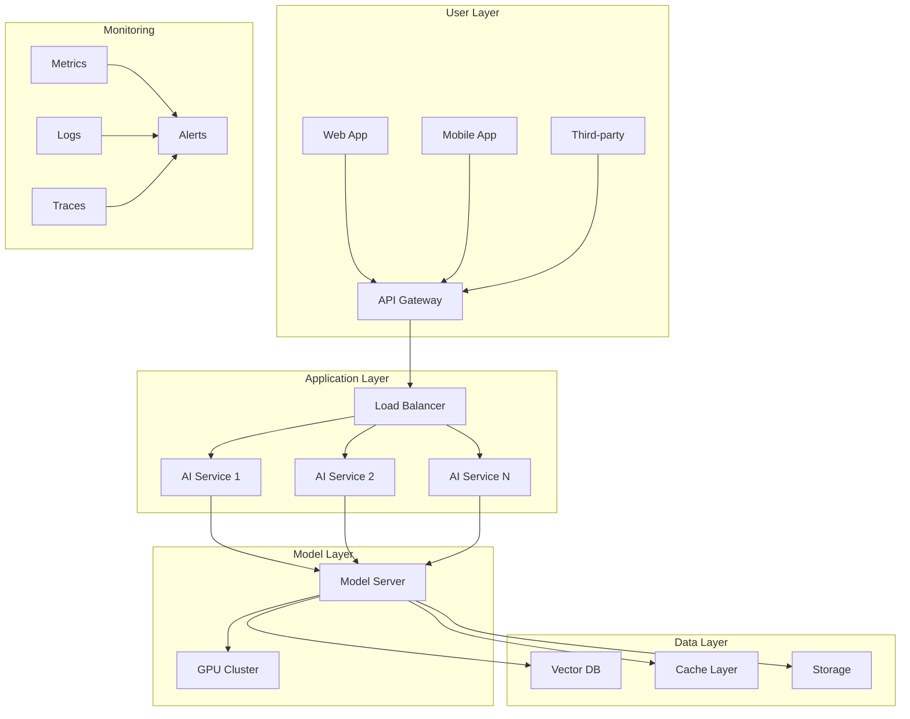

# Production Deployment Guide - Scale to Real Users

> Deploy AI models and applications that can handle production traffic efficiently and reliably

## 🎯 What You'll Achieve

By the end of this guide, you'll have:

- Production-ready AI model serving infrastructure
- Monitoring and observability systems
- Scaling strategies for high-traffic applications
- Security and compliance frameworks
- Cost optimization techniques

**Difficulty**: 🔴 Advanced | **Time**: 12+ hours | **Prerequisites**: DevOps experience, cloud platforms

---

## 🏗️ Deployment Architecture

### Production-Ready Stack



### Key Components

**API Gateway**: Authentication, rate limiting, routing
**Load Balancer**: Traffic distribution, health checks
**Model Server**: Optimized inference serving
**Cache Layer**: Response caching, session management
**Monitoring**: Metrics, logs, alerts, tracing

---

## 🚀 Model Serving Solutions

### High-Performance Servers

| Solution | Best For | Strengths | Limitations |
|----------|----------|-----------|-------------|
| [vLLM](https://github.com/vllm-project/vllm) | High-throughput LLM serving | Fastest inference, batching | GPU memory intensive |
| [TensorRT-LLM](https://github.com/NVIDIA/TensorRT-LLM) | NVIDIA GPUs | Optimized for NVIDIA, fast | NVIDIA-specific |
| [Ollama](https://ollama.com/) | Simple deployment | Easy setup, good for development | Limited scaling |
| [SkyPilot](https://skypilot.readthedocs.io/en/latest/) | Multi-cloud | Cloud agnostic, cost optimization | Complex setup |

### vLLM Production Setup

```yaml
# docker-compose.yml
version: '3.8'
services:
  vllm-server:
    image: vllm/vllm-openai:latest
    command: [
      "--model", "mistralai/Mistral-7B-Instruct-v0.1",
      "--port", "8000",
      "--host", "0.0.0.0",
      "--tensor-parallel-size", "2",
      "--max-model-len", "4096",
      "--gpu-memory-utilization", "0.9"
    ]
    ports:
      - "8000:8000"
    volumes:
      - ./models:/models
    deploy:
      resources:
        reservations:
          devices:
            - driver: nvidia
              count: 2
              capabilities: [gpu]
    healthcheck:
      test: ["CMD", "curl", "-f", "http://localhost:8000/health"]
      interval: 30s
      timeout: 10s
      retries: 3
```

### Load Balancer Configuration

```nginx
# nginx.conf
upstream ai_backend {
    least_conn;
    server ai-server-1:8000 max_fails=3 fail_timeout=30s;
    server ai-server-2:8000 max_fails=3 fail_timeout=30s;
    server ai-server-3:8000 max_fails=3 fail_timeout=30s;
}

server {
    listen 80;
    server_name api.yourcompany.com;
    
    # Rate limiting
    limit_req_zone $binary_remote_addr zone=api:10m rate=10r/s;
    
    location /v1/ {
        limit_req zone=api burst=20 nodelay;
        
        proxy_pass http://ai_backend;
        proxy_set_header Host $host;
        proxy_set_header X-Real-IP $remote_addr;
        proxy_set_header X-Forwarded-For $proxy_add_x_forwarded_for;
        
        # Timeout settings
        proxy_connect_timeout 30s;
        proxy_send_timeout 60s;
        proxy_read_timeout 60s;
        
        # Buffering
        proxy_buffering on;
        proxy_buffer_size 4k;
        proxy_buffers 8 4k;
    }
    
    location /health {
        access_log off;
        return 200 "healthy\n";
        add_header Content-Type text/plain;
    }
}
```

---

## ☁️ Cloud Deployment Options

### AWS Deployment

```yaml
# aws-infrastructure.yml (AWS CDK/CloudFormation)
Resources:
  AIModelCluster:
    Type: AWS::ECS::Cluster
    Properties:
      ClusterName: ai-model-cluster
      CapacityProviders:
        - EC2
        - FARGATE
      
  AIModelService:
    Type: AWS::ECS::Service
    Properties:
      Cluster: !Ref AIModelCluster
      TaskDefinition: !Ref AIModelTaskDefinition
      DesiredCount: 3
      LaunchType: EC2
      LoadBalancers:
        - ContainerName: ai-model
          ContainerPort: 8000
          TargetGroupArn: !Ref AIModelTargetGroup
          
  AIModelTargetGroup:
    Type: AWS::ElasticLoadBalancingV2::TargetGroup
    Properties:
      Port: 8000
      Protocol: HTTP
      VpcId: !Ref VPC
      HealthCheckPath: /health
      HealthCheckIntervalSeconds: 30
      HealthCheckTimeoutSeconds: 5
      HealthyThresholdCount: 2
      UnhealthyThresholdCount: 3
```

### Google Cloud Platform

```yaml
# gcp-deployment.yaml
apiVersion: apps/v1
kind: Deployment
metadata:
  name: ai-model-deployment
spec:
  replicas: 3
  selector:
    matchLabels:
      app: ai-model
  template:
    metadata:
      labels:
        app: ai-model
    spec:
      containers:
      - name: ai-model
        image: gcr.io/your-project/ai-model:latest
        ports:
        - containerPort: 8000
        resources:
          requests:
            memory: "4Gi"
            cpu: "2"
            nvidia.com/gpu: "1"
          limits:
            memory: "8Gi"
            cpu: "4"
            nvidia.com/gpu: "1"
        env:
        - name: MODEL_NAME
          value: "mistralai/Mistral-7B-Instruct-v0.1"
        - name: MAX_MODEL_LEN
          value: "4096"
        livenessProbe:
          httpGet:
            path: /health
            port: 8000
          initialDelaySeconds: 60
          periodSeconds: 30
        readinessProbe:
          httpGet:
            path: /health
            port: 8000
          initialDelaySeconds: 30
          periodSeconds: 10
---
apiVersion: v1
kind: Service
metadata:
  name: ai-model-service
spec:
  selector:
    app: ai-model
  ports:
  - port: 80
    targetPort: 8000
  type: LoadBalancer
```

### Azure Container Instances

```yaml
# azure-deployment.yml
apiVersion: '2019-12-01'
location: eastus
name: ai-model-group
properties:
  containers:
  - name: ai-model
    properties:
      image: your-registry.azurecr.io/ai-model:latest
      ports:
      - port: 8000
        protocol: TCP
      resources:
        requests:
          cpu: 4
          memoryInGB: 16
          gpu:
            count: 1
            sku: K80
      environmentVariables:
      - name: MODEL_NAME
        value: mistralai/Mistral-7B-Instruct-v0.1
  osType: Linux
  ipAddress:
    type: Public
    ports:
    - port: 8000
      protocol: TCP
  restartPolicy: Always
type: Microsoft.ContainerInstance/containerGroups
```

---

## 📊 Monitoring & Observability

### Metrics Collection

```python
# monitoring.py
import time
import psutil
import logging
from prometheus_client import Counter, Histogram, Gauge, generate_latest

# Metrics
REQUEST_COUNT = Counter('ai_requests_total', 'Total AI requests', ['method', 'endpoint'])
REQUEST_LATENCY = Histogram('ai_request_duration_seconds', 'Request latency')
GPU_UTILIZATION = Gauge('gpu_utilization_percent', 'GPU utilization')
MODEL_ACCURACY = Gauge('model_accuracy_score', 'Model accuracy score')

class AIMetrics:
    def __init__(self):
        self.logger = logging.getLogger(__name__)
    
    def record_request(self, method: str, endpoint: str, duration: float, success: bool):
        """Record request metrics"""
        REQUEST_COUNT.labels(method=method, endpoint=endpoint).inc()
        REQUEST_LATENCY.observe(duration)
        
        if success:
            self.logger.info(f"Request {method} {endpoint} completed in {duration:.3f}s")
        else:
            self.logger.error(f"Request {method} {endpoint} failed after {duration:.3f}s")
    
    def update_gpu_metrics(self):
        """Update GPU utilization metrics"""
        try:
            import nvidia_ml_py3 as nvml
            nvml.nvmlInit()
            handle = nvml.nvmlDeviceGetHandleByIndex(0)
            util = nvml.nvmlDeviceGetUtilizationRates(handle)
            GPU_UTILIZATION.set(util.gpu)
        except Exception as e:
            self.logger.warning(f"Could not fetch GPU metrics: {e}")
    
    def export_metrics(self):
        """Export metrics for Prometheus"""
        return generate_latest()

# Usage in your API
metrics = AIMetrics()

@app.middleware("http")
async def add_process_time_header(request: Request, call_next):
    start_time = time.time()
    response = await call_next(request)
    process_time = time.time() - start_time
    
    metrics.record_request(
        method=request.method,
        endpoint=str(request.url.path),
        duration=process_time,
        success=response.status_code < 400
    )
    
    return response
```

### Logging Configuration

```python
# logging_config.py
import logging
import structlog
from pythonjsonlogger import jsonlogger

def setup_logging():
    """Configure structured logging"""
    
    # Configure structlog
    structlog.configure(
        processors=[
            structlog.stdlib.filter_by_level,
            structlog.stdlib.add_logger_name,
            structlog.stdlib.add_log_level,
            structlog.stdlib.PositionalArgumentsFormatter(),
            structlog.processors.TimeStamper(fmt="iso"),
            structlog.processors.StackInfoRenderer(),
            structlog.processors.format_exc_info,
            structlog.processors.UnicodeDecoder(),
            structlog.processors.JSONRenderer()
        ],
        context_class=dict,
        logger_factory=structlog.stdlib.LoggerFactory(),
        wrapper_class=structlog.stdlib.BoundLogger,
        cache_logger_on_first_use=True,
    )
    
    # Root logger
    logger = logging.getLogger()
    logger.setLevel(logging.INFO)
    
    # Console handler with JSON formatter
    handler = logging.StreamHandler()
    formatter = jsonlogger.JsonFormatter(
        '%(asctime)s %(name)s %(levelname)s %(message)s'
    )
    handler.setFormatter(formatter)
    logger.addHandler(handler)

# Usage
setup_logging()
logger = structlog.get_logger()

@app.post("/generate")
async def generate_text(request: GenerateRequest):
    logger.info("Generation request received", 
                user_id=request.user_id, 
                model=request.model)
    
    try:
        result = await model.generate(request.prompt)
        logger.info("Generation completed successfully", 
                   user_id=request.user_id,
                   tokens_generated=len(result.split()))
        return result
    except Exception as e:
        logger.error("Generation failed", 
                    user_id=request.user_id,
                    error=str(e))
        raise
```

### Alert Configuration

```yaml
# alerts.yml (Prometheus Alertmanager)
groups:
- name: ai-model-alerts
  rules:
  - alert: HighErrorRate
    expr: rate(ai_requests_total{status=~"5.."}[5m]) > 0.1
    for: 2m
    labels:
      severity: critical
    annotations:
      summary: "High error rate detected"
      description: "Error rate is {{ $value }} requests per second"
  
  - alert: HighLatency
    expr: histogram_quantile(0.95, rate(ai_request_duration_seconds_bucket[5m])) > 10
    for: 5m
    labels:
      severity: warning
    annotations:
      summary: "High request latency"
      description: "95th percentile latency is {{ $value }} seconds"
  
  - alert: GPUUtilization
    expr: gpu_utilization_percent > 90
    for: 10m
    labels:
      severity: warning
    annotations:
      summary: "High GPU utilization"
      description: "GPU utilization is {{ $value }}%"
  
  - alert: ModelAccuracyDrop
    expr: model_accuracy_score < 0.8
    for: 5m
    labels:
      severity: critical
    annotations:
      summary: "Model accuracy dropped"
      description: "Model accuracy is {{ $value }}"
```

---

## 🔒 Security & Compliance

### Authentication & Authorization

```python
# auth.py
from fastapi import HTTPException, Depends, status
from fastapi.security import HTTPBearer, HTTPAuthorizationCredentials
import jwt
from datetime import datetime, timedelta

security = HTTPBearer()

class AuthManager:
    def __init__(self, secret_key: str):
        self.secret_key = secret_key
        self.algorithm = "HS256"
    
    def create_access_token(self, user_id: str, scopes: list = None):
        """Create JWT access token"""
        payload = {
            "user_id": user_id,
            "scopes": scopes or [],
            "exp": datetime.utcnow() + timedelta(hours=1),
            "iat": datetime.utcnow()
        }
        return jwt.encode(payload, self.secret_key, algorithm=self.algorithm)
    
    def verify_token(self, credentials: HTTPAuthorizationCredentials = Depends(security)):
        """Verify JWT token"""
        try:
            payload = jwt.decode(
                credentials.credentials, 
                self.secret_key, 
                algorithms=[self.algorithm]
            )
            user_id = payload.get("user_id")
            scopes = payload.get("scopes", [])
            
            if user_id is None:
                raise HTTPException(
                    status_code=status.HTTP_401_UNAUTHORIZED,
                    detail="Invalid authentication credentials"
                )
            
            return {"user_id": user_id, "scopes": scopes}
            
        except jwt.ExpiredSignatureError:
            raise HTTPException(
                status_code=status.HTTP_401_UNAUTHORIZED,
                detail="Token has expired"
            )
        except jwt.JWTError:
            raise HTTPException(
                status_code=status.HTTP_401_UNAUTHORIZED,
                detail="Invalid token"
            )

auth_manager = AuthManager(secret_key="your-secret-key")

@app.post("/generate")
async def generate_text(
    request: GenerateRequest,
    user_info: dict = Depends(auth_manager.verify_token)
):
    # Check if user has required scope
    if "ai:generate" not in user_info["scopes"]:
        raise HTTPException(
            status_code=status.HTTP_403_FORBIDDEN,
            detail="Insufficient permissions"
        )
    
    # Process request...
```

### Rate Limiting

```python
# rate_limiting.py
import asyncio
import time
from collections import defaultdict
from fastapi import HTTPException, Request
import redis

class RateLimiter:
    def __init__(self, redis_client):
        self.redis = redis_client
    
    async def check_rate_limit(self, key: str, limit: int, window: int):
        """Check if request is within rate limit"""
        current_time = int(time.time())
        window_start = current_time - window
        
        # Remove old entries
        await self.redis.zremrangebyscore(key, 0, window_start)
        
        # Count current requests
        current_count = await self.redis.zcard(key)
        
        if current_count >= limit:
            raise HTTPException(
                status_code=429,
                detail=f"Rate limit exceeded: {limit} requests per {window} seconds"
            )
        
        # Add current request
        await self.redis.zadd(key, {str(current_time): current_time})
        await self.redis.expire(key, window)

rate_limiter = RateLimiter(redis.Redis(host='localhost', port=6379, db=0))

@app.middleware("http")
async def rate_limit_middleware(request: Request, call_next):
    # Get user identifier (IP or user ID)
    user_id = request.client.host
    if hasattr(request.state, 'user'):
        user_id = request.state.user.get('user_id', user_id)
    
    # Apply rate limiting
    await rate_limiter.check_rate_limit(
        key=f"rate_limit:{user_id}",
        limit=100,  # 100 requests
        window=3600  # per hour
    )
    
    response = await call_next(request)
    return response
```

### Data Privacy

```python
# privacy.py
import hashlib
import re
from typing import Dict, Any

class PrivacyFilter:
    def __init__(self):
        self.patterns = {
            'email': re.compile(r'\b[A-Za-z0-9._%+-]+@[A-Za-z0-9.-]+\.[A-Z|a-z]{2,}\b'),
            'phone': re.compile(r'\b\d{3}-\d{3}-\d{4}\b'),
            'ssn': re.compile(r'\b\d{3}-\d{2}-\d{4}\b'),
            'credit_card': re.compile(r'\b\d{4}[- ]?\d{4}[- ]?\d{4}[- ]?\d{4}\b')
        }
    
    def anonymize_text(self, text: str) -> str:
        """Remove or anonymize PII from text"""
        anonymized = text
        
        for pattern_name, pattern in self.patterns.items():
            anonymized = pattern.sub(f'[REDACTED_{pattern_name.upper()}]', anonymized)
        
        return anonymized
    
    def hash_sensitive_data(self, data: str) -> str:
        """Hash sensitive data for logging"""
        return hashlib.sha256(data.encode()).hexdigest()[:8]

privacy_filter = PrivacyFilter()

@app.post("/generate")
async def generate_text(request: GenerateRequest):
    # Anonymize input for logging
    safe_prompt = privacy_filter.anonymize_text(request.prompt)
    logger.info("Processing request", prompt_preview=safe_prompt[:100])
    
    # Process original request
    result = await model.generate(request.prompt)
    
    # Anonymize output if needed
    if request.anonymize_output:
        result = privacy_filter.anonymize_text(result)
    
    return {"text": result}
```

---

## 💰 Cost Optimization

### Resource Management

```python
# resource_manager.py
import asyncio
import psutil
from typing import Dict, List
import kubernetes
from kubernetes.client.rest import ApiException

class ResourceManager:
    def __init__(self):
        self.k8s_client = kubernetes.client.ApiClient()
        self.apps_v1 = kubernetes.client.AppsV1Api(self.k8s_client)
    
    def get_resource_usage(self) -> Dict[str, float]:
        """Get current resource usage"""
        return {
            'cpu_percent': psutil.cpu_percent(interval=1),
            'memory_percent': psutil.virtual_memory().percent,
            'disk_percent': psutil.disk_usage('/').percent
        }
    
    async def auto_scale(self, deployment_name: str, namespace: str = "default"):
        """Auto-scale deployment based on usage"""
        usage = self.get_resource_usage()
        
        try:
            deployment = self.apps_v1.read_namespaced_deployment(
                name=deployment_name,
                namespace=namespace
            )
            
            current_replicas = deployment.spec.replicas
            target_replicas = current_replicas
            
            # Scale up if high usage
            if usage['cpu_percent'] > 80 or usage['memory_percent'] > 80:
                target_replicas = min(current_replicas + 1, 10)
            
            # Scale down if low usage
            elif usage['cpu_percent'] < 20 and usage['memory_percent'] < 20:
                target_replicas = max(current_replicas - 1, 1)
            
            if target_replicas != current_replicas:
                deployment.spec.replicas = target_replicas
                self.apps_v1.patch_namespaced_deployment(
                    name=deployment_name,
                    namespace=namespace,
                    body=deployment
                )
                
                logger.info(f"Scaled {deployment_name} from {current_replicas} to {target_replicas}")
                
        except ApiException as e:
            logger.error(f"Failed to scale deployment: {e}")

# Usage
resource_manager = ResourceManager()

@app.on_event("startup")
async def startup_event():
    # Start auto-scaling task
    asyncio.create_task(auto_scale_loop())

async def auto_scale_loop():
    while True:
        await resource_manager.auto_scale("ai-model-deployment")
        await asyncio.sleep(60)  # Check every minute
```

### Cost Monitoring

```python
# cost_monitor.py
import boto3
from datetime import datetime, timedelta
from dataclasses import dataclass
from typing import List, Dict

@dataclass
class CostMetric:
    service: str
    cost: float
    currency: str
    start_date: datetime
    end_date: datetime

class CostMonitor:
    def __init__(self, aws_profile: str = None):
        self.session = boto3.Session(profile_name=aws_profile)
        self.cost_explorer = self.session.client('ce')
    
    def get_monthly_costs(self, services: List[str] = None) -> List[CostMetric]:
        """Get monthly costs for specified services"""
        end_date = datetime.now()
        start_date = end_date - timedelta(days=30)
        
        try:
            response = self.cost_explorer.get_cost_and_usage(
                TimePeriod={
                    'Start': start_date.strftime('%Y-%m-%d'),
                    'End': end_date.strftime('%Y-%m-%d')
                },
                Granularity='MONTHLY',
                Metrics=['BlendedCost'],
                GroupBy=[
                    {
                        'Type': 'DIMENSION',
                        'Key': 'SERVICE'
                    }
                ]
            )
            
            costs = []
            for result in response['ResultsByTime']:
                for group in result['Groups']:
                    service = group['Keys'][0]
                    cost = float(group['Metrics']['BlendedCost']['Amount'])
                    
                    if services is None or service in services:
                        costs.append(CostMetric(
                            service=service,
                            cost=cost,
                            currency=group['Metrics']['BlendedCost']['Unit'],
                            start_date=start_date,
                            end_date=end_date
                        ))
            
            return costs
            
        except Exception as e:
            logger.error(f"Failed to get cost data: {e}")
            return []
    
    def get_cost_alerts(self, threshold: float = 100.0) -> List[str]:
        """Get cost alerts if spending exceeds threshold"""
        costs = self.get_monthly_costs()
        alerts = []
        
        total_cost = sum(cost.cost for cost in costs)
        if total_cost > threshold:
            alerts.append(f"Monthly cost ${total_cost:.2f} exceeds threshold ${threshold:.2f}")
        
        for cost in costs:
            if cost.cost > threshold * 0.5:  # Alert if single service > 50% of threshold
                alerts.append(f"{cost.service} cost ${cost.cost:.2f} is high")
        
        return alerts

# Usage
cost_monitor = CostMonitor()

@app.get("/admin/costs")
async def get_costs():
    costs = cost_monitor.get_monthly_costs(['Amazon Elastic Compute Cloud', 'Amazon SageMaker'])
    alerts = cost_monitor.get_cost_alerts(threshold=500.0)
    
    return {
        "costs": costs,
        "alerts": alerts,
        "total_cost": sum(cost.cost for cost in costs)
    }
```

---

## 🔄 Continuous Deployment

### CI/CD Pipeline

```yaml
# .github/workflows/deploy.yml
name: Deploy AI Model

on:
  push:
    branches: [main]
  pull_request:
    branches: [main]

jobs:
  test:
    runs-on: ubuntu-latest
    steps:
    - uses: actions/checkout@v3
    
    - name: Set up Python
      uses: actions/setup-python@v4
      with:
        python-version: '3.11'
    
    - name: Install dependencies
      run: |
        pip install -r requirements.txt
        pip install -r requirements-test.txt
    
    - name: Run tests
      run: |
        pytest tests/ --cov=src/ --cov-report=xml
    
    - name: Upload coverage
      uses: codecov/codecov-action@v3
      with:
        file: ./coverage.xml

  build:
    needs: test
    runs-on: ubuntu-latest
    if: github.ref == 'refs/heads/main'
    
    steps:
    - uses: actions/checkout@v3
    
    - name: Set up Docker Buildx
      uses: docker/setup-buildx-action@v2
    
    - name: Login to Container Registry
      uses: docker/login-action@v2
      with:
        registry: ghcr.io
        username: ${{ github.actor }}
        password: ${{ secrets.GITHUB_TOKEN }}
    
    - name: Build and push
      uses: docker/build-push-action@v4
      with:
        context: .
        push: true
        tags: ghcr.io/${{ github.repository }}/ai-model:${{ github.sha }}
        cache-from: type=gha
        cache-to: type=gha,mode=max

  deploy:
    needs: build
    runs-on: ubuntu-latest
    if: github.ref == 'refs/heads/main'
    
    steps:
    - uses: actions/checkout@v3
    
    - name: Deploy to Kubernetes
      uses: azure/k8s-deploy@v1
      with:
        manifests: |
          k8s/deployment.yaml
          k8s/service.yaml
        images: |
          ghcr.io/${{ github.repository }}/ai-model:${{ github.sha }}
        kubectl-version: 'latest'
```

### Blue-Green Deployment

```python
# blue_green_deploy.py
import asyncio
import aiohttp
from typing import Dict, List
import logging

class BlueGreenDeployment:
    def __init__(self, k8s_client):
        self.k8s_client = k8s_client
        self.logger = logging.getLogger(__name__)
    
    async def deploy_green(self, image_tag: str, namespace: str = "default"):
        """Deploy green version alongside blue"""
        
        # Deploy green version
        green_deployment = self._create_deployment_manifest("green", image_tag)
        await self._apply_deployment(green_deployment, namespace)
        
        # Wait for green to be ready
        await self._wait_for_deployment_ready("ai-model-green", namespace)
        
        # Run health checks
        if await self._health_check_green(namespace):
            self.logger.info("Green deployment health check passed")
            return True
        else:
            self.logger.error("Green deployment health check failed")
            await self._cleanup_green(namespace)
            return False
    
    async def switch_traffic(self, namespace: str = "default"):
        """Switch traffic from blue to green"""
        
        # Update service selector to point to green
        service_patch = {
            "spec": {
                "selector": {
                    "app": "ai-model",
                    "version": "green"
                }
            }
        }
        
        await self._patch_service("ai-model-service", service_patch, namespace)
        self.logger.info("Traffic switched to green deployment")
    
    async def cleanup_blue(self, namespace: str = "default"):
        """Remove blue deployment after successful switch"""
        await asyncio.sleep(300)  # Wait 5 minutes for traffic to settle
        
        await self._delete_deployment("ai-model-blue", namespace)
        self.logger.info("Blue deployment cleaned up")
    
    async def rollback(self, namespace: str = "default"):
        """Rollback to blue deployment"""
        
        # Switch service back to blue
        service_patch = {
            "spec": {
                "selector": {
                    "app": "ai-model",
                    "version": "blue"
                }
            }
        }
        
        await self._patch_service("ai-model-service", service_patch, namespace)
        await self._cleanup_green(namespace)
        
        self.logger.info("Rolled back to blue deployment")
    
    async def _health_check_green(self, namespace: str) -> bool:
        """Perform health check on green deployment"""
        try:
            # Get green service endpoint
            green_service = await self._get_service("ai-model-green", namespace)
            endpoint = f"http://{green_service.status.load_balancer.ingress[0].ip}/health"
            
            async with aiohttp.ClientSession() as session:
                async with session.get(endpoint, timeout=30) as response:
                    if response.status == 200:
                        # Additional validation
                        test_response = await self._test_model_inference(endpoint)
                        return test_response.get('status') == 'healthy'
            
            return False
            
        except Exception as e:
            self.logger.error(f"Health check failed: {e}")
            return False
    
    async def _test_model_inference(self, endpoint: str) -> Dict:
        """Test model inference on green deployment"""
        test_payload = {
            "prompt": "Hello, world!",
            "max_tokens": 10
        }
        
        async with aiohttp.ClientSession() as session:
            async with session.post(
                f"{endpoint}/v1/completions",
                json=test_payload,
                timeout=60
            ) as response:
                if response.status == 200:
                    result = await response.json()
                    return {"status": "healthy", "response": result}
                else:
                    return {"status": "unhealthy", "error": await response.text()}

# Usage
deployment_manager = BlueGreenDeployment(k8s_client)

async def deploy_new_version(image_tag: str):
    """Deploy new version using blue-green strategy"""
    
    # Deploy green version
    if await deployment_manager.deploy_green(image_tag):
        # Switch traffic to green
        await deployment_manager.switch_traffic()
        
        # Cleanup old blue version
        asyncio.create_task(deployment_manager.cleanup_blue())
        
        return {"status": "success", "message": "Deployment completed successfully"}
    else:
        return {"status": "failed", "message": "Deployment failed health checks"}
```

---

## 🎯 Success Checklist

### Infrastructure

- [ ] Model serving infrastructure deployed
- [ ] Load balancer configured with health checks
- [ ] Auto-scaling policies implemented
- [ ] Security measures in place (auth, rate limiting)
- [ ] Monitoring and alerting configured

### Performance

- [ ] Sub-second response times achieved
- [ ] High availability (99.9%+ uptime)
- [ ] Horizontal scaling validated
- [ ] Cost optimization measures implemented
- [ ] Resource utilization monitored

### Security & Compliance

- [ ] Authentication and authorization implemented
- [ ] Data privacy measures in place
- [ ] Audit logging configured
- [ ] Compliance requirements met
- [ ] Security testing completed

### Operations

- [ ] CI/CD pipeline configured
- [ ] Blue-green deployment process
- [ ] Rollback procedures tested
- [ ] Disaster recovery plan
- [ ] Documentation updated

**Ready for the next level?** → [AI System Monitoring Guide](./monitoring.md)

---

*Production deployment is about reliability, scalability, and security. Start with solid foundations and iterate towards excellence.*
