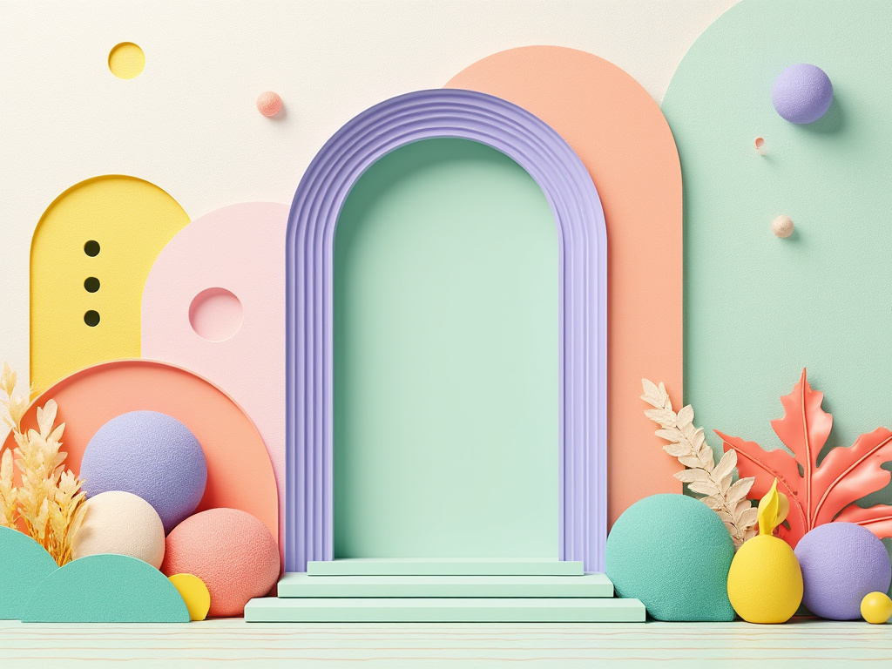

The illustration features a harmonious blend of soft pastel colors, primarily mint green and lavender, interwoven with light peach and buttery yellow accents. Central to the composition is an elegant mint green arch, symbolizing the doorway to creativity, depicted in a slightly deeper shade to stand out. Surrounding the arch, intricate geometric lines evoke the structure of buildings while maintaining an organic flow through delicate curves. Scattered throughout the pattern are whimsical floral motifs that intertwine with the architectural elements, symbolizing the unity of art and nature. Soft coral dots punctuate the design, guiding the eye through the layers and creating a sense of rhythmic movement. The entire illustration emanates a calming yet inspiring energy, inviting viewers to explore the rich interplay between architecture and art, gently merging form with creative expression

