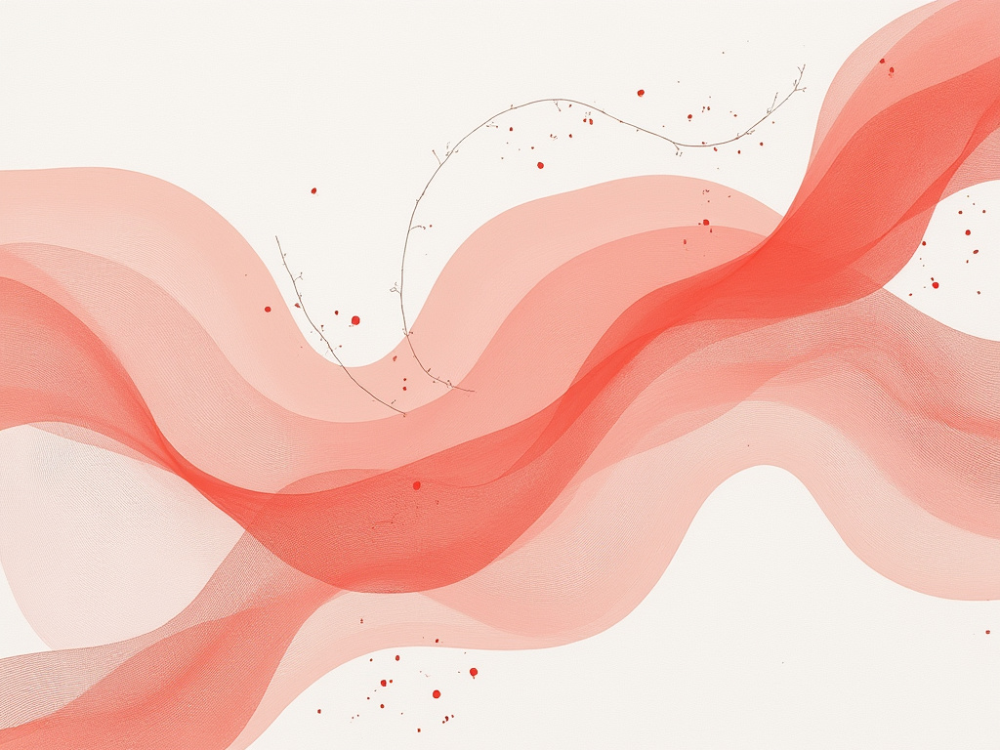
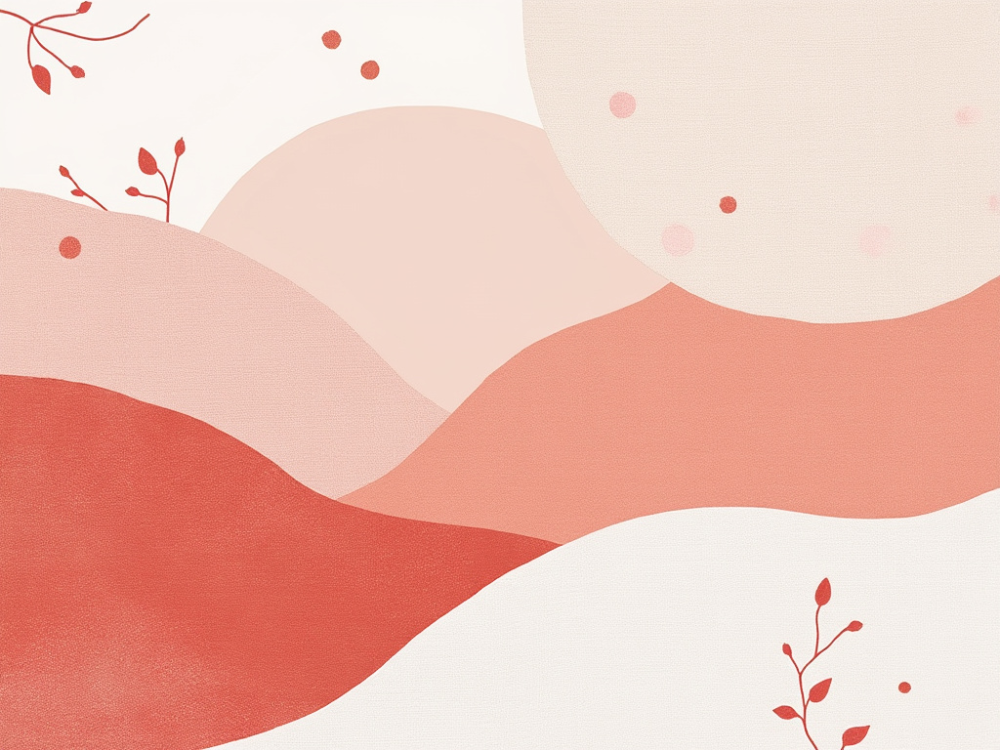
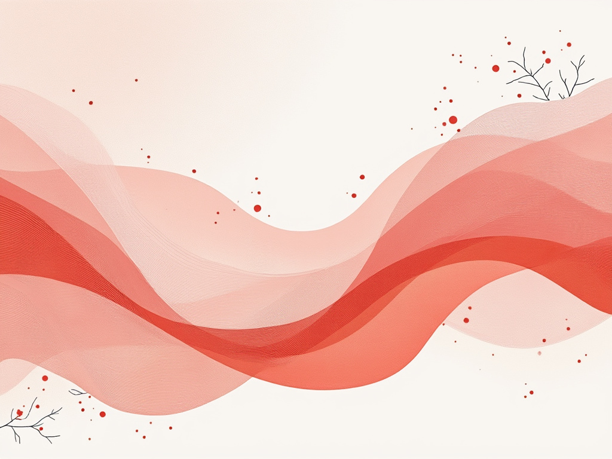

The illustration is a mesmerizing composition that embodies the principles of Modern Art through its soft, flowing patterns and gentle pastel palette. The background is a pristine soft white, serving as a canvas for the delicate interplay of light coral and blush tones. Curved shapes resemble wispy clouds or petals, meandering gracefully across the surface. The focal point—a bold, sweeping shape in deep coral—dominates the center, inviting exploration as softer forms curl around it. Enhanced by a subtle texture reminiscent of fabric, this focal element creates a striking contrast against the soothing pastel backdrop. Scattered dew-like circles glisten faintly, while delicate lines evoke the veins of leaves, contributing to an organic whole. The overall effect is tranquil yet stimulating, encouraging viewers to lose themselves in the beauty and abstraction of the pattern—truly a testament to Modern Art’s exploration of form, color, and emotional resonance

