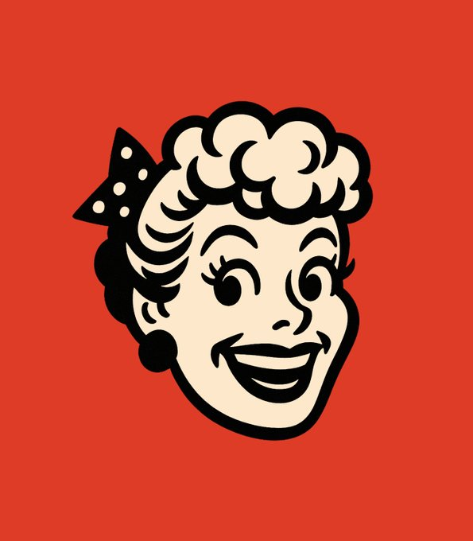

50s style mascot heads with GPT-4o. PROMPT: Create a high-contrast cartoon head of [einstein] inspired by mid-20th century advertising mascots. The head should be highly stylized with bold black outlines and minimal details, using a thick inked look. Keep the face cheerful and expressive with exaggerated features (large eyes, wide smile). Place the head against a solid red background. Avoid unnecessary textures or gradients. No neck. No body. Focus on clean shapes and strong silhouette for instant recognition. Square aspect ratio.

