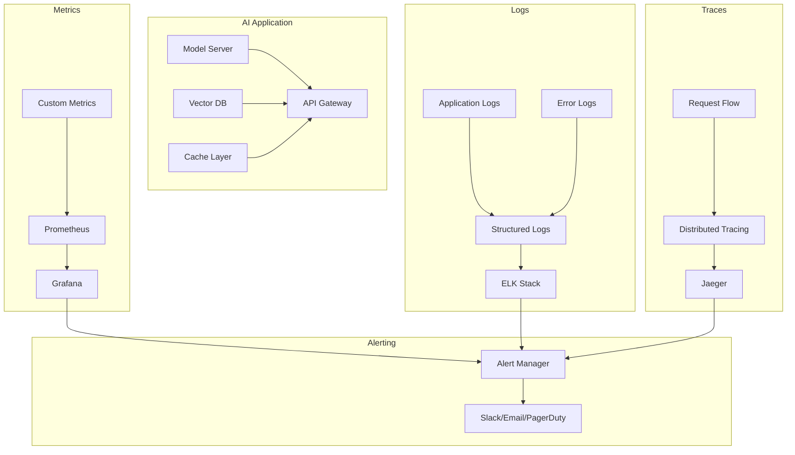

# AI System Monitoring Guide - Ensure Reliability & Performance

> Implement comprehensive monitoring to maintain AI system reliability, track performance, and detect issues before they impact users

## 🎯 What You'll Achieve

By the end of this guide, you'll have:

- Complete observability stack for AI applications
- Real-time performance monitoring and alerting
- Quality assurance metrics and validation
- Cost tracking and optimization insights
- Automated incident response workflows

**Difficulty**: 🟡 Intermediate | **Time**: 6-8 hours | **Prerequisites**: Basic DevOps knowledge

---

## 📊 Monitoring Architecture

### The Three Pillars of Observability



### Key Components

**Metrics**: Quantitative data about system behavior
**Logs**: Detailed records of events and errors
**Traces**: Request journey through distributed systems
**Alerts**: Automated notifications for issues

---

## 📈 Essential Metrics

### Application Performance Metrics

```python
# metrics.py
from prometheus_client import Counter, Histogram, Gauge, Info
import time
import functools

# Core metrics
REQUEST_COUNT = Counter(
    'ai_requests_total', 
    'Total AI requests',
    ['method', 'endpoint', 'status']
)

REQUEST_LATENCY = Histogram(
    'ai_request_duration_seconds',
    'Request latency in seconds',
    ['endpoint', 'model']
)

ACTIVE_CONNECTIONS = Gauge(
    'ai_active_connections',
    'Number of active connections'
)

MODEL_INFO = Info(
    'ai_model_info',
    'Information about the AI model'
)

# AI-specific metrics
TOKENS_PROCESSED = Counter(
    'ai_tokens_processed_total',
    'Total tokens processed',
    ['model', 'operation']
)

MODEL_ACCURACY = Gauge(
    'ai_model_accuracy_score',
    'Current model accuracy score'
)

QUEUE_SIZE = Gauge(
    'ai_request_queue_size',
    'Number of requests in queue'
)

ERROR_RATE = Gauge(
    'ai_error_rate',
    'Current error rate percentage'
)

class MetricsCollector:
    def __init__(self):
        self.start_time = time.time()
    
    def record_request(self, method: str, endpoint: str, status: int, duration: float, model: str = "default"):
        """Record request metrics"""
        REQUEST_COUNT.labels(
            method=method, 
            endpoint=endpoint, 
            status=str(status)
        ).inc()
        
        REQUEST_LATENCY.labels(
            endpoint=endpoint,
            model=model
        ).observe(duration)
    
    def record_tokens(self, model: str, operation: str, count: int):
        """Record token usage"""
        TOKENS_PROCESSED.labels(
            model=model,
            operation=operation
        ).inc(count)
    
    def update_model_accuracy(self, accuracy: float):
        """Update model accuracy metric"""
        MODEL_ACCURACY.set(accuracy)
    
    def update_queue_size(self, size: int):
        """Update queue size metric"""
        QUEUE_SIZE.set(size)

# Decorator for automatic metrics collection
def monitor_endpoint(model: str = "default"):
    def decorator(func):
        @functools.wraps(func)
        async def wrapper(*args, **kwargs):
            start_time = time.time()
            status = 200
            
            try:
                result = await func(*args, **kwargs)
                return result
            except Exception as e:
                status = 500
                raise
            finally:
                duration = time.time() - start_time
                metrics.record_request(
                    method="POST",
                    endpoint=func.__name__,
                    status=status,
                    duration=duration,
                    model=model
                )
        return wrapper
    return decorator

metrics = MetricsCollector()
```

### Infrastructure Metrics

```python
# system_metrics.py
import psutil
import GPUtil
from prometheus_client import Gauge
import asyncio

# System metrics
CPU_USAGE = Gauge('system_cpu_usage_percent', 'CPU usage percentage')
MEMORY_USAGE = Gauge('system_memory_usage_percent', 'Memory usage percentage')
DISK_USAGE = Gauge('system_disk_usage_percent', 'Disk usage percentage')
GPU_USAGE = Gauge('system_gpu_usage_percent', 'GPU usage percentage', ['gpu_id'])
GPU_MEMORY = Gauge('system_gpu_memory_usage_percent', 'GPU memory usage', ['gpu_id'])

class SystemMonitor:
    def __init__(self, collection_interval: int = 30):
        self.collection_interval = collection_interval
        self.running = False
    
    async def start_monitoring(self):
        """Start system monitoring loop"""
        self.running = True
        while self.running:
            self.collect_system_metrics()
            self.collect_gpu_metrics()
            await asyncio.sleep(self.collection_interval)
    
    def collect_system_metrics(self):
        """Collect CPU, memory, and disk metrics"""
        CPU_USAGE.set(psutil.cpu_percent(interval=1))
        MEMORY_USAGE.set(psutil.virtual_memory().percent)
        DISK_USAGE.set(psutil.disk_usage('/').percent)
    
    def collect_gpu_metrics(self):
        """Collect GPU metrics"""
        try:
            gpus = GPUtil.getGPUs()
            for i, gpu in enumerate(gpus):
                GPU_USAGE.labels(gpu_id=str(i)).set(gpu.load * 100)
                GPU_MEMORY.labels(gpu_id=str(i)).set(gpu.memoryUtil * 100)
        except Exception as e:
            print(f"Failed to collect GPU metrics: {e}")
    
    def stop_monitoring(self):
        """Stop system monitoring"""
        self.running = False

# Usage
system_monitor = SystemMonitor()

@app.on_event("startup")
async def start_monitoring():
    asyncio.create_task(system_monitor.start_monitoring())

@app.on_event("shutdown")
async def stop_monitoring():
    system_monitor.stop_monitoring()
```

---

## 📋 Logging Strategy

### Structured Logging

```python
# logging_setup.py
import logging
import structlog
import json
from datetime import datetime
from typing import Dict, Any

def setup_structured_logging():
    """Configure structured logging for AI applications"""
    
    structlog.configure(
        processors=[
            structlog.stdlib.filter_by_level,
            structlog.stdlib.add_logger_name,
            structlog.stdlib.add_log_level,
            structlog.stdlib.PositionalArgumentsFormatter(),
            structlog.processors.TimeStamper(fmt="iso"),
            structlog.processors.StackInfoRenderer(),
            structlog.processors.format_exc_info,
            structlog.dev.ConsoleRenderer()  # Use JSONRenderer for production
        ],
        context_class=dict,
        logger_factory=structlog.stdlib.LoggerFactory(),
        wrapper_class=structlog.stdlib.BoundLogger,
        cache_logger_on_first_use=True,
    )

class AILogger:
    def __init__(self, name: str):
        self.logger = structlog.get_logger(name)
    
    def log_request(self, user_id: str, prompt: str, model: str, **kwargs):
        """Log AI request with context"""
        self.logger.info(
            "AI request received",
            user_id=user_id,
            model=model,
            prompt_length=len(prompt),
            prompt_preview=prompt[:100] + "..." if len(prompt) > 100 else prompt,
            **kwargs
        )
    
    def log_response(self, user_id: str, response: str, duration: float, tokens: int, **kwargs):
        """Log AI response with metrics"""
        self.logger.info(
            "AI response generated",
            user_id=user_id,
            response_length=len(response),
            duration=duration,
            tokens_generated=tokens,
            **kwargs
        )
    
    def log_error(self, user_id: str, error: Exception, context: Dict[str, Any] = None):
        """Log AI processing error"""
        self.logger.error(
            "AI processing error",
            user_id=user_id,
            error_type=type(error).__name__,
            error_message=str(error),
            context=context or {}
        )
    
    def log_model_performance(self, model: str, accuracy: float, latency: float, **metrics):
        """Log model performance metrics"""
        self.logger.info(
            "Model performance update",
            model=model,
            accuracy=accuracy,
            latency=latency,
            **metrics
        )

# Usage
setup_structured_logging()
ai_logger = AILogger("ai_service")

@monitor_endpoint("gpt-4")
async def generate_text(request: GenerateRequest):
    ai_logger.log_request(
        user_id=request.user_id,
        prompt=request.prompt,
        model=request.model
    )
    
    start_time = time.time()
    
    try:
        response = await model.generate(request.prompt)
        duration = time.time() - start_time
        
        ai_logger.log_response(
            user_id=request.user_id,
            response=response.text,
            duration=duration,
            tokens=response.token_count
        )
        
        return response
        
    except Exception as e:
        ai_logger.log_error(
            user_id=request.user_id,
            error=e,
            context={"model": request.model, "prompt_length": len(request.prompt)}
        )
        raise
```

### Log Aggregation

```yaml
# docker-compose-logging.yml
version: '3.8'
services:
  elasticsearch:
    image: docker.elastic.co/elasticsearch/elasticsearch:8.8.0
    environment:
      - discovery.type=single-node
      - xpack.security.enabled=false
    ports:
      - "9200:9200"
    volumes:
      - elasticsearch_data:/usr/share/elasticsearch/data

  logstash:
    image: docker.elastic.co/logstash/logstash:8.8.0
    ports:
      - "5044:5044"
    volumes:
      - ./logstash.conf:/usr/share/logstash/pipeline/logstash.conf
    depends_on:
      - elasticsearch

  kibana:
    image: docker.elastic.co/kibana/kibana:8.8.0
    ports:
      - "5601:5601"
    environment:
      - ELASTICSEARCH_HOSTS=http://elasticsearch:9200
    depends_on:
      - elasticsearch

  filebeat:
    image: docker.elastic.co/beats/filebeat:8.8.0
    user: root
    volumes:
      - ./filebeat.yml:/usr/share/filebeat/filebeat.yml:ro
      - /var/lib/docker/containers:/var/lib/docker/containers:ro
      - /var/run/docker.sock:/var/run/docker.sock:ro
    depends_on:
      - logstash

volumes:
  elasticsearch_data:
```

---

## 🔍 Quality Monitoring

### Model Performance Tracking

```python
# quality_monitor.py
import numpy as np
from typing import List, Dict, Tuple
import asyncio
from dataclasses import dataclass
from datetime import datetime, timedelta

@dataclass
class QualityMetric:
    timestamp: datetime
    metric_name: str
    value: float
    model: str
    context: Dict

class QualityMonitor:
    def __init__(self, evaluation_interval: int = 3600):
        self.evaluation_interval = evaluation_interval
        self.quality_history = []
        self.thresholds = {
            'accuracy': 0.85,
            'latency': 2.0,
            'error_rate': 0.05
        }
    
    async def start_quality_monitoring(self):
        """Start continuous quality monitoring"""
        while True:
            await self.evaluate_model_quality()
            await asyncio.sleep(self.evaluation_interval)
    
    async def evaluate_model_quality(self):
        """Evaluate model quality across multiple dimensions"""
        
        # Accuracy evaluation
        accuracy = await self.measure_accuracy()
        
        # Latency evaluation
        latency = await self.measure_latency()
        
        # Error rate evaluation
        error_rate = await self.measure_error_rate()
        
        # Record metrics
        timestamp = datetime.now()
        metrics = [
            QualityMetric(timestamp, 'accuracy', accuracy, 'main', {}),
            QualityMetric(timestamp, 'latency', latency, 'main', {}),
            QualityMetric(timestamp, 'error_rate', error_rate, 'main', {})
        ]
        
        self.quality_history.extend(metrics)
        
        # Update Prometheus metrics
        MODEL_ACCURACY.set(accuracy)
        ERROR_RATE.set(error_rate * 100)
        
        # Check for quality degradation
        await self.check_quality_alerts(metrics)
    
    async def measure_accuracy(self) -> float:
        """Measure model accuracy using test dataset"""
        try:
            # Load test cases
            test_cases = await self.load_test_cases()
            
            correct_predictions = 0
            total_predictions = len(test_cases)
            
            for test_case in test_cases:
                prediction = await self.model_predict(test_case['input'])
                if self.evaluate_prediction(prediction, test_case['expected']):
                    correct_predictions += 1
            
            return correct_predictions / total_predictions if total_predictions > 0 else 0.0
            
        except Exception as e:
            ai_logger.log_error("quality_monitor", e, {"metric": "accuracy"})
            return 0.0
    
    async def measure_latency(self) -> float:
        """Measure average response latency"""
        try:
            latencies = []
            test_prompts = await self.get_test_prompts()
            
            for prompt in test_prompts:
                start_time = time.time()
                await self.model_predict(prompt)
                latency = time.time() - start_time
                latencies.append(latency)
            
            return np.mean(latencies) if latencies else 0.0
            
        except Exception as e:
            ai_logger.log_error("quality_monitor", e, {"metric": "latency"})
            return float('inf')
    
    async def measure_error_rate(self) -> float:
        """Measure current error rate"""
        try:
            # Get recent metrics from Prometheus
            recent_requests = await self.get_recent_request_count()
            recent_errors = await self.get_recent_error_count()
            
            if recent_requests > 0:
                return recent_errors / recent_requests
            return 0.0
            
        except Exception as e:
            ai_logger.log_error("quality_monitor", e, {"metric": "error_rate"})
            return 1.0
    
    async def check_quality_alerts(self, metrics: List[QualityMetric]):
        """Check if quality metrics breach thresholds"""
        for metric in metrics:
            threshold = self.thresholds.get(metric.metric_name)
            if threshold is None:
                continue
            
            if metric.metric_name == 'error_rate' and metric.value > threshold:
                await self.send_alert(f"High error rate: {metric.value:.2%}")
            elif metric.metric_name == 'accuracy' and metric.value < threshold:
                await self.send_alert(f"Low accuracy: {metric.value:.2%}")
            elif metric.metric_name == 'latency' and metric.value > threshold:
                await self.send_alert(f"High latency: {metric.value:.2f}s")
    
    async def send_alert(self, message: str):
        """Send quality alert"""
        ai_logger.logger.warning("Quality alert", alert=message)
        # Here you would integrate with your alerting system
        # e.g., Slack, PagerDuty, email, etc.

quality_monitor = QualityMonitor()
```

### A/B Testing Framework

```python
# ab_testing.py
import random
import hashlib
from enum import Enum
from typing import Dict, Any, Optional
from dataclasses import dataclass

class ExperimentStatus(Enum):
    DRAFT = "draft"
    RUNNING = "running"
    COMPLETED = "completed"
    PAUSED = "paused"

@dataclass
class ExperimentConfig:
    name: str
    description: str
    traffic_split: Dict[str, float]  # {"control": 0.5, "treatment": 0.5}
    start_date: datetime
    end_date: datetime
    status: ExperimentStatus
    success_metrics: List[str]

class ABTestingFramework:
    def __init__(self):
        self.experiments = {}
        self.user_assignments = {}
    
    def create_experiment(self, config: ExperimentConfig):
        """Create a new A/B test experiment"""
        self.experiments[config.name] = config
        ai_logger.logger.info("Experiment created", experiment=config.name)
    
    def assign_user_to_variant(self, experiment_name: str, user_id: str) -> str:
        """Assign user to experiment variant"""
        
        experiment = self.experiments.get(experiment_name)
        if not experiment or experiment.status != ExperimentStatus.RUNNING:
            return "control"
        
        # Check if user already assigned
        assignment_key = f"{experiment_name}:{user_id}"
        if assignment_key in self.user_assignments:
            return self.user_assignments[assignment_key]
        
        # Deterministic assignment based on user ID
        user_hash = int(hashlib.md5(user_id.encode()).hexdigest(), 16)
        assignment_ratio = user_hash % 100 / 100.0
        
        cumulative_probability = 0.0
        for variant, probability in experiment.traffic_split.items():
            cumulative_probability += probability
            if assignment_ratio <= cumulative_probability:
                self.user_assignments[assignment_key] = variant
                return variant
        
        # Fallback to control
        self.user_assignments[assignment_key] = "control"
        return "control"
    
    def track_conversion(self, experiment_name: str, user_id: str, metric: str, value: float):
        """Track conversion event for experiment"""
        variant = self.user_assignments.get(f"{experiment_name}:{user_id}", "control")
        
        ai_logger.logger.info(
            "Experiment conversion",
            experiment=experiment_name,
            user_id=user_id,
            variant=variant,
            metric=metric,
            value=value
        )

# Usage
ab_testing = ABTestingFramework()

# Create experiment
experiment_config = ExperimentConfig(
    name="model_comparison_v1",
    description="Compare GPT-4 vs Claude-3 for code generation",
    traffic_split={"gpt4": 0.5, "claude3": 0.5},
    start_date=datetime.now(),
    end_date=datetime.now() + timedelta(days=14),
    status=ExperimentStatus.RUNNING,
    success_metrics=["accuracy", "latency", "user_satisfaction"]
)

ab_testing.create_experiment(experiment_config)

@app.post("/generate_code")
async def generate_code(request: CodeGenerationRequest):
    # Assign user to experiment variant
    variant = ab_testing.assign_user_to_variant("model_comparison_v1", request.user_id)
    
    # Use different models based on variant
    if variant == "gpt4":
        model = gpt4_model
    else:
        model = claude3_model
    
    start_time = time.time()
    result = await model.generate(request.prompt)
    latency = time.time() - start_time
    
    # Track metrics
    ab_testing.track_conversion("model_comparison_v1", request.user_id, "latency", latency)
    
    return result
```

---

## 🚨 Alerting System

### Alert Configuration

```python
# alerting.py
from enum import Enum
from dataclasses import dataclass
from typing import List, Dict, Callable, Any
import aiohttp
import asyncio

class AlertSeverity(Enum):
    LOW = "low"
    MEDIUM = "medium"
    HIGH = "high"
    CRITICAL = "critical"

@dataclass
class Alert:
    name: str
    severity: AlertSeverity
    message: str
    metadata: Dict[str, Any]
    timestamp: datetime

class AlertManager:
    def __init__(self):
        self.alert_rules = {}
        self.notification_channels = {}
        self.active_alerts = {}
    
    def add_alert_rule(self, name: str, condition: Callable, severity: AlertSeverity, 
                      cooldown: int = 300):
        """Add alert rule with condition function"""
        self.alert_rules[name] = {
            'condition': condition,
            'severity': severity,
            'cooldown': cooldown,
            'last_triggered': None
        }
    
    def add_notification_channel(self, name: str, webhook_url: str, channel_type: str = "slack"):
        """Add notification channel"""
        self.notification_channels[name] = {
            'url': webhook_url,
            'type': channel_type
        }
    
    async def check_alerts(self):
        """Check all alert rules"""
        for rule_name, rule in self.alert_rules.items():
            try:
                # Check if cooldown period has passed
                if (rule['last_triggered'] and 
                    datetime.now() - rule['last_triggered'] < timedelta(seconds=rule['cooldown'])):
                    continue
                
                # Evaluate condition
                if await rule['condition']():
                    alert = Alert(
                        name=rule_name,
                        severity=rule['severity'],
                        message=f"Alert triggered: {rule_name}",
                        metadata={},
                        timestamp=datetime.now()
                    )
                    
                    await self.fire_alert(alert)
                    rule['last_triggered'] = datetime.now()
                    
            except Exception as e:
                ai_logger.log_error("alert_manager", e, {"rule": rule_name})
    
    async def fire_alert(self, alert: Alert):
        """Fire alert to all notification channels"""
        self.active_alerts[alert.name] = alert
        
        for channel_name, channel in self.notification_channels.items():
            await self.send_notification(alert, channel)
    
    async def send_notification(self, alert: Alert, channel: Dict):
        """Send notification to specific channel"""
        if channel['type'] == 'slack':
            await self.send_slack_notification(alert, channel['url'])
        elif channel['type'] == 'webhook':
            await self.send_webhook_notification(alert, channel['url'])
    
    async def send_slack_notification(self, alert: Alert, webhook_url: str):
        """Send Slack notification"""
        color_map = {
            AlertSeverity.LOW: "good",
            AlertSeverity.MEDIUM: "warning", 
            AlertSeverity.HIGH: "danger",
            AlertSeverity.CRITICAL: "danger"
        }
        
        payload = {
            "attachments": [
                {
                    "color": color_map.get(alert.severity, "warning"),
                    "title": f"🚨 {alert.severity.value.upper()} Alert",
                    "text": alert.message,
                    "fields": [
                        {
                            "title": "Alert Name",
                            "value": alert.name,
                            "short": True
                        },
                        {
                            "title": "Time",
                            "value": alert.timestamp.isoformat(),
                            "short": True
                        }
                    ]
                }
            ]
        }
        
        async with aiohttp.ClientSession() as session:
            await session.post(webhook_url, json=payload)

# Alert conditions
async def high_error_rate_condition() -> bool:
    """Check if error rate is above threshold"""
    error_rate = await get_current_error_rate()
    return error_rate > 0.05

async def high_latency_condition() -> bool:
    """Check if latency is above threshold"""
    avg_latency = await get_average_latency()
    return avg_latency > 5.0

async def low_accuracy_condition() -> bool:
    """Check if model accuracy dropped"""
    accuracy = await get_current_accuracy()
    return accuracy < 0.80

# Setup alerts
alert_manager = AlertManager()

# Add alert rules
alert_manager.add_alert_rule("high_error_rate", high_error_rate_condition, AlertSeverity.HIGH)
alert_manager.add_alert_rule("high_latency", high_latency_condition, AlertSeverity.MEDIUM)
alert_manager.add_alert_rule("low_accuracy", low_accuracy_condition, AlertSeverity.CRITICAL)

# Add notification channels
alert_manager.add_notification_channel(
    "ops_slack", 
    "https://hooks.slack.com/services/YOUR/SLACK/WEBHOOK"
)

# Start alert monitoring
@app.on_event("startup")
async def start_alert_monitoring():
    async def alert_loop():
        while True:
            await alert_manager.check_alerts()
            await asyncio.sleep(60)  # Check every minute
    
    asyncio.create_task(alert_loop())
```

---

## 📊 Dashboards & Visualization

### Grafana Dashboard Configuration

```json
{
  "dashboard": {
    "id": null,
    "title": "AI Model Performance Dashboard",
    "tags": ["ai", "monitoring"],
    "timezone": "browser",
    "panels": [
      {
        "id": 1,
        "title": "Request Rate",
        "type": "graph",
        "targets": [
          {
            "expr": "rate(ai_requests_total[5m])",
            "legendFormat": "{{endpoint}} - {{status}}"
          }
        ],
        "yAxes": [
          {
            "label": "Requests/sec"
          }
        ]
      },
      {
        "id": 2,
        "title": "Response Latency",
        "type": "graph",
        "targets": [
          {
            "expr": "histogram_quantile(0.95, rate(ai_request_duration_seconds_bucket[5m]))",
            "legendFormat": "95th percentile"
          },
          {
            "expr": "histogram_quantile(0.50, rate(ai_request_duration_seconds_bucket[5m]))",
            "legendFormat": "50th percentile"
          }
        ]
      },
      {
        "id": 3,
        "title": "Error Rate",
        "type": "singlestat",
        "targets": [
          {
            "expr": "rate(ai_requests_total{status=~\"5..\"}[5m]) / rate(ai_requests_total[5m]) * 100",
            "legendFormat": "Error Rate %"
          }
        ],
        "thresholds": "5,10"
      },
      {
        "id": 4,
        "title": "Model Accuracy",
        "type": "singlestat",
        "targets": [
          {
            "expr": "ai_model_accuracy_score",
            "legendFormat": "Accuracy"
          }
        ],
        "thresholds": "0.8,0.9"
      },
      {
        "id": 5,
        "title": "GPU Utilization",
        "type": "graph",
        "targets": [
          {
            "expr": "system_gpu_usage_percent",
            "legendFormat": "GPU {{gpu_id}}"
          }
        ]
      },
      {
        "id": 6,
        "title": "Token Processing Rate",
        "type": "graph",
        "targets": [
          {
            "expr": "rate(ai_tokens_processed_total[5m])",
            "legendFormat": "{{model}} - {{operation}}"
          }
        ]
      }
    ],
    "time": {
      "from": "now-1h",
      "to": "now"
    },
    "refresh": "30s"
  }
}
```

### Custom Dashboard API

```python
# dashboard_api.py
from fastapi import FastAPI, HTTPException
import asyncio
from typing import Dict, List, Any
from datetime import datetime, timedelta

class DashboardAPI:
    def __init__(self):
        self.metrics_cache = {}
        self.cache_ttl = 30  # seconds
    
    async def get_system_overview(self) -> Dict[str, Any]:
        """Get system overview metrics"""
        return {
            "total_requests": await self.get_total_requests(),
            "average_latency": await self.get_average_latency(),
            "error_rate": await self.get_error_rate(),
            "model_accuracy": await self.get_model_accuracy(),
            "active_users": await self.get_active_users(),
            "system_health": await self.get_system_health()
        }
    
    async def get_performance_metrics(self, time_range: str = "1h") -> Dict[str, List]:
        """Get performance metrics over time"""
        end_time = datetime.now()
        
        if time_range == "1h":
            start_time = end_time - timedelta(hours=1)
        elif time_range == "24h":
            start_time = end_time - timedelta(days=1)
        elif time_range == "7d":
            start_time = end_time - timedelta(days=7)
        else:
            start_time = end_time - timedelta(hours=1)
        
        return {
            "timestamps": await self.get_timestamps(start_time, end_time),
            "request_rates": await self.get_request_rates(start_time, end_time),
            "latencies": await self.get_latencies(start_time, end_time),
            "error_rates": await self.get_error_rates_over_time(start_time, end_time),
            "accuracies": await self.get_accuracies_over_time(start_time, end_time)
        }
    
    async def get_model_comparison(self) -> Dict[str, Any]:
        """Get model comparison metrics"""
        models = await self.get_active_models()
        
        comparison = {}
        for model in models:
            comparison[model] = {
                "accuracy": await self.get_model_accuracy(model),
                "latency": await self.get_model_latency(model),
                "throughput": await self.get_model_throughput(model),
                "cost_per_request": await self.get_model_cost(model)
            }
        
        return comparison
    
    async def get_cost_metrics(self) -> Dict[str, Any]:
        """Get cost analysis"""
        return {
            "total_cost_today": await self.get_daily_cost(),
            "cost_per_request": await self.get_cost_per_request(),
            "cost_breakdown": await self.get_cost_breakdown(),
            "projected_monthly_cost": await self.get_projected_monthly_cost()
        }

dashboard_api = DashboardAPI()

@app.get("/dashboard/overview")
async def get_dashboard_overview():
    return await dashboard_api.get_system_overview()

@app.get("/dashboard/performance")
async def get_performance_dashboard(time_range: str = "1h"):
    return await dashboard_api.get_performance_metrics(time_range)

@app.get("/dashboard/models")
async def get_model_dashboard():
    return await dashboard_api.get_model_comparison()

@app.get("/dashboard/costs")
async def get_cost_dashboard():
    return await dashboard_api.get_cost_metrics()
```

---

## 🔄 Automated Incident Response

### Incident Response Automation

```python
# incident_response.py
from enum import Enum
from typing import Dict, List, Callable
import asyncio

class IncidentSeverity(Enum):
    P1 = "p1"  # Critical - immediate response
    P2 = "p2"  # High - 30 min response
    P3 = "p3"  # Medium - 2 hour response
    P4 = "p4"  # Low - next business day

class IncidentStatus(Enum):
    OPEN = "open"
    INVESTIGATING = "investigating"
    MITIGATING = "mitigating"
    RESOLVED = "resolved"

@dataclass
class Incident:
    id: str
    title: str
    description: str
    severity: IncidentSeverity
    status: IncidentStatus
    created_at: datetime
    resolved_at: Optional[datetime]
    affected_services: List[str]
    response_actions: List[str]

class IncidentResponseSystem:
    def __init__(self):
        self.incidents = {}
        self.response_actions = {}
        self.escalation_rules = {}
    
    def register_response_action(self, name: str, action: Callable):
        """Register automated response action"""
        self.response_actions[name] = action
    
    async def create_incident(self, alert: Alert) -> Incident:
        """Create incident from alert"""
        incident_id = f"inc_{int(datetime.now().timestamp())}"
        
        # Determine severity based on alert
        severity_map = {
            AlertSeverity.CRITICAL: IncidentSeverity.P1,
            AlertSeverity.HIGH: IncidentSeverity.P2,
            AlertSeverity.MEDIUM: IncidentSeverity.P3,
            AlertSeverity.LOW: IncidentSeverity.P4
        }
        
        incident = Incident(
            id=incident_id,
            title=f"Alert: {alert.name}",
            description=alert.message,
            severity=severity_map.get(alert.severity, IncidentSeverity.P3),
            status=IncidentStatus.OPEN,
            created_at=datetime.now(),
            resolved_at=None,
            affected_services=[],
            response_actions=[]
        )
        
        self.incidents[incident_id] = incident
        
        # Trigger automated response
        await self.trigger_automated_response(incident)
        
        return incident
    
    async def trigger_automated_response(self, incident: Incident):
        """Trigger automated response actions"""
        
        # P1 incidents get immediate automated response
        if incident.severity == IncidentSeverity.P1:
            await self.execute_critical_response(incident)
        
        # All incidents get standard response
        await self.execute_standard_response(incident)
    
    async def execute_critical_response(self, incident: Incident):
        """Execute critical incident response"""
        actions = [
            "scale_up_resources",
            "enable_circuit_breaker",
            "notify_on_call_engineer",
            "create_war_room"
        ]
        
        for action_name in actions:
            if action_name in self.response_actions:
                try:
                    await self.response_actions[action_name](incident)
                    incident.response_actions.append(action_name)
                    ai_logger.logger.info("Executed response action", 
                                        incident_id=incident.id, 
                                        action=action_name)
                except Exception as e:
                    ai_logger.log_error("incident_response", e, 
                                      {"incident_id": incident.id, "action": action_name})
    
    async def execute_standard_response(self, incident: Incident):
        """Execute standard incident response"""
        actions = [
            "collect_logs",
            "gather_metrics",
            "notify_team"
        ]
        
        for action_name in actions:
            if action_name in self.response_actions:
                try:
                    await self.response_actions[action_name](incident)
                    incident.response_actions.append(action_name)
                except Exception as e:
                    ai_logger.log_error("incident_response", e, 
                                      {"incident_id": incident.id, "action": action_name})

# Response actions
async def scale_up_resources(incident: Incident):
    """Scale up resources automatically"""
    # Implement auto-scaling logic
    ai_logger.logger.info("Scaling up resources", incident_id=incident.id)

async def enable_circuit_breaker(incident: Incident):
    """Enable circuit breaker to prevent cascade failures"""
    # Implement circuit breaker logic
    ai_logger.logger.info("Circuit breaker enabled", incident_id=incident.id)

async def collect_logs(incident: Incident):
    """Collect relevant logs for incident"""
    # Implement log collection
    ai_logger.logger.info("Collecting logs", incident_id=incident.id)

# Setup incident response
incident_response = IncidentResponseSystem()

# Register response actions
incident_response.register_response_action("scale_up_resources", scale_up_resources)
incident_response.register_response_action("enable_circuit_breaker", enable_circuit_breaker)
incident_response.register_response_action("collect_logs", collect_logs)

# Integrate with alert manager
original_fire_alert = alert_manager.fire_alert

async def fire_alert_with_incident_response(alert: Alert):
    await original_fire_alert(alert)
    
    # Create incident for high severity alerts
    if alert.severity in [AlertSeverity.HIGH, AlertSeverity.CRITICAL]:
        await incident_response.create_incident(alert)

alert_manager.fire_alert = fire_alert_with_incident_response
```

---

## 🎯 Success Checklist

### Monitoring Infrastructure

- [ ] Metrics collection implemented (Prometheus/custom)
- [ ] Structured logging configured
- [ ] Distributed tracing set up (if applicable)
- [ ] Dashboards created (Grafana/custom)
- [ ] Alert rules configured

### Quality Assurance

- [ ] Model performance tracking
- [ ] Accuracy monitoring
- [ ] A/B testing framework
- [ ] Quality degradation alerts
- [ ] Performance regression detection

### Operational Excellence

- [ ] Incident response automation
- [ ] Escalation procedures defined
- [ ] Runbooks documented
- [ ] Cost monitoring implemented
- [ ] Capacity planning in place

### Business Metrics

- [ ] User satisfaction tracking
- [ ] Business impact metrics
- [ ] ROI measurement
- [ ] Usage analytics
- [ ] Conversion tracking

**Ready for production?** → [Complete Deployment Checklist](./deployment.md#success-checklist)

---

*Effective monitoring is about turning data into actionable insights. Monitor what matters, alert on what's actionable, and always optimize for mean time to resolution.*
