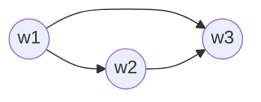
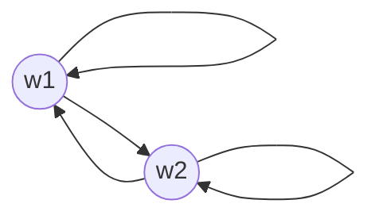

# Mastering Modal Logic: A Comprehensive, Example-Driven Tutorial for the Impatient

## Introduction

Welcome to this comprehensive tutorial on modal logic! If you're an impatient learner who prefers practical examples and wants to dive into advanced concepts quickly, you've come to the right place. In this tutorial, we'll cover all the essential concepts of modal logic, starting from the basics and progressing to expert-level topics. By the end of this tutorial, you'll be proficient in modal logic and ready to apply your knowledge to real-world problems.

## Syntax of Formulas

In modal logic, we use a set of symbols to represent propositions and modal operators. Let's start with the basic syntax:

- Propositional variables: p, q, r, ...
- Logical connectives: ¬ (negation), ∧ (conjunction), ∨ (disjunction), → (implication), ↔ (equivalence)
- Modal operators: ◻ (necessity), ◇ (possibility)

Example 1:
- ◻p: "It is necessary that p"
  - Interpretation: In all possible worlds, p is true.
- ◇q: "It is possible that q"
  - Interpretation: There exists at least one possible world where q is true.

Example 2:
- ◻(p → q): "It is necessary that if p, then q"
  - Interpretation: In all possible worlds, if p is true, then q must also be true.
- ◇(p ∧ q): "It is possible that both p and q are true"
  - Interpretation: There exists at least one possible world where both p and q are true simultaneously.

## Translating English to Modal Formulas and Vice Versa

Let's practice translating English sentences into modal formulas and vice versa.

Example 1:
- English: "If it is necessary that John studies, then he will pass the exam."
- Modal formula: ◻p → q, where p: "John studies", q: "John will pass the exam"
  - Explanation: The sentence states that in all possible worlds where John necessarily studies, he will pass the exam.

Example 2:
- Modal formula: ◇(p ∧ q)
- English: "It is possible that both p and q are true."
  - Explanation: The formula expresses that there exists at least one possible world where both propositions p and q are true at the same time.

Example 3:
- English: "If it is not possible that the sky is green, then it is necessary that the sky is blue."
- Modal formula: ¬◇p → ◻q, where p: "The sky is green", q: "The sky is blue"
  - Explanation: The sentence states that if there is no possible world where the sky is green, then in all possible worlds, the sky must be blue.

## Frames and Valuations

In modal logic, we use frames and valuations to give meaning to our formulas.

- Frame: A pair ⟨W, R⟩, where W is a non-empty set of worlds, and R is a binary relation on W (accessibility relation).
- Valuation: A function V that assigns truth values to propositional variables at each world.

Example 1:

In this frame, W = {w1, w2, w3}, and R = {(w1, w2), (w1, w3), (w2, w3)}. A valuation V might assign:
- V(p, w1) = true, V(q, w1) = false
- V(p, w2) = false, V(q, w2) = true
- V(p, w3) = true, V(q, w3) = true

Example 2:

In this frame, W = {w1, w2}, and R = {(w1, w1), (w1, w2), (w2, w1), (w2, w2)}. A valuation V might assign:
- V(p, w1) = true, V(q, w1) = false
- V(p, w2) = false, V(q, w2) = true

Explanation: Frames represent the structure of possible worlds and their accessibility relations. Valuations assign truth values to propositional variables in each world, allowing us to evaluate the truth of modal formulas.

## Semantics of Formulas

The semantics of modal formulas are defined recursively:

- M, w ⊨ p iff V(p, w) = true
- M, w ⊨ ¬φ iff M, w ⊭ φ
- M, w ⊨ φ ∧ ψ iff M, w ⊨ φ and M, w ⊨ ψ
- M, w ⊨ φ ∨ ψ iff M, w ⊨ φ or M, w ⊨ ψ
- M, w ⊨ φ → ψ iff M, w ⊭ φ or M, w ⊨ ψ
- M, w ⊨ φ ↔ ψ iff (M, w ⊨ φ iff M, w ⊨ ψ)
- M, w ⊨ ◻φ iff for all v such that wRv, M, v ⊨ φ
- M, w ⊨ ◇φ iff there exists v such that wRv and M, v ⊨ φ

Example 1:
In the frame from the first example in the previous section, with the given valuation:
- M, w1 ⊨ ◻p (because p is true in both w2 and w3, which are accessible from w1)
- M, w1 ⊨ ◇q (because q is true in w2, which is accessible from w1)
- M, w2 ⊭ ◻q (because q is false in w1, which is not accessible from w2)

Example 2:
In the frame from the second example in the previous section, with the given valuation:
- M, w1 ⊨ ◇p (because p is true in w1 itself, which is accessible from w1)
- M, w2 ⊨ ◻q (because q is true in both w1 and w2, which are accessible from w2)
- M, w1 ⊭ ◻(p ∨ q) (because in w2, which is accessible from w1, neither p nor q is true)

Explanation: The semantics of modal formulas define how to evaluate the truth of a formula in a given model (a frame with a valuation) at a specific world. The truth of necessity (◻) and possibility (◇) formulas depends on the truth of their subformulas in accessible worlds.

## Satisfaction and Validity

- Satisfaction: A formula φ is satisfied in a model M at a world w if M, w ⊨ φ.
- Validity: A formula φ is valid in a frame F (denoted as F ⊨ φ) if for every valuation V, and for every world w in F, ⟨F, V⟩, w ⊨ φ.

Example 1:
- The formula ◻p → p is valid in reflexive frames (where wRw for all w).
  - Explanation: In a reflexive frame, every world is accessible from itself. So, if ◻p is true at a world w, then p must be true at w as well, making the implication ◻p → p true at every world for any valuation.

Example 2:
- The formula ◻p → ◇p is valid in serial frames (where for each w, there exists v such that wRv).
  - Explanation: In a serial frame, every world has at least one accessible world. So, if ◻p is true at a world w, then p must be true in all accessible worlds, implying that ◇p is also true at w, making the implication ◻p → ◇p true at every world for any valuation.

Example 3:
- The formula ◻(p ∨ ¬p) is valid in all frames.
  - Explanation: The formula p ∨ ¬p is a tautology, meaning it is always true regardless of the truth value of p. Therefore, ◻(p ∨ ¬p) is true at every world in any frame for any valuation.

## Logical Equivalences

Some important logical equivalences in modal logic:

- ◻(φ ∧ ψ) ↔ (◻φ ∧ ◻ψ)
- ◇(φ ∨ ψ) ↔ (◇φ ∨ ◇ψ)
- ◻(φ → ψ) → (◻φ → ◻ψ)
- ¬◇φ ↔ ◻¬φ
- ¬◻φ ↔ ◇¬φ

Example 1:
- ◻(p ∧ q) is equivalent to (◻p ∧ ◻q)
  - Explanation: If it is necessary that both p and q are true, then it is necessary that p is true and it is necessary that q is true, and vice versa.

Example 2:
- ¬◇p is equivalent to ◻¬p
  - Explanation: If it is not possible that p is true, then it is necessary that p is false, and vice versa.

Example 3:
- ◻(p → q) → (◇p → ◇q) is a valid formula
  - Explanation: If it is necessary that p implies q, then if it is possible that p is true, it must also be possible that q is true.

## Frame Conditions Defined by Modal Formulas

Certain modal formulas can define properties of frames:

- Reflexivity: ◻p → p
- Symmetry: p → ◻◇p
- Transitivity: ◻p → ◻◻p
- Seriality: ◻p → ◇p

Example 1:
If a frame F satisfies the formula ◻p → p for all valuations, then F is reflexive.
- Explanation: The formula ◻p → p states that if p is necessary, then p is true. This holds in a frame where every world is accessible from itself, i.e., a reflexive frame.

Example 2:
If a frame F satisfies the formula p → ◻◇p for all valuations, then F is symmetric.
- Explanation: The formula p → ◻◇p states that if p is true, then it is necessary that p is possible. This holds in a frame where if a world w1 is accessible from w2, then w2 is also accessible from w1, i.e., a symmetric frame.

Example 3:
If a frame F satisfies the formula ◻p → ◻◻p for all valuations, then F is transitive.
- Explanation: The formula ◻p → ◻◻p states that if p is necessary, then it is necessary that p is necessary. This holds in a frame where if w1 is accessible from w2, and w2 is accessible from w3, then w1 is also accessible from w3, i.e., a transitive frame.

## Conclusion

Congratulations! You've completed this comprehensive tutorial on modal logic. You now have a solid understanding of the syntax, semantics, and various properties of modal logic. Remember to practice using the examples provided and apply your knowledge to solve real-world problems. Happy modal reasoning!