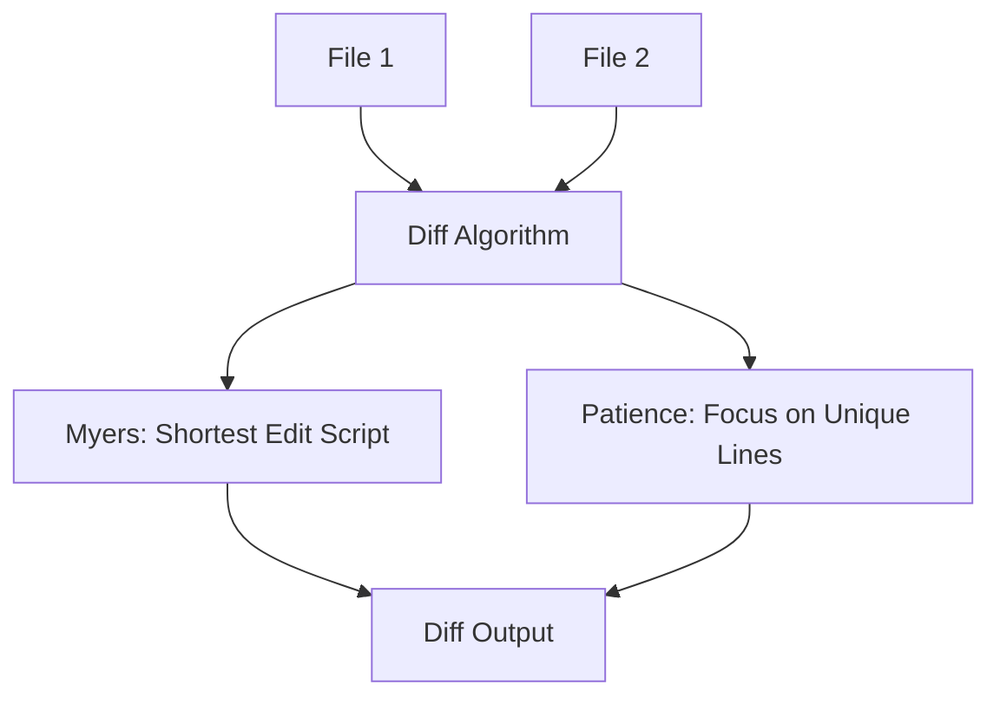
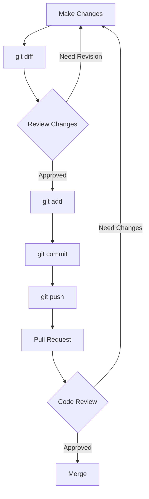
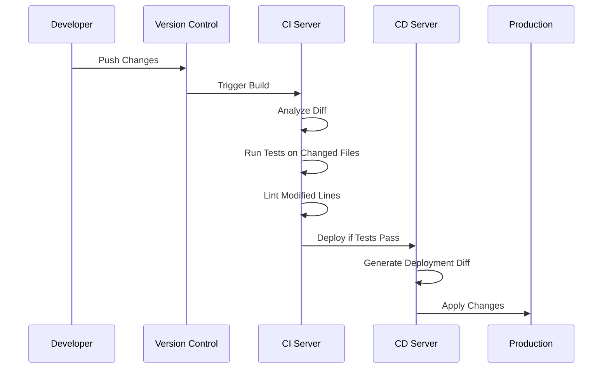
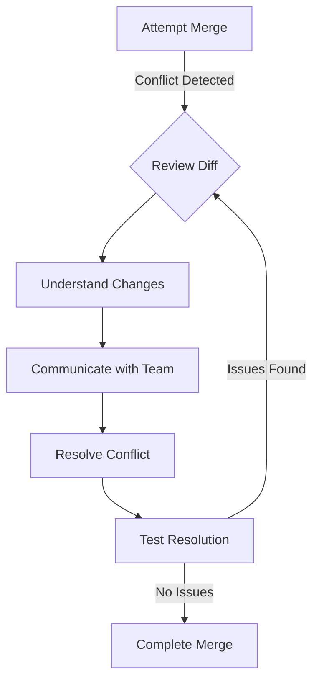

## Diff format for the impatients

## Introduction

### Why Learn Diff Format?

Imagine you're a time traveler, jumping between different versions of a codebase. How do you quickly identify what's changed? Enter the diff format – your trusty time machine control panel. 

In the fast-paced world of software development, mastering diff format is like gaining a superpower. It's not just a tool; it's your secret weapon for:

1. Saving precious time in code reviews
2. Navigating complex version control systems with ease
3. Collaborating seamlessly with your team

But why should you, an impatient learner, invest your valuable time in learning diff format? Let me paint you a picture.

Picture this: It's 3 AM, and you're frantically searching for a bug that's crept into your production code. Your team is counting on you. With a solid understanding of diff format, you can quickly compare versions, pinpoint the exact changes that introduced the bug, and become the hero who saves the day (and gets to sleep!).

### What is Diff Format?

At its core, diff format is a concise way to represent differences between two texts. It's like a changelog on steroids, showing you exactly what's been added, removed, or modified.

Born in the early days of Unix, diff format has evolved from a simple command-line tool to an indispensable part of modern software development workflows. Today, it's the backbone of version control systems like Git, powering everything from open-source collaboration to enterprise-level software projects.

### How to Use This Guide

This guide is designed with you, the impatient learner, in mind. We'll dive straight into practical examples, sprinkle in some interactive exercises, and pepper the content with pro tips to keep you engaged.

By the end of this guide, you'll be able to:

1. Read and interpret diff outputs like a pro
2. Use diff commands effectively in your daily workflow
3. Apply diff concepts in version control and code review processes
4. Avoid common pitfalls and optimize your diff usage

So, buckle up! We're about to embark on a high-speed journey from diff novice to practitioner. Let's dive in!

## Basics of Diff Format

### The Anatomy of a Diff

Before we jump into our first example, let's break down the structure of a diff output. Think of a diff as a surgical report for your code – it precisely identifies what's been "operated on" in your files.

A typical diff output consists of three main parts:

1. **Header information**: This is like the patient's details on a medical chart. It tells you which files are being compared.

2. **Chunk headers**: These are the "incision points" in your code, showing where changes begin and end.

3. **Change indicators**: These are the actual "surgical notes", showing what's been added, removed, or modified.

Let's visualize this structure:

```mermaid
graph TD
    A[Diff Output] --> B[Header Information]
    A --> C[Chunk Headers]
    A --> D[Change Indicators]
    C --> E[@@-line numbers for original file,line numbers for new file@@]
    D --> F[- for lines removed]
    D --> G[+ for lines added]
    D --> H[space for unchanged lines]
```

### Your First Diff

Now, let's look at a simple example to see these components in action.

Imagine you have two versions of a "Hello, World!" program:

Version 1 (hello_v1.py):
```python
print("Hello, World!")
```

Version 2 (hello_v2.py):
```python
print("Hello, World!")
print("Welcome to diff format!")
```

When we run a diff command on these files, here's what we get:

```diff
--- hello_v1.py	2023-09-01 10:00:00.000000000 +0800
+++ hello_v2.py	2023-09-01 10:05:00.000000000 +0800
@@ -1 +1,2 @@
 print("Hello, World!")
+print("Welcome to diff format!")
```

Let's break this down:

1. The header shows the files being compared (hello_v1.py and hello_v2.py) with timestamps.
2. The chunk header `@@ -1 +1,2 @@` indicates that in the original file, we're looking at 1 line starting from line 1, and in the new file, we're looking at 2 lines starting from line 1.
3. The unchanged line is shown without any indicator.
4. The added line is shown with a `+` at the beginning.

**Interactive Exercise**: Pause for a moment and try to visualize what the original and new files look like based on this diff. Can you reconstruct both versions in your mind?

### Common Diff Commands

Now that you've seen a basic diff, let's look at some common commands you'll use:

1. `diff`: The standard Unix command for generating diffs.
   ```bash
   diff -u file1.txt file2.txt
   ```

2. `patch`: Applies a diff to a file, useful for updating code.
   ```bash
   patch file1.txt < patchfile.diff
   ```

3. `git diff`: Shows changes in a Git repository.
   ```bash
   git diff HEAD~1 HEAD
   ```

**Pro Tip**: Always use the `-u` option with `diff` for a unified format, which is easier to read and more commonly used in modern development.

In the next section, we'll dive into more advanced concepts and see how diff format is used in real-world scenarios. But before we move on, let's have a quick quiz to reinforce what we've learned.

**Quick Quiz**:
1. What does the `+` symbol indicate in a diff output?
2. In the chunk header `@@ -5,7 +5,8 @@`, what do these numbers mean?
3. Which diff command would you use to see changes in a Git repository?

(Answers: 1. Added lines, 2. In the original file, start at line 5 and show 7 lines; in the new file, start at line 5 and show 8 lines, 3. `git diff`)

Now that we've covered the basics, are you ready to dive deeper into the world of diff format? In our next section, we'll explore advanced concepts that will take your diff skills to the next level. Let's continue our journey from novice to practitioner!

## Advanced Concepts

### Context Diffs vs Unified Diffs

As we venture into more advanced territory, it's crucial to understand the two main types of diff formats: context diffs and unified diffs. Think of these as different "lenses" through which you can view code changes.

1. **Context Diffs**: These are like looking at before-and-after photos side by side. They show the changed lines along with a few lines of context before and after.

2. **Unified Diffs**: This is like an annotated timeline of changes. It shows the entire file with additions and deletions inline, making it easier to see the overall picture.

Let's compare them with an example:

Original file (greet.py):
```python
def greet(name):
    print(f"Hello, {name}!")

greet("World")
```

Modified file:
```python
def greet(name):
    print(f"Hello, {name}!")
    print("Welcome to Python!")

greet("Diff Master")
```

Context Diff:
```diff
*** greet.py
--- greet.py
***************
*** 1,4 ****
  def greet(name):
      print(f"Hello, {name}!")
  
! greet("World")
--- 1,5 ----
  def greet(name):
      print(f"Hello, {name}!")
+     print("Welcome to Python!")
  
! greet("Diff Master")
```

Unified Diff:
```diff
--- greet.py
+++ greet.py
@@ -1,4 +1,5 @@
 def greet(name):
     print(f"Hello, {name}!")
+    print("Welcome to Python!")
 
-greet("World")
+greet("Diff Master")
```

**When to use each**:
- Use context diffs when you need to see more surrounding context for each change.
- Use unified diffs (more common today) for a more compact and readable format, especially for larger files.

### Handling Binary Files

While diff is primarily designed for text files, you'll often encounter binary files in real-world projects. Trying to diff binary files directly will usually result in a message like "Binary files differ".

To handle binary files:

1. Use specialized diff tools for specific file types (e.g., image diff tools).
2. Convert binary files to text representations when possible.
3. Use Git's `textconv` feature to convert binary files on-the-fly for diffing.

Here's a pro tip for diffing PDF files using `pdftotext`:

```bash
git config diff.pdf.textconv pdftotext
```

Now Git will automatically convert PDFs to text before diffing!

### Diff Algorithms

Behind the scenes, diff tools use sophisticated algorithms to compare files. The two most common are:

1. **Myers Algorithm**: The classic diff algorithm, optimized for speed.
2. **Patience Algorithm**: Produces more intuitive diffs, especially for code.

Let's visualize how these algorithms work:



**Pro Tip**: In Git, you can use the patience algorithm with:
```bash
git diff --patience
```

This often produces more readable diffs, especially when functions have been moved around.

Now, let's pause for a quick interactive exercise:

**Pause and Reflect**: Think about a recent project where you had to compare files. Which type of diff (context or unified) would have been most helpful? Why?

As we wrap up this section on advanced concepts, you're well on your way to becoming a diff format practitioner. In the next section, we'll explore practical applications of diff in real-world scenarios. Are you ready to see how diff powers modern development workflows? Let's dive in!

## Practical Applications

### Version Control Systems

Diff format is the unsung hero of version control systems (VCS). It's the engine that powers the ability to track changes, merge branches, and collaborate effectively. Let's look at how diff is used in popular VCS:

1. **Git**:
   - `git diff`: Shows changes between commits, branches, etc.
   - `git show`: Displays the changes introduced by a commit.

2. **SVN (Subversion)**:
   - `svn diff`: Shows differences between working copy and repository.

3. **Mercurial**:
   - `hg diff`: Similar to Git's diff command.

Here's a flowchart of how diff is used in a typical Git workflow:



### Code Review Processes

Diff format is crucial in code review processes. It allows reviewers to focus on what's changed, making reviews more efficient and effective.

Best practices for using diffs in code reviews:

1. **Keep commits small and focused**: This makes diffs easier to review.
2. **Use meaningful commit messages**: They provide context for the diff.
3. **Review the diff before submitting**: Catch silly mistakes early.

**Pro Tip**: Many code review tools allow inline comments on specific lines of a diff. Use this feature to provide targeted feedback.

### Continuous Integration/Deployment

In CI/CD pipelines, diffs play a vital role:

1. **Automated Testing**: Run tests only on changed files by analyzing the diff.
2. **Change Size Checks**: Enforce limits on the size of changes to maintain code quality.
3. **Automated Code Reviews**: Tools like linters can be configured to check only modified lines.

Here's an example of how diff might be used in a CI/CD pipeline:



**Interactive Exercise**: Imagine you're setting up a CI/CD pipeline for a new project. How would you use diff to optimize the pipeline? What checks would you implement based on the diff output?

As we conclude this section on practical applications, you've seen how diff format is woven into the fabric of modern software development. From version control to code reviews and CI/CD, diff is an essential tool in a developer's arsenal.

In our next and final section, we'll address common pitfalls you might encounter when working with diffs and provide pro tips to supercharge your diff skills. Are you ready to become a true diff master? Let's finish strong!

Certainly! I'll continue with the "Common Pitfalls and Solutions" section and complete the article.

## Common Pitfalls and Solutions

As you become more proficient with diff format, you'll inevitably encounter some challenges. Let's explore these common pitfalls and their solutions to ensure you're well-prepared for any diff-related obstacles.

### Misinterpreting Diffs

One of the most common issues, especially for beginners, is misinterpreting diff outputs. This can lead to incorrect assumptions about code changes and potentially introduce bugs.

**Pitfall**: Misunderstanding the context of changes, especially in large diffs.

**Solution**: 
1. Always look at the surrounding context, not just the changed lines.
2. Use tools that provide side-by-side diff views for easier comparison.
3. Break down large diffs into smaller, more manageable chunks.

**Pro Tip**: When reviewing large diffs, use the "divide and conquer" approach. Focus on one logical change at a time, and take breaks to maintain focus and accuracy.

### Merge Conflicts

Merge conflicts occur when Git can't automatically reconcile differences between branches. They can be intimidating, but with the right approach, they're manageable.

**Pitfall**: Resolving merge conflicts incorrectly, potentially losing important changes.

**Solution**:
1. Understand the cause of the conflict by examining the diff carefully.
2. Communicate with team members involved in the conflicting changes.
3. Use visual merge tools to make conflict resolution easier.

Here's a visualization of the merge conflict resolution process:



**Pro Tip**: Set up your Git configuration to use your favorite merge tool:
```bash
git config --global merge.tool your_preferred_tool
```

### Performance Issues

When working with large repositories or files, diff operations can become slow, impacting your productivity.

**Pitfall**: Slow diff generation for large files or repositories with extensive history.

**Solution**:
1. Use Git's `--histogram` algorithm for faster diff generation:
   ```bash
   git diff --histogram
   ```
2. Limit the scope of your diff to specific files or directories when possible.
3. For very large repositories, consider using Git's shallow clone feature to limit history.

**Pro Tip**: If you frequently work with large binary files, look into Git LFS (Large File Storage) to improve performance.

## Pro Tips and Best Practices

Now that we've covered the pitfalls, let's supercharge your diff skills with some pro tips and best practices!

### Effective Diff Reading

1. **Use color-coded diffs**: Most modern tools support this, making diffs much easier to read.
2. **Learn keyboard shortcuts**: For tools like `vimdiff`, mastering shortcuts can significantly speed up your diff review process.
3. **Focus on the chunk headers**: They provide valuable context about where changes occur in the file.

### Writing Diff-Friendly Code

1. **Keep functions small and focused**: This makes diffs more readable and easier to understand.
2. **Use consistent formatting**: Automated formatters can help prevent noisy diffs caused by style changes.
3. **Make meaningful commits**: Each commit should represent a logical change, making diffs more informative.

### Customizing Diff Output

1. **Create aliases for common diff commands**:
   ```bash
   git config --global alias.d "diff --word-diff=color"
   ```
2. **Use `.gitattributes` to customize diff behavior for specific file types**:
   ```
   *.md diff=markdown
   ```
3. **Explore GUI diff tools**: Tools like Beyond Compare or Meld can provide enhanced diff viewing experiences.

## Conclusion

Congratulations! You've just completed a whirlwind tour of diff format, from novice to practitioner. Let's recap the key points:

1. Diff format is a powerful tool for comparing files and tracking changes.
2. Understanding diff output is crucial for effective version control and code review.
3. Advanced features like different diff algorithms and handling binary files can enhance your diff capabilities.
4. Diff is integral to modern development workflows, including CI/CD pipelines.
5. Being aware of common pitfalls and following best practices can significantly improve your diff experience.

### Your 24-Hour Challenge

To solidify your new skills, here's an actionable task to complete within the next 24 hours:

1. Choose a project you're working on (or create a new one if needed).
2. Make some changes to at least three different files.
3. Use `git diff` to review your changes.
4. Write a commit message that clearly explains the changes based on the diff output.
5. Push your changes and create a pull request.
6. Review the diff in the pull request, leaving at least one comment on a specific line.

By completing this challenge, you'll have applied your diff knowledge in a practical, real-world scenario.

Remember, mastering diff format is an ongoing journey. Keep practicing, stay curious, and don't hesitate to explore new tools and techniques. With your new diff superpowers, you're well-equipped to navigate the complex world of code changes and collaboration.

Happy diffing, and may your merges always be conflict-free!