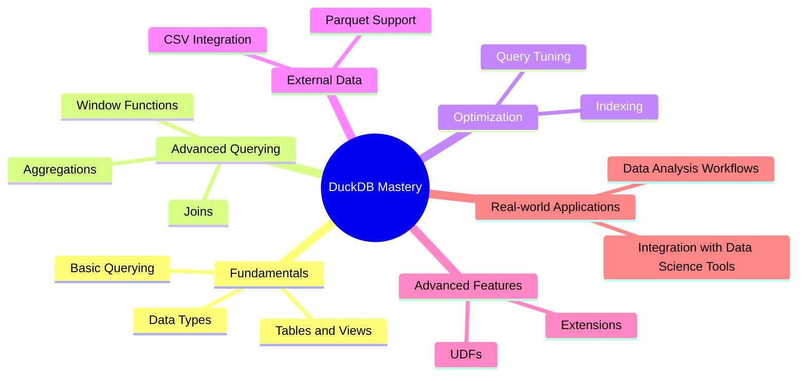

# DuckDB for the Impatient: From Novice to Practitioner in Record Time

## 1. Introduction

### Why DuckDB?

Picture this: It's 2 AM, and you're a data scientist burning the midnight oil, trying to crunch through terabytes of data for a critical presentation due in just six hours. Your current database setup is crawling, and you're watching your career flash before your eyes. Suddenly, a colleague mentions DuckDB. Skeptical but desperate, you give it a shot. In minutes, you're flying through your analysis, and by dawn, you're the hero of the boardroom.

This isn't just a fairy tale – it's a real story from a data scientist who discovered the power of DuckDB just in time. But why should you care about yet another database system in a world already crowded with options?

The answer lies in the ever-growing need for fast, efficient data analysis. In today's data-driven world, the ability to quickly process and analyze large datasets is not just a nice-to-have – it's a must-have. This is where DuckDB shines, occupying a unique position in the database ecosystem.

### What is DuckDB?

DuckDB is an embeddable SQL OLAP database management system. But what does that mean in plain English? Think of it as a high-performance analytical Swiss Army knife that fits in your pocket. It's designed to be fast, efficient, and easy to use, especially for analytical queries on large datasets.

Key features and benefits include:
- In-process analytics: DuckDB runs within your application, eliminating network overhead.
- Column-oriented storage: Optimized for analytical queries on large datasets.
- ACID compliant: Ensures data integrity and reliability.
- SQL support: Familiar syntax for those with SQL experience.
- Vectorized query execution: Enables blazing-fast query performance.

### How to Get Started

Getting started with DuckDB is as easy as pie. Here's a quick guide:

1. Installation:
   ```bash
   # For Python users
   pip install duckdb

   # For R users
   install.packages("duckdb")
   ```

2. Basic setup:
   ```python
   import duckdb

   # Create a connection
   con = duckdb.connect('my_database.db')

   # Execute a query
   con.execute("CREATE TABLE test (id INTEGER, name VARCHAR)")
   con.execute("INSERT INTO test VALUES (1, 'Alice'), (2, 'Bob')")

   # Fetch results
   results = con.execute("SELECT * FROM test").fetchall()
   print(results)
   ```

Now that we've covered the basics, let's dive deeper into the world of DuckDB!

## 2. Fundamental Concepts

### Data Types

Understanding data types is crucial for efficient database design and query optimization. DuckDB supports a wide range of data types, each suited for different kinds of information.

Here's a quick overview with examples:

1. Numeric Types:
   - INTEGER: Whole numbers
     ```sql
     CREATE TABLE products (id INTEGER, price INTEGER);
     INSERT INTO products VALUES (1, 100), (2, 150);
     ```
   - DOUBLE: Floating-point numbers
     ```sql
     CREATE TABLE measurements (sensor_id INTEGER, value DOUBLE);
     INSERT INTO measurements VALUES (1, 23.5), (2, 98.6);
     ```

2. String Types:
   - VARCHAR: Variable-length character strings
     ```sql
     CREATE TABLE users (id INTEGER, name VARCHAR);
     INSERT INTO users VALUES (1, 'Alice'), (2, 'Bob');
     ```

3. Date and Time Types:
   - DATE: Calendar dates
   - TIMESTAMP: Date and time
     ```sql
     CREATE TABLE events (id INTEGER, event_date DATE, event_time TIMESTAMP);
     INSERT INTO events VALUES (1, '2023-06-15', '2023-06-15 14:30:00');
     ```

4. Boolean Type:
   - BOOLEAN: True or false values
     ```sql
     CREATE TABLE tasks (id INTEGER, completed BOOLEAN);
     INSERT INTO tasks VALUES (1, true), (2, false);
     ```

Pro Tip: Choose the most appropriate data type for your columns. Using INTEGER for whole numbers instead of DOUBLE can save storage space and improve query performance.

### Tables and Views

Tables are the foundation of any relational database, while views provide a powerful way to simplify complex queries and manage access to data.

Creating a Table:
```sql
CREATE TABLE employees (
    id INTEGER PRIMARY KEY,
    name VARCHAR,
    department VARCHAR,
    salary INTEGER
);

INSERT INTO employees VALUES 
    (1, 'Alice', 'Sales', 50000),
    (2, 'Bob', 'Marketing', 60000),
    (3, 'Charlie', 'Engineering', 70000);
```

Creating a View:
```sql
CREATE VIEW high_earners AS
SELECT name, department
FROM employees
WHERE salary > 55000;

-- Using the view
SELECT * FROM high_earners;
```

Views are particularly useful for:
1. Simplifying complex queries
2. Enforcing access control
3. Providing a consistent interface even if the underlying table structure changes

Pause and Reflect: Think about a dataset you work with regularly. How could you use views to simplify your most common queries?

### Querying Basics

Now that we have our data stored, let's explore how to retrieve and manipulate it using SQL queries.

1. SELECT Statements:
   The SELECT statement is the workhorse of SQL queries. It allows you to retrieve data from one or more tables.

   ```sql
   -- Basic SELECT
   SELECT name, department FROM employees;

   -- SELECT with calculated column
   SELECT name, salary, salary * 1.1 AS increased_salary FROM employees;
   ```

2. Filtering with WHERE:
   The WHERE clause allows you to filter your results based on specific conditions.

   ```sql
   -- Simple filter
   SELECT name, salary FROM employees WHERE department = 'Sales';

   -- Multiple conditions
   SELECT name, salary FROM employees WHERE department = 'Engineering' AND salary > 65000;
   ```

3. Sorting with ORDER BY:
   ORDER BY allows you to sort your results based on one or more columns.

   ```sql
   -- Sort by salary descending
   SELECT name, salary FROM employees ORDER BY salary DESC;

   -- Sort by department, then by salary
   SELECT name, department, salary FROM employees ORDER BY department, salary DESC;
   ```

Quick Quiz:
1. How would you write a query to find the names of all employees in the Marketing department with a salary greater than 55000?
2. How would you modify the previous query to sort the results by salary in descending order?

(Answers at the end of the article)

As we conclude this section on fundamental concepts, you should now have a solid grasp of DuckDB's data types, how to create tables and views, and the basics of querying data. In the next section, we'll dive into more advanced querying techniques that will take your DuckDB skills to the next level.

Remember, practice makes perfect. Try creating your own tables and writing queries based on real-world scenarios you encounter in your work. The more you practice, the more intuitive these concepts will become.

In our next section, we'll explore advanced querying techniques, including aggregations, joins, and window functions. These powerful tools will allow you to perform complex analyses and derive meaningful insights from your data. Stay tuned!

## 3. Advanced Querying

Now that we've mastered the basics, it's time to dive into more advanced querying techniques. These powerful tools will allow you to perform complex analyses and extract deeper insights from your data.

### Aggregations and Grouping

Aggregations allow you to perform calculations across a set of rows, while grouping enables you to organize your data into meaningful subsets.

1. GROUP BY clause:
   The GROUP BY clause is used to group rows that have the same values in specified columns.

   ```sql
   -- Calculate average salary by department
   SELECT department, AVG(salary) as avg_salary
   FROM employees
   GROUP BY department;
   ```

2. Aggregate functions:
   DuckDB supports a variety of aggregate functions, including COUNT, SUM, AVG, MIN, and MAX.

   ```sql
   -- Multiple aggregations
   SELECT 
       department,
       COUNT(*) as employee_count,
       AVG(salary) as avg_salary,
       MAX(salary) as max_salary
   FROM employees
   GROUP BY department;
   ```

3. HAVING clause:
   The HAVING clause is used to filter the results of GROUP BY based on the result of an aggregate function.

   ```sql
   -- Find departments with average salary over 60000
   SELECT 
       department,
       AVG(salary) as avg_salary
   FROM employees
   GROUP BY department
   HAVING AVG(salary) > 60000;
   ```

Pro Tip: Always use GROUP BY when you're using aggregate functions along with non-aggregated columns in your SELECT statement. This ensures that your results are logically consistent.

### Joins

Joins allow you to combine data from multiple tables based on related columns between them. Let's create a new table to demonstrate joins:

```sql
CREATE TABLE projects (
    id INTEGER PRIMARY KEY,
    name VARCHAR,
    department VARCHAR
);

INSERT INTO projects VALUES 
    (1, 'Website Redesign', 'Marketing'),
    (2, 'New Product Launch', 'Sales'),
    (3, 'Database Optimization', 'Engineering');
```

Now, let's explore different types of joins:

1. INNER JOIN:
   Returns only the rows where there's a match in both tables.

   ```sql
   SELECT e.name, e.department, p.name as project_name
   FROM employees e
   INNER JOIN projects p ON e.department = p.department;
   ```

2. LEFT JOIN:
   Returns all rows from the left table, and the matched rows from the right table.

   ```sql
   SELECT e.name, e.department, p.name as project_name
   FROM employees e
   LEFT JOIN projects p ON e.department = p.department;
   ```

3. FULL OUTER JOIN:
   Returns all rows when there's a match in either left or right table.

   ```sql
   SELECT e.name, e.department, p.name as project_name
   FROM employees e
   FULL OUTER JOIN projects p ON e.department = p.department;
   ```

Pause and Reflect: Think about your own data. Are there scenarios where you need to combine information from multiple tables? How could joins help you achieve this?

### Window Functions

Window functions perform calculations across a set of rows that are related to the current row. They are incredibly powerful for complex analytical queries.

```sql
-- Add row numbers to employees ordered by salary
SELECT 
    name,
    salary,
    ROW_NUMBER() OVER (ORDER BY salary DESC) as salary_rank
FROM employees;

-- Calculate running total of salary within each department
SELECT 
    name,
    department,
    salary,
    SUM(salary) OVER (PARTITION BY department ORDER BY salary) as running_total
FROM employees;
```

Window functions open up a world of possibilities for advanced analysis, such as calculating moving averages, ranking items within groups, and more.

## 4. Performance Optimization

As your datasets grow and your queries become more complex, optimizing performance becomes crucial. Let's explore two key areas of performance optimization in DuckDB.

### Indexing

Indexes are data structures that improve the speed of data retrieval operations on a database table. They come with a trade-off: they speed up data retrieval but slow down data insertion and updates.

```sql
-- Create an index on the department column
CREATE INDEX idx_department ON employees(department);

-- Create a composite index
CREATE INDEX idx_dept_salary ON employees(department, salary);
```

When to use indexes:
- On columns that are frequently used in WHERE clauses
- On columns used for joining tables
- On columns used in ORDER BY or GROUP BY clauses

Pro Tip: While indexes can significantly speed up queries, too many indexes can slow down write operations. Always benchmark your queries before and after adding an index to ensure it's providing the expected performance boost.

### Query Optimization

Understanding how DuckDB processes your queries can help you write more efficient SQL. Here are some techniques:

1. Use EXPLAIN to understand query plans:
   ```sql
   EXPLAIN SELECT * FROM employees WHERE department = 'Sales';
   ```

2. Avoid using * in SELECT statements. Instead, specify only the columns you need:
   ```sql
   -- Less efficient
   SELECT * FROM employees WHERE department = 'Sales';

   -- More efficient
   SELECT name, salary FROM employees WHERE department = 'Sales';
   ```

3. Use appropriate data types and avoid unnecessary type conversions:
   ```sql
   -- Less efficient (implicit conversion)
   SELECT * FROM employees WHERE id = '1';

   -- More efficient
   SELECT * FROM employees WHERE id = 1;
   ```

4. For large datasets, consider using LIMIT to restrict the number of rows returned:
   ```sql
   SELECT * FROM large_table LIMIT 1000;
   ```

Remember, query optimization is often specific to your particular data and query patterns. Always measure performance before and after optimization attempts.

## 5. Working with External Data

DuckDB shines when it comes to working with external data sources, particularly CSV and Parquet files.

### CSV and Parquet Integration

Reading from CSV files:
```sql
-- Read CSV file into a new table
CREATE TABLE csv_data AS SELECT * FROM read_csv_auto('path/to/your/file.csv');

-- Query directly from CSV without creating a table
SELECT * FROM read_csv_auto('path/to/your/file.csv') WHERE column_name > 100;
```

Working with Parquet format:
```sql
-- Read Parquet file into a new table
CREATE TABLE parquet_data AS SELECT * FROM parquet_scan('path/to/your/file.parquet');

-- Query directly from Parquet file
SELECT * FROM parquet_scan('path/to/your/file.parquet') WHERE column_name = 'value';
```

Pro Tip: Parquet files are columnar storage files that are highly efficient for analytical queries. If you frequently work with the same dataset, consider converting your CSV files to Parquet for improved query performance.

### Database Connections

DuckDB can connect to other databases, allowing you to import or export data easily.

```python
import duckdb

# Connect to PostgreSQL and query data
postgres_data = duckdb.query("SELECT * FROM postgres_scan('dbname=your_db', 'your_table')")

# Export data to SQLite
duckdb.sql("COPY (SELECT * FROM my_table) TO 'output.db' (FORMAT SQLITE)")
```

This capability makes DuckDB an excellent tool for ETL (Extract, Transform, Load) processes and data pipelines.

As we conclude this section, you should now have a comprehensive understanding of DuckDB's advanced querying capabilities, performance optimization techniques, and how to work with external data. In our next and final sections, we'll explore some advanced features and real-world applications of DuckDB.

Remember, the key to mastering DuckDB (or any technology) is practice. Try to apply these concepts to your own datasets or create sample datasets to experiment with. In our next section, we'll dive into some advanced features that will further enhance your DuckDB skills.

## 6. Advanced Features

As you become more comfortable with DuckDB, you'll want to explore some of its more advanced features. These can help you solve complex problems and customize DuckDB to fit your specific needs.

### User-Defined Functions

User-Defined Functions (UDFs) allow you to extend DuckDB's functionality by creating custom functions in SQL or Python.

SQL UDFs:
```sql
-- Create a simple UDF
CREATE FUNCTION celsius_to_fahrenheit(celsius FLOAT)
RETURNS FLOAT AS
BEGIN
    RETURN celsius * 9/5 + 32;
END;

-- Use the UDF
SELECT celsius_to_fahrenheit(25);
```

Python UDFs:
```python
import duckdb

# Define a Python function
def word_count(text):
    return len(text.split())

# Register the function with DuckDB
duckdb.create_function('word_count', word_count)

# Use the function in a SQL query
result = duckdb.sql("SELECT word_count('Hello DuckDB world') AS count").fetchone()
print(result[0])  # Output: 3
```

UDFs are particularly useful when you need to perform complex calculations or data manipulations that are not easily expressed in standard SQL.

### Extensions

DuckDB supports a variety of extensions that add extra functionality to the core system. Here are some popular extensions:

1. Full-Text Search:
```sql
INSTALL fts;
LOAD fts;

CREATE TABLE documents(id INTEGER, content TEXT);
INSERT INTO documents VALUES (1, 'DuckDB is an embeddable database');
INSERT INTO documents VALUES (2, 'SQL is a powerful query language');

-- Create a full-text index
CALL fts_create_index('documents', 'id', 'content');

-- Perform a full-text search
SELECT * FROM fts_search('documents', 'embeddable');
```

2. JSON:
```sql
INSTALL json;
LOAD json;

-- Parse JSON data
SELECT json_extract('{"name": "DuckDB", "type": "database"}', '$.name') AS name;
```

3. Spatial (GIS):
```sql
INSTALL spatial;
LOAD spatial;

-- Create a point
SELECT ST_Point(0, 0) AS point;
```

Pro Tip: Always check the DuckDB documentation for the most up-to-date list of available extensions and their usage instructions.

## 7. Real-world Applications

Now that we've covered a wide range of DuckDB features, let's look at how they can be applied in real-world scenarios.

### Data Analysis Workflows

Example: Customer Segmentation Analysis

Let's say we have a large dataset of customer transactions and we want to segment our customers based on their purchasing behavior.

```sql
-- Assuming we have a 'transactions' table
CREATE TABLE transactions (
    customer_id INTEGER,
    transaction_date DATE,
    amount DECIMAL(10,2)
);

-- Calculate customer metrics
WITH customer_metrics AS (
    SELECT 
        customer_id,
        COUNT(*) as transaction_count,
        SUM(amount) as total_spent,
        AVG(amount) as avg_transaction_value,
        MAX(transaction_date) as last_transaction_date,
        DATEDIFF('day', MIN(transaction_date), MAX(transaction_date)) as customer_lifetime_days
    FROM transactions
    GROUP BY customer_id
)
-- Segment customers
SELECT 
    customer_id,
    CASE 
        WHEN transaction_count > 10 AND total_spent > 1000 THEN 'High Value'
        WHEN transaction_count > 5 OR total_spent > 500 THEN 'Medium Value'
        ELSE 'Low Value'
    END as customer_segment
FROM customer_metrics;
```

This query demonstrates the use of Common Table Expressions (CTEs), window functions, and conditional logic to perform a complex analysis in a single SQL statement.

### Integration with Data Science Tools

DuckDB integrates seamlessly with popular data science tools, particularly in the Python ecosystem.

Example: Using DuckDB with Python and Jupyter Notebook

```python
import duckdb
import pandas as pd
import matplotlib.pyplot as plt
%matplotlib inline

# Connect to DuckDB
con = duckdb.connect('my_database.db')

# Run a query and load results into a pandas DataFrame
df = con.execute("""
    SELECT 
        DATE_TRUNC('month', transaction_date) as month,
        SUM(amount) as monthly_revenue
    FROM transactions
    GROUP BY 1
    ORDER BY 1
""").df()

# Plot the results
plt.figure(figsize=(12,6))
plt.plot(df['month'], df['monthly_revenue'])
plt.title('Monthly Revenue Trend')
plt.xlabel('Month')
plt.ylabel('Revenue')
plt.xticks(rotation=45)
plt.tight_layout()
plt.show()
```

This example showcases how DuckDB can be used in conjunction with pandas for data manipulation and matplotlib for visualization, creating a powerful data analysis workflow.

## 8. Conclusion

Throughout this article, we've journeyed from the basics of DuckDB to advanced features and real-world applications. We've covered:

1. Fundamental concepts like data types, tables, and basic querying
2. Advanced querying techniques including aggregations, joins, and window functions
3. Performance optimization through indexing and query tuning
4. Working with external data sources
5. Advanced features like UDFs and extensions
6. Real-world applications in data analysis and integration with data science tools

DuckDB's combination of speed, simplicity, and powerful features makes it an excellent choice for a wide range of data analysis tasks. Whether you're working with small datasets on your local machine or processing terabytes of data in a distributed environment, DuckDB has something to offer.

### Next Steps

To continue your DuckDB journey:

1. Practice regularly: The best way to master DuckDB is through consistent practice. Try to use it in your daily data tasks.
2. Explore the documentation: The official DuckDB documentation is a treasure trove of information and advanced techniques.
3. Join the community: Engage with other DuckDB users through forums, social media, or local data science meetups.

### 24-Hour Challenge

Here's a task to complete within the next 24 hours to solidify your DuckDB skills:

1. Download a publicly available dataset (e.g., from Kaggle or data.gov)
2. Load the dataset into DuckDB
3. Perform at least three different types of analysis on the data (e.g., aggregation, joining with another table, window function)
4. Create a visualization of your findings using DuckDB in conjunction with a plotting library

Remember, the key to mastering any technology is consistent practice and application. DuckDB offers a powerful toolset for data analysis - now it's up to you to unleash its potential in your projects!



This mind map summarizes the key areas we've covered in this article. As you continue your DuckDB journey, you can use this as a reference to identify areas for further study and practice.

Good luck, and happy data crunching with DuckDB!