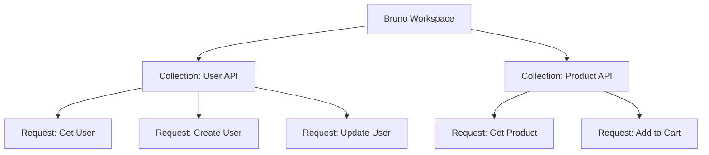
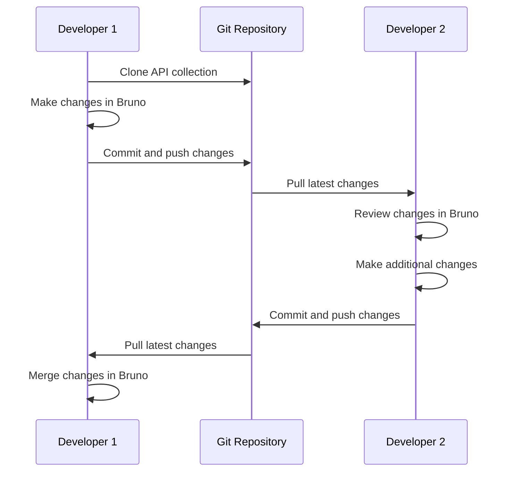
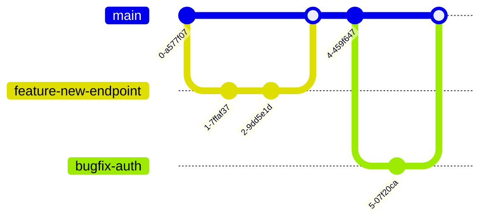
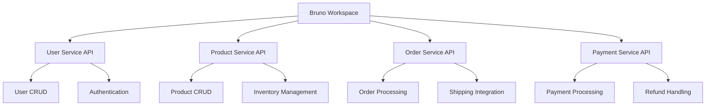

## Bruno for the Impatient: From Novice to Practitioner in Record Time

### 1. Introduction

#### 1.1 Why Bruno?

In the fast-paced world of API development, time is of the essence. Picture yourself as a developer, juggling multiple projects, each with its own set of APIs. You're constantly switching between different tools, struggling to keep your API collections in sync with your team, and battling with bloated, cloud-dependent software. Sound familiar? If so, you're not alone, and that's precisely why Bruno was born.


Bruno is the answer to the collective frustration of developers worldwide who have been yearning for a faster, more efficient, and truly collaborative API client. But before we dive into what Bruno is, let's take a moment to reflect on why it's become a game-changer in the API development landscape.

> 🤔 Pause and Reflect: Think about your current API development workflow. What are your pain points? How much time do you spend managing your API collections rather than actually working with them?

The existing API clients in the market, while powerful, often come with their own set of challenges:

1. **Cloud Dependency**: Many popular tools require cloud synchronization, raising concerns about data privacy and offline accessibility.
2. **Version Control Nightmares**: Collaborating on API collections often leads to conflicts and versioning issues.
3. **Bloated Interfaces**: Complex user interfaces can slow down your workflow, especially when you're trying to quickly test or modify an API endpoint.
4. **Limited Customization**: Many tools restrict how you can organize and manage your API collections, forcing you to adapt to their structure rather than the other way around.

Bruno addresses these pain points head-on, offering a refreshing alternative that puts developers back in control of their API workflows.

#### 1.2 What is Bruno?

Bruno is not just another API client; it's a revolution in API development and testing. At its core, Bruno is a fast, Git-friendly, open-source API client that's designed to streamline your workflow and enhance collaboration.

Key features that set Bruno apart:

1. **File System Based**: Bruno stores your collections directly on your file system, giving you complete control over your data.
2. **Git-Friendly**: Leverage the power of Git for version control and collaboration on your API collections.
3. **Bru Markup Language**: A simple, plain-text markup language for saving API request information.
4. **Offline-First**: Work anywhere, anytime, without relying on cloud synchronization.
5. **Privacy-Focused**: Your data stays on your device, period.

> 💡 Pro Tip: Bruno's offline-first approach means you can work on your API collections even when you're on a plane or in areas with poor internet connectivity. No more productivity loss due to connection issues!

#### 1.3 How to Get Started

Getting started with Bruno is as easy as pie. Here's a quick guide to get you up and running:

1. **Installation**:
   - Visit the official Bruno website (https://www.usebruno.com/)
   - Download the appropriate version for your operating system (Windows, macOS, or Linux)
   - Run the installer and follow the on-screen instructions

2. **Basic Setup**:
   - Launch Bruno
   - Create a new collection or import an existing one
   - Start adding your API requests

> 🚀 Quick Quiz: What makes Bruno different from cloud-based API clients?
> a) It's faster
> b) It's Git-friendly
> c) It's offline-first
> d) All of the above
> 
> (Answer: d) All of the above)

Now that we've covered the basics, let's dive deeper into Bruno's core concepts and start our journey from novice to practitioner!

### 2. Understanding Bruno's Core Concepts

#### 2.1 The Bru Markup Language

At the heart of Bruno's innovation lies the Bru markup language. Bru is a simple, intuitive, and powerful way to describe API requests. Think of Bru as the DNA of your API collections – it contains all the essential information about your requests in a human-readable format.

Let's look at a basic example of a Bru file:

```bru
meta {
  name: Get User
  type: http
  seq: 1
}

get {
  url: https://api.example.com/users/{{userId}}
  body: none
}

headers {
  Authorization: Bearer {{authToken}}
  Content-Type: application/json
}

auth {
  type: bearer
  token: {{authToken}}
}

vars {
  userId: 12345
}
```

This simple structure defines a GET request to retrieve user information. Let's break it down:

- `meta`: Contains metadata about the request
- `get`: Specifies the HTTP method and URL
- `headers`: Defines the request headers
- `auth`: Sets up authentication (if required)
- `vars`: Declares variables used in the request

> 💡 Pro Tip: Bru files are just plain text, which means you can easily edit them in any text editor. This comes in handy when you need to make quick changes or when reviewing pull requests in your version control system.

#### 2.2 Collections and Requests

In Bruno, your API ecosystem is organized into collections and requests. Think of collections as folders and requests as files within those folders. This structure allows you to group related API endpoints logically, making it easier to manage complex APIs.

Here's a visual representation of how collections and requests are organized in Bruno:



This structure allows you to:
- Organize requests by feature, service, or any other logical grouping
- Easily navigate between different parts of your API
- Share specific collections with team members or clients

#### 2.3 Git Integration

One of Bruno's standout features is its seamless integration with Git. This integration transforms how you version and collaborate on API collections. Here's why it's a game-changer:

1. **Version Control**: Track changes to your API collections over time
2. **Collaboration**: Work on the same collection with your team without conflicts
3. **Code Review**: Use pull requests to review changes to API collections
4. **Branching**: Experiment with API changes in separate branches

Here's a typical Git workflow with Bruno:



> 🤔 Pause and Reflect: How could Git integration improve your current API development workflow? Think about times when you've had conflicts or lost work due to lack of version control.

Now that we've covered the core concepts, let's roll up our sleeves and create our first Bruno project!

### 3. Your First Bruno Project

#### 3.1 Setting Up a Collection

Let's create a simple weather API collection to get our feet wet with Bruno. We'll use the OpenWeatherMap API for this example.

1. Open Bruno and click on "New Collection"
2. Name your collection "Weather API"
3. Choose a location to save your collection (remember, it's just a folder on your file system!)

Now, let's add our first request:

1. Right-click on your "Weather API" collection and select "New Request"
2. Name the request "Get Current Weather"
3. Set the HTTP method to GET
4. Enter the URL: `https://api.openweathermap.org/data/2.5/weather`

Your collection structure should now look like this:

```
Weather API/
└── Get Current Weather.bru
```

#### 3.2 Making API Requests

Now that we have our request set up, let's add some query parameters and make our first API call:

1. In the "Query Params" section, add the following:
   - `q`: London (city name)
   - `appid`: YOUR_API_KEY (replace with your actual OpenWeatherMap API key)
   - `units`: metric

2. Click the "Send" button to make the request

You should receive a JSON response with current weather data for London.

> 💡 Pro Tip: Bruno allows you to save multiple variations of a request within the same file. This is incredibly useful for testing different scenarios or environments.

Let's add another request to our collection, this time for a 5-day forecast:

1. Create a new request named "Get 5-Day Forecast"
2. Set the HTTP method to GET
3. Use the URL: `https://api.openweathermap.org/data/2.5/forecast`
4. Add the same query parameters as before

Your collection should now look like this:

```
Weather API/
├── Get Current Weather.bru
└── Get 5-Day Forecast.bru
```

#### 3.3 Using Environment Variables

To make our requests more flexible and secure, let's use environment variables for the API key and base URL:

1. Click on the "Environments" tab in Bruno
2. Create a new environment called "OpenWeatherMap"
3. Add the following variables:
   - `base_url`: https://api.openweathermap.org/data/2.5
   - `api_key`: YOUR_API_KEY

Now, update your requests to use these variables:

```bru
get {
  url: {{base_url}}/weather
  query: {
    q: London
    appid: {{api_key}}
    units: metric
  }
}
```

> 🚀 Quick Quiz: Why is using environment variables better than hardcoding values in your requests?
> a) It's more secure
> b) It makes requests more reusable across environments
> c) It reduces the chance of accidentally sharing sensitive information
> d) All of the above
> 
> (Answer: d) All of the above)

Great job! You've now created your first Bruno collection, made API requests, and used environment variables. In the next section, we'll explore some more advanced Bruno techniques to take your API development to the next level.

### 4. Advanced Bruno Techniques

#### 4.1 Scripting in Bruno

Bruno supports pre-request and post-request scripts, allowing you to add dynamic behavior to your API calls. These scripts are written in JavaScript and can manipulate request data, handle authentication, or process response data.

Let's add a pre-request script to our "Get Current Weather" request to dynamically set the city based on a variable:

```javascript
// Pre-request script
const cities = ['London', 'New York', 'Tokyo', 'Paris', 'Sydney'];
const randomCity = cities[Math.floor(Math.random() * cities.length)];
bru.setVar('city', randomCity);
```

Now, update the request to use this variable:

```bru
get {
  url: {{base_url}}/weather
  query: {
    q: {{city}}
    appid: {{api_key}}
    units: metric
  }
}
```

Each time you send this request, it will use a random city from the list.

#### 4.2 Testing and Assertions

Bruno allows you to write tests for your API responses, ensuring that your endpoints are working as expected. Let's add a simple test to our weather request:

```javascript
// Post-request script
const response = bru.response;
bru.expect(response.status).to.equal(200);
bru.expect(response.body).to.have.property('main');
bru.expect(response.body.main).to.have.property('temp');
```

This test checks that:
1. The response status is 200 (OK)
2. The response body has a 'main' property
3. The 'main' property has a 'temp' property

Run the request, and you'll see the test results in the "Tests" tab.

#### 4.3 CI/CD Integration

Bruno's command-line interface (CLI) makes it easy to integrate your API tests into your continuous integration and deployment pipelines. Here's an example of how you might run Bruno tests in a GitHub Actions workflow:

```yaml
name: API Tests

on: [push]

jobs:
  test:
    runs-on: ubuntu-latest
    steps:
    - uses: actions/checkout@v2
    - name: Install Bruno
      run: |
        curl -L https://github.com/usebruno/bruno/releases/download/v1.0.0/bruno-linux-x64 -o bruno
        chmod +x bruno
        sudo mv bruno /usr/local/bin/
    - name: Run API Tests
      run: bruno run --env OpenWeatherMap ./Weather\ API
```

This workflow installs Bruno and runs all the tests in your Weather API collection using the OpenWeatherMap environment.

> 💡 Pro Tip: By integrating Bruno tests into your CI/CD pipeline, you can catch API-related issues early in the development process, ensuring that your APIs remain stable and functional across releases.

### 5. Bruno vs. The Competition

#### 5.1 Bruno vs. Postman

While Postman has long been a popular choice for API development, Bruno offers several advantages:

1. **Speed**: Bruno is significantly faster, especially when working with large collections.
2. **Git Integration**: Bruno's file-based approach makes version control seamless.
3. **Privacy**: With Bruno, your data stays on your machine, not in the cloud.
4. **Simplicity**: Bruno's interface is clean and intuitive, focusing on essential features.

Here's a quick comparison:

| Feature | Bruno | Postman |
|---------|-------|---------|
| Speed | ⭐⭐⭐⭐⭐ | ⭐⭐⭐ |
| Git Integration | ⭐⭐⭐⭐⭐ | ⭐⭐ |
| Privacy | ⭐⭐⭐⭐⭐ | ⭐⭐⭐ |
| Collaboration | ⭐⭐⭐⭐ (via Git) | ⭐⭐⭐⭐ (via Cloud) |
| Customization | ⭐⭐⭐⭐ | ⭐⭐⭐⭐⭐ |

#### 5.2 Bruno vs. Insomnia

Insomnia is another popular API client. Here's how Bruno stacks up:

1. **File Format**: Bruno uses plain text Bru files, while Insomnia uses JSON.
2. **Git Workflow**: Bruno is designed with Git in mind, making collaboration easier.
3. **Performance**: Bruno generally offers better performance, especially for large collections.

Here's a feature comparison:

| Feature | Bruno | Insomnia |
|---------|-------|----------|
| File Format | Bru (plain text) | JSON |
| Git Integration | ⭐⭐⭐⭐⭐ | ⭐⭐⭐ |
| Performance | ⭐⭐⭐⭐⭐ | ⭐⭐⭐⭐ |
| Plugin Ecosystem | ⭐⭐⭐ (growing) | ⭐⭐⭐⭐⭐ |
| Open Source | Yes | Yes (Core) |

> 🤔 Pause and Reflect: Consider your current API development workflow. How could Bruno's unique features improve your productivity and collaboration?

### 6. Best Practices and Pro Tips

#### 6.1 Organizing Large Projects

As your API collections grow, organization becomes crucial. Here are some best practices:

1. **Use Descriptive Names**: Name your requests and folders clearly and consistently.
2. **Group by Function**: Organize requests into folders based on their function or the resource they interact with.
3. **Use Environments**: Create different environments for development, staging, and production.
4. **Leverage Variables**: Use collection and environment variables to avoid repetition.

Here's an example of a well-organized e-commerce API collection:

```
E-commerce API/
├── Authentication/
│   ├── Login.bru
│   └── Refresh Token.bru
├── Products/
│   ├── Get All Products.bru
│   ├── Get Product by ID.bru
│   ├── Create Product.bru
│   └── Update Product.bru
├── Orders/
│   ├── Create Order.bru
│   ├── Get Order Status.bru
│   └── Cancel Order.bru
└── Users/
    ├── Get User Profile.bru
    └── Update User Profile.bru
```

#### 6.2 Collaboration Workflows

Bruno's Git-friendly nature enables smooth collaboration. Here's a recommended workflow:

1. **Create a Repository**: Set up a Git repository for your API collection.
2. **Branch for Features**: Create branches for new features or significant changes.
3. **Pull Requests**: Use pull requests for code review of API changes.
4. **CI Integration**: Set up CI to run Bruno tests on pull requests.



#### 6.3 Performance Optimization

To keep your Bruno workflows snappy:

1. **Use Request Chaining**: Instead of repeating the same setup steps, chain requests to reuse data.
2. **Minimize External Scripts**: While powerful, excessive use of scripts can slow down execution.
3. **Use Appropriate Data Formats**: Choose the right data format (JSON, XML, etc.) for your needs.
4. **Leverage Caching**: Use Bruno's built-in response caching for faster development iterations.

> 💡 Pro Tip: Regularly review and clean up your collections. Remove unused requests and consolidate similar ones to keep your workspace efficient.

### 7. Real-World Bruno Projects

#### 7.1 Case Study: E-commerce API

Let's walk through building a complete e-commerce API collection in Bruno:

1. **Setup**:
   - Create a new collection named "E-commerce API"
   - Set up environments for development and production

2. **Authentication**:
   - Create a "Login" request to obtain an access token
   - Use a pre-request script to automatically refresh the token when needed

3. **Product Management**:
   - Implement CRUD operations for products
   - Add tests to ensure correct response structures

4. **Order Processing**:
   - Create requests for order creation, retrieval, and cancellation
   - Use environment variables for order status enums

5. **User Management**:
   - Implement user profile retrieval and update requests
   - Add data validation in pre-request scripts

Here's a snippet of the "Create Order" request:

```bru
meta {
  name: Create Order
  type: http
  seq: 1
}

post {
  url: {{base_url}}/orders
  body: json
  auth: bearer
}

headers {
  Content-Type: application/json
}

body:json {
  {
    "userId": "{{$randomUUID}}",
    "products": [
      {
        "id": "{{$randomUUID}}",
        "quantity": {{$randomInt}}
      }
    ],
    "shippingAddress": {
      "street": "{{$randomStreetAddress}}",
      "city": "{{$randomCity}}",
      "country": "{{$randomCountry}}"
    }
  }
}

tests {
  const response = bru.response;
  bru.expect(response.status).to.equal(201);
  bru.expect(response.body).to.have.property('orderId');
  bru.expect(response.body).to.have.property('status').equal('PENDING');
}
```

#### 7.2 Case Study: Microservices Architecture

Bruno excels in managing complex microservices architectures. Here's an approach:

1. **Create a Collection per Service**: Organize your API landscape by creating a separate collection for each microservice.

2. **Shared Environments**: Use shared environment variables for common settings across services.

3. **Inter-service Communication**: Create requests that simulate inter-service calls to test the entire system flow.

4. **Consistent Naming**: Adopt a consistent naming convention across all services for easier navigation.

5. **Global Scripts**: Utilize Bruno's global scripts feature for common functionalities across services.

Here's a visual representation of a microservices architecture in Bruno:



> 🚀 Quick Quiz: What's the main advantage of organizing microservices into separate collections in Bruno?
> a) It improves performance
> b) It allows for better organization and management of complex systems
> c) It's required by Bruno
> d) It automatically generates documentation
> 
> (Answer: b) It allows for better organization and management of complex systems)

### 8. Troubleshooting and FAQs

#### 8.1 Common Issues and Solutions

1. **Issue**: Request fails with "No Environment Selected"
   **Solution**: Ensure you've created and selected an environment in Bruno.

2. **Issue**: Variables not resolving in requests
   **Solution**: Check variable syntax ({{variableName}}) and ensure the variable is defined in the current environment or collection.

3. **Issue**: Scripts not executing
   **Solution**: Verify that the script syntax is correct and that you're using the `bru` object for Bruno-specific operations.

4. **Issue**: Git conflicts in Bru files
   **Solution**: Use Bruno's built-in merge tool or resolve conflicts manually, paying attention to the Bru file structure.

#### 8.2 Community Resources

- **Official Documentation**: https://docs.usebruno.com/
- **GitHub Repository**: https://github.com/usebruno/bruno
- **Community Forum**: https://github.com/usebruno/bruno/discussions
- **Twitter**: Follow @use_bruno for updates and tips

> 💡 Pro Tip: When seeking help, always provide a minimal, reproducible example of your issue. This greatly increases the chances of getting a quick and accurate solution.

### 9. Conclusion and Next Steps

#### 9.1 Recap of Key Learnings

Throughout this journey from novice to practitioner, we've covered:

1. The core concepts of Bruno: Bru language, collections, and Git integration
2. Creating and organizing API requests
3. Advanced techniques like scripting and testing
4. Best practices for large-scale projects and collaboration
5. Real-world applications in e-commerce and microservices architectures

Bruno's power lies in its simplicity, speed, and seamless integration with modern development workflows. By leveraging its features, you can significantly streamline your API development process and improve collaboration within your team.

#### 9.2 Call to Action

Now that you're equipped with the knowledge to use Bruno effectively, it's time to put it into practice. Here's your 24-hour challenge:

1. Install Bruno if you haven't already
2. Create a new collection for an API you frequently use (e.g., GitHub, Twitter, or a internal service)
3. Add at least five requests to your collection, using variables and environments
4. Write tests for at least two of your requests
5. Share your collection with a colleague using Git

Remember, the key to mastering Bruno is consistent practice and exploration. Don't hesitate to experiment with its features and push the boundaries of what you can achieve with this powerful tool.

As you continue your Bruno journey, keep an eye on the official documentation and community resources for updates and advanced techniques. The world of API development is constantly evolving, and Bruno is at the forefront of this evolution.

Happy API crafting with Bruno!