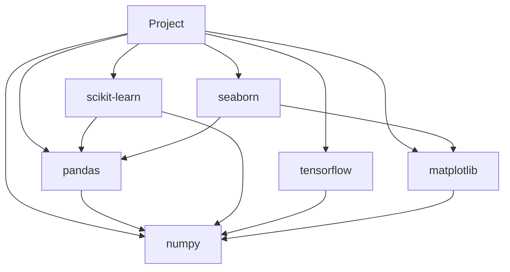
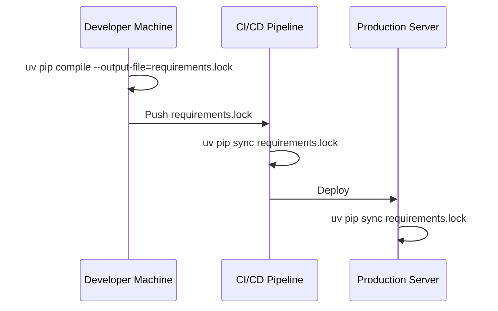
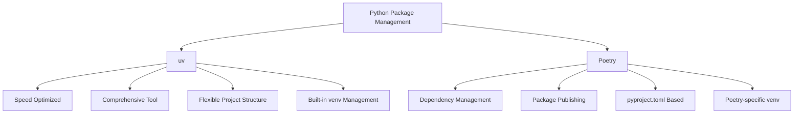
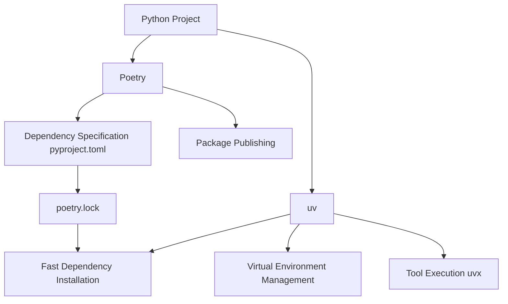
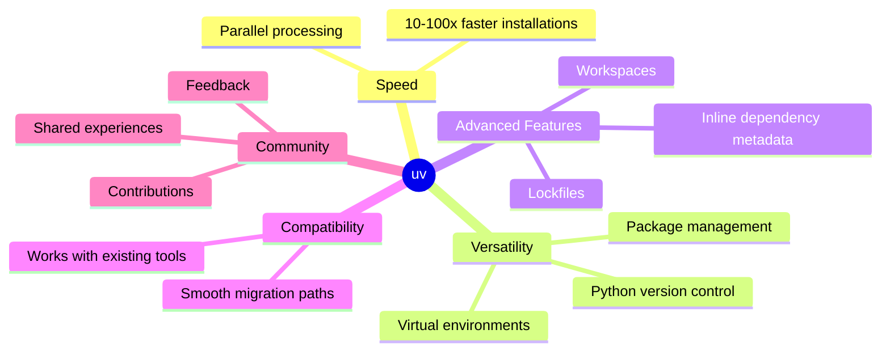

# UV for the Impatients

## Introduction: Why uv?

Imagine you're a Python developer working on a complex project with dozens of dependencies. You've just spent the last 30 minutes watching pip slowly install packages, only to encounter a version conflict that sends you back to square one. Frustrating, right? Now, picture a world where package installations happen in the blink of an eye, dependencies resolve seamlessly, and you can switch between Python versions faster than you can say "virtual environment." Welcome to the world of uv, the lightning-fast Python package manager that's about to revolutionize your development workflow.


### Why should you care about uv?

Let's face it: the Python ecosystem has been crying out for a faster, more efficient package manager for years. While tools like pip, poetry, and pipenv have served us well, they often fall short when it comes to speed and versatility. Enter uv, the turbo-charged solution to your Python package management woes.

**Pro Tip:** Time is money in software development. By adopting uv, you can potentially save hours each week on package installations and environment setups, allowing you to focus on what really matters – writing great code.

### What exactly is uv?

uv is not just another package manager; it's a Swiss Army knife for Python developers. Written in Rust for blazing-fast performance, uv combines the functionality of multiple tools into a single, cohesive package. It's designed to replace pip, pip-tools, pipx, poetry, pyenv, virtualenv, and more, all while being 10-100 times faster than traditional methods[1].

Here's a quick rundown of uv's key features:

- Lightning-fast package installations and updates
- Seamless Python version management
- Comprehensive project management with universal lockfiles
- Cargo-style workspaces for scalable projects
- A pip-compatible interface for easy migration
- Script support with inline dependency metadata
- Global caching for efficient disk space usage

To put uv's speed into perspective, let's look at a simple comparison:


As you can see, what might take pip 5 seconds to accomplish, uv can do in a mere 0.5 seconds. That's a 10x improvement in speed!

**Pause and reflect:** Think about your current Python development workflow. How much time do you spend waiting for packages to install or environments to set up? Jot down a rough estimate – you might be surprised by how much time you could save with uv.

Now that we've covered the "why" and "what" of uv, let's dive into the "how" and get our hands dirty with some practical examples.

## Getting Started

### Installation: Your First Step Towards Lightning Speed

Installing uv is as easy as pie, and it doesn't even require Rust or Python to be pre-installed on your system. Let's walk through the process step by step.

For macOS and Linux users:

```bash
$ curl -LsSf https://astral.sh/uv/install.sh | sh
```

For Windows users:

```powershell
$ powershell -c "irm https://astral.sh/uv/install.ps1 | iex"
```

Once the installation is complete, verify it by running:

```bash
$ uv --version
```

You should see the version number of uv displayed, confirming a successful installation.

**Pro Tip:** If you're already using pip and want to give uv a try without committing fully, you can install it using pip itself:

```bash
$ pip install uv
```

This method allows you to test uv alongside your existing setup.

### First Steps: Creating a Project and Adding Dependencies

Now that we have uv installed, let's create a new project and add some dependencies. We'll create a simple web scraping project to demonstrate uv's capabilities.

1. Create a new project:

```bash
$ uv init web_scraper
Initialized project `web_scraper` at /path/to/web_scraper
$ cd web_scraper
```

2. Add dependencies:

```bash
$ uv add requests beautifulsoup4
Creating virtualenv at: .venv
Resolved 3 packages in 170ms
Built web_scraper @ file:///path/to/web_scraper
Prepared 3 packages in 627ms
Installed 3 packages in 1ms
+ web_scraper==0.1.0 (from file:///path/to/web_scraper)
+ requests==2.31.0
+ beautifulsoup4==4.12.2
```

Notice how quickly uv resolves and installs the packages. This speed becomes even more apparent with larger projects and more complex dependency trees.

3. Create a simple script:

Create a file named `scraper.py` in your project directory with the following content:

```python
import requests
from bs4 import BeautifulSoup

url = "https://news.ycombinator.com"
response = requests.get(url)
soup = BeautifulSoup(response.text, 'html.parser')

for story in soup.find_all('span', class_='titleline')[:5]:
    print(story.text)
```

4. Run the script:

```bash
$ uv run python scraper.py
```

You should see the titles of the top 5 stories from Hacker News printed to your console.

**Quick Quiz:**
1. What command did we use to create a new project with uv?
2. How does uv's package installation speed compare to pip?
3. What are the two main dependencies we added to our web scraping project?

(Answers: 1. `uv init`, 2. 10-100 times faster, 3. requests and beautifulsoup4)

In this section, we've covered the basics of getting started with uv. We've installed the tool, created a project, added dependencies, and run a simple script. Already, you can see how uv streamlines the process and saves time at every step.

Next, we'll dive deeper into uv's package management capabilities and explore how it handles more complex scenarios. But before we move on, take a moment to appreciate the speed and simplicity you've just experienced. This is just the tip of the iceberg when it comes to uv's capabilities.

**Pro Tip:** Get into the habit of using `uv add` instead of `pip install` when adding new packages to your projects. Not only is it faster, but it also automatically updates your project's dependency information, ensuring better reproducibility.

Now, let's move on to the next section, where we'll explore uv's advanced package management features and how they can supercharge your Python development workflow.

## Package Management

### Dependency Resolution: Taming the Complexity Beast

One of uv's standout features is its lightning-fast dependency resolution. But speed isn't the only advantage – uv also excels at handling complex dependency trees with grace and precision.

Let's dive into a more complex example to showcase uv's capabilities. Imagine we're building a data science project that requires several packages with potentially conflicting dependencies.

```bash
$ uv add numpy pandas scikit-learn tensorflow matplotlib seaborn
Resolved 24 packages in 312ms
Installed 24 packages in 5.2s
+ numpy==1.24.3
+ pandas==2.0.2
+ scikit-learn==1.2.2
+ tensorflow==2.12.0
+ matplotlib==3.7.1
+ seaborn==0.12.2
...
```

In this example, uv resolved and installed 24 packages, including all necessary dependencies, in just over 5 seconds. With pip, this process could easily take several minutes.

**Pro Tip:** When working on data science projects, use uv's speed to your advantage by experimenting with different package combinations. You can quickly add or remove packages without wasting time on lengthy installations.

To illustrate the complexity of dependency resolution, let's visualize a simplified dependency tree for our data science project:



uv navigates this complex web of dependencies effortlessly, ensuring that all packages are compatible and installed in the correct versions.

### Virtual Environments: Isolation Made Easy

Virtual environments are crucial for maintaining clean and reproducible Python setups. uv simplifies the process of creating and managing virtual environments, integrating seamlessly with its package management features.

Let's create a new virtual environment for our data science project:

```bash
$ uv venv
Using Python 3.9.7
Creating virtualenv at: .venv
Activate with: source .venv/bin/activate
```

Now, let's activate the environment and check our Python version:

```bash
$ source .venv/bin/activate
(.venv) $ python --version
Python 3.9.7
```

uv allows you to easily switch between Python versions for different projects. Let's create another environment with a different Python version:

```bash
$ uv venv --python 3.8
Using Python 3.8.12
Creating virtualenv at: .venv-3.8
Activate with: source .venv-3.8/bin/activate
```

**Pause and reflect:** Think about your current workflow for managing different Python versions and virtual environments. How does uv's approach simplify this process? What benefits do you see for your development workflow?

Best practices for environment isolation with uv:

1. Create a new virtual environment for each project.
2. Use `uv venv --python` to specify the exact Python version you need.
3. Always activate the virtual environment before installing packages or running scripts.
4. Use `uv pip freeze > requirements.txt` to save your environment's package list.

By following these practices, you ensure that your projects remain isolated and reproducible, regardless of your system's global Python setup.

**Quick Quiz:**
1. How does uv handle complex dependency trees?
2. What command do we use to create a new virtual environment with uv?
3. How can we create a virtual environment with a specific Python version using uv?

(Answers: 1. It resolves them quickly and efficiently, ensuring compatibility. 2. `uv venv` 3. `uv venv --python <version>`)

In this section, we've explored uv's powerful dependency resolution capabilities and its streamlined approach to virtual environment management. These features combine to create a robust and efficient package management system that can handle even the most complex Python projects with ease.

Next, we'll dive into uv's project management features, including workspaces and lockfiles, which take your Python development to the next level of organization and reproducibility.

## Project Management

### Workspaces: Scaling Your Python Projects

As your Python projects grow in complexity, you might find yourself managing multiple interconnected packages or services. This is where uv's workspace feature shines, offering a Cargo-style approach to managing multi-package projects.

Let's create a workspace for a hypothetical e-commerce platform with multiple components:

```bash
$ mkdir ecommerce-platform && cd ecommerce-platform
$ uv init --workspace
Initialized workspace `ecommerce-platform` at /path/to/ecommerce-platform
```

Now, let's add some packages to our workspace:

```bash
$ uv pkg new web-frontend
$ uv pkg new api-backend
$ uv pkg new recommendation-engine
```

Your project structure should now look like this:

```
ecommerce-platform/
├── pyproject.toml
├── web-frontend/
│   └── pyproject.toml
├── api-backend/
│   └── pyproject.toml
└── recommendation-engine/
    └── pyproject.toml
```

With this structure, you can manage dependencies for each package independently while also sharing common dependencies across the workspace.

**Pro Tip:** Use workspaces to break down large, monolithic projects into smaller, more manageable components. This approach improves code organization, makes testing easier, and allows for more flexible deployment options.

### Lockfiles: Ensuring Reproducibility

One of the most critical aspects of modern Python development is ensuring reproducibility across different environments. uv addresses this with its universal lockfile system.

Let's add some dependencies to our api-backend package and generate a lockfile:

```bash
$ cd api-backend
$ uv add fastapi sqlalchemy
$ uv pip compile --output-file=requirements.lock
```

This creates a `requirements.lock` file that precisely specifies the versions of all dependencies, including transitive ones.

To demonstrate the power of lockfiles, let's simulate a scenario where we need to set up the project on a different machine:

```bash
$ uv pip sync requirements.lock
Resolved 14 packages in 8ms
Installed 14 packages in 1.2s
+ fastapi==0.95.2
+ sqlalchemy==2.0.15
...
```

By using `uv pip sync` with the lockfile, we ensure that exactly the same package versions are installed, guaranteeing a consistent environment across different setups.

**Pause and reflect:** Think about a time when you encountered "it works on my machine" issues. How could uv's lockfile system have prevented or solved those problems?

Continuing from Lockfiles: Ensuring Reproducibility...

To visualize the power of lockfiles, let's create a simple diagram showing how they ensure consistency across different environments:



This diagram illustrates how a lockfile created on a developer's machine can be used to ensure identical environments in CI/CD pipelines and production servers.

**Pro Tip:** Commit your lockfiles to version control. This practice ensures that all team members and deployment environments use exactly the same package versions, eliminating "works on my machine" issues.

## Tool Management

### Running Tools: Ephemeral Environments with uvx

uv introduces a powerful feature called `uvx` for running Python tools in ephemeral environments. This approach allows you to use CLI tools without polluting your global Python installation or project environment.

Let's see how to use `uvx` with a popular code formatting tool, Black:

```bash
$ uvx black .
Resolved 1 package in 23ms
Installed 1 package in 1.2s
All done! ✨ 🍰 ✨
8 files left unchanged.
```

In this example, `uvx` created a temporary environment, installed Black, ran it on your current directory, and then cleaned up the environment. All of this happened in a fraction of the time it would take to install Black globally or in your project environment.

### Python Version Management: Flexibility at Your Fingertips

uv also simplifies Python version management. Let's explore how to work with multiple Python versions in your project:

```bash
$ uv python install 3.8
Installing CPython 3.8.18...
$ uv python install 3.9
Installing CPython 3.9.18...
$ uv python list
3.8.18
3.9.18 (active)
```

Now, let's create a virtual environment with a specific Python version:

```bash
$ uv venv --python 3.8
Using Python 3.8.18
Creating virtualenv at: .venv-3.8
```

**Pause and reflect:** How does uv's approach to Python version management compare to tools you've used before, like pyenv or conda? What advantages do you see in uv's integrated approach?

## Advanced Features

### Script Support: Inline Dependency Metadata

uv introduces an innovative feature that allows you to specify dependencies directly in your Python scripts. This is particularly useful for small scripts or one-off tasks.

Let's create a script called `web_scraper.py` with inline dependency metadata:

```python
#!/usr/bin/env uvx
# uv: requests beautifulsoup4

import requests
from bs4 import BeautifulSoup

url = "https://news.ycombinator.com"
response = requests.get(url)
soup = BeautifulSoup(response.text, 'html.parser')

for story in soup.find_all('span', class_='titleline')[:5]:
    print(story.text)
```

Now, you can run this script directly:

```bash
$ chmod +x web_scraper.py
$ ./web_scraper.py
```

uv will automatically create an ephemeral environment with the specified dependencies, run the script, and then clean up.

### pip Interface: Bridging the Gap

While uv offers many advanced features, it also provides a familiar pip interface for those transitioning from traditional tools. This interface includes powerful features like overrides and universal resolutions.

Let's explore an example of using overrides:

```bash
$ uv pip install --override requests==2.25.1 'flask>2.0.0'
```

This command installs the latest version of Flask (>2.0.0) while forcing requests to version 2.25.1, regardless of what other packages might require.

**Pro Tip:** Use overrides cautiously. While they can be powerful for resolving conflicts or testing specific versions, overusing them can lead to hard-to-reproduce environments.

## Best Practices and Tips

### Optimizing Performance

To get the most out of uv's speed, consider these tips:

1. **Use caching:** uv automatically caches downloaded packages. Ensure you have enough disk space allocated for the cache to maximize performance.

2. **Leverage parallel installations:** uv installs packages in parallel by default. On multi-core systems, this can significantly speed up the process.

3. **Minimize network requests:** Use lockfiles and `uv pip sync` to reduce the number of network requests needed for installations.

### Common Pitfalls

1. **Version conflicts:** Always use a lockfile to prevent unexpected version changes.
2. **Overusing overrides:** While powerful, overusing overrides can lead to difficult-to-reproduce environments.
3. **Ignoring platform differences:** Remember that lockfiles are platform-specific. Use separate lockfiles for different operating systems if necessary.

## Real-world Scenarios

### Case Study: Large-scale Project

Imagine you're working on a large-scale web application with multiple microservices. Here's how you might set it up using uv:

1. Create a workspace:
   ```bash
   $ uv init --workspace my-web-app
   $ cd my-web-app
   ```

2. Add services:
   ```bash
   $ uv pkg new auth-service
   $ uv pkg new user-service
   $ uv pkg new product-service
   ```

3. Set up dependencies for each service:
   ```bash
   $ cd auth-service
   $ uv add fastapi pyjwt
   $ cd ../user-service
   $ uv add fastapi sqlalchemy
   $ cd ../product-service
   $ uv add fastapi redis
   ```

4. Create a lockfile for the entire project:
   ```bash
   $ uv pip compile --output-file=requirements.lock
   ```

5. Use the lockfile in your CI/CD pipeline:
   ```bash
   $ uv pip sync requirements.lock
   ```

This approach ensures consistent environments across all services and deployment stages.

### Case Study: Data Science Workflow

For a data science project, you might set up your environment like this:

1. Create a new project:
   ```bash
   $ uv init data-analysis-project
   $ cd data-analysis-project
   ```

2. Add common data science packages:
   ```bash
   $ uv add numpy pandas scikit-learn matplotlib jupyter
   ```

3. Create a lockfile:
   ```bash
   $ uv pip compile --output-file=requirements.lock
   ```

4. Start a Jupyter notebook with the project environment:
   ```bash
   $ uvx jupyter notebook
   ```

This setup ensures reproducibility for your data analysis projects, making it easy to share and collaborate with team members.

Certainly! I'll add a chapter comparing uv and Poetry, discussing the migration process from Poetry to uv, and explaining how to use uv with Poetry. I'll insert this chapter before the "Conclusion" section.

## uv and Poetry: Bridging the Gap

As we've explored uv's capabilities, you might be wondering how it compares to other popular Python package management tools, particularly Poetry. In this chapter, we'll dive into the differences between uv and Poetry, guide you through migrating from Poetry to uv, and show you how to use uv alongside Poetry in your projects.

### Differences between uv and Poetry

While both uv and Poetry aim to improve Python package management, they have distinct approaches and features:

1. **Speed:** uv is designed for speed and can be 10-100 times faster than traditional tools, including Poetry.

2. **Scope:** uv is a more comprehensive tool, aiming to replace not just Poetry, but also pip, pip-tools, pipx, pyenv, and virtualenv. Poetry focuses primarily on dependency management and packaging.

3. **Project Structure:** Poetry uses a `pyproject.toml` file for configuration and a `poetry.lock` file for locking dependencies. uv is more flexible and can work with various project structures, including Poetry's.

4. **Virtual Environment Management:** uv has built-in virtual environment management, while Poetry creates and manages its own virtual environments.

5. **Package Publishing:** Poetry has built-in tools for building and publishing packages to PyPI. uv focuses on package installation and management but doesn't include publishing tools.

Let's visualize these differences:



**Pro Tip:** While uv is generally faster, Poetry's all-in-one approach for dependency management and package publishing can be advantageous for projects that frequently publish to PyPI.

### Migrating from Poetry to uv

If you're considering migrating from Poetry to uv, here's a step-by-step guide:

1. **Install uv:** If you haven't already, install uv as described earlier in this article.

2. **Convert Poetry's lockfile:** uv can directly use Poetry's lockfile. In your project directory, run:

   ```bash
   $ uv pip compile poetry.lock --output-file=requirements.lock
   ```

   This command converts Poetry's lockfile to uv's format.

3. **Create a virtual environment:** Use uv to create a new virtual environment:

   ```bash
   $ uv venv
   ```

4. **Install dependencies:** Install the dependencies from the converted lockfile:

   ```bash
   $ uv pip sync requirements.lock
   ```

5. **Update your scripts:** If you were using `poetry run` to execute scripts, replace it with `uv run`. For example:

   ```bash
   # Old Poetry command
   $ poetry run python my_script.py

   # New uv command
   $ uv run python my_script.py
   ```

6. **Update CI/CD pipelines:** Update any CI/CD scripts that used Poetry to now use uv. For example:

   ```yaml
   # Old Poetry-based CI step
   - run: poetry install
   - run: poetry run pytest

   # New uv-based CI step
   - run: uv pip sync requirements.lock
   - run: uv run pytest
   ```

**Pause and reflect:** Consider your current Poetry-based projects. What challenges might you face in migrating them to uv? What benefits could you gain from the migration?

### Using uv with Poetry

If you're not ready to fully migrate from Poetry to uv, you can still leverage uv's speed and efficiency alongside Poetry. Here's how:

1. **Use uv for fast installations:** In projects with a `poetry.lock` file, you can use uv to quickly install dependencies:

   ```bash
   $ uv pip sync poetry.lock
   ```

   This command reads Poetry's lockfile and installs dependencies much faster than `poetry install`.

2. **Leverage uv's virtual environment management:** Create a virtual environment with uv, then use it with Poetry:

   ```bash
   $ uv venv
   $ poetry env use .venv/bin/python
   ```

   This allows you to use uv's faster venv creation while still using Poetry for dependency management.

3. **Use uv for running tools:** Even in Poetry projects, you can use `uvx` for running one-off tools:

   ```bash
   $ uvx black .
   ```

   This leverages uv's speed for tool execution without affecting your Poetry setup.

Here's a diagram illustrating how uv and Poetry can coexist in a project:



**Pro Tip:** When using uv alongside Poetry, always ensure that your `poetry.lock` file is up to date. You can use `poetry lock --no-update` to refresh the lockfile without changing dependencies.

By understanding the differences between uv and Poetry and knowing how to use them together, you can leverage the strengths of both tools to optimize your Python development workflow. Whether you choose to fully migrate to uv or use it alongside Poetry, you'll benefit from uv's speed and efficiency.

**Quick Quiz:**
1. What is a key advantage of uv over Poetry in terms of performance?
2. How can you convert a Poetry lockfile to a uv-compatible format?
3. What command would you use to run a Python script with uv in a Poetry project?

(Answers: 1. uv is generally 10-100 times faster for package installations. 2. Use `uv pip compile poetry.lock --output-file=requirements.lock`. 3. `uv run python script.py`)

Now that we've explored how uv relates to Poetry, let's move on to the conclusion of our comprehensive guide to uv.


## Conclusion

As we wrap up this comprehensive guide to uv, it's clear that we've embarked on an exciting journey through the future of Python package management. From its lightning-fast installations to its versatile project management capabilities, uv represents a significant leap forward in the Python ecosystem.

Let's recap the key points we've covered:

1. **Speed and Efficiency:** uv's blazing-fast performance, often 10-100 times faster than traditional tools, can significantly reduce development time and improve productivity.

2. **Comprehensive Tool:** uv isn't just a package manager; it's a Swiss Army knife for Python developers, combining the functionality of pip, pip-tools, pipx, pyenv, and virtualenv into a single, cohesive tool.

3. **Advanced Features:** We've explored uv's powerful features like workspaces, lockfiles, and inline dependency metadata, which enable more robust and maintainable Python projects.

4. **Python Version Management:** uv simplifies working with multiple Python versions, making it easier to manage complex projects with varying Python requirements.

5. **Tool Management:** The `uvx` command allows for efficient execution of Python tools in ephemeral environments, streamlining development workflows.

6. **Compatibility and Migration:** We've seen how uv can work alongside existing tools like Poetry, offering a smooth transition path for developers looking to optimize their workflows.

As you continue your journey with uv, remember that the best way to learn is by doing. Here's an expanded challenge for you:

1. **Migrate an Existing Project:** Take one of your current Python projects and migrate it to use uv. Start by creating a new virtual environment with uv, generate a lockfile, and explore how uv can optimize your development workflow.

2. **Compare Performance:** If you're using Poetry or another package manager, try running the same installation process with uv and compare the speed. Document your findings – this data can be valuable for your team or the broader community.

3. **Explore Advanced Features:** Experiment with uv's advanced features like workspaces or inline dependency metadata. Try setting up a multi-package project using uv's workspace feature.

4. **Integrate with CI/CD:** If you have a CI/CD pipeline, try integrating uv into it. Compare the execution times before and after the integration.

**Call-to-Action:** Within the next 24 hours, commit to completing at least one of these challenges. Share your experience with the community – what worked well? What challenges did you face? How did uv impact your development workflow? Your insights could help shape the future of Python package management!

Remember, uv is still an evolving tool, and your feedback is crucial. Don't hesitate to:

- Report issues or suggest improvements on the uv GitHub repository.
- Share your success stories or challenges in Python community forums.
- Write blog posts or create tutorials about your experiences with uv to help others in the community.

As we look to the future, it's exciting to consider how tools like uv will continue to shape the Python development landscape. By embracing these advancements, we not only improve our individual workflows but also contribute to the evolution of the entire Python ecosystem.



In conclusion, uv represents a significant step forward in Python package management. Its speed, versatility, and advanced features offer Python developers powerful tools to streamline their workflows and build more robust applications. Whether you're a seasoned Python developer or just starting your journey, uv has something to offer.

As you integrate uv into your projects, remember that you're not just optimizing your own workflow – you're participating in the ongoing evolution of Python development practices. Your experiences, feedback, and contributions can help shape the future of tools like uv and the broader Python ecosystem.

So, embrace the power of uv, experiment with its features, and don't be afraid to push its boundaries. The future of Python development is fast, efficient, and exciting – and with uv, you're well-equipped to be a part of it.

Happy coding, and may your packages always install at the speed of light!
