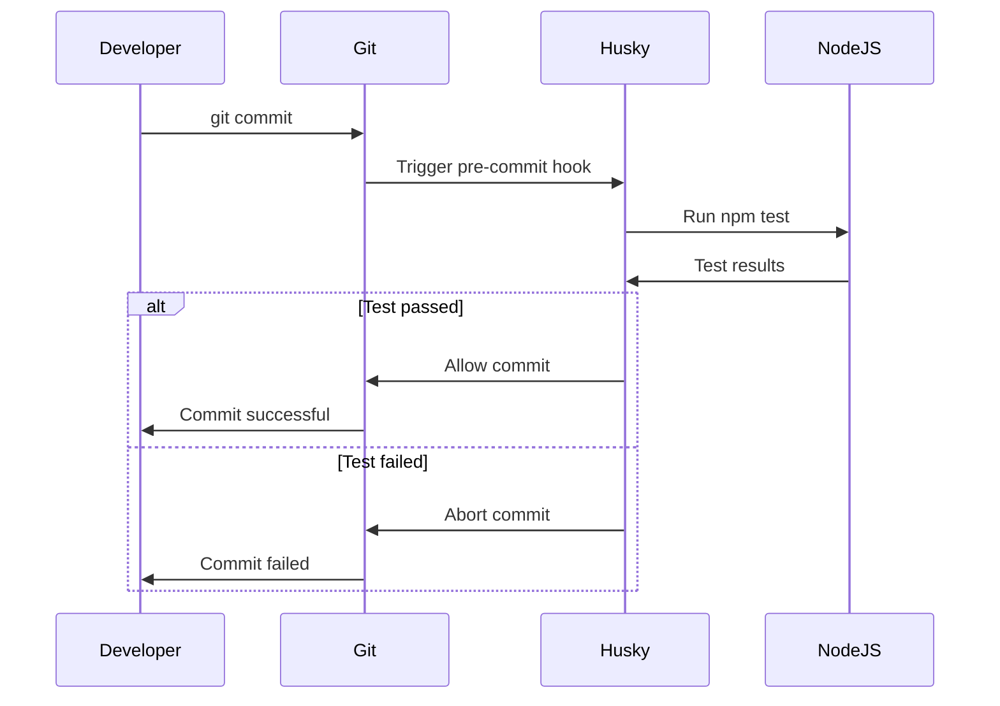
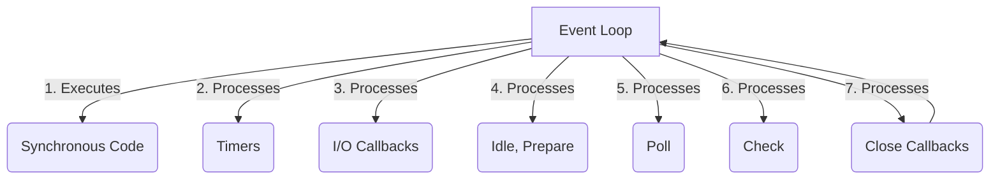
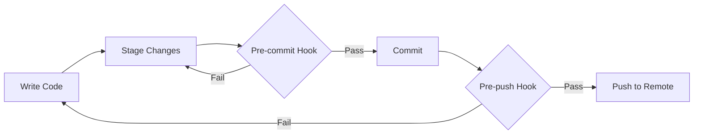

# Husky
## Chapter 1: Introduction: The Power of Husky and Node.js

### Why Husky and Node.js?

Picture this: You're a developer working on a crucial project. The deadline is looming, and your team is pushing code at breakneck speed. Suddenly, a critical bug sneaks into production, causing chaos. Sound familiar? This scenario is all too common in the world of software development. But what if I told you there's a dynamic duo that could dramatically reduce such incidents while supercharging your development process?

Enter Husky and Node.js – the power couple of modern web development.


#### The need for automation

In today's fast-paced development environment, manual processes are not just inefficient; they're a liability. Every manual check, every forgotten test, every inconsistency in code style is a potential point of failure. This is where automation becomes not just useful, but essential.

> "The first rule of any technology used in a business is that automation applied to an efficient operation will magnify the efficiency. The second is that automation applied to an inefficient operation will magnify the inefficiency." - Bill Gates

This quote underscores a crucial point: automation is powerful, but it needs to be applied thoughtfully. This is where Husky shines, providing a seamless way to automate crucial parts of your development workflow.

#### The importance of code quality

Let's face it – in the heat of development, it's easy to cut corners. Maybe you skip writing tests for that new feature, or you forget to run the linter before committing your code. These small oversights can accumulate, leading to technical debt and, eventually, major headaches.

Maintaining high code quality isn't just about satisfying your inner perfectionist; it has real, tangible benefits:

1. Reduced bugs and issues in production
2. Easier onboarding for new team members
3. Improved maintainability and scalability of your codebase
4. Increased developer productivity in the long run

Husky, when combined with Node.js, provides a powerful framework for enforcing code quality standards automatically, ensuring that your team's best practices are followed consistently.

### What are Husky and Node.js?

Now that we've established why this combination is so powerful, let's take a closer look at what Husky and Node.js actually are.

#### Node.js in a nutshell

Node.js is a JavaScript runtime built on Chrome's V8 JavaScript engine. But what does that mean in practical terms?

Imagine you're a chef (the developer) who has always been confined to cooking (coding) in the kitchen (browser). Suddenly, you're given the ability to cook anywhere – in the backyard, in a food truck, or even in a spaceship! That's what Node.js does for JavaScript. It takes JavaScript beyond the browser, allowing you to use it for server-side programming, command-line tools, and much more.

Key features of Node.js include:

1. **Non-blocking I/O**: Node.js can handle many operations concurrently without getting bogged down.
2. **npm (Node Package Manager)**: A vast ecosystem of open-source libraries and tools.
3. **Cross-platform compatibility**: Write once, run (almost) anywhere.
4. **Active community**: Continuous improvements and extensive resources.

#### Husky: Your faithful code guardian

If Node.js is the versatile chef in our analogy, then Husky is the diligent kitchen porter who ensures that all the tools are clean, sharp, and in the right place before any cooking begins.

Husky is a tool that makes Git hooks easy. Git hooks are scripts that Git executes before or after events such as commit, push, and receive. Husky acts as a friendly interface to these hooks, allowing you to configure them using simple commands in your project's package.json file.

How Husky enhances development workflows:

1. **Automated quality checks**: Run linters, tests, or any scripts before commits or pushes.
2. **Consistent code style**: Enforce formatting rules across your team.
3. **Prevent bad commits**: Stop problematic code from even being committed.
4. **Customizable**: Easily adapt to your project's specific needs.

### How to get started

Now that you're excited about the possibilities, let's get our hands dirty! We'll set up a basic project using Node.js and Husky.

#### Setting up your development environment

First, let's make sure you have everything you need:

1. **Install Node.js**: Visit nodejs.org and download the version appropriate for your operating system. Follow the installation instructions.

2. **Verify the installation**: Open your terminal and run:

   ```bash
   node --version
   npm --version
   ```

   If you see version numbers, you're good to go!

3. **Install Git**: If you don't already have Git installed, download it from git-scm.com and follow the installation instructions.

#### Your first Husky-Node.js project

Let's create a simple project to demonstrate the power of this combination:

1. Create a new directory and initialize a Node.js project:

   ```bash
   mkdir husky-node-demo
   cd husky-node-demo
   npm init -y
   ```

2. Install Husky:

   ```bash
   npm install husky --save-dev
   ```

3. Enable Git hooks:

   ```bash
   npx husky install
   ```

4. Add a pre-commit hook:

   ```bash
   npx husky add .husky/pre-commit "npm test"
   ```

5. Create a simple test:
   
   Create a file named `test.js` with the following content:

   ```javascript
   console.log('Test passed!');
   ```

6. Update your `package.json`:

   ```json
   {
     "scripts": {
       "test": "node test.js"
     }
   }
   ```

Now, whenever you try to make a commit, Husky will run your test script first. If the test fails, the commit will be aborted.



This diagram illustrates the flow of a commit process with Husky and Node.js in place.

### When to use Husky and Node.js

While Husky and Node.js are incredibly powerful, it's important to understand when they're most beneficial.

#### Ideal use cases

1. **Large, collaborative projects**: When multiple developers are working on the same codebase, Husky ensures consistency and quality.

2. **Continuous Integration/Continuous Deployment (CI/CD) pipelines**: Husky can be a crucial first line of defense in your CI/CD process.

3. **Projects with strict code quality requirements**: For applications where bugs could have serious consequences (e.g., financial systems, healthcare applications), Husky can enforce rigorous checks.

4. **Rapid development cycles**: When you need to move fast without breaking things, this combination helps maintain quality even under pressure.

#### Common misconceptions

1. **"It's overkill for small projects"**: Even in small projects, consistency and quality matter. Husky's simplicity makes it worthwhile even for solo developers.

2. **"It will slow down my workflow"**: While there might be a small initial setup time, the long-term benefits in code quality and reduced bugs far outweigh this.

3. **"Node.js is just for web servers"**: While Node.js excels at building web servers, it's capable of much more, including CLI tools, desktop applications, and even IoT devices.

### Pro Tips

1. **Custom scripts**: Don't limit yourself to just linting and testing. You can use Husky to run any script before commits or pushes. For example, you could automatically update your changelog or check for sensitive data.

2. **Selective hooks**: Use the `--no-verify` flag with Git commands to bypass hooks when necessary, but use this sparingly!

3. **Team buy-in**: When introducing Husky to a team, ensure everyone understands its benefits. A tool is only effective if the team embraces it.

### Pause and Reflect

Before we move on, take a moment to consider:

1. How could Husky and Node.js improve your current development workflow?
2. What quality checks or automations would be most beneficial for your projects?
3. Can you think of any potential challenges in implementing this in your team, and how might you address them?

In the next chapter, we'll dive deeper into Node.js fundamentals, exploring its asynchronous nature and how to harness its full power. But before that, let's end with a quick quiz to reinforce what we've learned.

### Quick Quiz

1. What is the primary purpose of Husky in a development workflow?
2. Name two key features of Node.js that make it powerful for server-side development.
3. True or False: Husky can only be used with Node.js projects.
4. What command do you use to add a pre-commit hook with Husky?

(Answers will be provided at the end of the article)

As we conclude this introductory chapter, I hope you're starting to see the immense potential of combining Husky and Node.js in your development workflow. In the next chapter, we'll roll up our sleeves and dive into the core concepts of Node.js that will set the foundation for our journey ahead.

Remember, the goal is to become proficient quickly, so don't hesitate to experiment with the concepts we've covered. Try setting up a small project with a custom Husky hook – you'll be surprised at how quickly you can improve your development process!

## Chapter 2: Node.js Fundamentals

Welcome back, impatient learner! Now that we've got a taste of what Husky and Node.js can do together, it's time to dive deeper into the world of Node.js. In this chapter, we'll explore the core concepts that make Node.js a powerhouse for modern application development.

### Asynchronous Programming: The Heart of Node.js

Imagine you're at a busy coffee shop. In a synchronous world, the barista would take one order, make the drink, serve it, and only then move to the next customer. This would result in a very long, inefficient queue. Now, picture an asynchronous coffee shop: the barista takes multiple orders, starts preparing them simultaneously, and serves them as they're ready. This is much more efficient, right? This is exactly how Node.js operates!

#### Callbacks: The Traditional Approach

Callbacks are the simplest form of asynchronous programming in Node.js. They're functions that are executed after a given task has been completed.

Let's look at a simple example:

```javascript
const fs = require('fs');

fs.readFile('example.txt', 'utf8', (err, data) => {
  if (err) {
    console.error('Error reading file:', err);
    return;
  }
  console.log('File contents:', data);
});

console.log('This will be printed first!');
```

In this example, `fs.readFile` is non-blocking. It starts reading the file and immediately moves to the next line of code. When the file reading is complete, it calls the provided callback function.

> Pro Tip: While callbacks are fundamental to Node.js, be cautious of "callback hell" - deeply nested callbacks that can make code hard to read and maintain.

#### Promises: A Step Towards Cleaner Code

Promises provide a more structured way to handle asynchronous operations. They represent a value that may not be available yet but will be resolved at some point in the future.

Here's the same file reading example using Promises:

```javascript
const fs = require('fs').promises;

fs.readFile('example.txt', 'utf8')
  .then(data => {
    console.log('File contents:', data);
  })
  .catch(err => {
    console.error('Error reading file:', err);
  });

console.log('This will still be printed first!');
```

Promises allow us to chain operations and handle errors more elegantly.

#### Async/Await: The Modern Approach

Async/Await is syntactic sugar built on top of Promises, making asynchronous code look and behave more like synchronous code.

Let's refactor our example once more:

```javascript
const fs = require('fs').promises;

async function readFileContents() {
  try {
    const data = await fs.readFile('example.txt', 'utf8');
    console.log('File contents:', data);
  } catch (err) {
    console.error('Error reading file:', err);
  }
}

readFileContents();
console.log('This will be printed first!');
```

Async/Await makes our code more readable and easier to reason about, especially when dealing with multiple asynchronous operations.

> Pro Tip: Always use try/catch blocks with async/await to handle potential errors gracefully.

### Modules and NPM: The Building Blocks of Node.js Applications

If Node.js is the engine of your application, modules are the parts that make it run smoothly. NPM (Node Package Manager) is your toolbox, filled with pre-built parts ready to be used.

#### CommonJS vs. ES Modules

Node.js supports two module systems: CommonJS (the original) and ES Modules (the new standard).

CommonJS example:

```javascript
// math.js
module.exports = {
  add: (a, b) => a + b,
  subtract: (a, b) => a - b
};

// app.js
const math = require('./math');
console.log(math.add(5, 3)); // Output: 8
```

ES Modules example:

```javascript
// math.mjs
export const add = (a, b) => a + b;
export const subtract = (a, b) => a - b;

// app.mjs
import { add, subtract } from './math.mjs';
console.log(add(5, 3)); // Output: 8
```

> Pro Tip: When working with ES Modules, use the `.mjs` extension for clarity, or set `"type": "module"` in your package.json.

#### NPM Basics

NPM is a package manager for JavaScript, primarily used with Node.js. It allows you to easily install, share, and manage dependencies in your projects.

Here are some essential NPM commands:

- `npm init`: Initializes a new Node.js project
- `npm install <package>`: Installs a package
- `npm install`: Installs all dependencies listed in package.json
- `npm run <script>`: Runs a script defined in package.json

Let's create a simple project using a popular NPM package:

```bash
mkdir npm-demo
cd npm-demo
npm init -y
npm install lodash
```

Now, let's use lodash in our project:

```javascript
// app.js
const _ = require('lodash');

const numbers = [1, 2, 3, 4, 5];
console.log(_.sum(numbers)); // Output: 15
```

Run this with `node app.js`, and you'll see the sum of the numbers printed.

### Event-Driven Architecture: The Reactive Nature of Node.js

Node.js uses an event-driven, non-blocking I/O model. This makes it lightweight and efficient, perfect for data-intensive real-time applications.

#### The Event Loop

The event loop is the secret sauce that allows Node.js to perform non-blocking I/O operations. It's like a conductor in an orchestra, ensuring all the instruments (your code) play in harmony.



This diagram illustrates the phases of the Node.js event loop.

#### Emitters and Listeners

The EventEmitter class is at the core of Node.js' event-driven architecture. Many of Node.js' built-in modules inherit from EventEmitter.

Let's create a simple EventEmitter:

```javascript
const EventEmitter = require('events');

class Coffee extends EventEmitter {}
const myCoffee = new Coffee();

// Listener
myCoffee.on('ready', () => {
  console.log('Coffee is ready!');
});

// Emitter
setTimeout(() => {
  myCoffee.emit('ready');
}, 3000);

console.log('Waiting for coffee...');
```

In this example, we're simulating a coffee machine. The `setTimeout` represents the brewing process, and after 3 seconds, it emits the 'ready' event.

### Pause and Reflect

Before we wrap up this chapter, take a moment to consider:

1. How does asynchronous programming in Node.js differ from what you're used to in other languages or environments?
2. Can you think of a real-world scenario where event-driven programming would be particularly useful?
3. How might you use NPM to improve your current development workflow?

### Quick Quiz

1. What are the three main ways to handle asynchronous operations in Node.js?
2. What's the difference between CommonJS and ES Modules?
3. What is the purpose of the Event Loop in Node.js?
4. How do you install a package using NPM?

(Answers will be provided at the end of the article)

### Practical Exercise

To solidify your understanding, try this exercise:

Create a simple Node.js application that:
1. Uses the `fs` module to read a text file asynchronously
2. Processes the contents (e.g., count the words)
3. Writes the result to a new file
4. Emits a custom event when the process is complete

Use Promises or async/await for file operations, and create a custom EventEmitter for the completion event.

This exercise will help you practice asynchronous operations, file system interaction, and event handling all in one go!

In the next chapter, we'll dive into Husky and see how it can automate and enhance our Node.js development workflow. Get ready to supercharge your Git hooks!

## Chapter 3: Husky: Your Code's Best Friend

Welcome back, eager learners! Now that we've got a solid foundation in Node.js, it's time to introduce Husky properly and see how it can revolutionize your development workflow. Think of Husky as your loyal coding companion, always at the ready to catch mistakes and enforce best practices.

### Git Hooks Demystified

Before we dive into Husky, let's understand what Git hooks are. Imagine you're about to send an important email. Wouldn't it be great if you had a friend who could quickly proofread it for spelling mistakes or missing attachments before you hit send? Git hooks are like that helpful friend, but for your code.

Git hooks are scripts that Git executes before or after events such as commit, push, and receive. They let you customize Git's internal behavior and trigger customizable actions at key points in the development lifecycle.

#### Pre-commit hooks

Pre-commit hooks run before a commit is created. They're perfect for tasks like:

- Linting your code
- Running unit tests
- Checking code formatting

#### Pre-push hooks

Pre-push hooks run before you push your code to a remote repository. They're great for:

- Running more comprehensive tests
- Building your project to check for compilation errors
- Checking for sensitive data or API keys

Here's a simple diagram to illustrate where these hooks fit in the Git workflow:



### Configuring Husky

Now that we understand Git hooks, let's see how Husky makes them easier to manage.

#### package.json integration

Husky allows you to define your Git hooks right in your `package.json` file. Here's how you can set it up:

1. Install Husky:
   ```bash
   npm install husky --save-dev
   ```

2. Add a prepare script to your `package.json`:
   ```json
   {
     "scripts": {
       "prepare": "husky install"
     }
   }
   ```

3. Enable Git hooks:
   ```bash
   npm run prepare
   ```

4. Add a hook:
   ```bash
   npx husky add .husky/pre-commit "npm test"
   ```

Now, every time you try to commit, Husky will run your tests first!

#### .huskyrc file

For more complex configurations, you can use a `.huskyrc` file. Create a `.huskyrc` file in your project root:

```json
{
  "hooks": {
    "pre-commit": "npm test && npm run lint",
    "pre-push": "npm run build"
  }
}
```

This configuration runs tests and linting before each commit, and builds your project before each push.

### Common Husky Use Cases

Let's explore some popular ways to use Husky in your projects.

#### Linting

Ensure your code adheres to your style guide by running a linter before each commit:

1. Install ESLint:
   ```bash
   npm install eslint --save-dev
   ```

2. Set up ESLint:
   ```bash
   npx eslint --init
   ```

3. Add a pre-commit hook:
   ```bash
   npx husky add .husky/pre-commit "npx eslint ."
   ```

Now, if your code doesn't pass the linter, you won't be able to commit!

#### Testing

Prevent bugs from sneaking into your codebase by running tests before each commit:

1. Set up your test script in `package.json`:
   ```json
   {
     "scripts": {
       "test": "jest"
     }
   }
   ```

2. Add a pre-commit hook:
   ```bash
   npx husky add .husky/pre-commit "npm test"
   ```

#### Formatting

Maintain consistent code style across your team with automatic formatting:

1. Install Prettier:
   ```bash
   npm install prettier --save-dev
   ```

2. Add a pre-commit hook:
   ```bash
   npx husky add .husky/pre-commit "npx prettier --write ."
   ```

This will automatically format your code before each commit.

> Pro Tip: Combine multiple checks in a single pre-commit hook using && between commands:
> ```bash
> npx husky add .husky/pre-commit "npm test && npx eslint . && npx prettier --write ."
> ```

### Pause and Reflect

Before moving on, consider:

1. How could Husky improve your current development process?
2. What potential challenges might you face when implementing Husky in a team environment?
3. Can you think of any custom scripts that would be useful to run as Git hooks in your projects?

### Quick Quiz

1. What is the main purpose of Git hooks?
2. How does Husky simplify the management of Git hooks?
3. Name three common use cases for Husky.
4. How would you add a pre-push hook using Husky?

(Answers will be provided at the end of the article)

## Chapter 4: Advanced Techniques and Best Practices

Congratulations on making it this far! You're now equipped with the fundamentals of Node.js and Husky. In this chapter, we'll explore some advanced techniques and best practices to take your skills to the next level.

### Performance Optimization

As your Node.js applications grow, performance becomes increasingly important. Let's look at some techniques to keep your apps running smoothly.

#### Profiling Node.js applications

Node.js comes with a built-in profiler that can help you identify performance bottlenecks. Here's how to use it:

1. Run your application with the profiler:
   ```bash
   node --prof app.js
   ```

2. This will generate a log file. Convert it to a readable format:
   ```bash
   node --prof-process isolate-0xnnnnnnnnnnnn-v8.log > processed.txt
   ```

3. Analyze the processed.txt file to identify slow functions or heavy memory usage.

#### Memory management

Memory leaks can severely impact your application's performance. Here are some tips to manage memory effectively:

1. Use `weak-ref` for caching to allow garbage collection.
2. Implement proper error handling to prevent resource leaks.
3. Use streams for handling large amounts of data.

Here's an example of using streams to efficiently read a large file:

```javascript
const fs = require('fs');
const readline = require('readline');

const rl = readline.createInterface({
  input: fs.createReadStream('large-file.txt'),
  crlfDelay: Infinity
});

rl.on('line', (line) => {
  console.log(`Line from file: ${line}`);
});
```

This approach uses much less memory than reading the entire file at once.

### Security Best Practices

Security should always be a top priority. Here are some key practices to keep your Node.js applications secure.

#### Input validation

Always validate and sanitize user input to prevent injection attacks. Consider using a library like `validator.js`:

```javascript
const validator = require('validator');

app.post('/login', (req, res) => {
  if (!validator.isEmail(req.body.email)) {
    return res.status(400).send('Invalid email');
  }
  // proceed with login
});
```

#### Dependency management

Regularly update your dependencies to patch security vulnerabilities. Use `npm audit` to check for known vulnerabilities:

```bash
npm audit
```

And fix them:

```bash
npm audit fix
```

### Continuous Integration with Husky

Husky can play a crucial role in your CI/CD pipeline. Let's see how to integrate it with popular CI tools.

#### CI/CD pipelines

Here's an example of how you might set up a GitHub Actions workflow that uses Husky:

```yaml
name: CI
on: [push]
jobs:
  build:
    runs-on: ubuntu-latest
    steps:
    - uses: actions/checkout@v2
    - name: Use Node.js
      uses: actions/setup-node@v1
      with:
        node-version: '14.x'
    - run: npm ci
    - run: npm run build --if-present
    - run: npm test
```

In this setup, GitHub Actions will run your Husky hooks as part of the CI process.

#### Automated deployments

You can use Husky to ensure code quality before deployment. For example, you could add a pre-push hook that runs your full test suite and lints your code:

```bash
npx husky add .husky/pre-push "npm run test:full && npm run lint"
```

This ensures that only code that passes all tests and adheres to your style guide gets pushed to the deployment branch.

### Pause and Reflect

Take a moment to consider:

1. How might you apply these performance optimization techniques to your current projects?
2. What additional security measures could you implement in your Node.js applications?
3. How could integrating Husky into your CI/CD pipeline improve your development process?

### Quick Quiz

1. What tool can you use to profile a Node.js application?
2. Name two ways to manage memory effectively in Node.js.
3. How can you check for vulnerabilities in your project's dependencies?
4. How can Husky be integrated into a CI/CD pipeline?

(Answers will be provided at the end of the article)

### Practical Exercise

To reinforce these advanced concepts, try this exercise:

1. Create a Node.js application that reads a large JSON file (you can generate one for testing).
2. Implement stream processing to find specific data in the file.
3. Add input validation for any user inputs.
4. Set up a Husky pre-commit hook that runs tests and checks for security vulnerabilities.
5. Create a simple GitHub Actions workflow that runs your Husky hooks.

This exercise will give you hands-on experience with performance optimization, security practices, and CI/CD integration.

In the next chapter, we'll put all we've learned into practice by building some real-world projects. Get ready to see Husky and Node.js in action!

## Chapter 5: Real-World Projects

Now that we've covered the fundamentals and advanced techniques, it's time to put our knowledge into practice. In this chapter, we'll build two real-world projects that demonstrate the power of Node.js and Husky working together.

### Building a RESTful API

Our first project will be a simple but robust RESTful API for a book management system. We'll use Express.js for our server framework and MongoDB for our database.

#### Setting up the project

First, let's set up our project:

```bash
mkdir book-api
cd book-api
npm init -y
npm install express mongoose dotenv
npm install --save-dev nodemon husky jest supertest
```

Now, let's set up our Husky hooks:

```bash
npx husky install
npx husky add .husky/pre-commit "npm test"
npx husky add .husky/pre-push "npm run lint"
```

#### Creating the server

Let's create our main server file, `server.js`:

```javascript
const express = require('express');
const mongoose = require('mongoose');
require('dotenv').config();

const app = express();
app.use(express.json());

mongoose.connect(process.env.MONGODB_URI, { useNewUrlParser: true, useUnifiedTopology: true });

const bookSchema = new mongoose.Schema({
  title: String,
  author: String,
  publishedYear: Number
});

const Book = mongoose.model('Book', bookSchema);

app.get('/books', async (req, res) => {
  const books = await Book.find();
  res.json(books);
});

app.post('/books', async (req, res) => {
  const book = new Book(req.body);
  await book.save();
  res.status(201).json(book);
});

const PORT = process.env.PORT || 3000;
app.listen(PORT, () => console.log(`Server running on port ${PORT}`));

module.exports = app;
```

#### Adding tests

Let's add some tests in a new file `server.test.js`:

```javascript
const request = require('supertest');
const app = require('./server');
const mongoose = require('mongoose');

beforeAll(async () => {
  await mongoose.connect(process.env.MONGODB_URI, { useNewUrlParser: true, useUnifiedTopology: true });
});

afterAll(async () => {
  await mongoose.connection.close();
});

describe('Book API', () => {
  it('should create a new book', async () => {
    const res = await request(app)
      .post('/books')
      .send({
        title: 'Test Book',
        author: 'Test Author',
        publishedYear: 2021
      });
    expect(res.statusCode).toEqual(201);
    expect(res.body).toHaveProperty('title', 'Test Book');
  });

  it('should get all books', async () => {
    const res = await request(app).get('/books');
    expect(res.statusCode).toEqual(200);
    expect(Array.isArray(res.body)).toBeTruthy();
  });
});
```

Update your `package.json` to include the test script:

```json
{
  "scripts": {
    "test": "jest",
    "start": "node server.js",
    "dev": "nodemon server.js"
  }
}
```

Now, every time you try to commit, Husky will run your tests, ensuring your API is working as expected.

### Creating a Chat Application

For our second project, we'll create a real-time chat application using Socket.io.

#### Setting up the project

Let's set up a new project:

```bash
mkdir chat-app
cd chat-app
npm init -y
npm install express socket.io
npm install --save-dev nodemon husky
```

Set up Husky:

```bash
npx husky install
npx husky add .husky/pre-commit "npm test"
```

#### Creating the server

Create a new file `server.js`:

```javascript
const express = require('express');
const http = require('http');
const socketIo = require('socket.io');

const app = express();
const server = http.createServer(app);
const io = socketIo(server);

app.get('/', (req, res) => {
  res.sendFile(__dirname + '/index.html');
});

io.on('connection', (socket) => {
  console.log('A user connected');
  
  socket.on('chat message', (msg) => {
    io.emit('chat message', msg);
  });

  socket.on('disconnect', () => {
    console.log('User disconnected');
  });
});

const PORT = process.env.PORT || 3000;
server.listen(PORT, () => console.log(`Server running on port ${PORT}`));
```

#### Creating the client

Create an `index.html` file:

```html
<!DOCTYPE html>
<html>
<head>
  <title>Socket.IO chat</title>
  <style>
    body { margin: 0; padding-bottom: 3rem; font-family: -apple-system, BlinkMacSystemFont, "Segoe UI", Roboto, Helvetica, Arial, sans-serif; }
    #form { background: rgba(0, 0, 0, 0.15); padding: 0.25rem; position: fixed; bottom: 0; left: 0; right: 0; display: flex; height: 3rem; box-sizing: border-box; backdrop-filter: blur(10px); }
    #input { border: none; padding: 0 1rem; flex-grow: 1; border-radius: 2rem; margin: 0.25rem; }
    #input:focus { outline: none; }
    #form > button { background: #333; border: none; padding: 0 1rem; margin: 0.25rem; border-radius: 3px; outline: none; color: #fff; }
    #messages { list-style-type: none; margin: 0; padding: 0; }
    #messages > li { padding: 0.5rem 1rem; }
    #messages > li:nth-child(odd) { background: #efefef; }
  </style>
</head>
<body>
  <ul id="messages"></ul>
  <form id="form" action="">
    <input id="input" autocomplete="off" /><button>Send</button>
  </form>
  <script src="/socket.io/socket.io.js"></script>
  <script>
    var socket = io();

    var messages = document.getElementById('messages');
    var form = document.getElementById('form');
    var input = document.getElementById('input');

    form.addEventListener('submit', function(e) {
      e.preventDefault();
      if (input.value) {
        socket.emit('chat message', input.value);
        input.value = '';
      }
    });

    socket.on('chat message', function(msg) {
      var item = document.createElement('li');
      item.textContent = msg;
      messages.appendChild(item);
      window.scrollTo(0, document.body.scrollHeight);
    });
  </script>
</body>
</html>
```

Update your `package.json`:

```json
{
  "scripts": {
    "start": "node server.js",
    "dev": "nodemon server.js"
  }
}
```

Now you have a basic real-time chat application!

### Pause and Reflect

Take a moment to consider:

1. How does using Express.js simplify the process of creating a RESTful API?
2. What advantages does Socket.io provide for real-time applications?
3. How could you extend these projects to make them more robust or feature-rich?

### Quick Quiz

1. What is the purpose of the `mongoose.Schema` in our book API?
2. How does Socket.io handle real-time communication?
3. Why is it beneficial to run tests as a pre-commit hook?
4. What is the role of `nodemon` in our development process?

(Answers will be provided at the end of the article)

## Chapter 6: Troubleshooting and FAQs

Even with the best practices and tools, you'll inevitably encounter issues in your Node.js and Husky projects. This chapter will guide you through common problems and their solutions.

### Common Node.js Issues

#### Debugging techniques

Node.js comes with a built-in debugger. You can start your application in debug mode like this:

```bash
node --inspect server.js
```

Then, open Chrome and navigate to `chrome://inspect` to access the debugger.

For more advanced debugging, consider using Visual Studio Code's integrated debugger. Create a `.vscode/launch.json` file:

```json
{
  "version": "0.2.0",
  "configurations": [
    {
      "type": "node",
      "request": "launch",
      "name": "Launch Program",
      "skipFiles": [
        "<node_internals>/**"
      ],
      "program": "${workspaceFolder}/server.js"
    }
  ]
}
```

Now you can set breakpoints and debug your application directly from VS Code.

#### Performance bottlenecks

If your application is running slowly, use the Node.js profiler we discussed earlier to identify bottlenecks. Common issues include:

1. Blocking operations in the event loop
2. Memory leaks
3. Inefficient database queries

To address these:

1. Use asynchronous operations where possible
2. Implement proper error handling and resource cleanup
3. Optimize your database queries and consider indexing

### Husky Gotchas

#### Hook execution issues

If your Husky hooks aren't executing, check the following:

1. Ensure Husky is properly installed and initialized
2. Check that your hook files are executable (`chmod +x .husky/pre-commit`)
3. Verify that your hooks are correctly defined in your Husky configuration

#### Configuration problems

If you're having trouble configuring Husky, remember:

1. Husky configuration can be in `package.json`, `.huskyrc`, or `.huskyrc.js`
2. Hooks should be defined under the "hooks" key
3. Hook commands should be valid shell commands

Here's a sample `.huskyrc.js` configuration:

```javascript
module.exports = {
  hooks: {
    'pre-commit': 'npm test && npm run lint',
    'pre-push': 'npm run build'
  }
}
```

### FAQs

1. **Q: Why is my Node.js application using so much memory?**
   A: Node.js keeps the entire application in memory. Large datasets, memory leaks, or inefficient garbage collection can cause high memory usage. Use tools like `heapdump` to analyze memory usage.

2. **Q: How can I make my Express.js application more secure?**
   A: Use security middleware like `helmet`, implement proper input validation, use HTTPS, and keep your dependencies up-to-date.

3. **Q: Why aren't my Husky hooks running?**
   A: Ensure Husky is properly installed and initialized. Check that your hook files are executable and correctly defined in your Husky configuration.

4. **Q: How can I optimize my MongoDB queries in Node.js?**
   A: Use indexing, limit the fields returned, use `lean()` for read-only operations, and consider using aggregation pipelines for complex queries.

5. **Q: How can I handle errors in asynchronous operations?**
   A: Use try/catch blocks with async/await, or use `.catch()` with Promises. Always handle errors in callbacks.

### Pause and Reflect

Before we conclude, consider:

1. What debugging techniques have you found most effective in your Node.js projects?
2. How might you integrate some of these troubleshooting practices into your development workflow?
3. Are there any recurring issues in your projects that these solutions could address?

### Quick Quiz

1. How can you start a Node.js application in debug mode?
2. Name two common causes of performance bottlenecks in Node.js applications.
3. What should you check if your Husky hooks aren't executing?
4. How can you make an Express.js application more secure?

(Answers will be provided at the end of the article)

## Chapter 7: Conclusion and Next Steps

Congratulations! You've made it to the end of our whirlwind tour of Husky and Node.js. Let's recap what we've learned and look at where you can go from here.

### Recap and Resources

Throughout this course, we've covered:

1. The fundamentals of Node.js, including asynchronous programming and modules
2. How to use Husky to automate Git hooks and improve code quality
3. Advanced techniques for optimizing and securing Node.js applications
4. Real-world projects demonstrating RESTful API development and real-time applications
5. Troubleshooting common issues in Node.js and Husky projects

To continue your learning journey, here are some valuable resources:

1. [Node.js Official Documentation](https://nodejs.org/en/docs/)
2. [Husky GitHub Repository](https://github.com/typicode/husky)
3. [Express.js Guide](https://expressjs.com/en/guide/routing.html)
4. [MongoDB Node.js Driver Documentation](https://docs.mongodb.com/drivers/node/)
5. [Socket.io Documentation](https://socket.io/docs/v4)

### The Road Ahead

The world of Node.js and JavaScript development is constantly evolving. Here are some trends and technologies to keep an eye on:

1. **Serverless Architecture**: Platforms like AWS Lambda and Azure Functions are changing how we deploy and scale Node.js applications.

2. **GraphQL**: This query language for APIs is gaining popularity as an alternative to REST.

3. **TypeScript**: Adding static typing to JavaScript is becoming increasingly popular, especially for large-scale applications.

4. **Deno**: A secure runtime for JavaScript and TypeScript, created by the original developer of Node.js.

5. **Microservices**: Breaking down large applications into smaller, independent services is a growing trend in Node.js development.

To stay updated:

1. Follow Node.js and JavaScript blogs and podcasts
2. Attend local meetups or online conferences
3. Contribute to open-source projects
4. Experiment with new technologies in side projects

### Final Task

To solidify your learning, here's a final task to complete within 24 hours:

Create a small Node.js application that:
1. Uses Express.js to create a simple API
2. Implements at least one GET and one POST route
3. Uses a Husky pre-commit hook to run tests
4. Implements basic error handling and logging

This task will help you apply many of the concepts we've covered in a practical way.

### Conclusion

You've taken a significant step in your journey as a Node.js developer. Remember, the key to mastery is consistent practice and curiosity. Don't be afraid to experiment, make mistakes, and learn from them.

As you continue to grow, always keep in mind the "why" behind your code. Understanding the principles and patterns will serve you well as technologies evolve.

Thank you for joining me on this journey through Husky and Node.js. Now go forth and build amazing things!

### Quiz Answers

Chapter 1:
1. Husky's primary purpose is to automate Git hooks and enforce code quality checks.
2. Two key features of Node.js are its non-blocking I/O model and its vast ecosystem of packages (npm).
3. False. Husky can be used with any Git repository, not just Node.js projects.
4. `npx husky add .husky/pre-commit "<command>"`

Chapter 2:
1. Callbacks, Promises, and Async/Await.
2. CommonJS uses `require()` and `module.exports`, while ES Modules use `import` and `export`.
3. The Event Loop allows Node.js to perform non-blocking I/O operations.
4. `npm install <package-name>`

Chapter 3:
1. Git hooks are scripts that Git executes before or after events such as commit, push, and receive.
2. Husky simplifies Git hook management by allowing you to define hooks in your package.json or a .huskyrc file.
3. Three common use cases for Husky are linting, testing, and formatting code before commits.
4. `npx husky add .husky/pre-push "<command>"`

Chapter 4:
1. Node.js comes with a built-in profiler that can be used with the --prof flag.
2. Two ways to manage memory effectively in Node.js are using weak references for caching and implementing proper error handling.
3. You can use `npm audit` to check for vulnerabilities in your project's dependencies.
4. Husky can be integrated into a CI/CD