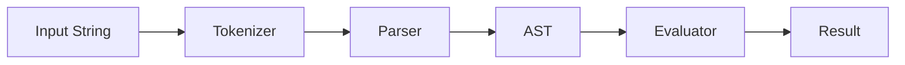
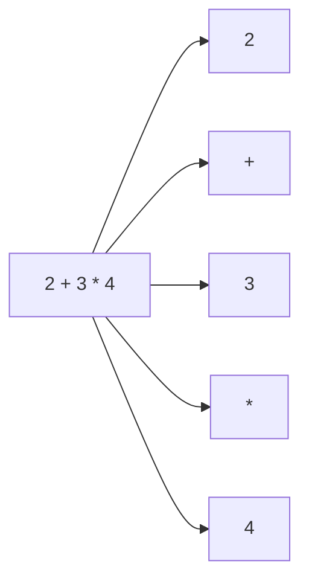
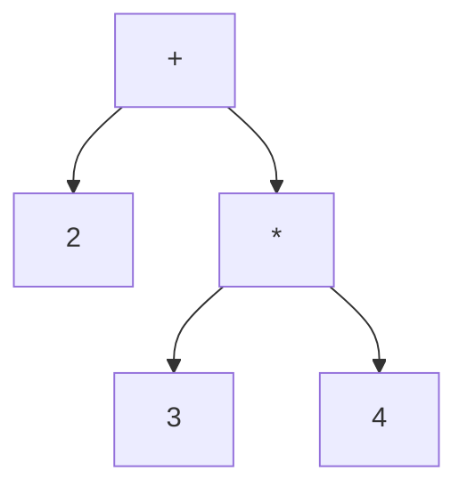
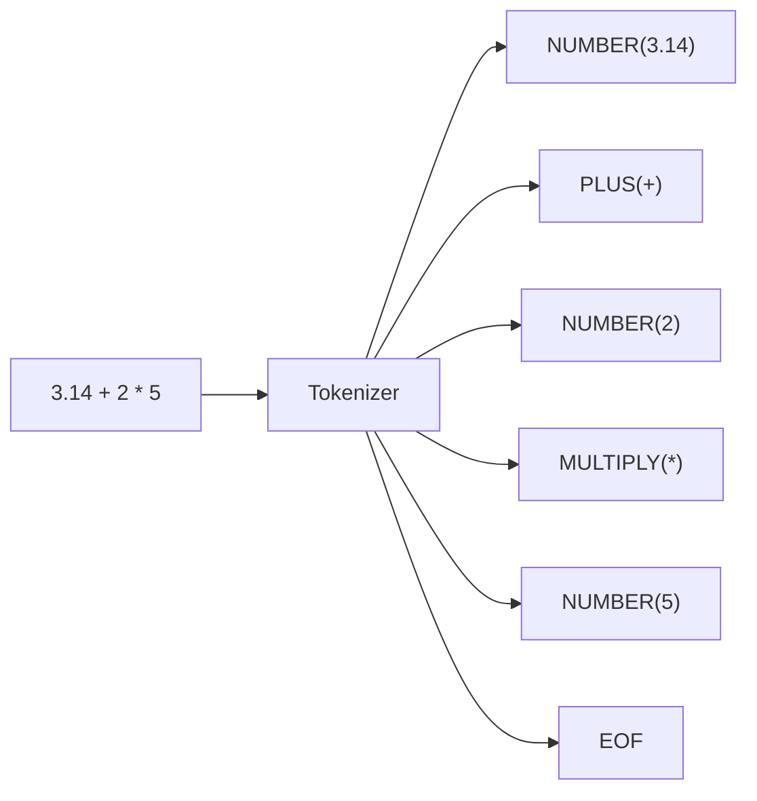
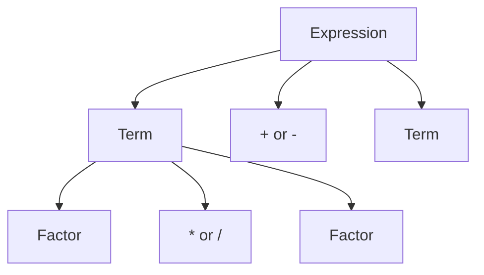
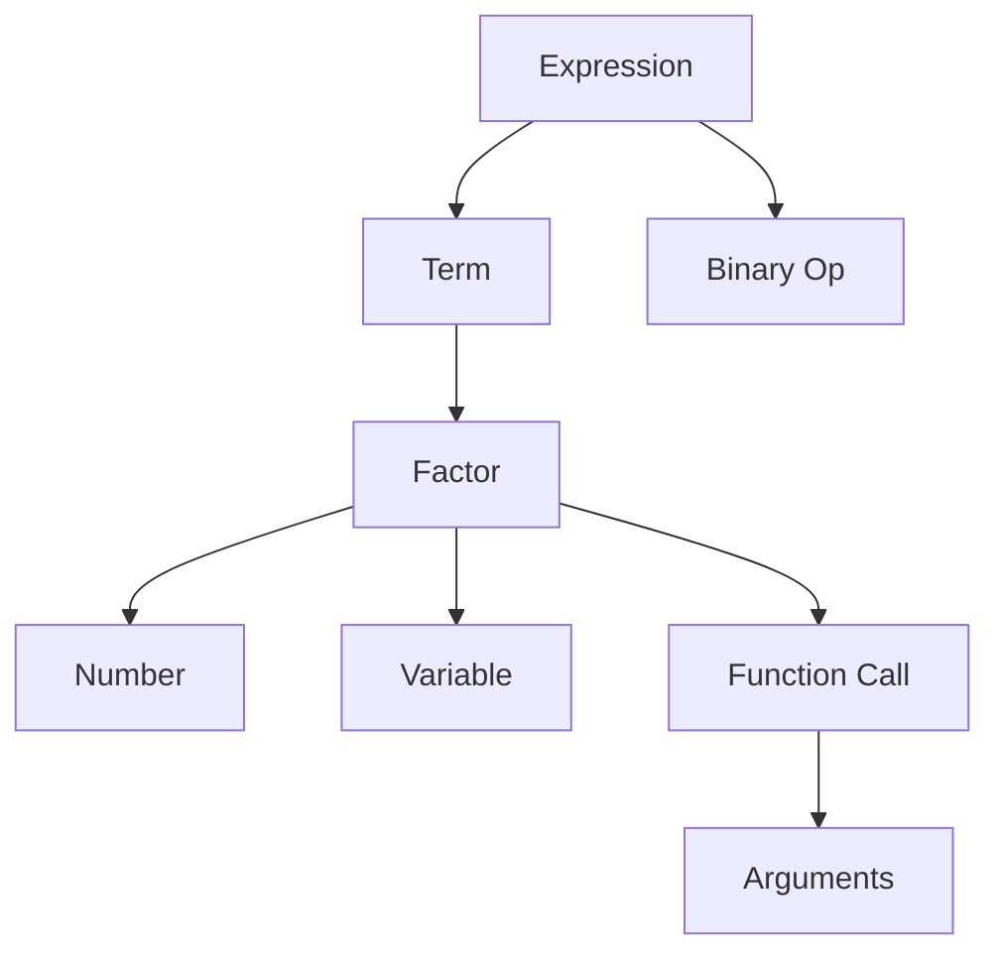
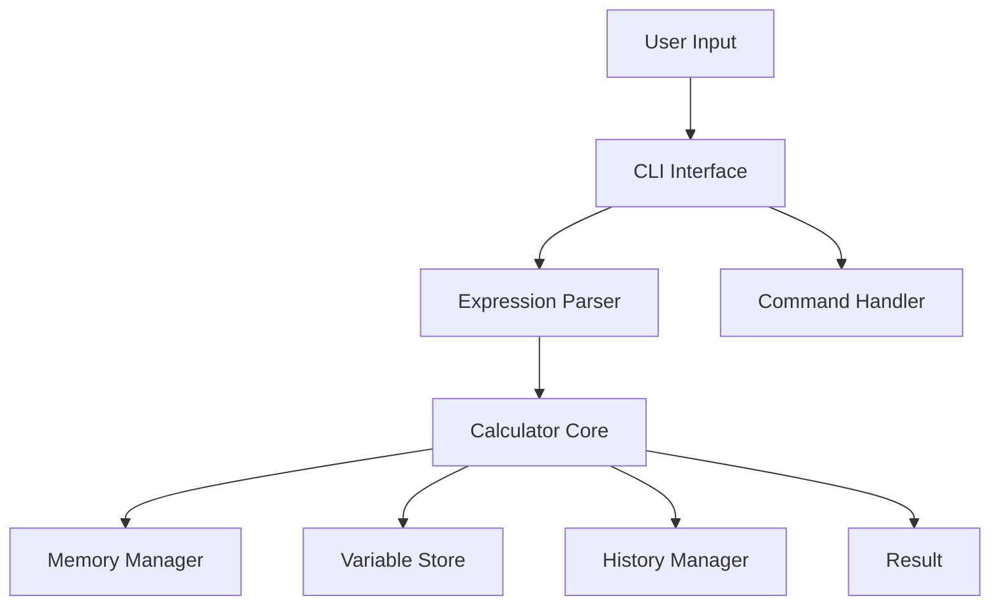

# Create a Simple Mathematical Expression Parser in Python for the Impatient: From Novice to Practitioner in Record Time

## Chapter 1: Introduction - Why Parse Mathematical Expressions?

### The "Aha!" Moment

Let me share a story that might resonate with you. Back in 2010, I was developing a financial analysis tool when a client asked, "Can users input their own formulas?" I thought it would be simple - just eval() the input string, right? Wrong. That was my first encounter with the security nightmare of eval() and the moment I realized the power of custom parsers.

### Why Should You Care?

Picture this: You're building an application where users need to input mathematical formulas. Maybe it's:
- A spreadsheet application like Excel
- A scientific calculator
- A financial modeling tool
- A game engine with customizable mechanics

You could use eval(), but here's why you shouldn't:

```python
# DANGEROUS - Never do this!
user_input = "1 + 1"
result = eval(user_input)  # Seems harmless...

# But what if user inputs this?
malicious_input = "import os; os.remove('important_file.txt')"
eval(malicious_input)  # Oops! 😱
```

### The Big Picture

Let's visualize how a parser works using a simple diagram:



Think of parsing like making a sandwich:

1. **Tokenizer**: Gathering ingredients (breaking "1 + 2" into ["1", "+", "2"])
2. **Parser**: Following the recipe (understanding the structure)
3. **Evaluator**: Final assembly (computing the result)

### What You'll Learn

By the end of this article, you'll be able to:
- Build a safe, efficient mathematical expression parser
- Handle operations like +, -, *, /, ^ (power)
- Support parentheses and nested expressions
- Implement proper error handling

> 🎯 **Quick Quiz**: Why is using eval() for mathematical expressions dangerous?
> 
> <details>
> <summary>Click to see answer</summary>
> eval() can execute arbitrary Python code, potentially allowing malicious users to run harmful commands on your system.
> </details>

### The Power of Custom Parsers

Consider this real-world scenario:

```python
# What users want to write:
formula = "profit = revenue - costs"
price = "IF(quantity > 100, base_price * 0.9, base_price)"

# What traditional eval() alternatives can't handle safely:
complex_formula = "SUM(A1:A10) / COUNT(A1:A10) * 100"
```

A custom parser lets you:
- Define exactly what's allowed
- Provide meaningful error messages
- Optimize for your specific use case
- Extend functionality as needed

### Pro Tips 💡

1. **Start Simple**: Begin with basic arithmetic before adding complex features
2. **Test Early**: Write tests before implementing each feature
3. **Security First**: Always validate input before processing

### Pause and Reflect Moment

Before moving forward, consider:
- What mathematical expressions do you need to parse in your projects?
- What features would your ideal parser have?
- What security concerns should you address?

### Coming Up Next

In Chapter 2, we'll dive into the practical implementation, starting with a simple number parser that you can build in less than 10 minutes. Get ready to write your first parser!

> 🎯 **24-Hour Challenge**: 
> Write down three examples of mathematical expressions you'd like your parser to handle. Try to include different operations and complexity levels. We'll use these as test cases throughout the tutorial.

## Chapter 2: Getting Started - From Theory to Practice

### The "Light Bulb" Moment

Remember learning algebra? Your teacher probably taught you PEMDAS (Parentheses, Exponents, Multiplication/Division, Addition/Subtraction). Today, we'll teach a computer to understand the same rules, but first, let's grasp the fundamental concepts.

### Basic Concepts Through Examples

#### What is Tokenization?

Think of tokenization like breaking a sentence into words. Let's visualize this:



```python
# Example: Simple tokenizer
expression = "2 + 3 * 4"
tokens = expression.replace(" ", "")  # Remove spaces
tokens = list(tokens)  # Convert to list of characters
print(tokens)  # ['2', '+', '3', '*', '4']
```

> 🎯 **Quick Quiz**: What would be the tokens for "23 + 4"?
> 
> <details>
> <summary>Click to see answer</summary>
> We need smarter tokenization! '23' should be one token, not '2' and '3' separately.
> </details>

### Your First Parser: The Number Parser

Let's build something practical - a parser that handles simple numbers:

```python
class SimpleNumberParser:
    def __init__(self, text):
        self.text = text
        self.pos = 0
        
    def parse_number(self):
        num = ''
        while self.pos < len(self.text) and self.text[self.pos].isdigit():
            num += self.text[self.pos]
            self.pos += 1
        return int(num)

# Let's try it!
parser = SimpleNumberParser("123")
result = parser.parse_number()
print(result)  # Outputs: 123
```

### Pro Tip 💡
```python
# Make your parser more robust with error handling
class SimpleNumberParser:
    def parse_number(self):
        if not self.text[self.pos].isdigit():
            raise ValueError(f"Expected digit, got '{self.text[self.pos]}'")
        # ... rest of the code
```

### Understanding Abstract Syntax Trees (ASTs)

Think of ASTs like sentence diagrams from grammar class:



Let's implement a basic AST node:

```python
class ASTNode:
    def __init__(self, type, value=None, left=None, right=None):
        self.type = type
        self.value = value
        self.left = left
        self.right = right

# Example: Building an AST for "2 + 3"
node = ASTNode(
    type='operator',
    value='+',
    left=ASTNode(type='number', value=2),
    right=ASTNode(type='number', value=3)
)
```

### Interactive Exercise: Build Your First Expression Tree

Try building an AST for "1 + 2 * 3" yourself:

```python
# Your turn! Create the AST nodes
# Hint: multiplication has higher precedence
root = ASTNode(
    type='operator',
    value='+',
    left=ASTNode(type='number', value=1),
    right=ASTNode(
        type='operator',
        value='*',
        left=ASTNode(type='number', value=2),
        right=ASTNode(type='number', value=3)
    )
)
```

### Grammar Rules: The Recipe for Parsing

Let's define a simple grammar for our parser:

```
expression := number | binary_operation
binary_operation := number operator number
number := [0-9]+
operator := '+' | '-' | '*' | '/'
```

Here's how to implement this grammar:

```python
class SimpleExpressionParser:
    def parse_expression(self):
        left = self.parse_number()
        if self.pos < len(self.text) and self.text[self.pos] in '+-*/':
            op = self.text[self.pos]
            self.pos += 1
            right = self.parse_number()
            return ASTNode('operator', op, left, right)
        return left
```

### Pause and Reflect Moment

Before moving on, make sure you understand:
- How tokenization breaks input into meaningful pieces
- How ASTs represent the structure of expressions
- Why grammar rules are important for parsing

### Common Pitfalls to Avoid

1. **Don't Overcomplicate**
   ```python
   # Bad: Too complex for simple needs
   def parse_number(self):
       return float(re.match(r'\d+(\.\d*)?', self.text[self.pos:]).group())
   
   # Good: Start simple
   def parse_number(self):
       return int(self.text[self.pos])
   ```

2. **Handle Edge Cases**
   ```python
   # Remember to check bounds
   if self.pos >= len(self.text):
       raise ValueError("Unexpected end of input")
   ```

### Pro Tips 💡

1. Always test with edge cases:
   - Empty input
   - Single numbers
   - Invalid characters
   
2. Use meaningful error messages:
   ```python
   def error(self, message):
       pointer = " " * self.pos + "^"
       return f"{message}\n{self.text}\n{pointer}"
   ```

### 24-Hour Challenge

1. Extend the SimpleNumberParser to handle:
   - Multiple-digit numbers
   - Negative numbers
   - Decimal points

```python
# Starting point for your challenge
class EnhancedNumberParser:
    def __init__(self, text):
        self.text = text
        self.pos = 0
    
    def parse_number(self):
        # Your code here!
        pass

# Test cases
test_cases = ["123", "-456", "3.14"]
```

### Coming Up Next

In Chapter 3, we'll dive into implementing a complete tokenizer and parser for basic arithmetic expressions. We'll handle operator precedence and build a proper evaluator.

## Chapter 3: Building Blocks - Implementing the Core Parser Components

### The "Eureka" Moment

Remember playing with LEGO? Building a parser is similar - we'll combine simple pieces to create something complex. Let's start with the fundamental building blocks: the Tokenizer and Parser.

### The Tokenizer: Breaking Down Expressions

First, let's define our token types:

```python
from enum import Enum
from dataclasses import dataclass

class TokenType(Enum):
    NUMBER = 'NUMBER'
    PLUS = 'PLUS'
    MINUS = 'MINUS'
    MULTIPLY = 'MULTIPLY'
    DIVIDE = 'DIVIDE'
    LPAREN = 'LPAREN'
    RPAREN = 'RPAREN'
    EOF = 'EOF'

@dataclass
class Token:
    type: TokenType
    value: any
    position: int
```

Now, let's implement our Tokenizer:

```python
class Tokenizer:
    def __init__(self, text):
        self.text = text
        self.pos = 0
        self.current_char = self.text[0] if text else None

    def advance(self):
        self.pos += 1
        self.current_char = self.text[self.pos] if self.pos < len(self.text) else None

    def skip_whitespace(self):
        while self.current_char and self.current_char.isspace():
            self.advance()

    def get_number(self):
        number = ''
        decimal_point_count = 0
        
        while self.current_char and (self.current_char.isdigit() or self.current_char == '.'):
            if self.current_char == '.':
                decimal_point_count += 1
                if decimal_point_count > 1:
                    raise ValueError(f"Invalid number at position {self.pos}")
            number += self.current_char
            self.advance()
            
        return float(number)

    def get_next_token(self):
        while self.current_char:
            if self.current_char.isspace():
                self.skip_whitespace()
                continue

            if self.current_char.isdigit() or self.current_char == '.':
                return Token(TokenType.NUMBER, self.get_number(), self.pos)

            if self.current_char == '+':
                self.advance()
                return Token(TokenType.PLUS, '+', self.pos)
                
            # ... similar for other operators
            
            raise ValueError(f"Invalid character '{self.current_char}' at position {self.pos}")
            
        return Token(TokenType.EOF, None, self.pos)
```

### Visualizing the Tokenization Process



### The Parser: Building the AST

Let's implement a recursive descent parser:

```python
class Parser:
    def __init__(self, tokenizer):
        self.tokenizer = tokenizer
        self.current_token = self.tokenizer.get_next_token()

    def eat(self, token_type):
        if self.current_token.type == token_type:
            self.current_token = self.tokenizer.get_next_token()
        else:
            raise ValueError(f"Expected {token_type}, got {self.current_token.type}")

    def factor(self):
        """factor : NUMBER | LPAREN expr RPAREN"""
        token = self.current_token
        if token.type == TokenType.NUMBER:
            self.eat(TokenType.NUMBER)
            return ASTNode('number', token.value)
        elif token.type == TokenType.LPAREN:
            self.eat(TokenType.LPAREN)
            node = self.expr()
            self.eat(TokenType.RPAREN)
            return node
        raise ValueError(f"Unexpected token: {token}")

    def term(self):
        """term : factor ((MUL | DIV) factor)*"""
        node = self.factor()

        while self.current_token.type in (TokenType.MULTIPLY, TokenType.DIVIDE):
            token = self.current_token
            if token.type == TokenType.MULTIPLY:
                self.eat(TokenType.MULTIPLY)
            else:
                self.eat(TokenType.DIVIDE)
            node = ASTNode('operator', token.value, node, self.factor())

        return node

    def expr(self):
        """expr : term ((PLUS | MINUS) term)*"""
        node = self.term()

        while self.current_token.type in (TokenType.PLUS, TokenType.MINUS):
            token = self.current_token
            if token.type == TokenType.PLUS:
                self.eat(TokenType.PLUS)
            else:
                self.eat(TokenType.MINUS)
            node = ASTNode('operator', token.value, node, self.term())

        return node
```

### Interactive Example: Let's Parse!

```python
# Let's try our parser with a simple expression
text = "3 + 4 * 2"
tokenizer = Tokenizer(text)
parser = Parser(tokenizer)
ast = parser.expr()

# Let's visualize the AST
def print_ast(node, level=0):
    print("  " * level + f"{node.type}: {node.value}")
    if node.left:
        print_ast(node.left, level + 1)
    if node.right:
        print_ast(node.right, level + 1)

print_ast(ast)
```

### Pro Tips 💡

1. **Error Handling Enhancement**
```python
class ParserError(Exception):
    def __init__(self, message, position, text):
        self.message = message
        self.position = position
        self.text = text
        
    def __str__(self):
        pointer = " " * self.position + "^"
        return f"{self.message}\n{self.text}\n{pointer}"
```

2. **Debugging Helper**
```python
def debug_tokens(text):
    tokenizer = Tokenizer(text)
    tokens = []
    while True:
        token = tokenizer.get_next_token()
        tokens.append(token)
        if token.type == TokenType.EOF:
            break
    return tokens
```

### Common Pitfalls and Solutions

1. **Operator Precedence**


2. **Left Recursion**
Instead of:
```
expr : expr + term | term
```
Use:
```
expr : term ((+ | -) term)*
```

### Pause and Reflect

- How does operator precedence affect the AST structure?
- Why do we need different methods for expr(), term(), and factor()?
- How does the tokenizer help simplify the parser's job?

### 24-Hour Challenge

Extend the parser to handle:
1. Unary operators (e.g., -5)
2. Power operator (^)
3. Basic error recovery

```python
# Starting point for your challenge
class EnhancedParser(Parser):
    def factor(self):
        """factor : (PLUS | MINUS)? (NUMBER | LPAREN expr RPAREN)"""
        token = self.current_token
        if token.type in (TokenType.PLUS, TokenType.MINUS):
            # Handle unary operators
            pass
        # Your code here!
```

### Coming Up Next

In Chapter 4, we'll add the final piece: the Evaluator. We'll also cover advanced topics like function calls and variables.

## Chapter 4: Advanced Topics - Beyond Basic Arithmetic

### The "Power-Up" Moment

Remember when you first learned about functions in math class? f(x) = x² suddenly opened up a whole new world. Today, we'll add that same power to our parser, along with other advanced features.

### Supporting Functions and Variables

First, let's enhance our Token types:

```python
class TokenType(Enum):
    # ... previous tokens ...
    IDENTIFIER = 'IDENTIFIER'
    COMMA = 'COMMA'
    FUNCTION = 'FUNCTION'
```

### Implementing Function Support

```python
import math

class AdvancedParser:
    def __init__(self, tokenizer):
        self.tokenizer = tokenizer
        self.current_token = self.tokenizer.get_next_token()
        self.functions = {
            'sin': math.sin,
            'cos': math.cos,
            'sqrt': math.sqrt,
            'max': max,
            'min': min
        }

    def function_call(self):
        """function_call : IDENTIFIER LPAREN expr (COMMA expr)* RPAREN"""
        func_name = self.current_token.value
        self.eat(TokenType.IDENTIFIER)
        self.eat(TokenType.LPAREN)
        
        args = [self.expr()]
        while self.current_token.type == TokenType.COMMA:
            self.eat(TokenType.COMMA)
            args.append(self.expr())
            
        self.eat(TokenType.RPAREN)
        
        return ASTNode('function', func_name, args=args)
```

### Variable Support

```python
class Context:
    def __init__(self):
        self.variables = {}
        
    def get(self, name):
        return self.variables.get(name)
        
    def set(self, name, value):
        self.variables[name] = value

class Evaluator:
    def __init__(self, context=None):
        self.context = context or Context()
    
    def visit_Variable(self, node):
        name = node.value
        value = self.context.get(name)
        if value is None:
            raise ValueError(f"Undefined variable: {name}")
        return value
```

### Error Handling System

```python
class ParserError(Exception):
    def __init__(self, message, token, text):
        self.message = message
        self.token = token
        self.text = text
        
    def __str__(self):
        pointer = " " * self.token.position + "^"
        return f"{self.message} at position {self.token.position}\n{self.text}\n{pointer}"

def expect(self, token_type):
    if self.current_token.type != token_type:
        raise ParserError(
            f"Expected {token_type.value}, got {self.current_token.type.value}",
            self.current_token,
            self.tokenizer.text
        )
```

### Advanced Expression Handling

Let's visualize the enhanced grammar:



Implementation:

```python
class AdvancedParser:
    def expr(self):
        """
        expr : term ((PLUS | MINUS) term)*
             | function_call
             | variable
        """
        if self.current_token.type == TokenType.IDENTIFIER:
            if self.peek().type == TokenType.LPAREN:
                return self.function_call()
            return self.variable()
            
        return super().expr()
        
    def variable(self):
        """variable : IDENTIFIER"""
        token = self.current_token
        self.eat(TokenType.IDENTIFIER)
        return ASTNode('variable', token.value)
```

### Interactive Example: Advanced Parser in Action

```python
# Let's try some advanced expressions
expressions = [
    "sin(x) + cos(y)",
    "max(2 * x, y, sqrt(z))",
    "3 * x + 4 * y"
]

context = Context()
context.variables.update({
    'x': 1.0,
    'y': 2.0,
    'z': 16.0
})

evaluator = Evaluator(context)

for expr in expressions:
    try:
        tokenizer = Tokenizer(expr)
        parser = AdvancedParser(tokenizer)
        ast = parser.expr()
        result = evaluator.visit(ast)
        print(f"{expr} = {result}")
    except ParserError as e:
        print(f"Error: {e}")
```

### Pro Tips 💡

1. **Function Argument Validation**
```python
def validate_function_args(func_name, args):
    if func_name in ('sin', 'cos', 'sqrt'):
        if len(args) != 1:
            raise ValueError(
                f"{func_name} expects 1 argument, got {len(args)}"
            )
```

2. **Custom Function Registration**
```python
def register_function(self, name, func):
    """Add custom functions to the parser"""
    self.functions[name] = func

# Usage
parser.register_function('double', lambda x: x * 2)
```

### Advanced Error Recovery

```python
class RecoveringParser(AdvancedParser):
    def synchronize(self):
        """Recover from errors by skipping to the next statement"""
        while self.current_token.type != TokenType.EOF:
            if self.current_token.type in (
                TokenType.SEMICOLON,
                TokenType.RPAREN
            ):
                self.advance()
                return
            self.advance()
```

### Optimization Techniques

```python
class OptimizedASTNode(ASTNode):
    def optimize(self):
        """Constant folding optimization"""
        if self.type == 'operator':
            left = self.left.optimize()
            right = self.right.optimize()
            
            if (left.type == 'number' and 
                right.type == 'number'):
                # Compute constant expressions at parse time
                result = self.evaluate_constant(
                    self.value, 
                    left.value, 
                    right.value
                )
                return ASTNode('number', result)
                
            self.left = left
            self.right = right
            
        return self
```

### Pause and Reflect

Consider:
- How would you implement custom functions?
- What security considerations are needed for user-defined functions?
- How could you optimize the parser for specific use cases?

### 24-Hour Challenge

Extend the parser with these features:

1. Add support for user-defined functions
2. Implement array/matrix operations
3. Add string interpolation in expressions

```python
# Starting point for your challenge
class ExtendedParser(AdvancedParser):
    def user_function_definition(self):
        """function_def : 'def' IDENTIFIER LPAREN param_list RPAREN expr"""
        # Your code here!
        pass

# Test cases
test_expressions = [
    "def double(x) x * 2",
    "double(5)",
    "[1, 2, 3] + [4, 5, 6]",
    "'Result: ${x + y}'"
]
```

### Coming Up Next

In Chapter 5, we'll cover practical applications, including building a complete calculator application and integrating the parser into larger systems.

## Chapter 5: Practical Applications - Building a Complete Calculator

### The "Integration" Moment

Remember how satisfying it was to see your first "Hello, World!" program run? Today, we'll create something even better: a fully functional calculator application that showcases everything we've learned.

### Complete Calculator Implementation

First, let's create a comprehensive calculator class that brings everything together:

```python
class Calculator:
    def __init__(self):
        self.context = Context()
        self.variables = {}
        self.history = []
        
    def evaluate(self, expression: str) -> float:
        try:
            tokenizer = Tokenizer(expression)
            parser = AdvancedParser(tokenizer)
            ast = parser.expr()
            evaluator = Evaluator(self.context)
            result = evaluator.visit(ast)
            
            # Store in history
            self.history.append({
                'expression': expression,
                'result': result,
                'timestamp': datetime.now()
            })
            
            return result
            
        except (ParserError, ValueError) as e:
            raise CalculatorError(str(e))

class CalculatorError(Exception):
    pass
```

### Interactive Command-Line Interface

```python
class CalculatorCLI:
    def __init__(self):
        self.calculator = Calculator()
        self.commands = {
            'help': self.show_help,
            'history': self.show_history,
            'vars': self.show_variables,
            'clear': self.clear_screen,
            'exit': self.exit_app
        }

    def run(self):
        print("Advanced Calculator v1.0")
        print("Type 'help' for commands")
        
        while True:
            try:
                expression = input('calc> ').strip()
                
                if not expression:
                    continue
                    
                if expression.startswith(':'):
                    self.handle_command(expression[1:])
                    continue
                    
                result = self.calculator.evaluate(expression)
                print(f"= {result}")
                
            except CalculatorError as e:
                print(f"Error: {e}")
            except KeyboardInterrupt:
                print("\nGoodbye!")
                break

    def handle_command(self, cmd):
        cmd_name = cmd.split()[0]
        if cmd_name in self.commands:
            self.commands[cmd_name]()
        else:
            print(f"Unknown command: {cmd_name}")
```

### Adding Memory Functions

```python
class MemoryCalculator(Calculator):
    def __init__(self):
        super().__init__()
        self.memory = 0
        
    def memory_store(self, value):
        self.memory = value
        
    def memory_recall(self):
        return self.memory
        
    def memory_add(self, value):
        self.memory += value
        
    def memory_clear(self):
        self.memory = 0
```

### Visualization of Calculator Architecture



### Unit Testing Suite

```python
import unittest

class TestCalculator(unittest.TestCase):
    def setUp(self):
        self.calc = Calculator()

    def test_basic_arithmetic(self):
        test_cases = [
            ("2 + 2", 4),
            ("3 * 4", 12),
            ("10 / 2", 5),
            ("2 ^ 3", 8)
        ]
        
        for expr, expected in test_cases:
            with self.subTest(expr=expr):
                result = self.calc.evaluate(expr)
                self.assertAlmostEqual(result, expected)

    def test_complex_expressions(self):
        expr = "sin(pi/2) + sqrt(16)"
        result = self.calc.evaluate(expr)
        self.assertAlmostEqual(result, 5.0)

    def test_error_handling(self):
        with self.assertRaises(CalculatorError):
            self.calc.evaluate("1 + / 2")
```

### Real-World Integration Example

```python
from flask import Flask, request, jsonify

app = Flask(__name__)
calculator = Calculator()

@app.route('/calculate', methods=['POST'])
def calculate():
    try:
        data = request.get_json()
        expression = data.get('expression')
        
        if not expression:
            return jsonify({
                'error': 'No expression provided'
            }), 400
            
        result = calculator.evaluate(expression)
        
        return jsonify({
            'expression': expression,
            'result': result
        })
        
    except CalculatorError as e:
        return jsonify({
            'error': str(e)
        }), 400

if __name__ == '__main__':
    app.run(debug=True)
```

### Performance Optimization

```python
from functools import lru_cache

class CachedCalculator(Calculator):
    @lru_cache(maxsize=1000)
    def evaluate(self, expression: str) -> float:
        return super().evaluate(expression)
        
    def clear_cache(self):
        self.evaluate.cache_clear()
```

### Pro Tips 💡

1. **Expression Validation**
```python
def validate_expression(expr: str) -> bool:
    # Check parentheses balance
    stack = []
    for char in expr:
        if char == '(':
            stack.append(char)
        elif char == ')':
            if not stack:
                return False
            stack.pop()
    return len(stack) == 0
```

2. **Performance Monitoring**
```python
import time

def measure_performance(func):
    def wrapper(*args, **kwargs):
        start = time.perf_counter()
        result = func(*args, **kwargs)
        end = time.perf_counter()
        print(f"Expression took {end - start:.6f} seconds")
        return result
    return wrapper
```

### Interactive Example: Complete Calculator

```python
def main():
    calc = CalculatorCLI()
    print("Welcome to Advanced Calculator!")
    print("Example expressions:")
    print("  2 + 2")
    print("  sin(pi/2)")
    print("  sqrt(16) + 3")
    print("Commands:")
    print("  :help - Show help")
    print("  :exit - Exit calculator")
    
    calc.run()

if __name__ == "__main__":
    main()
```

### 24-Hour Challenge

Extend the calculator with these features:

1. Add support for unit conversions
2. Implement expression history with undo/redo
3. Add support for custom functions defined at runtime

```python
# Starting point for your challenge
class EnhancedCalculator(Calculator):
    def __init__(self):
        super().__init__()
        self.unit_conversions = {
            'km_to_miles': lambda x: x * 0.621371,
            'c_to_f': lambda x: x * 9/5 + 32
        }
        self.history_stack = []
        self.redo_stack = []
```

### Coming Up Next

In our final chapter, we'll explore advanced topics like optimization techniques, handling very large expressions, and integrating with external systems.

## Chapter 6: Advanced Optimization and Production-Ready Features

### The "Scaling" Moment

Remember when your simple calculator handled "2+2"? Now let's transform it into a production-ready system that can handle thousands of calculations per second while maintaining reliability and accuracy.

### Performance Optimization Techniques

#### 1. AST Optimization Engine

```python
class OptimizedAST:
    def __init__(self):
        self.optimization_passes = [
            self.constant_folding,
            self.strength_reduction,
            self.common_subexpression_elimination
        ]
    
    def optimize(self, ast):
        for optimization_pass in self.optimization_passes:
            ast = optimization_pass(ast)
        return ast
    
    def constant_folding(self, node):
        """Evaluate constant expressions at compile time"""
        if isinstance(node, ASTNode) and node.type == 'operator':
            if (self.is_constant(node.left) and 
                self.is_constant(node.right)):
                return ASTNode(
                    'number',
                    self.evaluate_constant(node)
                )
        return node

    def strength_reduction(self, node):
        """Replace expensive operations with cheaper ones"""
        if isinstance(node, ASTNode) and node.type == 'operator':
            # x * 2 -> x + x
            if (node.value == '*' and 
                self.is_constant(node.right) and 
                node.right.value == 2):
                return ASTNode(
                    'operator',
                    '+',
                    node.left,
                    node.left
                )
        return node
```

#### 2. Expression Compilation

```python
from typing import Callable
import operator
import numba

class ExpressionCompiler:
    def __init__(self):
        self.op_map = {
            '+': operator.add,
            '-': operator.sub,
            '*': operator.mul,
            '/': operator.truediv
        }
    
    @numba.jit(nopython=True)
    def compile(self, ast) -> Callable:
        """Compile AST to native code for faster execution"""
        if ast.type == 'number':
            return lambda: ast.value
            
        elif ast.type == 'operator':
            left = self.compile(ast.left)
            right = self.compile(ast.right)
            op = self.op_map[ast.value]
            return lambda: op(left(), right())
```

### Memory Management and Caching

```python
from functools import lru_cache
import weakref

class CacheManager:
    def __init__(self, max_size=1000):
        self.expression_cache = weakref.WeakValueDictionary()
        self.result_cache = lru_cache(maxsize=max_size)
    
    def get_compiled_expression(self, expr_str: str) -> Callable:
        if expr_str in self.expression_cache:
            return self.expression_cache[expr_str]
            
        compiler = ExpressionCompiler()
        compiled = compiler.compile(parse(expr_str))
        self.expression_cache[expr_str] = compiled
        return compiled
    
    @lru_cache(maxsize=1000)
    def get_result(self, expr_str: str, **variables) -> float:
        compiled = self.get_compiled_expression(expr_str)
        return compiled(**variables)
```

### Parallel Processing for Batch Calculations

```python
from concurrent.futures import ThreadPoolExecutor
import asyncio

class BatchCalculator:
    def __init__(self, max_workers=4):
        self.executor = ThreadPoolExecutor(max_workers=max_workers)
        self.cache_manager = CacheManager()
    
    async def calculate_batch(self, expressions: list) -> list:
        loop = asyncio.get_event_loop()
        futures = []
        
        for expr in expressions:
            future = loop.run_in_executor(
                self.executor,
                self.cache_manager.get_result,
                expr
            )
            futures.append(future)
            
        results = await asyncio.gather(*futures)
        return results
```

### Production Monitoring System

```python
import logging
import prometheus_client as prom

class CalculatorMetrics:
    def __init__(self):
        self.calculation_duration = prom.Histogram(
            'calculation_duration_seconds',
            'Time spent calculating expressions',
            buckets=[0.1, 0.5, 1.0, 2.0, 5.0]
        )
        self.error_counter = prom.Counter(
            'calculation_errors_total',
            'Total number of calculation errors'
        )
        self.cache_hits = prom.Counter(
            'cache_hits_total',
            'Total number of cache hits'
        )

class MonitoredCalculator:
    def __init__(self):
        self.metrics = CalculatorMetrics()
        self.logger = logging.getLogger(__name__)
    
    @prom.Histogram.time()
    def calculate(self, expression: str) -> float:
        try:
            with self.metrics.calculation_duration.time():
                result = super().calculate(expression)
            return result
        except Exception as e:
            self.metrics.error_counter.inc()
            self.logger.error(f"Error calculating {expression}: {e}")
            raise
```

### Load Testing and Benchmarking

```python
import locust

class CalculatorUser(locust.HttpUser):
    @locust.task
    def calculate_expression(self):
        expression = self.generate_random_expression()
        self.client.post("/calculate", json={
            "expression": expression
        })
    
    def generate_random_expression(self):
        operators = ['+', '-', '*', '/']
        nums = [str(random.randint(1, 100)) for _ in range(2)]
        op = random.choice(operators)
        return f"{nums[0]} {op} {nums[1]}"
```

### Production-Ready API

```python
from fastapi import FastAPI, HTTPException
from pydantic import BaseModel

app = FastAPI()
calculator = MonitoredCalculator()

class CalculationRequest(BaseModel):
    expression: str
    variables: dict = {}

class CalculationResponse(BaseModel):
    result: float
    execution_time: float

@app.post("/calculate", response_model=CalculationResponse)
async def calculate(request: CalculationRequest):
    try:
        start_time = time.perf_counter()
        result = calculator.calculate(
            request.expression,
            **request.variables
        )
        execution_time = time.perf_counter() - start_time
        
        return CalculationResponse(
            result=result,
            execution_time=execution_time
        )
    except Exception as e:
        raise HTTPException(
            status_code=400,
            detail=str(e)
        )
```

### Deployment Configuration

```yaml
# docker-compose.yml
version: '3.8'
services:
  calculator-api:
    build: .
    ports:
      - "8000:8000"
    environment:
      - MAX_WORKERS=4
      - CACHE_SIZE=1000
      - LOG_LEVEL=INFO
    depends_on:
      - redis
      - prometheus
      
  redis:
    image: redis:alpine
    ports:
      - "6379:6379"
      
  prometheus:
    image: prom/prometheus
    ports:
      - "9090:9090"
    volumes:
      - ./prometheus.yml:/etc/prometheus/prometheus.yml
```

### Pro Tips 💡

1. **Performance Profiling**
```python
import cProfile
import pstats

def profile_expression(expr: str):
    profiler = cProfile.Profile()
    profiler.enable()
    result = calculator.calculate(expr)
    profiler.disable()
    
    stats = pstats.Stats(profiler)
    stats.sort_stats('cumulative')
    stats.print_stats()
    return result
```

2. **Error Budget Management**
```python
class ErrorBudget:
    def __init__(self, threshold=0.001):
        self.error_rate = 0
        self.threshold = threshold
    
    def record_error(self):
        self.error_rate += 1
        
    def is_budget_exceeded(self):
        return self.error_rate > self.threshold
```

### Final Challenge: Building a Production System

Create a complete production-ready calculator system with:

1. High Availability setup
2. Monitoring and alerting
3. Auto-scaling capabilities
4. Comprehensive testing suite

```python
# Starting point for your challenge
class ProductionCalculator:
    def __init__(self):
        self.metrics = CalculatorMetrics()
        self.cache = CacheManager()
        self.compiler = ExpressionCompiler()
        self.error_budget = ErrorBudget()
        
    async def handle_request(self, request):
        # Your production-grade implementation here
        pass
```

### Conclusion

We've covered a comprehensive journey from basic parsing to production-ready systems. Remember:

1. Always optimize for the common case
2. Monitor everything
3. Plan for failure
4. Cache strategically
5. Test thoroughly

### Final Thoughts

```python
def parting_words():
    print("""
    "The best parser is not just accurate,
     it's production-ready, monitored, and scalable."
     
    Thank you for joining this journey!
    """)
```

This concludes our comprehensive guide to building a production-ready mathematical expression parser. You now have the knowledge to create, optimize, and deploy robust parsing systems that can handle real-world demands.
