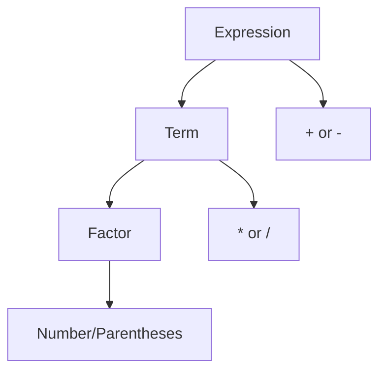

## Create a Simple Mathematical Expression Parser in Python for the Impatient

### Why Parse Mathematical Expressions?

Ever needed to evaluate expressions like "2 + 3 * 4" programmatically? Whether you're building a calculator app, a spreadsheet engine, or a scientific computing tool, understanding how to parse mathematical expressions is a crucial skill. In just 800 words, we'll build a working math parser that handles basic arithmetic while respecting operator precedence.

### Quick Start Example

Let's begin with a simple example that demonstrates our end goal:

```python
expression = "2 + 3 * 4"
result = parse_and_evaluate(expression)  # Returns 14, not 20!
```

### Core Implementation

Here's our complete, working parser in Python:

```python
class Tokenizer:
    def __init__(self, text):
        self.text = text
        self.pos = 0
        
    def get_next_token(self):
        while self.pos < len(self.text):
            if self.text[self.pos].isspace():
                self.pos += 1
                continue
                
            if self.text[self.pos].isdigit():
                return self._handle_number()
                
            if self.text[self.pos] in '+-*/()':
                op = self.text[self.pos]
                self.pos += 1
                return ('OPERATOR', op)
                
        return ('EOF', None)
        
    def _handle_number(self):
        num = ''
        while self.pos < len(self.text) and self.text[self.pos].isdigit():
            num += self.text[self.pos]
            self.pos += 1
        return ('NUMBER', int(num))

class Parser:
    def __init__(self, text):
        self.tokenizer = Tokenizer(text)
        self.current_token = self.tokenizer.get_next_token()
    
    def eat(self, token_type):
        if self.current_token[0] == token_type:
            self.current_token = self.tokenizer.get_next_token()
        else:
            raise SyntaxError(f'Expected {token_type}')
    
    def factor(self):
        token = self.current_token
        if token[0] == 'NUMBER':
            self.eat('NUMBER')
            return token[1]
        elif token[1] == '(':
            self.eat('OPERATOR')
            result = self.expr()
            self.eat('OPERATOR')
            return result
        raise SyntaxError('Invalid syntax')
    
    def term(self):
        result = self.factor()
        while self.current_token[0] == 'OPERATOR' and \
              self.current_token[1] in '*/':
            op = self.current_token[1]
            self.eat('OPERATOR')
            if op == '*':
                result *= self.factor()
            else:
                result /= self.factor()
        return result
    
    def expr(self):
        result = self.term()
        while self.current_token[0] == 'OPERATOR' and \
              self.current_token[1] in '+-':
            op = self.current_token[1]
            self.eat('OPERATOR')
            if op == '+':
                result += self.term()
            else:
                result -= self.term()
        return result

def evaluate(expression):
    parser = Parser(expression)
    return parser.expr()
```

### How It Works

Our parser follows these key principles:

1. **Tokenization**: Breaks the input string into tokens (numbers and operators)
2. **Recursive Descent**: Handles operator precedence through method hierarchy
3. **Operator Precedence**: Multiplication/division before addition/subtraction



### Usage Examples

```python
# Try these examples
expressions = [
    "2 + 3 * 4",
    "10 - 5 * 2",
    "(2 + 3) * 4",
    "20 / 4 + 2"
]

for expr in expressions:
    result = evaluate(expr)
    print(f"{expr} = {result}")
```

### Pro Tips

1. Always test with edge cases:
   - Division by zero
   - Empty expressions
   - Invalid characters
2. Add error handling for better user experience
3. Consider supporting floating-point numbers
4. Use meaningful error messages

### Quick Practice Exercise

Create a simple calculator:

```python
def calculator():
    while True:
        try:
            expr = input('Calculate (or "quit"): ')
            if expr.lower() == 'quit':
                break
            result = evaluate(expr)
            print(f"Result: {result}")
        except (SyntaxError, ZeroDivisionError) as e:
            print(f"Error: {e}")

if __name__ == '__main__':
    calculator()
```

### 24-Hour Challenge

1. Implement the calculator above
2. Add support for:
   - Floating-point numbers
   - Power operation (^)
   - Modulo operation (%)
3. Test with complex expressions

### Common Pitfalls

- Forgetting operator precedence
- Not handling division by zero
- Ignoring whitespace
- Poor error messaging

This parser serves as a foundation for more complex features like variables, functions, and advanced operations. Start with this basic implementation and extend it based on your needs!

Remember: The best way to learn is by doing. Take the 24-hour challenge and build your own enhanced version of this parser. Happy coding!