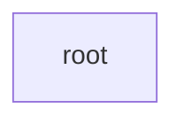
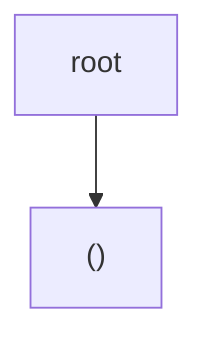
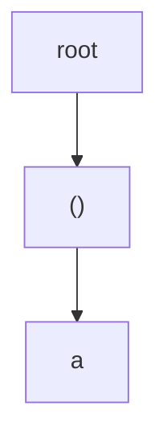
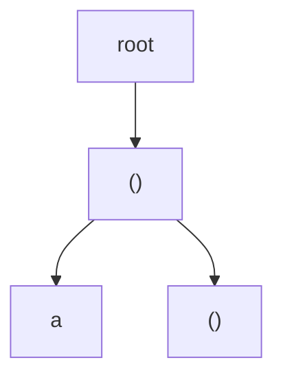
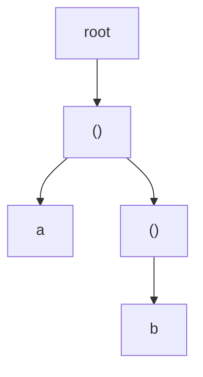
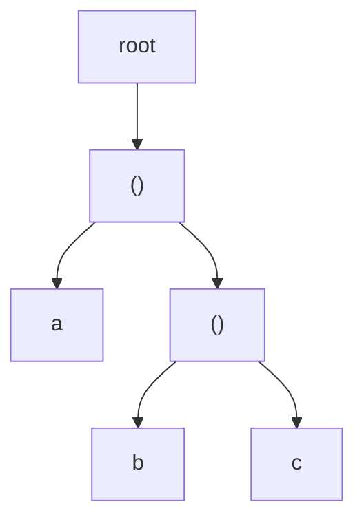
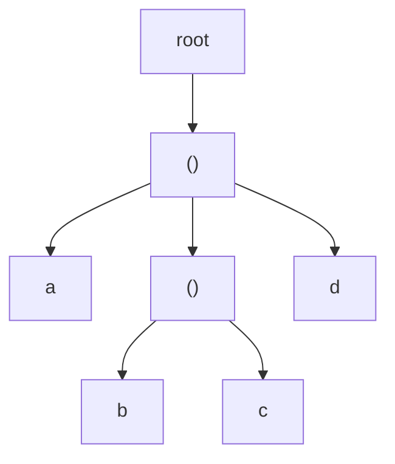

I'll represent the step-by-step tree construction using Mermaid diagrams for the tokens `["(", "a", "(", "b", "c", ")", "d", ")"]`.

1. Initial state (create root):

2. After processing "(" (first parenthesis):

3. After processing "a":

4. After processing second "(":

5. After processing "b":

6. After processing "c":

7. After processing ")" (moves current pointer back to P1):

8. After processing "d":

9. Final state after processing last ")":

Key points to note:
- The `current` pointer moves down when processing "("
- The `current` pointer moves up when processing ")"
- Regular tokens (a, b, c, d) are added as children to the current node
- Parent references are maintained but not shown in the diagrams
- The final tree structure represents the nested expression `(a(bc)d)`

This visualization helps understand how the parser builds the tree structure by tracking the current position and managing parent-child relationships.