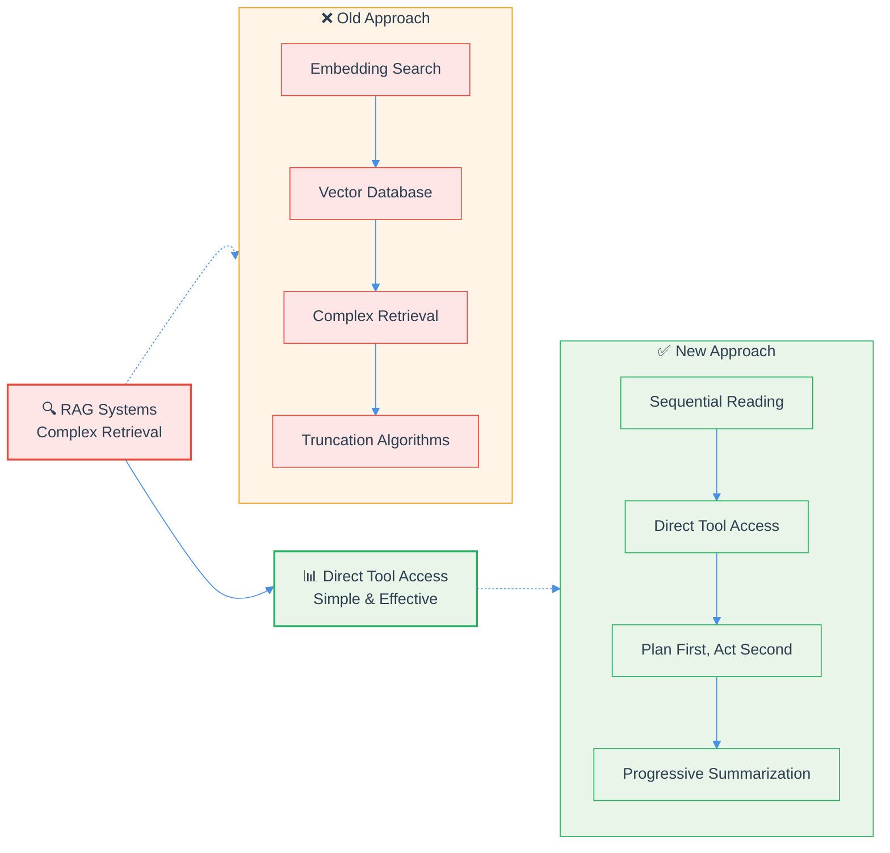

How to 10x your coding agent performance (without RAG) 📈

While everyone's building complex RAG systems, the smartest teams are doing the opposite.

Here's the counterintuitive framework that's actually working in production:

🎯 THE 4-STEP SHIFT:

1. Replace embedding search → Sequential file reading
• Let agents read files in full using grep and search tools
• Allow "narrative integrity" - agents explore codebases organically
• Stop fragmenting context with embedding chunks

2. Replace complex retrieval → "Plan first, then act"
• Separate planning phase from execution
• Gather full context before making decisions
• Eliminate the distraction of mid-task retrieval

3. Replace vector databases → Direct tool access
• Give agents terminal commands, file readers, code definitions
• Skip the preprocessing layer entirely
• Let models work with raw information

4. Replace truncation algorithms → Progressive summarization
• For long tasks, create detailed progress summaries
• Much more effective than complex truncation
• Maintains context without the overhead

💡 THE EVIDENCE:
Stanford's 2025 AI Index shows AI agents excel in short-horizon tasks (2-hour budgets) but humans outperform them 2:1 in longer, complex workflows.

Recent research reveals that despite larger context windows, "complex reasoning remains a problem" for current LLMs - suggesting direct approaches work better for specific use cases.

⚡ THE BITTER LESSON:
The application layer is shrinking. Instead of building complexity around models, remove barriers and let their intelligence shine through.

🚀 BOTTOM LINE:
RAG made sense in 2022. But using 2025+ technology to solve 2022 problems is like using a smartphone as a paperweight.

The future belongs to agents that think logically through codebases, not those lost in "schizophrenic mind maps of 4-dimensional clustered embeddings."

Are you still building RAG systems for your coding agents? What's been your experience with direct approaches? 👇

Save this post if you're working on AI agents - your future self will thank you 🔖