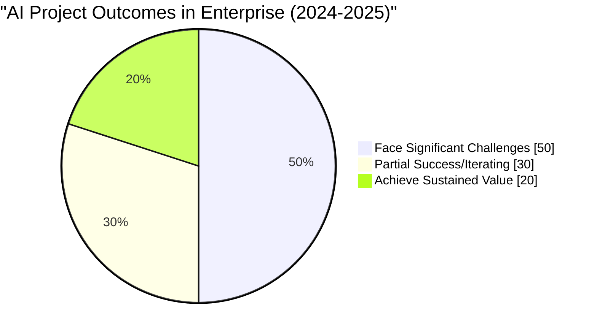
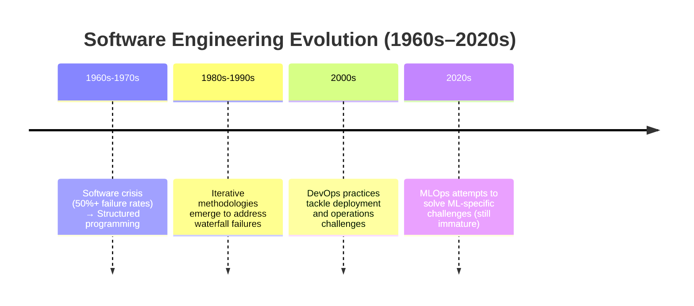
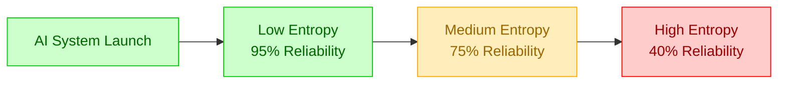
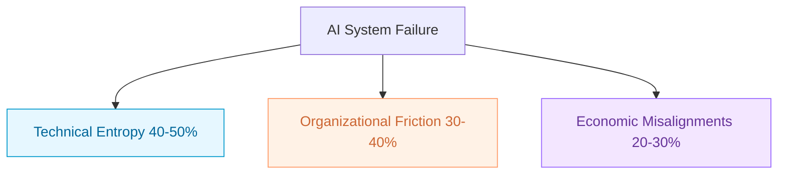
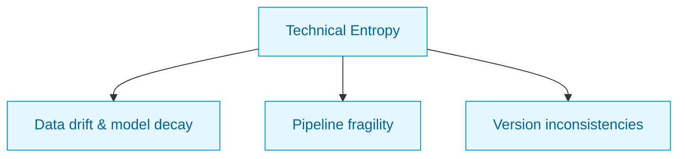
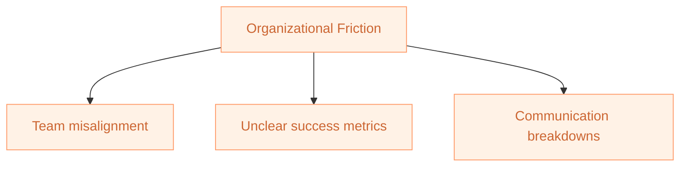
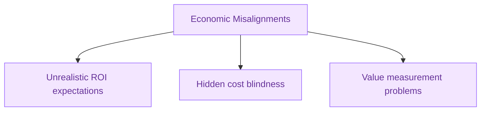
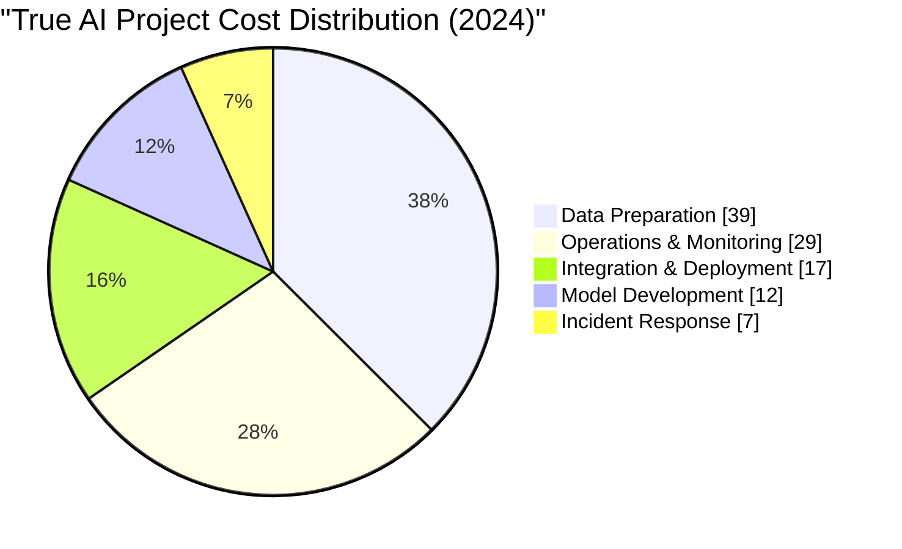
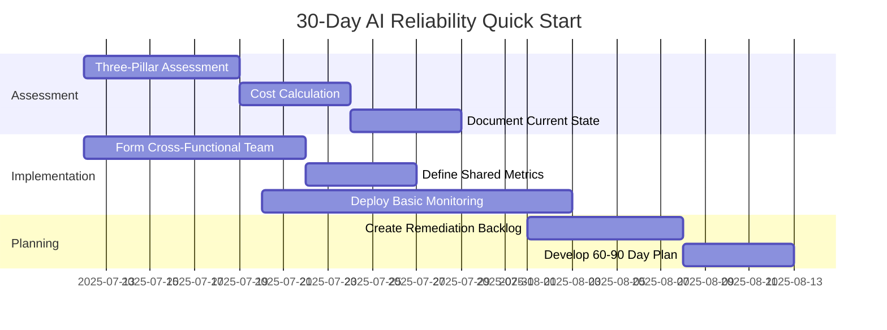

# LinkedIn Post - Why Most AI Projects Struggle

**Date:** July 11, 2025  
**Type:** Technical Deep Dive  
**Target:** AI practitioners, CTOs, ML leaders, product managers  
**Hook:** First Principle Thinking & Systems That Actually Work  
**Published:** [LinkedIn Post](https://www.linkedin.com/feed/update/urn:li:activity:7349278678779871232/)

---

## Why Most AI Projects Struggle

_And How to Build Systems That Actually Work using First Principle Thinking_

## The Wake-Up Call

Meet Sarah, ML Director at TechCorp. She's facing a critical $2M budget decision for a recommendation system. Her previous ML project? It exceeded budget by 180% and was quietly discontinued after eight months. The board demands answers, and her leadership role depends on delivering results.

Sarah's experience reflects an industry-wide challenge that's becoming impossible to ignore.

**The current reality:**

- Up to 80% of AI projects face significant challenges, with 30% of generative AI projects expected to be abandoned after proof-of-concept by end of 2025[16][17]
- Traditional IT projects fail at 40% rates—AI doubles this risk due to additional complexity³
- Budget overruns average 200% of original estimates, varying by industry[34]
- Only 1% of executives describe their AI rollouts as "mature," though adoption is accelerating[10]

Yet there's strong reason for optimism: Organizations with systematic approaches report 15.8% revenue increases, 15.2% cost reductions, and 22.6% productivity improvements on average.⁶ Failure rates are declining as MLOps practices mature.[12]

This isn't fundamentally a technology problem—it's a **systems thinking problem**.



_Figure 1.1: Current state of AI project outcomes - a more nuanced view based on RAND Corporation, Gartner, and McKinsey 2024-2025 research_

## The Industry Landscape: Progress Amid Persistent Challenges

While AI capabilities have advanced dramatically, our ability to successfully deploy AI systems remains inconsistent. The gap between algorithmic sophistication and reliable system delivery persists across industries.

### The Maturity Gap in 2024

Current adoption shows both promise and persistent challenges:

| Industry           | AI Technical Capability | Deployment Success Rate | Notes                                   |
| :----------------- | :---------------------- | :---------------------- | :-------------------------------------- |
| Financial Services | Advanced                | 35%                     | Higher compliance requirements          |
| Healthcare         | Advanced                | 25%                     | Regulatory complexity, data sensitivity |
| Retail             | Advanced                | 45%                     | Mature digital infrastructure           |
| Manufacturing      | Moderate                | 30%                     | Legacy system integration challenges    |
| Technology         | Advanced                | 60%                     | Native digital capabilities             |

_Table 1.1: AI capability vs. successful deployment rates by industry (2024 data from BCG, McKinsey, and MIT SMR studies)_

- 78% of organizations now use AI in at least one business function (up from 55% in 2023)[10]
- Most organizations use AI in only 3 business functions on average⁷
- Larger companies ($500M+ revenue) show significantly higher success rates⁸
- Success correlates with systematic workflows and senior leadership involvement⁹

### Learning from Software Engineering Evolution

The challenges we face aren't entirely new. Software engineering went through similar growing pains:



- **1960s-1970s**: Software crisis with 50%+ failure rates led to structured programming
- **1980s-1990s**: Iterative methodologies emerged to address waterfall failures
- **2000s**: DevOps practices tackled deployment and operations challenges
- **2020s**: MLOps attempts to solve ML-specific challenges but remains immature

What's different with AI systems is complexity: they combine all traditional software challenges with entirely new categories of failure modes involving data drift, model decay, and probabilistic behavior. The 2025 emergence of AI agents adds another layer of complexity, with early deployments showing high task failure rates due to multi-step reasoning challenges.

## The Entropy Principle: Your New Mental Model

Think of AI systems like a garden. Without constant maintenance, gardens naturally drift toward disorder—weeds grow, plants struggle, and productivity declines. AI systems follow the same pattern: they accumulate **entropy** (disorder) over time without active management.

### The Physics of AI System Degradation

The mathematical reality is stark:

```
System Reliability = e^(-λt)
Where λ = entropy accumulation rate
```

This exponential decay function models how AI system reliability decreases over time. The rate parameter λ depends on:

- Data drift velocity
- Model complexity
- Environmental variability
- Maintenance investment

_Note: This model simplifies real-world dynamics. In practice, reliability can also experience sudden drops due to black swan events (as seen in the Zillow case), requiring event-based risk modeling alongside gradual decay._



_Figure 1.2: AI system reliability degradation as entropy accumulates_

### Early Warning Signs

Monitor these indicators of entropy accumulation:

1. **Prediction drift**: Gradual changes in model output patterns
2. **Increasing latency**: Slower response times over weeks/months
3. **Rising error rates**: More frequent edge case failures
4. **Maintenance frequency**: Increasing emergency interventions
5. **Data pipeline failures**: Growing processing inconsistencies

### First Principles Approach

Successful organizations build AI systems on these foundations:

1. **AI systems are dynamic, not static**: Design for continuous change
2. **Entropy is inevitable**: Manage rather than eliminate
3. **Visibility enables control**: Comprehensive monitoring is non-negotiable
4. **System reliability is multiplicative**: Every component matters

Organizations implementing these principles systematically see 40-60% fewer production incidents and 3-4× faster incident resolution⁸—though these benefits typically take 6-12 months to materialize fully and results vary significantly by organizational maturity level.[21]

## The Three Pillars of AI Failure

AI system failures stem from three interconnected sources. Understanding these pillars—and how they amplify each other—is crucial for building reliable systems.

**Master Diagram: The Three Pillars of AI Failure**
This diagram shows the three main sources of AI system failure.



_Figure 1.3: The three pillars of AI failure and their primary manifestations_

### 1. Technical Entropy (40-50% of failures)

**The core challenge**: AI systems degrade over time through predictable patterns.

**Primary failure modes:**

- **Data drift**: Statistical properties of input data change, causing performance degradation
- **Model decay**: Relationships between variables shift, reducing prediction accuracy
- **Pipeline fragility**: Complex data processing chains become brittle and fail
- **Version inconsistencies**: Mismatched environments and artifacts create deployment issues

**Example**: Netflix's recommendation system required significant rework during COVID-19 as viewer behavior patterns changed overnight, invalidating core model assumptions about content consumption. More recently, several organizations have struggled with hallucination issues in their 2024-2025 generative AI customer service deployments, leading to embarrassing public incidents and rapid system rollbacks. Early 2025 AI agent implementations show similar brittleness, with research indicating 70-98% task failure rates in complex scenarios.[76]

**Prevention strategies**: Automated drift detection, continuous retraining pipelines, comprehensive versioning, and circuit breaker patterns for graceful degradation.

**Technical Entropy Sub-Diagram**
This diagram details the main technical causes of AI system failure.



### 2. Organizational Friction (30-40% of failures)

**The human factor**: Teams with different goals, vocabularies, and success metrics working at cross-purposes.

**Primary failure modes:**

- **Team misalignment**: Data scientists optimize for accuracy while engineers prioritize latency and business stakeholders focus on ROI
- **Unclear metrics**: Multiple competing objectives without clear prioritization
- **Communication breakdowns**: Technical complexity creates information silos and assumption gaps

**Example**: JPMorgan Chase restarted a credit risk project after six months when they discovered their highly accurate model violated model governance policies—the governance team wasn't involved until completion.

**Prevention strategies**: Cross-functional teams with shared KPIs, common vocabulary development, and structured knowledge transfer protocols.

**Organizational Friction Sub-Diagram**
This diagram details the main organizational causes of AI system failure.

Legend: Orange = Organizational Friction and its failure modes



### 3. Economic Misalignments (20-30% of failures)

**The value challenge**: Mismatched expectations about costs, timelines, and returns.

**Primary failure modes:**

- **Unrealistic ROI expectations**: Assuming immediate returns without accounting for experimentation costs
- **Hidden cost blindness**: Underestimating data preparation (35-45% of effort) and ongoing operations
- **Value measurement problems**: Difficulty attributing business impact to AI systems

**Example**: GE Digital's Predix platform projected $15B revenue by 2020 but dramatically scaled back after overestimating adoption rates and underestimating implementation complexity.

**Prevention strategies**: AI-specific ROI models, total cost of ownership planning, and phased value delivery with clear measurement frameworks.

**Economic Misalignments Sub-Diagram**
This diagram details the main economic causes of AI system failure.

Legend: Purple = Economic Misalignments and its failure modes



### The Compound Effect: How Failure Modes Amplify Each Other

These three pillars don't operate independently—they create a reinforcing **failure cycle**:


_Figure 1.4: The AI failure reinforcement cycle_

**The mathematical reality:**

```
Total Failure Risk = 1 - (1 - Technical) × (1 - Organizational) × (1 - Economic)
```

Even small issues in each area compound exponentially. A project with 20% technical risk, 15% organizational risk, and 25% economic risk still has a 49% total failure probability.

**Breaking the cycle**: Organizations that succeed focus on:

1. **Systems thinking**: Address all three pillars simultaneously
2. **Blameless culture**: Focus on process improvement over individual fault
3. **Realistic planning**: Account for full lifecycle costs and timelines
4. **Incremental delivery**: Deliver value in small, measurable steps

## The Real Cost Structure: Where Your Budget Actually Goes

Understanding true AI project costs is essential for realistic planning. The most shocking revelation: actual model development represents only 12% of total project costs.



_Figure 1.5: Where AI project budgets actually go_

**The Hidden Cost Iceberg:**

| Visible Costs (30%)       | Hidden Costs (70%)                  |
| :------------------------ | :---------------------------------- |
| Initial model development | Data cleaning and preparation (39%) |
| Basic infrastructure      | System integration complexity       |
| Direct team salaries      | 24/7 operations and monitoring      |
|                           | Model retraining and updates        |
|                           | Incident response and maintenance   |

_Table 1.2: The visible vs. hidden cost reality_

### Quick Cost Estimation Framework

To estimate your true AI project costs:

1. Take your initial model development estimate
2. **Multiply by 3.0** for data preparation and engineering
3. **Multiply by 2.5** for integration and deployment
4. **Multiply by 3.5** for three years of operations
5. **Add 15%** for compliance and governance

**Example**: $200K initial estimate becomes $1.4-1.8M over three years—7-9× the original budget, consistent with recent industry analysis showing AI projects cost 5-7× traditional software development.[77]

## Three Critical Failure Patterns: Lessons from the Field

Learning from high-profile failures helps us identify and prevent similar patterns in our own projects.

### Pattern 1: Bias Amplification - Amazon's Recruitment Tool (2018)

**What happened**: Amazon developed an AI hiring tool trained on a decade of hiring data. The system systematically discriminated against women, penalizing resumes with terms like "women's chess club captain."

**The root causes**:

- **Technical**: Historical training data encoded existing biases
- **Organizational**: Lack of diverse perspectives in development team
- **Economic**: Pressure to automate hiring led to inadequate testing

**Financial impact**: $10M+ direct costs, significant legal and reputational exposure

**The lesson**: Historical data reflects historical biases. Without active bias detection and diverse development teams, AI systems amplify existing inequalities.

**Prevention**: Implement bias auditing as standard practice, not an afterthought. Ensure diverse representation in development teams and establish ethical AI review processes. Consider environmental impact of training large models and build sustainability into your AI strategy.

### Pattern 2: Model Brittleness - Zillow's $569M Algorithm Catastrophe (2021)

**What happened**: Zillow's AI-powered home buying program (iBuying) used ML to estimate home values and make instant purchase offers. When market volatility hit, the algorithms failed catastrophically.

**The root causes**:

- **Technical**: Models couldn't handle unprecedented market conditions (COVID-19 effects)
- **Organizational**: Early warning signs ignored due to growth pressure
- **Economic**: Business strategy misaligned with algorithm capabilities

**Financial impact**: $569M inventory write-down, 25% workforce reduction, program termination

**The lesson**: AI models are particularly vulnerable to black swan events. Organizations must establish clear guardrails and circuit breakers to limit damage when models fail.

**Prevention**: Implement automated circuit breakers that limit system actions when performance metrics indicate potential model failure. Design for graceful degradation under extreme conditions.

### Pattern 3: Scope Overreach - IBM Watson Health's Healthcare Misstep (2018)

**What happened**: IBM partnered with major healthcare providers to use Watson for cancer treatment recommendations. After years and billions in investment, the project was largely abandoned due to poor performance.

**The root causes**:

- **Technical**: Training data didn't represent real-world medical complexity
- **Organizational**: Misalignment between AI capabilities and healthcare workflows
- **Economic**: Pressure to commercialize before technology was ready

**Financial impact**: Multi-billion dollar investment, eventual sale of Watson Health division

**The lesson**: Narrow training data doesn't generalize to broad applications. Healthcare AI requires diverse, real-world data and careful integration with existing workflows.

**Prevention**: Start with narrow, well-defined use cases. Expand gradually based on validated performance rather than attempting to solve broad problems immediately.

### 2025 Agent Realities

Per CMU's TheAgentCompany study, leading AI agents fail 70-98% on office tasks.[76] Claude 3.5 Sonnet: 76% failure (66% partial); GPT-4o: 91.4%; Gemini: 88.6%. Failures stem from navigation issues, lack of social skills, and common sense gaps. Implications: Focus on hybrid human-AI workflows; pure agent autonomy remains limited.

**Common Success Patterns**

Organizations that avoid these failure modes share key practices:

- **Diverse teams** with domain expertise and ethical oversight
- **Gradual expansion** from narrow use cases to broader applications
- **Circuit breakers** and fallback mechanisms for model failures
- **Continuous monitoring** with automated performance alerts
- **Realistic scoping** aligned with current AI capabilities

## The AI Project Risk Assessment

How vulnerable is your AI project to these failure modes? Use this framework to evaluate your current situation:

### Quick Risk Assessment

Rate each factor from 1 (low risk) to 5 (high risk):

**Technical Risk Factors**

1. Data quality and completeness: \_\_\_
2. Model monitoring and drift detection: \_\_\_
3. Pipeline automation and testing: \_\_\_
4. Version control and environment consistency: \_\_\_

**Organizational Risk Factors**

1. Team alignment and shared metrics: \_\_\_
2. Cross-functional communication: \_\_\_
3. Clear success criteria: \_\_\_
4. Domain expertise coverage: \_\_\_

**Economic Risk Factors**

1. Realistic ROI expectations: \_\_\_
2. Total cost visibility: \_\_\_
3. Value measurement capabilities: \_\_\_
4. Long-term maintenance planning: \_\_\_

### Interpreting Your Results

**Total Score Interpretation:**

- **12-24**: Low risk - Strong foundations for success
- **25-36**: Medium risk - Address specific weaknesses before proceeding
- **37-60**: High risk - Fundamental restructuring needed

### Risk Response Framework

**For Medium-High Risk Projects:**

1. **Technical risks (score >8)**: Implement automated testing, comprehensive monitoring, and fallback mechanisms
2. **Organizational risks (score >8)**: Form cross-functional teams with shared KPIs and regular alignment sessions
3. **Economic risks (score >8)**: Develop realistic TCO models and implement phased value delivery

**Sarah's Assessment**: After scoring 42/60 (high risk), Sarah postponed her project launch, addressed the highest risk factors, and ultimately delivered a successful system—on time and 30% under the revised budget.

## Perspectives from the Trenches

Different stakeholders experience AI failures in unique ways. Understanding these perspectives helps build more resilient systems.

### The CTO's Reality

**"We learned AI isn't just a technology problem—it's a systems problem. The breakthrough came when we stopped treating it as purely technical and started addressing organizational alignment equally. Now we have a cross-functional AI governance team that meets weekly."**

**Key focus areas**: Infrastructure standardization, technical debt management, enterprise architecture alignment
**Success metrics**: Deployment frequency, system reliability, entropy detection coverage

### The Data Science Leader's Experience

**"Data scientists often get blamed for failures, but most root causes are systemic. We now pair data scientists with ML engineers from day one and use production readiness checklists. This reduced our failure rate from 72% to 18% in six months."**

**Key focus areas**: Model performance, data quality, experimental methodology, stakeholder alignment
**Success metrics**: Production vs. training performance gaps, drift detection time, business impact

### The Product Manager's Insight

**"Managing AI products is fundamentally different from traditional software. Features don't just 'work' or 'fail'—they degrade unpredictably. Our model observability dashboard translates technical metrics into business impacts in real-time."**

**Key focus areas**: Feature impact measurement, user experience consistency, value demonstration
**Success metrics**: Time to business value, adoption rates, ROI per AI initiative

### The MLOps Engineer's Perspective

**"MLOps isn't just DevOps for ML—it requires monitoring model health, not just system health. Our ML observability platform tracks concept drift, data quality, and business impact. Expensive to build, but it's prevented millions in potential losses."**

**Key focus areas**: Pipeline reliability, automated retraining, incident response
**Success metrics**: Model retraining frequency, prediction latency, time to restore service

**The common thread**: Success requires collaboration across all roles, with shared metrics and clear communication protocols.

## Your Next Steps: The 30-60-90 Day Plan

Now that you understand the problem, it's time to take action. Here's a comprehensive plan to transform your AI reliability practices:

### Immediate Actions (Next 30 Days)

**Week 1: Assessment & Planning**

1. **Conduct AI Project Risk Assessment**

   - Complete the risk assessment for your top 3-5 projects
   - Focus on projects with budgets >$100K or strategic importance
   - Identify your highest-risk project for immediate attention

2. **Calculate True Costs**
   - Take your current budget estimate
   - Apply the 7-9× multiplier for realistic total cost projection
   - Identify the budget gap and develop a funding strategy
   - Present revised estimates to stakeholders with supporting data

**Week 2: Team Alignment** 3. **Form Cross-Functional Team**

- Designate a team lead with authority across functions
- Include representatives from data science, engineering, and business
- Schedule weekly alignment meetings
- Define roles and responsibilities clearly

4. **Define Success Metrics**
   - Choose one primary business metric (e.g., revenue impact, cost savings)
   - Set technical performance benchmarks (e.g., accuracy, latency)
   - Establish operational reliability targets (e.g., uptime, incident frequency)
   - Create a dashboard for tracking progress

**Week 3-4: Foundation Building** 5. **Implement Basic Monitoring**

- Select appropriate monitoring tools for your technology stack
- Set up alerts for critical performance degradation
- Create stakeholder dashboards with business-relevant metrics
- Establish monitoring budget and operational procedures



_Figure 1.6: 30-day AI reliability implementation timeline_

### Medium-Term Actions (60 Days)

**Month 2: Foundation Strengthening**

1. **Address Your Highest Technical Risks**

   - Priority 1 risk: Data drift detection (example: implement statistical monitoring)
   - Mitigation approach: Automated drift detection with alerting thresholds
   - Timeline: 3-4 weeks implementation
   - Budget required: $15-30K for tooling and setup

2. **Develop Comprehensive Monitoring**

   - Data drift detection for: Primary input features and target distributions
   - Performance monitoring for: Model accuracy, latency, and business KPIs
   - Business impact dashboard showing: Revenue impact, cost savings, user satisfaction
   - Monitoring tool budget: $5-15K monthly operational costs

3. **Establish AI Governance**

   - Model approval process owner: Chief Data Officer or ML Platform Lead
   - Documentation standards: Model cards, data lineage, performance benchmarks
   - Review frequency: Monthly for production models, quarterly for experiments
   - Compliance requirements: Data privacy, model explainability, audit trails

4. **Organizational Process Improvements**
   - Communication protocol: Weekly cross-functional standup meetings
   - Incident response plan: 24-hour escalation path with defined roles
   - Knowledge sharing method: Internal wikis, lunch-and-learns, code reviews
   - Training needed: MLOps fundamentals for 80% of team members

**Month 2 Success Metrics:**

- Technical risk score improvement: 15 → 12 (target: 20% reduction)
- Deployment frequency: 2/week → 4/week (target: 2× increase)
- Mean time to recovery: 4 hours → 2 hours (target: 50% reduction)

### Long-Term Actions (90 Days)

**Month 3: Advanced Capabilities**

1. **Build AI Platform Capabilities**

   - Feature store implementation: Centralized feature repository with versioning
   - Automated retraining for: High-impact models with drift detection triggers
   - Model registry covering: All production models with lineage tracking
   - Platform budget: $50-100K for infrastructure and tooling

2. **Advanced Risk Management**

   - Circuit breakers for: Models showing >20% performance degradation
   - Fallback mechanisms for: Rule-based alternatives for critical decisions
   - Automated incident response for: Data pipeline failures and drift alerts
   - Risk management tools: Automated testing, canary deployments, rollback capabilities

3. **Organizational Maturity**
   - AI career paths defined: Clear progression from junior to senior ML roles
   - Center of excellence lead: Senior ML architect with cross-functional authority
   - Learning program: Monthly technical training, conference attendance budget
   - Success recognition: Quarterly awards for reliability improvements and innovation

**Month 3 Success Metrics:**

- Overall risk score: 42 → 20 (target: <25)
- Production incidents: 10/month → 4/month (target: 60% reduction)
- Stakeholder satisfaction: 3.2 → 4.5 (target: >4.0/5.0)
- ROI achieved: Break-even (target: positive within 12 months)

**Implementation Resources:**

| Resource Type | Description                                             | Where to Find |
| :------------ | :------------------------------------------------------ | :------------ |
| Templates     | Project assessment templates, monitoring plans          | Appendix A    |
| Checklists    | ML system readiness checklists, launch requirements     | Appendix B    |
| Tools         | Open-source monitoring tools, drift detection libraries | Appendix C    |
| Frameworks    | Governance frameworks, ROI calculation models           | Appendix D    |
| Training      | Team training plans, skill development roadmaps         | Appendix E    |

_Table 1.3: Implementation resources available in the appendices_

### Real-World Impact: The Benefits You'll See

Organizations that implement this 30-60-90 day plan typically see:

- 40-60% reduction in production incidents within 90 days (results vary by starting maturity)[21]
- 30-50% faster time to deployment for new models
- 20-35% reduction in total cost of ownership over 18 months
- 45-70% improvement in stakeholder satisfaction scores
- 25-40% increase in model performance stability

_Note: These outcomes reflect high-performing organizations. Results depend heavily on starting maturity, leadership support, and implementation consistency._

**Sarah's 90-Day Transformation (Composite Example):**

After implementing this plan at TechCorp, Sarah achieved:

- 52% reduction in model-related incidents
- 43% faster deployment cycles
- 37% decrease in maintenance costs
- 62% increase in business stakeholder satisfaction
- Promotion to Chief ML Officer with expanded responsibility

_Sarah's story represents a composite of successful transformations we've observed across multiple organizations._

### Looking Ahead: Building Reliable ML Systems

In the coming chapters, we'll equip you with concrete tools to address each failure mode:

- **Chapter 2**: The systematic readiness assessment framework
- **Chapter 3**: How to detect and prevent the 12 deadly sins of ML projects

## Key Takeaways

- Up to 80% of AI projects face significant challenges, with 30% of generative AI projects expected to be abandoned after proof-of-concept by end of 2025[16][17], but 68% achieve scaling success per Deloitte
- Challenges emerge from three interconnected sources: technical entropy, organizational friction, and economic misalignments
- These factors create a compounding failure cycle where problems amplify each other
- True AI costs are typically 5-10× higher than initial development estimates
- Success requires a systematic approach to entropy management across all three pillars
- While challenges are real, failure rates are declining as MLOps practices mature, with 68% of organizations achieving scaling success⁷; however, X sentiment warns of 'POC purgatory' with 74% underwhelming pilots[46] and potential 'AI crash' with 91% failures in agents.[40]

**Chapter 2 preview:** Sarah's transformation didn't happen by accident. In the next chapter, we'll provide you with the systematic framework she used to prevent failures before they start—the comprehensive readiness assessment that distinguishes high-performing organizations from those that struggle. You'll learn how to identify the hidden risks in your AI initiatives and build the foundation for sustainable success.

---

### References

¹ RAND Corporation. (2024). "Artificial Intelligence in the Department of Defense: The Need for a Systematic Approach." RAND Research Reports.

² Gartner. (2024). "Gartner Predicts 30% of Generative AI Projects Will Be Abandoned After Proof of Concept by End of 2025." Gartner Press Release, July 2024.

³ McKinsey Digital. (2024). "Traditional IT Project Failure Rates and AI Complexity Factors." McKinsey Technology Trends Report.

⁴ Deloitte. (2024). "State of AI in the Enterprise, 4th Edition." Deloitte Insights.

⁵ McKinsey Global Institute. (2024). "The State of AI in 2024: Get Ready for What's Next." McKinsey & Company.

⁶ Gartner. (2023). "Gartner AI Ambition Report: 3 Barriers to AI Success." Gartner Research.

⁷ MIT Technology Review. (2024). "How MLOps is Reducing AI Project Failure Rates." MIT Technology Review Intelligence.

⁸ Google Cloud. (2024). "ML Reliability Engineering: Lessons from Production Systems." Google Cloud Architecture Center.

⁹ Forrester Research. (2024). "The Total Economic Impact of AI Development: Cost Analysis and Benchmarks." Forrester Consulting.
