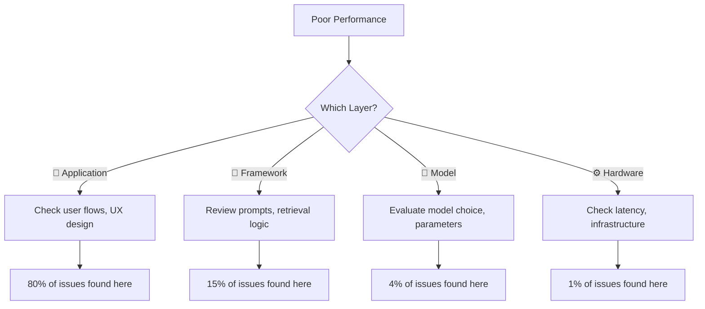
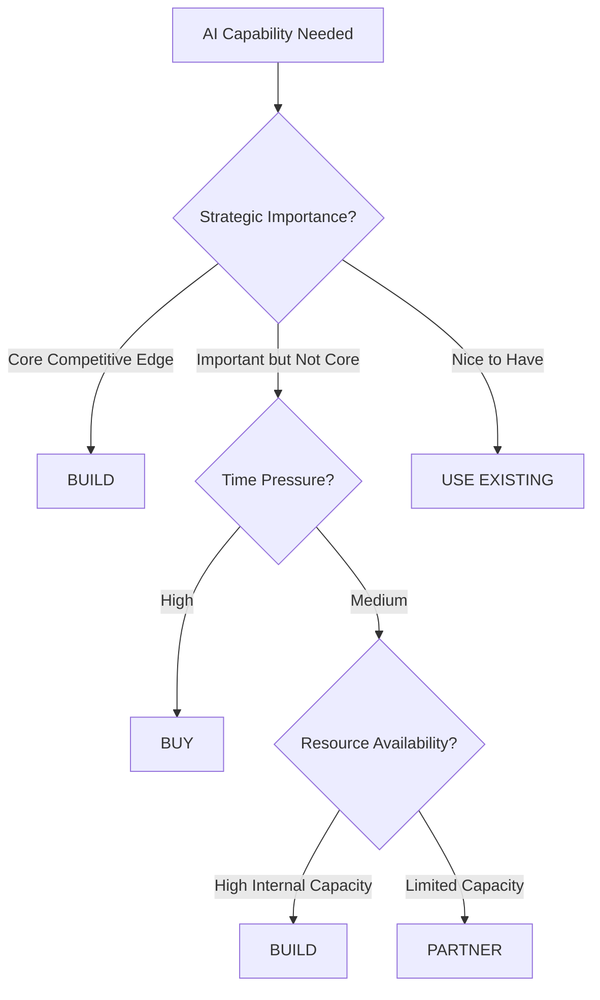
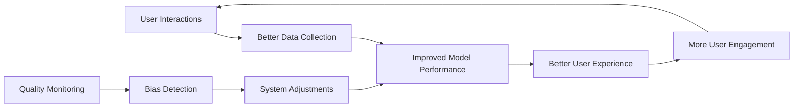
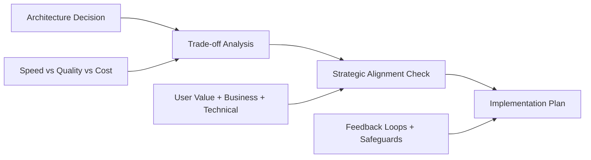
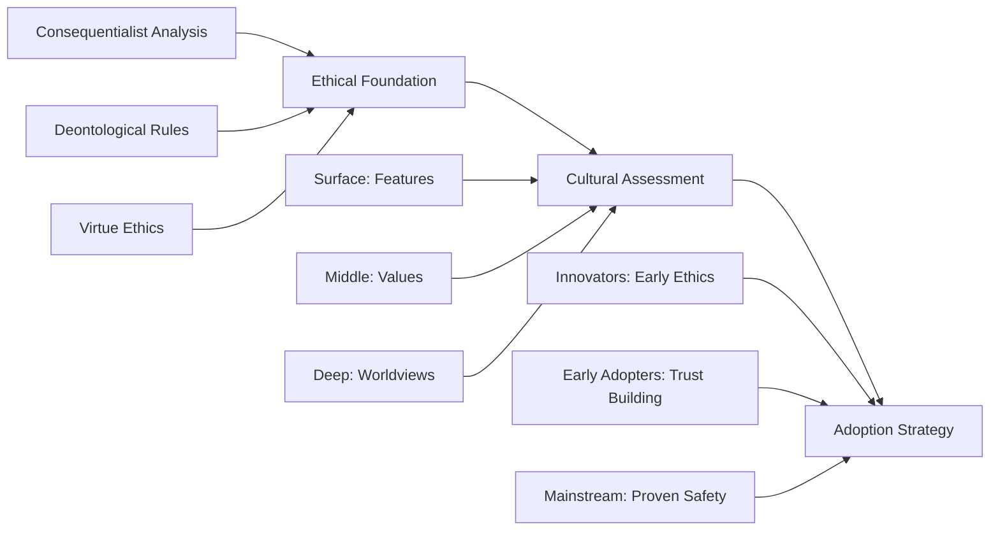

# 🧠 Mental Models for AI Development

> **Your cognitive superpowers for making better AI decisions 10x faster**

---

## 🚀 **Why Mental Models Matter**

Mental models are **thinking frameworks** that compress complex AI decisions into manageable patterns. They help you:

- **⚡ Accelerate decision-making** using proven frameworks
- **🎯 Navigate complexity** without getting overwhelmed  
- **💡 Predict outcomes** in unfamiliar scenarios
- **🗣️ Communicate effectively** across technical and business teams
- **⚠️ Avoid common pitfalls** that derail AI projects

**The Promise**: Master these mental models, and you'll make better AI decisions 10x faster.

---

## 📚 **Quick Navigation**

### 🚦 **Start Here**
- **[📄 One-Page Quick Reference](./mental-models-one-page.md)** - Essential frameworks at a glance
- **[🎯 Decision Scenarios](#decision-scenarios)** - Jump to specific situations
- **[🛠️ Practical Toolkit](#practical-toolkit)** - Templates and exercises

### 🔧 **By Use Case**
- **[🔍 Debugging AI Systems](#debugging-frameworks)** - When things go wrong
- **[🏗️ Architecture Decisions](#architecture-frameworks)** - System design choices
- **[💼 Business Strategy](#business-frameworks)** - ROI, timing, build vs buy
- **[📈 Scaling Systems](#scaling-frameworks)** - Growth and optimization

---

## 🎯 **Core Mental Model Library**

### 🏗️ **System Design & Architecture**

| Mental Model | When to Use | Key Insight |
|--------------|-------------|-------------|
| **[🏗️ Abstraction Ladder](./abstraction-ladder.md)** | Debugging, optimization, communication | Fix problems at the right layer |
| **[⚖️ Trade-off Triangle](./trade-off-triangle.md)** | Resource allocation, performance tuning | You can optimize 2 of 3: Speed, Quality, Cost |
| **[🔄 Feedback Loops](./feedback-loops.md)** | System design, risk management | Design virtuous cycles, prevent dangerous amplification |
| **[📈 Emergence Principle](./emergence-principle.md)** | Complex system behavior | Simple rules create complex behaviors |

### 🧠 **Decision Making & Strategy**

| Mental Model | When to Use | Key Insight |
|--------------|-------------|-------------|
| **[🎯 North Star Principle](./north-star-principle.md)** | Strategic alignment, project planning | Align with User Value + Business Impact + Technical Feasibility |
| **[⚡ 10-10-10 Rule](./10-10-10-rule.md)** | Important decisions, trade-off evaluation | Consider 10min, 10month, 10year impact |
| **[🎯 MVP Filter](./mvp-filter.md)** | Feature prioritization, product development | Find minimum viable approach for maximum learning |
| **[🎯 Goldilocks Principle](./goldilocks-principle.md)** | Optimization, resource allocation | Find the "just right" zone |

### 🔧 **Problem Solving & Analysis**

| Mental Model | When to Use | Key Insight |
|--------------|-------------|-------------|
| **[🔄 Inversion Thinking](./inversion-thinking.md)** | Risk assessment, failure prevention | Solve by considering what could go wrong |
| **[🎯 First Principles Thinking](./first-principles-thinking.md)** | Complex problems, innovation | Break down to fundamental truths |
| **[📊 Signal vs Noise](./signal-vs-noise.md)** | Data analysis, performance evaluation | Distinguish patterns from random variation |
| **[🌊 Compound Growth](./compound-growth.md)** | System optimization, improvement planning | Design systems that improve exponentially |

### 💼 **Business Decision Making**

| Mental Model | When to Use | Key Insight |
|--------------|-------------|-------------|
| **[💰 ROI Matrix](./roi-matrix.md)** | Investment decisions, project justification | Multi-dimensional value analysis |
| **[⚖️ Risk Assessment Triangle](./risk-assessment-triangle.md)** | Project evaluation, risk management | Evaluate technical, business, and market risk |
| **[🔄 Build vs Buy vs Partner](./build-buy-partner-matrix.md)** | Strategic capability decisions | Match approach to strategic importance |
| **[⏰ Market Timing Framework](./market-timing-framework.md)** | Product launches, competitive positioning | Navigate optimal timing decisions |

---

## 🎯 **Decision Scenarios**

### 🔧 **"My AI System Has Poor Performance"**

**❌ Common Approach**: Immediately start fine-tuning the model

**✅ Mental Model Approach**: Use **[Abstraction Ladder](./abstraction-ladder.md)**



**Decision Template**:
1. **Application Layer**: Are users asking answerable questions?
2. **Framework Layer**: Are prompts clear and retrieval working?
3. **Model Layer**: Is the model appropriate for this task?
4. **Hardware Layer**: Is latency affecting experience?

### 🏗️ **"Should We Build, Buy, or Partner for This AI Capability?"**

**Mental Models**: **[Build vs Buy vs Partner](./build-buy-partner-matrix.md)** + **[North Star Principle](./north-star-principle.md)**



**Decision Framework**:

| Use Case | Priority 1 | Priority 2 | Accept Trade-off | Solution |
|----------|------------|------------|------------------|----------|
| **Core Competitive** | Control | Quality | Higher Cost & Time | Build internally |
| **Time-Critical** | Speed | Quality | Higher Cost | Buy premium solution |
| **Resource-Constrained** | Cost | Speed | Lower Quality | Use existing tools |
| **Strategic Partnership** | Shared Risk | Shared Expertise | Shared Control | Partner |

### 📈 **"How Do We Scale Our AI System?"**

**Mental Models**: **[Feedback Loops](./feedback-loops.md)** + **[Trade-off Triangle](./trade-off-triangle.md)**

**Scaling Strategy**:


**Implementation Checklist**:
- ✅ **Positive Loop**: Satisfaction → Usage → Data → Performance
- ✅ **Safeguards**: Bias monitoring, quality checks, circuit breakers
- ✅ **Metrics**: Leading (engagement) + Lagging (satisfaction) indicators
- ✅ **Trade-offs**: Explicit choices on Speed vs Quality vs Cost at scale

---

## 🛠️ **Practical Toolkit**

### 📋 **Pre-Project Checklist**

Before starting any AI project, validate using these mental models:

- [ ] **[North Star Principle](./north-star-principle.md)**: Clear user value + business impact + technical feasibility
- [ ] **[Trade-off Triangle](./trade-off-triangle.md)**: Explicit choices on Speed vs Quality vs Cost
- [ ] **[Risk Assessment Triangle](./risk-assessment-triangle.md)**: Technical + Business + Market risk evaluation
- [ ] **[ROI Matrix](./roi-matrix.md)**: Multi-dimensional value analysis
- [ ] **[Feedback Loops](./feedback-loops.md)**: Designed positive cycles with safeguards

### 🎯 **Decision Templates**

#### **System Architecture Decision Template**
```
PROJECT: [Your AI System]

ABSTRACTION ANALYSIS:
🎨 Application Layer: [User experience issues?]
🔧 Framework Layer: [Integration/orchestration issues?]
🧠 Model Layer: [Performance/accuracy issues?]
⚙️ Hardware Layer: [Infrastructure/cost issues?]

TRADE-OFF ANALYSIS:
Current Priority: Speed/Quality/Cost
Acceptable Trade-offs: [What can we sacrifice?]
Non-negotiables: [What must we maintain?]

RISK ASSESSMENT:
Technical Risk: High/Medium/Low [Key concerns]
Business Risk: High/Medium/Low [Key concerns]
Market Risk: High/Medium/Low [Key concerns]
```

#### **ROI Evaluation Template**
```
DIRECT ROI (Weight: 1.0):
- Cost Savings: $[amount]/year
- Revenue Increase: $[amount]/year
- Efficiency Gains: $[amount]/year
SUBTOTAL: $[X]

INDIRECT ROI (Weight: 0.7):
- User Satisfaction: $[estimated value]/year
- Brand Enhancement: $[estimated value]/year
SUBTOTAL: $[Y] × 0.7 = $[Y × 0.7]

LEARNING VALUE (Weight: 0.5):
- Team Skills: $[estimated value]
- Process Insights: $[estimated value]
SUBTOTAL: $[Z] × 0.5 = $[Z × 0.5]

STRATEGIC VALUE (Weight: 0.3):
- Competitive Advantage: $[estimated value]
- Future Optionality: $[estimated value]
SUBTOTAL: $[W] × 0.3 = $[W × 0.3]

TOTAL ANNUAL VALUE: $[X + Y×0.7 + Z×0.5 + W×0.3]
INVESTMENT REQUIRED: $[Total cost]
PAYBACK PERIOD: [Investment ÷ Annual Value] years
```

### 🔄 **Weekly Review Questions**

Use these mental model-driven questions for ongoing project health:

**System Health** ([Abstraction Ladder](./abstraction-ladder.md)):
- Which layer needs attention this week?
- Are we solving problems at the right level?

**Strategic Alignment** ([North Star Principle](./north-star-principle.md)):
- Are we still aligned with user value + business impact?
- Has our technical feasibility changed?

**Trade-off Validation** ([Trade-off Triangle](./trade-off-triangle.md)):
- Are our Speed/Quality/Cost trade-offs still appropriate?
- Should we adjust based on new information?

**Feedback Loop Health** ([Feedback Loops](./feedback-loops.md)):
- What virtuous/vicious cycles are we seeing?
- Are our safeguards working effectively?

---

## 🚨 **Emergency Decision Matrix**

When you need fast AI decisions under pressure:

| **Crisis Situation** | **First Mental Model** | **Key Question** | **Fast Action** |
|---------------------|----------------------|------------------|------------------|
| 🔥 **System Down** | [Abstraction Ladder](./abstraction-ladder.md) | Which layer is failing? | Debug from application layer down |
| 💸 **Budget Crisis** | [Trade-off Triangle](./trade-off-triangle.md) | What can we sacrifice? | Make explicit quality vs cost choice |
| 🏃‍♂️ **Tight Deadline** | [MVP Filter](./mvp-filter.md) | What's minimum viable? | Cut scope aggressively, maintain quality |
| 📊 **Poor Metrics** | [Signal vs Noise](./signal-vs-noise.md) | Pattern or outlier? | Get more data before major changes |
| 🎯 **Lost Direction** | [North Star Principle](./north-star-principle.md) | What's the user value? | Re-align with core objectives |
| ⚖️ **Technical Debt** | [First Principles](./first-principles-thinking.md) | What are fundamentals? | Question assumptions, rebuild wisely |

---

## 📈 **Advanced Applications**

### 🔍 **Debugging Frameworks**

**Pattern**: System Issues → Mental Model → Systematic Analysis

| **Problem Type** | **Mental Model Chain** | **Investigation Order** |
|------------------|----------------------|-------------------------|
| **Performance Issues** | [Abstraction Ladder](./abstraction-ladder.md) → [Trade-off Triangle](./trade-off-triangle.md) | Layer identification → Resource optimization |
| **User Complaints** | [North Star Principle](./north-star-principle.md) → [Signal vs Noise](./signal-vs-noise.md) | Value alignment → Pattern analysis |
| **Scaling Problems** | [Feedback Loops](./feedback-loops.md) → [Emergence Principle](./emergence-principle.md) | Loop analysis → System behavior |

### 🏗️ **Architecture Frameworks**

**Pattern**: Design Decision → Trade-off Analysis → Strategic Alignment



### 💼 **Business Frameworks**

**Strategic Decision Pipeline**:
1. **[North Star Principle](./north-star-principle.md)**: Is this aligned with our core objectives?
2. **[ROI Matrix](./roi-matrix.md)**: What's the multi-dimensional value?
3. **[Risk Assessment Triangle](./risk-assessment-triangle.md)**: What are the technical/business/market risks?
4. **[Market Timing Framework](./market-timing-framework.md)**: Is this the right time?
5. **[Build vs Buy vs Partner](./build-buy-partner-matrix.md)**: What's the best approach?

### 📈 **Scaling Frameworks**

**Growth Strategy using Mental Models**:

**Phase 1: Foundation** (1-100 users)
- Focus: [MVP Filter](./mvp-filter.md) + [North Star Principle](./north-star-principle.md)
- Priority: Learning and user value validation

**Phase 2: Optimization** (100-10K users)
- Focus: [Trade-off Triangle](./trade-off-triangle.md) + [Feedback Loops](./feedback-loops.md)
- Priority: Reliability and positive user cycles

**Phase 3: Scale** (10K+ users)
- Focus: [Emergence Principle](./emergence-principle.md) + [Compound Growth](./compound-growth.md)
- Priority: System behaviors and exponential improvement

---

## 🧠 **Interdisciplinary Mental Models**

### ⚛️ **Physics-Inspired**
- **[🌊 Resonance Principle](./resonance-principle.md)** - Amplify impact by matching system frequencies
- **[🔄 Phase Transitions](./phase-transitions.md)** - Navigate critical transformation moments
- **[⚖️ Conservation Laws](./conservation-laws.md)** - Apply fundamental conservation principles
- **[📈 Entropy Minimization](./entropy-minimization.md)** - Optimize AI decision-making under uncertainty
- **[🎯 Signal Processing Theory](./signal-processing-theory.md)** - Filter noise from meaningful patterns

### 🧬 **Biology-Inspired**
- **[👑 Red Queen Hypothesis](./red-queen-hypothesis.md)** - Continuous improvement to maintain position
- **[🤝 Symbiosis Framework](./symbiosis-framework.md)** - Design mutually beneficial relationships
- **[🔄 Evolutionary Algorithms](./evolutionary-algorithms.md)** - Optimize AI through variation and selection
- **[🌱 Adaptive Immunity](./adaptive-immunity.md)** - Build AI systems that learn from threats

### 🧠 **Psychology-Inspired**
- **[🌊 Flow State Optimization](./flow-state-optimization.md)** - Create optimal performance conditions
- **[🧠 Cognitive Load Theory](./cognitive-load-theory.md)** - Work WITH human cognitive limits
- **[🏔️ Peak-End Rule](./peak-end-rule.md)** - Create memorable experiences
- **[⚖️ Dual Process Theory](./dual-process-theory.md)** - Design for both intuitive and analytical thinking
- **[🧠 Attention Economics](./attention-economics.md)** - Respect human cognitive resources

### 💰 **Economics-Inspired**
- **[🌐 Network Effects](./network-effects.md)** - Value increases exponentially with users
- **[📊 Pareto Principle](./pareto-principle.md)** - Focus on the 20% that creates 80% value
- **[🎯 Game Theory Matrix](./game-theory-matrix.md)** - Navigate strategic interactions
- **[🎲 Behavioral Economics](./behavioral-economics.md)** - Account for human irrationality in AI design
- **[💰 Incentive Alignment](./incentive-alignment.md)** - Ensure stakeholder goals align with AI outcomes

### ⚔️ **Strategy-Inspired**
- **[🎯 OODA Loop](./ooda-loop.md)** - Faster decision cycles: Observe, Orient, Decide, Act
- **[⚡ Force Multipliers](./force-multipliers.md)** - Tools that amplify team effectiveness
- **[🏔️ Terrain Advantage](./terrain-advantage.md)** - Identify competitive positioning for AI capabilities
- **[🎭 Red Team Thinking](./red-team-thinking.md)** - Attack your own AI systems to find vulnerabilities
- **[🔍 Intelligence Cycle](./intelligence-cycle.md)** - Systematic AI-driven insight generation

### 🗣️ **Communication-Inspired**
- **[🔄 Shannon-Weaver Model](./shannon-weaver-model.md)** - Optimize information transfer
- **[🧭 Framing Effect](./framing-effect.md)** - How presentation influences decisions
- **[🧠 Cooperative Principle](./cooperative-principle.md)** - Conversational maxims for AI
- **[🎯 Speech Act Theory](./speech-act-theory.md)** - Design AI that understands intent beyond literal meaning
- **[🌊 Discourse Analysis](./discourse-analysis.md)** - Improve AI conversation flow and context management

### 🎓 **Philosophy-Inspired**
- **[🤔 Socratic Questioning](./socratic-questioning.md)** - Debug AI assumptions through systematic inquiry
- **[⚖️ Ethical Frameworks](./ethical-frameworks.md)** - Navigate AI ethics using consequentialism vs deontology
- **[🔍 Transparency Principle](./transparency-principle.md)** - Balance explainability with performance
- **[🌍 Systems Ontology](./systems-ontology.md)** - Model complex AI system relationships
- **[🎯 Virtue Ethics](./virtue-ethics.md)** - Build AI that embodies beneficial character traits

### 🏛️ **Anthropology-Inspired**
- **[🗺️ Cultural Iceberg Model](./cultural-iceberg-model.md)** - Understand surface vs deep factors in AI adoption
- **[🎭 Ritual and Practice Theory](./ritual-practice-theory.md)** - Design AI workflows that align with human practices
- **[🔄 Diffusion of Innovation](./diffusion-of-innovation.md)** - Predict how AI features spread through populations
- **[🤝 Social Capital Theory](./social-capital-theory.md)** - Leverage trust networks for AI adoption
- **[🏘️ Community Formation](./community-formation.md)** - Build sustainable AI user communities

### 📚 **Education & Learning Sciences**
- **[🎯 Bloom's Taxonomy](./blooms-taxonomy.md)** - Structure AI learning experiences and capability assessment
- **[🔄 Kolb's Learning Cycle](./kolbs-learning-cycle.md)** - Design AI systems that support experiential learning
- **[🎪 Constructivist Learning](./constructivist-learning.md)** - Build AI that helps users construct knowledge
- **[📊 Assessment Theory](./assessment-theory.md)** - Design AI feedback loops for continuous improvement
- **[🎯 Mastery Learning](./mastery-learning.md)** - AI personalization based on competency progression

### 🗣️ **Linguistics & Language Theory**
- **[🧠 Cognitive Linguistics](./cognitive-linguistics.md)** - Align AI language models with human conceptual structures
- **[🔗 Frame Semantics](./frame-semantics.md)** - Improve AI understanding of contextual meaning
- **[🌐 Translation Theory](./translation-theory.md)** - Cross-cultural AI communication principles
- **[📝 Pragmatics](./pragmatics.md)** - Design AI that handles context and implication
- **[🎭 Narrative Theory](./narrative-theory.md)** - Structure AI interactions as coherent stories

### 🔢 **Mathematics-Inspired**
- **[🎲 Bayesian Reasoning](./bayesian-reasoning.md)** - Update AI beliefs based on new evidence
- **[📊 Statistical Thinking](./statistical-thinking.md)** - Distinguish correlation from causation in AI insights
- **[🔄 Markov Processes](./markov-processes.md)** - Model state transitions in AI workflows
- **[📐 Graph Theory](./graph-theory.md)** - Understand relationships and connections in AI systems
- **[🌊 Chaos Theory](./chaos-theory.md)** - Manage sensitive dependence in complex AI systems

### 🎨 **Design Theory**
- **[👥 Human-Centered Design](./human-centered-design.md)** - Put users at the center of AI development
- **[🔄 Design Thinking Process](./design-thinking-process.md)** - Systematically innovate AI solutions
- **[🎯 Jobs-to-be-Done](./jobs-to-be-done.md)** - Understand what users hire AI to accomplish
- **[📐 Form Follows Function](./form-follows-function.md)** - Align AI interface design with core functionality
- **[🌊 Progressive Disclosure](./progressive-disclosure.md)** - Reveal AI complexity gradually based on user expertise

### 🧠 **Neuroscience-Inspired**
- **[⚡ Neural Efficiency](./neural-efficiency.md)** - Optimize AI to work with natural brain patterns
- **[🔄 Neuroplasticity Principles](./neuroplasticity-principles.md)** - Design AI that adapts to users over time
- **[⚖️ Somatic Marker Hypothesis](./somatic-marker-hypothesis.md)** - Include emotional factors in AI recommendations
- **[🔄 Prediction Error](./prediction-error.md)** - Use surprise to drive AI learning and user engagement
- **[🧠 Default Mode Network](./default-mode-network.md)** - Design AI that supports both focused and creative thinking

### 📖 **Knowledge Management**
- **[🌐 SECI Model](./seci-model.md)** - Transform tacit knowledge into explicit organizational capabilities
- **[📚 Knowledge Taxonomy](./knowledge-taxonomy.md)** - Organize AI insights for maximum organizational value
- **[🎯 Communities of Practice](./communities-of-practice.md)** - Build AI user expertise networks
- **[🌊 Knowledge Spiral](./knowledge-spiral.md)** - Convert AI insights into organizational capabilities
- **[💡 Innovation Diffusion](./innovation-diffusion.md)** - Plan AI capability rollout strategies

### ⚖️ **Legal Theory**
- **[⚖️ Compliance by Design](./compliance-by-design.md)** - Build AI systems that inherently meet legal requirements
- **[🛡️ Legal Risk Assessment](./legal-risk-assessment.md)** - Evaluate AI deployment legal implications
- **[📊 Evidence Standards](./evidence-standards.md)** - Structure AI decisions to meet legal scrutiny
- **[🤝 Contract Theory](./contract-theory.md)** - Design agreements that align AI stakeholder interests
- **[📋 Liability Frameworks](./liability-frameworks.md)** - Understand responsibility in AI-driven decisions

### 🔬 **Complexity Science**
- **[🦋 Sensitive Dependence](./sensitive-dependence.md)** - Understand how small AI changes create large effects
- **[🎯 Edge of Chaos](./edge-of-chaos.md)** - Optimize AI systems at the boundary between order and disorder
- **[🔄 Self-Organization](./self-organization.md)** - Design AI systems that improve without central control
- **[📊 Scale-Free Networks](./scale-free-networks.md)** - Understand how AI adoption spreads through organizations
- **[🎯 Small World Networks](./small-world-networks.md)** - Optimize AI information flow patterns

### ⚙️ **Cybernetics**
- **[📊 Feedback Control Systems](./feedback-control-systems.md)** - Design stable AI behavior under varying conditions
- **[🎯 Homeostasis](./homeostasis.md)** - Maintain AI system stability while allowing adaptation
- **[📈 Requisite Variety](./requisite-variety.md)** - Match AI system complexity to problem complexity
- **[🔄 Second-Order Cybernetics](./second-order-cybernetics.md)** - Design AI systems that observe themselves
- **[🎛️ Control Theory](./control-theory.md)** - Maintain desired AI system behavior through feedback

### 📐 **Engineering Disciplines**
- **[🔧 Requirements Engineering](./requirements-engineering.md)** - Systematically capture what AI systems must accomplish
- **[📊 Reliability Engineering](./reliability-engineering.md)** - Design AI systems for consistent performance
- **[⚡ Performance Engineering](./performance-engineering.md)** - Optimize AI systems for speed and efficiency
- **[🎯 Lean Principles](./lean-principles.md)** - Eliminate waste in AI development and deployment
- **[📊 Quality Control](./quality-control.md)** - Systematic AI output quality management

---

## 🎓 **Learning Pathways**

### 🥉 **Beginner Path** (Week 1-2)
**Goal**: Master core AI decision-making

1. **[🏗️ Abstraction Ladder](./abstraction-ladder.md)** - Debug any AI system
2. **[⚖️ Trade-off Triangle](./trade-off-triangle.md)** - Make explicit optimization choices
3. **[🎯 North Star Principle](./north-star-principle.md)** - Align all decisions

**Practice**: Apply to one current AI project

### 🥈 **Intermediate Path** (Week 3-4)
**Goal**: Strategic AI decision-making

4. **[🔄 Feedback Loops](./feedback-loops.md)** - Design self-improving systems
5. **[💰 ROI Matrix](./roi-matrix.md)** - Multi-dimensional value analysis
6. **[🔄 Build vs Buy vs Partner](./build-buy-partner-matrix.md)** - Strategic capability decisions

**Practice**: Complete ROI analysis for major AI initiative

### 🥇 **Advanced Path** (Month 2+)
**Goal**: Master complex AI strategy

7. **[📈 Emergence Principle](./emergence-principle.md)** - Understand complex system behaviors
8. **[⏰ Market Timing Framework](./market-timing-framework.md)** - Strategic timing decisions
9. **[🔄 Inversion Thinking](./inversion-thinking.md)** - Advanced problem-solving

**Practice**: Design comprehensive AI strategy using multiple mental models

### 🏆 **Expert Path** (Ongoing)
**Goal**: Interdisciplinary mastery

- Choose 3-5 interdisciplinary models that resonate with your domain
- Practice combining multiple mental models for complex decisions
- Develop your own decision frameworks using these foundations

### 🎓 **Interdisciplinary Specialization Paths**

#### **🤖 AI Ethics & Governance Specialist**
**Mental Model Stack**:
1. **[⚖️ Ethical Frameworks](./ethical-frameworks.md)** - Navigate consequentialism vs deontology
2. **[⚖️ Legal Risk Assessment](./legal-risk-assessment.md)** - Understand regulatory implications
3. **[🗺️ Cultural Iceberg Model](./cultural-iceberg-model.md)** - Account for cultural differences
4. **[🤝 Stakeholder Ethics](./stakeholder-ethics.md)** - Consider all affected parties
5. **[📊 Evidence Standards](./evidence-standards.md)** - Structure defensible AI decisions

**Practice**: Develop comprehensive AI governance framework for your organization

#### **🎨 AI UX/Design Specialist**
**Mental Model Stack**:
1. **[👥 Human-Centered Design](./human-centered-design.md)** - Center users in AI development
2. **[🧠 Cognitive Load Theory](./cognitive-load-theory.md)** - Work with human cognitive limits
3. **[🎯 Jobs-to-be-Done](./jobs-to-be-done.md)** - Understand user motivations
4. **[🌊 Flow State Optimization](./flow-state-optimization.md)** - Create optimal experiences
5. **[🏔️ Peak-End Rule](./peak-end-rule.md)** - Design memorable interactions

**Practice**: Redesign an AI interface using all five mental models

#### **🏗️ AI Systems Architect**
**Mental Model Stack**:
1. **[🔧 Requirements Engineering](./requirements-engineering.md)** - Capture what systems must do
2. **[⚙️ Cybernetics](./feedback-control-systems.md)** - Design stable, adaptive systems
3. **[🔬 Complexity Science](./self-organization.md)** - Understand emergent behaviors
4. **[📊 Reliability Engineering](./reliability-engineering.md)** - Ensure consistent performance
5. **[🎯 Trade-off Triangle](./trade-off-triangle.md)** - Balance speed, quality, cost

**Practice**: Design fault-tolerant AI architecture using complexity science principles

#### **💼 AI Business Strategist**
**Mental Model Stack**:
1. **[🎯 North Star Principle](./north-star-principle.md)** - Align objectives across stakeholders
2. **[🌐 Network Effects](./network-effects.md)** - Design for exponential value growth
3. **[🔄 Diffusion of Innovation](./diffusion-of-innovation.md)** - Plan adoption strategies
4. **[🎯 Game Theory Matrix](./game-theory-matrix.md)** - Navigate competitive dynamics
5. **[💰 ROI Matrix](./roi-matrix.md)** - Evaluate multi-dimensional value

**Practice**: Develop go-to-market strategy combining network effects with innovation diffusion

#### **🧠 AI-Human Interaction Specialist**
**Mental Model Stack**:
1. **[⚖️ Dual Process Theory](./dual-process-theory.md)** - Design for intuitive and analytical thinking
2. **[🧠 Attention Economics](./attention-economics.md)** - Respect cognitive resources
3. **[🎭 Ritual and Practice Theory](./ritual-practice-theory.md)** - Align with human workflows
4. **[🔄 Neuroplasticity Principles](./neuroplasticity-principles.md)** - Support user adaptation
5. **[🤝 Social Capital Theory](./social-capital-theory.md)** - Build trust through AI design

**Practice**: Create AI assistant that adapts to individual cognitive styles

---

## 🎯 **Advanced Interdisciplinary Decision Scenarios**

### 🤖 **"How Do We Build Ethical AI That Users Actually Adopt?"**

**Interdisciplinary Mental Model Approach**: 
**[⚖️ Ethical Frameworks](./ethical-frameworks.md)** + **[🗺️ Cultural Iceberg Model](./cultural-iceberg-model.md)** + **[🔄 Diffusion of Innovation](./diffusion-of-innovation.md)**



**Decision Framework**:
1. **Ethical Foundation**: What moral framework guides our AI?
   - Consequentialist: Does it produce good outcomes?
   - Deontological: Does it follow ethical rules?
   - Virtue Ethics: Does it embody good character?

2. **Cultural Analysis**: How do different groups understand ethics?
   - Surface: What ethical features do they see?
   - Values: What moral principles do they hold?
   - Worldview: How do they see human-AI relationships?

3. **Adoption Strategy**: How do we roll out ethical AI?
   - Innovators (2.5%): Emphasize cutting-edge ethical features
   - Early Adopters (13.5%): Build trust through transparency
   - Early Majority (34%): Prove safety and reliability
   - Late Majority (34%): Show social proof and compliance
   - Laggards (16%): Require regulatory mandate

### 🧠 **"How Do We Design AI That Enhances Human Creativity?"**

**Mental Model Chain**: 
**[🧠 Default Mode Network](./default-mode-network.md)** + **[🌊 Flow State Optimization](./flow-state-optimization.md)** + **[🔄 Neuroplasticity Principles](./neuroplasticity-principles.md)**

**Design Philosophy**:
```python
def enhance_creativity():
    # Default Mode Network: Support both focused and wandering attention
    focused_mode = {
        "clear_objectives": "Specific creative tasks",
        "immediate_feedback": "Real-time AI suggestions",
        "reduced_distractions": "Clean, minimal interface"
    }
    
    wandering_mode = {
        "open_exploration": "Divergent idea generation", 
        "cross_domain_connections": "AI draws from multiple fields",
        "incubation_support": "Background processing while user rests"
    }
    
    # Flow State: Optimal challenge-skill balance
    flow_conditions = {
        "dynamic_difficulty": "AI adjusts complexity to user skill",
        "clear_goals": "Each creative session has defined outcomes",
        "immediate_feedback": "AI responds to creative attempts instantly",
        "action_awareness": "User stays engaged with AI collaboration"
    }
    
    # Neuroplasticity: System adapts to user's creative growth
    adaptation = {
        "pattern_recognition": "AI learns user's creative preferences",
        "skill_scaffolding": "Gradually increase creative challenges",
        "style_evolution": "Support development of unique creative voice",
        "cross_domain_transfer": "Apply learning from one domain to another"
    }
    
    return integrate(focused_mode, wandering_mode, flow_conditions, adaptation)
```

### 🌐 **"How Do We Scale AI Globally While Respecting Cultural Differences?"**

**Mental Model Integration**:
**[🌐 Translation Theory](./translation-theory.md)** + **[🎭 Ritual and Practice Theory](./ritual-practice-theory.md)** + **[📊 Scale-Free Networks](./scale-free-networks.md)**

**Scaling Strategy**:

**Phase 1: Cultural Translation (Not Just Language)**
- **Surface Translation**: Convert text, audio, visual elements
- **Deep Translation**: Adapt metaphors, examples, interaction patterns
- **Behavioral Translation**: Modify AI responses for cultural communication styles
- **Value Translation**: Align AI recommendations with local ethical frameworks

**Phase 2: Practice Integration**
- **Ritual Respect**: AI integrates with existing cultural practices
- **Workflow Adaptation**: Modify AI to support local business customs
- **Authority Patterns**: Respect cultural hierarchies and decision-making styles
- **Social Dynamics**: Account for individualistic vs collectivistic cultures

**Phase 3: Network-Based Expansion**
- **Hub Identification**: Find cultural influencers and early adopters in each region
- **Local Adaptation**: Create region-specific AI capabilities
- **Cross-Cultural Learning**: AI learns from successful patterns across cultures
- **Organic Growth**: Let adoption spread through natural social networks

### 🔬 **"How Do We Build AI That Can Handle Chaos and Uncertainty?"**

**Complexity Science Mental Models**:
**[🦋 Sensitive Dependence](./sensitive-dependence.md)** + **[🎯 Edge of Chaos](./edge-of-chaos.md)** + **[🔄 Self-Organization](./self-organization.md)**

**Chaos-Resilient AI Architecture**:

```python
class ChaosResilientAI:
    def __init__(self):
        # Sensitive Dependence: Small changes → Large effects
        self.sensitivity_monitoring = {
            "change_detection": "Monitor for small input variations",
            "amplification_tracking": "Track how small changes propagate",
            "intervention_points": "Identify where small changes matter most",
            "butterfly_safeguards": "Prevent runaway amplification"
        }
        
        # Edge of Chaos: Optimal complexity zone
        self.complexity_management = {
            "order_chaos_balance": "Maintain system flexibility without breakdown",
            "adaptive_capacity": "Adjust complexity to environmental demands",
            "innovation_space": "Allow novel solutions to emerge",
            "stability_anchors": "Maintain core functionality under stress"
        }
        
        # Self-Organization: Emergent structure
        self.emergence_design = {
            "simple_rules": "Define basic AI interaction principles",
            "local_interactions": "Enable AI components to interact freely",
            "pattern_recognition": "Detect useful emergent behaviors",
            "amplification_mechanisms": "Strengthen beneficial patterns"
        }
    
    def handle_uncertainty(self, situation):
        if self.is_chaos_approaching(situation):
            return self.complexity_management.reduce_complexity()
        elif self.is_too_rigid(situation):
            return self.emergence_design.increase_variability()
        else:
            return self.sensitivity_monitoring.fine_tune()
```

### 💡 **"How Do We Create AI That Builds Human Capabilities Instead of Replacing Them?"**

**Augmentation Mental Models**:
**[🎯 Jobs-to-be-Done](./jobs-to-be-done.md)** + **[🔄 Kolb's Learning Cycle](./kolbs-learning-cycle.md)** + **[🤝 Symbiosis Framework](./symbiosis-framework.md)**

**Human-AI Symbiosis Design**:

**Step 1: Understand Human Jobs**
- **Functional Jobs**: What tasks are humans trying to accomplish?
- **Emotional Jobs**: How do they want to feel while doing it?
- **Social Jobs**: How does this relate to others?
- **Learning Jobs**: What capabilities do they want to develop?

**Step 2: Design Complementary AI**
- **AI Handles**: Repetitive processing, pattern recognition, data retrieval
- **Human Handles**: Creative synthesis, ethical judgment, contextual interpretation
- **Shared Responsibility**: Complex problem-solving, strategic planning

**Step 3: Enable Learning Loop**
- **Concrete Experience**: Human works with AI on real problems
- **Reflective Observation**: AI provides analytics on collaboration patterns
- **Abstract Conceptualization**: Human develops mental models of AI capabilities
- **Active Experimentation**: Human tries new ways of leveraging AI

**Result**: Humans become more capable, not replaceable

---

## 📊 **Success Indicators**

**You're Successfully Using Mental Models When**:

✅ **Decision Speed**: Choices become faster and more confident  
✅ **Team Alignment**: Discussions focus on fundamental trade-offs  
✅ **Problem Resolution**: Issues get solved at the right abstraction level  
✅ **System Improvement**: Consistent progress through designed feedback loops  
✅ **Strategic Clarity**: Direction becomes clearer across teams  
✅ **Reduced Debt**: Technical debt decreases through principled decisions

**Advanced Interdisciplinary Success Indicators**:

✅ **Cross-Domain Integration**: Seamlessly combining models from different disciplines  
✅ **Cultural Sensitivity**: AI decisions account for diverse user contexts  
✅ **Ethical Reasoning**: Ethical considerations are integrated, not afterthoughts  
✅ **Adaptive Learning**: Systems improve through real-world feedback loops  
✅ **Emergent Innovation**: Novel solutions arise from mental model combinations  
✅ **Human Augmentation**: AI enhances rather than replaces human capabilities

**Common Warning Signs**:

⚠️ **Layer Confusion**: Solving model problems with UX fixes  
⚠️ **Optimization Tunneling**: Focusing on one metric, ignoring others  
⚠️ **Feedback Blindness**: Missing dangerous amplification loops  
⚠️ **False Trade-offs**: Believing you can optimize all three simultaneously  
⚠️ **North Star Drift**: Losing sight of core user value

**Advanced Warning Signs**:

⚠️ **Disciplinary Silos**: Using only one type of mental model repeatedly  
⚠️ **Cultural Blindness**: Ignoring how different groups experience AI  
⚠️ **Ethical Debt**: Postponing ethical considerations for later  
⚠️ **Complexity Overwhelm**: Adding too many interdisciplinary models without integration  
⚠️ **Tool Worship**: Treating mental models as rigid rules rather than thinking aids

---

## 🚀 **Interdisciplinary Implementation Framework**

### **Phase 1: Foundation** (Weeks 1-4)
**Goal**: Master core mental models and basic interdisciplinary thinking

**Core Models to Master**:
1. **[🏗️ Abstraction Ladder](./abstraction-ladder.md)** - Universal debugging framework
2. **[⚖️ Trade-off Triangle](./trade-off-triangle.md)** - Fundamental optimization thinking
3. **[🎯 North Star Principle](./north-star-principle.md)** - Strategic alignment foundation

**First Interdisciplinary Combinations**:
- **Ethics + Business**: [Ethical Frameworks](./ethical-frameworks.md) + [ROI Matrix](./roi-matrix.md)
- **Psychology + Design**: [Cognitive Load Theory](./cognitive-load-theory.md) + [Human-Centered Design](./human-centered-design.md)
- **Strategy + Systems**: [OODA Loop](./ooda-loop.md) + [Feedback Loops](./feedback-loops.md)

**Weekly Practice**: Apply one mental model combination to a real project decision

### **Phase 2: Specialization** (Weeks 5-12)
**Goal**: Develop expertise in 2-3 interdisciplinary domains

**Choose Your Specialization Track**:

**🤖 AI Ethics & Governance Track**:
- Week 5-6: [⚖️ Ethical Frameworks](./ethical-frameworks.md) + [⚖️ Legal Risk Assessment](./legal-risk-assessment.md)
- Week 7-8: [🗺️ Cultural Iceberg Model](./cultural-iceberg-model.md) + [🤝 Stakeholder Ethics](./stakeholder-ethics.md)
- Week 9-10: [📊 Evidence Standards](./evidence-standards.md) + [⚖️ Compliance by Design](./compliance-by-design.md)
- Week 11-12: Integration project combining all models

**🎨 AI UX & Human Factors Track**:
- Week 5-6: [👥 Human-Centered Design](./human-centered-design.md) + [🧠 Cognitive Load Theory](./cognitive-load-theory.md)
- Week 7-8: [🎯 Jobs-to-be-Done](./jobs-to-be-done.md) + [🌊 Flow State Optimization](./flow-state-optimization.md)
- Week 9-10: [🏔️ Peak-End Rule](./peak-end-rule.md) + [🧠 Attention Economics](./attention-economics.md)
- Week 11-12: Redesign AI interface using integrated approach

**🏗️ AI Systems & Architecture Track**:
- Week 5-6: [🔧 Requirements Engineering](./requirements-engineering.md) + [📊 Reliability Engineering](./reliability-engineering.md)
- Week 7-8: [⚙️ Cybernetics](./feedback-control-systems.md) + [🔬 Complexity Science](./self-organization.md)
- Week 9-10: [🎯 Edge of Chaos](./edge-of-chaos.md) + [📈 Requisite Variety](./requisite-variety.md)
- Week 11-12: Design chaos-resilient AI architecture

**💼 AI Business Strategy Track**:
- Week 5-6: [🌐 Network Effects](./network-effects.md) + [🔄 Diffusion of Innovation](./diffusion-of-innovation.md)
- Week 7-8: [🎯 Game Theory Matrix](./game-theory-matrix.md) + [💰 Incentive Alignment](./incentive-alignment.md)
- Week 9-10: [🏔️ Terrain Advantage](./terrain-advantage.md) + [🔍 Intelligence Cycle](./intelligence-cycle.md)
- Week 11-12: Develop comprehensive AI market strategy

### **Phase 3: Integration Mastery** (Months 4-6)
**Goal**: Seamlessly combine mental models from multiple disciplines

**Integration Challenges**:

**Month 4: Cross-Cultural AI Ethics**
- Combine: [⚖️ Ethical Frameworks](./ethical-frameworks.md) + [🗺️ Cultural Iceberg Model](./cultural-iceberg-model.md) + [🔄 Diffusion of Innovation](./diffusion-of-innovation.md)
- Challenge: Design ethical AI that adapts to different cultural contexts
- Deliverable: Cultural AI ethics framework

**Month 5: Chaos-Resilient Human-Centered AI**
- Combine: [👥 Human-Centered Design](./human-centered-design.md) + [🔬 Complexity Science](./sensitive-dependence.md) + [🧠 Neuroplasticity](./neuroplasticity-principles.md)
- Challenge: Create AI that handles uncertainty while supporting human adaptation
- Deliverable: Adaptive AI interaction system

**Month 6: Symbiotic AI Business Ecosystem**
- Combine: [🤝 Symbiosis Framework](./symbiosis-framework.md) + [🌐 Network Effects](./network-effects.md) + [📖 Knowledge Management](./seci-model.md)
- Challenge: Build AI platform that creates mutual value for all stakeholders
- Deliverable: Multi-stakeholder AI platform strategy

### **Phase 4: Innovation & Leadership** (Months 7+)
**Goal**: Create novel mental model combinations and lead interdisciplinary AI thinking

**Innovation Projects**:
1. **Develop new mental model combinations** for emerging AI challenges
2. **Create decision frameworks** that integrate 5+ disciplines
3. **Lead cross-functional teams** using mental model vocabulary
4. **Contribute to mental model library** with real-world applications

**Leadership Capabilities**:
- **Teaching**: Help others understand and apply mental models
- **Translation**: Bridge different disciplinary perspectives
- **Integration**: Combine insights from multiple domains
- **Innovation**: Create new thinking frameworks for AI

### **Continuous Improvement Loop**

**Monthly Review Questions**:
1. **Integration Assessment**: How well am I combining models from different disciplines?
2. **Blind Spot Check**: What disciplines am I neglecting in my thinking?
3. **Application Quality**: Are my mental model applications becoming more sophisticated?
4. **Team Impact**: How effectively am I sharing interdisciplinary insights?
5. **Innovation Opportunity**: Where could new mental model combinations add value?

**Quarterly Deep Dive**:
- Choose one complex AI challenge
- Apply mental models from at least 5 different disciplines
- Document the integration process and insights
- Share learnings with the community

**Annual Mental Model Audit**:
- Assess your mental model portfolio across all disciplines
- Identify gaps in your interdisciplinary thinking
- Set learning goals for new mental model domains
- Update your personal decision-making frameworks

---

## 🚀 **Quick Start Guide**

### **Today** (15 minutes)
1. **Bookmark** the [One-Page Reference](./mental-models-one-page.md)
2. **Choose** one current AI decision you're facing
3. **Apply** the [Abstraction Ladder](./abstraction-ladder.md) or [Trade-off Triangle](./trade-off-triangle.md)

### **This Week** (1 hour)
1. **Complete** the [Pre-Project Checklist](#pre-project-checklist) for your main AI project
2. **Use** the [Decision Template](#decision-templates) for one major choice
3. **Share** mental model vocabulary with your team
4. **Try** one interdisciplinary combination from the [Advanced Scenarios](#advanced-interdisciplinary-decision-scenarios)

### **This Month** (2-3 hours)
1. **Master** the 3 core models: Abstraction Ladder, Trade-off Triangle, North Star Principle
2. **Apply** the [ROI Evaluation Template](#roi-evaluation-template) to a business decision
3. **Establish** weekly reviews using mental model questions
4. **Choose** one [Interdisciplinary Specialization Track](#phase-2-specialization-weeks-5-12)

### **This Quarter** (5-8 hours)
1. **Complete** your chosen specialization track from the [Implementation Framework](#interdisciplinary-implementation-framework)
2. **Apply** interdisciplinary mental models to one complex AI challenge
3. **Document** your integration process and share learnings
4. **Begin** [Integration Mastery phase](#phase-3-integration-mastery-months-4-6)

### **Ongoing** (10 minutes weekly + 1 hour monthly)
1. **Review** using [Weekly Review Questions](#weekly-review-questions)
2. **Track** which mental models help most in your context
3. **Expand** your toolkit based on the problems you encounter most
4. **Practice** new interdisciplinary combinations monthly
5. **Contribute** insights back to the mental models community

---

## 💡 **Key Takeaways**

### **🎯 The Mental Model Mindset**

Mental models aren't rigid rules—they're **thinking accelerators** that help you:
- **Compress complexity** into manageable patterns
- **Predict outcomes** using proven frameworks  
- **Communicate clearly** across expertise levels
- **Avoid pitfalls** that commonly derail projects

### **🔄 The Compound Effect**

Just like AI systems, mental model mastery compounds:
- **Week 1**: Make one decision 2x faster
- **Month 1**: Team decisions become more aligned  
- **Quarter 1**: Strategic clarity across all AI initiatives
- **Year 1**: Organizational AI decision-making capability

### **🌟 Remember**

> *"The best mental model is the one you actually use when it matters most."*

Your goal isn't to memorize all mental models—it's to build **better thinking patterns** that help you navigate AI complexity more effectively.

---

## 🔗 **Related Resources**

### **Within This Knowledge Base**
- **[AI Agents Hub](../../concepts/ai-agents.md)** - Apply mental models to agent development
- **[Best Practices Guide](../../guides/best-practices.md)** - Implementation patterns
- **[Tools & Frameworks](../../tools/README.md)** - Technical implementation resources

### **External Learning**
- **[Poor Charlie's Almanack](https://en.wikipedia.org/wiki/Charlie_Munger)** - Charlie Munger's mental models
- **[Thinking, Fast and Slow](https://en.wikipedia.org/wiki/Thinking,_Fast_and_Slow)** - Cognitive biases and decision-making
- **[The Art of Problem Solving](https://artofproblemsolving.com/)** - Mathematical thinking patterns

### **Interdisciplinary Resources**
- **[The Structure of Scientific Revolutions](https://en.wikipedia.org/wiki/The_Structure_of_Scientific_Revolutions)** - Thomas Kuhn's paradigm shifts
- **[Gödel, Escher, Bach](https://en.wikipedia.org/wiki/G%C3%B6del,_Escher,_Bach)** - Douglas Hofstadter's cognitive science
- **[The Design of Everyday Things](https://en.wikipedia.org/wiki/The_Design_of_Everyday_Things)** - Don Norman's design psychology
- **[Crossing the Chasm](https://en.wikipedia.org/wiki/Crossing_the_Chasm)** - Geoffrey Moore's technology adoption
- **[Antifragile](https://en.wikipedia.org/wiki/Antifragile_(book))** - Nassim Taleb's complexity thinking
- **[The Righteous Mind](https://en.wikipedia.org/wiki/The_Righteous_Mind)** - Jonathan Haidt's moral psychology
- **[Guns, Germs, and Steel](https://en.wikipedia.org/wiki/Guns,_Germs,_and_Steel)** - Jared Diamond's anthropological thinking
- **[The Innovator's Dilemma](https://en.wikipedia.org/wiki/The_Innovator%27s_Dilemma)** - Clayton Christensen's innovation theory

### **Mental Model Communities**
- **[LessWrong](https://www.lesswrong.com/)** - Rationality and cognitive science community
- **[Farnam Street](https://fs.blog/)** - Mental models and decision-making blog
- **[Edge.org](https://www.edge.org/)** - Interdisciplinary scientific thinking
- **[Santa Fe Institute](https://www.santafe.edu/)** - Complexity science research
- **[MIT Center for Collective Intelligence](https://cci.mit.edu/)** - Human-AI collaboration research

---

## 📝 **Contribute & Improve**

**Found a mental model particularly useful?** 
- Share your experience and real-world applications
- Suggest new decision templates or frameworks
- Contribute examples from your AI projects

**Interdisciplinary Insights Welcome:**
- Document successful mental model combinations across disciplines
- Share cultural adaptations of mental models for global AI deployment
- Contribute new mental models from emerging fields (quantum computing, synthetic biology, etc.)
- Create case studies showing interdisciplinary problem-solving in action

**Mental models evolve through use** - help improve this resource by sharing what works best in your context.

**Special Interest Groups:**
- **AI Ethics Circle**: Focus on ethical frameworks and responsible AI development
- **Human-AI Collaboration Lab**: Explore symbiotic mental models for human augmentation
- **Complex Systems Thinkers**: Apply complexity science to AI system design
- **Cultural AI Adaptation Group**: Develop culturally-sensitive AI mental models

---

*Last updated: July 12, 2025*  
*Mental models are living frameworks - they improve through practice, real-world application, and interdisciplinary collaboration.*
