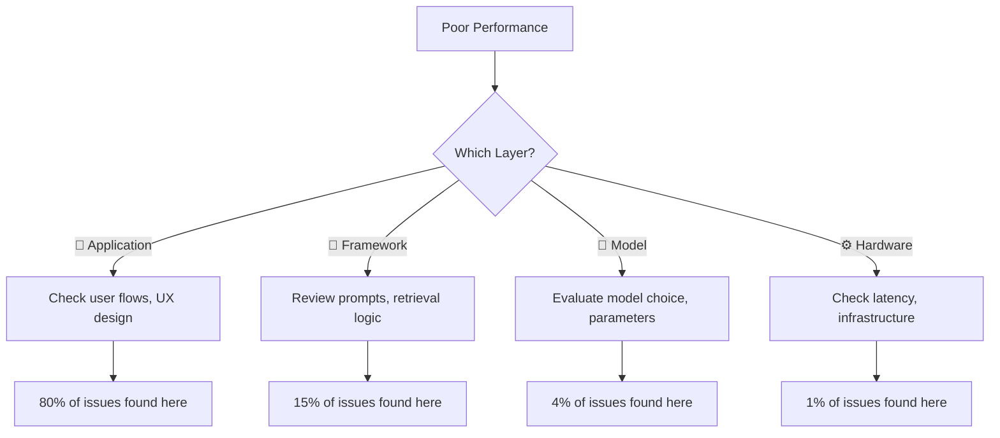
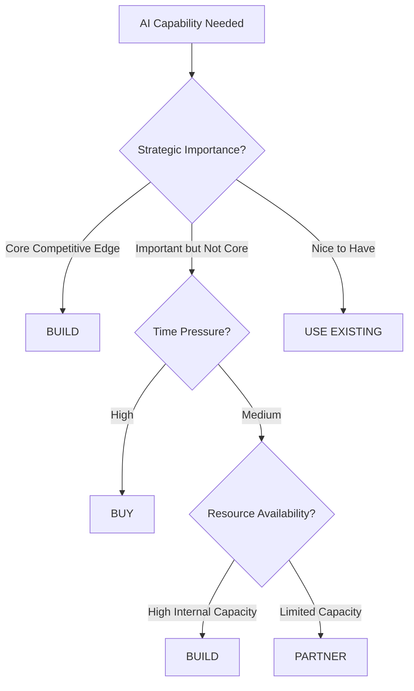
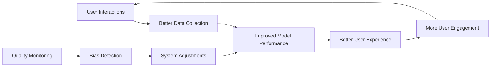
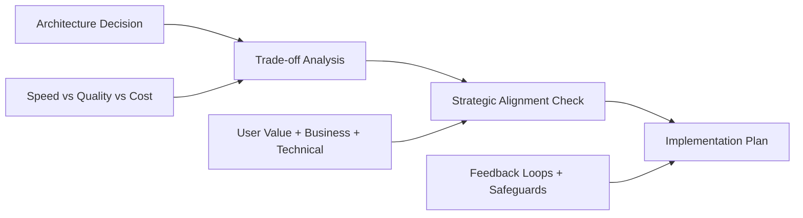

# 🧠 Mental Models for AI Development

> **Your cognitive superpowers for making better AI decisions 10x faster**

---

## 🚀 **Why Mental Models Matter**

Mental models are **thinking frameworks** that compress complex AI decisions into manageable patterns. They help you:

- **⚡ Accelerate decision-making** using proven frameworks
- **🎯 Navigate complexity** without getting overwhelmed  
- **💡 Predict outcomes** in unfamiliar scenarios
- **🗣️ Communicate effectively** across technical and business teams
- **⚠️ Avoid common pitfalls** that derail AI projects

**The Promise**: Master these mental models, and you'll make better AI decisions 10x faster.

---

## 📚 **Quick Navigation**

### 🚦 **Start Here**
- **[📄 One-Page Quick Reference](./mental-models-one-page.md)** - Essential frameworks at a glance
- **[🎯 Decision Scenarios](#decision-scenarios)** - Jump to specific situations
- **[🛠️ Practical Toolkit](#practical-toolkit)** - Templates and exercises

### 🔧 **By Use Case**
- **[🔍 Debugging AI Systems](#debugging-frameworks)** - When things go wrong
- **[🏗️ Architecture Decisions](#architecture-frameworks)** - System design choices
- **[💼 Business Strategy](#business-frameworks)** - ROI, timing, build vs buy
- **[📈 Scaling Systems](#scaling-frameworks)** - Growth and optimization

---

## 🎯 **Core Mental Model Library**

### 🏗️ **System Design & Architecture**

| Mental Model | When to Use | Key Insight |
|--------------|-------------|-------------|
| **[🏗️ Abstraction Ladder](./abstraction-ladder.md)** | Debugging, optimization, communication | Fix problems at the right layer |
| **[⚖️ Trade-off Triangle](./trade-off-triangle.md)** | Resource allocation, performance tuning | You can optimize 2 of 3: Speed, Quality, Cost |
| **[🔄 Feedback Loops](./feedback-loops.md)** | System design, risk management | Design virtuous cycles, prevent dangerous amplification |
| **[📈 Emergence Principle](./emergence-principle.md)** | Complex system behavior | Simple rules create complex behaviors |

### 🧠 **Decision Making & Strategy**

| Mental Model | When to Use | Key Insight |
|--------------|-------------|-------------|
| **[🎯 North Star Principle](./north-star-principle.md)** | Strategic alignment, project planning | Align with User Value + Business Impact + Technical Feasibility |
| **[⚡ 10-10-10 Rule](./10-10-10-rule.md)** | Important decisions, trade-off evaluation | Consider 10min, 10month, 10year impact |
| **[🎯 MVP Filter](./mvp-filter.md)** | Feature prioritization, product development | Find minimum viable approach for maximum learning |
| **[🎯 Goldilocks Principle](./goldilocks-principle.md)** | Optimization, resource allocation | Find the "just right" zone |

### 🔧 **Problem Solving & Analysis**

| Mental Model | When to Use | Key Insight |
|--------------|-------------|-------------|
| **[🔄 Inversion Thinking](./inversion-thinking.md)** | Risk assessment, failure prevention | Solve by considering what could go wrong |
| **[🎯 First Principles Thinking](./first-principles-thinking.md)** | Complex problems, innovation | Break down to fundamental truths |
| **[📊 Signal vs Noise](./signal-vs-noise.md)** | Data analysis, performance evaluation | Distinguish patterns from random variation |
| **[🌊 Compound Growth](./compound-growth.md)** | System optimization, improvement planning | Design systems that improve exponentially |

### 💼 **Business Decision Making**

| Mental Model | When to Use | Key Insight |
|--------------|-------------|-------------|
| **[💰 ROI Matrix](./roi-matrix.md)** | Investment decisions, project justification | Multi-dimensional value analysis |
| **[⚖️ Risk Assessment Triangle](./risk-assessment-triangle.md)** | Project evaluation, risk management | Evaluate technical, business, and market risk |
| **[🔄 Build vs Buy vs Partner](./build-buy-partner-matrix.md)** | Strategic capability decisions | Match approach to strategic importance |
| **[⏰ Market Timing Framework](./market-timing-framework.md)** | Product launches, competitive positioning | Navigate optimal timing decisions |

---

## 🎯 **Decision Scenarios**

### 🔧 **"My AI System Has Poor Performance"**

**❌ Common Approach**: Immediately start fine-tuning the model

**✅ Mental Model Approach**: Use **[Abstraction Ladder](./abstraction-ladder.md)**



**Decision Template**:
1. **Application Layer**: Are users asking answerable questions?
2. **Framework Layer**: Are prompts clear and retrieval working?
3. **Model Layer**: Is the model appropriate for this task?
4. **Hardware Layer**: Is latency affecting experience?

### 🏗️ **"Should We Build, Buy, or Partner for This AI Capability?"**

**Mental Models**: **[Build vs Buy vs Partner](./build-buy-partner-matrix.md)** + **[North Star Principle](./north-star-principle.md)**



**Decision Framework**:

| Use Case | Priority 1 | Priority 2 | Accept Trade-off | Solution |
|----------|------------|------------|------------------|----------|
| **Core Competitive** | Control | Quality | Higher Cost & Time | Build internally |
| **Time-Critical** | Speed | Quality | Higher Cost | Buy premium solution |
| **Resource-Constrained** | Cost | Speed | Lower Quality | Use existing tools |
| **Strategic Partnership** | Shared Risk | Shared Expertise | Shared Control | Partner |

### 📈 **"How Do We Scale Our AI System?"**

**Mental Models**: **[Feedback Loops](./feedback-loops.md)** + **[Trade-off Triangle](./trade-off-triangle.md)**

**Scaling Strategy**:


**Implementation Checklist**:
- ✅ **Positive Loop**: Satisfaction → Usage → Data → Performance
- ✅ **Safeguards**: Bias monitoring, quality checks, circuit breakers
- ✅ **Metrics**: Leading (engagement) + Lagging (satisfaction) indicators
- ✅ **Trade-offs**: Explicit choices on Speed vs Quality vs Cost at scale

---

## 🛠️ **Practical Toolkit**

### 📋 **Pre-Project Checklist**

Before starting any AI project, validate using these mental models:

- [ ] **[North Star Principle](./north-star-principle.md)**: Clear user value + business impact + technical feasibility
- [ ] **[Trade-off Triangle](./trade-off-triangle.md)**: Explicit choices on Speed vs Quality vs Cost
- [ ] **[Risk Assessment Triangle](./risk-assessment-triangle.md)**: Technical + Business + Market risk evaluation
- [ ] **[ROI Matrix](./roi-matrix.md)**: Multi-dimensional value analysis
- [ ] **[Feedback Loops](./feedback-loops.md)**: Designed positive cycles with safeguards

### 🎯 **Decision Templates**

#### **System Architecture Decision Template**
```
PROJECT: [Your AI System]

ABSTRACTION ANALYSIS:
🎨 Application Layer: [User experience issues?]
🔧 Framework Layer: [Integration/orchestration issues?]
🧠 Model Layer: [Performance/accuracy issues?]
⚙️ Hardware Layer: [Infrastructure/cost issues?]

TRADE-OFF ANALYSIS:
Current Priority: Speed/Quality/Cost
Acceptable Trade-offs: [What can we sacrifice?]
Non-negotiables: [What must we maintain?]

RISK ASSESSMENT:
Technical Risk: High/Medium/Low [Key concerns]
Business Risk: High/Medium/Low [Key concerns]
Market Risk: High/Medium/Low [Key concerns]
```

#### **ROI Evaluation Template**
```
DIRECT ROI (Weight: 1.0):
- Cost Savings: $[amount]/year
- Revenue Increase: $[amount]/year
- Efficiency Gains: $[amount]/year
SUBTOTAL: $[X]

INDIRECT ROI (Weight: 0.7):
- User Satisfaction: $[estimated value]/year
- Brand Enhancement: $[estimated value]/year
SUBTOTAL: $[Y] × 0.7 = $[Y × 0.7]

LEARNING VALUE (Weight: 0.5):
- Team Skills: $[estimated value]
- Process Insights: $[estimated value]
SUBTOTAL: $[Z] × 0.5 = $[Z × 0.5]

STRATEGIC VALUE (Weight: 0.3):
- Competitive Advantage: $[estimated value]
- Future Optionality: $[estimated value]
SUBTOTAL: $[W] × 0.3 = $[W × 0.3]

TOTAL ANNUAL VALUE: $[X + Y×0.7 + Z×0.5 + W×0.3]
INVESTMENT REQUIRED: $[Total cost]
PAYBACK PERIOD: [Investment ÷ Annual Value] years
```

### 🔄 **Weekly Review Questions**

Use these mental model-driven questions for ongoing project health:

**System Health** ([Abstraction Ladder](./abstraction-ladder.md)):
- Which layer needs attention this week?
- Are we solving problems at the right level?

**Strategic Alignment** ([North Star Principle](./north-star-principle.md)):
- Are we still aligned with user value + business impact?
- Has our technical feasibility changed?

**Trade-off Validation** ([Trade-off Triangle](./trade-off-triangle.md)):
- Are our Speed/Quality/Cost trade-offs still appropriate?
- Should we adjust based on new information?

**Feedback Loop Health** ([Feedback Loops](./feedback-loops.md)):
- What virtuous/vicious cycles are we seeing?
- Are our safeguards working effectively?

---

## 🚨 **Emergency Decision Matrix**

When you need fast AI decisions under pressure:

| **Crisis Situation** | **First Mental Model** | **Key Question** | **Fast Action** |
|---------------------|----------------------|------------------|------------------|
| 🔥 **System Down** | [Abstraction Ladder](./abstraction-ladder.md) | Which layer is failing? | Debug from application layer down |
| 💸 **Budget Crisis** | [Trade-off Triangle](./trade-off-triangle.md) | What can we sacrifice? | Make explicit quality vs cost choice |
| 🏃‍♂️ **Tight Deadline** | [MVP Filter](./mvp-filter.md) | What's minimum viable? | Cut scope aggressively, maintain quality |
| 📊 **Poor Metrics** | [Signal vs Noise](./signal-vs-noise.md) | Pattern or outlier? | Get more data before major changes |
| 🎯 **Lost Direction** | [North Star Principle](./north-star-principle.md) | What's the user value? | Re-align with core objectives |
| ⚖️ **Technical Debt** | [First Principles](./first-principles-thinking.md) | What are fundamentals? | Question assumptions, rebuild wisely |

---

## 📈 **Advanced Applications**

### 🔍 **Debugging Frameworks**

**Pattern**: System Issues → Mental Model → Systematic Analysis

| **Problem Type** | **Mental Model Chain** | **Investigation Order** |
|------------------|----------------------|-------------------------|
| **Performance Issues** | [Abstraction Ladder](./abstraction-ladder.md) → [Trade-off Triangle](./trade-off-triangle.md) | Layer identification → Resource optimization |
| **User Complaints** | [North Star Principle](./north-star-principle.md) → [Signal vs Noise](./signal-vs-noise.md) | Value alignment → Pattern analysis |
| **Scaling Problems** | [Feedback Loops](./feedback-loops.md) → [Emergence Principle](./emergence-principle.md) | Loop analysis → System behavior |

### 🏗️ **Architecture Frameworks**

**Pattern**: Design Decision → Trade-off Analysis → Strategic Alignment



### 💼 **Business Frameworks**

**Strategic Decision Pipeline**:
1. **[North Star Principle](./north-star-principle.md)**: Is this aligned with our core objectives?
2. **[ROI Matrix](./roi-matrix.md)**: What's the multi-dimensional value?
3. **[Risk Assessment Triangle](./risk-assessment-triangle.md)**: What are the technical/business/market risks?
4. **[Market Timing Framework](./market-timing-framework.md)**: Is this the right time?
5. **[Build vs Buy vs Partner](./build-buy-partner-matrix.md)**: What's the best approach?

### 📈 **Scaling Frameworks**

**Growth Strategy using Mental Models**:

**Phase 1: Foundation** (1-100 users)
- Focus: [MVP Filter](./mvp-filter.md) + [North Star Principle](./north-star-principle.md)
- Priority: Learning and user value validation

**Phase 2: Optimization** (100-10K users)
- Focus: [Trade-off Triangle](./trade-off-triangle.md) + [Feedback Loops](./feedback-loops.md)
- Priority: Reliability and positive user cycles

**Phase 3: Scale** (10K+ users)
- Focus: [Emergence Principle](./emergence-principle.md) + [Compound Growth](./compound-growth.md)
- Priority: System behaviors and exponential improvement

---

## 🧠 **Interdisciplinary Mental Models**

### ⚛️ **Physics-Inspired**
- **[🌊 Resonance Principle](./resonance-principle.md)** - Amplify impact by matching system frequencies
- **[🔄 Phase Transitions](./phase-transitions.md)** - Navigate critical transformation moments
- **[⚖️ Conservation Laws](./conservation-laws.md)** - Apply fundamental conservation principles

### 🧬 **Biology-Inspired**
- **[👑 Red Queen Hypothesis](./red-queen-hypothesis.md)** - Continuous improvement to maintain position
- **[🤝 Symbiosis Framework](./symbiosis-framework.md)** - Design mutually beneficial relationships

### 🧠 **Psychology-Inspired**
- **[🌊 Flow State Optimization](./flow-state-optimization.md)** - Create optimal performance conditions
- **[🧠 Cognitive Load Theory](./cognitive-load-theory.md)** - Work WITH human cognitive limits
- **[🏔️ Peak-End Rule](./peak-end-rule.md)** - Create memorable experiences

### 💰 **Economics-Inspired**
- **[🌐 Network Effects](./network-effects.md)** - Value increases exponentially with users
- **[📊 Pareto Principle](./pareto-principle.md)** - Focus on the 20% that creates 80% value
- **[🎯 Game Theory Matrix](./game-theory-matrix.md)** - Navigate strategic interactions

### ⚔️ **Strategy-Inspired**
- **[🎯 OODA Loop](./ooda-loop.md)** - Faster decision cycles: Observe, Orient, Decide, Act
- **[⚡ Force Multipliers](./force-multipliers.md)** - Tools that amplify team effectiveness

### 🗣️ **Communication-Inspired**
- **[🔄 Shannon-Weaver Model](./shannon-weaver-model.md)** - Optimize information transfer
- **[🧭 Framing Effect](./framing-effect.md)** - How presentation influences decisions
- **[🧠 Cooperative Principle](./cooperative-principle.md)** - Conversational maxims for AI

---

## 🎓 **Learning Pathways**

### 🥉 **Beginner Path** (Week 1-2)
**Goal**: Master core AI decision-making

1. **[🏗️ Abstraction Ladder](./abstraction-ladder.md)** - Debug any AI system
2. **[⚖️ Trade-off Triangle](./trade-off-triangle.md)** - Make explicit optimization choices
3. **[🎯 North Star Principle](./north-star-principle.md)** - Align all decisions

**Practice**: Apply to one current AI project

### 🥈 **Intermediate Path** (Week 3-4)
**Goal**: Strategic AI decision-making

4. **[🔄 Feedback Loops](./feedback-loops.md)** - Design self-improving systems
5. **[💰 ROI Matrix](./roi-matrix.md)** - Multi-dimensional value analysis
6. **[🔄 Build vs Buy vs Partner](./build-buy-partner-matrix.md)** - Strategic capability decisions

**Practice**: Complete ROI analysis for major AI initiative

### 🥇 **Advanced Path** (Month 2+)
**Goal**: Master complex AI strategy

7. **[📈 Emergence Principle](./emergence-principle.md)** - Understand complex system behaviors
8. **[⏰ Market Timing Framework](./market-timing-framework.md)** - Strategic timing decisions
9. **[🔄 Inversion Thinking](./inversion-thinking.md)** - Advanced problem-solving

**Practice**: Design comprehensive AI strategy using multiple mental models

### 🏆 **Expert Path** (Ongoing)
**Goal**: Interdisciplinary mastery

- Choose 3-5 interdisciplinary models that resonate with your domain
- Practice combining multiple mental models for complex decisions
- Develop your own decision frameworks using these foundations

---

## 📊 **Success Indicators**

**You're Successfully Using Mental Models When**:

✅ **Decision Speed**: Choices become faster and more confident  
✅ **Team Alignment**: Discussions focus on fundamental trade-offs  
✅ **Problem Resolution**: Issues get solved at the right abstraction level  
✅ **System Improvement**: Consistent progress through designed feedback loops  
✅ **Strategic Clarity**: Direction becomes clearer across teams  
✅ **Reduced Debt**: Technical debt decreases through principled decisions

**Common Warning Signs**:

⚠️ **Layer Confusion**: Solving model problems with UX fixes  
⚠️ **Optimization Tunneling**: Focusing on one metric, ignoring others  
⚠️ **Feedback Blindness**: Missing dangerous amplification loops  
⚠️ **False Trade-offs**: Believing you can optimize all three simultaneously  
⚠️ **North Star Drift**: Losing sight of core user value

---

## 🚀 **Quick Start Guide**

### **Today** (15 minutes)
1. **Bookmark** the [One-Page Reference](./mental-models-one-page.md)
2. **Choose** one current AI decision you're facing
3. **Apply** the [Abstraction Ladder](./abstraction-ladder.md) or [Trade-off Triangle](./trade-off-triangle.md)

### **This Week** (1 hour)
1. **Complete** the [Pre-Project Checklist](#pre-project-checklist) for your main AI project
2. **Use** the [Decision Template](#decision-templates) for one major choice
3. **Share** mental model vocabulary with your team

### **This Month** (2-3 hours)
1. **Master** the 3 core models: Abstraction Ladder, Trade-off Triangle, North Star Principle
2. **Apply** the [ROI Evaluation Template](#roi-evaluation-template) to a business decision
3. **Establish** weekly reviews using mental model questions

### **Ongoing** (10 minutes weekly)
1. **Review** using [Weekly Review Questions](#weekly-review-questions)
2. **Track** which mental models help most in your context
3. **Expand** your toolkit based on the problems you encounter most

---

## 💡 **Key Takeaways**

### **🎯 The Mental Model Mindset**

Mental models aren't rigid rules—they're **thinking accelerators** that help you:
- **Compress complexity** into manageable patterns
- **Predict outcomes** using proven frameworks  
- **Communicate clearly** across expertise levels
- **Avoid pitfalls** that commonly derail projects

### **🔄 The Compound Effect**

Just like AI systems, mental model mastery compounds:
- **Week 1**: Make one decision 2x faster
- **Month 1**: Team decisions become more aligned  
- **Quarter 1**: Strategic clarity across all AI initiatives
- **Year 1**: Organizational AI decision-making capability

### **🌟 Remember**

> *"The best mental model is the one you actually use when it matters most."*

Your goal isn't to memorize all mental models—it's to build **better thinking patterns** that help you navigate AI complexity more effectively.

---

## 🔗 **Related Resources**

### **Within This Knowledge Base**
- **[AI Agents Hub](../../concepts/ai-agents.md)** - Apply mental models to agent development
- **[Best Practices Guide](../../guides/best-practices.md)** - Implementation patterns
- **[Tools & Frameworks](../../tools/README.md)** - Technical implementation resources

### **External Learning**
- **[Poor Charlie's Almanack](https://en.wikipedia.org/wiki/Charlie_Munger)** - Charlie Munger's mental models
- **[Thinking, Fast and Slow](https://en.wikipedia.org/wiki/Thinking,_Fast_and_Slow)** - Cognitive biases and decision-making
- **[The Art of Problem Solving](https://artofproblemsolving.com/)** - Mathematical thinking patterns

---

## 📝 **Contribute & Improve**

**Found a mental model particularly useful?** 
- Share your experience and real-world applications
- Suggest new decision templates or frameworks
- Contribute examples from your AI projects

**Mental models evolve through use** - help improve this resource by sharing what works best in your context.

---

*Last updated: July 12, 2025*  
*Mental models are living frameworks - they improve through practice and real-world application.*
