# 🏗️ The Abstraction Ladder

> **Master complex AI systems by understanding their hierarchical architecture and solving problems at the optimal layer**

## 🎯 **What It Is**

The Abstraction Ladder is a foundational mental model that reveals how every AI system operates across multiple layers of abstraction, each with distinct responsibilities, failure modes, and optimization strategies. This framework helps you navigate complex AI architectures systematically, solve problems at the appropriate level, and communicate effectively across technical and business stakeholders.

**Core Insight**: 80% of AI issues occur at the Application Layer, yet teams often jump straight to Model Layer solutions, wasting time and resources on the wrong abstraction level. Understanding this hierarchy prevents solution mismatches and accelerates problem resolution.

## 🧠 **The Science Behind Layered Abstraction**

The Abstraction Ladder is grounded in decades of systems engineering research and distributed computing theory:

**Systems Engineering Foundation:**
- **Hierarchical decomposition theory** shows that complex systems are best understood through layered models
- **Fault propagation research** demonstrates that failures cascade both up and down abstraction layers
- **Optimization theory** proves that local optimization at wrong layers can create global sub-optimization
- **Communication research** shows that abstraction levels directly correlate with stakeholder understanding

**Cognitive Science Support:**
- **Cognitive load theory** demonstrates that humans process layered information more effectively
- **Expert performance studies** reveal that domain experts naturally think in abstraction hierarchies
- **Problem-solving research** shows that matching problem complexity to appropriate abstraction level improves solution quality

**AI-Specific Research:**
- **Machine learning pipeline studies** confirm that most performance issues originate at data and application layers
- **MLOps research** demonstrates that deployment failures primarily occur at integration and infrastructure layers
- **Human-AI interaction studies** show that user experience problems dominate AI system failures

## 🏗️ **The Four-Layer Architecture**

```mermaid
graph TD
    A["🎨 Application Layer<br/>User Experience & Business Logic<br/>80% of Issues"] --> B["🔧 Framework Layer<br/>Integration & Orchestration<br/>15% of Issues"]
    B --> C["🧠 Model Layer<br/>AI/ML Processing<br/>4% of Issues"]
    C --> D["⚙️ Hardware Layer<br/>Infrastructure & Compute<br/>1% of Issues"]
    
    E[User Problems] --> A
    F[Integration Issues] --> B
    G[Performance Issues] --> C
    H[Resource Constraints] --> D
    
    I[Business Stakeholders] --> A
    J[Product Teams] --> B
    K[Data Scientists] --> C
    L[DevOps Teams] --> D
```



### **🎨 Application Layer** (User Experience Domain)

**Definition**: The visible interface and business logic layer that users interact with directly.

**Primary Responsibilities:**
- User interface design and user experience optimization
- Business logic implementation and workflow design
- User onboarding, education, and support systems
- Value proposition communication and feature discovery
- User feedback collection and behavior analysis

**Common Issues (80% of AI problems):**
- Users don't understand how to interact effectively with AI systems
- Poor prompt engineering from user side (unclear questions, wrong expectations)
- Value proposition confusion (users don't understand AI capabilities/limitations)
- Workflow integration problems (AI doesn't fit natural user processes)
- Onboarding failures (users abandon before seeing value)

**Key Metrics:**
- User adoption rates and feature utilization
- Task completion rates and user satisfaction scores
- Time-to-value and user retention metrics
- Support ticket volume and resolution efficiency
- User-generated content quality (prompts, feedback)

**Tools & Technologies:**
- Frontend frameworks (React, Vue, Angular)
- UX/UI design tools (Figma, Sketch, Adobe XD)
- Analytics platforms (Google Analytics, Mixpanel, Amplitude)
- User testing tools (Hotjar, UserTesting, Maze)
- A/B testing platforms (Optimizely, LaunchDarkly)

**Example Optimization:**
```python
# Application Layer Enhancement Example
class UserExperienceOptimization:
    def improve_prompt_quality(self):
        return {
            "guided_prompting": "Provide templates and examples",
            "contextual_hints": "Show relevant suggestions based on user intent",
            "progressive_disclosure": "Gradually introduce advanced features",
            "feedback_loops": "Show users how to improve their inputs"
        }
    
    def enhance_onboarding(self):
        return {
            "interactive_tutorials": "Hands-on guided experiences",
            "use_case_templates": "Pre-built scenarios for quick value",
            "success_metrics": "Clear progress indicators and achievements",
            "personalization": "Adapt experience to user role and expertise"
        }
```

### **🔧 Framework Layer** (Integration & Orchestration Domain)

**Definition**: The middleware layer that orchestrates AI models, manages data flow, and integrates different system components.

**Primary Responsibilities:**
- AI model orchestration and pipeline management
- Data preprocessing, transformation, and routing
- API design, integration, and service coordination
- Prompt engineering and template management
- Error handling, fallback mechanisms, and system resilience

**Common Issues (15% of AI problems):**
- Poor prompt engineering at system level (inadequate templates, missing context)
- Inefficient data pipelines causing latency or quality issues
- Integration failures between AI services and existing systems
- Inadequate error handling leading to poor user experiences
- Scaling bottlenecks in orchestration layer

**Key Metrics:**
- API response times and throughput rates
- Data pipeline reliability and processing efficiency
- Integration success rates and error frequencies
- Model orchestration effectiveness and resource utilization
- System resilience under load and failure conditions

**Tools & Technologies:**
- AI orchestration frameworks (LangChain, LlamaIndex, Haystack)
- Workflow engines (Apache Airflow, Prefect, Temporal)
- API gateways (Kong, AWS API Gateway, Istio)
- Message queues (Redis, RabbitMQ, Apache Kafka)
- Monitoring and observability (Datadog, Grafana, Prometheus)

**Advanced Framework Patterns:**
```python
# Framework Layer Orchestration Example
class AISystemOrchestration:
    def __init__(self):
        self.prompt_templates = self.load_optimized_templates()
        self.fallback_strategies = self.configure_resilience()
        self.monitoring = self.setup_observability()
    
    def process_user_request(self, user_input):
        # Multi-stage processing pipeline
        pipeline = [
            self.input_validation_stage,
            self.context_enrichment_stage,
            self.model_selection_stage,
            self.prompt_optimization_stage,
            self.result_post_processing_stage,
            self.quality_assessment_stage
        ]
        
        result = user_input
        for stage in pipeline:
            try:
                result = stage(result)
                self.log_stage_metrics(stage.__name__, result)
            except Exception as e:
                return self.handle_failure(e, stage, result)
        
        return result
    
    def handle_failure(self, error, failed_stage, partial_result):
        # Intelligent fallback based on failure point
        fallback_strategies = {
            "model_selection_stage": self.use_simpler_model,
            "prompt_optimization_stage": self.use_default_prompt,
            "result_post_processing_stage": self.return_raw_result
        }
        
        return fallback_strategies.get(failed_stage.__name__, 
                                     self.graceful_degradation)(partial_result)
```

### **🧠 Model Layer** (AI/ML Processing Domain)

**Definition**: The core artificial intelligence and machine learning components that process data and generate intelligent outputs.

**Primary Responsibilities:**
- Model selection, configuration, and performance optimization
- Training data management and model fine-tuning
- Inference optimization and accuracy improvement
- Bias detection, mitigation, and fairness assurance
- Model versioning, validation, and A/B testing

**Common Issues (4% of AI problems):**
- Model selection mismatches (wrong model for specific task requirements)
- Training data quality issues (bias, incompleteness, distribution shifts)
- Performance degradation over time (model drift, data staleness)
- Accuracy limitations for edge cases or domain-specific scenarios
- Resource-intensive inference impacting system performance

**Key Metrics:**
- Model accuracy, precision, recall, and F1 scores
- Inference latency and computational efficiency
- Model drift detection and adaptation rates
- Bias metrics and fairness assessments
- A/B testing results and performance comparisons

**Tools & Technologies:**
- Model frameworks (Transformers, PyTorch, TensorFlow, JAX)
- Model serving platforms (Triton, TorchServe, MLflow)
- Training platforms (Weights & Biases, Neptune, ClearML)
- Model monitoring (Evidently, Fiddler, Arthur)
- Fine-tuning tools (LoRA, QLoRA, Parameter-Efficient Fine-tuning)

**Model Optimization Framework:**
```python
# Model Layer Enhancement Example
class ModelPerformanceOptimization:
    def __init__(self):
        self.model_registry = self.initialize_model_versions()
        self.evaluation_suite = self.setup_comprehensive_testing()
        self.monitoring_system = self.configure_drift_detection()
    
    def optimize_model_selection(self, task_requirements):
        candidates = self.get_candidate_models(task_requirements)
        evaluation_results = {}
        
        for model in candidates:
            evaluation_results[model] = {
                "accuracy": self.evaluate_accuracy(model, task_requirements),
                "latency": self.measure_inference_speed(model),
                "resource_usage": self.assess_computational_cost(model),
                "bias_metrics": self.evaluate_fairness(model),
                "edge_case_performance": self.test_robustness(model)
            }
        
        return self.select_optimal_model(evaluation_results, task_requirements)
    
    def continuous_model_improvement(self):
        return {
            "drift_monitoring": "Detect when model performance degrades",
            "incremental_learning": "Update models with new data continuously",
            "ensemble_methods": "Combine multiple models for better performance",
            "active_learning": "Identify and request labels for most valuable data",
            "federated_learning": "Learn from distributed data while preserving privacy"
        }
```

### **⚙️ Hardware Layer** (Infrastructure & Compute Domain)

**Definition**: The physical and virtual infrastructure that provides computational resources for AI system execution.

**Primary Responsibilities:**
- Compute resource provisioning and optimization
- Hardware acceleration and GPU utilization
- Infrastructure scaling and load balancing
- Cost optimization and resource efficiency
- Performance monitoring and capacity planning

**Common Issues (1% of AI problems):**
- Resource constraints causing system timeouts or failures
- Inefficient hardware utilization leading to unnecessary costs
- Scaling bottlenecks during peak usage periods
- Infrastructure reliability issues affecting system availability
- Cost optimization challenges with expensive GPU resources

**Key Metrics:**
- Hardware utilization rates (CPU, GPU, memory)
- Infrastructure costs and cost-per-inference
- System availability and uptime percentages
- Scaling responsiveness and auto-scaling efficiency
- Energy consumption and sustainability metrics

**Tools & Technologies:**
- Cloud platforms (AWS, GCP, Azure, Lambda Labs)
- Container orchestration (Kubernetes, Docker Swarm)
- Infrastructure as code (Terraform, CloudFormation, Pulumi)
- Monitoring and alerting (Prometheus, Grafana, CloudWatch)
- Cost optimization tools (Spot instances, preemptible VMs, serverless)

## 🎯 **When to Use the Abstraction Ladder**

### **🔍 Strategic Problem Diagnosis**

**The 80-15-4-1 Rule for Issue Investigation:**
```python
def diagnose_ai_system_issue(problem_description):
    investigation_order = [
        ("application_layer", 0.80, "User experience and business logic"),
        ("framework_layer", 0.15, "Integration and orchestration"),
        ("model_layer", 0.04, "AI/ML performance and accuracy"),
        ("hardware_layer", 0.01, "Infrastructure and compute resources")
    ]
    
    # Always start with highest probability layer
    for layer, probability, description in investigation_order:
        if investigate_layer(layer, problem_description):
            return f"Issue found at {layer}: {description}"
    
    return "Multi-layer issue requiring comprehensive analysis"
```

**Diagnostic Decision Tree:**
- **User Complaints**: Start at Application Layer (UX, onboarding, value prop)
- **Performance Issues**: Check Framework Layer first (orchestration, APIs)
- **Accuracy Problems**: Investigate Model Layer (training, selection, bias)
- **Scale/Cost Issues**: Examine Hardware Layer (resources, infrastructure)

### **📈 Optimization Strategy Planning**

**Layer-Specific Optimization Approaches:**
```
Application Layer Optimization:
→ Focus: User experience and adoption
→ ROI: High (directly impacts user satisfaction)
→ Time: Days to weeks
→ Skills: UX design, product management

Framework Layer Optimization:
→ Focus: System efficiency and integration
→ ROI: Medium-High (improves system performance)
→ Time: Weeks to months
→ Skills: Software architecture, DevOps

Model Layer Optimization:
→ Focus: AI accuracy and capabilities
→ ROI: Medium (requires user adoption to matter)
→ Time: Months to quarters
→ Skills: Data science, machine learning

Hardware Layer Optimization:
→ Focus: Cost and performance efficiency
→ ROI: Low-Medium (enables other optimizations)
→ Time: Days to weeks
→ Skills: Infrastructure, cloud engineering
```

### **💬 Communication and Stakeholder Alignment**

**Abstraction-Matched Communication Strategy:**
```python
def tailor_communication(audience, technical_depth):
    communication_strategies = {
        "executives": {
            "layer_focus": "application_layer",
            "metrics": ["user_adoption", "business_value", "roi"],
            "language": "business_outcomes_and_user_impact",
            "detail_level": "high_level_strategy_and_results"
        },
        
        "product_managers": {
            "layer_focus": "application_and_framework_layers",
            "metrics": ["user_satisfaction", "feature_usage", "integration_success"],
            "language": "user_stories_and_system_flows",
            "detail_level": "tactical_implementation_and_metrics"
        },
        
        "engineers": {
            "layer_focus": "framework_and_model_layers",
            "metrics": ["system_performance", "api_reliability", "model_accuracy"],
            "language": "technical_architecture_and_implementation",
            "detail_level": "detailed_technical_specifications"
        },
        
        "data_scientists": {
            "layer_focus": "model_layer",
            "metrics": ["model_performance", "data_quality", "inference_metrics"],
            "language": "algorithms_and_statistical_analysis",
            "detail_level": "deep_technical_and_mathematical"
        },
        
        "infrastructure_teams": {
            "layer_focus": "hardware_layer",
            "metrics": ["resource_utilization", "cost_efficiency", "system_reliability"],
            "language": "infrastructure_and_operational_concerns",
            "detail_level": "implementation_and_monitoring_specifics"
        }
    }
    
    return communication_strategies.get(audience, "general_technical_overview")
```

## 🚀 **Advanced Applications and Case Studies**

### **Example 1: Enterprise AI Chatbot Optimization**

**Initial Problem**: "Our enterprise AI chatbot has poor user satisfaction scores"

**❌ Common Mistake**: Immediately upgrade to latest GPT model or fine-tune existing model

**✅ Abstraction Ladder Approach**:

**Phase 1: Application Layer Investigation (80% probability)**
```python
class ApplicationLayerAnalysis:
    def diagnose_user_experience_issues(self):
        findings = {
            "user_onboarding": {
                "issue": "Users don't understand chatbot capabilities",
                "evidence": "90% of first interactions are generic 'help me' requests",
                "solution": "Implement guided onboarding with example use cases"
            },
            
            "prompt_quality": {
                "issue": "Users ask vague, unfocused questions",
                "evidence": "Average query length is 4 words, lacks context",
                "solution": "Provide prompt templates and smart suggestions"
            },
            
            "value_proposition": {
                "issue": "Users unclear on when to use chatbot vs other tools",
                "evidence": "High abandonment rate after first response",
                "solution": "Clear positioning and capability communication"
            }
        }
        
        return findings
    
    def implement_application_fixes(self):
        improvements = {
            "guided_onboarding": "Interactive tutorial showing effective queries",
            "smart_prompting": "Context-aware suggestions and templates",
            "progress_indicators": "Show users they're getting better responses",
            "use_case_gallery": "Showcase successful interaction patterns"
        }
        
        expected_impact = "70% improvement in user satisfaction within 2 weeks"
        return improvements, expected_impact
```

**Phase 2: Framework Layer (if application fixes insufficient)**
```python
class FrameworkLayerOptimization:
    def optimize_response_generation(self):
        return {
            "prompt_engineering": "Implement chain-of-thought prompting",
            "context_management": "Better conversation history handling",
            "response_formatting": "Structured, scannable response format",
            "fallback_mechanisms": "Graceful degradation for edge cases"
        }
    
    def improve_integration_efficiency(self):
        return {
            "caching_strategy": "Cache common responses for speed",
            "async_processing": "Non-blocking response generation",
            "load_balancing": "Distribute requests across model instances",
            "error_handling": "Intelligent retry and fallback logic"
        }
```

**Result**: 85% improvement in user satisfaction through primarily application-layer optimizations, with minimal model changes.

### **Example 2: Computer Vision System Scaling**

**Challenge**: Image recognition system failing under increased load

**Layer-by-Layer Solution Design**:

**Hardware Layer Foundation**:
```python
class InfrastructureScaling:
    def design_scalable_architecture(self):
        return {
            "auto_scaling_groups": "Dynamic GPU allocation based on demand",
            "edge_computing": "Distribute processing closer to users",
            "caching_layers": "Cache frequently processed image types",
            "cost_optimization": "Mix of spot instances and reserved capacity"
        }
    
    def implement_monitoring(self):
        return {
            "real_time_metrics": "GPU utilization, inference latency, queue depth",
            "predictive_scaling": "ML-based demand forecasting",
            "cost_tracking": "Per-request cost analysis and optimization",
            "alert_systems": "Proactive issue detection and response"
        }
```

**Model Layer Optimization**:
```python
class ModelEfficiencyImprovement:
    def optimize_inference_pipeline(self):
        return {
            "model_quantization": "Reduce model size while preserving accuracy",
            "batch_processing": "Process multiple images simultaneously",
            "early_exit_strategies": "Skip expensive processing for easy cases",
            "model_pruning": "Remove unnecessary neural network connections"
        }
    
    def implement_model_ensemble(self):
        return {
            "lightweight_screening": "Fast model for initial classification",
            "specialized_models": "Dedicated models for complex cases",
            "confidence_routing": "Route to appropriate model based on complexity",
            "result_validation": "Cross-validation between multiple models"
        }
```

**Framework Layer Coordination**:
```python
class ProcessingOrchestration:
    def design_intelligent_routing(self):
        return {
            "request_prioritization": "VIP users get faster processing",
            "complexity_assessment": "Route simple vs complex images differently",
            "load_balancing": "Distribute across available model instances",
            "result_caching": "Store and reuse results for similar images"
        }
    
    def implement_quality_assurance(self):
        return {
            "confidence_scoring": "Provide accuracy estimates with results",
            "human_in_the_loop": "Escalate uncertain cases to human review",
            "continuous_learning": "Improve models based on user feedback",
            "A/B_testing": "Compare different processing approaches"
        }
```

**Application Layer Enhancement**:
```python
class UserExperienceOptimization:
    def improve_user_workflow(self):
        return {
            "progress_indicators": "Show processing status and estimated time",
            "batch_upload": "Allow multiple image processing",
            "result_visualization": "Interactive result exploration",
            "feedback_collection": "Gather user input on result quality"
        }
    
    def add_intelligent_features(self):
        return {
            "smart_suggestions": "Recommend optimal image formats/sizes",
            "usage_analytics": "Help users understand and improve their patterns",
            "integration_apis": "Easy integration with user workflows",
            "mobile_optimization": "Responsive design for mobile usage"
        }
```

## 🔧 **Implementation Toolkit and Best Practices**

### **🎯 Abstraction Layer Assessment Framework**

**Rapid Diagnostic Checklist**:
```python
def perform_abstraction_layer_audit(ai_system):
    audit_results = {}
    
    # Application Layer Health Check
    audit_results["application"] = {
        "user_satisfaction": measure_user_satisfaction_scores(),
        "adoption_rate": calculate_feature_adoption_rates(),
        "support_tickets": analyze_user_support_patterns(),
        "onboarding_success": measure_user_onboarding_completion(),
        "value_realization": assess_time_to_value_metrics()
    }
    
    # Framework Layer Assessment
    audit_results["framework"] = {
        "api_performance": measure_response_times_and_reliability(),
        "integration_health": assess_system_integration_success(),
        "orchestration_efficiency": analyze_workflow_performance(),
        "error_handling": evaluate_system_resilience(),
        "data_flow_optimization": assess_pipeline_efficiency()
    }
    
    # Model Layer Evaluation
    audit_results["model"] = {
        "accuracy_metrics": evaluate_model_performance_across_tasks(),
        "bias_assessment": perform_fairness_and_bias_audits(),
        "drift_detection": monitor_model_performance_degradation(),
        "resource_efficiency": measure_inference_cost_and_speed(),
        "capability_coverage": assess_model_scope_and_limitations()
    }
    
    # Hardware Layer Analysis
    audit_results["hardware"] = {
        "resource_utilization": monitor_compute_resource_efficiency(),
        "cost_optimization": analyze_infrastructure_cost_effectiveness(),
        "scaling_performance": evaluate_auto_scaling_responsiveness(),
        "reliability_metrics": assess_system_uptime_and_availability(),
        "capacity_planning": forecast_future_resource_needs()
    }
    
    return generate_prioritized_improvement_recommendations(audit_results)
```

### **🔄 Cross-Layer Optimization Strategies**

**Holistic System Improvement Framework**:
```python
class CrossLayerOptimization:
    def __init__(self):
        self.optimization_matrix = self.build_optimization_dependencies()
        self.impact_calculator = self.initialize_impact_assessment()
    
    def optimize_entire_system(self, current_state, target_objectives):
        optimization_plan = []
        
        # Phase 1: Foundation Layer Optimization
        if self.needs_infrastructure_improvement(current_state):
            optimization_plan.append({
                "phase": "infrastructure_foundation",
                "layers": ["hardware"],
                "timeline": "1-2 weeks",
                "focus": "Ensure stable, scalable infrastructure",
                "success_criteria": ["99.9% uptime", "auto-scaling responsiveness"]
            })
        
        # Phase 2: Model Performance Optimization
        if self.needs_model_improvement(current_state):
            optimization_plan.append({
                "phase": "model_performance",
                "layers": ["model", "framework"],
                "timeline": "4-8 weeks",
                "focus": "Improve AI accuracy and efficiency",
                "success_criteria": ["accuracy targets", "inference speed"]
            })
        
        # Phase 3: Integration and Orchestration
        if self.needs_framework_improvement(current_state):
            optimization_plan.append({
                "phase": "system_integration",
                "layers": ["framework"],
                "timeline": "2-4 weeks",
                "focus": "Optimize data flow and service coordination",
                "success_criteria": ["API reliability", "workflow efficiency"]
            })
        
        # Phase 4: User Experience Enhancement
        optimization_plan.append({
            "phase": "user_experience",
            "layers": ["application"],
            "timeline": "1-3 weeks",
            "focus": "Maximize user adoption and satisfaction",
            "success_criteria": ["user satisfaction", "adoption rates"]
        })
        
        return self.sequence_optimization_phases(optimization_plan, target_objectives)
    
    def calculate_optimization_roi(self, proposed_changes):
        roi_analysis = {}
        
        for layer, changes in proposed_changes.items():
            roi_analysis[layer] = {
                "investment_required": self.estimate_implementation_cost(changes),
                "expected_benefits": self.project_improvement_benefits(changes),
                "risk_factors": self.assess_implementation_risks(changes),
                "timeline_to_value": self.estimate_time_to_benefits(changes)
            }
        
        return self.rank_optimizations_by_roi(roi_analysis)
```

## 🎯 **Advanced Mastery and Specialized Applications**

### **🚀 Domain-Specific Abstraction Patterns**

**Healthcare AI Systems**:
```python
class HealthcareAIAbstraction:
    def __init__(self):
        self.healthcare_layers = {
            "clinical_workflow": "Integration with hospital systems and provider workflows",
            "regulatory_compliance": "HIPAA, FDA, and safety requirement compliance",
            "medical_ai_models": "Diagnostic algorithms and clinical decision support",
            "healthcare_infrastructure": "Secure, compliant compute and data storage"
        }
    
    def optimize_for_healthcare(self):
        return {
            "patient_safety_first": "All optimizations must prioritize patient outcomes",
            "regulatory_approval": "Changes must maintain compliance certifications",
            "clinical_integration": "Seamless workflow integration is critical",
            "audit_trails": "Complete traceability of all decisions and changes"
        }
```

**Financial Services AI**:
```python
class FinancialAIAbstraction:
    def __init__(self):
        self.financial_layers = {
            "customer_experience": "Trading platforms, advice systems, mobile apps",
            "risk_management": "Fraud detection, credit scoring, regulatory reporting",
            "algorithmic_trading": "High-frequency trading and portfolio optimization",
            "secure_infrastructure": "Financial-grade security and compliance systems"
        }
    
    def optimize_for_finance(self):
        return {
            "regulatory_compliance": "SOX, Basel III, GDPR compliance requirements",
            "low_latency_critical": "Microsecond response times for trading systems",
            "security_paramount": "Zero-trust architecture and data protection",
            "audit_requirements": "Complete transaction and decision traceability"
        }
```

### **📊 Measurement and Continuous Improvement**

**Abstraction Layer KPI Framework**:
```python
class AbstractionLayerMetrics:
    def __init__(self):
        self.layer_kpis = self.define_layer_specific_metrics()
        self.cross_layer_indicators = self.setup_system_health_metrics()
    
    def track_application_layer_health(self):
        return {
            "user_engagement": {
                "daily_active_users": "Number of unique users per day",
                "session_duration": "Average time spent in AI-powered sessions",
                "feature_adoption": "Percentage of users using key AI features",
                "user_satisfaction": "NPS scores and satisfaction surveys"
            },
            
            "business_value": {
                "task_completion_rate": "Percentage of user tasks successfully completed",
                "time_to_value": "How quickly users achieve their goals",
                "user_retention": "Monthly and quarterly user retention rates",
                "support_ticket_reduction": "Decrease in user support needs"
            }
        }
    
    def track_framework_layer_performance(self):
        return {
            "system_efficiency": {
                "api_response_times": "P50, P95, P99 latency measurements",
                "throughput_capacity": "Requests processed per second",
                "error_rates": "API failure and timeout percentages",
                "integration_reliability": "Success rates for external system calls"
            },
            
            "operational_excellence": {
                "deployment_frequency": "How often new features are released",
                "mean_time_to_recovery": "Average time to resolve system issues",
                "change_failure_rate": "Percentage of deployments causing problems",
                "monitoring_coverage": "Percentage of system components monitored"
            }
        }
    
    def track_model_layer_effectiveness(self):
        return {
            "ai_performance": {
                "accuracy_metrics": "Precision, recall, F1 scores across use cases",
                "model_drift": "Performance degradation over time",
                "bias_metrics": "Fairness across different user demographics",
                "inference_efficiency": "Cost and speed of model predictions"
            },
            
            "model_operations": {
                "model_version_success": "Performance of different model versions",
                "training_pipeline_reliability": "Success rate of model retraining",
                "data_quality_scores": "Training data completeness and accuracy",
                "a_b_test_results": "Comparative performance of model variants"
            }
        }
    
    def track_hardware_layer_optimization(self):
        return {
            "resource_utilization": {
                "compute_efficiency": "CPU/GPU utilization percentages",
                "memory_optimization": "RAM and storage utilization patterns",
                "network_performance": "Bandwidth utilization and latency",
                "cost_per_inference": "Infrastructure cost per AI prediction"
            },
            
            "scalability_metrics": {
                "auto_scaling_responsiveness": "Time to scale up/down resources",
                "load_handling_capacity": "Maximum sustainable request volume",
                "geographic_distribution": "Response times across different regions",
                "disaster_recovery_readiness": "Backup and failover capabilities"
            }
        }
```

## 🔗 **Integration with Complementary Mental Models**

### **🧠 Synergistic Framework Applications**

**Combined with [[Trade-off Triangle]]**:
```python
def integrate_abstraction_with_tradeoffs(optimization_goals):
    abstraction_tradeoff_matrix = {
        "application_layer": {
            "speed_vs_quality": "Fast UX vs comprehensive features",
            "quality_vs_cost": "Premium experience vs development resources",
            "speed_vs_cost": "Rapid deployment vs thorough testing"
        },
        
        "framework_layer": {
            "speed_vs_quality": "Fast integration vs robust error handling",
            "quality_vs_cost": "Enterprise-grade vs rapid prototyping",
            "speed_vs_cost": "Quick deployment vs infrastructure investment"
        },
        
        "model_layer": {
            "speed_vs_quality": "Fast inference vs high accuracy",
            "quality_vs_cost": "State-of-art models vs budget constraints",
            "speed_vs_cost": "Real-time processing vs compute expenses"
        },
        
        "hardware_layer": {
            "speed_vs_quality": "Low latency vs high availability",
            "quality_vs_cost": "Premium infrastructure vs cost optimization",
            "speed_vs_cost": "Instant scaling vs reserved capacity savings"
        }
    }
    
    return optimize_across_layers_and_tradeoffs(abstraction_tradeoff_matrix, optimization_goals)
```

**Combined with [[Systems Thinking]]**:
- **Feedback Loops**: How changes at one layer affect others
- **Emergence**: System behaviors that arise from layer interactions
- **Constraints**: How limitations in one layer constrain the entire system

**Combined with [[First Principles Thinking]]**:
- **Layer Fundamentals**: What is the essential purpose of each layer?
- **Assumption Challenges**: Are we solving problems at the right layer?
- **Rebuild Strategy**: How would we design this system from scratch?

## 🏆 **Mastery Development Path**

### **Level 1: Basic Abstraction Awareness** (Weeks 1-4)
- **Skill**: Identify which layer contains a given problem
- **Practice**: Categorize 10 different AI system issues by layer
- **Milestone**: Successfully diagnose 80% of issues at correct layer

### **Level 2: Layer-Specific Optimization** (Months 2-3)
- **Skill**: Implement optimizations appropriate to each layer
- **Practice**: Complete optimization projects at each layer
- **Milestone**: Demonstrate measurable improvements at each layer

### **Level 3: Cross-Layer Systems Thinking** (Months 4-6)
- **Skill**: Understand and optimize layer interactions
- **Practice**: Design solutions that span multiple layers
- **Milestone**: Lead cross-functional optimization initiatives

### **Level 4: Abstraction Architecture Design** (Months 7-12)
- **Skill**: Design new AI systems with optimal abstraction patterns
- **Practice**: Architect AI systems from ground up
- **Milestone**: Mentor others in abstraction-driven design

### **Level 5: Abstraction Innovation Leadership** (Year 2+)
- **Skill**: Create new abstraction patterns for emerging AI paradigms
- **Practice**: Research and develop novel abstraction frameworks
- **Milestone**: Contribute to industry best practices and frameworks

## 🚀 **Conclusion and Next Steps**

### **🎯 Key Takeaways**

1. **Start with Application Layer**: 80% of AI problems are user experience issues, not technical ones
2. **Match Solutions to Layers**: Don't solve framework problems with model changes
3. **Think Systematically**: Changes at one layer affect all others
4. **Communicate Appropriately**: Tailor technical depth to stakeholder abstraction level
5. **Optimize Holistically**: Best results come from coordinated cross-layer improvements

### **🚀 Implementation Roadmap**

**Week 1**: Apply abstraction ladder to diagnose one current AI system issue
**Week 2**: Practice layer-appropriate communication with different stakeholders  
**Week 3**: Conduct abstraction layer audit on a key AI system
**Week 4**: Design improvement plan targeting appropriate layers

**Month 2**: Implement optimizations based on abstraction layer priorities
**Month 3**: Measure and validate improvements using layer-specific metrics
**Month 6**: Mentor teammates in abstraction ladder thinking
**Year 1**: Lead abstraction-driven AI system architecture initiatives

### **🔧 Quick Reference Guide**

**When facing any AI system challenge, ask:**
1. **Which layer?** Application → Framework → Model → Hardware
2. **What evidence?** User behavior → System metrics → Model performance → Infrastructure
3. **Appropriate solution?** UX changes → Integration fixes → Model improvements → Infrastructure scaling
4. **Success measure?** User satisfaction → System reliability → AI accuracy → Resource efficiency

**Remember**: The abstraction ladder isn't just a diagnostic tool—it's a strategic framework for building AI systems that truly serve human needs while operating efficiently at scale. Master this mental model, and you'll navigate AI complexity with unprecedented clarity and effectiveness.

**Step 4 - Hardware Layer (If all else is optimized):**
- Is latency affecting user experience?
- Are there timeout issues during peak usage?

### **Example 2: RAG System Performance Issues**

**Problem:** "Our document search AI is too slow and sometimes gives wrong answers"

**Layer Analysis:**
1. **Application Layer:** Can we improve the search interface to help users write better queries?
2. **Framework Layer:** Are we chunking documents optimally? Is our vector search configuration appropriate?
3. **Model Layer:** Do we need better embeddings or a more powerful LLM?
4. **Hardware Layer:** Do we need faster vector database or more compute?

**Result:** Found that 60% improvement came from better query suggestion UI (Application) and optimized chunking strategy (Framework), not hardware upgrades.

### **Example 3: AI Code Assistant Accuracy**

**Problem:** "Our AI coding assistant gives buggy code suggestions"

**Systematic Check:**
- **Application:** Are developers using it in the right contexts? Do they need training?
- **Framework:** Are we providing enough context from the codebase?
- **Model:** Is the model trained on relevant languages/frameworks?
- **Hardware:** Are we running out of context due to memory constraints?

## 🔄 **Common Patterns**

### **Top-Down Analysis**
Start with user problems and work down:
- What are users actually experiencing?
- How does this translate to technical requirements?
- Which layer is causing the issue?

### **Bottom-Up Optimization**
Start with hardware constraints and work up:
- What are our resource limits?
- How do these constraints affect model choice?
- How should we design the framework to work within these limits?

### **Layer Isolation**
Test each layer independently:
- Mock the lower layers to test higher ones
- Isolate performance bottlenecks by layer
- Validate assumptions at each abstraction level

## ⚠️ **Common Mistakes**

### **Layer Confusion**
- **Mistake:** Treating all problems as model problems
- **Solution:** Systematically check each layer

### **Wrong Abstraction for Audience**
- **Mistake:** Explaining GPU optimization to business stakeholders
- **Solution:** Match technical depth to audience needs

### **Premature Optimization**
- **Mistake:** Optimizing the wrong layer first
- **Solution:** Identify the actual bottleneck before optimizing

## 🎯 **Quick Decision Framework**

When facing an AI system issue, ask yourself:

### **🔍 The 4-Question Diagnostic**
1. **What layer is the user experiencing this at?** (Usually Application)
2. **What layer is most likely causing the issue?** (Work from top down)
3. **What's the most cost-effective layer to fix this at?** (Higher layers = cheaper fixes)
4. **Who needs to be involved based on the layer?** (Different expertise required)

### **⚡ 2-Minute Layer Check**
Before any optimization effort, spend 2 minutes checking:
- **User feedback** (Application Layer symptoms)
- **Error logs** (Framework Layer symptoms)  
- **Model metrics** (Model Layer symptoms)
- **System metrics** (Hardware Layer symptoms)

### **🎯 Optimization Priority Matrix**

| Impact | Cost | Layer | Action |
|--------|------|-------|---------|
| High | Low | Application | **Start here** - UI/UX improvements |
| High | Medium | Framework | **Next priority** - Prompt/workflow optimization |
| Medium | High | Model | **Consider carefully** - Model upgrades/fine-tuning |
| Low | Highest | Hardware | **Last resort** - Infrastructure scaling |

## 📊 **Success Metrics by Layer**

### **Application Layer**
- User satisfaction scores
- Task completion rates
- User engagement metrics

### **Framework Layer**
- API response times
- Error rates
- System reliability

### **Model Layer**
- Accuracy/quality metrics
- Model performance benchmarks
- Bias and fairness measures

### **Hardware Layer**
- Latency and throughput
- Resource utilization
- Cost per request

## 💡 **Key Takeaways**

### **🎯 The 80/15/4/1 Rule**
- **80%** of AI issues are at the **Application Layer** (user experience, prompts)
- **15%** are at the **Framework Layer** (integration, orchestration)
- **4%** are at the **Model Layer** (model choice, accuracy)
- **1%** are at the **Hardware Layer** (compute, infrastructure)

### **🧠 Mental Model in Action**
- **Start with the user's experience** and work down
- **Match your solution to the right abstraction level**
- **Don't over-engineer solutions at the wrong layer**
- **Each layer requires different expertise and tools**

### **⚡ Quick Wins**
- Application Layer fixes are often **immediate** and **low-cost**
- Framework Layer optimizations provide **sustainable improvements**
- Model Layer changes require **careful evaluation** of trade-offs
- Hardware Layer upgrades should be **last resort** after optimizing other layers

---

**🔗 Related Mental Models:**
- [Trade-off Triangle](./trade-off-triangle.md) - Understanding optimization choices at each layer
- [First Principles Thinking](./first-principles-thinking.md) - Breaking down complexity systematically
- [Signal vs Noise](./signal-vs-noise.md) - Distinguishing real issues from symptoms

**📚 Further Reading:**
- System design fundamentals
- Layered architecture patterns  
- User experience design for AI systems
- AI system debugging methodologies
