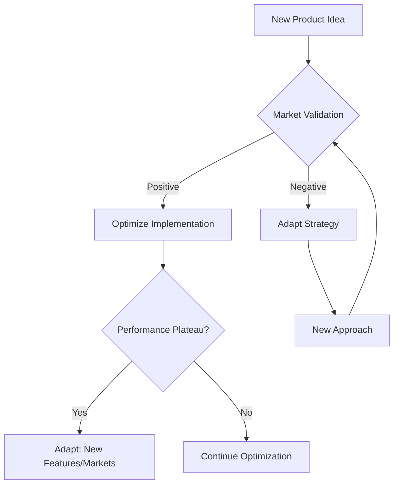

# 📊 Adaptation vs Optimization

> **Core Insight**: Know when to adapt quickly vs when to optimize deeply - the difference between thriving and dying in AI development.

---

## **🔬 What It Is**

**Adaptation vs Optimization** is a statistical mental model that distinguishes between two fundamental strategies:

- **📈 Optimization**: Maximizing performance within known constraints and objectives
- **🔄 Adaptation**: Changing strategies, structures, or objectives based on new information

Think of it as the difference between:
- **Climbing higher** (optimization) vs **Switching mountains** (adaptation)
- **Running faster** vs **Changing direction**
- **Perfecting your approach** vs **Pivoting your approach**

---

## **🧪 The Science Behind It**

### **Statistical Foundation**
```python
# Optimization focuses on gradient descent
def optimize(current_solution, gradient):
    return current_solution - learning_rate * gradient

# Adaptation involves exploration and strategy shifts  
def adapt(current_strategy, environment_feedback):
    if performance_declining():
        return explore_new_strategy()
    else:
        return refine_current_strategy()
```

### **Key Principles**
1. **Local vs Global Optima**: Optimization finds local peaks; adaptation seeks global peaks
2. **Exploration vs Exploitation**: Balance between trying new approaches vs perfecting current ones  
3. **Fitness Landscapes**: Different terrains require different strategies

---

## **🎯 When to Use This Model**

### **Optimize When:**
- ✅ **Clear objectives** and stable requirements
- ✅ **Proven approach** that's working but can improve
- ✅ **Incremental gains** are valuable
- ✅ **Time constraints** favor refinement over exploration

### **Adapt When:**
- 🔄 **Changing requirements** or shifting market conditions
- 🔄 **Diminishing returns** from current optimization efforts
- 🔄 **New information** suggests better approaches exist
- 🔄 **Fundamental assumptions** prove incorrect

---

## **💡 Practical Applications**

### **🤖 AI Model Development**

**Optimization Example:**
```python
# Fine-tuning an existing model
class ModelOptimizer:
    def __init__(self, base_model):
        self.model = base_model
        self.performance_history = []
    
    def optimize_hyperparameters(self):
        best_params = None
        best_score = 0
        
        for learning_rate in [0.01, 0.001, 0.0001]:
            for batch_size in [32, 64, 128]:
                score = self.train_and_evaluate(learning_rate, batch_size)
                if score > best_score:
                    best_score = score
                    best_params = (learning_rate, batch_size)
        
        return best_params
```

**Adaptation Example:**
```python
# Switching model architectures based on results
class ModelAdapter:
    def __init__(self):
        self.architectures = ['transformer', 'cnn', 'rnn']
        self.current_arch = 'transformer'
        
    def adapt_architecture(self, performance_metrics):
        if performance_metrics['accuracy'] < 0.8:
            # Try different architecture
            self.current_arch = self.select_new_architecture()
            return self.rebuild_model()
        else:
            # Continue optimizing current architecture
            return self.optimize_current_model()
```

### **🏗️ System Architecture**

**When to Optimize:**
- Improve response times from 200ms to 100ms
- Reduce infrastructure costs by 20%
- Increase throughput on existing architecture

**When to Adapt:**
- Switch from monolith to microservices
- Move from batch to real-time processing
- Pivot from rule-based to ML-based approach

---

## **📈 Strategic Applications**

### **1. Product Development Lifecycle**



### **2. Team Performance Framework**

| **Phase** | **Strategy** | **Actions** | **Metrics** |
|-----------|--------------|-------------|-------------|
| **🚀 Startup** | Adaptation | Rapid experimentation, pivot quickly | Speed to insight |
| **📈 Growth** | Balanced | Optimize proven channels, adapt to scale | Efficiency + Innovation |
| **🏢 Mature** | Optimization | Refine processes, incremental improvements | Cost reduction, quality |

### **3. Learning Strategy**

**Optimization Approach:**
- Deep dive into specific technologies
- Master existing tools and frameworks
- Incremental skill building

**Adaptation Approach:**
- Learn new paradigms and technologies
- Shift career focus based on market trends
- Fundamental mindset changes

---

## **🔧 Advanced Strategies**

### **1. Dual-Track Development**

```python
class DualTrackStrategy:
    def __init__(self):
        self.optimization_track = OptimizationEngine()
        self.adaptation_track = ExperimentationEngine()
    
    def allocate_resources(self, total_resources):
        # 70-20-10 rule adaptation
        stable_allocation = 0.7 * total_resources
        experimental_allocation = 0.2 * total_resources
        moonshot_allocation = 0.1 * total_resources
        
        return {
            'optimize_current': stable_allocation,
            'adapt_incrementally': experimental_allocation,
            'explore_radical': moonshot_allocation
        }
```

### **2. Performance Plateau Detection**

```python
def detect_plateau(performance_history, window=10):
    if len(performance_history) < window:
        return False
    
    recent_performance = performance_history[-window:]
    improvement_rate = (recent_performance[-1] - recent_performance[0]) / window
    
    # If improvement rate is below threshold, consider adaptation
    return improvement_rate < 0.01  # 1% improvement threshold
```

### **3. Adaptation Triggers**

Create clear triggers for when to switch from optimization to adaptation:

```python
class AdaptationTrigger:
    def __init__(self):
        self.triggers = {
            'performance_plateau': lambda metrics: self.detect_plateau(metrics),
            'market_shift': lambda data: self.detect_market_change(data),
            'tech_disruption': lambda signals: self.detect_disruption(signals),
            'resource_constraints': lambda usage: usage > 0.9
        }
    
    def should_adapt(self, context):
        return any(trigger(context[key]) 
                  for key, trigger in self.triggers.items())
```

---

## **⚠️ Common Pitfalls**

### **🚫 Optimization Traps**
- **Local Optima Fixation**: Getting stuck optimizing the wrong thing
- **Premature Optimization**: Optimizing before understanding the problem
- **Analysis Paralysis**: Over-optimizing instead of shipping

### **🚫 Adaptation Traps**
- **Constant Pivoting**: Never sticking with anything long enough
- **Shiny Object Syndrome**: Adapting to every new trend
- **Adaptation Anxiety**: Changing due to fear rather than data

### **🚫 Balance Traps**
- **False Dichotomy**: Thinking you must choose only one approach
- **Timing Errors**: Optimizing when you should adapt, adapting when you should optimize
- **Resource Misallocation**: Not investing enough in either approach

---

## **📊 How to Measure Success**

### **Optimization Metrics**
```python
optimization_metrics = {
    'efficiency_gains': 'Performance improvement per unit effort',
    'resource_utilization': 'How well you use available resources',
    'incremental_progress': 'Steady improvement over time',
    'cost_reduction': 'Lower costs for same outcomes'
}
```

### **Adaptation Metrics**
```python
adaptation_metrics = {
    'speed_to_pivot': 'Time to recognize and respond to change',
    'exploration_breadth': 'Number of different approaches tried',
    'learning_velocity': 'Rate of acquiring new capabilities',
    'strategic_flexibility': 'Ability to change direction effectively'
}
```

### **Balance Metrics**
```python
balance_metrics = {
    'portfolio_performance': 'Overall system performance across approaches',
    'risk_adjusted_returns': 'Performance accounting for uncertainty',
    'option_value': 'Value of having multiple strategic choices',
    'antifragility': 'Getting stronger from volatility and stress'
}
```

---

## **🎯 Key Takeaways**

### **🎭 Mental Model in Action**
1. **🎯 Know Your Context**: Stable environments favor optimization; volatile environments favor adaptation
2. **⚖️ Portfolio Approach**: Don't put all resources into one strategy
3. **📊 Monitor Signals**: Set up systems to detect when strategy should shift
4. **🚀 Bias for Action**: Both optimization and adaptation require doing, not just planning

### **🔄 Integration Points**
- **Combines with [OODA Loop](./ooda-loop.md)**: Rapid cycles help balance both approaches
- **Enhances [Phase Transitions](./phase-transitions.md)**: Recognize when to switch strategies
- **Supports [Red Queen Hypothesis](./red-queen-hypothesis.md)**: Adaptation as competitive necessity

### **💡 Remember**
> *"In the long run, we are all dead. But in the short run, we need to decide whether to optimize our current path or adapt to a new one. The wise know when to do which."*

**The goal isn't to choose optimization OR adaptation - it's to master the rhythm of when to do each.**
