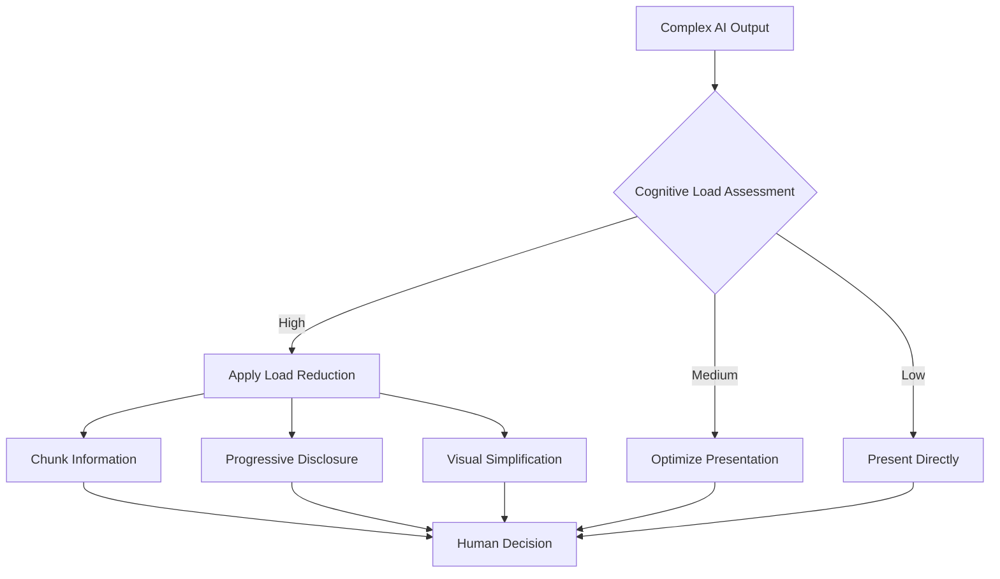

# 🧠 Cognitive Load Theory

> **Core Insight**: Human cognitive capacity is limited - design AI systems that work WITH human minds, not against them.

---

## **🔬 What It Is**

**Cognitive Load Theory** explains how information processing works in human memory and why people become overwhelmed. It identifies three types of cognitive load:

- **🏗️ Intrinsic Load**: The inherent difficulty of the material itself
- **🔧 Extraneous Load**: Mental effort wasted on poor design or irrelevant information  
- **🧠 Germane Load**: Productive mental effort that builds understanding and skills

Think of cognitive capacity like **RAM in a computer** - when you exceed it, everything slows down or crashes.

---

## **🧪 The Science Behind It**

### **Psychological Foundation**
```python
# Cognitive Load Formula
total_cognitive_load = intrinsic_load + extraneous_load + germane_load

# Working memory capacity (Miller's 7±2 rule)
working_memory_capacity = 7  # ±2 items

def cognitive_overload_check(current_load):
    return current_load > working_memory_capacity
```

### **Key Principles**
1. **Limited Working Memory**: Can only hold 7±2 items simultaneously
2. **Chunking**: Group related information to reduce perceived complexity
3. **Dual Coding**: Visual and verbal information processed separately
4. **Progressive Disclosure**: Reveal complexity gradually as users develop expertise

---

## **🎯 When to Use This Model**

### **Apply When Designing:**
- ✅ **User interfaces** for AI tools and dashboards
- ✅ **Training programs** for AI adoption
- ✅ **Documentation** and onboarding flows
- ✅ **Decision support systems** with AI recommendations

### **Critical For:**
- 🧠 **Complex AI outputs** that humans need to understand
- 🧠 **Multi-step workflows** involving human-AI collaboration
- 🧠 **Learning experiences** where people adopt new AI tools
- 🧠 **High-stakes decisions** where cognitive overload = errors

---

## **💡 Practical Applications**

### **🎨 AI Interface Design**

**❌ High Cognitive Load Example:**
```python
# Overwhelming dashboard
def create_ai_dashboard():
    return {
        'metrics': [
            'accuracy', 'precision', 'recall', 'f1_score', 'auc_roc', 
            'confusion_matrix', 'feature_importance', 'model_confidence',
            'training_time', 'inference_speed', 'memory_usage',
            'cpu_utilization', 'gpu_utilization', 'batch_size'
        ],
        'graphs': ['line_chart', 'scatter_plot', 'heatmap', 'histogram'],
        'controls': ['refresh', 'export', 'configure', 'compare', 'alert'],
        'notifications': ['warnings', 'errors', 'updates', 'recommendations']
    }
```

**✅ Optimized Cognitive Load Example:**
```python
# Progressive disclosure approach
class CognitivelyOptimizedDashboard:
    def __init__(self):
        self.primary_metrics = ['accuracy', 'status', 'last_updated']
        self.secondary_metrics = ['precision', 'recall', 'f1_score']
        self.advanced_metrics = ['auc_roc', 'feature_importance', 'confusion_matrix']
    
    def render_dashboard(self, user_expertise_level):
        if user_expertise_level == 'beginner':
            return self.show_primary_only()
        elif user_expertise_level == 'intermediate':
            return self.show_primary_and_secondary()
        else:
            return self.show_all_with_organization()
    
    def show_primary_only(self):
        # Show only 3 key metrics with clear visual indicators
        return {
            'main_view': self.primary_metrics,
            'expansion_hint': "Click to see more details"
        }
```

### **🤖 AI Response Design**

**Reduce Intrinsic Load:**
```python
class CognitivelyFriendlyAI:
    def format_response(self, complex_analysis):
        return {
            'summary': self.extract_key_point(complex_analysis),
            'confidence': self.calculate_confidence_score(),
            'next_action': self.recommend_single_action(),
            'details': self.hide_behind_expansion()  # Reduce extraneous load
        }
    
    def extract_key_point(self, analysis):
        # One clear, actionable insight
        return "Based on the data, I recommend focusing on Feature X"
    
    def hide_behind_expansion(self):
        # Technical details available but not overwhelming
        return {
            'show_reasoning': False,  # Click to expand
            'show_data': False,       # Click to expand  
            'show_alternatives': False # Click to expand
        }
```

### **📚 Training and Onboarding**

**Chunking Strategy:**
```python
class AIAdoptionTraining:
    def design_learning_path(self):
        return [
            {
                'week_1': {
                    'chunk': 'Basic AI Concepts',
                    'cognitive_load': 'low',
                    'items': ['What is AI?', 'How does it help?', 'Basic terminology']
                }
            },
            {
                'week_2': {
                    'chunk': 'Hands-on Practice', 
                    'cognitive_load': 'medium',
                    'items': ['First AI tool', 'Simple workflow', 'Practice exercises']
                }
            },
            {
                'week_3': {
                    'chunk': 'Advanced Applications',
                    'cognitive_load': 'high',
                    'items': ['Complex workflows', 'Integration', 'Optimization']
                }
            }
        ]
```

---

## **📈 Strategic Applications**

### **1. Human-AI Collaboration Framework**



### **2. AI Tool Adoption Strategy**

| **User Type** | **Cognitive Load Strategy** | **Interface Design** | **Training Approach** |
|---------------|----------------------------|---------------------|---------------------|
| **🔰 Beginners** | Minimize intrinsic load | Simple, guided interface | Scaffolded learning |
| **🎯 Intermediates** | Optimize germane load | Customizable complexity | Practice-based |
| **🚀 Experts** | Maximize information density | Full feature access | Self-directed |

### **3. Decision Support Design**

**High-Stakes Decision Framework:**
```python
class CognitiveDecisionSupport:
    def present_ai_recommendation(self, decision_context):
        # Reduce cognitive load for critical decisions
        return {
            'primary_recommendation': self.get_top_choice(),
            'confidence_indicator': self.visual_confidence(),
            'key_factors': self.top_3_factors(),  # Limit to 3
            'risk_assessment': self.simple_risk_gauge(),
            'alternative_hidden': True  # Avoid choice overload
        }
    
    def handle_user_doubt(self):
        # Progressive disclosure when user needs more
        return {
            'show_reasoning': True,
            'show_alternatives': True,
            'show_data_sources': True
        }
```

---

## **🔧 Advanced Strategies**

### **1. Adaptive Cognitive Load Management**

```python
class AdaptiveCognitiveInterface:
    def __init__(self):
        self.user_expertise = {}
        self.cognitive_load_history = {}
    
    def adjust_complexity(self, user_id, task_performance):
        current_load = self.estimate_cognitive_load(user_id)
        
        if task_performance < 0.8:  # Poor performance
            return self.reduce_complexity()
        elif task_performance > 0.95:  # Excellent performance
            return self.increase_complexity()
        else:
            return self.maintain_complexity()
    
    def estimate_cognitive_load(self, user_id):
        metrics = {
            'time_on_task': self.get_task_time(user_id),
            'error_rate': self.get_error_rate(user_id),
            'help_requests': self.get_help_frequency(user_id),
            'abandonment_rate': self.get_abandonment_rate(user_id)
        }
        return self.calculate_load_score(metrics)
```

### **2. Multi-Modal Load Distribution**

```python
class MultiModalCognitiveDesign:
    def distribute_information(self, complex_data):
        return {
            'visual_channel': {
                'charts': self.create_intuitive_visualizations(),
                'icons': self.use_universal_symbols(),
                'colors': self.apply_semantic_color_coding()
            },
            'auditory_channel': {
                'alerts': self.design_non_intrusive_sounds(),
                'voice_guidance': self.provide_contextual_narration()
            },
            'textual_channel': {
                'headlines': self.write_scannable_headers(),
                'bullets': self.create_digestible_points(),
                'details': self.hide_in_expandable_sections()
            }
        }
```

### **3. Cognitive Load Measurement**

```python
def measure_cognitive_load():
    return {
        'physiological': {
            'eye_tracking': 'Measure cognitive effort through gaze patterns',
            'heart_rate': 'Monitor stress indicators',
            'eeg_signals': 'Direct measurement of mental workload'
        },
        'behavioral': {
            'task_completion_time': 'Longer time = higher load',
            'error_frequency': 'More errors = overload',
            'help_seeking': 'Frequent help = poor design'
        },
        'subjective': {
            'nasa_tlx': 'Standard workload assessment',
            'cognitive_load_scale': 'Self-reported difficulty',
            'user_feedback': 'Qualitative insights'
        }
    }
```

---

## **⚠️ Common Pitfalls**

### **🚫 Intrinsic Load Traps**
- **Information Dumping**: Showing all AI capabilities at once
- **Technical Jargon**: Using AI terminology users don't understand
- **Feature Creep**: Adding complexity without considering cognitive cost

### **🚫 Extraneous Load Traps**
- **Poor Information Architecture**: Illogical organization increases mental effort
- **Visual Clutter**: Too many colors, fonts, and UI elements
- **Inconsistent Patterns**: Different interactions for similar tasks

### **🚫 Germane Load Traps**
- **Passive Consumption**: Not engaging users in meaningful learning
- **Missing Context**: Not helping users understand why AI recommendations matter
- **No Progressive Mastery**: Not building from simple to complex

---

## **📊 How to Measure Success**

### **Cognitive Load Indicators**
```python
cognitive_load_metrics = {
    'task_efficiency': {
        'time_to_completion': 'How quickly users accomplish goals',
        'steps_required': 'Number of actions needed',
        'cognitive_switching': 'Mental context changes required'
    },
    'user_performance': {
        'accuracy_rate': 'Correct decisions/actions per session',
        'error_recovery': 'How quickly users fix mistakes',
        'learning_curve': 'Improvement over time'
    },
    'user_experience': {
        'satisfaction_scores': 'Subjective experience ratings',
        'abandonment_rate': 'How often users give up',
        'return_usage': 'Willingness to use again'
    }
}
```

### **Design Validation**
```python
def validate_cognitive_design():
    return {
        'usability_testing': 'Observe real users performing tasks',
        'a_b_testing': 'Compare different cognitive load approaches',
        'analytics_tracking': 'Monitor behavioral patterns at scale',
        'expert_review': 'Cognitive psychologist evaluation'
    }
```

---

## **🎯 Key Takeaways**

### **🎭 Mental Model in Action**
1. **🧠 Respect Mental Limits**: Don't exceed human cognitive capacity
2. **📚 Chunk Information**: Group related concepts together
3. **🔍 Progressive Disclosure**: Start simple, reveal complexity gradually
4. **👥 Know Your Users**: Adapt complexity to expertise level

### **🔄 Integration Points**
- **Enhances [Flow State Optimization](./flow-state-optimization.md)**: Optimal cognitive load maintains flow
- **Supports [Symbiosis Framework](./symbiosis-framework.md)**: Better human-AI collaboration
- **Complements [Phase Transitions](./phase-transitions.md)**: Manage complexity during transitions

### **💡 Remember**
> *"The best AI interface is the one that makes complex intelligence feel simple to use. When cognitive load is optimized, humans and AI can truly collaborate."*

**Every element in your AI system should either reduce cognitive load or provide value that justifies its mental cost.**
