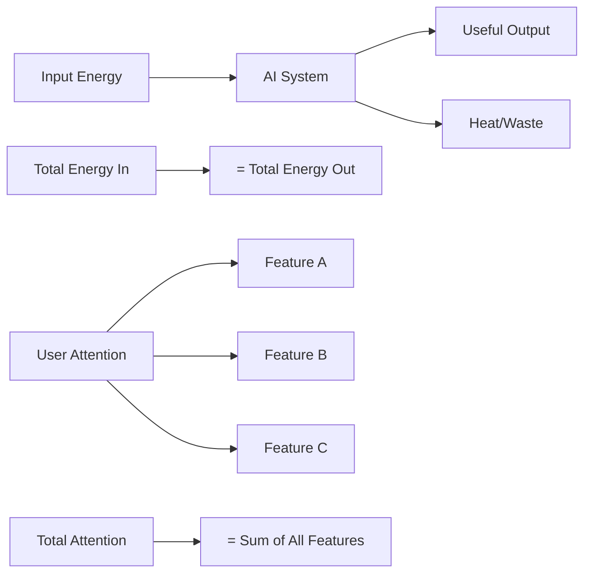
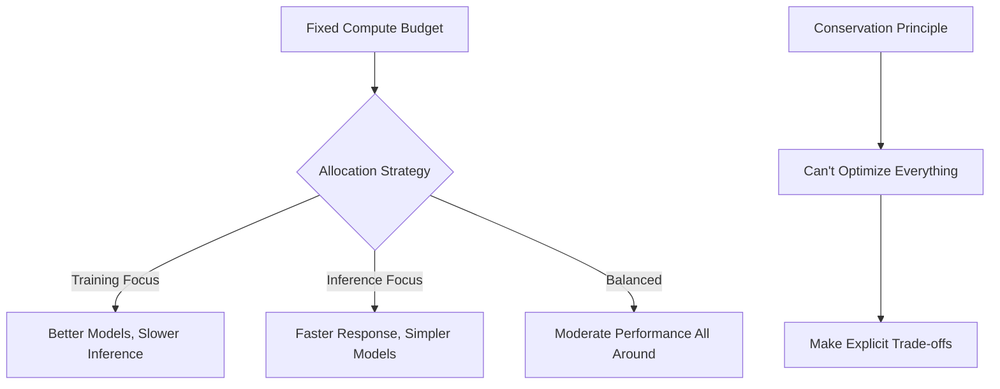
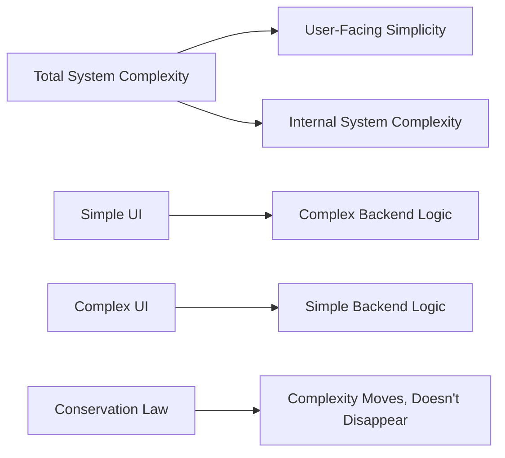
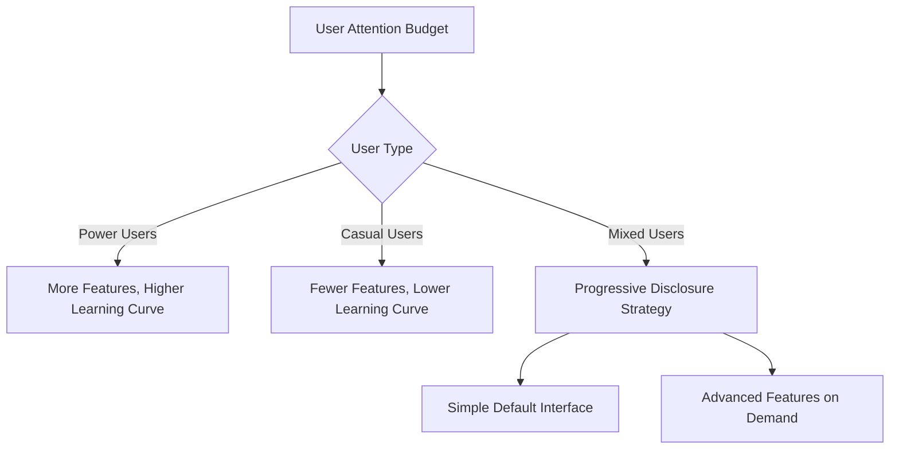
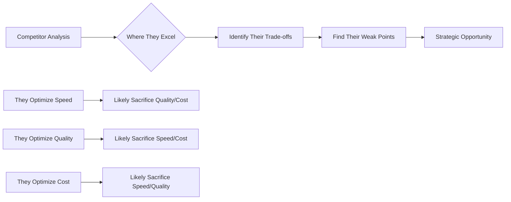

# ⚖️ Conservation Laws

> **Apply fundamental conservation principles to optimize AI system design and resource allocation**

## 🎯 **What It Is**

Conservation Laws is a mental model borrowed from physics that helps you understand fundamental constraints in AI systems by recognizing that certain quantities are always preserved - they can be transformed but never created or destroyed.

**Core Insight**: In any AI system, key resources like attention, energy, complexity, and information have fixed totals that can only be redistributed, not increased without external input.

## ⚡ **The Physics Behind It**



**Key Conservation Laws in AI:**
- **Energy Conservation**: Computational resources are finite
- **Attention Conservation**: User cognitive capacity is limited
- **Complexity Conservation**: Simplicity in one area requires complexity elsewhere
- **Information Conservation**: Data quality and quantity trade-offs

## 🎯 **When to Use**

### **🏗️ System Architecture Design**
- Balancing compute vs. storage vs. latency
- Understanding performance trade-offs
- Planning resource allocation strategies

### **🎨 User Experience Design**
- Managing cognitive load across features
- Balancing automation vs. user control
- Optimizing attention distribution

### **📈 Business Strategy**
- Resource allocation across projects
- Understanding competitive trade-offs
- Planning capability development

## 🚀 **Practical Applications**

### **Example: Energy Conservation in AI Systems**

**🔍 Computational Energy Conservation:**

```python
def analyze_energy_conservation():
    total_compute_budget = 1000  # GPU hours per month
    
    # Energy can only be redistributed, not created
    model_training = 400        # 40% of total
    model_inference = 300       # 30% of total
    data_processing = 200       # 20% of total
    system_overhead = 100       # 10% of total
    
    assert sum([model_training, model_inference, 
                data_processing, system_overhead]) == total_compute_budget
    
    # To increase one area, must decrease others
    if need_more_training_compute():
        model_training += 100
        model_inference -= 50
        data_processing -= 50
        # Total remains conserved
```

**Strategic Implications:**


### **Example: Attention Conservation in User Interfaces**

**🎯 User Cognitive Load Conservation:**

**Traditional Mistake:**
```
Add more features → Assume users will adapt → Cognitive overload
```

**Conservation-Aware Design:**
```python
def design_ui_with_attention_conservation():
    total_user_attention = 100  # Fixed cognitive capacity
    
    # Attention distribution must sum to total
    primary_task_attention = 60     # Core workflow
    navigation_attention = 15       # Finding features
    learning_attention = 15         # Understanding new features
    error_recovery_attention = 10   # Handling mistakes
    
    # To add new feature, must reduce attention elsewhere
    if add_new_feature(attention_cost=20):
        # Must simplify elsewhere to maintain total
        navigation_attention -= 10  # Simpler navigation
        learning_attention -= 10    # Better onboarding
        # Or reduce feature scope to lower attention cost
```

**Design Principles:**
- **Progressive Disclosure**: Show only what's needed now
- **Attention Hierarchy**: Most important tasks get most attention
- **Cognitive Offloading**: Let AI handle routine decisions

### **Example: Complexity Conservation in System Design**

**🔧 Complexity Conservation Principle:**



**Implementation Strategy:**
```python
def manage_complexity_conservation():
    total_complexity_budget = 1000  # Arbitrary units
    
    # Complexity distribution options
    option_1 = {
        "user_interface": 200,      # Simple, intuitive UI
        "backend_logic": 500,       # Complex AI reasoning
        "data_pipeline": 300        # Sophisticated processing
    }
    
    option_2 = {
        "user_interface": 400,      # Feature-rich UI
        "backend_logic": 300,       # Simpler AI models
        "data_pipeline": 300        # Standard processing
    }
    
    # Both sum to same total complexity
    assert sum(option_1.values()) == sum(option_2.values())
    
    # Choose based on user value and team capabilities
    return choose_complexity_distribution(option_1, option_2)
```

**Strategic Decision Framework:**
- **User-Facing Simplicity**: Hide complexity behind clean interfaces
- **Developer-Facing Simplicity**: Build on proven, simple foundations
- **Operational Simplicity**: Reduce complexity in deployment and maintenance

## 🔄 **Conservation Patterns in AI**

### **⚡ Energy Conservation Patterns**

**Compute-Memory Trade-off:**
```
More Memory Usage ↔ Less Computation Time
Caching ↔ Real-time Processing
Model Size ↔ Inference Speed
```

**Optimization Strategy:**
```python
def optimize_energy_distribution():
    if latency_critical():
        # Trade memory for speed
        use_larger_cache()
        precompute_common_results()
        accept_higher_memory_usage()
    
    elif memory_constrained():
        # Trade speed for memory efficiency
        use_smaller_models()
        compute_on_demand()
        accept_slower_responses()
```

### **🧠 Information Conservation Patterns**

**Data Quality-Quantity Trade-off:**
```
High Quality Small Dataset ↔ Lower Quality Large Dataset
Precise Labels ↔ More Training Examples
Detailed Features ↔ Broader Coverage
```

**Strategic Approach:**
```python
def balance_information_conservation():
    total_labeling_budget = 10000  # Hours of human annotation
    
    option_high_quality = {
        "examples": 1000,
        "hours_per_example": 10,
        "quality_score": 95
    }
    
    option_high_quantity = {
        "examples": 5000,
        "hours_per_example": 2,
        "quality_score": 75
    }
    
    # Choose based on model requirements and performance goals
    return optimize_for_task_requirements()
```

### **🎯 Attention Conservation Patterns**

**Feature-Focus Trade-off:**
```
More Features ↔ Less Focus per Feature
Customization ↔ Simplicity
Power ↔ Ease of Use
```

**User Experience Strategy:**


## 🎯 **Strategic Applications**

### **Resource Allocation Strategy**

**🔍 Portfolio Conservation:**
```python
def allocate_development_resources():
    total_team_capacity = 100  # Developer weeks per quarter
    
    # Conservation constraint: allocations must sum to total
    research_projects = 30      # Innovation and exploration
    product_features = 40       # User-facing improvements
    infrastructure = 20         # Scaling and reliability
    technical_debt = 10         # System maintenance
    
    # Reallocation requires trade-offs
    if urgent_infrastructure_need():
        infrastructure += 15
        research_projects -= 10  # Delay some research
        product_features -= 5    # Reduce feature scope
    
    return validate_conservation(total_team_capacity)
```

### **Competitive Strategy with Conservation**

**🏆 Understanding Competitor Constraints:**


**Strategic Response:**
- **Exploit Their Trade-offs**: Excel where they've sacrificed
- **Force Conservation Choices**: Create situations where they must choose
- **Different Conservation Strategy**: Optimize different dimensions

### **Innovation Through Conservation Understanding**

**🚀 Breaking Conservation Limits:**
```python
def transcend_conservation_limits():
    # Can't break conservation laws, but can:
    
    # 1. Change the system boundaries
    if computational_limit_reached():
        move_to_edge_computing()  # Distribute the constraint
        use_specialized_hardware()  # Change the energy equation
    
    # 2. Find new energy sources
    if attention_limit_reached():
        automate_routine_decisions()  # Reduce attention load
        use_ai_to_augment_cognition()  # Amplify available attention
    
    # 3. Improve efficiency within constraints
    if complexity_limit_reached():
        refactor_architecture()  # Better complexity distribution
        eliminate_unnecessary_features()  # Reduce total complexity
```

## 💡 **Advanced Conservation Strategies**

### **Multi-Dimensional Conservation**

**Balancing Multiple Conservation Laws:**
```python
def optimize_multi_dimensional_conservation():
    constraints = {
        "energy_budget": 1000,
        "attention_budget": 100,
        "complexity_budget": 500,
        "time_budget": 40  # weeks
    }
    
    # Solution must satisfy all conservation constraints
    solution = find_optimal_allocation(constraints)
    
    # Verify conservation laws
    for constraint, limit in constraints.items():
        assert solution[constraint] <= limit
    
    return solution
```

### **Conservation Arbitrage**

**Finding Efficiency Opportunities:**
- **Energy Arbitrage**: Use cheap compute during off-peak hours
- **Attention Arbitrage**: Automate low-value attention tasks
- **Complexity Arbitrage**: Move complexity to areas with better tools/expertise

### **Conservation Banking**

**Saving Resources for Strategic Use:**
```python
def implement_conservation_banking():
    # Save attention by simplifying current features
    simplified_ui_saves = 20  # attention units
    
    # Save energy by optimizing current systems
    optimization_saves = 100  # compute units
    
    # "Bank" these savings for strategic initiatives
    new_feature_budget = simplified_ui_saves
    ai_research_budget = optimization_saves
    
    return deploy_strategic_initiatives(new_feature_budget, ai_research_budget)
```

## ⚠️ **Conservation Pitfalls**

### **Conservation Blindness**
- **Problem**: Not recognizing conservation constraints
- **Example**: Adding features without considering attention limits
- **Solution**: Always ask "What am I trading off?"

### **False Conservation**
- **Problem**: Assuming conservation where none exists
- **Example**: Thinking team skill is zero-sum (it's not - training grows total skill)
- **Solution**: Distinguish between truly conserved quantities and growable resources

### **Conservation Fatalism**
- **Problem**: Accepting constraints without seeking creative solutions
- **Example**: "We can't do X because of constraint Y"
- **Solution**: Look for ways to change the system boundaries or find new energy sources

### **Micro-Optimization Trap**
- **Problem**: Optimizing local conservation while missing global opportunities
- **Solution**: Regularly step back to view system-wide conservation patterns

## 📊 **Measuring Conservation Efficiency**

### **Conservation Metrics**
```python
def measure_conservation_efficiency():
    # Energy efficiency
    useful_output = measure_valuable_computations()
    total_energy = measure_total_compute_usage()
    energy_efficiency = useful_output / total_energy
    
    # Attention efficiency
    task_completion = measure_user_success_rate()
    attention_required = measure_cognitive_load()
    attention_efficiency = task_completion / attention_required
    
    # Complexity efficiency
    feature_value = measure_user_satisfaction()
    system_complexity = measure_code_complexity()
    complexity_efficiency = feature_value / system_complexity
    
    return {
        "energy_efficiency": energy_efficiency,
        "attention_efficiency": attention_efficiency,
        "complexity_efficiency": complexity_efficiency
    }
```

### **Conservation Dashboard**
- **Resource Utilization**: How fully are conserved resources being used?
- **Allocation Efficiency**: Are resources going to highest-value uses?
- **Trade-off Awareness**: Are team decisions considering conservation laws?

## 💡 **Key Takeaways**

- **Conservation laws reveal fundamental trade-offs in AI systems**
- **Resources can be redistributed but not created without external input**
- **Understanding conservation constraints helps make better strategic decisions**
- **Innovation often comes from changing system boundaries or finding new energy sources**
- **Every optimization in one area requires sacrifice in another - make this explicit**
- **Conservation thinking prevents wishful thinking and forces realistic planning**

---

**🔗 Related Mental Models:**
- [Trade-off Triangle](./trade-off-triangle.md) - Understanding optimization constraints
- [Goldilocks Principle](./goldilocks-principle.md) - Finding optimal resource allocation
- [First Principles Thinking](./first-principles-thinking.md) - Understanding fundamental constraints
- [Systems Thinking](./systems-thinking.md) - Seeing resource flows and constraints

**📚 Further Reading:**
- Physics of conservation laws and symmetry
- Resource optimization theory
- Systems thinking and constraint theory
- Economic principles of scarcity and trade-offs
