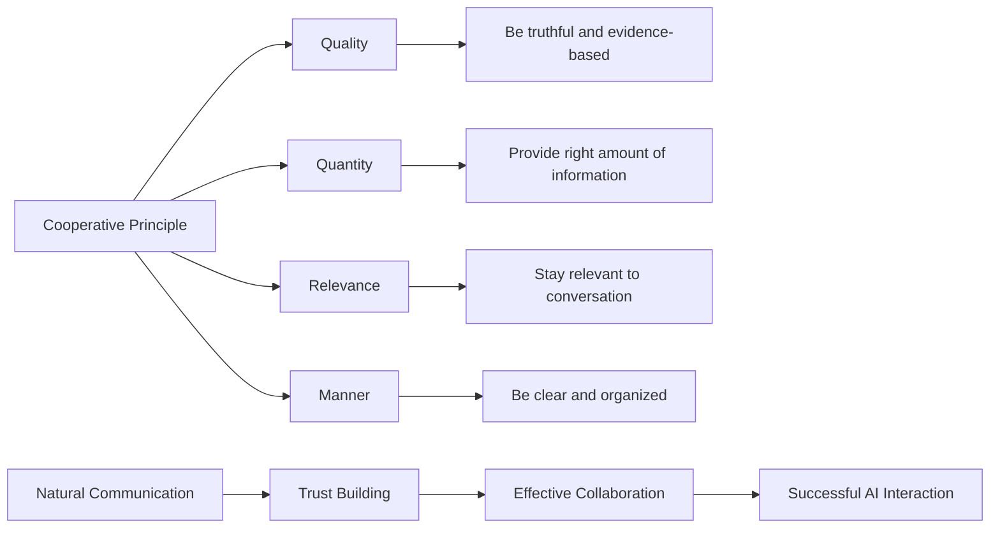
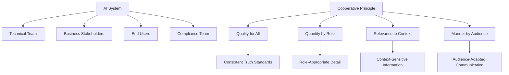

# 🧠 Cooperative Principle

> **Design natural and effective AI communication by following the fundamental maxims of human conversation**

## 🎯 **What It Is**

The Cooperative Principle is a foundational framework from linguistics and pragmatics that explains how effective communication relies on speakers and listeners following implicit conversational maxims of quality, quantity, relevance, and manner. Proposed by philosopher H.P. Grice, this principle provides crucial insights for designing AI systems that communicate naturally, build trust, and support productive human-AI collaboration.

**Core Insight**: Successful AI interaction depends not just on technical capability, but on following the same cooperative communication patterns that make human conversation effective, predictable, and trustworthy.

## ⚡ **The Linguistic Foundation**

### **Grice's Four Maxims of Cooperation**


**The Four Maxims:**
- **Quality (Truth)**: Make contributions that are true and well-founded
- **Quantity (Information)**: Provide the right amount of information - not too little, not too much
- **Relevance (Relation)**: Keep contributions relevant to the current conversation and context
- **Manner (Clarity)**: Be clear, brief, orderly, and avoid ambiguity and obscurity

## 🎯 **When to Use**

### **🤖 Conversational AI Design**
- Building chatbots, virtual assistants, and dialogue systems
- Designing AI customer service and support interactions
- Creating AI tutoring and educational conversation systems
- Developing AI that collaborates with humans in professional contexts

### **📝 AI Communication Interfaces**
- Prompt engineering and AI instruction design
- Creating AI explanation and transparency systems
- Designing AI feedback and error communication
- Building AI that provides recommendations and advice

### **🔧 Human-AI Collaboration Systems**
- AI systems that participate in team workflows
- AI that provides analysis and insights to decision-makers
- AI tools that support creative and analytical work
- AI systems in safety-critical or high-stakes environments

## 🗣️ **The Four Maxims in AI Applications**

### **1️⃣ Maxim of Quality - Truth and Evidence**
```
Definition: AI communications should be truthful, accurate, and based on sound evidence

Implementation in AI:
• Provide accurate information based on training data and model capabilities
• Acknowledge limitations and uncertainty in AI responses
• Distinguish between facts, opinions, and predictions
• Cite sources and explain reasoning when possible
• Avoid making claims beyond the AI's knowledge or capabilities

Quality Violations to Avoid:
❌ Generating false information or "hallucinations"
❌ Making claims without sufficient evidence
❌ Presenting opinions as facts
❌ Overstating AI capabilities or certainty
❌ Hiding sources of information or reasoning

Quality Best Practices:
✅ Express confidence levels with predictions
✅ Acknowledge when information may be outdated
✅ Provide sources when available
✅ Distinguish between different types of knowledge
✅ Correct errors when identified

Example - AI Medical Assistant:
Poor Quality: "You definitely have condition X based on your symptoms."
Good Quality: "Based on the symptoms you've described, condition X is a possibility that's worth discussing with your doctor. However, only a medical professional can provide an accurate diagnosis."

Quality Indicators:
• Accuracy: Information matches verified sources
• Uncertainty acknowledgment: AI expresses appropriate confidence levels
• Source attribution: References provided when available
• Error correction: Mistakes acknowledged and corrected
• Capability boundaries: Clear about what AI can and cannot do
```

### **2️⃣ Maxim of Quantity - Right Amount of Information**
```
Definition: Provide exactly the amount of information needed - no more, no less

Implementation in AI:
• Tailor response length to user needs and context
• Provide comprehensive answers without overwhelming detail
• Allow for follow-up questions to get more depth
• Summarize complex information appropriately
• Adapt information density to user expertise level

Quantity Violations to Avoid:
❌ Information overload with excessive detail
❌ Too brief responses that don't answer the question
❌ Irrelevant information padding
❌ Repetitive or redundant content
❌ One-size-fits-all information provision

Quantity Optimization Strategies:
✅ Progressive disclosure: Start with overview, allow drill-down
✅ Context awareness: Adjust detail level based on user expertise
✅ Interaction design: Enable users to request more or less detail
✅ Personalization: Learn user preferences for information density
✅ Structured responses: Organize information hierarchically

Example - AI Business Analyst:
Too Little: "Sales increased."
Too Much: "Sales increased by 12.3% from $2,456,789 to $2,758,123, representing a year-over-year growth that compares favorably to industry averages of 8.7% as reported by..."
Just Right: "Sales increased 12% this quarter. This outperforms our 8% target and the industry average of 9%. Would you like details on which products drove this growth?"

Quantity Assessment Framework:
• Completeness: Does response fully address the user's question?
• Conciseness: Is information presented efficiently without waste?
• Depth appropriateness: Does detail level match user needs and expertise?
• Actionability: Can user act on the information provided?
• Follow-up enablement: Clear path to get more detail if needed
```

### **3️⃣ Maxim of Relevance - Contextual Appropriateness**
```
Definition: All AI contributions should be relevant to the current conversation and user goals

Implementation in AI:
• Maintain context throughout conversations
• Connect responses to user's immediate needs
• Avoid tangential or off-topic information
• Prioritize information based on user goals
• Understand implicit as well as explicit relevance

Relevance Violations to Avoid:
❌ Providing unrelated information
❌ Losing conversation context
❌ Including irrelevant examples or analogies
❌ Failing to understand user intent
❌ Generic responses that don't address specific situations

Relevance Enhancement Strategies:
✅ Context tracking: Maintain conversation history and goals
✅ Intent recognition: Understand what user really needs
✅ Prioritization: Lead with most relevant information
✅ Connection making: Explicitly link responses to user needs
✅ Adaptive focus: Adjust relevance based on conversation evolution

Example - AI Project Manager:
User: "The client is unhappy with our progress."
Irrelevant: "Here's a general overview of project management methodologies."
Relevant: "I understand the client satisfaction concern. Based on our current timeline, we're 2 weeks behind the agreed milestone. Here are three options to address this: [specific solutions related to their project]."

Relevance Evaluation Criteria:
• Goal alignment: Does response support user's immediate objectives?
• Context sensitivity: Does AI understand the current situation?
• Timing appropriateness: Is this information needed now?
• Specificity: Does response address the specific case, not general topics?
• Value contribution: Does this information help the user make progress?
```

### **4️⃣ Maxim of Manner - Clarity and Organization**
```
Definition: Communicate clearly, orderly, and without unnecessary ambiguity or obscurity

Implementation in AI:
• Use clear, accessible language appropriate to audience
• Organize information logically and coherently
• Avoid ambiguous phrasing or technical jargon
• Structure responses for easy comprehension
• Provide clear next steps or action items

Manner Violations to Avoid:
❌ Ambiguous or confusing language
❌ Disorganized or rambling responses
❌ Unnecessary technical jargon
❌ Unclear instructions or recommendations
❌ Verbose or overly complex explanations

Manner Optimization Techniques:
✅ Plain language: Use simple, clear terminology
✅ Logical structure: Organize information in intuitive sequences
✅ Visual formatting: Use bullets, numbers, and structure for clarity
✅ Action orientation: Make next steps clear and actionable
✅ Audience adaptation: Adjust language to user expertise and context

Example - AI Financial Advisor:
Poor Manner: "Your portfolio's risk-adjusted returns vis-à-vis the benchmark indicate suboptimal allocation efficiency across asset classes with particular deficiencies in sector diversification metrics."
Good Manner: "Your investment portfolio is underperforming the market benchmark. The main issue is that too much money is concentrated in technology stocks. I recommend: 1) Reduce tech allocation to 15%, 2) Add healthcare and utilities for balance, 3) Review again in 3 months."

Manner Quality Indicators:
• Clarity: Language is unambiguous and easy to understand
• Organization: Information follows logical structure
• Accessibility: Appropriate vocabulary for target audience
• Actionability: Clear steps or recommendations provided
• Efficiency: Communication achieves goals without unnecessary complexity
```

## 🛠️ **Practical Implementation Framework**

### **🎯 Cooperative AI Design Patterns**

**Conversational Architecture:**
```python
class CooperativeAIDialogue:
    def __init__(self, user_context, conversation_history):
        self.user_context = user_context
        self.conversation_history = conversation_history
        self.cooperative_principles = self.initialize_principles()
    
    def initialize_principles(self):
        return {
            "quality": QualityMaxim(),
            "quantity": QuantityMaxim(),
            "relevance": RelevanceMaxim(),
            "manner": MannerMaxim()
        }
    
    def generate_cooperative_response(self, user_input):
        # Parse user intent and context
        parsed_intent = self.parse_user_intent(user_input)
        
        # Apply each maxim to shape response
        response_draft = self.generate_initial_response(parsed_intent)
        
        # Quality check: Ensure truthfulness and evidence
        quality_enhanced = self.cooperative_principles["quality"].enhance(
            response_draft, self.user_context
        )
        
        # Quantity optimization: Right amount of information
        quantity_optimized = self.cooperative_principles["quantity"].optimize(
            quality_enhanced, parsed_intent.information_needs
        )
        
        # Relevance filtering: Keep only contextually appropriate content
        relevance_filtered = self.cooperative_principles["relevance"].filter(
            quantity_optimized, self.conversation_history, parsed_intent
        )
        
        # Manner refinement: Clarity and organization
        final_response = self.cooperative_principles["manner"].refine(
            relevance_filtered, self.user_context.expertise_level
        )
        
        return final_response
    
    def validate_cooperation(self, response):
        cooperation_score = {
            "quality": self.assess_truthfulness_and_evidence(response),
            "quantity": self.assess_information_appropriateness(response),
            "relevance": self.assess_contextual_fit(response),
            "manner": self.assess_clarity_and_organization(response)
        }
        
        overall_cooperation = sum(cooperation_score.values()) / len(cooperation_score)
        return cooperation_score, overall_cooperation
```

### **📊 Cooperative Violation Detection**

**Automated Maxim Monitoring:**
```python
def detect_cooperative_violations():
    violation_patterns = {
        "quality_violations": {
            "hallucination_detection": "Identify false or unsubstantiated claims",
            "uncertainty_underexpression": "Flag overconfident statements",
            "source_omission": "Detect missing attribution for factual claims",
            "capability_overstatement": "Identify claims beyond AI abilities"
        },
        
        "quantity_violations": {
            "information_overload": "Detect responses with excessive detail",
            "insufficient_detail": "Identify responses that don't answer the question",
            "irrelevant_padding": "Find information not related to user needs",
            "repetitive_content": "Detect unnecessary redundancy"
        },
        
        "relevance_violations": {
            "context_drift": "Identify responses that lose conversation thread",
            "tangential_information": "Detect off-topic content",
            "intent_mismatch": "Find responses that don't address user goals",
            "temporal_irrelevance": "Identify outdated or mistimed information"
        },
        
        "manner_violations": {
            "ambiguity_detection": "Identify unclear or confusing language",
            "jargon_overuse": "Detect inappropriate technical terminology",
            "disorganization": "Find poorly structured responses",
            "verbosity": "Identify unnecessarily complex explanations"
        }
    }
    
    return violation_patterns

def implement_violation_correction():
    correction_strategies = {
        "quality_corrections": {
            "add_uncertainty_markers": "Include confidence levels and limitations",
            "provide_source_attribution": "Add references and reasoning explanation",
            "correct_false_information": "Replace inaccurate content with verified facts",
            "clarify_ai_boundaries": "Explicitly state AI capabilities and limitations"
        },
        
        "quantity_adjustments": {
            "progressive_disclosure": "Provide summary with option for details",
            "context_sensitive_depth": "Adjust detail based on user expertise",
            "information_prioritization": "Lead with most important information",
            "follow_up_enablement": "Create clear paths for additional information"
        },
        
        "relevance_improvements": {
            "context_reconnection": "Explicitly link response to conversation context",
            "intent_realignment": "Refocus response on user's actual goals",
            "priority_reordering": "Put most relevant information first",
            "tangent_elimination": "Remove information not related to user needs"
        },
        
        "manner_enhancements": {
            "language_simplification": "Replace jargon with plain language",
            "structure_improvement": "Organize information logically",
            "clarity_enhancement": "Eliminate ambiguous phrasing",
            "action_orientation": "Make recommendations clear and actionable"
        }
    }
    
    return correction_strategies
```

## 📈 **Advanced Applications in AI Development**

### **🤖 Multi-Turn Conversation Management**

**Cooperative Context Tracking:**
```python
class CooperativeContextManager:
    def __init__(self):
        self.conversation_stack = []
        self.user_goals = {}
        self.cooperative_history = {}
    
    def track_cooperative_coherence(self, conversation_turn):
        coherence_analysis = {
            "quality_consistency": self.assess_quality_consistency(conversation_turn),
            "quantity_appropriateness": self.assess_quantity_progression(conversation_turn),
            "relevance_maintenance": self.assess_relevance_thread(conversation_turn),
            "manner_continuity": self.assess_manner_consistency(conversation_turn)
        }
        
        return coherence_analysis
    
    def manage_cooperative_violations(self, violation_type, context):
        recovery_strategies = {
            "quality_violation": {
                "acknowledge_error": "Explicitly recognize and correct misinformation",
                "rebuild_trust": "Demonstrate commitment to accuracy going forward",
                "provide_evidence": "Support future claims with clear reasoning"
            },
            
            "quantity_violation": {
                "adjust_information_level": "Recalibrate detail to user preferences",
                "offer_alternative_formats": "Provide different ways to access information",
                "enable_user_control": "Let user specify desired detail level"
            },
            
            "relevance_violation": {
                "refocus_conversation": "Explicitly return to user's original goal",
                "clarify_connection": "Explain how information relates to user needs",
                "prioritize_user_agenda": "Put user's goals ahead of comprehensive coverage"
            },
            
            "manner_violation": {
                "simplify_language": "Use clearer, more accessible communication",
                "restructure_information": "Reorganize for better comprehension",
                "provide_clarification": "Offer to explain any confusing points"
            }
        }
        
        return recovery_strategies[violation_type]
```

### **🔧 Domain-Specific Cooperative Adaptation**

**Context-Aware Maxim Application:**
```python
def adapt_cooperation_to_domain():
    domain_adaptations = {
        "healthcare_ai": {
            "quality_emphasis": {
                "evidence_standards": "Medical evidence hierarchy (RCTs > observational > case studies)",
                "uncertainty_communication": "Clear risk and benefit communication",
                "limitation_acknowledgment": "Explicit boundaries of AI medical advice",
                "professional_referral": "Clear guidance to seek human medical expertise"
            },
            
            "quantity_calibration": {
                "urgency_adaptation": "More detail for serious conditions, concise for routine",
                "expertise_matching": "Technical detail for professionals, plain language for patients",
                "decision_support": "Information calibrated to support specific medical decisions",
                "follow_up_guidance": "Clear next steps for different scenarios"
            }
        },
        
        "educational_ai": {
            "quality_standards": {
                "pedagogical_accuracy": "Information appropriate for learning level",
                "source_credibility": "Use authoritative educational sources",
                "misconception_prevention": "Avoid reinforcing common misunderstandings",
                "knowledge_building": "Connect new information to existing knowledge"
            },
            
            "quantity_pedagogy": {
                "cognitive_load_management": "Information chunks appropriate for working memory",
                "progressive_complexity": "Build complexity gradually",
                "practice_opportunity": "Provide chances to apply new knowledge",
                "assessment_integration": "Include opportunities to check understanding"
            }
        },
        
        "business_ai": {
            "quality_requirements": {
                "data_source_transparency": "Clear attribution for business insights",
                "confidence_intervals": "Uncertainty ranges for predictions and forecasts",
                "assumption_disclosure": "Explicit statement of analytical assumptions",
                "bias_acknowledgment": "Recognition of potential model or data biases"
            },
            
            "quantity_business_fit": {
                "executive_summary": "Key insights for leadership decision-making",
                "operational_detail": "Actionable information for implementation",
                "strategic_context": "Connection to broader business objectives",
                "risk_assessment": "Identification of potential downsides and mitigation"
            }
        }
    }
    return domain_adaptations
```

### **🎯 Cooperative AI in Team Environments**

**Multi-Stakeholder Cooperation:**


**Stakeholder-Specific Cooperation:**
```python
def implement_multi_stakeholder_cooperation():
    stakeholder_cooperation = {
        "technical_team": {
            "quality": "Detailed technical accuracy with model limitations",
            "quantity": "Comprehensive technical detail with implementation guidance",
            "relevance": "Focus on technical feasibility and performance metrics",
            "manner": "Technical terminology with precise definitions"
        },
        
        "business_stakeholders": {
            "quality": "Business-relevant accuracy with confidence levels",
            "quantity": "Executive summary with drill-down capability",
            "relevance": "Connection to business objectives and KPIs",
            "manner": "Business language with clear action items"
        },
        
        "end_users": {
            "quality": "User-relevant accuracy with practical implications",
            "quantity": "Just enough information to support user goals",
            "relevance": "Direct connection to user tasks and needs",
            "manner": "Plain language with clear next steps"
        },
        
        "compliance_team": {
            "quality": "Regulatory accuracy with audit trail",
            "quantity": "Complete information for compliance assessment",
            "relevance": "Focus on regulatory requirements and risks",
            "manner": "Formal documentation style with clear compliance status"
        }
    }
    return stakeholder_cooperation
```

## 🚨 **Common Cooperation Failures and Solutions**

### **❌ Anti-Patterns in AI Cooperation**

**1. Cooperative Overload**
```
❌ Problem: Trying to follow all maxims perfectly simultaneously
Example: AI that provides exhaustive, perfectly accurate, highly relevant, and extremely clear responses that overwhelm users

Impact:
• Cognitive overload for users
• Reduced efficiency and usability
• Decision paralysis from too much information
• Loss of conversational naturalness

✅ Solution: Contextual maxim prioritization
Implementation:
• Emergency situations: Prioritize relevance and clarity over completeness
• Learning contexts: Prioritize quality and appropriate quantity
• Casual interactions: Prioritize manner and relevance
• Professional contexts: Balance all maxims with slight emphasis on quality

Example Fix:
• Old: 500-word detailed, accurate, relevant, and clear response to "What's the weather?"
• New: "It's 72°F and sunny. Perfect for outdoor activities. Need more details about tonight or the weekend?"
```

**2. Robotic Cooperation**
```
❌ Problem: Following maxims too literally without natural conversational flow
Example: AI that mechanically provides exactly the requested information without conversational warmth or adaptation

Impact:
• Unnatural interaction experience
• Reduced user engagement and trust
• Missed opportunities for helpful proactive suggestions
• Lack of conversational rapport

✅ Solution: Human-like cooperative flexibility
Implementation:
• Add conversational markers and natural transitions
• Include appropriate proactive suggestions
• Show understanding of user emotional context
• Adapt cooperation style to user personality and preferences

Example Fix:
• Old: "The requested information is: [exact answer]"
• New: "Based on what you're asking, it sounds like [interpretation]. Here's what I found: [answer]. This might also be helpful: [related insight]."
```

**3. Cooperation Inconsistency**
```
❌ Problem: Inconsistent application of cooperative principles across interactions
Example: AI that is highly detailed in some responses and too brief in others without apparent reason

Impact:
• User confusion and frustration
• Unpredictable interaction experience
• Reduced trust in AI reliability
• Difficulty for users to calibrate expectations

✅ Solution: Systematic cooperation standards with explicit adaptation
Implementation:
• Establish baseline cooperation standards for different contexts
• Make adaptation principles transparent to users
• Provide user control over cooperation style preferences
• Maintain consistency within conversation threads

Example Fix:
• Old: Random variation in response detail and style
• New: "I typically provide moderate detail, but I can adjust. Would you prefer more detailed explanations or quick summaries?"
```

**4. False Cooperation**
```
❌ Problem: Appearing to follow cooperative principles while actually violating them
Example: AI that seems helpful but provides inaccurate information or irrelevant suggestions

Impact:
• Undermined user trust
• Poor decision-making based on AI input
• Wasted time and resources
• Potential harm from following bad advice

✅ Solution: Genuine cooperative implementation with verification
Implementation:
• Implement robust fact-checking and accuracy verification
• Prioritize admitting limitations over appearing helpful
• Build in uncertainty expression and confidence calibration
• Create feedback loops to identify and correct cooperation failures

Example Fix:
• Old: Confident-sounding response with inaccurate information
• New: "I'm not certain about this specific detail. Here's what I do know: [verified information]. You might want to verify [uncertain aspects] with [appropriate source]."
```

### **🛡️ Cooperative Quality Assurance**

**Systematic Cooperation Evaluation:**
```python
def implement_cooperation_qa():
    qa_framework = {
        "automated_checks": {
            "quality_verification": {
                "fact_checking": "Cross-reference claims with verified sources",
                "confidence_calibration": "Ensure expressed confidence matches actual accuracy",
                "limitation_acknowledgment": "Verify AI acknowledges its boundaries",
                "source_attribution": "Check for appropriate citation of information sources"
            },
            
            "quantity_assessment": {
                "information_completeness": "Verify response adequately addresses user question",
                "detail_appropriateness": "Check if detail level matches context and user needs",
                "redundancy_detection": "Identify unnecessary repetition or padding",
                "conciseness_evaluation": "Assess efficiency of information delivery"
            },
            
            "relevance_validation": {
                "context_alignment": "Verify response connects to conversation context",
                "goal_support": "Check if response advances user's objectives",
                "priority_ordering": "Assess if most important information comes first",
                "tangent_detection": "Identify and flag off-topic content"
            },
            
            "manner_review": {
                "clarity_assessment": "Evaluate language clarity and comprehensibility",
                "organization_check": "Verify logical structure and flow",
                "audience_appropriateness": "Check if language and style fit user context",
                "actionability_evaluation": "Assess if next steps are clear and feasible"
            }
        },
        
        "human_validation": {
            "expert_review": "Subject matter experts evaluate quality and relevance",
            "user_testing": "Real users assess quantity and manner appropriateness",
            "stakeholder_feedback": "Multiple perspectives on cooperative effectiveness",
            "longitudinal_assessment": "Track cooperation quality over time and contexts"
        }
    }
    return qa_framework
```

## 📊 **Measurement and Success Metrics**

### **🎯 Cooperative Effectiveness Indicators**

**Multi-Dimensional Cooperation Assessment:**
```python
def measure_cooperative_success():
    cooperation_metrics = {
        "quality_metrics": {
            "accuracy_rate": "Percentage of factually correct information provided",
            "uncertainty_expression": "Appropriate confidence calibration and limitation acknowledgment",
            "source_attribution": "Percentage of claims with appropriate citations",
            "error_correction": "Speed and accuracy of correcting mistakes"
        },
        
        "quantity_metrics": {
            "information_completeness": "Percentage of user questions fully answered",
            "detail_appropriateness": "User satisfaction with level of detail provided",
            "efficiency_score": "Information value per unit of response length",
            "follow_up_necessity": "Frequency of user requests for more information"
        },
        
        "relevance_metrics": {
            "context_maintenance": "Percentage of responses that maintain conversation thread",
            "goal_alignment": "How well responses support user objectives",
            "priority_accuracy": "Correct identification and prioritization of user needs",
            "tangent_frequency": "Rate of off-topic or irrelevant information"
        },
        
        "manner_metrics": {
            "comprehension_rate": "Percentage of users who understand AI responses",
            "clarity_ratings": "User assessments of response clarity",
            "action_success": "Success rate when users follow AI guidance",
            "interaction_efficiency": "Time to achieve user goals through AI interaction"
        }
    }
    return cooperation_metrics
```

### **📈 Long-Term Cooperative Relationship Building**

**Trust and Effectiveness Evolution:**
```python
def track_cooperative_relationship_development():
    relationship_metrics = {
        "trust_development": {
            "initial_trust": "User trust levels in early interactions",
            "trust_evolution": "Changes in trust over time and interactions",
            "trust_recovery": "Ability to rebuild trust after cooperation failures",
            "trust_calibration": "Alignment between user trust and actual AI reliability"
        },
        
        "communication_efficiency": {
            "interaction_speed": "Time to achieve goals through AI communication",
            "miscommunication_rate": "Frequency of misunderstandings or clarifications needed",
            "user_adaptation": "How users learn to communicate effectively with AI",
            "ai_adaptation": "How AI learns user communication preferences"
        },
        
        "collaborative_effectiveness": {
            "goal_achievement": "Success rate for user objectives involving AI",
            "value_creation": "Quantified benefits from human-AI cooperation",
            "productivity_impact": "Effect of AI cooperation on user productivity",
            "satisfaction_trajectory": "User satisfaction with AI cooperation over time"
        }
    }
    return relationship_metrics
```

## 🔗 **Integration with Other Mental Models**

### **🧠 Complementary Frameworks**

**Synergistic Combinations:**
- **[[Shannon-Weaver Model]]**: Apply cooperative principles to optimize information transmission
- **[[User Experience Design]]**: Use cooperation maxims to create intuitive AI interfaces
- **[[Trust Building]]**: Leverage cooperative communication to build user confidence
- **[[Feedback Loops]]**: Use cooperative principles to improve AI-human communication cycles
- **[[Cultural Intelligence]]**: Adapt cooperative principles across different cultural contexts

**Integration Examples:**
```python
def integrate_cooperation_with_ux_design():
    integrated_approach = {
        "interface_design": {
            "quality_in_ui": "Design interfaces that support accurate information display",
            "quantity_in_interaction": "Create interaction patterns that provide appropriate information density",
            "relevance_in_features": "Prioritize features and information based on user context",
            "manner_in_presentation": "Design clear, intuitive information architecture"
        },
        
        "interaction_flow": {
            "cooperative_onboarding": "Introduce AI capabilities honestly and clearly",
            "quality_feedback": "Enable users to correct inaccuracies and improve AI quality",
            "quantity_control": "Give users control over information detail levels",
            "relevance_personalization": "Adapt AI responses to individual user contexts"
        },
        
        "error_handling": {
            "cooperative_error_recovery": "Handle mistakes in ways that maintain cooperation",
            "quality_error_acknowledgment": "Admit when AI doesn't know or makes mistakes",
            "quantity_error_prevention": "Avoid overwhelming users during error situations",
            "manner_error_communication": "Explain errors clearly and provide constructive next steps"
        }
    }
    return integrated_approach
```

## 🎯 **Advanced Mastery Guide**

### **📈 Skill Development Progression**

**Level 1: Basic Cooperative Awareness**
- Understand the four maxims and their importance in AI communication
- Identify obvious violations of cooperative principles
- Apply basic cooperation guidelines to simple AI interactions

**Level 2: Systematic Cooperative Application**
- Design AI responses that consistently follow cooperative principles
- Balance competing maxims based on context and user needs
- Implement feedback mechanisms to improve cooperative communication

**Level 3: Advanced Cooperative Design**
- Create sophisticated AI systems that adapt cooperative style to context
- Handle complex multi-stakeholder cooperative requirements
- Design cooperative AI that builds trust and long-term relationships

**Level 4: Cooperative Innovation**
- Develop new applications of cooperative principles to emerging AI contexts
- Create frameworks that extend cooperation beyond traditional conversation
- Lead organizational adoption of cooperative AI design principles

**Level 5: Cooperative Leadership and Research**
- Advance the field through research and innovation in cooperative AI
- Train others in sophisticated cooperative design principles
- Contribute to standards and best practices for cooperative AI systems

### **🛠️ Practical Application Framework**

**Daily Cooperative Practice:**
```python
def daily_cooperative_exercises():
    exercises = {
        "conversation_analysis": {
            "ai_interaction_review": "Analyze AI conversations for cooperative principle adherence",
            "maxim_violation_identification": "Spot quality, quantity, relevance, or manner issues",
            "improvement_suggestion": "Propose specific ways to enhance cooperative communication"
        },
        
        "design_exercises": {
            "cooperative_prompt_writing": "Create prompts that encourage cooperative AI responses",
            "maxim_balancing": "Practice prioritizing different maxims based on context",
            "stakeholder_adaptation": "Adapt cooperative style for different user types"
        },
        
        "systematic_improvement": {
            "cooperation_metrics": "Track cooperative effectiveness in AI systems you use or build",
            "user_feedback_integration": "Systematically gather and apply feedback on cooperative quality",
            "continuous_calibration": "Regular adjustment of cooperative parameters based on outcomes"
        }
    }
    return exercises
```

## 🏆 **Success Stories and Case Studies**

### **Case Study 1: Customer Service AI Transformation**

**Challenge**: Customer service chatbot generating frustration due to poor cooperative communication
**Cooperative Analysis**:
- **Quality Issues**: Providing inaccurate information without acknowledging uncertainty
- **Quantity Problems**: Either too brief or overwhelmingly detailed responses
- **Relevance Failures**: Generic responses not addressing specific customer situations
- **Manner Issues**: Overly formal language and unclear next steps

**Cooperative Redesign**:
- **Quality Improvement**: Added confidence indicators and limitation acknowledgments
- **Quantity Optimization**: Implemented progressive disclosure with user control
- **Relevance Enhancement**: Context-aware responses based on customer history and intent
- **Manner Refinement**: Natural language with clear action items

**Results**: 45% increase in customer satisfaction, 30% reduction in escalations to human agents

### **Case Study 2: Educational AI Assistant**

**Challenge**: AI tutoring system that students found unhelpful and difficult to learn from
**Cooperative Enhancement**:
- **Quality**: Ensured pedagogically accurate information with appropriate source attribution
- **Quantity**: Calibrated information density to student learning level and cognitive load
- **Relevance**: Connected all explanations to student's current learning objectives
- **Manner**: Used clear, encouraging language with structured learning progressions

**Outcome**: 60% improvement in learning outcomes, 80% increase in student engagement

## 🚀 **Takeaways and Next Steps**

### **Key Insights**
1. **Cooperation builds trust** - Following conversational maxims creates natural, trustworthy AI interactions
2. **Context determines balance** - Different situations require prioritizing different aspects of cooperation
3. **Consistency matters** - Reliable cooperative behavior helps users calibrate expectations and build effective working relationships
4. **Cooperation is learnable** - Both AI systems and human users can improve cooperative communication over time

### **Implementation Roadmap**
1. **Cooperative Audit** - Assess current AI communications against the four maxims
2. **Maxim Integration** - Build cooperative principles into AI design and development processes
3. **User Testing** - Validate cooperative effectiveness with real users in authentic contexts
4. **Continuous Improvement** - Establish feedback loops to enhance cooperative communication over time
5. **Cultural Adaptation** - Adapt cooperative principles to different cultural and domain contexts

**Start Today:**
- Choose one AI system you interact with regularly (as user or developer)
- Evaluate its communication against each of the four maxims
- Identify the most significant cooperative violation
- Design a specific improvement that addresses that violation
- Test the improvement and measure its impact on user experience

Remember: **Effective AI communication isn't just about technical capability—it's about following the same cooperative principles that make human conversation successful, trustworthy, and productive.**
