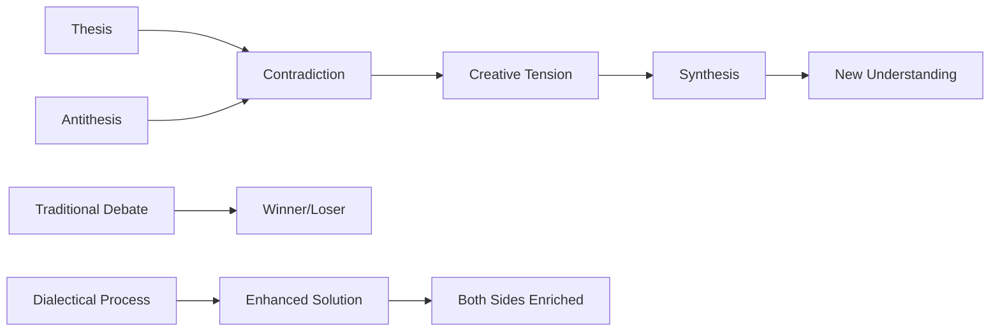
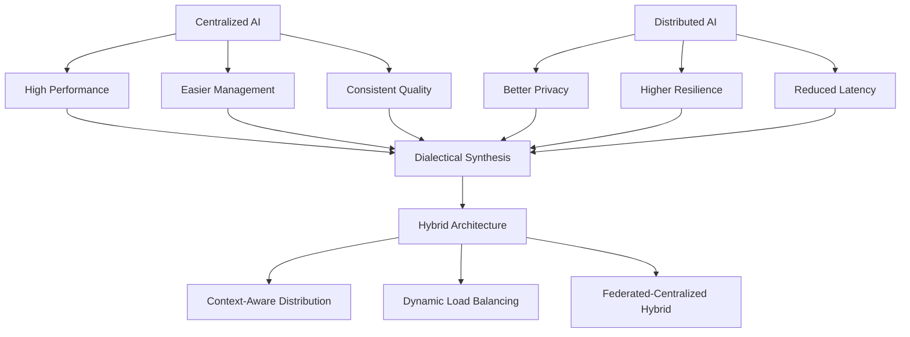

# 🌀 Dialectical Reasoning

> **Transform conflict into innovation by systematically integrating opposing viewpoints into stronger solutions**

## 🎯 **What It Is**

Dialectical Reasoning is a sophisticated method of examining and resolving contradictions between ideas by synthesizing opposing viewpoints rather than simply choosing sides. Rooted in philosophy and enhanced by modern cognitive science, this approach seeks truth and innovation through structured dialogue, integration, and the creative tension between thesis and antithesis.

**Core Insight**: The most robust AI solutions often emerge not from winning debates, but from thoughtfully integrating seemingly contradictory perspectives into novel syntheses that transcend the original positions.

## ⚡ **The Philosophy Behind It**

### **Classical Dialectical Process**


**Key Principles:**
- **Contradiction as Creative Force**: Tensions reveal hidden assumptions and new possibilities
- **Both/And Thinking**: Seeking integration rather than elimination of opposing views
- **Emergent Solutions**: New approaches that couldn't be conceived from either position alone
- **Iterative Refinement**: Multiple cycles of thesis-antithesis-synthesis

## 🎯 **When to Use**

### **🧠 Complex AI Decision-Making**
- Choosing between competing AI architectures or approaches
- Balancing technical performance with ethical considerations
- Resolving trade-offs between accuracy, interpretability, and efficiency
- Integrating diverse stakeholder requirements and constraints

### **👥 Team Conflict Resolution**
- Navigating disagreements about AI product direction
- Reconciling different disciplinary perspectives (technical, business, ethical)
- Merging competing user research findings or market insights
- Aligning on AI governance and risk management approaches

### **🔬 Research and Innovation**
- Exploring contradictory research findings in AI/ML
- Developing novel approaches by combining opposing methodologies
- Addressing fundamental tensions in AI development (e.g., privacy vs. personalization)
- Creating breakthrough solutions through paradigm integration

## 🛠️ **The Three-Stage Dialectical Process**

### **1️⃣ Thesis Formation and Articulation**
```
Definition: Clearly articulate the initial position or approach

Process Steps:
1. Define the position comprehensively
2. Identify underlying assumptions and values
3. Gather supporting evidence and arguments
4. Acknowledge potential limitations
5. Specify conditions where this position works best

Example - AI Development Approach:
Thesis: "We should prioritize interpretable AI models for our healthcare application"

Supporting Arguments:
• Regulatory requirements favor explainable decisions
• Clinical users need to understand AI recommendations
• Interpretability builds trust with medical professionals
• Simpler models are easier to debug and maintain
• Transparency supports ethical AI principles

Underlying Assumptions:
• Interpretability is possible without significant performance loss
• Users will actually engage with explanations
• Current interpretability methods are sufficient
• Regulatory landscape will continue emphasizing explainability
```

### **2️⃣ Antithesis Development and Exploration**
```
Definition: Systematically develop the strongest possible opposing position

Process Steps:
1. Identify the fundamental opposition to the thesis
2. Develop the strongest possible counter-arguments
3. Explore different forms of opposition (practical, theoretical, ethical)
4. Find evidence that contradicts the thesis
5. Imagine scenarios where antithesis is clearly superior

Example - Continuing Healthcare AI:
Antithesis: "We should prioritize high-performance black-box models for our healthcare application"

Counter-Arguments:
• Performance differences can mean life-or-death outcomes
• Complex models capture subtle patterns humans miss
• Post-hoc interpretability methods are improving rapidly
• Most doctors already trust AI without full understanding
• Competitive advantage comes from superior performance, not explanations

Evidence Supporting Antithesis:
• Studies showing performance gaps between interpretable and complex models
• Research on physician AI adoption focusing on accuracy over explanations
• Examples of successful black-box AI in medical applications
• Evidence that post-hoc explanations can be as effective as intrinsic interpretability
```

### **3️⃣ Synthesis Creation and Integration**
```
Definition: Create novel solutions that integrate the best of both positions

Synthesis Strategies:
1. Identify core truths in both thesis and antithesis
2. Find complementary rather than contradictory elements
3. Develop hybrid approaches that satisfy both concerns
4. Create contextual solutions that apply different approaches situationally
5. Design meta-solutions that transcend the original debate

Example - Healthcare AI Synthesis:
Synthesis: "Adaptive interpretability system that balances performance and explainability based on context"

Integrated Solution:
• High-performance models for initial screening and pattern detection
• Interpretable models for final clinical decision support
• Dynamic explanation depth based on user expertise and situation criticality
• Confidence-based routing between interpretable and black-box systems
• Continuous learning system that improves both performance and interpretability
• Multi-layered explanation system (quick overview + detailed analysis on demand)

Novel Elements Not in Original Positions:
• Context-aware model selection
• User-adaptive explanation systems
• Performance-interpretability feedback loops
• Multi-model ensemble approaches
```

## 🧠 **Advanced Dialectical Techniques**

### **🔄 Multi-Dimensional Dialectics**

**Beyond Binary Opposition:**
```python
class MultiDimensionalDialectic:
    def __init__(self, decision_context):
        self.context = decision_context
        self.dimensions = {}
        self.positions = {}
        self.syntheses = {}
    
    def map_opposition_dimensions(self):
        dimensions = {
            "technical_performance": {
                "thesis": "Optimize for maximum accuracy",
                "antithesis": "Optimize for robustness and reliability",
                "underlying_tension": "Peak performance vs. consistent performance"
            },
            
            "user_experience": {
                "thesis": "Maximize automation and efficiency", 
                "antithesis": "Maximize user control and understanding",
                "underlying_tension": "Efficiency vs. agency"
            },
            
            "business_model": {
                "thesis": "Focus on short-term competitive advantage",
                "antithesis": "Focus on long-term sustainability and trust",
                "underlying_tension": "Speed vs. stability"
            },
            
            "ethical_stance": {
                "thesis": "Maximize benefit for majority of users",
                "antithesis": "Ensure protection for vulnerable populations",
                "underlying_tension": "Utilitarian vs. deontological ethics"
            }
        }
        return dimensions
    
    def generate_synthesis_space(self):
        # Create multi-dimensional synthesis combining all dimensions
        synthesis_framework = {
            "contextual_optimization": "Performance metrics adapt to use case",
            "progressive_disclosure": "Automation with layered control options",
            "sustainable_innovation": "Competitive advantage through ethical leadership",
            "inclusive_benefit_maximization": "Majority benefit with minority protection safeguards"
        }
        return synthesis_framework
```

### **🎯 Stakeholder Dialectics**

**Integrating Multiple Perspectives:**
```python
def stakeholder_dialectical_process():
    stakeholder_positions = {
        "ai_engineers": {
            "primary_concern": "Technical elegance and performance",
            "typical_position": "Choose the most advanced ML approach available",
            "underlying_values": "Innovation, technical excellence, capability maximization"
        },
        
        "product_managers": {
            "primary_concern": "Market fit and user adoption",
            "typical_position": "Choose the approach that users will actually use",
            "underlying_values": "User value, market success, practical utility"
        },
        
        "compliance_team": {
            "primary_concern": "Risk management and regulatory compliance",
            "typical_position": "Choose the most auditable and explainable approach",
            "underlying_values": "Safety, accountability, regulatory compliance"
        },
        
        "business_leaders": {
            "primary_concern": "ROI and competitive positioning",
            "typical_position": "Choose the approach that drives business results",
            "underlying_values": "Profitability, market position, stakeholder value"
        }
    }
    
    # Dialectical synthesis process
    synthesis_approach = {
        "multi_criteria_optimization": "Solution that advances all stakeholder concerns",
        "phased_implementation": "Sequential approach that validates each stakeholder concern",
        "adaptive_framework": "System that can evolve to balance changing stakeholder priorities",
        "transparent_trade_offs": "Clear documentation of how different concerns are balanced"
    }
    
    return synthesis_approach
```

## 📈 **Practical Implementation Framework**

### **🎯 Structured Dialectical Sessions**

**Session Design Template:**
```python
def design_dialectical_session():
    session_framework = {
        "preparation_phase": {
            "duration": "1 week before session",
            "activities": [
                "Identify core tension or disagreement",
                "Assign thesis and antithesis advocates",
                "Gather supporting evidence for both positions",
                "Define success criteria for synthesis",
                "Prepare neutral facilitation questions"
            ]
        },
        
        "thesis_presentation": {
            "duration": "20 minutes",
            "structure": [
                "Position statement and core arguments",
                "Supporting evidence and examples",
                "Acknowledgment of limitations",
                "Conditions where this approach excels"
            ]
        },
        
        "antithesis_presentation": {
            "duration": "20 minutes",
            "structure": [
                "Counter-position and opposing arguments",
                "Evidence contradicting the thesis",
                "Alternative frameworks and approaches",
                "Scenarios where antithesis is superior"
            ]
        },
        
        "dialectical_exploration": {
            "duration": "40 minutes",
            "techniques": [
                "Question underlying assumptions of both positions",
                "Explore common ground and shared values",
                "Identify complementary rather than contradictory elements",
                "Generate creative alternatives that integrate both views"
            ]
        },
        
        "synthesis_development": {
            "duration": "30 minutes",
            "outputs": [
                "Integrated solution that addresses both concerns",
                "Implementation approach that phases different elements",
                "Success metrics that satisfy all stakeholders",
                "Next steps for testing and validation"
            ]
        }
    }
    return session_framework
```

### **🔧 Dialectical Questioning Techniques**

**Progressive Inquiry Framework:**
```python
class DialecticalQuestionFramework:
    def __init__(self):
        self.question_categories = {
            "assumption_exploration": [
                "What assumptions underlie each position?",
                "What would need to be true for each approach to be optimal?",
                "What contexts or conditions favor each position?"
            ],
            
            "evidence_examination": [
                "What evidence supports each position?",
                "What evidence contradicts or challenges each position?",
                "What additional evidence would strengthen either position?"
            ],
            
            "value_alignment": [
                "What values or priorities drive each position?",
                "Where do these values align or conflict?",
                "How might we honor both sets of values simultaneously?"
            ],
            
            "constraint_analysis": [
                "What constraints make each position challenging?",
                "How might we remove or work around these constraints?",
                "What new constraints does each position introduce?"
            ],
            
            "integration_possibilities": [
                "How might these positions complement rather than compete?",
                "What would a solution look like that combines the best of both?",
                "What new possibilities emerge when we integrate these views?"
            ]
        }
    
    def generate_synthesis_questions(self, thesis, antithesis):
        synthesis_questions = [
            f"What if we could achieve {thesis.core_benefit} AND {antithesis.core_benefit}?",
            f"How might the strength of {thesis} address the weakness of {antithesis}?",
            f"What context-dependent approach could apply {thesis} in some situations and {antithesis} in others?",
            f"What meta-solution could dynamically balance {thesis} and {antithesis} based on real-time conditions?"
        ]
        return synthesis_questions
```

## 🌟 **Advanced Applications in AI Development**

### **🤖 AI Ethics Dialectics**

**Example: Privacy vs. Personalization**
```python
def privacy_personalization_dialectic():
    dialectical_analysis = {
        "thesis": {
            "position": "Maximize data collection for personalization",
            "arguments": [
                "Better user experience through tailored recommendations",
                "More effective AI models with richer training data",
                "Competitive advantage through superior personalization",
                "User consent can address privacy concerns"
            ],
            "evidence": [
                "Studies showing correlation between data richness and model performance",
                "User satisfaction metrics for personalized vs. generic experiences",
                "Market success of highly personalized platforms"
            ]
        },
        
        "antithesis": {
            "position": "Minimize data collection to protect privacy",
            "arguments": [
                "Fundamental right to privacy and data protection",
                "Risk of data breaches and misuse",
                "Regulatory compliance and legal requirements",
                "Trust building through privacy-first approach"
            ],
            "evidence": [
                "Privacy regulation trends (GDPR, CCPA, etc.)",
                "Data breach costs and reputational damage",
                "User surveys showing privacy concerns",
                "Success of privacy-focused alternatives"
            ]
        },
        
        "synthesis": {
            "integrated_solution": "Differential privacy with user-controlled personalization",
            "key_innovations": [
                "Federated learning for personalization without central data collection",
                "User-controlled privacy budgets with transparency",
                "Contextual privacy adaptation based on data sensitivity",
                "Privacy-preserving personalization techniques",
                "Layered consent with granular control"
            ],
            "implementation": [
                "Technical: Implement differential privacy and federated learning",
                "UX: Design intuitive privacy controls and explanations", 
                "Legal: Develop privacy-first terms and compliance framework",
                "Business: Create value propositions that emphasize both personalization and privacy"
            ]
        }
    }
    return dialectical_analysis
```

### **🔬 Technical Architecture Dialectics**

**Example: Centralized vs. Distributed AI Systems**


**Synthesis Framework:**
```python
def ai_architecture_synthesis():
    hybrid_approach = {
        "core_intelligence": "Centralized foundation models for complex reasoning",
        "edge_processing": "Distributed inference for low-latency, privacy-sensitive tasks",
        "adaptive_routing": "Dynamic decision on where to process based on:",
        
        "routing_criteria": {
            "data_sensitivity": "Personal data stays local, general queries go central",
            "latency_requirements": "Real-time needs use edge, complex analysis uses cloud",
            "computational_complexity": "Simple tasks local, complex tasks centralized",
            "connectivity_status": "Offline capability through local models"
        },
        
        "learning_integration": {
            "local_adaptation": "Edge models fine-tune to user patterns",
            "global_improvement": "Federated learning improves central models",
            "privacy_preservation": "Differential privacy in federated updates",
            "quality_assurance": "Central validation of distributed improvements"
        }
    }
    return hybrid_approach
```

### **📊 Product Strategy Dialectics**

**Example: Speed vs. Quality in AI Development**
```python
def speed_quality_dialectic():
    strategic_synthesis = {
        "traditional_trade_off": "Choose between fast delivery OR high quality",
        
        "dialectical_reframing": "How can we achieve speed THROUGH quality practices?",
        
        "synthesis_approaches": {
            "quality_automation": {
                "concept": "Automate quality practices to enable speed",
                "implementation": [
                    "Automated testing pipelines for ML models",
                    "Continuous integration with quality gates",
                    "Automated bias detection and mitigation",
                    "Real-time performance monitoring"
                ]
            },
            
            "iterative_quality": {
                "concept": "Build quality through rapid iteration cycles",
                "implementation": [
                    "MVP with quality foundations",
                    "User feedback loops for quality definition",
                    "Incremental quality improvements",
                    "Quality metrics that drive speed"
                ]
            },
            
            "contextual_standards": {
                "concept": "Adapt quality standards to context and risk",
                "implementation": [
                    "High quality for high-risk components",
                    "Rapid prototyping for low-risk experiments",
                    "Progressive quality enhancement",
                    "Risk-based quality allocation"
                ]
            }
        }
    }
    return strategic_synthesis
```

## 🚨 **Common Pitfalls and How to Avoid Them**

### **❌ Anti-Patterns**

**1. False Dialectics**
```
❌ Creating artificial opposition where none exists
✅ Focus on genuine tensions with real trade-offs

Example:
❌ False: "AI should be explainable vs. AI should be accurate"
✅ Real: "How do we optimize for both explainability and accuracy given current constraints?"
```

**2. Premature Synthesis**
```
❌ Rushing to compromise before fully exploring each position
✅ Deeply understand each perspective before attempting integration

Process: Spend 70% of time understanding positions, 30% creating synthesis
```

**3. Superficial Integration**
```
❌ Simple averaging or splitting the difference
✅ Creative synthesis that transcends original positions

❌ Bad: "Use interpretable models 50% of the time, black-box 50% of the time"
✅ Good: "Develop adaptive system that chooses optimal approach based on context"
```

**4. Avoiding Difficult Tensions**
```
❌ Choosing easy-to-resolve disagreements over fundamental conflicts
✅ Tackle the core tensions that matter most for success

Focus on tensions that are: Important, persistent, and blocking progress
```

### **🛡️ Quality Assurance Framework**

**Dialectical Process Validation:**
```python
def validate_dialectical_process():
    quality_checks = {
        "position_quality": {
            "thesis_strength": "Is the thesis clearly articulated and well-supported?",
            "antithesis_strength": "Is the antithesis a genuine challenge, not a straw man?", 
            "evidence_quality": "Is both positions backed by solid evidence?",
            "assumption_identification": "Are underlying assumptions explicit?"
        },
        
        "process_integrity": {
            "good_faith_exploration": "Are participants genuinely exploring both sides?",
            "intellectual_honesty": "Are participants willing to change positions based on evidence?",
            "creative_thinking": "Are novel possibilities being generated?",
            "time_allocation": "Is adequate time spent on each phase?"
        },
        
        "synthesis_quality": {
            "genuine_integration": "Does synthesis combine both positions meaningfully?",
            "novel_elements": "Are new possibilities created that weren't in original positions?",
            "practical_viability": "Can the synthesis be implemented in reality?",
            "stakeholder_satisfaction": "Does synthesis address core concerns of all parties?"
        }
    }
    return quality_checks
```

## 📊 **Measurement and Success Metrics**

### **🎯 Process Quality Metrics**

**Dialectical Session Effectiveness:**
```python
def measure_dialectical_effectiveness():
    process_metrics = {
        "exploration_depth": {
            "assumption_identification": "Number of assumptions surfaced and examined",
            "evidence_quality": "Strength and diversity of evidence considered",
            "perspective_breadth": "Range of viewpoints explored",
            "question_quality": "Depth and insight of questions asked"
        },
        
        "synthesis_innovation": {
            "novelty_score": "How original is the synthesized solution?",
            "integration_completeness": "How well does synthesis address both positions?",
            "feasibility_assessment": "How implementable is the synthesized approach?",
            "stakeholder_buy_in": "Level of agreement and commitment to synthesis"
        },
        
        "learning_outcomes": {
            "perspective_shifts": "Changes in participant viewpoints",
            "understanding_depth": "Increased comprehension of complex issues",
            "relationship_improvement": "Better working relationships among participants",
            "future_collaboration": "Improved ability to handle future disagreements"
        }
    }
    return process_metrics
```

### **📈 Decision Quality Outcomes**

**Long-term Impact Assessment:**
```python
def assess_dialectical_impact():
    impact_metrics = {
        "decision_robustness": {
            "stakeholder_satisfaction": "How well does solution satisfy all parties?",
            "implementation_success": "How smoothly is synthesis being executed?",
            "adaptation_capability": "How well does solution adapt to changing conditions?",
            "unintended_consequences": "What unexpected outcomes emerged?"
        },
        
        "innovation_generation": {
            "breakthrough_solutions": "Solutions that wouldn't have emerged from individual positions",
            "creative_approaches": "Novel methods or frameworks developed",
            "competitive_advantage": "Unique market positioning achieved",
            "intellectual_property": "Patentable or proprietary innovations created"
        },
        
        "organizational_capability": {
            "conflict_resolution_skills": "Improved team ability to handle disagreements",
            "complex_thinking": "Enhanced capability for nuanced problem-solving",
            "collaboration_quality": "Better cross-functional team performance",
            "decision_confidence": "Increased confidence in complex decisions"
        }
    }
    return impact_metrics
```

## 🔗 **Integration with Other Mental Models**

### **🧠 Complementary Frameworks**

**Synergistic Combinations:**
- **[[Socratic Questioning]]**: Use inquiry to deepen exploration of each position
- **[[Devil's Advocate]]**: Systematically challenge both thesis and antithesis
- **[[First Principles Thinking]]**: Break down positions to fundamental assumptions
- **[[Systems Thinking]]**: Consider broader system implications of synthesis
- **[[Design Thinking]]**: Apply human-centered approach to dialectical solutions

**Integration Examples:**
```python
def integrate_dialectical_with_design_thinking():
    integrated_process = {
        "empathize_phase": {
            "dialectical_application": "Understand opposing user needs and pain points",
            "synthesis_opportunity": "Find solutions that address contradictory user needs"
        },
        
        "define_phase": {
            "dialectical_application": "Frame problems as tensions rather than binary choices",
            "synthesis_opportunity": "Define challenge as integration rather than selection"
        },
        
        "ideate_phase": {
            "dialectical_application": "Generate ideas from thesis, antithesis, AND synthesis",
            "synthesis_opportunity": "Create novel solutions that transcend original constraints"
        },
        
        "prototype_phase": {
            "dialectical_application": "Test both competing approaches simultaneously",
            "synthesis_opportunity": "Prototype integrated solutions"
        },
        
        "test_phase": {
            "dialectical_application": "Validate synthesis against both original positions",
            "synthesis_opportunity": "Demonstrate superior outcomes through integration"
        }
    }
    return integrated_process
```

## 🎯 **Advanced Mastery Guide**

### **📈 Skill Development Progression**

**Level 1: Basic Dialectical Thinking**
- Recognize when dialectical approach is appropriate
- Articulate thesis and antithesis clearly
- Facilitate basic synthesis discussions

**Level 2: Systematic Application**
- Design structured dialectical processes
- Handle multi-dimensional conflicts
- Create genuine synthesis rather than compromise

**Level 3: Advanced Facilitation**
- Guide complex stakeholder dialectics
- Manage emotional and political tensions
- Integrate dialectical thinking with other frameworks

**Level 4: Strategic Integration**
- Apply dialectics to organizational strategy
- Use dialectical processes for innovation
- Build dialectical thinking into company culture

**Level 5: Mastery and Teaching**
- Train others in dialectical reasoning
- Develop new dialectical methodologies
- Create systems that institutionalize dialectical thinking

### **🛠️ Advanced Practice Techniques**

**Dialectical Thinking Exercises:**
```python
def advanced_dialectical_exercises():
    exercises = {
        "daily_dialectics": {
            "morning_reflection": "Identify one assumption you're making and explore its opposite",
            "decision_dialectics": "For major decisions, articulate the strongest case against your preferred option",
            "conflict_reframing": "When facing disagreement, ask 'How might both sides be right?'"
        },
        
        "team_practices": {
            "red_team_blue_team": "Assign teams to argue opposing positions then synthesize",
            "assumption_challenges": "Regular sessions to challenge project assumptions dialectically",
            "stakeholder_dialectics": "Map and integrate competing stakeholder perspectives"
        },
        
        "strategic_applications": {
            "competitive_analysis": "Use dialectical thinking to understand competitor strategies",
            "market_positioning": "Find synthesis positions that transcend competitive dimensions",
            "innovation_dialectics": "Combine seemingly incompatible technologies or approaches"
        }
    }
    return exercises
```

## 🏆 **Success Stories and Case Studies**

### **Case Study 1: AI Model Selection Dialectic**

**Context**: Team split between interpretable vs. high-performance models
**Dialectical Process**:
- Thesis: "Use interpretable models for regulatory compliance and user trust"
- Antithesis: "Use black-box models for superior accuracy and competitive advantage"
- Synthesis: "Adaptive interpretability system with context-aware model selection"

**Outcome**: Developed hybrid system that outperformed both original approaches, achieving 95% of black-box accuracy with interpretable explanations when needed.

### **Case Study 2: Product Strategy Dialectic**

**Context**: Disagreement between rapid feature development vs. platform stability
**Dialectical Integration**:
- Combined rapid iteration with robust infrastructure
- Created modular architecture enabling fast feature development
- Implemented automated quality gates that enabled speed through reliability

**Result**: 3x faster feature development with 50% fewer production issues

## 🚀 **Takeaways and Next Steps**

### **Key Insights**
1. **Conflict contains creativity** - Tensions between positions often reveal breakthrough opportunities
2. **Both/and thinking surpasses either/or** - Integration creates solutions superior to either original position
3. **Process matters as much as outcome** - How you conduct dialectical reasoning affects quality of results
4. **Synthesis requires genuine exploration** - Superficial compromise isn't dialectical synthesis

### **Implementation Roadmap**
1. **Identify Key Tensions** - Find the most important unresolved conflicts in your AI projects
2. **Practice Dialectical Sessions** - Start with low-stakes disagreements to build skills
3. **Develop Facilitation Capabilities** - Learn to guide others through dialectical processes
4. **Integrate with Decision Processes** - Build dialectical thinking into standard workflows
5. **Measure and Improve** - Track the quality and impact of dialectical decisions

**Start Today:**
- Identify one current disagreement or tension in your AI project
- Articulate the strongest possible case for each side
- Ask: "How might both positions be true in different contexts?"
- Generate three potential synthesis approaches that integrate both views
- Test one synthesis approach in a small experiment

Remember: **The goal isn't to eliminate disagreement, but to transform it into innovation through thoughtful integration of opposing perspectives.**
