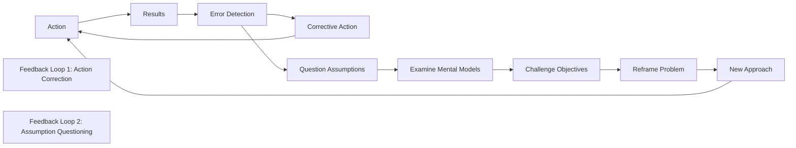

# 🔄 Double-Loop Learning

> **Transform failures into wisdom by questioning not just what you do, but why you do it**

## 🎯 **What It Is**

Double-Loop Learning is a transformative learning methodology developed by organizational theorist Chris Argyris that goes beyond fixing immediate problems to question and modify the underlying assumptions, values, and mental models that created those problems in the first place. Unlike single-loop learning (which asks "How can we do this better?"), double-loop learning asks "Should we be doing this at all?" This deeper level of inquiry enables organizations and individuals to adapt fundamentally rather than just incrementally, making it essential for navigating complex AI development challenges and rapidly changing technological landscapes.

**Core Insight**: True learning happens when we question our assumptions, not just our actions. In AI development, this means examining not only how to build better models, but whether we're solving the right problems with the right approaches.

## ⚡ **The Learning Architecture**

### **Single-Loop vs. Double-Loop Learning**


**The Two Learning Loops:**
- **Single-Loop**: Error detection → Action correction → Continue with same assumptions
- **Double-Loop**: Error detection → Question assumptions → Examine mental models → Reframe approach

## 🎯 **When to Use**

### **🔄 Persistent Problem Patterns**
- When the same types of problems keep recurring despite fixes
- When solutions create new problems elsewhere in the system
- When incremental improvements aren't delivering expected results
- When facing unprecedented challenges that require new thinking

### **🚀 Innovation and Transformation**
- During major AI system redesigns or architecture changes
- When adopting new AI methodologies or frameworks
- When shifting organizational AI strategy or focus
- When entering new domains or applications for AI

### **🎯 Strategic Reflection and Planning**
- During retrospectives that reveal systemic issues
- When evaluating AI project success and failure patterns
- When facing ethical dilemmas or unintended consequences
- When preparing for significant technological or market shifts

## 🧠 **The Double-Loop Learning Framework**

### **1️⃣ Surface-Level Learning vs. Deep Learning**
```
Single-Loop Learning (Adaptive):
• Focuses on techniques, methods, and procedures
• Asks: "How can we do this better?"
• Example: Improving model accuracy through better hyperparameters
• Result: Incremental improvements within existing framework

Double-Loop Learning (Generative):
• Focuses on assumptions, values, and objectives
• Asks: "Why are we doing this? Should we do it differently?"
• Example: Questioning whether accuracy is the right metric for this problem
• Result: Fundamental shifts in approach and understanding

AI Development Examples:
Single-Loop: "Our model has low accuracy → Let's try different algorithms"
Double-Loop: "Our model has low accuracy → Is accuracy the right measure? 
Are we solving the right problem? Are our assumptions about user needs correct?"

Deep Learning Questions:
• What assumptions underlie our current approach?
• Why do we believe this is the right problem to solve?
• What mental models are guiding our decisions?
• How might our biases be affecting our problem definition?
• What would success look like if we started fresh?
```

### **2️⃣ Assumption Excavation Process**
```
Level 1: Explicit Assumptions (Stated)
• Documented requirements and constraints
• Stated project objectives and success criteria
• Explicit technical choices and trade-offs
• Publicly acknowledged limitations and risks

Level 2: Implicit Assumptions (Unstated but Recognized)
• Unspoken expectations about user behavior
• Assumed technical capabilities and limitations
• Unstated organizational priorities and values
• Implicit time and resource constraints

Level 3: Unconscious Assumptions (Hidden)
• Deep-seated beliefs about how technology should work
• Cultural biases about problem-solving approaches
• Unexamined mental models about user needs
• Invisible assumptions about what constitutes value

Excavation Techniques:
• Five Whys: Repeatedly ask "why" to uncover root assumptions
• Pre-mortem Analysis: Imagine failure and work backward to assumptions
• Perspective Taking: View situation from different stakeholder angles
• Historical Analysis: Examine how similar problems were framed previously
• Cross-cultural Questioning: Challenge cultural assumptions through diverse perspectives

Example - AI Recommendation System:
Explicit: "Users want personalized recommendations"
Implicit: "More personalization always leads to better user experience"
Unconscious: "Technology should optimize for engagement over user wellbeing"

Double-Loop Question: "Should we be optimizing for engagement, or should we question whether maximum engagement serves users' best interests?"
```

### **3️⃣ Mental Model Reconstruction**
```
Current Mental Model Analysis:
• Identify the mental model currently guiding decisions
• Map connections between beliefs, assumptions, and actions
• Examine origins of current mental model (experience, training, culture)
• Assess effectiveness of current model in current context

Alternative Mental Model Generation:
• Brainstorm alternative ways to understand the problem
• Consider mental models from other domains or disciplines
• Challenge fundamental categorizations and distinctions
• Explore paradoxical or counter-intuitive perspectives

Mental Model Testing:
• What predictions does each mental model make?
• How would decisions differ under different mental models?
• What evidence would support or refute each model?
• Which model better explains past outcomes and patterns?

Example - AI Bias Problem:
Current Mental Model: "Bias is a technical problem requiring technical solutions"
Alternative Model: "Bias is a socio-technical problem requiring systemic change"
Testing: Compare effectiveness of technical vs. socio-technical interventions

Double-Loop Application:
Instead of just "How do we reduce bias?" ask "What assumptions about bias, fairness, and AI systems need to be questioned? Are we framing the bias problem in the most useful way?"
```

### **4️⃣ Organizational Learning Integration**
```
Individual Double-Loop Learning:
• Personal assumption examination and mental model updating
• Individual skill development in questioning and reflection
• Personal practice of hypothesis testing and assumption validation
• Individual commitment to continuous assumption challenging

Team Double-Loop Learning:
• Collective assumption surfacing and examination
• Team mental model sharing and integration
• Collaborative reframing of problems and approaches
• Team norm development around assumption questioning

Organizational Double-Loop Learning:
• Institutional assumption auditing and updating
• Organizational mental model evolution and adaptation
• Systemic reframing of strategic approaches and priorities
• Cultural norm embedding around double-loop thinking

Implementation Framework:
• Create psychological safety for assumption questioning
• Establish regular assumption review and challenge processes
• Build assumption-testing into project methodologies
• Reward deep questioning and fundamental innovation
• Measure learning through assumption evolution tracking
```

## 🛠️ **Practical Implementation Framework**

### **🎯 Structured Double-Loop Process**

**The QARA Framework (Question-Assume-Reframe-Act):**
```python
class DoubleLooplearningSysten:
    def __init__(self):
        self.learning_levels = self.define_learning_taxonomy()
        self.assumption_categories = self.categorize_assumption_types()
        self.reframing_techniques = self.establish_reframing_methods()
    
    def conduct_double_loop_analysis(self, problem_situation):
        analysis_steps = {
            "question_phase": self.generate_deep_questions(problem_situation),
            "assume_phase": self.excavate_assumptions(problem_situation),
            "reframe_phase": self.explore_alternative_frames(problem_situation),
            "act_phase": self.design_experimental_actions(problem_situation)
        }
        
        return analysis_steps
    
    def generate_deep_questions(self, situation):
        question_categories = {
            "purpose_questions": [
                "Why are we trying to solve this problem?",
                "What would happen if we ignored this problem?",
                "Who benefits from the current problem definition?",
                "What problem are we really trying to solve?"
            ],
            
            "assumption_questions": [
                "What are we taking for granted about this situation?",
                "What would we need to believe for our current approach to make sense?",
                "What assumptions would someone from a different culture make?",
                "How might our past experience be limiting our thinking?"
            ],
            
            "alternative_questions": [
                "How might this problem be completely different than we think?",
                "What if the opposite of our approach was correct?",
                "How would this look from the perspective of [different stakeholder]?",
                "What would we do if we had unlimited resources? No resources?"
            ],
            
            "consequence_questions": [
                "What are the unintended consequences of our current approach?",
                "How might our solution create new problems?",
                "What are we optimizing for, and should we be?",
                "How will this approach affect stakeholders we haven't considered?"
            ]
        }
        
        return question_categories
    
    def excavate_assumptions(self, situation):
        assumption_mining = {
            "explicit_assumptions": self.identify_stated_assumptions(situation),
            "implicit_assumptions": self.uncover_unstated_assumptions(situation),
            "unconscious_assumptions": self.reveal_hidden_assumptions(situation),
            "assumption_validation": self.test_assumption_validity(situation)
        }
        
        return assumption_mining
    
    def explore_alternative_frames(self, situation):
        reframing_approaches = {
            "domain_transfer": "How would other industries/fields approach this?",
            "stakeholder_reversal": "What if users/customers were in charge?",
            "constraint_removal": "What if our major constraints didn't exist?",
            "time_shifting": "How would we approach this in 1990? 2040?",
            "value_inversion": "What if we optimized for the opposite outcome?",
            "system_boundary_shift": "What if we expanded/contracted the system boundary?"
        }
        
        return reframing_approaches
```

### **📊 Double-Loop Learning in AI Projects**

**AI-Specific Double-Loop Applications:**
```python
def apply_double_loop_to_ai_development():
    ai_learning_scenarios = {
        "model_performance_issues": {
            "single_loop_response": "Try different algorithms, tune hyperparameters, get more data",
            "double_loop_questions": [
                "Are we measuring the right performance metrics?",
                "Is this the right problem to be solving?",
                "What assumptions about user needs are we making?",
                "How might our definition of 'performance' be limiting us?"
            ],
            "potential_reframes": [
                "From accuracy optimization to user value optimization",
                "From technical performance to social impact",
                "From model-centric to human-AI collaboration focus",
                "From prediction to decision support"
            ]
        },
        
        "user_adoption_challenges": {
            "single_loop_response": "Improve UI, add features, provide training",
            "double_loop_questions": [
                "Why aren't users adopting despite good technology?",
                "What assumptions about user motivation are we making?",
                "Are we solving a problem users actually have?",
                "How might our understanding of 'adoption' be limited?"
            ],
            "potential_reframes": [
                "From feature-driven to outcome-driven design",
                "From technology push to user pull",
                "From individual adoption to organizational change",
                "From tool replacement to workflow transformation"
            ]
        },
        
        "ethical_ai_concerns": {
            "single_loop_response": "Add bias detection, improve fairness metrics, increase transparency",
            "double_loop_questions": [
                "What values are embedded in our AI system design?",
                "Who gets to define what counts as 'fair' or 'ethical'?",
                "How might our technical framing limit ethical considerations?",
                "What power dynamics are we inadvertently reinforcing?"
            ],
            "potential_reframes": [
                "From technical bias to systemic justice",
                "From algorithmic fairness to participatory design",
                "From compliance to empowerment",
                "From individual protection to collective wellbeing"
            ]
        },
        
        "ai_project_failures": {
            "single_loop_response": "Better project management, more resources, clearer requirements",
            "double_loop_questions": [
                "Why do we keep having similar project failures?",
                "What assumptions about AI project success are we making?",
                "How might our project methodology be mismatched to AI development?",
                "What would success look like if we completely reframed it?"
            ],
            "potential_reframes": [
                "From delivery-focused to learning-focused projects",
                "From technology deployment to capability building",
                "From linear development to experimental iteration",
                "From success/failure binary to continuous value creation"
            ]
        }
    }
    
    return ai_learning_scenarios

def implement_organizational_double_loop_learning():
    organizational_practices = {
        "retrospective_enhancement": {
            "traditional_retrospective": "What went well? What didn't? What should we do differently?",
            "double_loop_retrospective": [
                "What assumptions guided our decisions?",
                "How might our problem framing have limited us?",
                "What beliefs about success/failure need questioning?",
                "How could we have thought about this problem completely differently?"
            ]
        },
        
        "strategic_planning_integration": {
            "traditional_planning": "Set goals, identify strategies, allocate resources",
            "double_loop_planning": [
                "Why are these the right goals?",
                "What assumptions underlie our strategic choices?",
                "How might our mental model of the market/technology be wrong?",
                "What would we do if our core beliefs about AI were incorrect?"
            ]
        },
        
        "innovation_process_design": {
            "traditional_innovation": "Generate ideas, evaluate, prototype, test",
            "double_loop_innovation": [
                "What assumptions about innovation are we making?",
                "How might our evaluation criteria limit breakthrough thinking?",
                "What would innovation look like if we started from different principles?",
                "How could we challenge our fundamental assumptions about value creation?"
            ]
        }
    }
    
    return organizational_practices
```

## 📈 **Advanced Applications in AI Development**

### **🤖 AI Research and Development Enhancement**

**Research Methodology Double-Loop Learning:**
```python
class AIResearchDoubleLoolearning:
    def __init__(self):
        self.research_assumptions = self.identify_research_paradigms()
        self.methodology_questioning = self.develop_methodology_critique()
    
    def apply_double_loop_to_research(self, research_project):
        double_loop_dimensions = {
            "problem_definition_questioning": {
                "current_approach": "Start with technical problem, find AI solution",
                "double_loop_questions": [
                    "Why is this the right problem to solve?",
                    "What assumptions about problem importance are we making?",
                    "How might our technical framing limit problem understanding?",
                    "What problems are we not seeing because of our approach?"
                ],
                "alternative_approaches": [
                    "Start with human needs, find appropriate technology",
                    "Start with system outcomes, work backward to interventions",
                    "Start with unintended consequences, design preventatively"
                ]
            },
            
            "methodology_assumption_challenging": {
                "current_approach": "Follow established ML research methodology",
                "double_loop_questions": [
                    "What assumptions about learning and intelligence underlie our methods?",
                    "How might our evaluation frameworks bias our conclusions?",
                    "What aspects of intelligence are we ignoring?",
                    "How might interdisciplinary approaches change our understanding?"
                ],
                "methodological_innovations": [
                    "Participatory research with affected communities",
                    "Longitudinal studies of AI impact over time",
                    "Qualitative research on AI experience and meaning",
                    "Systems research on AI ecosystem effects"
                ]
            },
            
            "success_metric_reframing": {
                "current_approach": "Optimize technical performance metrics",
                "double_loop_questions": [
                    "What values are embedded in our success metrics?",
                    "How might our metrics incentivize unintended outcomes?",
                    "What important outcomes are we not measuring?",
                    "How would different stakeholders define success?"
                ],
                "alternative_metrics": [
                    "Human flourishing and wellbeing measures",
                    "Ecosystem health and sustainability indicators",
                    "Social justice and equity assessments",
                    "Long-term value creation for multiple stakeholders"
                ]
            }
        }
        
        return double_loop_dimensions
    
    def facilitate_research_paradigm_shifts(self):
        paradigm_questioning = {
            "current_ai_paradigms": {
                "data_driven_assumption": "More data always leads to better AI",
                "scale_assumption": "Bigger models are always better",
                "automation_assumption": "Replacing humans with AI is always desirable",
                "optimization_assumption": "AI should optimize single objective functions"
            },
            
            "alternative_paradigms": {
                "data_wisdom": "Quality and relevance matter more than quantity",
                "human_scale": "Right-sized solutions for specific contexts",
                "augmentation": "AI as partner rather than replacement",
                "multi_objective": "AI that balances multiple, sometimes conflicting goals"
            },
            
            "paradigm_shift_facilitation": {
                "cross_disciplinary_dialogue": "Engage with humanities, social sciences, arts",
                "community_engagement": "Include affected communities in research design",
                "historical_perspective": "Learn from past technology adoption patterns",
                "future_scenario_planning": "Consider multiple possible AI futures"
            }
        }
        
        return paradigm_questioning
```

### **🔧 Product Development Double-Loop Learning**

**Product Strategy Assumption Testing:**
```python
def implement_product_double_loop_learning():
    product_learning_framework = {
        "user_need_assumption_testing": {
            "traditional_approach": "Survey users about features they want",
            "double_loop_approach": [
                "Why do users think they want these features?",
                "What underlying needs are these features supposed to address?",
                "How might our framing of the problem influence user responses?",
                "What needs are users not aware they have?",
                "How might our product assumptions be shaping user expectations?"
            ],
            "alternative_research_methods": [
                "Ethnographic studies of user contexts and workflows",
                "Jobs-to-be-done analysis of deeper motivations",
                "Participatory design with users as co-creators",
                "Longitudinal studies of user behavior and adaptation"
            ]
        },
        
        "value_proposition_reframing": {
            "traditional_approach": "Define value based on competitive analysis and user surveys",
            "double_loop_questions": [
                "What assumptions about value are we making?",
                "How might different stakeholders define value differently?",
                "What unintended consequences might our value creation have?",
                "How could we create value we haven't thought of yet?"
            ],
            "value_reframing_exercises": [
                "Stakeholder value mapping beyond direct users",
                "Long-term vs. short-term value trade-off analysis",
                "Social and environmental value consideration",
                "Value network analysis including ecosystem effects"
            ]
        },
        
        "business_model_assumption_challenging": {
            "traditional_approach": "Optimize within established business model constraints",
            "double_loop_questions": [
                "Why is this the right business model for our AI solution?",
                "What assumptions about value capture are we making?",
                "How might our business model affect user behavior and outcomes?",
                "What business models would better align with user wellbeing?"
            ],
            "business_model_innovation": [
                "Stakeholder capitalism approaches to value distribution",
                "Open source and collaborative value creation models",
                "Impact-based rather than usage-based pricing",
                "Ecosystem orchestration rather than direct value capture"
            ]
        }
    }
    
    return product_learning_framework
```

## 🚨 **Common Double-Loop Learning Barriers**

### **❌ Organizational Anti-Patterns**

**1. Defensive Reasoning**
```
❌ Problem: Protecting existing assumptions and mental models from challenge
Example: "Our approach is proven and successful - why question it?"

Impact:
• Prevents examination of underlying assumptions
• Maintains status quo even when change is needed
• Creates resistance to fundamental learning and adaptation
• Leads to repeated failures with superficial fixes

Root Causes:
• Fear of admitting mistakes or uncertainty
• Investment in existing approaches and identities
• Pressure for quick fixes rather than deep understanding
• Organizational culture that punishes questioning authority

✅ Solution: Psychological safety and learning culture
Implementation:
• Reward assumption questioning and intellectual humility
• Separate identity from ideas to enable idea critique
• Create safe spaces for fundamental questioning
• Model vulnerability and learning from leadership
• Measure learning and adaptation, not just performance

Cultural Shifts:
• From "being right" to "getting it right"
• From expertise as knowing to expertise as learning
• From certainty as strength to curiosity as strength
• From protecting ideas to improving ideas
```

**2. Single-Loop Addiction**
```
❌ Problem: Organizational addiction to quick fixes and surface-level solutions
Example: Repeatedly addressing symptoms without examining root causes

Impact:
• Problems keep recurring in new forms
• Solutions create new problems elsewhere
• Resource waste on ineffective interventions
• Decreased confidence in organization's problem-solving ability

Root Causes:
• Pressure for immediate results and quick wins
• Lack of time or space for deeper reflection
• Reward systems that incentivize speed over depth
• Fear of the complexity that deeper questioning reveals

✅ Solution: Balanced learning approach
Implementation:
• Allocate dedicated time for double-loop reflection
• Balance immediate fixes with deeper learning
• Create learning objectives alongside performance objectives
• Build assumption questioning into standard processes
• Measure both problem resolution and learning depth

Process Integration:
• 70% single-loop (immediate fixes) / 30% double-loop (deep learning)
• Regular assumption review cycles alongside operational cycles
• Post-project learning sessions that go beyond what/how to why
• Strategic planning that includes assumption examination
```

**3. Complexity Avoidance**
```
❌ Problem: Avoiding the complexity and uncertainty that double-loop learning reveals
Example: Preferring simple explanations over complex, nuanced understanding

Impact:
• Oversimplified solutions to complex problems
• Missed opportunities for systemic improvement
• Inability to adapt to changing environments
• Reduced innovation and breakthrough thinking

Root Causes:
• Cognitive limitations in handling complexity
• Organizational pressure for clear, simple answers
• Fear of paralysis from too much analysis
• Lack of tools and methods for managing complexity

✅ Solution: Complexity navigation capability
Implementation:
• Develop systems thinking capabilities across organization
• Create frameworks for managing ambiguity and uncertainty
• Build comfort with iterative learning and experimentation
• Provide tools and methods for complexity analysis
• Celebrate complexity navigation as a core competency

Capability Building:
• Training in systems thinking and complexity science
• Scenario planning and multiple futures exploration
• Design thinking for navigating ambiguous problems
• Facilitation skills for complex group learning
```

### **🛡️ Creating Double-Loop Learning Culture**

**Organizational Design for Deep Learning:**
```python
def design_double_loop_learning_organization():
    organizational_elements = {
        "leadership_practices": {
            "modeling_vulnerability": {
                "practice": "Leaders openly share their assumption changes and learning",
                "implementation": "Regular 'assumption updates' from leadership team",
                "outcome": "Creates safety for others to question and learn"
            },
            
            "rewarding_deep_questions": {
                "practice": "Recognize and reward fundamental questioning, not just answers",
                "implementation": "Double-loop learning awards and recognition systems",
                "outcome": "Incentivizes assumption examination and mental model updating"
            },
            
            "time_protection": {
                "practice": "Protect time and space for reflection and deeper learning",
                "implementation": "Mandatory reflection time, learning sabbaticals",
                "outcome": "Enables the slower process of assumption examination"
            }
        },
        
        "structural_elements": {
            "learning_infrastructure": {
                "practice": "Build systems and processes that support double-loop learning",
                "implementation": "Assumption tracking systems, learning repositories",
                "outcome": "Makes learning visible and actionable"
            },
            
            "diverse_perspectives": {
                "practice": "Actively include diverse viewpoints in decision-making",
                "implementation": "Cross-functional teams, external advisors, user representation",
                "outcome": "Challenges groupthink and assumption homogeneity"
            },
            
            "experimental_mindset": {
                "practice": "Treat major decisions as experiments with learning objectives",
                "implementation": "Hypothesis-driven decision making, learning metrics",
                "outcome": "Enables assumption testing and mental model updating"
            }
        },
        
        "cultural_norms": {
            "intellectual_humility": {
                "practice": "Normalize changing minds and updating beliefs",
                "implementation": "Share stories of productive assumption changes",
                "outcome": "Reduces ego investment in being right"
            },
            
            "constructive_conflict": {
                "practice": "Encourage respectful challenging of ideas and assumptions",
                "implementation": "Devil's advocate roles, structured debate processes",
                "outcome": "Ensures assumptions get proper examination"
            },
            
            "learning_orientation": {
                "practice": "Focus on learning and improvement over blame and judgment",
                "implementation": "Learning-focused retrospectives, assumption audits",
                "outcome": "Creates psychological safety for admitting assumption errors"
            }
        }
    }
    
    return organizational_elements
```

## 📊 **Measurement and Assessment**

### **🎯 Double-Loop Learning Metrics**

**Learning Depth Assessment Framework:**
```python
def measure_double_loop_learning_effectiveness():
    learning_metrics = {
        "assumption_examination_indicators": {
            "frequency_measures": {
                "assumption_review_sessions": "Regular sessions dedicated to assumption examination",
                "fundamental_question_rate": "Frequency of 'why' questions vs. 'how' questions",
                "mental_model_updates": "Rate of explicit mental model changes and updates",
                "paradigm_challenge_instances": "Instances of questioning fundamental approaches"
            },
            
            "depth_measures": {
                "questioning_levels": "Progression from surface to deep assumption examination",
                "alternative_frame_generation": "Ability to generate multiple problem framings",
                "assumption_validation_rigor": "Quality of assumption testing and validation",
                "mental_model_sophistication": "Complexity and nuance of mental models"
            }
        },
        
        "learning_outcome_indicators": {
            "adaptive_capacity": {
                "problem_reframing_success": "Ability to solve problems through reframing",
                "innovation_breakthrough_rate": "Frequency of paradigm-shifting innovations",
                "assumption_error_recovery": "Speed of recovery from flawed assumptions",
                "environmental_adaptation": "Ability to adapt to changing contexts"
            },
            
            "organizational_learning": {
                "collective_mental_model_evolution": "Changes in shared organizational understanding",
                "cross_functional_assumption_sharing": "Assumption examination across silos",
                "institutional_memory_updating": "Evolution of organizational knowledge base",
                "culture_change_indicators": "Shifts toward learning-oriented culture"
            }
        },
        
        "behavioral_change_measures": {
            "decision_making_evolution": {
                "assumption_explicit_recognition": "Decisions that explicitly acknowledge assumptions",
                "alternative_consideration": "Systematic consideration of alternative approaches",
                "experimental_approach_adoption": "Treating decisions as experiments",
                "stakeholder_perspective_integration": "Including diverse viewpoints in decisions"
            },
            
            "problem_solving_transformation": {
                "root_cause_analysis_depth": "Going beyond symptoms to systemic causes",
                "solution_sophistication": "Solutions that address multiple levels of problems",
                "prevention_orientation": "Focus on preventing rather than fixing problems",
                "systemic_intervention_design": "Solutions that address system-level issues"
            }
        }
    }
    
    return learning_metrics

def assess_learning_culture_maturity():
    maturity_levels = {
        "level_1_reactive": {
            "characteristics": "Problems addressed through single-loop fixes only",
            "assumptions": "Rarely questioned or examined explicitly",
            "mental_models": "Implicit and unchanging",
            "culture": "Focused on being right and avoiding mistakes"
        },
        
        "level_2_adaptive": {
            "characteristics": "Some questioning of approaches and methods",
            "assumptions": "Occasionally surfaced and examined",
            "mental_models": "Some awareness and periodic updating",
            "culture": "Beginning to value learning from mistakes"
        },
        
        "level_3_generative": {
            "characteristics": "Regular assumption examination and mental model updating",
            "assumptions": "Systematically identified and tested",
            "mental_models": "Explicitly managed and evolved",
            "culture": "Strong learning orientation and intellectual humility"
        },
        
        "level_4_transformative": {
            "characteristics": "Continuous paradigm examination and innovation",
            "assumptions": "Proactively challenged and validated",
            "mental_models": "Dynamically adapted to context",
            "culture": "Learning as core organizational capability"
        },
        
        "level_5_evolutionary": {
            "characteristics": "Self-organizing learning systems and continuous evolution",
            "assumptions": "Automatically surfaced and tested by systems",
            "mental_models": "Collectively evolved and shared",
            "culture": "Learning organization that teaches others"
        }
    }
    
    return maturity_levels
```

## 🔗 **Integration with Other Mental Models**

### **🧠 Complementary Learning Frameworks**

**Synergistic Mental Models:**
- **[[Systems Thinking]]**: Understand interconnections that create recurring problems
- **[[First Principles Thinking]]**: Break down assumptions to fundamental truths
- **[[Scientific Method]]**: Hypothesis testing for assumption validation
- **[[Dialectical Reasoning]]**: Explore contradictions and paradoxes in thinking
- **[[Red Team Thinking]]**: Systematically challenge plans and assumptions

**Integration Examples:**
```python
def integrate_double_loop_with_other_frameworks():
    integrated_approaches = {
        "double_loop_plus_systems_thinking": {
            "assumption_mapping": "Map assumptions across system levels and stakeholders",
            "feedback_loop_analysis": "Identify how assumptions create reinforcing patterns",
            "leverage_point_identification": "Find where assumption changes have maximum impact",
            "unintended_consequence_prediction": "Anticipate systemic effects of assumption changes"
        },
        
        "double_loop_plus_first_principles": {
            "assumption_decomposition": "Break complex assumptions into fundamental components",
            "foundational_questioning": "Question assumptions back to basic principles",
            "rebuilding_from_basics": "Reconstruct understanding from ground up",
            "cross_domain_application": "Apply fundamental insights across contexts"
        },
        
        "double_loop_plus_scientific_method": {
            "hypothesis_driven_assumption_testing": "Test assumptions as formal hypotheses",
            "experimental_design_for_learning": "Design experiments to validate mental models",
            "evidence_based_belief_updating": "Change assumptions based on systematic evidence",
            "peer_review_for_assumption_examination": "Collective scrutiny of assumptions"
        }
    }
    
    return integrated_approaches
```

## 🎯 **Advanced Mastery Guide**

### **📈 Skill Development Progression**

**Level 1: Assumption Awareness**
- Recognize the difference between single-loop and double-loop learning
- Identify explicit assumptions in decisions and approaches
- Practice asking "why" questions beyond immediate causes

**Level 2: Systematic Questioning**
- Develop skill in surfacing implicit and unconscious assumptions
- Create frameworks for regular assumption examination
- Build comfort with uncertainty and complexity

**Level 3: Mental Model Management**
- Explicitly map and update personal and team mental models
- Facilitate assumption examination in groups and organizations
- Design processes that integrate double-loop learning

**Level 4: Cultural Transformation**
- Lead organizational culture change toward learning orientation
- Create systems and structures that support double-loop learning
- Mentor others in deep learning capabilities

**Level 5: Paradigm Innovation**
- Contribute to fundamental shifts in thinking about problems and solutions
- Research and develop new applications of double-loop learning
- Teach and spread double-loop learning capabilities broadly

### **🛠️ Practical Mastery Framework**

**Daily Double-Loop Practice:**
```python
def daily_double_loop_exercises():
    practice_framework = {
        "personal_assumption_journal": {
            "morning_assumption_identification": "Start day by identifying key assumptions guiding decisions",
            "evening_assumption_review": "Reflect on which assumptions were challenged or confirmed",
            "weekly_assumption_audit": "Review and update major life and work assumptions",
            "monthly_mental_model_evolution": "Document changes in fundamental mental models"
        },
        
        "professional_questioning_practice": {
            "meeting_assumption_surfacing": "In each meeting, identify one assumption to question",
            "project_assumption_documentation": "Explicitly capture and track project assumptions",
            "decision_assumption_analysis": "Before major decisions, examine underlying assumptions",
            "retrospective_assumption_learning": "Include assumption examination in all retrospectives"
        },
        
        "systematic_learning_design": {
            "experiment_design_for_assumption_testing": "Design small experiments to test key assumptions",
            "alternative_perspective_seeking": "Actively seek viewpoints that challenge your assumptions",
            "cross_domain_learning": "Study how other fields approach similar problems",
            "failure_analysis_for_assumption_errors": "When things go wrong, trace back to assumption failures"
        }
    }
    
    return practice_framework
```

## 🏆 **Success Stories and Case Studies**

### **Case Study 1: AI Startup Pivot Through Double-Loop Learning**

**Challenge**: AI startup burning through funding with technically impressive but commercially unsuccessful product
**Single-Loop Response**: Improve features, enhance performance, better marketing
**Double-Loop Intervention**:
- **Assumption Questioning**: "Why do we believe this is the right problem to solve?"
- **Mental Model Examination**: "How might our 'technology-first' mental model be limiting us?"
- **Reframing**: From "How do we make our AI better?" to "How do we create genuine value for users?"

**Outcome**: Complete business model pivot, 5x revenue growth, successful funding round

### **Case Study 2: Healthcare AI Ethics Through Double-Loop Learning**

**Challenge**: AI diagnostic tool showing bias against certain patient populations
**Single-Loop Response**: Adjust algorithms, balance training data, add fairness constraints
**Double-Loop Learning Process**:
- **Deep Questioning**: "What assumptions about healthcare and fairness underlie our system?"
- **Stakeholder Perspective**: "How do affected communities define fairness and appropriate care?"
- **System Reframing**: From "technical bias problem" to "healthcare justice opportunity"

**Result**: Participatory design process, community partnership model, improved health outcomes for underserved populations

## 🚀 **Takeaways and Next Steps**

### **Key Insights**
1. **Problems are often symptoms** - Surface issues usually indicate deeper assumption errors
2. **Assumptions shape everything** - Mental models determine what we see, think, and do
3. **Learning requires unlearning** - Growth means letting go of outdated mental models
4. **Culture enables deep learning** - Psychological safety is prerequisite for assumption examination

### **Implementation Roadmap**
1. **Personal Practice** - Develop individual assumption awareness and questioning skills
2. **Team Integration** - Build assumption examination into team processes and retrospectives
3. **Organizational Design** - Create structures and culture that support double-loop learning
4. **Systemic Application** - Apply double-loop learning to major strategic and operational challenges
5. **Continuous Evolution** - Build capability for ongoing assumption examination and mental model updating

**Start Today:**
- Identify one recurring problem in your work or life
- Ask "What assumptions must I hold for this problem to keep happening?"
- Generate at least three alternative ways to understand the problem
- Design a small experiment to test one of your key assumptions
- Share your learning with others and invite them to question your thinking

Remember: **Double-Loop Learning transforms not just what you do, but how you think. It's the difference between getting better at the wrong game and learning to play the right game entirely.**
