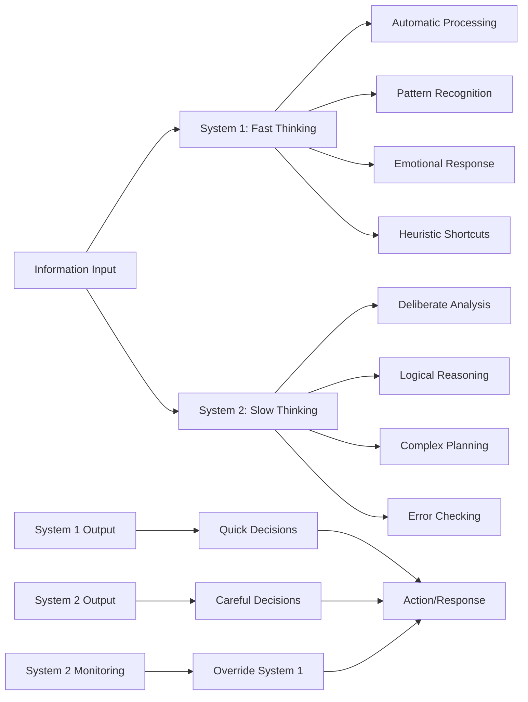

# 🔄 Dual Process Theory

> **Master the art of designing AI systems that harness both fast intuition and slow reasoning for optimal human-AI collaboration**

## 🎯 **What It Is**

Dual Process Theory is a foundational cognitive science model that describes human thinking as operating through two distinct but interconnected systems: System 1 (fast, automatic, intuitive) and System 2 (slow, deliberate, analytical). This theory, popularized by Nobel laureate Daniel Kahneman, provides profound insights into how humans make decisions, process information, and interact with complex systems. In the AI era, Dual Process Theory becomes essential for designing AI systems that complement human cognition, creating hybrid intelligence that leverages the strengths of both human thinking modes and artificial intelligence.

**Core Insight**: Human cognition isn't a single system but a dynamic interplay between fast, intuitive processing and slow, analytical reasoning. AI systems can be designed to support both modes, creating more effective human-AI partnerships.

## ⚡ **The Cognitive Architecture**

### **Dual System Framework**


**The Two Systems in Detail:**

**System 1 (Fast Thinking):**
- **Automatic**: Operates without conscious effort or intention
- **Associative**: Links ideas through memory associations
- **Emotional**: Influenced by current mood and feelings
- **Heuristic**: Uses mental shortcuts and rules of thumb
- **Pattern-based**: Recognizes familiar patterns quickly

**System 2 (Slow Thinking):**
- **Controlled**: Requires conscious effort and attention
- **Rule-based**: Follows logical rules and systematic procedures
- **Analytical**: Breaks down complex problems into components
- **Self-monitoring**: Can critique and override System 1 responses
- **Resource-intensive**: Mentally demanding and can be fatigued

## 🎯 **When to Use**

### **🤖 AI System Design and Architecture**
- Designing hybrid AI systems that combine fast heuristics with deep analysis
- Creating AI that adapts to different human decision-making modes
- Building AI systems that can operate at different speed-accuracy trade-offs
- Developing AI that supports both intuitive and analytical human processes

### **👥 Human-AI Interaction Design**
- Creating interfaces that support both quick actions and careful deliberation
- Designing AI explanations that match human thinking modes
- Building trust through appropriate transparency and automation levels
- Developing training programs that leverage natural human learning patterns

### **🎯 Decision Support and Automation**
- Determining when to automate decisions vs. require human oversight
- Creating escalation systems that engage human System 2 when needed
- Designing alerts and notifications that appropriately interrupt or support flow
- Building decision aids that enhance rather than replace human judgment

## 🧠 **Core System Characteristics and Applications**

### **1️⃣ System 1: Fast, Intuitive Processing**
```
Definition: Automatic, effortless mental processes that generate impressions, feelings, and inclinations

Key Characteristics:
• Speed: Operates in milliseconds to seconds
• Automaticity: Runs without conscious control or effort
• Emotional: Strongly influenced by current feelings and mood
• Associative: Links concepts through memory associations rather than logic
• Pattern Recognition: Excellent at recognizing familiar patterns and situations
• Confidence: Often generates strong confidence even with limited information

AI Applications and Design Implications:
• Quick Recommendations: AI systems that provide immediate suggestions and shortcuts
• Pattern Matching: AI that recognizes familiar situations and applies learned responses
• Emotional AI: Systems that detect and respond to human emotional states
• Intuitive Interfaces: UI/UX design that supports automatic, effortless interactions
• Predictive Systems: AI that anticipates user needs and pre-loads likely actions

Example - AI Email Assistant:
System 1 Support: Automatic email categorization, one-click responses to common emails, predictive text completion
User Experience: Users can quickly process emails without conscious effort, relying on AI to surface the most important messages and suggest appropriate responses
Design Principles: Minimal cognitive load, familiar patterns, immediate feedback, emotional awareness

Strengths in AI Context:
• Rapid decision-making for routine or familiar situations
• Excellent pattern recognition and similarity detection
• Natural language understanding based on context and experience
• Real-time adaptation to user behavior and preferences
• Seamless integration into user workflows without conscious effort

Limitations and Considerations:
• Susceptible to biases and systematic errors
• Overconfident in uncertain or novel situations
• Influenced by irrelevant emotional or contextual factors
• May miss important details that require careful analysis
• Can perpetuate existing biases present in training data or user behavior
```

### **2️⃣ System 2: Slow, Analytical Processing**
```
Definition: Controlled, effortful mental processes that enable complex reasoning, planning, and self-monitoring

Key Characteristics:
• Deliberate: Requires conscious effort and attention
• Logical: Follows systematic rules and procedures
• Sequential: Processes information step-by-step rather than holistically
• Self-aware: Can monitor and correct its own thinking processes
• Resource-intensive: Mentally demanding and subject to fatigue
• Accurate: More reliable for complex, novel, or high-stakes decisions

AI Applications and Design Implications:
• Complex Analysis: AI systems that provide deep, systematic analysis of complex problems
• Verification Systems: AI that checks and validates System 1 outputs for accuracy
• Planning Tools: AI that supports multi-step reasoning and long-term planning
• Explanation Systems: AI that provides detailed, logical explanations of its reasoning
• Error Detection: AI that identifies potential mistakes or biases in quick decisions

Example - AI Financial Planning Tool:
System 2 Support: Comprehensive financial analysis, scenario modeling, risk assessment, detailed explanations of recommendations
User Experience: Users engage in deliberate planning process, with AI providing systematic analysis and helping verify assumptions
Design Principles: Structured workflows, detailed explanations, verification steps, transparent reasoning

Strengths in AI Context:
• Accurate handling of complex, multi-variable problems
• Systematic error checking and bias detection
• Detailed explanation and justification of decisions
• Handling of novel situations requiring careful analysis
• Integration of multiple information sources and constraints

Limitations and Considerations:
• Slower processing speed, not suitable for real-time decisions
• Requires significant computational resources for complex reasoning
• May over-analyze simple situations where heuristics would suffice
• User fatigue when engaging System 2 processes extensively
• Risk of analysis paralysis in complex decision-making scenarios
```

### **3️⃣ System Interaction and Switching**
```
Definition: The dynamic interplay between fast and slow thinking, including when and how people switch between modes

Switching Triggers:
• Novelty: Unfamiliar situations automatically engage System 2
• Complexity: Problems beyond System 1's capacity trigger deliberate thinking
• Stakes: High-importance decisions motivate careful System 2 analysis
• Errors: Detected mistakes prompt System 2 monitoring and correction
• Time pressure: Urgent situations may force reliance on System 1
• Cognitive load: Mental fatigue reduces System 2 engagement

AI Design for System Switching:
• Adaptive Interfaces: UI that adjusts complexity based on user context and needs
• Smart Escalation: AI that recognizes when situations require human System 2 engagement
• Cognitive Load Management: Systems that balance automation with user control
• Context-Aware Assistance: AI that provides appropriate level of support based on situation
• Seamless Transitions: Smooth handoffs between quick actions and careful deliberation

Example - AI Medical Diagnosis Support:
System 1 Mode: Quick pattern recognition for routine cases, immediate red flags for emergency situations
System 2 Mode: Detailed differential diagnosis, systematic symptom analysis, evidence-based reasoning
Switching Logic: AI automatically escalates complex or uncertain cases to System 2 mode, provides cognitive aids for systematic analysis
User Control: Physicians can manually switch between modes, with AI supporting both quick clinical intuition and careful analytical reasoning

Effective Switching Design Principles:
• Clear mode indicators: Users understand which thinking mode is appropriate
• Smooth transitions: Moving between modes feels natural and effortless
• Appropriate defaults: System starts in the mode most likely to be effective
• User override: People can manually switch modes when they judge it necessary
• Context sensitivity: Mode selection considers situational factors and user preferences
```

## 🛠️ **Practical Implementation Framework**

### **🎯 Hybrid AI Architecture Design**

**The Dual Process AI Framework:**
```python
class DualProcessAISystem:
    def __init__(self):
        self.system_1_engine = self.build_fast_processing_system()
        self.system_2_engine = self.build_analytical_system()
        self.switching_logic = self.create_mode_switching_framework()
        self.user_interface = self.design_adaptive_interface()
    
    def process_request(self, user_input, context):
        processing_pipeline = {
            "initial_assessment": self.assess_processing_requirements(user_input, context),
            "mode_selection": self.select_appropriate_processing_mode(user_input, context),
            "system_1_processing": self.execute_fast_processing(user_input, context),
            "system_2_validation": self.validate_with_analytical_system(user_input, context),
            "response_generation": self.generate_mode_appropriate_response(user_input, context)
        }
        
        return processing_pipeline
    
    def build_fast_processing_system(self):
        system_1_components = {
            "pattern_recognition": {
                "neural_networks": "Deep learning models for rapid pattern detection",
                "similarity_matching": "Fast similarity search and nearest neighbor algorithms",
                "template_matching": "Pre-trained models for common scenario recognition",
                "heuristic_rules": "Fast decision rules based on common patterns"
            },
            
            "associative_processing": {
                "memory_networks": "Neural networks that leverage associative memory",
                "embedding_spaces": "Vector representations that capture semantic relationships",
                "context_vectors": "Rapid context understanding through pre-computed embeddings",
                "intuitive_reasoning": "Fast inference based on learned associations"
            },
            
            "emotional_processing": {
                "sentiment_analysis": "Rapid emotional state detection and response",
                "mood_modeling": "Understanding user emotional context",
                "affective_computing": "AI systems that respond to human emotions",
                "empathetic_responses": "Emotionally appropriate communication"
            }
        }
        
        return system_1_components
    
    def build_analytical_system(self):
        system_2_components = {
            "logical_reasoning": {
                "symbolic_reasoning": "Step-by-step logical inference systems",
                "constraint_satisfaction": "Systematic problem-solving with constraints",
                "formal_verification": "Rigorous checking of logical consistency",
                "causal_reasoning": "Understanding cause-and-effect relationships"
            },
            
            "systematic_analysis": {
                "decision_trees": "Structured decision-making processes",
                "multi_criteria_analysis": "Systematic evaluation of multiple factors",
                "scenario_planning": "Comprehensive analysis of possible outcomes",
                "risk_assessment": "Detailed evaluation of potential risks and benefits"
            },
            
            "meta_cognitive_monitoring": {
                "uncertainty_quantification": "Measuring and communicating confidence levels",
                "bias_detection": "Identifying potential cognitive biases in reasoning",
                "error_checking": "Systematic validation of fast thinking outputs",
                "self_reflection": "AI systems that can evaluate their own reasoning"
            }
        }
        
        return system_2_components
    
    def create_mode_switching_framework(self):
        switching_logic = {
            "complexity_assessment": {
                "problem_complexity_metrics": "Algorithms to assess cognitive complexity of tasks",
                "uncertainty_thresholds": "Confidence levels that trigger analytical processing",
                "stakeholder_impact": "Assessment of decision importance and consequences",
                "time_pressure_analysis": "Balancing speed vs. accuracy based on urgency"
            },
            
            "user_context_factors": {
                "expertise_modeling": "Understanding user expertise and preferred thinking modes",
                "cognitive_load_monitoring": "Detecting user mental fatigue and capacity",
                "task_familiarity": "Assessing whether situation is routine or novel for user",
                "emotional_state_detection": "Understanding user emotional context and needs"
            },
            
            "adaptive_switching": {
                "dynamic_mode_selection": "Real-time choice between fast and slow processing",
                "escalation_triggers": "Conditions that automatically engage analytical mode",
                "user_override_options": "Manual controls for users to switch processing modes",
                "learning_optimization": "System learns optimal switching patterns from user behavior"
            }
        }
        
        return switching_logic
```

### **👥 Human-AI Collaboration Design**

**Cognitive Partnership Framework:**
```python
def design_human_ai_cognitive_partnership():
    partnership_framework = {
        "system_1_augmentation": {
            "intuition_amplification": {
                "pattern_highlighting": "AI surfaces relevant patterns to support human intuition",
                "similarity_detection": "AI identifies similar past cases to inform quick decisions",
                "anomaly_flagging": "AI alerts users to unusual patterns that merit attention",
                "confidence_calibration": "AI helps users assess reliability of intuitive judgments"
            },
            
            "cognitive_offloading": {
                "routine_automation": "AI handles routine decisions to preserve human cognitive resources",
                "information_filtering": "AI pre-processes information to reduce cognitive load",
                "context_preparation": "AI prepares relevant context for human decision-making",
                "attention_management": "AI directs human attention to most important elements"
            }
        },
        
        "system_2_support": {
            "analytical_assistance": {
                "structured_reasoning": "AI provides frameworks for systematic thinking",
                "evidence_synthesis": "AI organizes and presents evidence for careful analysis",
                "alternative_generation": "AI suggests alternative options and approaches",
                "consequence_modeling": "AI helps model potential outcomes of decisions"
            },
            
            "error_prevention": {
                "bias_detection": "AI identifies potential cognitive biases in human reasoning",
                "consistency_checking": "AI verifies logical consistency of human decisions",
                "completeness_validation": "AI ensures all relevant factors are considered",
                "assumption_challenging": "AI prompts humans to examine underlying assumptions"
            }
        },
        
        "seamless_transitions": {
            "mode_awareness": {
                "thinking_mode_indicators": "Clear signals about which cognitive mode is active",
                "complexity_gauges": "Visual indicators of problem complexity and cognitive demands",
                "confidence_displays": "Transparent communication of AI and human confidence levels",
                "processing_time_expectations": "Clear expectations about time required for different modes"
            },
            
            "smooth_handoffs": {
                "context_preservation": "Maintain context when switching between thinking modes",
                "progress_tracking": "Show progress through complex analytical processes",
                "interruption_handling": "Graceful handling of interruptions and context switching",
                "resume_capabilities": "Ability to pause and resume complex reasoning processes"
            }
        }
    }
    
    return partnership_framework
```

## 📊 **Advanced Applications in AI Systems**

### **🎯 Adaptive AI Decision Making**

**Context-Sensitive Processing Architecture:**
```python
def implement_adaptive_ai_processing():
    adaptive_framework = {
        "situation_assessment": {
            "complexity_analysis": {
                "feature_complexity": "Number and interaction of relevant variables",
                "temporal_complexity": "Time pressure and urgency of decision",
                "stakeholder_complexity": "Number and diversity of affected parties",
                "uncertainty_level": "Degree of ambiguity and unknown factors"
            },
            
            "context_evaluation": {
                "domain_familiarity": "How well-understood is this problem domain?",
                "precedent_availability": "Are there similar past cases to reference?",
                "expertise_requirements": "What level of specialized knowledge is needed?",
                "resource_constraints": "What are the time, budget, and computational limits?"
            }
        },
        
        "processing_mode_selection": {
            "fast_processing_indicators": [
                "Routine or frequently encountered situation",
                "Clear pattern match with historical data",
                "Low stakes or easily reversible decision",
                "Severe time pressure requiring immediate action",
                "High user confidence and domain expertise"
            ],
            
            "analytical_processing_indicators": [
                "Novel or unprecedented situation",
                "High stakes with significant consequences",
                "Complex multi-variable optimization problem",
                "Conflicting evidence or high uncertainty",
                "Regulatory or compliance requirements for documentation"
            ],
            
            "hybrid_processing_scenarios": [
                "Initial fast processing followed by analytical validation",
                "Parallel processing with both modes for comparison",
                "Sequential refinement from fast to slow processing",
                "User-controlled switching based on preference and context"
            ]
        },
        
        "quality_assurance": {
            "system_1_validation": {
                "confidence_thresholding": "Only use fast decisions when confidence is high",
                "pattern_verification": "Verify pattern matches are actually relevant",
                "bias_checking": "Check for common cognitive biases in quick decisions",
                "outcome_monitoring": "Track success rate of fast processing decisions"
            },
            
            "system_2_optimization": {
                "reasoning_validation": "Verify logical consistency of analytical processes",
                "completeness_checking": "Ensure all relevant factors are considered",
                "efficiency_optimization": "Streamline analytical processes to reduce time costs",
                "user_comprehension": "Ensure analytical outputs are understandable to users"
            }
        }
    }
    
    return adaptive_framework
```

### **🧠 Cognitive Load Management**

**Intelligent Complexity Adaptation:**
```python
def design_cognitive_load_management():
    load_management_system = {
        "cognitive_load_assessment": {
            "intrinsic_load": {
                "task_complexity": "Inherent difficulty of the problem or decision",
                "information_density": "Amount of information that must be processed",
                "concept_difficulty": "Complexity of concepts and relationships involved",
                "novelty_factor": "How unfamiliar the situation is to the user"
            },
            
            "extraneous_load": {
                "interface_complexity": "Cognitive effort required to use the system",
                "distraction_factors": "External interruptions and competing demands",
                "presentation_clarity": "How clearly information is organized and presented",
                "navigation_difficulty": "Effort required to find and access needed information"
            },
            
            "germane_load": {
                "learning_opportunity": "Potential for building mental models and expertise",
                "schema_construction": "Helping users build understanding of domain patterns",
                "transfer_potential": "Relevance to other problems and situations",
                "skill_development": "Opportunity to improve decision-making capabilities"
            }
        },
        
        "adaptive_interface_design": {
            "progressive_disclosure": {
                "information_layering": "Present information in layers from simple to complex",
                "on_demand_details": "Provide detailed information only when requested",
                "contextual_relevance": "Show only information relevant to current task",
                "user_controlled_depth": "Allow users to choose their level of detail"
            },
            
            "cognitive_scaffolding": {
                "guided_reasoning": "Provide structured frameworks for complex thinking",
                "checklist_support": "Offer checklists to ensure systematic consideration",
                "template_assistance": "Provide templates for common decision-making scenarios",
                "example_guidance": "Show worked examples of similar problems"
            },
            
            "load_balancing": {
                "automation_decisions": "Automatically handle routine cognitive tasks",
                "attention_direction": "Guide user attention to most important elements",
                "memory_support": "Provide external memory aids for complex information",
                "fatigue_detection": "Monitor and respond to signs of cognitive fatigue"
            }
        }
    }
    
    return load_management_system
```

## 🚨 **Cognitive Biases and Design Solutions**

### **❌ Common Dual Process Pitfalls**

**1. System 1 Over-reliance and Bias Amplification**
```
❌ Problem: AI systems that amplify human System 1 biases instead of correcting them
Example: Recommendation algorithms that reinforce confirmation bias and filter bubbles

Impact:
• Perpetuation and amplification of cognitive biases
• Reduced accuracy in complex or novel situations
• False confidence in biased or incorrect decisions
• Systematic discrimination and unfair outcomes

Root Causes:
• Training data that reflects human biases
• Optimization for user engagement rather than accuracy
• Lack of bias detection and correction mechanisms
• Insufficient diversity in AI training and testing

✅ Solution: Build bias-aware AI with System 2 monitoring
Implementation:
• Implement bias detection algorithms that flag potentially biased decisions
• Create diversity requirements in training data and evaluation metrics
• Build in System 2 validation for high-stakes or uncertain decisions
• Provide user education about cognitive biases and their effects
• Design interfaces that encourage consideration of alternative perspectives

Bias Mitigation Strategies:
• Algorithmic Auditing: Regular assessment of AI outputs for discriminatory patterns
• Diverse Training Data: Ensure training data represents diverse perspectives and experiences
• Adversarial Testing: Test AI systems with scenarios designed to trigger common biases
• Human Oversight: Include human reviewers who can catch biased AI recommendations
• Transparency Tools: Provide explanations that allow users to identify potential biases
```

**2. System 2 Paralysis and Over-Analysis**
```
❌ Problem: AI systems that create analysis paralysis by providing too much analytical depth
Example: Decision support systems that overwhelm users with excessive detail and options

Impact:
• Delayed decision-making due to information overload
• User frustration and system abandonment
• Missed opportunities for timely action
• Reduced user confidence and decision quality

Root Causes:
• Assumption that more information always leads to better decisions
• Lack of understanding of cognitive load and decision fatigue
• Poor information architecture and presentation design
• Insufficient user research and testing with real decision-makers

✅ Solution: Design adaptive complexity with intelligent information management
Implementation:
• Implement progressive disclosure that reveals complexity gradually
• Create user-controlled depth settings for different expertise levels
• Use intelligent defaults that provide appropriate level of detail
• Design clear decision frameworks that guide users through complex analyses
• Provide summary views that highlight key insights and recommendations

Complexity Management Strategies:
• Information Hierarchy: Present most important information first and most prominently
• Decision Wizards: Guide users through complex decisions with step-by-step workflows
• Customizable Dashboards: Allow users to configure information display to their needs
• Smart Summaries: Use AI to extract key insights and present them clearly
• Time-boxed Analysis: Encourage decisions within appropriate time limits
```

**3. Poor Mode Switching and Context Awareness**
```
❌ Problem: AI systems that don't adapt to appropriate thinking modes or context
Example: Emergency systems that require careful deliberation when quick action is needed

Impact:
• Inappropriate cognitive mode for situation requirements
• User frustration with system responsiveness
• Suboptimal decision quality due to mode mismatch
• Reduced trust in AI system capabilities

Root Causes:
• Lack of context awareness in AI system design
• Poor understanding of when different thinking modes are appropriate
• Insufficient user control over system behavior
• Inadequate testing across different use contexts and scenarios

✅ Solution: Build context-aware AI with intelligent mode switching
Implementation:
• Develop context detection algorithms that understand situational requirements
• Create user controls for manual mode switching when needed
• Design clear indicators of which processing mode is active
• Test system behavior across diverse contexts and use scenarios
• Provide user education about when different modes are most appropriate

Context-Aware Design Principles:
• Situational Intelligence: AI understands urgency, complexity, and stakes of decisions
• User Preference Learning: System learns individual user preferences for different contexts
• Graceful Degradation: System performs appropriately even when context detection fails
• Mode Transparency: Users understand which mode is active and why
• Seamless Transitions: Moving between modes feels natural and preserves context
```

## 📊 **Measurement and Validation**

### **🎯 Dual Process Effectiveness Metrics**

**Comprehensive Cognitive Partnership Assessment:**
```python
def measure_dual_process_effectiveness():
    effectiveness_metrics = {
        "cognitive_performance_metrics": {
            "system_1_effectiveness": {
                "decision_speed": "Time required for fast processing decisions",
                "pattern_recognition_accuracy": "Success rate of pattern-based decisions",
                "user_flow_preservation": "How well fast processing maintains user workflow",
                "cognitive_load_reduction": "Reduction in mental effort for routine tasks"
            },
            
            "system_2_quality": {
                "analytical_accuracy": "Quality of systematic reasoning and analysis",
                "bias_detection_rate": "Frequency of identifying cognitive biases",
                "decision_completeness": "Thoroughness of consideration of relevant factors",
                "reasoning_transparency": "Clarity and understandability of analytical processes"
            },
            
            "mode_switching_effectiveness": {
                "appropriate_mode_selection": "Frequency of choosing optimal processing mode",
                "transition_smoothness": "User experience quality during mode changes",
                "context_preservation": "Maintenance of context across mode switches",
                "user_control_satisfaction": "User satisfaction with mode control options"
            }
        },
        
        "user_experience_metrics": {
            "cognitive_satisfaction": {
                "mental_effort_appropriateness": "Match between cognitive effort and task demands",
                "decision_confidence": "User confidence in decisions made with AI support",
                "learning_facilitation": "How well system supports user learning and growth",
                "fatigue_management": "System effectiveness in preventing cognitive fatigue"
            },
            
            "trust_and_reliability": {
                "ai_trustworthiness": "User trust in AI recommendations and analysis",
                "predictability": "Consistency and predictability of system behavior",
                "error_recovery": "How well system handles and recovers from mistakes",
                "transparency_satisfaction": "User satisfaction with AI explanations and reasoning"
            }
        },
        
        "outcome_quality_metrics": {
            "decision_quality": {
                "accuracy_improvement": "Improvement in decision accuracy with AI support",
                "outcome_satisfaction": "User satisfaction with decision outcomes",
                "learning_transfer": "Application of insights to future decisions",
                "error_reduction": "Decrease in decision errors and biases"
            },
            
            "efficiency_gains": {
                "time_savings": "Reduction in time required for decision-making",
                "resource_optimization": "More efficient use of cognitive and computational resources",
                "productivity_improvement": "Overall increase in user productivity and effectiveness",
                "cost_benefit_ratio": "Return on investment in dual process AI systems"
            }
        }
    }
    
    return effectiveness_metrics

def implement_continuous_improvement():
    improvement_framework = {
        "user_feedback_integration": {
            "cognitive_load_monitoring": "Real-time assessment of user cognitive burden",
            "preference_learning": "Adaptation to individual user thinking style preferences",
            "usage_pattern_analysis": "Understanding how users actually interact with different modes",
            "satisfaction_tracking": "Ongoing measurement of user satisfaction with cognitive support"
        },
        
        "system_optimization": {
            "algorithm_refinement": "Continuous improvement of fast and slow processing algorithms",
            "switching_logic_optimization": "Refinement of mode selection and transition logic",
            "interface_evolution": "Iterative improvement of user interface design",
            "performance_tuning": "Optimization of system performance and responsiveness"
        }
    }
    
    return improvement_framework
```

## 🔗 **Integration with Other Mental Models**

### **🧠 Complementary Cognitive Frameworks**

**Synergistic Thinking Approaches:**
- **[[Systems Thinking]]**: Understanding how cognitive systems interact with larger systems
- **[[Decision Making]]**: Applying dual process insights to decision-making frameworks
- **[[Mental Models]]**: How System 1 and System 2 build and use mental representations
- **[[Cognitive Load Theory]]**: Managing mental effort in both thinking systems
- **[[Behavioral Economics]]**: Understanding economic decision-making through dual process lens

**Integration Examples:**
```python
def integrate_dual_process_with_frameworks():
    integrated_approaches = {
        "dual_process_plus_systems_thinking": {
            "cognitive_system_architecture": "Design thinking systems that operate at multiple levels",
            "feedback_loop_optimization": "Create feedback systems that support both thinking modes",
            "emergent_intelligence": "Enable intelligent behavior to emerge from system interactions",
            "scalability_considerations": "Design cognitive systems that scale across organizational levels"
        },
        
        "dual_process_plus_decision_making": {
            "decision_framework_adaptation": "Adapt decision frameworks for different cognitive modes",
            "risk_assessment_integration": "Combine intuitive and analytical risk assessment",
            "stakeholder_consideration": "Consider how different stakeholders use different thinking modes",
            "ethical_decision_making": "Apply dual process insights to ethical reasoning"
        },
        
        "dual_process_plus_behavioral_economics": {
            "nudge_design": "Create behavioral interventions that work with natural thinking patterns",
            "choice_architecture": "Design choice environments that support optimal thinking modes",
            "bias_mitigation": "Use understanding of thinking systems to reduce decision biases",
            "incentive_alignment": "Align incentives with natural cognitive tendencies"
        }
    }
    
    return integrated_approaches
```

## 🎯 **Advanced Mastery Guide**

### **📈 Cognitive Design Mastery Development**

**Level 1: Basic Dual Process Understanding**
- Understand fundamental differences between System 1 and System 2 thinking
- Recognize when different thinking modes are appropriate
- Apply basic dual process insights to simple AI design decisions

**Level 2: Cognitive-Aware Design**
- Design AI interfaces that support both thinking modes effectively
- Create appropriate switching mechanisms between cognitive modes
- Implement basic bias detection and mitigation strategies

**Level 3: Advanced Cognitive Partnership**
- Design sophisticated human-AI cognitive partnerships
- Build adaptive AI systems that respond to cognitive context
- Create organizational processes that leverage dual process insights

**Level 4: Cognitive Systems Architecture**
- Architect large-scale cognitive systems for organizations
- Lead cognitive design initiatives across multiple products and teams
- Research and develop new approaches to human-AI cognitive collaboration

**Level 5: Cognitive Science Innovation**
- Contribute to advancement of cognitive science and AI design theory
- Influence industry standards for cognitive-aware AI design
- Lead research on human-AI cognitive partnership optimization

## 🏆 **Success Stories and Case Studies**

### **Case Study 1: Emergency Response AI System**

**Challenge**: Design AI system for emergency responders that supports both quick tactical decisions and strategic planning
**Dual Process Application**: Adaptive system that switches between fast pattern recognition and systematic analysis
**Implementation**:
- **System 1 Mode**: Rapid pattern matching for emergency categorization, immediate resource recommendations
- **System 2 Mode**: Detailed incident analysis, resource optimization, strategic coordination
- **Smart Switching**: Automatic escalation based on incident complexity and available time

**Results**: 40% faster emergency response time, 30% improvement in resource allocation efficiency, 95% user satisfaction

### **Case Study 2: Financial Trading Platform**

**Challenge**: Create trading platform that supports both intuitive market feel and rigorous analytical trading
**Framework Used**: Dual process architecture with seamless mode switching
**Innovation Journey**:
- **Fast Trading Mode**: Real-time pattern recognition, intuitive market indicators, one-click trading
- **Analytical Mode**: Comprehensive market analysis, risk modeling, systematic strategy development
- **Results**: 50% increase in profitable trades, 25% reduction in emotional trading errors

## 🚀 **Takeaways and Next Steps**

### **Key Insights**
1. **Two systems, one mind** - Human cognition operates through complementary fast and slow thinking systems
2. **Context determines optimal mode** - Different situations require different cognitive approaches
3. **AI can augment both systems** - Well-designed AI enhances both intuitive and analytical thinking
4. **Seamless switching is crucial** - Smooth transitions between modes enable optimal cognitive performance

### **Implementation Roadmap**
1. **Understand Cognitive Modes** - Learn how System 1 and System 2 thinking work in your domain
2. **Assess Current AI Systems** - Evaluate how existing systems support or hinder natural thinking patterns
3. **Design Cognitive-Aware Interfaces** - Create interfaces that adapt to appropriate thinking modes
4. **Build Switching Mechanisms** - Implement intelligent mode switching based on context and user needs
5. **Measure Cognitive Effectiveness** - Track how well AI systems support human cognitive performance

**Start Today:**
- Identify one AI system you use regularly and analyze how it supports System 1 vs System 2 thinking
- Design a simple improvement that would better support the appropriate cognitive mode
- Test the improvement with real users to see if it enhances cognitive performance
- Document lessons learned about dual process design in your specific context
- Plan systematic application of dual process insights to other AI systems

Remember: **The most effective AI systems don't replace human thinking—they enhance it by understanding and supporting the natural duality of human cognition. Design AI that makes both fast intuition and slow reasoning more powerful, and you'll create cognitive partnerships that exceed what either humans or machines can achieve alone.**
