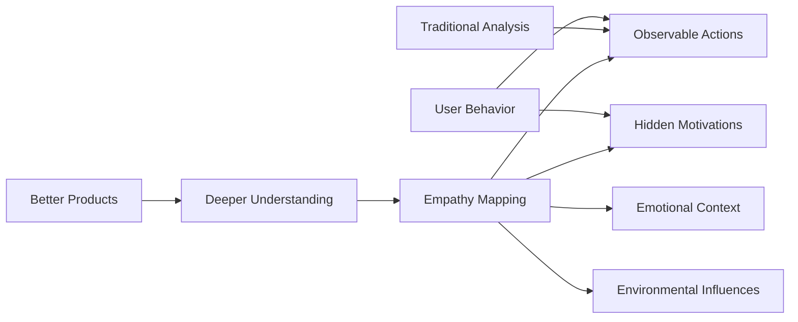
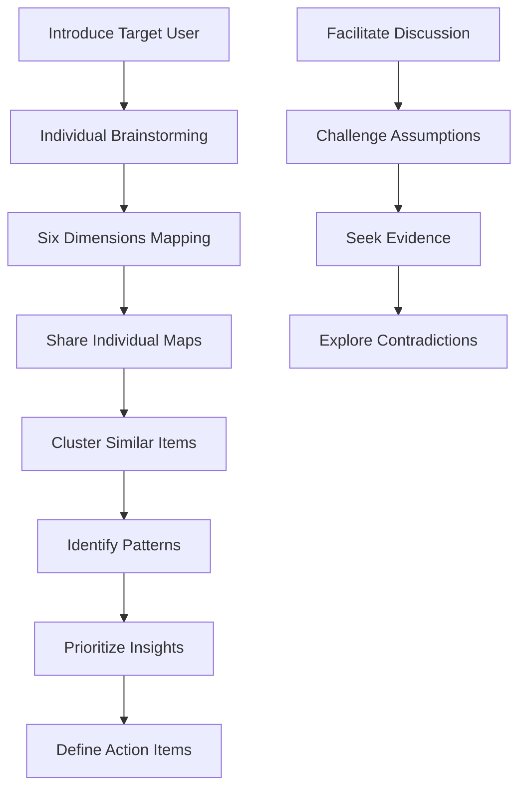
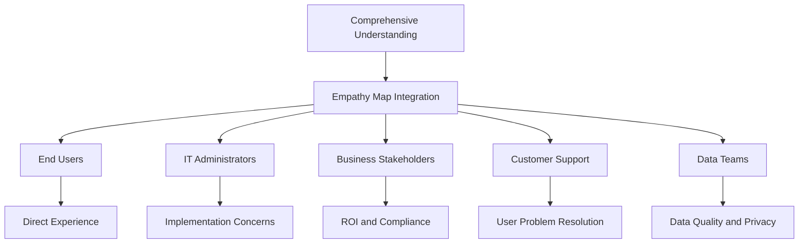

# 🔍 Empathy Mapping

> **Design human-centered AI systems by deeply understanding user thoughts, feelings, behaviors, and experiences**

## 🎯 **What It Is**

Empathy Mapping is a collaborative visualization tool that captures what users think, feel, see, hear, say, and do in relation to your AI product or service. This human-centered design technique helps teams build deep, shared understanding of user experiences, pain points, and unmet needs to create more intuitive and valuable AI solutions.

**Core Insight**: Building great AI products requires understanding not just what users do, but why they do it, how they feel about it, and what influences their behavior. Empathy maps make the invisible visible.

## ⚡ **The Psychology Behind It**

### **Empathy in Design Research**


**Key Principles:**
- **Cognitive Empathy**: Understanding user mental models and thought processes
- **Emotional Empathy**: Recognizing and relating to user feelings and frustrations
- **Behavioral Empathy**: Comprehending actions in context of constraints and motivations
- **Environmental Empathy**: Considering external factors that influence user experience

## 🎯 **When to Use**

### **🚀 Product Development Stages**
- **Discovery Phase**: Understanding user needs before building
- **Design Phase**: Creating user-centered AI interfaces and interactions
- **Testing Phase**: Interpreting user feedback and behavior
- **Iteration Phase**: Improving existing AI products based on user insights

### **🎯 Strategic Applications**
- **Market Research**: Understanding target user segments
- **Feature Prioritization**: Deciding what AI capabilities matter most
- **User Experience Design**: Creating intuitive AI interactions
- **Stakeholder Alignment**: Building shared understanding across teams

### **🔧 Problem-Solving Contexts**
- **Low Adoption**: Understanding barriers to AI product usage
- **User Complaints**: Getting beneath surface feedback to root causes
- **Feature Confusion**: Identifying usability and comprehension issues
- **Ethical Concerns**: Understanding impact of AI decisions on users

## 🗺️ **The Six Dimensions of Empathy Mapping**

### **🗣️ Says (Observable Quotes)**
```
Definition: What users explicitly express about your AI product

Collection Methods:
• User interviews and surveys
• Support ticket analysis
• Social media monitoring
• Focus group transcripts
• Product review analysis

Examples for AI Chatbot:
• "I don't understand what this bot can actually do"
• "It gave me the wrong answer three times"
• "This is faster than calling customer service"
• "I'm not sure if I can trust these recommendations"
• "It feels like I'm talking to a real person"

Analysis Questions:
• What language do users use to describe our AI?
• What specific complaints or praise do they express?
• How do they talk about AI in general vs. our product?
• What jargon or technical terms do they use/avoid?
```

### **🤔 Thinks (Internal Thoughts)**
```
Definition: User beliefs, assumptions, and internal dialogue

Research Methods:
• Think-aloud protocols during testing
• Diary studies and experience sampling
• Post-interaction reflection interviews
• Cognitive walkthroughs
• Mental model elicitation

Examples for AI Recommendation System:
• "I wonder if this is tracking too much of my data"
• "These suggestions are actually pretty good"
• "I bet this will recommend the same old things"
• "I don't understand how it knows this about me"
• "This might help me discover something new"

Analysis Questions:
• What mental models do users have about AI?
• What assumptions do they make about our system?
• How do they rationalize AI behavior?
• What cognitive biases influence their thinking?
```

### **😊😟 Feels (Emotions and Feelings)**
```
Definition: Emotional states and reactions throughout the user journey

Detection Methods:
• Emotional state surveys
• Facial expression analysis during testing
• Physiological measures (heart rate, skin conductance)
• Sentiment analysis of feedback
• Emotional journey mapping

Examples for AI-Powered Healthcare App:
• Anxious about data privacy and security
• Frustrated by inaccurate symptom assessments
• Relieved to get quick medical guidance
• Confused by complex medical terminology
• Confident in AI-backed recommendations

Emotional Journey Stages:
• Pre-interaction: Anticipation, skepticism, hope
• During-interaction: Confusion, delight, frustration
• Post-interaction: Satisfaction, regret, trust
```

### **👀 Sees (Environmental Context)**
```
Definition: What users observe in their environment that influences behavior

Environmental Factors:
• Physical environment (home, office, mobile)
• Digital environment (other apps, notifications)
• Social environment (colleagues, family nearby)
• Information environment (competing sources)
• Cultural environment (norms, expectations)

Examples for AI Writing Assistant:
• Colleagues using competing AI tools
• Articles about AI replacing human jobs
• Company policies about AI tool usage
• Other productivity apps on their desktop
• Time pressure from deadlines

Context Mapping:
• Where: Physical and digital spaces
• When: Time constraints and multitasking
• Who: Social influences and stakeholders
• What: Competing priorities and information sources
```

### **👂 Hears (External Influences)**
```
Definition: External voices and information that shape user perceptions

Information Sources:
• Peer opinions and recommendations
• Expert reviews and analyses
• Marketing messages and claims
• Media coverage and news stories
• Training and educational content

Examples for AI Investment Advisor:
• "Financial advisors say AI can't replace human judgment"
• "My friend lost money following AI recommendations"
• "The news keeps talking about AI making mistakes"
• "Our company training emphasized human oversight"
• "This influencer swears by AI trading tools"

Influence Analysis:
• Credibility: How much do users trust different sources?
• Frequency: How often do they encounter these messages?
• Timing: When do they hear these relative to product usage?
• Contradiction: Do external messages conflict with product experience?
```

### **🏃‍♀️ Does (Observable Behaviors)**
```
Definition: Actions users take, including workarounds and adaptations

Behavioral Categories:
• Primary actions (intended product usage)
• Secondary actions (workarounds and adaptations)
• Avoidance behaviors (what they don't do)
• Contextual behaviors (how environment affects usage)
• Social behaviors (sharing, discussing, seeking help)

Examples for AI Code Generator:
• Tests AI-generated code thoroughly before using
• Combines AI suggestions with manual modifications
• Avoids using AI for critical system components
• Shares interesting AI outputs with team members
• Keeps backup manual coding approaches ready

Behavioral Analysis:
• Frequency patterns: How often and when do they use it?
• Sequence patterns: What do they do before, during, after?
• Variation patterns: How does usage change over time?
• Context patterns: How does environment affect behavior?
```

## 🛠️ **Practical Implementation Toolkit**

### **🎯 Empathy Mapping Workshop Framework**

**Pre-Workshop Preparation:**
```python
def prepare_empathy_mapping_session():
    preparation = {
        "research_materials": [
            "User interview transcripts",
            "Support ticket summaries", 
            "Analytics and usage data",
            "Customer feedback compilations",
            "Observational study notes"
        ],
        
        "participants": [
            "Product managers",
            "UX designers", 
            "AI/ML engineers",
            "Customer support representatives",
            "Sales team members"
        ],
        
        "materials": [
            "Large wall space or digital whiteboard",
            "Sticky notes or digital collaboration tool",
            "User persona templates",
            "Journey map if available",
            "Timer for structured sessions"
        ],
        
        "session_structure": {
            "duration": "2-3 hours",
            "warm_up": "15 minutes",
            "individual_mapping": "45 minutes", 
            "sharing_and_clustering": "60 minutes",
            "synthesis_and_insights": "30 minutes",
            "action_planning": "15 minutes"
        }
    }
    return preparation
```

**Workshop Process:**


### **🔧 Digital Empathy Mapping Tools**

**Template Structure:**
```python
class EmpathyMap:
    def __init__(self, user_persona, context):
        self.user_persona = user_persona
        self.context = context
        self.dimensions = {
            "says": [],
            "thinks": [], 
            "feels": [],
            "sees": [],
            "hears": [],
            "does": []
        }
        self.insights = []
        self.pain_points = []
        self.opportunities = []
    
    def add_observation(self, dimension, observation, evidence=None):
        entry = {
            "content": observation,
            "evidence": evidence,
            "timestamp": datetime.now(),
            "confidence": self.assess_confidence(evidence)
        }
        self.dimensions[dimension].append(entry)
    
    def identify_patterns(self):
        patterns = {
            "contradictions": self.find_contradictions(),
            "strong_emotions": self.identify_emotional_highs_lows(),
            "behavioral_gaps": self.find_behavior_belief_gaps(),
            "unmet_needs": self.surface_hidden_needs()
        }
        return patterns
    
    def generate_insights(self):
        insights = []
        for pattern_type, patterns in self.identify_patterns().items():
            for pattern in patterns:
                insights.append({
                    "type": pattern_type,
                    "description": pattern,
                    "implications": self.derive_implications(pattern),
                    "priority": self.assess_priority(pattern)
                })
        return insights
```

### **📊 Data Collection Methods**

**User Research Techniques for AI Products:**
```python
def ai_specific_research_methods():
    methods = {
        "cognitive_interviews": {
            "purpose": "Understand mental models of AI",
            "questions": [
                "How do you think this AI system works?",
                "What do you expect will happen when you do X?",
                "How do you decide whether to trust AI recommendations?"
            ],
            "ai_focus": "Mental models, trust, explainability"
        },
        
        "experience_sampling": {
            "purpose": "Capture in-the-moment experiences",
            "method": "Mobile prompts during AI interaction",
            "metrics": ["Emotional state", "Context", "Satisfaction"],
            "ai_focus": "Real-world usage patterns"
        },
        
        "behavioral_analytics": {
            "purpose": "Observe actual AI system usage",
            "data_points": [
                "Feature usage patterns",
                "Error recovery behaviors", 
                "Help-seeking behaviors",
                "Customization actions"
            ],
            "ai_focus": "Adoption and adaptation patterns"
        },
        
        "trust_calibration_studies": {
            "purpose": "Understand trust development in AI",
            "approach": "Longitudinal observation of trust changes",
            "measures": ["Reliance behavior", "Verification patterns", "Risk tolerance"],
            "ai_focus": "Trust evolution over time"
        }
    }
    return methods
```

## 📈 **Advanced Applications in AI Development**

### **🤖 AI-Specific Empathy Considerations**

**Unique Aspects of AI User Experience:**
```python
def ai_empathy_dimensions():
    ai_specific_factors = {
        "algorithmic_transparency": {
            "user_concerns": [
                "How does the AI make decisions?",
                "Can I understand why it gave this output?",
                "What data is it using about me?"
            ],
            "emotional_impact": "Confusion, frustration, lack of control",
            "behavioral_response": "Avoid advanced features, seek human alternatives"
        },
        
        "trust_calibration": {
            "user_concerns": [
                "When should I trust AI recommendations?",
                "How do I know when the AI is wrong?",
                "What are the consequences of AI errors?"
            ],
            "emotional_impact": "Anxiety, over-reliance or under-reliance",
            "behavioral_response": "Excessive verification or blind acceptance"
        },
        
        "agency_and_control": {
            "user_concerns": [
                "Can I override AI decisions?",
                "How much control do I have?",
                "Is the AI replacing my judgment?"
            ],
            "emotional_impact": "Helplessness, empowerment, resistance",
            "behavioral_response": "Customization seeking, feature avoidance"
        },
        
        "anthropomorphism": {
            "user_concerns": [
                "Is this AI trying to seem human?",
                "Should I treat it like a person?",
                "What are its limitations vs. capabilities?"
            ],
            "emotional_impact": "Uncanny valley, attachment, disappointment",
            "behavioral_response": "Inappropriate expectations, emotional investment"
        }
    }
    return ai_specific_factors
```

### **🔍 Multi-Stakeholder Empathy Mapping**

**Beyond End Users:**


**Stakeholder-Specific Considerations:**
```python
def multi_stakeholder_mapping():
    stakeholder_maps = {
        "end_users": {
            "primary_concerns": ["Usability", "Value", "Trust"],
            "success_metrics": ["Task completion", "Satisfaction", "Adoption"],
            "pain_points": ["Learning curve", "Errors", "Loss of control"]
        },
        
        "it_administrators": {
            "primary_concerns": ["Security", "Integration", "Maintenance"],
            "success_metrics": ["System stability", "Performance", "Compliance"],
            "pain_points": ["Complexity", "Resource requirements", "Risk"]
        },
        
        "business_leaders": {
            "primary_concerns": ["ROI", "Competitive advantage", "Risk management"],
            "success_metrics": ["Cost savings", "Revenue impact", "Market position"],
            "pain_points": ["Unclear benefits", "High costs", "Regulatory concerns"]
        },
        
        "customer_support": {
            "primary_concerns": ["User issues", "Escalation complexity", "Training needs"],
            "success_metrics": ["Reduced tickets", "Resolution time", "User satisfaction"],
            "pain_points": ["AI complexity", "User confusion", "Lack of explainability"]
        }
    }
    return stakeholder_maps
```

### **🎯 Journey-Integrated Empathy Mapping**

**Combining Empathy Maps with User Journey:**
```python
class JourneyEmpathyMapping:
    def __init__(self, user_journey_stages):
        self.journey_stages = user_journey_stages
        self.stage_empathy_maps = {}
    
    def map_empathy_by_stage(self):
        for stage in self.journey_stages:
            self.stage_empathy_maps[stage] = {
                "context": self.get_stage_context(stage),
                "empathy_dimensions": self.map_dimensions_for_stage(stage),
                "emotional_arc": self.track_emotional_progression(stage),
                "pain_points": self.identify_stage_pain_points(stage),
                "opportunities": self.spot_stage_opportunities(stage)
            }
    
    def identify_emotional_transitions(self):
        transitions = []
        stages = list(self.stage_empathy_maps.keys())
        
        for i in range(len(stages) - 1):
            current_stage = stages[i]
            next_stage = stages[i + 1]
            
            emotional_shift = {
                "from_stage": current_stage,
                "to_stage": next_stage,
                "emotional_change": self.compare_emotional_states(current_stage, next_stage),
                "transition_triggers": self.identify_transition_causes(current_stage, next_stage),
                "design_opportunities": self.suggest_transition_improvements(current_stage, next_stage)
            }
            transitions.append(emotional_shift)
        
        return transitions
```

## 🚨 **Common Pitfalls and How to Avoid Them**

### **❌ Anti-Patterns**

**1. Assumption-Based Mapping**
```
❌ Filling empathy maps with team assumptions instead of user data
✅ Base every entry on actual user research evidence

Strategy: Require evidence citations for each empathy map entry
```

**2. Generic User Representation**
```
❌ Creating empathy maps for "all users" or overly broad segments
✅ Focus on specific personas in specific contexts

Strategy: Start with "Sarah, the marketing manager, when evaluating AI content tools for her team"
```

**3. Surface-Level Insights**
```
❌ Capturing only obvious, surface-level observations
✅ Dig deeper into underlying motivations and emotions

Example:
❌ Surface: "User says the AI is slow"
✅ Deeper: "User feels frustrated because slow AI responses break their creative flow, making them question whether AI helps or hinders their work"
```

**4. Static Mapping**
```
❌ Treating empathy maps as one-time deliverables
✅ Update maps as you learn more about users

Strategy: Schedule quarterly empathy map reviews and updates
```

### **🛡️ Quality Assurance Framework**

**Empathy Map Validation:**
```python
def validate_empathy_map(empathy_map):
    validation_criteria = {
        "evidence_quality": {
            "check": "Each entry backed by research evidence",
            "score": calculate_evidence_ratio(empathy_map),
            "threshold": 0.8  # 80% of entries should have evidence
        },
        
        "depth_analysis": {
            "check": "Mix of surface and deep insights",
            "score": analyze_insight_depth(empathy_map), 
            "threshold": 0.6  # 60% should be deeper insights
        },
        
        "specificity_test": {
            "check": "Entries are specific, not generic",
            "score": measure_specificity(empathy_map),
            "threshold": 0.7  # 70% should be specific observations
        },
        
        "completeness_audit": {
            "check": "All six dimensions adequately populated",
            "score": check_dimension_balance(empathy_map),
            "threshold": 1.0  # All dimensions must have content
        },
        
        "contradiction_identification": {
            "check": "Contradictions between dimensions identified and explored",
            "score": count_explored_contradictions(empathy_map),
            "threshold": 0.5  # At least some contradictions should be noted
        }
    }
    
    return validation_criteria
```

## 📊 **Measurement and Success Metrics**

### **🎯 Empathy Map Quality Metrics**

**Research Quality Indicators:**
```python
def assess_empathy_map_quality():
    quality_metrics = {
        "data_richness": {
            "user_touchpoints": "Number of different research methods used",
            "sample_diversity": "Variety of user types and contexts represented",
            "evidence_depth": "Quality and specificity of supporting evidence"
        },
        
        "insight_generation": {
            "pattern_identification": "Number of meaningful patterns discovered",
            "assumption_challenges": "Percentage of initial assumptions invalidated",
            "actionable_insights": "Insights that lead to concrete design decisions"
        },
        
        "team_alignment": {
            "shared_understanding": "Agreement levels on user needs and pain points",
            "perspective_shifts": "Changes in team member mental models",
            "decision_confidence": "Confidence in user-centered decisions"
        }
    }
    return quality_metrics
```

### **📈 Impact on Product Development**

**Design Decision Quality:**
```python
def measure_empathy_impact():
    impact_metrics = {
        "feature_relevance": {
            "user_need_alignment": "Features addressing actual vs. assumed needs",
            "priority_accuracy": "Development priorities matching user importance",
            "usage_prediction": "Accuracy of usage predictions based on empathy insights"
        },
        
        "user_experience_outcomes": {
            "satisfaction_improvement": "User satisfaction scores before/after empathy-informed design",
            "adoption_rates": "Feature adoption rates for empathy-informed features",
            "support_ticket_reduction": "Decrease in user confusion and support needs"
        },
        
        "development_efficiency": {
            "iteration_reduction": "Fewer design iterations needed",
            "feature_success_rate": "Percentage of features that meet success criteria",
            "time_to_value": "Faster achievement of user value"
        }
    }
    return impact_metrics
```

### **🔄 Continuous Improvement Framework**

**Empathy Map Evolution:**
```python
def evolve_empathy_understanding():
    evolution_process = {
        "regular_updates": {
            "monthly_reviews": "Quick updates based on recent user feedback",
            "quarterly_deep_dives": "Comprehensive research and map revision",
            "annual_overhauls": "Complete empathy map reconstruction"
        },
        
        "learning_integration": {
            "support_ticket_analysis": "Incorporate new pain points from support data",
            "usage_analytics": "Update behavior observations from product analytics",
            "market_research": "Integrate broader market and competitive insights"
        },
        
        "validation_cycles": {
            "hypothesis_testing": "Test empathy map predictions through experiments",
            "user_feedback_loops": "Validate insights through direct user feedback",
            "behavioral_confirmation": "Confirm assumptions through observed behavior"
        }
    }
    return evolution_process
```

## 🔗 **Integration with Other Mental Models**

### **🧠 Complementary Frameworks**

**Synergistic Combinations:**
- **[[User Journey Mapping]]**: Empathy maps provide emotional context for journey stages
- **[[Jobs-to-be-Done]]**: Understand functional and emotional jobs users hire AI for
- **[[Value Proposition Canvas]]**: Align AI value propositions with empathy insights
- **[[Persona Development]]**: Use empathy maps to create more nuanced, realistic personas
- **[[System Thinking]]**: Consider broader ecosystem of user experiences and influences

**Integration Examples:**
```python
def integrate_with_user_journey():
    # Embed empathy insights into journey stages
    integration = {
        "awareness_stage": {
            "journey_actions": ["Research AI solutions", "Read reviews"],
            "empathy_overlay": {
                "thinks": "I wonder if AI will actually help or complicate my work",
                "feels": "Curious but skeptical about AI capabilities",
                "hears": "Mixed messages about AI success and failures"
            }
        },
        
        "trial_stage": {
            "journey_actions": ["Sign up for free trial", "Test key features"],
            "empathy_overlay": {
                "thinks": "This seems too good to be true, what's the catch?",
                "feels": "Excited but nervous about learning new technology",
                "sees": "Complex interface with many options"
            }
        }
    }
    return integration

def enhance_personas_with_empathy():
    # Add empathy dimensions to traditional personas
    enhanced_persona = {
        "demographics": "Traditional persona information",
        "empathy_profile": {
            "emotional_drivers": "What motivates and demotivates them",
            "environmental_context": "Their physical and digital environment",
            "information_sources": "Who and what influences their opinions",
            "behavioral_patterns": "How they actually use products vs. how they say they do"
        }
    }
    return enhanced_persona
```

## 🎯 **Advanced Mastery Guide**

### **📈 Skill Development Progression**

**Level 1: Basic Empathy Mapping**
- Use six-dimension framework correctly
- Collect and organize user research data
- Facilitate basic empathy mapping workshops

**Level 2: Evidence-Based Mapping**
- Distinguish between assumptions and evidence
- Integrate multiple research methods
- Identify patterns across user segments

**Level 3: Strategic Application**
- Connect empathy insights to business decisions
- Use empathy maps for competitive analysis
- Integrate with product development processes

**Level 4: Advanced Research Integration**
- Design research specifically for empathy mapping
- Handle complex, multi-stakeholder scenarios
- Quantify and measure empathy impact

**Level 5: Organizational Transformation**
- Embed empathy practices across organization
- Train teams in empathy-driven design
- Create systems for continuous empathy learning

### **🛠️ Advanced Techniques**

**Computational Empathy Augmentation:**
```python
def ai_augmented_empathy_mapping():
    augmentation_methods = {
        "sentiment_analysis": {
            "data_source": "Customer feedback, reviews, support tickets",
            "output": "Emotional state patterns and trends",
            "integration": "Populate 'feels' dimension with data-driven insights"
        },
        
        "behavioral_clustering": {
            "data_source": "Product usage analytics, clickstreams",
            "output": "Behavioral pattern identification",
            "integration": "Enrich 'does' dimension with actual behavior patterns"
        },
        
        "social_listening": {
            "data_source": "Social media, forums, communities",
            "output": "External influence and opinion analysis",
            "integration": "Inform 'hears' and 'sees' dimensions with real conversations"
        },
        
        "predictive_modeling": {
            "data_source": "Historical user data and outcomes",
            "output": "Predicted user needs and behaviors",
            "integration": "Validate empathy map predictions with data models"
        }
    }
    return augmentation_methods
```

## 🏆 **Success Stories and Case Studies**

### **Case Study 1: AI-Powered Health App**

**Challenge**: Low user engagement with AI symptom checker
**Empathy Mapping Process**:
- Discovered users felt anxious about medical AI accuracy
- Found users wanted reassurance, not just information
- Identified that users were using multiple sources for validation

**Key Insights**:
- Users' emotional need: Confidence and reassurance
- Behavioral pattern: Cross-referencing AI with other sources
- Environmental factor: High anxiety during health concerns

**Design Changes**:
- Added confidence indicators to AI recommendations
- Included educational content about AI limitations
- Created clear pathways to human medical professionals

**Results**: 40% increase in user engagement, 60% reduction in support tickets

### **Case Study 2: AI Writing Assistant**

**Challenge**: Users abandoning advanced AI writing features
**Empathy Mapping Discoveries**:
- Users worried AI would make their writing sound "generic"
- Writers valued their unique voice and style
- Fear that colleagues would judge AI-assisted work

**Design Response**:
- Emphasized AI as "collaboration partner" not "replacement"
- Added style customization and voice preservation features
- Created sharing options that highlight human-AI collaboration

**Outcome**: 3x increase in advanced feature usage, improved user satisfaction scores

## 🚀 **Takeaways and Next Steps**

### **Key Insights**
1. **Empathy reveals the invisible** - Understanding emotions, thoughts, and context behind user behavior
2. **Evidence beats assumptions** - Always ground empathy maps in real user research data
3. **Context shapes experience** - Environment and influences are as important as individual characteristics
4. **Continuous evolution required** - User empathy changes as products and markets evolve

### **Implementation Roadmap**
1. **Start Small** - Begin with one specific user scenario rather than trying to map all users
2. **Gather Evidence** - Conduct targeted user research to support empathy mapping
3. **Workshop Facilitation** - Run collaborative sessions to build shared understanding
4. **Design Integration** - Use empathy insights to inform specific design decisions
5. **Measure Impact** - Track how empathy-informed decisions affect user outcomes

**Begin Today:**
- Choose one user type and specific usage scenario
- Gather existing research data about that user and scenario
- Create a basic six-dimension empathy map
- Identify one key insight that could change your product approach
- Plan one design experiment based on that insight

Remember: **Great AI products start with deep human understanding. Empathy mapping helps you see your users as whole people, not just data points or feature requests.**
