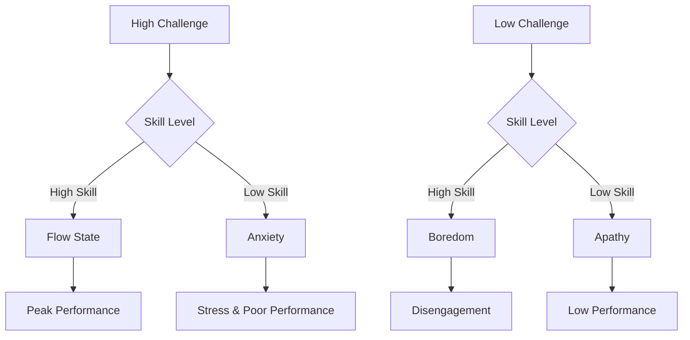
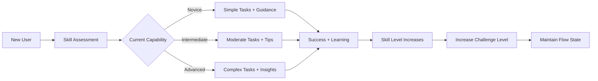
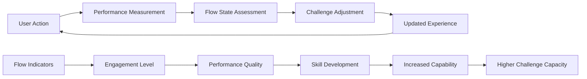
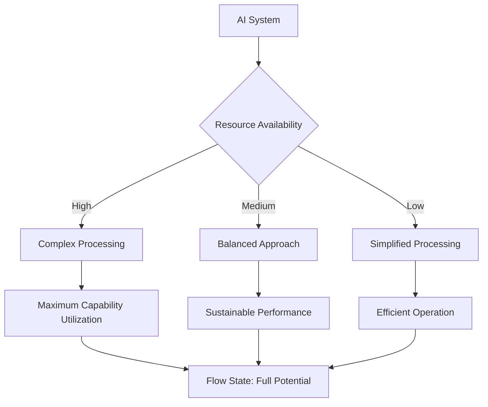
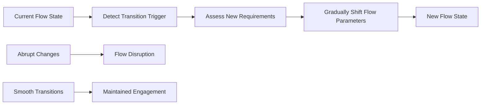

# 🌊 Flow State Optimization

> **Design AI systems and workflows that create optimal performance conditions for both humans and AI**

## 🎯 **What It Is**

Flow State Optimization is a mental model borrowed from psychology that helps you design AI systems, user experiences, and work environments that create conditions for peak performance by balancing challenge with capability.

**Core Insight**: Optimal performance occurs when the difficulty of tasks matches the skill level of the performer, creating a state of effortless concentration and peak productivity.

## ⚡ **The Psychology Behind It**



**Flow Conditions:**
- **Clear Goals**: Unambiguous objectives and feedback
- **Challenge-Skill Balance**: Task difficulty matches capability
- **Immediate Feedback**: Real-time performance information
- **Deep Concentration**: Minimal distractions and interruptions
- **Sense of Control**: Confidence in ability to handle the task

## 🎯 **When to Use**

### **🎨 AI User Experience Design**
- Creating interfaces that maintain user engagement
- Designing progressive difficulty in AI-assisted tasks
- Optimizing human-AI collaboration workflows

### **🔧 AI System Performance**
- Optimizing AI model complexity for available compute
- Balancing automation sophistication with system capability
- Designing adaptive systems that scale with user needs

### **🏢 Team Productivity**
- Structuring AI implementation projects for optimal team flow
- Managing complexity in AI development workflows
- Creating sustainable pace for AI innovation

## 🚀 **Practical Applications**

### **Example: AI-Assisted Code Development**

**🔍 Traditional Approach vs. Flow-Optimized:**

**❌ Flow-Breaking Design:**
```python
def traditional_ai_coding_assistant():
    # AI provides complete solutions regardless of user skill
    user_request = "Create a web scraper"
    ai_response = generate_complete_solution()
    
    # Results in flow disruption:
    if user.skill_level == "beginner":
        return "OVERWHELMED"  # Too complex, creates anxiety
    elif user.skill_level == "expert":  
        return "BORED"        # No challenge, disengaging
```

**✅ Flow-Optimized Design:**
```python
def flow_optimized_ai_assistant():
    user_request = "Create a web scraper"
    user_skill_level = assess_user_capability()
    
    if user_skill_level == "beginner":
        # Provide guided learning experience
        response = {
            "step_by_step_tutorial": generate_tutorial(),
            "code_snippets": provide_building_blocks(),
            "explanations": explain_concepts(),
            "next_challenge": suggest_progression()
        }
    elif user_skill_level == "intermediate":
        # Provide structured assistance
        response = {
            "architecture_suggestions": suggest_design_patterns(),
            "code_examples": provide_relevant_examples(),
            "error_anticipation": warn_about_common_pitfalls(),
            "optimization_tips": suggest_improvements()
        }
    elif user_skill_level == "expert":
        # Provide advanced insights and challenges
        response = {
            "performance_analysis": analyze_edge_cases(),
            "architectural_alternatives": suggest_advanced_patterns(),
            "new_techniques": introduce_cutting_edge_approaches(),
            "code_review": provide_expert_feedback()
        }
    
    return maintain_challenge_skill_balance(response, user_skill_level)
```

### **Example: AI Model Training Flow**

**🧠 Optimizing ML Engineer Flow State:**

```python
def optimize_training_workflow():
    # Create flow conditions for ML engineers
    flow_design = {
        "clear_goals": {
            "immediate": "improve_validation_accuracy_by_2%",
            "session": "complete_hyperparameter_optimization",
            "project": "deploy_production_ready_model"
        },
        
        "challenge_skill_balance": {
            "beginner": "guided_experiments_with_explanations",
            "intermediate": "hypothesis_driven_experimentation", 
            "expert": "novel_architecture_exploration"
        },
        
        "immediate_feedback": {
            "real_time_metrics": "loss_curves_and_accuracy_plots",
            "experiment_tracking": "automated_comparison_dashboards",
            "performance_alerts": "notify_on_significant_changes"
        },
        
        "deep_concentration": {
            "minimize_interruptions": "batch_notifications",
            "single_focus_sessions": "dedicated_experiment_time",
            "flow_friendly_tools": "seamless_workflow_integration"
        },
        
        "sense_of_control": {
            "reproducible_experiments": "version_controlled_everything",
            "rollback_capability": "easy_experiment_restoration",
            "resource_predictability": "guaranteed_compute_availability"
        }
    }
    
    return implement_flow_optimized_training(flow_design)
```

### **Example: User Onboarding Flow**

**🎯 Progressive Skill Development:**



**Implementation:**
```python
def design_progressive_onboarding():
    user_journey = {
        "assessment_phase": {
            "duration": "2_minutes",
            "method": "interactive_skill_check",
            "outcome": "personalized_starting_point"
        },
        
        "skill_building_phases": [
            {
                "level": "foundation",
                "challenge": "basic_ai_interactions",
                "support": "step_by_step_guidance",
                "duration": "15_minutes",
                "success_criteria": "complete_3_simple_tasks"
            },
            {
                "level": "competence", 
                "challenge": "workflow_integration",
                "support": "contextual_tips",
                "duration": "30_minutes",
                "success_criteria": "complete_complex_workflow"
            },
            {
                "level": "proficiency",
                "challenge": "advanced_features",
                "support": "best_practice_insights",
                "duration": "45_minutes",
                "success_criteria": "optimize_personal_workflow"
            }
        ],
        
        "flow_maintenance": {
            "adaptive_difficulty": "adjust_based_on_performance",
            "celebration_moments": "acknowledge_progress_milestones",
            "challenge_preview": "hint_at_next_level_capabilities"
        }
    }
    
    return create_flow_optimized_onboarding(user_journey)
```

## 🔄 **Flow Patterns in AI Systems**

### **🎯 Adaptive Challenge Scaling**

**Dynamic Difficulty Adjustment:**
```python
def implement_adaptive_challenge():
    user_performance_history = track_user_interactions()
    
    # Analyze flow indicators
    flow_signals = {
        "engagement_time": measure_session_duration(),
        "completion_rate": calculate_task_success_rate(),
        "error_patterns": analyze_mistake_frequency(),
        "help_seeking": track_support_requests(),
        "return_behavior": measure_user_retention()
    }
    
    # Adjust challenge level based on flow state indicators
    if flow_signals["completion_rate"] > 0.9 and flow_signals["engagement_time"] < average:
        return "INCREASE_CHALLENGE"  # User is bored, needs more complexity
    elif flow_signals["completion_rate"] < 0.6 and flow_signals["error_patterns"] == "high":
        return "DECREASE_CHALLENGE"  # User is overwhelmed, needs support
    elif flow_signals["engagement_time"] > average and flow_signals["completion_rate"] > 0.7:
        return "MAINTAIN_FLOW"  # User is in optimal state
    else:
        return "PROVIDE_SUPPORT"  # User needs skill development
```

### **🔄 Feedback Loop Optimization**

**Real-time Flow Feedback:**


### **🧠 Cognitive Load Management**

**Balancing Complexity:**
```python
def manage_cognitive_load_for_flow():
    total_cognitive_capacity = 100  # Mental bandwidth units
    
    # Distribute cognitive load optimally
    cognitive_allocation = {
        "core_task": 60,        # Main activity gets majority
        "navigation": 15,       # Easy to find and use features
        "learning": 15,         # Understanding new concepts
        "monitoring": 10        # Tracking progress and performance
    }
    
    # Reduce extraneous load to maximize flow
    load_reduction_strategies = {
        "automation": "handle_routine_decisions",
        "simplification": "hide_advanced_features_initially",
        "guidance": "provide_contextual_help",
        "memory_support": "remember_user_preferences"
    }
    
    return optimize_for_flow_state(cognitive_allocation, load_reduction_strategies)
```

## 🎯 **Strategic Applications**

### **Team Flow State Design**

**🏢 Organizational Flow Optimization:**

```python
def design_team_flow_state():
    team_flow_factors = {
        "clear_shared_goals": {
            "project_vision": "well_defined_ai_objectives",
            "individual_roles": "clear_responsibilities",
            "success_metrics": "measurable_outcomes"
        },
        
        "skill_challenge_balance": {
            "task_assignment": "match_complexity_to_capability",
            "skill_development": "provide_learning_opportunities", 
            "stretch_projects": "gradually_increase_difficulty"
        },
        
        "immediate_feedback": {
            "daily_standups": "progress_sharing_and_obstacles",
            "continuous_integration": "immediate_build_feedback",
            "user_feedback": "rapid_user_testing_cycles"
        },
        
        "deep_concentration": {
            "focus_time": "uninterrupted_work_blocks",
            "communication_protocols": "async_by_default",
            "environment_design": "minimize_distractions"
        },
        
        "team_autonomy": {
            "decision_authority": "empower_local_decisions",
            "tool_choice": "let_teams_choose_best_tools",
            "process_adaptation": "allow_workflow_customization"
        }
    }
    
    return implement_team_flow_design(team_flow_factors)
```

### **AI System Flow Design**

**🤖 Optimizing AI Performance:**



**Implementation Strategy:**
```python
def optimize_ai_system_flow():
    # Monitor system performance and resource utilization
    system_metrics = {
        "compute_utilization": measure_gpu_usage(),
        "memory_pressure": track_memory_consumption(),
        "throughput": calculate_requests_per_second(),
        "latency": measure_response_times(),
        "error_rate": track_failure_percentage()
    }
    
    # Adaptive system configuration
    if system_metrics["compute_utilization"] < 0.6:
        # System is underutilized - increase challenge
        increase_model_complexity()
        enable_advanced_features()
        process_larger_batches()
        
    elif system_metrics["compute_utilization"] > 0.9:
        # System is overwhelmed - reduce challenge
        simplify_model_architecture()
        reduce_batch_sizes()
        implement_request_queuing()
        
    else:
        # System is in flow state - maintain balance
        monitor_for_performance_drift()
        gradually_optimize_efficiency()
    
    return maintain_system_flow_state()
```

### **User Experience Flow Architecture**

**🎨 Multi-Layer Flow Design:**

```python
def architect_ux_flow():
    flow_layers = {
        "interaction_flow": {
            "input_methods": "intuitive_and_responsive",
            "feedback_timing": "immediate_and_clear",
            "error_recovery": "graceful_and_helpful"
        },
        
        "information_flow": {
            "content_organization": "logical_and_discoverable",
            "complexity_progression": "simple_to_advanced",
            "context_preservation": "maintain_user_state"
        },
        
        "emotional_flow": {
            "success_celebration": "acknowledge_achievements",
            "progress_visualization": "show_advancement",
            "confidence_building": "provide_positive_reinforcement"
        },
        
        "learning_flow": {
            "skill_assessment": "understand_current_capability",
            "adaptive_guidance": "provide_appropriate_support",
            "mastery_progression": "clear_advancement_path"
        }
    }
    
    return create_holistic_flow_experience(flow_layers)
```

## 💡 **Advanced Flow Strategies**

### **Multi-Modal Flow States**

**Different Flow Types for Different Tasks:**
```python
def design_multi_modal_flow():
    flow_modes = {
        "creative_flow": {
            "characteristics": "open_ended_exploration",
            "ai_role": "inspirational_partner",
            "environment": "minimal_constraints",
            "feedback": "encouraging_and_expansive"
        },
        
        "analytical_flow": {
            "characteristics": "structured_problem_solving",
            "ai_role": "analytical_assistant", 
            "environment": "data_rich_workspace",
            "feedback": "precise_and_informative"
        },
        
        "execution_flow": {
            "characteristics": "efficient_task_completion",
            "ai_role": "automation_partner",
            "environment": "streamlined_interface",
            "feedback": "progress_focused"
        },
        
        "learning_flow": {
            "characteristics": "skill_development",
            "ai_role": "adaptive_tutor",
            "environment": "safe_experimentation",
            "feedback": "educational_and_supportive"
        }
    }
    
    # Detect user intent and switch flow modes
    current_task = detect_user_intention()
    optimal_flow_mode = match_task_to_flow_mode(current_task)
    return adapt_system_to_flow_mode(optimal_flow_mode)
```

### **Flow State Transitions**

**Managing Changes in Flow Requirements:**


### **Collective Flow States**

**Team and Multi-User Flow:**
```python
def facilitate_collective_flow():
    team_members = get_active_team_members()
    
    # Synchronize individual flow states
    collective_flow_design = {
        "shared_awareness": "real_time_team_dashboard",
        "complementary_challenges": "distribute_tasks_by_strength",
        "collective_feedback": "team_progress_visualization",
        "mutual_support": "peer_assistance_systems",
        "shared_celebration": "team_achievement_recognition"
    }
    
    # Balance individual and collective needs
    for member in team_members:
        individual_flow = assess_personal_flow_state(member)
        team_contribution = calculate_team_impact(member)
        optimal_role = balance_individual_and_collective_flow(
            individual_flow, team_contribution
        )
        assign_flow_optimized_role(member, optimal_role)
    
    return maintain_collective_flow_state()
```

## ⚠️ **Flow State Pitfalls**

### **Flow Addiction**
- **Problem**: Designing systems that create dependency on flow states
- **Example**: Gamification that becomes compulsive rather than productive
- **Solution**: Design for sustainable flow with natural break points

### **Skill Stagnation**
- **Problem**: Maintaining comfort zone without skill development
- **Example**: AI that adapts to user but never challenges growth
- **Solution**: Gradual challenge escalation and skill assessment

### **Flow Fragmentation**
- **Problem**: Too many micro-flows that prevent deep engagement
- **Example**: Constant notifications disrupting concentration
- **Solution**: Design for sustained flow periods with minimal interruptions

### **One-Size-Fits-All Flow**
- **Problem**: Assuming all users have same flow preferences
- **Example**: Single difficulty curve for diverse user base
- **Solution**: Personalized flow optimization and multiple pathways

## 📊 **Measuring Flow State**

### **Flow Indicators**
```python
def measure_flow_state():
    flow_metrics = {
        # Behavioral indicators
        "session_duration": track_continuous_engagement(),
        "task_completion_rate": measure_success_percentage(),
        "error_recovery_speed": track_bounce_back_time(),
        "feature_exploration": measure_organic_discovery(),
        
        # Performance indicators  
        "productivity_metrics": calculate_output_quality(),
        "learning_velocity": track_skill_development_speed(),
        "creative_output": measure_innovation_and_originality(),
        
        # Subjective indicators
        "perceived_difficulty": survey_challenge_appropriateness(),
        "enjoyment_level": measure_user_satisfaction(),
        "time_perception": assess_time_distortion_experience(),
        "sense_of_control": evaluate_user_confidence()
    }
    
    # Calculate overall flow score
    flow_score = weighted_average([
        flow_metrics["session_duration"] * 0.2,
        flow_metrics["task_completion_rate"] * 0.2,
        flow_metrics["productivity_metrics"] * 0.2,
        flow_metrics["enjoyment_level"] * 0.2,
        flow_metrics["sense_of_control"] * 0.2
    ])
    
    return interpret_flow_score(flow_score)
```

### **Flow Dashboard**
- **Real-time Flow State**: Current engagement and performance levels
- **Flow History**: Patterns of optimal performance periods  
- **Challenge-Skill Balance**: Visual representation of difficulty vs. capability
- **Flow Improvement Opportunities**: Recommendations for optimization

## 💡 **Key Takeaways**

- **Optimal performance occurs when challenge matches skill level**
- **Flow states require clear goals, immediate feedback, and deep concentration**
- **AI systems should adapt difficulty to maintain user flow state**
- **Flow design benefits both human users and AI system performance**
- **Different tasks require different types of flow states**
- **Measuring and optimizing for flow creates sustainable high performance**

---

**🔗 Related Mental Models:**
- [Cognitive Load Theory](./cognitive-load-theory.md) - Managing mental bandwidth for optimal performance
- [Progressive Disclosure](./progressive-disclosure.md) - Revealing complexity gradually
- [Goldilocks Principle](./goldilocks-principle.md) - Finding the "just right" balance
- [Feedback Loops](./feedback-loops.md) - Creating systems that improve performance

**📚 Further Reading:**
- Flow psychology and optimal experience theory
- User experience design for engagement
- Adaptive systems and personalization
- Performance optimization and skill development
