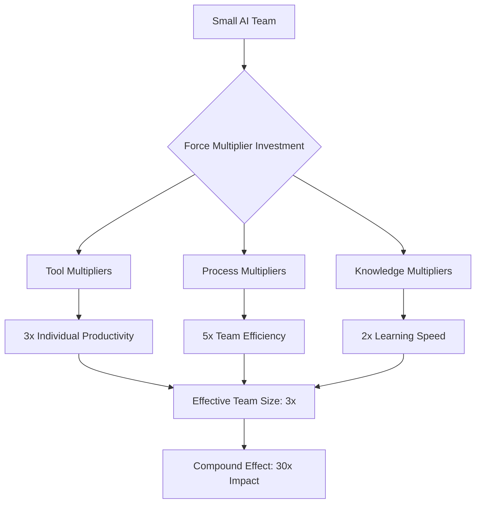

# ⚡ Force Multipliers

> **Core Insight**: Some AI investments amplify everything else you do - identify and maximize the tools, processes, and capabilities that multiply your entire team's effectiveness.

---

## **🔬 What It Is**

**Force Multipliers** are capabilities that dramatically increase the effectiveness of existing resources without proportional increases in input. In military strategy, these might be superior intelligence, communication systems, or training. In AI development:

- **🛠️ AI Tools** that make developers 10x more productive
- **📊 Data Platforms** that accelerate every ML project
- **🧠 Knowledge Systems** that make institutional wisdom accessible
- **🤖 Automation** that eliminates repetitive work across teams

Think of them as **leverage points** - small changes that create disproportionate positive impact across your entire operation.

---

## **🧪 The Science Behind It**

### **Mathematical Foundation**
```python
# Force Multiplier Effect
class ForceMultiplier:
    def __init__(self, base_capability, multiplier_factor):
        self.base_capability = base_capability
        self.multiplier_factor = multiplier_factor
    
    def calculate_amplified_output(self):
        # Output = Base × Multiplier (not Base + Addition)
        return self.base_capability * self.multiplier_factor
    
    def roi_calculation(self, investment_cost):
        # ROI of force multiplier vs linear improvement
        base_output = self.base_capability
        multiplied_output = self.calculate_amplified_output()
        
        additional_output = multiplied_output - base_output
        return additional_output / investment_cost

# Example: AI coding assistant
coding_assistant = ForceMultiplier(
    base_capability=100,  # Lines of code per day
    multiplier_factor=3.5  # 3.5x productivity boost
)

# Result: 350 lines/day instead of 100 (not 135)
```

### **Key Principles**
1. **Exponential vs Linear**: Multipliers create exponential improvements, not additive ones
2. **System-Wide Impact**: True multipliers affect multiple areas simultaneously  
3. **Compound Effects**: Multiple force multipliers can stack and amplify each other
4. **Infrastructure Nature**: Often involve foundational capabilities that enable everything else

---

## **🎯 When to Use This Model**

### **Identify Force Multipliers When:**
- ✅ **Planning infrastructure investments** for AI development
- ✅ **Choosing tools and platforms** that affect multiple teams
- ✅ **Designing processes** that will be used repeatedly
- ✅ **Building capabilities** that enable future capabilities

### **Critical For:**
- 🚀 **Scaling AI teams** efficiently 
- 🚀 **Maximizing limited resources** and budgets
- 🚀 **Creating competitive advantages** that compound over time
- 🚀 **Building sustainable development velocity**

---

## **💡 Practical Applications**

### **🛠️ AI Development Tool Stack**

**Traditional Linear Approach:**
```python
# Individual tool improvements (additive)
def traditional_tooling():
    improvements = {
        'better_ide': 0.1,  # 10% faster coding
        'faster_computer': 0.15,  # 15% faster compilation
        'better_monitor': 0.05,  # 5% less eye strain
    }
    
    # Total improvement = sum of individual improvements
    total_improvement = sum(improvements.values())  # 30%
    return total_improvement
```

**Force Multiplier Approach:**
```python
class AIToolForceMultipliers:
    def __init__(self):
        self.multipliers = {
            'ai_coding_assistant': {
                'factor': 3.0,
                'affects': ['code_writing', 'debugging', 'documentation', 'testing'],
                'investment': 'medium',
                'compound_effects': ['learning_acceleration', 'best_practices_adoption']
            },
            'automated_testing_suite': {
                'factor': 2.5,
                'affects': ['quality_assurance', 'deployment_confidence', 'debugging_speed'],
                'investment': 'high',
                'compound_effects': ['faster_releases', 'reduced_rework']
            },
            'ml_platform': {
                'factor': 4.0,
                'affects': ['model_training', 'deployment', 'monitoring', 'experimentation'],
                'investment': 'high',
                'compound_effects': ['faster_iteration', 'better_models', 'team_scalability']
            }
        }
    
    def calculate_compound_effect(self):
        # Force multipliers compound when they work together
        base_productivity = 1.0
        
        for multiplier in self.multipliers.values():
            base_productivity *= multiplier['factor']
        
        # Result: 1.0 × 3.0 × 2.5 × 4.0 = 30x improvement
        return base_productivity
    
    def prioritize_by_leverage(self):
        # Rank multipliers by ROI and compound effects
        priority_scores = {}
        
        for name, multiplier in self.multipliers.items():
            leverage_score = (
                multiplier['factor'] * 
                len(multiplier['affects']) * 
                len(multiplier['compound_effects'])
            )
            priority_scores[name] = leverage_score
        
        return sorted(priority_scores.items(), key=lambda x: x[1], reverse=True)
```

### **📊 Data and Knowledge Multipliers**

**Knowledge Management System:**
```python
class KnowledgeForceMultiplier:
    def __init__(self):
        self.knowledge_assets = {
            'ai_pattern_library': {
                'effect': 'Prevents reinventing solutions',
                'multiplier': 2.0,
                'time_saved_per_project': '20-40 hours',
                'quality_improvement': 'Proven patterns, fewer bugs'
            },
            'decision_documentation': {
                'effect': 'Faster onboarding, consistent decisions',
                'multiplier': 1.8,
                'time_saved_per_new_hire': '2-3 weeks',
                'quality_improvement': 'Institutional memory preserved'
            },
            'automated_documentation': {
                'effect': 'Always up-to-date docs, reduced support',
                'multiplier': 1.5,
                'time_saved_per_quarter': '100-200 hours team-wide',
                'quality_improvement': 'Better adoption, fewer questions'
            }
        }
    
    def implement_knowledge_multipliers(self):
        implementation_plan = {
            'phase_1': {
                'focus': 'Capture existing knowledge',
                'tools': ['Documentation templates', 'Decision logs', 'Pattern extraction'],
                'duration': '1-2 months',
                'expected_roi': '3-6 months'
            },
            'phase_2': {
                'focus': 'Automate knowledge creation',
                'tools': ['AI-assisted documentation', 'Automated pattern detection'],
                'duration': '2-3 months',
                'expected_roi': '6-12 months'
            },
            'phase_3': {
                'focus': 'Intelligent knowledge retrieval',
                'tools': ['Semantic search', 'Context-aware recommendations'],
                'duration': '3-4 months', 
                'expected_roi': '12+ months'
            }
        }
        
        return implementation_plan
```

### **🤖 Process Automation Multipliers**

**CI/CD Pipeline as Force Multiplier:**
```python
class ProcessForceMultipliers:
    def design_automation_strategy(self):
        return {
            'deployment_automation': {
                'manual_effort_before': '4-8 hours per release',
                'automated_effort_after': '5 minutes per release',
                'multiplier_effect': '48-96x time savings',
                'additional_benefits': [
                    'Zero deployment errors',
                    'Confidence to deploy frequently',
                    'Faster feedback loops'
                ]
            },
            'testing_automation': {
                'manual_effort_before': '2-4 hours per feature',
                'automated_effort_after': '2 minutes per feature',
                'multiplier_effect': '60-120x time savings',
                'additional_benefits': [
                    'Comprehensive test coverage',
                    'Immediate feedback on changes',
                    'Prevention of regressions'
                ]
            },
            'monitoring_automation': {
                'manual_effort_before': '1-2 hours per day per system',
                'automated_effort_after': '5 minutes per day per system',
                'multiplier_effect': '12-24x time savings',
                'additional_benefits': [
                    'Proactive issue detection',
                    '24/7 system awareness',
                    'Data-driven optimization'
                ]
            }
        }
```

---

## **📈 Strategic Applications**

### **1. AI Team Scaling Strategy**



### **2. Investment Prioritization Framework**

| **Multiplier Type** | **Investment Level** | **Time to ROI** | **Scaling Factor** | **Priority** |
|-------------------|---------------------|-----------------|-------------------|--------------|
| **🤖 AI Coding Tools** | Low-Medium | 1-3 months | High (3-5x) | ⭐⭐⭐⭐⭐ |
| **📊 ML Platform** | High | 6-12 months | Very High (4-10x) | ⭐⭐⭐⭐⭐ |
| **🔄 Automation** | Medium-High | 3-6 months | High (5-20x) | ⭐⭐⭐⭐ |
| **📚 Knowledge Systems** | Medium | 3-9 months | Medium (2-3x) | ⭐⭐⭐ |

### **3. Compound Multiplier Strategy**

**Layered Force Multiplier Architecture:**
```python
class CompoundMultiplierStrategy:
    def design_layered_approach(self):
        return {
            'foundation_layer': {
                'purpose': 'Enable everything else',
                'multipliers': ['Cloud infrastructure', 'Data platforms', 'Security frameworks'],
                'effect': 'Makes other multipliers possible'
            },
            'productivity_layer': {
                'purpose': 'Amplify individual effectiveness',
                'multipliers': ['AI coding assistants', 'Automated testing', 'Smart IDEs'],
                'effect': 'Each person becomes more capable'
            },
            'coordination_layer': {
                'purpose': 'Amplify team effectiveness',
                'multipliers': ['Knowledge sharing', 'Process automation', 'Communication tools'],
                'effect': 'Team coordination becomes frictionless'
            },
            'intelligence_layer': {
                'purpose': 'Amplify decision-making',
                'multipliers': ['Analytics platforms', 'AI-assisted insights', 'Predictive systems'],
                'effect': 'Better decisions, faster'
            }
        }
    
    def calculate_compound_roi(self):
        # Multiple force multipliers create exponential returns
        layer_multipliers = [2.0, 3.0, 2.5, 1.8]  # Each layer's effect
        compound_effect = 1.0
        
        for multiplier in layer_multipliers:
            compound_effect *= multiplier
        
        return {
            'total_multiplier': compound_effect,  # 27x
            'investment_recovery_time': '12-18 months',
            'long_term_advantage': 'Sustainable competitive moat'
        }
```

---

## **🔧 Advanced Strategies**

### **1. Force Multiplier Discovery Framework**

```python
class MultiplierDiscovery:
    def identify_potential_multipliers(self, team_activities):
        analysis_framework = {
            'frequency_analysis': 'Which activities happen most often?',
            'time_analysis': 'Which activities take the most time?',
            'error_analysis': 'Which activities have highest error rates?',
            'bottleneck_analysis': 'Which activities block other activities?',
            'skill_analysis': 'Which activities require rare/expensive skills?'
        }
        
        multiplier_opportunities = {}
        
        for activity in team_activities:
            opportunity_score = self.calculate_multiplier_potential(activity)
            
            if opportunity_score > 0.7:  # High potential
                multiplier_opportunities[activity] = {
                    'potential_factor': self.estimate_multiplier_factor(activity),
                    'implementation_complexity': self.assess_implementation_difficulty(activity),
                    'roi_timeline': self.estimate_roi_timeline(activity)
                }
        
        return self.prioritize_opportunities(multiplier_opportunities)
    
    def calculate_multiplier_potential(self, activity):
        factors = {
            'repeatability': activity.frequency_per_month,
            'time_consumption': activity.hours_per_occurrence,
            'automation_feasibility': activity.automation_score,
            'error_reduction_potential': activity.error_rate,
            'skill_amplification': activity.skill_leverage_potential
        }
        
        # Weighted score for multiplier potential
        weights = [0.3, 0.25, 0.2, 0.15, 0.1]
        return sum(factor * weight for factor, weight in zip(factors.values(), weights))
```

### **2. Multiplier Performance Measurement**

```python
class MultiplierMetrics:
    def __init__(self):
        self.baseline_metrics = {}
        self.post_multiplier_metrics = {}
    
    def measure_multiplier_effectiveness(self, multiplier_name, time_period):
        baseline = self.baseline_metrics[time_period]
        current = self.post_multiplier_metrics[time_period]
        
        effectiveness_metrics = {
            'productivity_multiplier': current['output'] / baseline['output'],
            'quality_multiplier': current['quality_score'] / baseline['quality_score'],
            'speed_multiplier': baseline['time_to_completion'] / current['time_to_completion'],
            'cost_efficiency': baseline['cost_per_unit'] / current['cost_per_unit'],
            'team_satisfaction': current['satisfaction_score'] / baseline['satisfaction_score']
        }
        
        # Calculate compound multiplier effect
        compound_effect = 1.0
        for metric_value in effectiveness_metrics.values():
            compound_effect *= metric_value
        
        return {
            'individual_metrics': effectiveness_metrics,
            'compound_multiplier': compound_effect,
            'roi_achievement': self.calculate_roi_status(multiplier_name, compound_effect)
        }
```

### **3. Adaptive Multiplier Strategy**

```python
class AdaptiveMultiplierStrategy:
    def evolve_multiplier_portfolio(self, current_context):
        # Force multipliers need to evolve as team and context change
        evolution_factors = {
            'team_size_changes': 'Different multipliers effective at different scales',
            'technology_advances': 'New tools create new multiplier opportunities',
            'market_conditions': 'Competitive pressure changes multiplier priorities',
            'skill_development': 'Team capabilities enable new types of multipliers'
        }
        
        for factor, impact in evolution_factors.items():
            if self.context_changed(current_context, factor):
                new_opportunities = self.identify_new_multipliers(factor, current_context)
                obsolete_multipliers = self.identify_obsolete_multipliers(factor, current_context)
                
                return self.create_evolution_plan(new_opportunities, obsolete_multipliers)
    
    def create_evolution_plan(self, new_opportunities, obsolete_multipliers):
        return {
            'phase_out': {
                'multipliers': obsolete_multipliers,
                'timeline': '3-6 months',
                'transition_strategy': 'Gradual migration to new solutions'
            },
            'phase_in': {
                'multipliers': new_opportunities,
                'timeline': '6-12 months',
                'implementation_strategy': 'Pilot, validate, scale'
            },
            'optimization': {
                'existing_multipliers': 'Enhance performance of proven multipliers',
                'integration': 'Better synergy between multiplier systems'
            }
        }
```

---

## **⚠️ Common Pitfalls**

### **🚫 Investment Traps**
- **Shiny Object Syndrome**: Investing in tools that seem like multipliers but aren't
- **Premature Optimization**: Building multipliers before understanding base processes
- **Over-Engineering**: Creating complex multipliers when simple solutions would work

### **🚫 Implementation Traps**
- **Adoption Resistance**: Building multipliers that teams don't actually use
- **Maintenance Burden**: Creating multipliers that require more effort than they save
- **Integration Failures**: Multipliers that don't work well with existing systems

### **🚫 Strategy Traps**
- **Single Multiplier Focus**: Putting all resources into one type of multiplier
- **Linear Thinking**: Treating multipliers as simple efficiency improvements
- **Context Ignorance**: Applying multipliers that worked elsewhere without adaptation

---

## **📊 How to Measure Success**

### **Force Multiplier Metrics**
```python
force_multiplier_metrics = {
    'effectiveness_metrics': {
        'productivity_amplification': 'Output increase per unit input',
        'capability_multiplication': 'New capabilities enabled',
        'speed_multiplication': 'Time reduction for similar tasks',
        'quality_multiplication': 'Improvement in output quality'
    },
    'adoption_metrics': {
        'usage_frequency': 'How often teams use the multiplier',
        'user_satisfaction': 'Team satisfaction with multiplier tools',
        'learning_curve': 'Time to effective adoption',
        'retention_rate': 'Continued use over time'
    },
    'business_impact': {
        'roi_achievement': 'Return on multiplier investment',
        'competitive_advantage': 'Edge created over competitors',
        'scaling_effectiveness': 'How well multipliers enable growth',
        'innovation_acceleration': 'Speed of new capability development'
    }
}
```

### **Multiplier Portfolio Health**
```python
def assess_multiplier_portfolio():
    return {
        'coverage_analysis': 'Are all key activities covered by multipliers?',
        'synergy_evaluation': 'Do multipliers work well together?',
        'obsolescence_check': 'Are any multipliers becoming outdated?',
        'opportunity_scanning': 'What new multiplier opportunities exist?'
    }
```

---

## **🎯 Key Takeaways**

### **🎭 Mental Model in Action**
1. **⚡ Think Multiplication, Not Addition**: Look for 10x improvements, not 10% improvements
2. **🎯 Focus on High-Leverage Points**: Small investments that amplify everything else
3. **🔄 Build Compound Effects**: Layer multipliers to create exponential impact
4. **📊 Measure and Optimize**: Continuously improve multiplier effectiveness

### **🔄 Integration Points**
- **Amplifies [Pareto Principle](./pareto-principle.md)**: Force multipliers often come from the vital few
- **Enhances [Network Effects](./network-effects.md)**: Multipliers can create network benefits
- **Supports [Compound Growth](./compound-growth.md)**: Multipliers enable exponential growth

### **💡 Remember**
> *"A force multiplier doesn't just make you more efficient - it makes everything you do more effective. In AI development, the right multipliers can turn a small team into a powerhouse and create sustainable competitive advantages."*

**The best AI teams aren't just smarter - they have better force multipliers that amplify their capabilities across every dimension of performance.**
