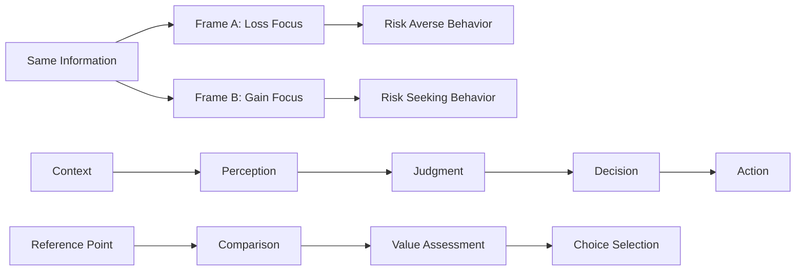

# 🧭 Framing Effect

> **Master the hidden power of presentation to transform understanding and decision-making**

## 🎯 **What It Is**

The Framing Effect is a cognitive bias where people's decisions and reactions change dramatically based on how information is presented, rather than the objective content itself. Discovered by Amos Tversky and Daniel Kahneman, this effect reveals that the context, language, and structure of information can completely alter human perception, judgment, and behavior. In AI development, understanding framing effects is crucial for designing interfaces, communications, and systems that guide users toward better decisions and outcomes.

**Core Insight**: Information never exists in isolation—how we present it shapes what people perceive, understand, and decide. Master the frame, and you master the message.

## ⚡ **The Psychology of Perception**

### **Framing Mechanisms in Human Cognition**


**The Four Dimensions of Framing:**
- **Valence**: Positive vs. negative presentation of the same facts
- **Reference Point**: What baseline is used for comparison
- **Temporal**: Short-term vs. long-term perspective framing
- **Domain**: Which aspect of a situation is emphasized

## 🎯 **When to Use**

### **💻 AI Interface Design**
- Presenting AI model predictions and confidence levels
- Designing user onboarding experiences for AI tools
- Creating error messages and system status communications
- Framing AI capabilities and limitations to users

### **📊 Data and Analytics Communication**
- Presenting business intelligence and AI insights
- Communicating model performance and metrics
- Designing dashboards and data visualizations
- Framing statistical results and predictions

### **🎮 User Experience Optimization**
- A/B testing different presentations of features
- Optimizing conversion rates and user engagement
- Designing choice architectures in AI applications
- Creating persuasive AI recommendation systems

## 🧠 **The Science of Framing Effects**

### **1️⃣ Gain vs. Loss Framing**
```
Definition: The same outcome presented as a gain or loss relative to a reference point

Psychological Mechanism:
• Loss aversion: People feel losses more intensely than equivalent gains
• Reference point dependency: Judgments relative to starting position
• Risk preference reversal: Risk averse for gains, risk seeking for losses

AI Applications:
• Model performance: "95% accuracy" vs "5% error rate"
• Feature adoption: "Saves 2 hours daily" vs "Eliminates 2 hours of wasted time"
• Security messaging: "Protects your data" vs "Prevents data breaches"
• Resource usage: "Uses only 20% of memory" vs "80% memory remains available"

Example - AI Feature Introduction:
Loss Frame: "Without our AI assistant, you'll waste 3 hours daily on routine tasks"
Gain Frame: "Our AI assistant gives you 3 extra hours daily for strategic work"
Impact: Gain frame typically increases adoption rates by 20-40%

Advanced Implementation:
• Context-sensitive framing based on user personality and preferences
• Dynamic framing adaptation based on user response patterns
• A/B testing frameworks for optimal frame selection
• Cultural adaptation of gain/loss framing across different user groups
```

### **2️⃣ Reference Point Manipulation**
```
Definition: Changing the baseline or anchor point against which options are compared

Psychological Mechanism:
• Anchoring bias: First piece of information heavily influences subsequent judgments
• Contrast effects: Options appear different when reference points change
• Status quo bias: Current state becomes reference point for change evaluation

AI Applications:
• Pricing AI services relative to different baselines
• Comparing AI performance to different benchmarks
• Setting expectations for AI improvement over time
• Framing AI automation benefits against current manual processes

Example - AI Model Performance:
Technical Frame: "Model achieves 87% F1 score on benchmark dataset"
Improvement Frame: "Model performs 23% better than previous generation"
Human Comparison Frame: "Model matches expert human performance"
Business Frame: "Model reduces error costs by $50K monthly"

Strategic Reference Point Selection:
• Industry benchmarks for competitive advantage framing
• Historical performance for improvement narrative
• Human baselines for capability demonstration
• Cost baselines for ROI justification
• Perfect performance for limitation acknowledgment
```

### **3️⃣ Temporal Framing Effects**
```
Definition: Emphasizing short-term vs. long-term consequences of decisions

Psychological Mechanism:
• Temporal discounting: People value immediate outcomes more than future ones
• Present bias: Tendency to overweight immediate costs and benefits
• Construal level theory: Abstract vs. concrete thinking varies with time distance

AI Applications:
• Framing AI investment decisions and ROI timelines
• Communicating AI learning and improvement curves
• Managing expectations for AI deployment and adoption
• Balancing immediate costs with long-term benefits

Example - AI Implementation Project:
Short-term Frame: "Initial 3-month setup period requires significant engineering resources"
Long-term Frame: "5-year productivity gains will exceed implementation costs by 400%"
Balanced Frame: "3-month investment unlocks years of operational efficiency"

Temporal Framing Strategies:
• Match framing to audience temporal preferences (quarterly vs. annual planning)
• Use visualization to make long-term benefits more concrete
• Break long-term benefits into intermediate milestones
• Address both immediate concerns and future vision
• Create temporal narratives that connect short and long-term outcomes
```

### **4️⃣ Attribute Framing and Salience**
```
Definition: Emphasizing different attributes or aspects of the same option or situation

Psychological Mechanism:
• Selective attention: People focus on highlighted attributes
• Attribute weighting: Emphasized features become more important in decisions
• Availability heuristic: Easily recalled attributes influence judgment

AI Applications:
• Highlighting different AI model capabilities based on use case
• Emphasizing various benefits of AI automation for different stakeholders
• Framing AI risks and benefits for different audiences
• Positioning AI features based on user needs and context

Example - AI Chatbot Features:
Technical Audience: "Advanced natural language processing with transformer architecture"
Business Audience: "Reduces customer service costs by 40% while improving satisfaction"
End User Audience: "Get instant, accurate answers to your questions 24/7"
Security Audience: "Enterprise-grade encryption with full audit trail and compliance"

Attribute Framing Framework:
• Audience analysis: Map stakeholder priorities to relevant attributes
• Context sensitivity: Adapt attribute emphasis based on decision context
• Competitive positioning: Emphasize differentiating attributes
• Value proposition alignment: Frame attributes that support key value drivers
• Multi-attribute integration: Balance multiple attributes without information overload
```

## 🛠️ **Practical Implementation Framework**

### **🎯 Framing Strategy Development**

**Systematic Framing Design Process:**
```python
class FramingStrategyEngine:
    def __init__(self):
        self.framing_dimensions = self.initialize_framing_framework()
        self.audience_profiles = self.load_audience_characteristics()
        self.context_variables = self.define_context_factors()
    
    def design_optimal_frame(self, content, audience, context, objectives):
        # Analyze audience characteristics and preferences
        audience_analysis = self.analyze_audience_preferences(audience)
        
        # Assess context factors
        context_factors = self.evaluate_context_variables(context)
        
        # Generate frame variations
        frame_options = self.generate_frame_variations(content, audience_analysis)
        
        # Optimize for objectives
        optimal_frame = self.optimize_for_objectives(frame_options, objectives)
        
        return optimal_frame
    
    def generate_frame_variations(self, content, audience_analysis):
        variations = {}
        
        # Gain vs Loss framing
        variations['gain_frame'] = self.create_gain_frame(content, audience_analysis)
        variations['loss_frame'] = self.create_loss_frame(content, audience_analysis)
        
        # Reference point variations
        variations['improvement_frame'] = self.frame_as_improvement(content)
        variations['competitive_frame'] = self.frame_vs_competition(content)
        variations['absolute_frame'] = self.frame_absolute_terms(content)
        
        # Temporal framing
        variations['immediate_frame'] = self.emphasize_immediate_benefits(content)
        variations['long_term_frame'] = self.emphasize_long_term_value(content)
        variations['progressive_frame'] = self.frame_progressive_benefits(content)
        
        # Attribute emphasis
        variations['technical_frame'] = self.emphasize_technical_attributes(content)
        variations['business_frame'] = self.emphasize_business_value(content)
        variations['user_frame'] = self.emphasize_user_benefits(content)
        
        return variations
    
    def a_b_test_frames(self, frame_variations, success_metrics):
        test_design = {
            "control_group": frame_variations['baseline'],
            "test_groups": {f"test_{i}": frame for i, frame in enumerate(frame_variations.values())},
            "success_metrics": success_metrics,
            "statistical_significance": 0.05,
            "minimum_sample_size": self.calculate_minimum_sample_size(success_metrics)
        }
        
        return test_design
```

### **📊 Advanced Framing Techniques**

**Context-Adaptive Framing:**
```python
def implement_adaptive_framing():
    adaptive_strategies = {
        "personality_based_framing": {
            "analytical_users": {
                "preferred_frames": "Data-driven, technical accuracy, statistical evidence",
                "avoid": "Emotional appeals, vague benefits, unsupported claims",
                "example": "Model achieves 94.7% accuracy with 0.03 standard deviation"
            },
            
            "relationship_oriented_users": {
                "preferred_frames": "Team benefits, collaboration enhancement, user impact",
                "avoid": "Cold statistics, technical jargon, individual focus",
                "example": "Helps your team collaborate more effectively and serve customers better"
            },
            
            "results_oriented_users": {
                "preferred_frames": "Bottom-line impact, efficiency gains, competitive advantage",
                "avoid": "Process details, theoretical benefits, long explanations",
                "example": "Increases revenue by 15% while reducing operational costs"
            },
            
            "innovation_oriented_users": {
                "preferred_frames": "Cutting-edge technology, future possibilities, creative potential",
                "avoid": "Conservative approaches, incremental improvements, risk emphasis",
                "example": "Breakthrough AI technology that opens entirely new possibilities"
            }
        },
        
        "cultural_framing_adaptation": {
            "individualistic_cultures": {
                "emphasis": "Personal benefits, individual achievement, autonomy",
                "framing": "How this empowers you to accomplish your goals",
                "success_metrics": "Individual productivity and satisfaction"
            },
            
            "collectivistic_cultures": {
                "emphasis": "Group harmony, collective benefits, social responsibility",
                "framing": "How this benefits the team and organization",
                "success_metrics": "Group performance and consensus"
            },
            
            "uncertainty_avoidant_cultures": {
                "emphasis": "Risk reduction, reliability, proven track record",
                "framing": "Reduces uncertainty and provides stable, predictable results",
                "success_metrics": "Risk mitigation and reliability measures"
            },
            
            "uncertainty_tolerant_cultures": {
                "emphasis": "Innovation, flexibility, exploration opportunities",
                "framing": "Opens new possibilities and enables creative exploration",
                "success_metrics": "Innovation and adaptability outcomes"
            }
        }
    }
    
    return adaptive_strategies

def implement_dynamic_reframing():
    reframing_triggers = {
        "user_resistance": {
            "detection": "User shows negative response to current frame",
            "reframe_strategy": "Switch from loss to gain frame, or vice versa",
            "example": "If 'prevents errors' fails, try 'ensures accuracy'"
        },
        
        "engagement_decline": {
            "detection": "Decreased interaction or attention metrics",
            "reframe_strategy": "Shift temporal focus or change attribute emphasis",
            "example": "If long-term benefits don't engage, highlight immediate wins"
        },
        
        "context_change": {
            "detection": "Change in user role, project phase, or organizational priorities",
            "reframe_strategy": "Adapt frame to new context and stakeholder priorities",
            "example": "Shift from technical to business frame when audience changes"
        },
        
        "competitive_pressure": {
            "detection": "New competitive products or market conditions",
            "reframe_strategy": "Emphasize differentiating attributes and competitive advantages",
            "example": "Highlight unique capabilities when competitors enter market"
        }
    }
    
    return reframing_triggers
```

## 📈 **Advanced Applications in AI Development**

### **🤖 AI Model Communication and Explanation**

**Framing AI Capabilities and Limitations:**
```python
class AIExplanationFraming:
    def __init__(self):
        self.explanation_strategies = self.define_explanation_approaches()
        self.audience_adaptations = self.create_audience_adaptations()
    
    def frame_model_performance(self, performance_metrics, audience, context):
        framing_strategies = {
            "technical_audience": {
                "accuracy_frame": f"Model achieves {performance_metrics['accuracy']:.3f} accuracy with {performance_metrics['std_dev']:.4f} standard deviation",
                "comparison_frame": f"Outperforms baseline by {performance_metrics['improvement']:.1%}",
                "limitation_frame": f"Performance degrades in {performance_metrics['weak_domains']} domains"
            },
            
            "business_audience": {
                "value_frame": f"Reduces operational costs by ${performance_metrics['cost_savings']:,} annually",
                "efficiency_frame": f"Processes {performance_metrics['throughput']:,} items per hour",
                "risk_frame": f"Prevents {performance_metrics['error_reduction']:.1%} of costly errors"
            },
            
            "end_user_audience": {
                "benefit_frame": f"Saves you {performance_metrics['time_saved']} hours per week",
                "reliability_frame": f"Works correctly {performance_metrics['reliability']:.1%} of the time",
                "support_frame": f"Available 24/7 to help with your tasks"
            }
        }
        
        return framing_strategies[audience]
    
    def frame_uncertainty_and_confidence(self, confidence_levels, prediction_type):
        uncertainty_frames = {
            "confidence_emphasis": {
                "high_confidence": f"Very confident prediction ({confidence_levels['score']:.1%} certainty)",
                "medium_confidence": f"Reliable prediction with some uncertainty",
                "low_confidence": f"Preliminary prediction requiring validation"
            },
            
            "range_emphasis": {
                "point_estimate": f"Best estimate: {prediction_type['value']}",
                "confidence_interval": f"Expected range: {prediction_type['lower']} to {prediction_type['upper']}",
                "scenario_based": f"Optimistic: {prediction_type['best']}, Realistic: {prediction_type['likely']}, Conservative: {prediction_type['worst']}"
            },
            
            "actionability_emphasis": {
                "decision_ready": "Confidence level sufficient for decision-making",
                "monitoring_required": "Proceed with caution and monitoring",
                "investigation_needed": "Requires additional data before action"
            }
        }
        
        return uncertainty_frames
    
    def frame_ai_limitations_constructively(self, limitations, context):
        constructive_frames = {
            "boundary_setting": {
                "scope_definition": f"Designed specifically for {context['intended_use']}",
                "expertise_area": f"Expert in {context['strength_domains']}, relies on human judgment for {context['human_domains']}",
                "collaboration_model": f"Works best when combined with human expertise in {context['collaboration_areas']}"
            },
            
            "transparency_building": {
                "honest_capability": f"Can handle {context['capability_range']} with high reliability",
                "improvement_trajectory": f"Continuously learning and improving in {context['improvement_areas']}",
                "fallback_strategy": f"Escalates to human experts when encountering {context['escalation_triggers']}"
            },
            
            "trust_building": {
                "reliability_domains": f"Consistently reliable for {context['reliable_tasks']}",
                "uncertainty_communication": f"Always indicates when uncertain or operating outside expertise",
                "human_oversight": f"Designed with human oversight for {context['oversight_areas']}"
            }
        }
        
        return constructive_frames
```

### **🎨 User Interface and Experience Framing**

**Choice Architecture in AI Applications:**
```python
def design_ai_choice_architecture():
    choice_framing_patterns = {
        "default_option_framing": {
            "smart_defaults": {
                "principle": "Frame the AI-recommended option as the default choice",
                "implementation": "Pre-select AI suggestions with easy override capability",
                "example": "AI recommends [Option A] based on your preferences. Choose different option?"
            },
            
            "opt_in_vs_opt_out": {
                "principle": "Frame AI features as opt-out rather than opt-in when beneficial",
                "implementation": "Enable helpful AI features by default with clear disable options",
                "example": "Smart suggestions enabled (disable in settings) vs. Enable smart suggestions?"
            }
        },
        
        "option_presentation_order": {
            "primacy_effect": {
                "principle": "Present best AI recommendations first to leverage primacy bias",
                "implementation": "Order AI suggestions by confidence and expected value",
                "example": "Top recommendation appears first with confidence indicator"
            },
            
            "anchoring_through_order": {
                "principle": "Use first option to set reference point for subsequent choices",
                "implementation": "Lead with premium AI capabilities to anchor value perception",
                "example": "Start with advanced AI features, then show basic options"
            }
        },
        
        "scarcity_and_urgency_framing": {
            "limited_time_offers": {
                "principle": "Frame AI feature access or pricing with temporal limitations",
                "implementation": "Early access periods, beta testing opportunities",
                "example": "Limited beta access to advanced AI features"
            },
            
            "capacity_constraints": {
                "principle": "Frame AI resources as limited to encourage timely action",
                "implementation": "Computational resource allocation messaging",
                "example": "Reserve your AI processing capacity for this month"
            }
        }
    }
    
    return choice_framing_patterns

def implement_persuasive_ai_communication():
    persuasion_frameworks = {
        "social_proof_framing": {
            "user_adoption": "Join 50,000+ professionals already using our AI assistant",
            "expert_endorsement": "Recommended by leading AI researchers and practitioners",
            "peer_comparison": "Teams like yours report 40% productivity gains",
            "success_stories": "See how [Similar Company] transformed their workflow"
        },
        
        "authority_and_credibility": {
            "technical_credentials": "Built by PhD AI researchers from top universities",
            "industry_recognition": "Winner of AI Innovation Award 2024",
            "scientific_validation": "Peer-reviewed research validates our approach",
            "enterprise_trust": "Trusted by Fortune 500 companies for mission-critical tasks"
        },
        
        "reciprocity_and_commitment": {
            "value_first": "Try our AI assistant free for 30 days - see the value first",
            "educational_content": "Access our AI knowledge base and tutorials at no cost",
            "tool_provision": "Free AI audit of your current processes and recommendations",
            "trial_extension": "Extend your trial - we want you to experience full benefits"
        },
        
        "loss_aversion_applications": {
            "opportunity_cost": "Don't let competitors gain AI advantage while you wait",
            "current_inefficiency": "Stop losing hours daily to manual tasks AI could handle",
            "data_insights": "Unlock hidden insights in data you're already collecting",
            "skill_development": "Avoid falling behind in AI literacy and capabilities"
        }
    }
    
    return persuasion_frameworks
```

## 🚨 **Ethical Considerations and Responsible Framing**

### **❌ Framing Manipulation vs. Beneficial Influence**

**Ethical Framing Guidelines:**
```python
def establish_ethical_framing_standards():
    ethical_framework = {
        "transparency_requirements": {
            "honest_representation": {
                "principle": "Frames must accurately represent underlying reality",
                "implementation": "No distortion of facts or misleading implications",
                "violation_example": "Claiming '99% success rate' when measuring trivial success criteria",
                "ethical_alternative": "Clear success criteria with honest performance measurement"
            },
            
            "complete_information": {
                "principle": "Important information should not be hidden through framing",
                "implementation": "Disclose limitations, risks, and alternatives",
                "violation_example": "Emphasizing benefits while hiding significant costs or risks",
                "ethical_alternative": "Balanced presentation of benefits, costs, and trade-offs"
            },
            
            "manipulation_avoidance": {
                "principle": "Framing should inform and persuade, not manipulate or deceive",
                "implementation": "Respect user autonomy and decision-making capacity",
                "violation_example": "Using fear appeals to pressure adoption of unnecessary AI features",
                "ethical_alternative": "Educational framing that empowers informed decision-making"
            }
        },
        
        "user_empowerment_focus": {
            "informed_consent": {
                "principle": "Users should understand how they're being influenced",
                "implementation": "Transparent about persuasive techniques and AI recommendations",
                "example": "This recommendation is based on your past behavior and similar users' preferences"
            },
            
            "easy_reversal": {
                "principle": "Users should be able to easily change framed decisions",
                "implementation": "Clear opt-out mechanisms and preference controls",
                "example": "Change AI recommendation settings or disable persuasive features"
            },
            
            "alternative_presentation": {
                "principle": "Provide access to multiple frames and perspectives",
                "implementation": "Allow users to view information from different angles",
                "example": "View in: Technical details | Business impact | User benefits"
            }
        },
        
        "vulnerable_population_protection": {
            "cognitive_limitations": {
                "principle": "Extra care with users who may be more susceptible to framing effects",
                "implementation": "Simplified presentations, slower decision processes, additional safeguards",
                "consideration": "Children, elderly, people with cognitive impairments, high-stress situations"
            },
            
            "power_imbalances": {
                "principle": "Consider power dynamics in framing decisions",
                "implementation": "Avoid exploiting dependency or lack of alternatives",
                "example": "Don't use framing to pressure employees into accepting AI monitoring"
            }
        }
    }
    
    return ethical_framework

def implement_responsible_framing_practices():
    responsible_practices = {
        "regular_auditing": {
            "framing_impact_assessment": "Regularly evaluate actual impact of framing choices",
            "user_feedback_integration": "Systematically collect and respond to user concerns",
            "bias_detection": "Monitor for unintended biases in framing approaches",
            "outcome_tracking": "Track whether framing leads to beneficial or harmful outcomes"
        },
        
        "stakeholder_consideration": {
            "multi_stakeholder_analysis": "Consider impact on all affected parties",
            "long_term_consequences": "Evaluate long-term effects of framing strategies",
            "cultural_sensitivity": "Adapt framing to respect cultural values and norms",
            "professional_standards": "Align with industry ethical guidelines and standards"
        },
        
        "continuous_improvement": {
            "ethical_training": "Regular training on ethical framing for design teams",
            "ethics_review_process": "Include ethics review in framing strategy development",
            "industry_collaboration": "Share best practices and learn from industry peers",
            "research_integration": "Stay current with research on framing effects and ethics"
        }
    }
    
    return responsible_practices
```

## 📊 **Measurement and Optimization**

### **🎯 Framing Effectiveness Metrics**

**Comprehensive Measurement Framework:**
```python
def measure_framing_effectiveness():
    measurement_framework = {
        "immediate_response_metrics": {
            "attention_capture": {
                "eye_tracking": "Time spent viewing framed content",
                "engagement_metrics": "Click-through rates, interaction depth",
                "comprehension_tests": "Understanding of framed information"
            },
            
            "attitude_formation": {
                "sentiment_analysis": "Emotional response to different frames",
                "preference_measurement": "Choice patterns across frame variations",
                "confidence_assessment": "User confidence in framed decisions"
            },
            
            "behavioral_intention": {
                "stated_preferences": "Declared intention to act on framed information",
                "commitment_measures": "Willingness to commit resources or time",
                "sharing_behavior": "Tendency to share or recommend framed content"
            }
        },
        
        "behavioral_outcome_metrics": {
            "action_rates": {
                "conversion_metrics": "Percentage of users taking desired actions",
                "completion_rates": "Follow-through on framed decisions",
                "adoption_speed": "Time from exposure to action"
            },
            
            "decision_quality": {
                "accuracy_measures": "Objective quality of user decisions",
                "satisfaction_tracking": "User satisfaction with outcomes",
                "regret_minimization": "Reduced regret about framed decisions"
            },
            
            "long_term_outcomes": {
                "retention_rates": "Continued engagement with framed choices",
                "recommendation_behavior": "User advocacy and referrals",
                "learning_effects": "Improved decision-making over time"
            }
        },
        
        "system_level_metrics": {
            "scalability_measures": {
                "cross_population_effectiveness": "Frame performance across user segments",
                "cultural_transferability": "Frame effectiveness across cultures",
                "temporal_stability": "Frame effectiveness over time"
            },
            
            "ethical_impact_assessment": {
                "fairness_metrics": "Equal effectiveness across demographic groups",
                "autonomy_preservation": "Maintenance of user agency and choice",
                "well_being_outcomes": "Positive impact on user welfare"
            }
        }
    }
    
    return measurement_framework

def optimize_framing_strategies():
    optimization_approaches = {
        "a_b_testing_framework": {
            "experimental_design": {
                "control_group": "Baseline frame or neutral presentation",
                "treatment_groups": "Multiple frame variations",
                "randomization": "Random assignment to minimize bias",
                "statistical_power": "Adequate sample size for reliable results"
            },
            
            "multivariate_testing": {
                "frame_combinations": "Test multiple framing dimensions simultaneously",
                "interaction_effects": "Identify how framing elements work together",
                "optimization_algorithms": "Use AI to find optimal frame combinations",
                "personalization_testing": "Test personalized vs. universal frames"
            }
        },
        
        "machine_learning_optimization": {
            "predictive_modeling": {
                "user_response_prediction": "Predict optimal frame for individual users",
                "context_adaptation": "Adjust frames based on situational factors",
                "outcome_optimization": "Optimize for desired behavioral outcomes",
                "continuous_learning": "Improve frame selection through user interaction data"
            },
            
            "reinforcement_learning": {
                "adaptive_framing": "Learn optimal framing strategies through trial and error",
                "multi_armed_bandits": "Balance exploration of new frames with exploitation of successful ones",
                "contextual_bandits": "Adapt frame selection based on user and context features",
                "long_term_optimization": "Optimize for cumulative rather than immediate outcomes"
            }
        }
    }
    
    return optimization_approaches
```

## 🔗 **Integration with Other Mental Models**

### **🧠 Complementary Frameworks**

**Synergistic Cognitive Models:**
- **[[Confirmation Bias]]**: Understand how framing interacts with existing beliefs
- **[[Anchoring Effect]]**: Use reference points strategically in framing
- **[[Social Proof]]**: Combine social influence with framing effects
- **[[Loss Aversion]]**: Leverage asymmetric value perception in frames
- **[[Cognitive Load Theory]]**: Design frames that minimize cognitive burden

**Integration Examples:**
```python
def integrate_framing_with_cognitive_models():
    integrated_approaches = {
        "framing_plus_social_proof": {
            "social_validation": "Frame choices by showing what similar others have chosen",
            "expert_endorsement": "Use authority figures to frame technical AI decisions",
            "consensus_building": "Frame group decisions around emerging consensus",
            "peer_comparison": "Frame individual performance relative to peer groups"
        },
        
        "framing_plus_anchoring": {
            "high_anchor_setting": "Start with premium AI features to anchor value perception",
            "adjustment_framing": "Frame decisions as adjustments from reasonable starting points",
            "multiple_anchor_strategy": "Use different anchors for different aspects of AI solutions",
            "anchor_sequence_optimization": "Order frames to create beneficial anchoring sequences"
        },
        
        "framing_plus_cognitive_load": {
            "simple_frame_design": "Reduce cognitive burden through clear, simple frames",
            "progressive_disclosure": "Frame complex AI concepts in digestible layers",
            "visual_framing": "Use graphics and design to reduce text-based cognitive load",
            "decision_support": "Frame choices to minimize decision fatigue and complexity"
        }
    }
    
    return integrated_approaches
```

## 🎯 **Advanced Mastery Guide**

### **📈 Skill Development Progression**

**Level 1: Framing Awareness**
- Recognize framing effects in everyday communications and interfaces
- Identify gain/loss frames, reference points, and temporal perspectives
- Practice reframing simple messages for different audiences

**Level 2: Strategic Frame Design**
- Design deliberate frames for specific audiences and objectives
- Test frame variations through A/B testing and user feedback
- Apply ethical considerations to avoid manipulative framing

**Level 3: Context-Adaptive Framing**
- Create dynamic framing systems that adapt to user characteristics
- Integrate framing with broader persuasion and influence strategies
- Design frames that work across cultures and user segments

**Level 4: AI-Enhanced Framing Systems**
- Build machine learning systems that optimize framing automatically
- Create sophisticated measurement and optimization frameworks
- Lead organizational adoption of ethical framing practices

**Level 5: Framing Research and Innovation**
- Contribute to research on framing effects in AI and technology
- Develop novel applications of framing principles
- Train others in advanced framing techniques and ethics

### **🛠️ Practical Mastery Framework**

**Daily Practice Exercises:**
```python
def daily_framing_practice():
    practice_exercises = {
        "frame_analysis": {
            "media_consumption": "Analyze how news and advertisements frame information",
            "interface_evaluation": "Examine how apps and websites frame user choices",
            "conversation_awareness": "Notice framing in professional and personal conversations"
        },
        
        "frame_creation": {
            "message_reframing": "Take important messages and create 3 different frames",
            "audience_adaptation": "Adapt the same information for different stakeholder groups",
            "ethical_evaluation": "Assess frames for ethical implications and user benefit"
        },
        
        "systematic_testing": {
            "a_b_test_design": "Create experiments to test frame effectiveness",
            "outcome_measurement": "Track results of different framing approaches",
            "iteration_improvement": "Refine frames based on performance data"
        }
    }
    
    return practice_exercises
```

## 🏆 **Success Stories and Case Studies**

### **Case Study 1: AI Healthcare Diagnosis Communication**

**Challenge**: Patients were rejecting AI-assisted diagnostic recommendations due to fear and misunderstanding
**Framing Intervention**:
- **Before**: "AI analysis indicates 87% probability of condition X"
- **After**: "Advanced analysis suggests condition X is worth discussing with your doctor. This technology helps doctors make more accurate diagnoses by catching details that might be missed."

**Results**: 60% increase in patient acceptance of AI-assisted diagnosis, improved doctor-patient communication

### **Case Study 2: Enterprise AI Adoption**

**Challenge**: IT department resistant to AI automation tools due to job security concerns
**Reframing Strategy**:
- **Loss Frame**: "Manual processes waste 40% of your time on routine tasks"
- **Gain Frame**: "AI automation gives you 40% more time for strategic, high-value work"
- **Professional Development Frame**: "AI tools help you become more skilled and valuable"

**Outcome**: 75% adoption rate vs. 20% with technical-only framing

## 🚀 **Takeaways and Next Steps**

### **Key Insights**
1. **Presentation shapes perception** - How you frame information is often more important than the information itself
2. **Context matters critically** - The same frame can have opposite effects in different contexts
3. **Ethics are essential** - Powerful framing requires responsible application and user respect
4. **Testing drives improvement** - Systematic experimentation reveals optimal framing strategies

### **Implementation Roadmap**
1. **Frame Audit** - Analyze current communications for unintentional framing effects
2. **Strategic Reframing** - Deliberately design frames for key messages and interfaces
3. **Testing Infrastructure** - Build capability to test and optimize framing approaches
4. **Ethical Guidelines** - Establish responsible framing practices and review processes
5. **Continuous Improvement** - Create systems for ongoing framing optimization

**Start Today:**
- Choose one important message you communicate regularly
- Create three different frames for the same information
- Test them with different audiences or in different contexts
- Measure the impact on understanding and action
- Refine based on results and ethical considerations

Remember: **The Framing Effect reveals that reality is interpreted, not just observed. Master framing to help others see clearly, decide wisely, and act effectively—while always respecting their autonomy and wellbeing.**
