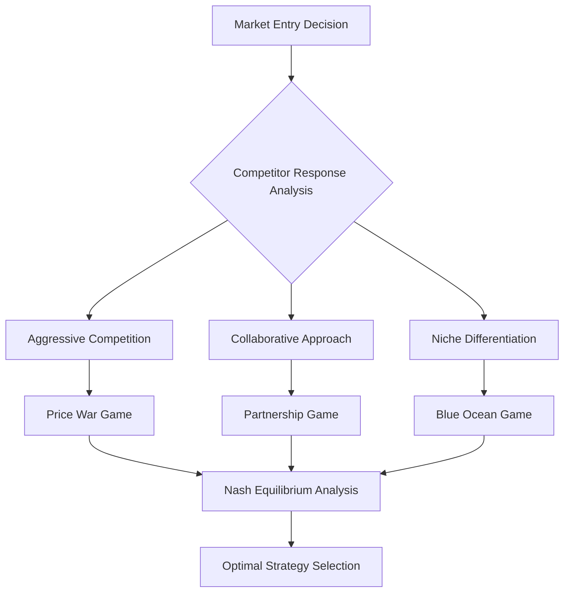

# 🎯 Game Theory Matrix

> **Core Insight**: Every AI decision exists in a context where multiple players (users, competitors, systems) make strategic choices - understand the game to win it.

---

## **🔬 What It Is**

**Game Theory Matrix** is a framework for analyzing strategic interactions where the outcome for each participant depends on the choices made by all participants. In AI development, these "games" include:

- **🏢 Competitive AI**: How your AI strategy affects and responds to competitors
- **👥 User Adoption**: How user choices interact with AI capabilities
- **🤝 Human-AI Collaboration**: How humans and AI systems can optimize together
- **🏗️ Platform Dynamics**: How different AI services compete and cooperate

Think of it as **strategic chess** - every move considers what others might do in response.

---

## **🧪 The Science Behind It**

### **Mathematical Foundation**
```python
# Basic Game Theory Matrix
class GameTheoryMatrix:
    def __init__(self, players, strategies, payoffs):
        self.players = players
        self.strategies = strategies
        self.payoffs = payoffs  # Multi-dimensional payoff matrix
    
    def find_nash_equilibrium(self):
        # Find stable strategy combinations where no player can unilaterally improve
        equilibria = []
        
        for strategy_combo in self.all_strategy_combinations():
            if self.is_nash_equilibrium(strategy_combo):
                equilibria.append(strategy_combo)
        
        return equilibria
    
    def is_nash_equilibrium(self, strategy_combo):
        # Check if any player can improve by changing strategy
        for player in self.players:
            current_payoff = self.get_payoff(player, strategy_combo)
            
            for alternative_strategy in self.strategies[player]:
                new_combo = self.substitute_strategy(strategy_combo, player, alternative_strategy)
                new_payoff = self.get_payoff(player, new_combo)
                
                if new_payoff > current_payoff:
                    return False  # Player can improve, not equilibrium
        
        return True
```

### **Key Principles**
1. **Nash Equilibrium**: Stable state where no player can improve by changing strategy alone
2. **Dominant Strategies**: Choices that are best regardless of what others do
3. **Zero-Sum vs Positive-Sum**: Whether one player's gain requires another's loss
4. **Information Asymmetry**: Different players have different information

---

## **🎯 When to Use This Model**

### **Apply When:**
- ✅ **AI competitive strategy** and market positioning decisions
- ✅ **Platform design** where multiple stakeholders interact
- ✅ **Pricing strategies** for AI services and products
- ✅ **Partnership negotiations** and ecosystem building

### **Critical For:**
- 🎮 **Multi-player scenarios** where outcomes depend on others' choices
- 🎮 **Strategic planning** in competitive AI markets
- 🎮 **Incentive design** for human-AI collaboration
- 🎮 **Risk assessment** of strategic moves

---

## **💡 Practical Applications**

### **🏢 AI Platform Competition**

**Classic Platform Game:**
```python
class AILPlatformGame:
    def __init__(self):
        self.players = ['Your_AI_Platform', 'Competitor_A', 'Competitor_B']
        self.strategies = {
            'Your_AI_Platform': ['Open_Source', 'Closed_Premium', 'Freemium'],
            'Competitor_A': ['Open_Source', 'Closed_Premium', 'Freemium'],
            'Competitor_B': ['Open_Source', 'Closed_Premium', 'Freemium']
        }
    
    def calculate_payoffs(self, strategy_combination):
        # Payoff depends on market dynamics
        market_share = self.estimate_market_share(strategy_combination)
        profit_margin = self.estimate_profit_margin(strategy_combination)
        ecosystem_value = self.estimate_ecosystem_value(strategy_combination)
        
        return {
            'Your_AI_Platform': {
                'market_share': market_share['Your_AI_Platform'],
                'profit': profit_margin['Your_AI_Platform'] * market_share['Your_AI_Platform'],
                'ecosystem_strength': ecosystem_value['Your_AI_Platform']
            }
        }
    
    def strategic_analysis(self):
        # Analyze different competitive scenarios
        scenarios = {
            'all_open_source': ['Open_Source', 'Open_Source', 'Open_Source'],
            'all_premium': ['Closed_Premium', 'Closed_Premium', 'Closed_Premium'],
            'mixed_strategies': ['Freemium', 'Open_Source', 'Closed_Premium']
        }
        
        analysis = {}
        for scenario_name, strategies in scenarios.items():
            payoffs = self.calculate_payoffs(strategies)
            analysis[scenario_name] = {
                'payoffs': payoffs,
                'stability': self.check_equilibrium_stability(strategies),
                'recommended_response': self.recommend_strategy(strategies)
            }
        
        return analysis
```

### **👥 User Adoption Game**

**User-AI Interaction Matrix:**
```python
class UserAdoptionGame:
    def __init__(self):
        self.players = ['Users', 'AI_System']
        self.user_strategies = ['High_Engagement', 'Low_Engagement', 'Skeptical']
        self.ai_strategies = ['Helpful_Adaptive', 'Pushy_Intrusive', 'Minimal_Passive']
    
    def analyze_adoption_dynamics(self):
        # Different strategy combinations lead to different outcomes
        outcomes = {
            ('High_Engagement', 'Helpful_Adaptive'): {
                'user_satisfaction': 0.9,
                'ai_effectiveness': 0.9,
                'long_term_adoption': 0.95
            },
            ('Low_Engagement', 'Pushy_Intrusive'): {
                'user_satisfaction': 0.2,
                'ai_effectiveness': 0.3,
                'long_term_adoption': 0.1
            },
            ('Skeptical', 'Minimal_Passive'): {
                'user_satisfaction': 0.6,
                'ai_effectiveness': 0.4,
                'long_term_adoption': 0.3
            }
        }
        
        # Find optimal strategy pairs
        return self.find_win_win_strategies(outcomes)
    
    def design_incentive_alignment(self):
        # Create positive-sum game where both users and AI benefit
        return {
            'user_incentives': {
                'immediate_value': 'Show clear benefit from each interaction',
                'learning_curve': 'Make AI more helpful as user engages more',
                'control': 'Give users agency over AI behavior'
            },
            'ai_optimization': {
                'feedback_loops': 'Improve from user engagement patterns',
                'personalization': 'Better user modeling from more data',
                'effectiveness': 'More accurate when users provide feedback'
            }
        }
```

### **🤝 Human-AI Collaboration Game**

**Collaborative Strategy Matrix:**
```python
class HumanAICollaborationGame:
    def __init__(self):
        self.human_strategies = ['Trust_and_Verify', 'Over_Rely', 'Under_Utilize']
        self.ai_strategies = ['Transparent_Confident', 'Uncertain_Cautious', 'Overconfident_Opaque']
    
    def collaboration_outcomes(self):
        # Matrix of collaboration effectiveness
        return {
            ('Trust_and_Verify', 'Transparent_Confident'): {
                'decision_quality': 0.95,
                'human_learning': 0.9,
                'ai_improvement': 0.85,
                'efficiency': 0.9
            },
            ('Over_Rely', 'Overconfident_Opaque'): {
                'decision_quality': 0.6,
                'human_learning': 0.2,
                'ai_improvement': 0.3,
                'efficiency': 0.7
            },
            ('Under_Utilize', 'Uncertain_Cautious'): {
                'decision_quality': 0.7,
                'human_learning': 0.4,
                'ai_improvement': 0.2,
                'efficiency': 0.5
            }
        }
    
    def design_optimal_collaboration(self):
        # Create mechanisms that incentivize optimal strategies
        return {
            'transparency_mechanisms': 'AI explains confidence and reasoning',
            'verification_tools': 'Easy ways for humans to check AI output',
            'learning_feedback': 'Both sides learn from collaboration outcomes',
            'responsibility_sharing': 'Clear accountability for different decisions'
        }
```

---

## **📈 Strategic Applications**

### **1. AI Market Entry Strategy**



### **2. AI Ethics and Regulation Game**

| **Player** | **Strategy Options** | **Payoff Considerations** |
|------------|---------------------|---------------------------|
| **🏢 AI Companies** | Self-regulate, Minimal compliance, Proactive leadership | Reputation, Costs, Competitive advantage |
| **🏛️ Regulators** | Strict rules, Collaborative oversight, Hands-off approach | Public safety, Innovation, Political support |
| **👥 Public** | Embrace AI, Demand restrictions, Selective adoption | Convenience, Privacy, Safety |

### **3. Ecosystem Development Game**

**Platform Strategy Analysis:**
```python
class EcosystemGame:
    def analyze_platform_strategies(self):
        return {
            'network_effects_game': {
                'strategy': 'Build developer ecosystem first',
                'payoff': 'Winner-takes-most market dynamics',
                'risk': 'High initial investment, competitor response'
            },
            'integration_game': {
                'strategy': 'Partner with existing platforms',
                'payoff': 'Faster adoption, reduced risk',
                'risk': 'Dependency, reduced differentiation'
            },
            'vertical_integration_game': {
                'strategy': 'Control full stack',
                'payoff': 'Higher margins, better UX',
                'risk': 'Resource intensive, slower scaling'
            }
        }
```

---

## **🔧 Advanced Strategies**

### **1. Dynamic Game Analysis**

```python
class DynamicGameAnalyzer:
    def __init__(self):
        self.game_history = []
        self.strategy_evolution = {}
    
    def analyze_sequential_games(self, time_periods):
        # Games that evolve over time
        for period in time_periods:
            current_game = self.get_game_state(period)
            
            # Players learn and adapt strategies
            updated_strategies = self.update_strategies_based_on_history(current_game)
            
            # Predict next period outcomes
            next_equilibrium = self.find_evolutionary_stable_strategy(updated_strategies)
            
            self.game_history.append({
                'period': period,
                'strategies': updated_strategies,
                'equilibrium': next_equilibrium,
                'payoffs': self.calculate_period_payoffs(next_equilibrium)
            })
        
        return self.analyze_long_term_convergence()
    
    def update_strategies_based_on_history(self, current_game):
        # Model how players learn and adapt
        learning_factors = {
            'imitation': 'Copy successful strategies',
            'innovation': 'Try new approaches',
            'retaliation': 'Respond to aggressive moves',
            'cooperation': 'Seek mutually beneficial outcomes'
        }
        
        return self.apply_learning_rules(current_game, learning_factors)
```

### **2. Multi-Level Game Theory**

```python
class MultiLevelGameTheory:
    def analyze_nested_games(self):
        # Games within games - e.g., company strategy affects team dynamics
        return {
            'macro_level': {
                'players': ['Industry_Leaders', 'Startups', 'Tech_Giants'],
                'strategies': ['AI_Investment_Level', 'Open_vs_Closed', 'Talent_Acquisition'],
                'timeframe': 'Years'
            },
            'meso_level': {
                'players': ['Product_Teams', 'Engineering_Teams', 'Business_Units'],
                'strategies': ['Resource_Allocation', 'Technology_Choices', 'Feature_Priorities'],
                'timeframe': 'Quarters'
            },
            'micro_level': {
                'players': ['Individual_Developers', 'Users', 'AI_Agents'],
                'strategies': ['Tool_Usage', 'Collaboration_Level', 'Learning_Investment'],
                'timeframe': 'Days_to_Weeks'
            }
        }
    
    def find_cross_level_equilibria(self):
        # How equilibria at one level affect games at other levels
        pass
```

### **3. Behavioral Game Theory**

```python
class BehavioralGameAnalysis:
    def incorporate_human_biases(self, standard_game):
        # Real humans don't always play rationally
        behavioral_factors = {
            'loss_aversion': 'Overweight potential losses vs gains',
            'fairness_preferences': 'Care about equitable outcomes',
            'bounded_rationality': 'Limited computational ability',
            'social_preferences': 'Care about others\' payoffs',
            'present_bias': 'Overweight immediate vs future payoffs'
        }
        
        # Adjust payoff calculations to account for psychology
        adjusted_payoffs = self.adjust_for_behavioral_factors(
            standard_game.payoffs, 
            behavioral_factors
        )
        
        return self.find_behavioral_equilibria(adjusted_payoffs)
```

---

## **⚠️ Common Pitfalls**

### **🚫 Analysis Traps**
- **Rationality Assumption**: Assuming all players are perfectly rational
- **Static Thinking**: Ignoring how games evolve over time
- **Payoff Oversimplification**: Reducing complex motivations to simple metrics

### **🚫 Strategic Traps**
- **Zero-Sum Mindset**: Missing win-win opportunities
- **Equilibrium Fixation**: Assuming current equilibrium is optimal or permanent
- **Single-Game Focus**: Not considering repeated interactions and reputation

### **🚫 Implementation Traps**
- **Analysis Paralysis**: Over-analyzing instead of acting
- **Competitor Obsession**: Focusing too much on others' strategies vs own strengths
- **Game Misidentification**: Solving the wrong strategic problem

---

## **📊 How to Measure Success**

### **Game Theory Metrics**
```python
game_theory_metrics = {
    'strategic_positioning': {
        'equilibrium_stability': 'How stable is current competitive position',
        'payoff_optimization': 'Are we maximizing our strategic payoffs',
        'option_value': 'Value of strategic flexibility'
    },
    'competitive_dynamics': {
        'market_response_time': 'Speed of competitor reactions',
        'strategy_differentiation': 'How unique is our strategic position',
        'coalition_potential': 'Opportunities for strategic partnerships'
    },
    'ecosystem_health': {
        'positive_sum_creation': 'Growing total value vs just capturing value',
        'stakeholder_alignment': 'How well incentives are aligned',
        'long_term_sustainability': 'Stability of strategic relationships'
    }
}
```

### **Strategic Validation**
```python
def validate_game_theory_strategy():
    return {
        'scenario_planning': 'Test strategy across different competitive scenarios',
        'war_gaming': 'Simulate competitor responses to strategic moves',
        'stakeholder_analysis': 'Validate payoff assumptions with real players',
        'pilot_testing': 'Small-scale tests of strategic hypotheses'
    }
```

---

## **🎯 Key Takeaways**

### **🎭 Mental Model in Action**
1. **🎮 Map the Game**: Identify all players, their strategies, and interdependent payoffs
2. **⚖️ Seek Win-Win**: Look for positive-sum games where everyone benefits
3. **🔮 Think Dynamically**: Consider how the game evolves over time and through repeated play
4. **🧠 Account for Psychology**: Real players aren't perfectly rational

### **🔄 Integration Points**
- **Enhances [Network Effects](./network-effects.md)**: Network games create powerful strategic dynamics
- **Supports [OODA Loop](./ooda-loop.md)**: Rapid strategic response to competitor moves
- **Complements [Pareto Principle](./pareto-principle.md)**: Focus on vital strategic interactions

### **💡 Remember**
> *"In AI strategy, you're never playing alone. Every decision affects and is affected by users, competitors, partners, and regulators. Understanding the game is the first step to winning it - but the best games are ones where everyone can win."*

**The goal isn't to beat other players but to design games where collaboration and competition create maximum value for everyone.**
