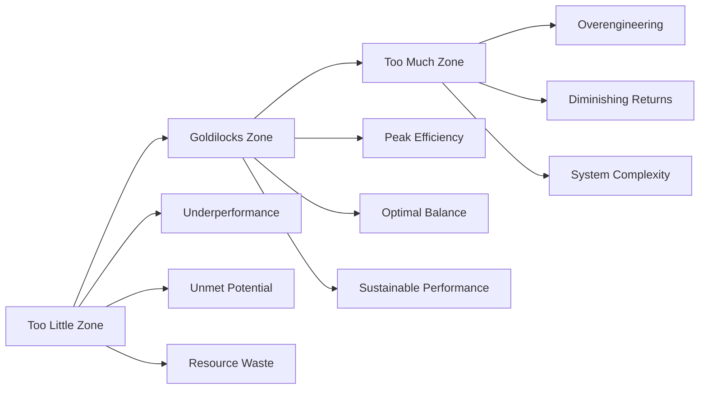

# 🎯 The Goldilocks Principle

> **"Not too little, not too much, but just right" - Discovering optimal zones for maximum AI system performance and sustainable growth**

*The Goldilocks Principle reveals that optimal performance exists in carefully balanced zones between extremes. In AI development and system design, this principle guides us to find the sweet spots where efficiency meets effectiveness, avoiding both under-optimization and over-optimization.*

## 🌟 **Introduction and Core Philosophy**

### **🎭 The Fairy Tale Foundation**

The Goldilocks Principle derives from the classic tale where Goldilocks discovers that the middle option is optimal - porridge that's not too hot or too cold, but just right. This simple story embodies a profound truth about optimization: peak performance typically exists in balanced zones rather than at extremes.

In the context of AI and technology systems, this principle becomes a powerful guide for:
- **Parameter optimization**: Finding optimal model configurations
- **Resource allocation**: Balancing computational costs with performance
- **System design**: Creating sustainable and scalable architectures
- **User experience**: Optimizing interfaces for usability without complexity
- **Business strategy**: Balancing innovation with practical implementation

### **🔬 Scientific and Mathematical Foundation**

The Goldilocks Principle is grounded in several mathematical and scientific concepts:

**Optimization Theory:**
```python
class GoldilocksOptimization:
    def __init__(self, parameter_space, objective_function):
        self.parameter_space = parameter_space
        self.objective_function = objective_function
        self.optimal_zones = {}
    
    def identify_optimal_zone(self, parameter):
        """Find the Goldilocks zone for a given parameter"""
        performance_curve = self.map_performance_curve(parameter)
        
        # Identify zones
        underperformance_zone = self.find_underperformance_region(performance_curve)
        optimal_zone = self.find_peak_performance_region(performance_curve)
        overoptimization_zone = self.find_diminishing_returns_region(performance_curve)
        
        return {
            "too_little": underperformance_zone,
            "just_right": optimal_zone,
            "too_much": overoptimization_zone,
            "peak_performance": self.find_maximum_efficiency_point(optimal_zone)
        }
    
    def multi_dimensional_optimization(self, parameters):
        """Find optimal balance across multiple parameters simultaneously"""
        pareto_frontier = self.calculate_pareto_optimal_solutions(parameters)
        goldilocks_zone = self.identify_balanced_solutions(pareto_frontier)
        
        return {
            "optimal_combinations": goldilocks_zone,
            "trade_off_analysis": self.analyze_parameter_interactions(parameters),
            "sensitivity_analysis": self.measure_parameter_sensitivity(goldilocks_zone),
            "robustness_assessment": self.evaluate_zone_stability(goldilocks_zone)
        }
```

**Biological and Natural Systems:**
The principle reflects patterns found throughout nature:
- **Homeostasis**: Biological systems maintain optimal ranges for temperature, pH, nutrients
- **Ecological Balance**: Ecosystems thrive with balanced predator-prey relationships
- **Evolutionary Optimization**: Natural selection favors traits that provide optimal survival advantages
- **Cellular Function**: Enzyme activity peaks at specific temperature and pH ranges

**Economic Theory:**
- **Marginal Utility**: The point where additional investment yields diminishing returns
- **Efficiency Frontiers**: Optimal combinations of resources for maximum output
- **Risk-Return Balance**: Investment strategies that optimize returns while managing risk
- **Market Equilibrium**: Prices that balance supply and demand for optimal market function

## 🎯 **The Comprehensive Goldilocks Framework**

### **📊 Understanding the Performance Landscape**



### **🔍 Goldilocks Zone Characteristics**

**Peak Efficiency Indicators:**
```python
class GoldilocksZoneAnalyzer:
    def __init__(self, system_metrics):
        self.metrics = system_metrics
        self.zone_characteristics = self.define_optimal_characteristics()
    
    def analyze_zone_quality(self, current_state):
        """Evaluate whether current state is in the Goldilocks zone"""
        
        zone_assessment = {
            "performance_indicators": {
                "efficiency_ratio": self.calculate_input_output_efficiency(),
                "stability_measure": self.assess_performance_consistency(),
                "adaptability_score": self.measure_system_flexibility(),
                "sustainability_index": self.evaluate_long_term_viability()
            },
            
            "balance_metrics": {
                "speed_vs_accuracy": self.measure_performance_balance(),
                "cost_vs_quality": self.assess_resource_efficiency_balance(),
                "simplicity_vs_capability": self.evaluate_complexity_functionality_balance(),
                "automation_vs_control": self.measure_human_machine_balance()
            },
            
            "optimization_health": {
                "plateau_proximity": self.measure_distance_from_performance_plateau(),
                "degradation_risk": self.assess_overoptimization_likelihood(),
                "improvement_potential": self.evaluate_remaining_optimization_opportunities(),
                "robustness_factor": self.measure_performance_stability_under_variation()
            }
        }
        
        return self.synthesize_goldilocks_assessment(zone_assessment)
    
    def identify_zone_boundaries(self, parameter):
        """Define the edges of the Goldilocks zone for specific parameters"""
        
        boundary_analysis = {
            "lower_boundary": {
                "threshold": self.find_minimum_viable_performance_threshold(),
                "indicators": self.identify_underperformance_warning_signs(),
                "adjustment_recommendations": self.suggest_minimum_viable_improvements()
            },
            
            "upper_boundary": {
                "threshold": self.find_diminishing_returns_onset_point(),
                "indicators": self.identify_overoptimization_warning_signs(),
                "adjustment_recommendations": self.suggest_efficiency_optimization_approaches()
            },
            
            "optimal_center": {
                "target_value": self.calculate_peak_efficiency_point(),
                "tolerance_range": self.define_acceptable_variation_bounds(),
                "maintenance_strategy": self.design_optimal_zone_sustaining_approach()
            }
        }
        
        return boundary_analysis
```

## 🎯 **When to Apply the Goldilocks Principle**

### **🏗️ AI System Architecture and Design**

**Model Architecture Optimization:**
```python
class AIArchitectureGoldilocks:
    def __init__(self, requirements, constraints):
        self.requirements = requirements
        self.constraints = constraints
        self.architecture_optimizer = ArchitectureOptimizer()
    
    def optimize_model_complexity(self):
        """Find optimal balance between model capability and efficiency"""
        
        complexity_optimization = {
            "layer_depth_analysis": {
                "too_shallow": {
                    "characteristics": "insufficient_pattern_learning_capability",
                    "indicators": ["poor_complex_task_performance", "high_bias_errors"],
                    "optimization": "incrementally_increase_layer_depth_until_performance_plateaus"
                },
                
                "goldilocks_depth": {
                    "characteristics": "optimal_pattern_recognition_with_efficient_computation",
                    "indicators": ["strong_performance_across_tasks", "manageable_training_time"],
                    "optimization": "maintain_depth_with_focus_on_layer_quality_and_connections"
                },
                
                "too_deep": {
                    "characteristics": "diminishing_returns_with_increased_computational_cost",
                    "indicators": ["training_difficulty", "overfitting_tendency", "vanishing_gradients"],
                    "optimization": "reduce_depth_or_implement_residual_connections_and_normalization"
                }
            },
            
            "parameter_count_optimization": {
                "parameter_efficiency_analysis": self.analyze_parameter_utilization_efficiency(),
                "capacity_vs_performance_mapping": self.map_model_capacity_to_task_performance(),
                "computational_cost_benefit_analysis": self.evaluate_parameter_cost_effectiveness(),
                "scaling_law_application": self.apply_neural_scaling_laws_to_architecture_decisions()
            },
            
            "feature_complexity_balance": {
                "input_feature_optimization": self.optimize_input_feature_complexity(),
                "representation_learning_balance": self.balance_hand_crafted_vs_learned_features(),
                "output_complexity_tuning": self.optimize_output_representation_complexity(),
                "transfer_learning_integration": self.balance_pre_trained_vs_custom_components()
            }
        }
        
        return self.synthesize_optimal_architecture_recommendations(complexity_optimization)
    
    def optimize_training_strategy(self):
        """Find optimal training approach balancing speed, stability, and performance"""
        
        training_optimization = {
            "learning_rate_scheduling": {
                "initial_learning_rate": self.find_optimal_starting_learning_rate(),
                "schedule_aggressiveness": self.balance_convergence_speed_with_stability(),
                "adaptive_adjustment": self.implement_performance_based_learning_rate_adaptation(),
                "fine_tuning_strategy": self.optimize_fine_tuning_learning_rate_approach()
            },
            
            "batch_size_optimization": {
                "memory_efficiency_balance": self.balance_batch_size_with_memory_constraints(),
                "gradient_quality_optimization": self.optimize_batch_size_for_gradient_stability(),
                "training_speed_efficiency": self.balance_throughput_with_convergence_quality(),
                "distributed_training_coordination": self.optimize_batch_size_for_multi_gpu_training()
            },
            
            "regularization_strategy": {
                "overfitting_prevention": self.implement_optimal_regularization_without_underfitting(),
                "generalization_enhancement": self.balance_model_flexibility_with_robustness(),
                "technique_combination": self.optimize_combination_of_regularization_methods(),
                "domain_specific_adaptation": self.adapt_regularization_to_specific_problem_characteristics"
            }
        }
        
        return self.implement_optimized_training_strategy(training_optimization)
```

### **🚀 Production System Deployment**

**Resource Allocation and Scaling:**
```python
class ProductionGoldilocksOptimizer:
    def __init__(self, system_requirements, infrastructure_constraints):
        self.requirements = system_requirements
        self.constraints = infrastructure_constraints
        self.resource_optimizer = ResourceOptimizer()
    
    def optimize_compute_resource_allocation(self):
        """Balance computational resources for optimal cost-performance"""
        
        resource_optimization = {
            "cpu_allocation_strategy": {
                "baseline_requirement_analysis": self.analyze_minimum_cpu_requirements(),
                "peak_load_preparation": self.design_cpu_scaling_for_traffic_spikes(),
                "cost_efficiency_optimization": self.balance_cpu_power_with_operational_costs(),
                "multi_instance_coordination": self.optimize_cpu_distribution_across_instances"
            },
            
            "memory_optimization": {
                "working_memory_analysis": self.analyze_optimal_working_memory_allocation(),
                "caching_strategy_optimization": self.balance_memory_caching_with_performance_gains(),
                "garbage_collection_tuning": self.optimize_memory_management_efficiency(),
                "model_loading_strategy": self.optimize_model_memory_footprint_and_loading_speed"
            },
            
            "storage_and_io_optimization": {
                "data_access_pattern_optimization": self.optimize_storage_access_patterns(),
                "caching_layer_design": self.design_multi_tier_caching_for_optimal_performance",
                "database_query_optimization": self.optimize_database_interactions_for_ai_workloads(),
                "cdn_and_edge_optimization": self.optimize_content_delivery_for_ai_applications"
            },
            
            "network_and_communication_optimization": {
                "api_communication_efficiency": self.optimize_internal_service_communication(),
                "external_integration_optimization": self.balance_third_party_api_usage_with_performance(),
                "data_transfer_optimization": self.optimize_large_data_transfer_strategies(),
                "real_time_communication_tuning": self.optimize_websocket_and_streaming_performance"
            }
        }
        
        return self.implement_optimal_resource_allocation_strategy(resource_optimization)
    
    def optimize_user_experience_parameters(self):
        """Find optimal balance between performance, features, and usability"""
        
        ux_optimization = {
            "response_time_optimization": {
                "latency_vs_accuracy_balance": self.balance_response_speed_with_result_quality(),
                "progressive_enhancement": self.implement_progressive_response_delivery(),
                "caching_strategy": self.optimize_response_caching_for_user_experience(),
                "fallback_optimization": self.design_optimal_fallback_strategies_for_failures"
            },
            
            "feature_complexity_management": {
                "core_feature_prioritization": self.identify_essential_features_for_optimal_experience(),
                "advanced_feature_progressive_disclosure": self.design_feature_complexity_gradation(),
                "customization_vs_simplicity": self.balance_user_customization_with_interface_simplicity(),
                "onboarding_optimization": self.optimize_user_onboarding_complexity_and_effectiveness"
            },
            
            "personalization_privacy_balance": {
                "data_collection_optimization": self.balance_personalization_quality_with_privacy_protection(),
                "recommendation_algorithm_tuning": self.optimize_recommendation_relevance_without_filter_bubbles(),
                "user_control_mechanisms": self.provide_optimal_user_control_over_personalization(),
                "transparency_communication": self.balance_algorithm_transparency_with_user_comprehension"
            }
        }
        
        return self.implement_optimized_user_experience_strategy(ux_optimization)
```

## 🔧 **Advanced Goldilocks Optimization Techniques**

### **📈 Dynamic and Adaptive Optimization**

**Real-time Zone Adjustment:**
```python
class DynamicGoldilocksOptimizer:
    def __init__(self, system_monitor, adaptation_engine):
        self.monitor = system_monitor
        self.adaptation_engine = adaptation_engine
        self.optimization_history = OptimizationHistory()
    
    def implement_adaptive_goldilocks_optimization(self):
        """Continuously adjust optimal zones based on changing conditions"""
        
        adaptive_optimization = {
            "context_aware_adjustment": {
                "workload_pattern_adaptation": self.adapt_optimization_to_changing_workload_patterns(),
                "user_behavior_evolution": self.adjust_optimization_based_on_user_behavior_changes(),
                "external_environment_response": self.adapt_to_external_system_and_network_conditions(),
                "seasonal_and_temporal_adjustment": self.optimize_for_temporal_usage_pattern_variations"
            },
            
            "performance_feedback_integration": {
                "real_time_metric_monitoring": self.continuously_monitor_system_performance_indicators(),
                "automated_threshold_adjustment": self.automatically_adjust_thresholds_based_on_performance_trends(),
                "predictive_optimization": self.predict_and_preemptively_adjust_for_anticipated_conditions(),
                "multi_metric_balancing": self.dynamically_balance_multiple_competing_performance_metrics"
            },
            
            "learning_based_optimization": {
                "historical_pattern_analysis": self.learn_optimal_configurations_from_historical_data(),
                "reinforcement_learning_integration": self.use_rl_to_continuously_improve_optimization_decisions(),
                "ensemble_optimization_approaches": self.combine_multiple_optimization_strategies_for_robustness(),
                "transfer_learning_for_optimization": self.apply_optimization_knowledge_across_similar_systems"
            },
            
            "robustness_and_stability_maintenance": {
                "oscillation_prevention": self.prevent_optimization_oscillations_and_instability(),
                "graceful_degradation_design": self.ensure_system_gracefully_handles_suboptimal_conditions",
                "recovery_optimization": self.optimize_system_recovery_from_performance_degradation",
                "fault_tolerance_integration": self.integrate_fault_tolerance_with_performance_optimization"
            }
        }
        
        return self.implement_comprehensive_adaptive_optimization(adaptive_optimization)
    
    def multi_stakeholder_optimization(self):
        """Balance optimization across different stakeholder perspectives"""
        
        stakeholder_balancing = {
            "user_perspective_optimization": {
                "end_user_experience": self.optimize_for_user_satisfaction_and_task_completion(),
                "power_user_advanced_features": self.balance_simplicity_with_advanced_capability_access(),
                "accessibility_optimization": self.ensure_optimization_includes_accessibility_considerations(),
                "cross_demographic_balance": self.optimize_across_different_user_demographic_groups"
            },
            
            "business_perspective_optimization": {
                "cost_efficiency_maximization": self.optimize_for_operational_cost_minimization(),
                "revenue_optimization": self.balance_user_experience_with_revenue_generation(),
                "competitive_advantage_maintenance": self.maintain_competitive_performance_advantages",
                "growth_scalability_preparation": self.optimize_for_future_growth_and_scaling_requirements"
            },
            
            "technical_perspective_optimization": {
                "maintainability_optimization": self.balance_performance_with_system_maintainability(),
                "security_performance_balance": self.integrate_security_requirements_with_performance_optimization(),
                "monitoring_and_observability": self.optimize_system_observability_without_performance_impact",
                "documentation_and_knowledge_transfer": self.ensure_optimization_decisions_are_well_documented"
            },
            
            "regulatory_and_compliance_optimization": {
                "data_protection_compliance": self.ensure_optimization_maintains_data_protection_compliance(),
                "industry_standard_adherence": self.balance_optimization_with_industry_standard_requirements(),
                "audit_and_transparency": self.design_optimization_for_audit_and_transparency_requirements",
                "ethical_ai_considerations": self.integrate_ethical_ai_principles_into_optimization_decisions"
            }
        }
        
        return self.implement_multi_stakeholder_balanced_optimization(stakeholder_balancing)
```

### **🎯 Cross-System Goldilocks Orchestration**

**System Integration Optimization:**
```python
class SystemIntegrationGoldilocksOptimizer:
    def __init__(self, system_ecosystem, integration_requirements):
        self.ecosystem = system_ecosystem
        self.requirements = integration_requirements
        self.orchestrator = IntegrationOrchestrator()
    
    def optimize_cross_system_integration(self):
        """Optimize integration points between multiple AI systems"""
        
        integration_optimization = {
            "data_flow_optimization": {
                "pipeline_efficiency": self.optimize_data_pipeline_throughput_and_latency(),
                "data_quality_vs_speed": self.balance_data_processing_quality_with_speed(),
                "batch_vs_streaming": self.optimize_batch_and_streaming_data_processing_balance(),
                "data_format_standardization": self.optimize_data_format_conversion_efficiency"
            },
            
            "service_communication_optimization": {
                "api_design_optimization": self.design_optimal_api_interfaces_for_system_integration(),
                "communication_protocol_selection": self.select_optimal_communication_protocols(),
                "load_balancing_strategy": self.optimize_load_distribution_across_integrated_systems",
                "error_handling_and_retry_logic": self.design_optimal_error_handling_for_system_integration"
            },
            
            "resource_sharing_optimization": {
                "computational_resource_sharing": self.optimize_shared_computational_resource_allocation(),
                "model_sharing_strategies": self.design_optimal_model_sharing_and_versioning_approaches(),
                "caching_coordination": self.coordinate_caching_strategies_across_integrated_systems(),
                "storage_optimization": self.optimize_shared_storage_architecture_and_access_patterns"
            },
            
            "consistency_and_synchronization": {
                "data_consistency_maintenance": self.maintain_data_consistency_across_integrated_systems(),
                "state_synchronization": self.optimize_state_synchronization_between_systems(),
                "transaction_coordination": self.design_optimal_distributed_transaction_management(),
                "conflict_resolution": self.implement_optimal_conflict_resolution_strategies"
            }
        }
        
        return self.implement_optimized_system_integration(integration_optimization)
```

## 📊 **Goldilocks Measurement and Assessment Framework**

### **🎯 Comprehensive Metrics and KPIs**

**Performance Assessment Dashboard:**
```python
class GoldilocksPerformanceTracker:
    def __init__(self, system_configuration, monitoring_infrastructure):
        self.configuration = system_configuration
        self.monitoring = monitoring_infrastructure
        self.metrics_engine = MetricsEngine()
    
    def track_goldilocks_zone_performance(self):
        """Comprehensive tracking of system performance within optimal zones"""
        
        performance_tracking = {
            "efficiency_metrics": {
                "resource_utilization_efficiency": self.measure_computational_resource_efficiency(),
                "throughput_per_unit_cost": self.calculate_cost_normalized_system_throughput(),
                "energy_efficiency_ratio": self.measure_energy_consumption_per_unit_performance(),
                "time_to_value_optimization": self.track_speed_of_value_delivery_to_users"
            },
            
            "quality_and_accuracy_metrics": {
                "prediction_accuracy_stability": self.monitor_prediction_accuracy_consistency(),
                "error_rate_optimization": self.track_system_error_rates_and_patterns(),
                "user_satisfaction_correlation": self.measure_correlation_between_optimization_and_satisfaction(),
                "output_quality_assessment": self.evaluate_output_quality_across_different_optimization_states"
            },
            
            "adaptability_and_resilience_metrics": {
                "performance_under_load_variation": self.measure_performance_stability_under_varying_loads(),
                "adaptation_speed_to_changes": self.track_how_quickly_system_adapts_to_environmental_changes(),
                "fault_recovery_efficiency": self.measure_system_recovery_speed_and_effectiveness(),
                "optimization_sustainability": self.assess_long_term_sustainability_of_optimization_choices"
            },
            
            "business_and_strategic_metrics": {
                "competitive_advantage_maintenance": self.measure_performance_advantage_over_competitors(),
                "user_adoption_and_retention": self.track_user_adoption_rates_and_retention_correlation(),
                "revenue_impact_optimization": self.measure_revenue_impact_of_optimization_decisions(),
                "innovation_velocity_enhancement": self.track_how_optimization_enables_faster_innovation"
            }
        }
        
        return self.generate_comprehensive_performance_dashboard(performance_tracking)
    
    def predict_optimization_trends(self):
        """Predictive analysis of optimization trajectory and future zones"""
        
        trend_prediction = {
            "performance_trajectory_forecasting": {
                "trend_analysis": self.analyze_historical_performance_trends(),
                "seasonal_pattern_recognition": self.identify_seasonal_optimization_patterns(),
                "predictive_modeling": self.build_models_to_predict_future_optimal_zones(),
                "scenario_planning": self.develop_scenarios_for_different_optimization_futures"
            },
            
            "technology_evolution_impact": {
                "hardware_advancement_impact": self.predict_impact_of_hardware_improvements_on_optimization(),
                "algorithm_evolution_forecasting": self.forecast_impact_of_algorithmic_advances(),
                "user_expectation_evolution": self.predict_changes_in_user_expectations_and_requirements(),
                "competitive_landscape_evolution": self.forecast_competitive_pressure_on_optimization_strategies"
            },
            
            "optimization_opportunity_identification": {
                "emerging_bottleneck_prediction": self.predict_future_system_bottlenecks_and_constraints(),
                "new_optimization_dimension_discovery": self.identify_potential_new_optimization_dimensions(),
                "integration_opportunity_forecasting": self.predict_future_system_integration_optimization_opportunities",
                "user_behavior_shift_anticipation": self.anticipate_user_behavior_changes_affecting_optimization"
            }
        }
        
        return self.generate_optimization_trend_predictions(trend_prediction)
```

## 🚀 **Implementation Roadmap and Best Practices**

### **📅 Systematic Goldilocks Implementation**

**Phase 1: Foundation and Discovery (Weeks 1-4)**
```python
def implement_goldilocks_foundation():
    return {
        "week_1_assessment": {
            "current_state_analysis": "map_existing_system_parameters_and_performance",
            "baseline_establishment": "establish_current_performance_baselines_across_key_metrics",
            "stakeholder_requirement_gathering": "identify_all_stakeholder_optimization_priorities",
            "constraint_identification": "document_technical_business_and_regulatory_constraints"
        },
        
        "week_2_parameter_mapping": {
            "parameter_identification": "identify_all_tunable_system_parameters",
            "dependency_analysis": "map_parameter_dependencies_and_interactions",
            "impact_assessment": "assess_potential_impact_of_each_parameter_on_system_performance",
            "optimization_prioritization": "prioritize_parameters_based_on_impact_and_feasibility"
        },
        
        "week_3_zone_exploration": {
            "initial_testing_design": "design_systematic_testing_approach_for_parameter_spaces",
            "safety_boundary_establishment": "define_safe_testing_boundaries_to_prevent_system_damage",
            "monitoring_infrastructure_setup": "implement_comprehensive_monitoring_for_optimization_testing",
            "rollback_strategy_development": "develop_rapid_rollback_strategies_for_failed_optimizations"
        },
        
        "week_4_baseline_optimization": {
            "quick_win_identification": "identify_and_implement_obvious_optimization_opportunities",
            "initial_zone_discovery": "discover_preliminary_goldilocks_zones_for_key_parameters",
            "testing_methodology_refinement": "refine_testing_approach_based_on_initial_results",
            "stakeholder_communication": "communicate_initial_findings_and_optimization_strategy"
        }
    }
```

**Phase 2: Systematic Optimization (Weeks 5-12)**
```python
def implement_systematic_optimization():
    return {
        "weeks_5_6_parameter_optimization": {
            "single_parameter_optimization": "systematically_optimize_individual_parameters",
            "performance_curve_mapping": "map_complete_performance_curves_for_each_parameter",
            "zone_boundary_definition": "precisely_define_goldilocks_zone_boundaries",
            "optimization_documentation": "document_optimization_process_and_findings"
        },
        
        "weeks_7_8_multi_parameter_optimization": {
            "interaction_effect_analysis": "analyze_parameter_interaction_effects",
            "multi_dimensional_optimization": "optimize_multiple_parameters_simultaneously",
            "pareto_frontier_exploration": "explore_pareto_optimal_solutions_across_competing_metrics",
            "trade_off_analysis": "analyze_and_document_key_trade_offs"
        },
        
        "weeks_9_10_dynamic_optimization": {
            "adaptive_optimization_implementation": "implement_systems_for_dynamic_optimization_adjustment",
            "context_aware_optimization": "develop_context_sensitive_optimization_strategies",
            "automated_monitoring_and_adjustment": "implement_automated_systems_for_optimization_maintenance",
            "feedback_loop_establishment": "establish_feedback_loops_for_continuous_optimization_improvement"
        },
        
        "weeks_11_12_validation_and_refinement": {
            "comprehensive_validation": "validate_optimization_choices_across_diverse_scenarios",
            "stress_testing": "test_optimization_robustness_under_extreme_conditions",
            "user_acceptance_testing": "validate_optimization_impact_on_user_experience",
            "optimization_strategy_finalization": "finalize_and_document_comprehensive_optimization_strategy"
        }
    }
```

### **🎯 Goldilocks Best Practices and Guidelines**

**Strategic Best Practices:**
```python
class GoldilocksBestPractices:
    def __init__(self):
        self.best_practices = self.define_comprehensive_best_practices()
        self.anti_patterns = self.identify_common_mistakes_and_anti_patterns()
    
    def strategic_optimization_guidelines(self):
        """Comprehensive guidelines for strategic Goldilocks optimization"""
        
        strategic_guidelines = {
            "holistic_system_perspective": {
                "principle": "optimize_for_overall_system_performance_not_individual_components",
                "implementation": [
                    "always_consider_downstream_and_upstream_system_impacts",
                    "measure_end_to_end_performance_not_just_component_performance",
                    "balance_local_optimization_with_global_system_health",
                    "consider_emergent_behaviors_from_component_interactions"
                ],
                "common_mistakes": [
                    "optimizing_individual_components_without_system_context",
                    "ignoring_performance_externalities_on_other_system_parts",
                    "focusing_on_easily_measured_metrics_while_ignoring_harder_to_measure_impacts"
                ]
            },
            
            "stakeholder_value_alignment": {
                "principle": "ensure_optimization_creates_value_for_all_relevant_stakeholders",
                "implementation": [
                    "identify_all_stakeholders_affected_by_optimization_decisions",
                    "understand_stakeholder_value_definitions_and_priorities",
                    "design_optimization_strategies_that_create_win_win_outcomes",
                    "communicate_optimization_trade_offs_transparently_to_stakeholders"
                ],
                "measurement_approaches": [
                    "multi_stakeholder_value_scorecards",
                    "stakeholder_satisfaction_surveys_and_feedback_loops",
                    "long_term_relationship_health_indicators"
                ]
            },
            
            "sustainable_optimization_philosophy": {
                "principle": "build_optimization_strategies_that_are_sustainable_over_time",
                "implementation": [
                    "avoid_optimization_strategies_that_require_constant_manual_intervention",
                    "design_optimization_approaches_that_adapt_to_changing_conditions",
                    "build_optimization_knowledge_and_capability_within_the_organization",
                    "create_optimization_strategies_that_improve_over_time_through_learning"
                ],
                "sustainability_indicators": [
                    "reduction_in_manual_optimization_effort_over_time",
                    "improvement_in_optimization_effectiveness_through_learning",
                    "organizational_capability_development_in_optimization_skills"
                ]
            }
        }
        
        return strategic_guidelines
    
    def tactical_implementation_best_practices(self):
        """Detailed tactical best practices for Goldilocks implementation"""
        
        tactical_best_practices = {
            "systematic_experimentation": {
                "controlled_testing_approach": [
                    "design_controlled_experiments_with_clear_hypotheses",
                    "use_appropriate_statistical_methods_for_experiment_design",
                    "implement_proper_randomization_and_control_groups",
                    "measure_statistical_significance_and_practical_significance"
                ],
                "iteration_and_learning": [
                    "implement_rapid_iteration_cycles_for_optimization_testing",
                    "document_lessons_learned_from_each_optimization_experiment",
                    "build_organizational_knowledge_base_of_optimization_patterns",
                    "share_optimization_insights_across_teams_and_projects"
                ]
            },
            
            "risk_management_and_safety": {
                "safe_optimization_boundaries": [
                    "establish_clear_safety_boundaries_for_optimization_experiments",
                    "implement_circuit_breakers_for_optimization_gone_wrong",
                    "design_rapid_rollback_mechanisms_for_failed_optimizations",
                    "monitor_system_health_continuously_during_optimization"
                ],
                "risk_assessment_and_mitigation": [
                    "conduct_thorough_risk_assessment_before_optimization_changes",
                    "develop_contingency_plans_for_optimization_failure_scenarios",
                    "implement_gradual_rollout_strategies_for_optimization_changes",
                    "establish_clear_escalation_procedures_for_optimization_problems"
                ]
            },
            
            "measurement_and_monitoring": {
                "comprehensive_metrics_framework": [
                    "define_comprehensive_metrics_that_capture_all_relevant_performance_dimensions",
                    "implement_real_time_monitoring_systems_for_optimization_tracking",
                    "establish_baseline_measurements_before_implementing_optimizations",
                    "create_dashboards_that_provide_clear_visibility_into_optimization_performance"
                ],
                "continuous_improvement": [
                    "regularly_review_and_update_optimization_strategies_based_on_new_data",
                    "implement_feedback_loops_that_enable_continuous_optimization_improvement",
                    "conduct_regular_optimization_strategy_retrospectives_and_updates",
                    "stay_current_with_optimization_best_practices_and_new_techniques"
                ]
            }
        }
        
        return tactical_best_practices
```

## 🎯 **Common AI Goldilocks Zones**

### **📏 Model Architecture and Complexity**

**Model Size Optimization:**
```python
class ModelSizeOptimizer:
    def __init__(self, task_requirements, computational_constraints):
        self.requirements = task_requirements
        self.constraints = computational_constraints
        
    def find_optimal_model_size(self):
        return {
            "too_small": {
                "characteristics": "insufficient_capacity_for_task_complexity",
                "indicators": ["poor_performance_on_complex_patterns", "high_bias_errors", "underfitting"],
                "optimization": "incrementally_increase_model_parameters_until_performance_plateaus"
            },
            
            "just_right": {
                "characteristics": "optimal_balance_of_performance_and_efficiency",
                "indicators": ["strong_task_performance", "reasonable_training_time", "manageable_inference_cost"],
                "optimization": "fine_tune_architecture_details_while_maintaining_parameter_efficiency"
            },
            
            "too_large": {
                "characteristics": "diminishing_returns_with_excessive_computational_cost",
                "indicators": ["overfitting_tendency", "prohibitive_training_cost", "slow_inference"],
                "optimization": "reduce_model_size_or_implement_efficient_architecture_techniques"
            }
        }
```

**Training Data Volume and Quality:**
```python
def optimize_training_data_strategy():
    return {
        "data_volume_optimization": {
            "too_little": {
                "symptoms": "poor_generalization_and_overfitting_to_small_dataset",
                "solutions": ["data_augmentation", "transfer_learning", "synthetic_data_generation"],
                "thresholds": "monitor_validation_performance_vs_training_data_size"
            },
            
            "optimal_range": {
                "characteristics": "sufficient_diversity_for_robust_learning_without_diminishing_returns",
                "indicators": ["stable_validation_performance", "good_generalization", "cost_effective_training"],
                "maintenance": "focus_on_data_quality_and_diversity_over_pure_quantity"
            },
            
            "too_much": {
                "symptoms": "marginal_performance_gains_with_significant_cost_increase",
                "solutions": ["intelligent_data_sampling", "curriculum_learning", "active_learning"],
                "optimization": "identify_most_valuable_data_points_for_continued_training"
            }
        },
        
        "data_quality_balance": {
            "quality_vs_quantity_trade_off": "prioritize_high_quality_diverse_data_over_large_volumes_of_poor_data",
            "annotation_quality_optimization": "balance_annotation_accuracy_with_annotation_cost_and_speed",
            "data_freshness_management": "maintain_optimal_balance_of_recent_and_historical_data",
            "bias_mitigation_strategy": "ensure_sufficient_representation_across_relevant_demographic_groups"
        }
    }
```

### **🎯 System Performance and Resource Allocation**

**Computational Resource Optimization:**
```python
class ResourceAllocationOptimizer:
    def __init__(self, performance_requirements, budget_constraints):
        self.performance_reqs = performance_requirements
        self.budget = budget_constraints
    
    def optimize_compute_allocation(self):
        """Find optimal balance between performance and cost"""
        
        return {
            "cpu_optimization": {
                "under_provisioned": {
                    "indicators": ["high_latency", "request_queuing", "poor_user_experience"],
                    "impact": "user_satisfaction_degradation_and_potential_revenue_loss",
                    "solution": "incrementally_increase_cpu_allocation_while_monitoring_cost_benefit"
                },
                
                "optimal_allocation": {
                    "characteristics": "responsive_performance_with_cost_efficient_resource_usage",
                    "monitoring": ["cpu_utilization_60_80_percent", "response_time_within_sla", "cost_per_request_optimized"],
                    "adjustment": "fine_tune_allocation_based_on_traffic_patterns_and_performance_requirements"
                },
                
                "over_provisioned": {
                    "indicators": ["low_cpu_utilization", "excessive_infrastructure_costs", "poor_cost_efficiency"],
                    "impact": "reduced_profitability_and_inefficient_resource_utilization",
                    "solution": "reduce_allocation_while_maintaining_performance_sla_and_peak_capacity"
                }
            },
            
            "memory_optimization": {
                "memory_management_strategy": {
                    "model_loading_optimization": "balance_model_preloading_with_memory_efficiency",
                    "caching_strategy": "optimize_caching_levels_for_performance_without_memory_overflow",
                    "garbage_collection_tuning": "balance_memory_cleanup_frequency_with_performance_impact",
                    "batch_processing_optimization": "optimize_batch_sizes_for_memory_utilization_and_throughput"
                }
            }
        }
    
    def optimize_scaling_strategy(self):
        """Design optimal auto-scaling approach"""
        
        return {
            "scaling_sensitivity": {
                "too_aggressive": {
                    "problems": ["resource_waste_from_premature_scaling", "cost_inefficiency", "scaling_oscillation"],
                    "solution": "increase_scaling_thresholds_and_implement_scaling_cooldown_periods"
                },
                
                "optimal_responsiveness": {
                    "characteristics": "responsive_to_genuine_load_changes_without_over_reaction",
                    "metrics": ["scaling_accuracy", "cost_efficiency", "performance_maintenance"],
                    "tuning": "continuously_adjust_thresholds_based_on_traffic_patterns_and_cost_analysis"
                },
                
                "too_conservative": {
                    "problems": ["performance_degradation_during_traffic_spikes", "poor_user_experience"],
                    "solution": "lower_scaling_thresholds_and_implement_predictive_scaling_mechanisms"
                }
            }
        }
```

### **💬 User Experience and Interface Optimization**

**Feature Complexity Management:**
```python
def optimize_user_interface_complexity():
    return {
        "feature_visibility_strategy": {
            "too_minimal": {
                "characteristics": "insufficient_functionality_visible_to_accomplish_user_goals",
                "user_impact": "frustration_from_hidden_capabilities_and_inefficient_workflows",
                "optimization": "progressive_disclosure_of_relevant_features_based_on_user_behavior"
            },
            
            "optimal_balance": {
                "characteristics": "essential_features_easily_accessible_with_advanced_features_discoverable",
                "design_principles": ["primary_actions_prominent", "secondary_actions_accessible", "tertiary_actions_discoverable"],
                "measurement": "task_completion_rate_and_user_satisfaction_metrics"
            },
            
            "too_complex": {
                "characteristics": "overwhelming_interface_with_too_many_visible_options",
                "user_impact": "choice_paralysis_and_reduced_task_completion_efficiency",
                "optimization": "hide_advanced_features_behind_progressive_disclosure_patterns"
            }
        },
        
        "personalization_vs_simplicity": {
            "customization_level_optimization": {
                "minimal_customization": "simple_interface_but_may_not_meet_diverse_user_needs",
                "optimal_customization": "meaningful_personalization_without_overwhelming_configuration_options",
                "excessive_customization": "configuration_complexity_that_overwhelms_benefits_of_personalization"
            },
            
            "adaptive_interface_strategy": {
                "learning_user_preferences": "automatically_adapt_interface_based_on_user_behavior_patterns",
                "contextual_adaptation": "adjust_interface_complexity_based_on_user_expertise_and_task_context",
                "user_control_balance": "provide_user_control_over_adaptation_without_overwhelming_with_options"
            }
        }
    }
```

## 🚀 **Practical Implementation Examples**

### **🎯 AI Model Training Optimization**

**Learning Rate Scheduling:**
```python
class LearningRateOptimizer:
    def __init__(self, model_architecture, dataset_characteristics):
        self.model = model_architecture
        self.data = dataset_characteristics
        
    def find_optimal_learning_rate_schedule(self):
        """Discover optimal learning rate progression for training"""
        
        lr_optimization = {
            "initial_learning_rate": {
                "too_low": {
                    "symptoms": "extremely_slow_convergence_and_training_inefficiency",
                    "detection": "minimal_loss_reduction_in_early_training_epochs",
                    "solution": "gradually_increase_initial_lr_until_healthy_loss_reduction_observed"
                },
                
                "optimal_range": {
                    "characteristics": "rapid_initial_progress_with_stable_training_dynamics",
                    "indicators": ["steady_loss_reduction", "stable_gradients", "efficient_convergence"],
                    "fine_tuning": "adjust_based_on_model_architecture_and_dataset_characteristics"
                },
                
                "too_high": {
                    "symptoms": "training_instability_gradient_explosions_or_divergence",
                    "detection": "loss_oscillation_or_increase_gradient_norm_explosion",
                    "solution": "reduce_learning_rate_and_potentially_implement_gradient_clipping"
                }
            },
            
            "learning_rate_decay_strategy": {
                "schedule_optimization": {
                    "step_decay": "balance_performance_improvement_phases_with_stability_phases",
                    "exponential_decay": "smooth_transition_from_exploration_to_fine_tuning",
                    "cosine_annealing": "cyclic_learning_rate_for_escaping_local_minima",
                    "adaptive_decay": "performance_based_learning_rate_adjustment"
                },
                
                "decay_timing_optimization": {
                    "too_early": "premature_convergence_to_suboptimal_solutions",
                    "optimal_timing": "decay_when_learning_progress_plateaus_but_before_overfitting",
                    "too_late": "wasted_training_time_with_minimal_additional_improvement"
                }
            }
        }
        
        return self.implement_optimal_lr_schedule(lr_optimization)
```

### **🌐 Production System Deployment**

**API Rate Limiting and Throttling:**
```python
class APIOptimizationFramework:
    def __init__(self, service_requirements, infrastructure_capacity):
        self.requirements = service_requirements
        self.capacity = infrastructure_capacity
    
    def optimize_api_rate_limiting(self):
        """Find optimal balance between accessibility and system protection"""
        
        rate_limiting_optimization = {
            "request_rate_limits": {
                "too_restrictive": {
                    "impact": "legitimate_users_blocked_reduced_service_utility",
                    "indicators": ["high_rate_limit_hit_frequency", "user_complaints", "reduced_api_adoption"],
                    "adjustment": "increase_limits_while_monitoring_system_capacity_and_performance"
                },
                
                "optimal_balance": {
                    "characteristics": "protection_from_abuse_while_enabling_legitimate_high_volume_usage",
                    "monitoring": ["system_utilization_within_safe_limits", "minimal_false_positive_rate_limiting"],
                    "dynamic_adjustment": "adjust_limits_based_on_user_behavior_patterns_and_system_capacity"
                },
                
                "too_permissive": {
                    "impact": "system_overload_performance_degradation_potential_abuse",
                    "indicators": ["system_resource_exhaustion", "degraded_response_times", "service_instability"],
                    "adjustment": "implement_tiered_rate_limiting_with_gradual_restriction_escalation"
                }
            },
            
            "intelligent_throttling_strategies": {
                "user_behavior_based_limiting": {
                    "reputation_based_limits": "higher_limits_for_established_trusted_users",
                    "usage_pattern_analysis": "adapt_limits_based_on_typical_user_behavior_patterns",
                    "abuse_detection_integration": "dynamic_limit_adjustment_based_on_abuse_likelihood"
                },
                
                "system_capacity_responsive_limiting": {
                    "adaptive_limits": "reduce_limits_during_high_system_load_periods",
                    "priority_user_protection": "maintain_service_for_priority_users_during_capacity_constraints",
                    "graceful_degradation": "implement_service_degradation_before_complete_blocking"
                }
            }
        }
        
        return self.implement_intelligent_rate_limiting(rate_limiting_optimization)
    
    def optimize_caching_strategy(self):
        """Balance cache hit rates with memory usage and data freshness"""
        
        caching_optimization = {
            "cache_size_optimization": {
                "insufficient_cache": {
                    "symptoms": "poor_cache_hit_rates_and_frequent_expensive_computations",
                    "performance_impact": "high_latency_and_increased_computational_cost",
                    "solution": "increase_cache_size_while_monitoring_memory_usage_and_hit_rate_improvement"
                },
                
                "optimal_cache_size": {
                    "characteristics": "high_cache_hit_rates_with_efficient_memory_utilization",
                    "metrics": ["cache_hit_rate_above_80_percent", "memory_utilization_within_limits"],
                    "tuning": "continuously_monitor_hit_rates_and_adjust_size_based_on_usage_patterns"
                },
                
                "excessive_cache": {
                    "symptoms": "diminishing_returns_on_cache_hit_rate_with_high_memory_consumption",
                    "efficiency_impact": "memory_waste_and_potential_system_instability",
                    "solution": "reduce_cache_size_to_optimal_level_and_implement_intelligent_eviction_policies"
                }
            },
            
            "cache_ttl_optimization": {
                "data_freshness_vs_performance_balance": {
                    "too_short_ttl": "frequent_cache_misses_and_reduced_performance_benefits",
                    "optimal_ttl": "balance_data_freshness_requirements_with_cache_effectiveness",
                    "too_long_ttl": "stale_data_serving_and_potential_user_experience_issues"
                },
                
                "intelligent_ttl_strategies": {
                    "content_based_ttl": "different_ttl_values_based_on_content_type_and_update_frequency",
                    "usage_pattern_based_ttl": "adjust_ttl_based_on_access_patterns_and_user_behavior",
                    "predictive_cache_invalidation": "proactively_invalidate_cache_based_on_predicted_data_changes"
                }
            }
        }
        
        return self.implement_optimal_caching_strategy(caching_optimization)
```

## 📊 **Advanced Goldilocks Analysis Techniques**

### **🔍 Multi-Dimensional Optimization**

**Pareto Frontier Analysis:**
```python
class ParetoOptimizationFramework:
    def __init__(self, objective_functions, constraint_set):
        self.objectives = objective_functions
        self.constraints = constraint_set
        self.pareto_analyzer = ParetoAnalyzer()
    
    def find_pareto_optimal_goldilocks_zones(self):
        """Identify optimal zones when optimizing multiple competing objectives"""
        
        multi_objective_optimization = {
            "competing_objectives_analysis": {
                "accuracy_vs_speed": {
                    "trade_off_curve": self.map_accuracy_speed_trade_off_frontier(),
                    "goldilocks_identification": self.find_balanced_accuracy_speed_solutions(),
                    "context_dependent_optimization": self.adapt_trade_off_based_on_use_case_requirements()
                },
                
                "cost_vs_performance": {
                    "efficiency_frontier": self.calculate_cost_performance_efficiency_frontier(),
                    "roi_optimization": self.identify_maximum_roi_operating_points(),
                    "budget_constrained_optimization": self.find_optimal_solutions_within_budget_constraints()
                },
                
                "personalization_vs_privacy": {
                    "privacy_utility_trade_off": self.analyze_personalization_benefit_vs_privacy_cost(),
                    "regulatory_compliance_optimization": self.ensure_solutions_meet_privacy_regulations(),
                    "user_preference_integration": self.incorporate_user_privacy_preferences_into_optimization()
                }
            },
            
            "multi_stakeholder_optimization": {
                "stakeholder_value_mapping": {
                    "user_value_optimization": self.optimize_for_user_satisfaction_and_task_completion(),
                    "business_value_optimization": self.optimize_for_revenue_and_cost_efficiency(),
                    "technical_value_optimization": self.optimize_for_maintainability_and_scalability()
                },
                
                "compromise_solution_identification": {
                    "balanced_stakeholder_solutions": self.find_solutions_that_balance_all_stakeholder_interests(),
                    "weighted_optimization": self.apply_stakeholder_priority_weights_to_find_optimal_solutions(),
                    "negotiated_optimization": self.facilitate_stakeholder_negotiation_for_acceptable_compromises()
                }
            }
        }
        
        return self.synthesize_pareto_optimal_goldilocks_recommendations(multi_objective_optimization)
    
    def implement_dynamic_multi_objective_optimization(self):
        """Adapt multi-objective optimization based on changing conditions"""
        
        dynamic_optimization = {
            "context_aware_objective_weighting": {
                "time_based_adaptation": "adjust_objective_priorities_based_on_time_of_day_season_business_cycle",
                "load_based_adaptation": "shift_optimization_focus_based_on_system_load_and_capacity",
                "user_context_adaptation": "adapt_optimization_based_on_user_type_and_interaction_context"
            },
            
            "real_time_pareto_frontier_adjustment": {
                "performance_monitoring": "continuously_monitor_performance_across_all_objectives",
                "frontier_recalculation": "regularly_update_pareto_frontier_based_on_new_performance_data",
                "adaptive_solution_selection": "dynamically_select_from_pareto_optimal_solutions_based_on_current_context"
            }
        }
        
        return self.implement_dynamic_optimization_system(dynamic_optimization)
```

### **🎯 Predictive Goldilocks Optimization**

**Machine Learning for Optimization:**
```python
class MLDrivenGoldilocksOptimizer:
    def __init__(self, historical_performance_data, system_characteristics):
        self.historical_data = historical_performance_data
        self.system_chars = system_characteristics
        self.ml_optimizer = MLOptimizer()
    
    def build_predictive_optimization_models(self):
        """Use machine learning to predict optimal zones and automate optimization"""
        
        predictive_optimization = {
            "performance_prediction_models": {
                "parameter_performance_modeling": {
                    "objective": "predict_system_performance_given_parameter_configurations",
                    "approach": "train_regression_models_on_historical_parameter_performance_data",
                    "features": ["system_parameters", "environmental_conditions", "workload_characteristics"],
                    "applications": "predict_optimal_parameter_settings_for_new_conditions"
                },
                
                "optimization_trajectory_prediction": {
                    "objective": "predict_how_optimization_changes_will_affect_system_performance_over_time",
                    "approach": "time_series_modeling_of_optimization_impact_and_system_adaptation",
                    "features": ["optimization_history", "system_state_evolution", "external_factors"],
                    "applications": "anticipate_optimization_effects_and_plan_optimization_sequences"
                }
            },
            
            "automated_optimization_decision_making": {
                "reinforcement_learning_optimization": {
                    "objective": "learn_optimal_optimization_policies_through_trial_and_error",
                    "approach": "model_optimization_as_rl_problem_with_performance_rewards",
                    "state_space": "current_system_configuration_and_performance_metrics",
                    "action_space": "possible_parameter_adjustments_and_optimization_interventions",
                    "reward_function": "multi_objective_reward_incorporating_performance_cost_and_stability"
                },
                
                "online_learning_adaptation": {
                    "objective": "continuously_improve_optimization_decisions_based_on_real_time_feedback",
                    "approach": "online_learning_algorithms_that_adapt_to_changing_system_dynamics",
                    "adaptation_mechanisms": "gradient_based_optimization_bayesian_optimization_evolutionary_algorithms",
                    "safety_constraints": "ensure_optimization_changes_remain_within_safe_operating_bounds"
                }
            },
            
            "intelligent_experimentation": {
                "adaptive_experimental_design": {
                    "objective": "design_optimization_experiments_that_maximize_information_gain",
                    "approach": "bayesian_experimental_design_and_active_learning_for_optimization",
                    "experiment_selection": "choose_parameter_configurations_to_test_based_on_uncertainty_and_potential_improvement",
                    "risk_management": "balance_exploration_of_new_configurations_with_exploitation_of_known_good_configurations"
                },
                
                "multi_armed_bandit_optimization": {
                    "objective": "balance_exploration_of_new_optimization_strategies_with_exploitation_of_proven_strategies",
                    "approach": "treat_different_optimization_approaches_as_arms_in_multi_armed_bandit_problem",
                    "strategy_selection": "dynamically_choose_optimization_strategies_based_on_performance_and_uncertainty",
                    "regret_minimization": "minimize_regret_from_suboptimal_optimization_choices"
                }
            }
        }
        
        return self.implement_ml_driven_optimization_system(predictive_optimization)
```

## ⚠️ **Common Goldilocks Anti-Patterns and Pitfalls**

### **🚨 Optimization Failure Modes**

**Systematic Anti-Pattern Analysis:**
```python
class GoldilocksAntiPatternDetector:
    def __init__(self, system_monitoring_data):
        self.monitoring_data = system_monitoring_data
        self.anti_pattern_signatures = self.define_anti_pattern_signatures()
    
    def identify_optimization_anti_patterns(self):
        """Detect common optimization mistakes and failure modes"""
        
        anti_pattern_analysis = {
            "premature_optimization_syndrome": {
                "description": "optimizing_before_understanding_the_problem_space_and_requirements",
                "symptoms": [
                    "optimization_effort_on_non_critical_performance_bottlenecks",
                    "complex_optimization_solutions_for_simple_problems",
                    "optimization_without_clear_performance_requirements_or_success_criteria"
                ],
                "detection_methods": [
                    "measure_optimization_effort_vs_actual_performance_impact",
                    "analyze_whether_optimization_addresses_user_reported_issues",
                    "assess_alignment_between_optimization_focus_and_business_objectives"
                ],
                "prevention_strategies": [
                    "establish_clear_performance_requirements_before_optimization",
                    "profile_and_measure_system_to_identify_actual_bottlenecks",
                    "prioritize_optimization_based_on_user_impact_and_business_value"
                ]
            },
            
            "local_optimization_myopia": {
                "description": "optimizing_individual_components_without_considering_system_wide_effects",
                "symptoms": [
                    "component_performance_improvement_without_overall_system_improvement",
                    "optimization_causing_bottlenecks_to_shift_to_other_system_components",
                    "suboptimal_global_performance_despite_local_optimization_success"
                ],
                "system_thinking_solutions": [
                    "implement_end_to_end_performance_measurement_and_optimization",
                    "consider_optimization_impact_on_downstream_and_upstream_components",
                    "use_system_wide_performance_metrics_as_optimization_success_criteria"
                ]
            },
            
            "optimization_oscillation": {
                "description": "unstable_optimization_that_constantly_adjusts_parameters_without_settling",
                "symptoms": [
                    "frequent_parameter_changes_without_sustained_performance_improvement",
                    "system_performance_variability_due_to_constant_optimization_adjustments",
                    "inability_to_maintain_stable_optimal_configuration"
                ],
                "stabilization_techniques": [
                    "implement_optimization_dampening_and_smoothing_mechanisms",
                    "establish_minimum_stability_periods_before_additional_optimization_changes",
                    "use_moving_averages_and_trend_analysis_to_guide_optimization_decisions"
                ]
            },
            
            "single_metric_optimization_bias": {
                "description": "optimizing_for_one_metric_while_ignoring_important_trade_offs_with_other_metrics",
                "symptoms": [
                    "excellent_performance_on_target_metric_with_degradation_in_other_important_areas",
                    "user_satisfaction_disconnect_from_optimized_technical_metrics",
                    "business_impact_not_reflecting_technical_optimization_success"
                ],
                "holistic_optimization_approaches": [
                    "define_multi_dimensional_success_criteria_for_optimization_efforts",
                    "implement_balanced_scorecards_that_capture_diverse_stakeholder_values",
                    "regularly_validate_technical_metrics_against_user_satisfaction_and_business_outcomes"
                ]
            }
        }
        
        return self.generate_anti_pattern_prevention_recommendations(anti_pattern_analysis)
    
    def implement_anti_pattern_prevention_system(self):
        """Create systematic safeguards against optimization anti-patterns"""
        
        prevention_system = {
            "optimization_governance": {
                "optimization_review_process": "establish_peer_review_for_significant_optimization_changes",
                "success_criteria_definition": "require_clear_success_metrics_before_optimization_efforts",
                "impact_assessment": "mandate_system_wide_impact_assessment_for_optimization_changes",
                "rollback_planning": "require_rollback_plans_for_all_optimization_implementations"
            },
            
            "monitoring_and_alerting": {
                "holistic_performance_monitoring": "monitor_comprehensive_metrics_not_just_optimization_targets",
                "anti_pattern_detection_alerts": "implement_automated_detection_of_optimization_anti_patterns",
                "performance_regression_detection": "alert_on_performance_degradation_in_non_target_metrics",
                "optimization_effectiveness_tracking": "measure_and_report_on_optimization_roi_and_effectiveness"
            },
            
            "learning_and_improvement": {
                "optimization_retrospectives": "conduct_regular_retrospectives_on_optimization_efforts_and_outcomes",
                "anti_pattern_knowledge_sharing": "document_and_share_lessons_learned_from_optimization_mistakes",
                "best_practice_development": "continuously_update_optimization_best_practices_based_on_experience",
                "cross_team_optimization_learning": "facilitate_knowledge_sharing_across_teams_and_projects"
            }
        }
        
        return self.deploy_comprehensive_anti_pattern_prevention_system(prevention_system)
```

## 🏆 **Mastery Development and Continuous Learning**

### **📈 Progressive Goldilocks Mastery Framework**

**Competency Development Pathway:**
```python
class GoldilocksMasteryFramework:
    def __init__(self):
        self.mastery_levels = self.define_progressive_mastery_levels()
        self.assessment_framework = self.create_competency_assessment_system()
    
    def define_mastery_progression(self):
        """Structured pathway for developing Goldilocks optimization expertise"""
        
        mastery_progression = {
            "level_1_basic_optimization_awareness": {
                "duration": "1_3_months",
                "core_competencies": [
                    "recognize_optimization_opportunities_in_current_systems",
                    "understand_basic_trade_offs_between_performance_cost_and_complexity",
                    "implement_simple_parameter_tuning_and_A_B_testing",
                    "measure_and_interpret_basic_performance_metrics"
                ],
                "learning_activities": [
                    "conduct_systematic_performance_profiling_of_existing_systems",
                    "implement_basic_parameter_optimization_for_one_system_component",
                    "design_and_execute_A_B_tests_for_optimization_hypotheses",
                    "create_performance_monitoring_dashboards_for_key_metrics"
                ],
                "assessment_criteria": [
                    "successfully_identify_and_optimize_at_least_one_system_bottleneck",
                    "demonstrate_understanding_of_optimization_trade_offs_through_documentation",
                    "implement_monitoring_system_that_tracks_optimization_effectiveness"
                ]
            },
            
            "level_2_systematic_optimization_implementation": {
                "duration": "3_6_months",
                "core_competencies": [
                    "design_comprehensive_optimization_strategies_for_complex_systems",
                    "implement_multi_dimensional_optimization_balancing_multiple_objectives",
                    "use_statistical_methods_and_experimental_design_for_optimization",
                    "understand_and_mitigate_common_optimization_anti_patterns"
                ],
                "learning_activities": [
                    "lead_comprehensive_optimization_project_affecting_multiple_system_components",
                    "implement_automated_optimization_systems_with_feedback_loops",
                    "design_and_execute_multi_factorial_optimization_experiments",
                    "mentor_junior_team_members_in_optimization_best_practices"
                ],
                "assessment_criteria": [
                    "successfully_lead_optimization_project_resulting_in_measurable_system_improvement",
                    "demonstrate_ability_to_balance_competing_optimization_objectives",
                    "implement_sustainable_optimization_processes_that_continue_to_improve_over_time"
                ]
            },
            
            "level_3_advanced_optimization_leadership": {
                "duration": "6_12_months",
                "core_competencies": [
                    "design_organization_wide_optimization_strategies_and_frameworks",
                    "integrate_optimization_into_product_development_and_business_strategy",
                    "research_and_implement_cutting_edge_optimization_techniques",
                    "build_and_lead_high_performing_optimization_teams"
                ],
                "learning_activities": [
                    "develop_organizational_optimization_standards_and_best_practices",
                    "research_and_implement_novel_optimization_approaches_from_academic_literature",
                    "speak_at_conferences_and_publish_content_on_optimization_strategies",
                    "establish_optimization_communities_of_practice_within_and_across_organizations"
                ],
                "assessment_criteria": [
                    "establish_optimization_culture_and_practices_that_spread_throughout_organization",
                    "contribute_to_advancement_of_optimization_knowledge_through_research_or_innovation",
                    "mentor_and_develop_other_optimization_experts_and_leaders"
                ]
            }
        }
        
        return mastery_progression
    
    def create_personalized_development_plan(self, current_skill_level, career_goals):
        """Generate customized development plan for Goldilocks mastery"""
        
        development_plan = {
            "skill_gap_analysis": self.assess_current_competencies_against_target_level(current_skill_level),
            "learning_pathway": self.design_customized_learning_sequence(career_goals),
            "practice_opportunities": self.identify_relevant_practice_projects_and_activities(),
            "mentorship_connections": self.facilitate_connections_with_optimization_experts(),
            "progress_tracking": self.establish_milestone_tracking_and_assessment_schedule()
        }
        
        return self.implement_personalized_development_strategy(development_plan)
```

## 🔗 **Integration with Other Mental Models**

### **🧠 Synergistic Framework Applications**

**Combined with [[Systems Thinking]]:**
```python
def integrate_goldilocks_with_systems_thinking():
    return {
        "system_wide_optimization": "apply_goldilocks_principle_to_entire_system_rather_than_individual_components",
        "feedback_loop_optimization": "find_optimal_feedback_timing_and_intensity_for_system_stability",
        "emergence_consideration": "account_for_emergent_system_behaviors_when_optimizing_individual_parameters",
        "leverage_point_identification": "identify_high_leverage_goldilocks_zones_that_affect_entire_system_performance"
    }
```

**Combined with [[Trade-off Triangle]]:**
- **Multi-dimensional Constraints**: Navigate optimization within the constraints of competing requirements
- **Resource Allocation**: Balance limited resources across multiple optimization dimensions
- **Stakeholder Value**: Optimize for different stakeholder perspectives simultaneously

**Combined with [[Compound Growth]]:**
- **Optimization Momentum**: Small optimal choices that compound into significant performance improvements
- **Learning Acceleration**: Optimization knowledge that builds and accelerates over time
- **Network Effects**: Optimization practices that spread and amplify across organizations

## 💡 **Key Takeaways and Quick Reference**

### **🎯 Essential Goldilocks Principles**

**Core Optimization Mantras:**
1. **"Perfect is the enemy of good"** - Find sufficiently optimal solutions rather than perfect ones
2. **"Measure twice, optimize once"** - Understand the problem space before implementing solutions
3. **"Optimize for the system, not the component"** - Consider holistic impact over local improvements
4. **"Balance is dynamic, not static"** - Continuously adjust optimal zones as conditions change
5. **"Every optimization has a cost"** - Consider the full cost of optimization, not just the benefits

**Quick Decision Framework:**
```python
def goldilocks_decision_framework(parameter, current_value, performance_metrics):
    """Quick assessment framework for optimization decisions"""
    
    assessment = {
        "performance_analysis": {
            "current_performance": evaluate_current_performance(performance_metrics),
            "improvement_potential": assess_improvement_opportunity(parameter, current_value),
            "optimization_cost": calculate_optimization_investment_required(parameter),
            "risk_assessment": evaluate_optimization_risk_and_potential_negative_impact(parameter)
        },
        
        "goldilocks_zone_evaluation": {
            "too_little_indicators": check_for_underperformance_symptoms(performance_metrics),
            "too_much_indicators": check_for_overoptimization_symptoms(performance_metrics),
            "optimal_zone_indicators": assess_optimal_zone_characteristics(performance_metrics),
            "zone_stability": evaluate_stability_and_sustainability_of_current_configuration(parameter)
        },
        
        "action_recommendation": {
            "immediate_actions": generate_immediate_optimization_recommendations(assessment),
            "monitoring_strategy": design_monitoring_approach_for_optimization_changes(parameter),
            "success_criteria": define_success_metrics_for_optimization_efforts(performance_metrics),
            "rollback_plan": create_rollback_strategy_for_optimization_failure(current_value)
        }
    }
    
    return synthesize_optimization_recommendation(assessment)
```

### **🚀 Implementation Quick Start Guide**

**Week 1: Foundation Assessment**
- [ ] Identify your most important system parameters that affect performance
- [ ] Establish baseline measurements for key performance metrics
- [ ] Map current parameter values and their historical changes
- [ ] Document stakeholder requirements and success criteria

**Week 2: Initial Optimization**
- [ ] Select one parameter with clear performance impact for initial optimization
- [ ] Design systematic testing approach to explore parameter space
- [ ] Implement monitoring to track optimization effects
- [ ] Execute initial optimization experiments and document results

**Week 3: Multi-dimensional Analysis**
- [ ] Expand optimization to consider multiple parameters simultaneously
- [ ] Analyze trade-offs and interactions between different parameters
- [ ] Implement multi-objective optimization approach
- [ ] Validate optimization choices against stakeholder requirements

**Week 4: Sustainable Optimization**
- [ ] Design automated monitoring and adjustment systems
- [ ] Create documentation and knowledge sharing for optimization decisions
- [ ] Establish ongoing optimization review and improvement process
- [ ] Plan for scaling optimization approach to other systems and parameters

---

**🔗 Related Mental Models:**
- [[Trade-off Triangle]] - Understanding optimization constraints and competing requirements
- [[Systems Thinking]] - Considering system-wide effects of optimization decisions
- [[Compound Growth]] - Building optimization capabilities that improve over time
- [[Signal vs Noise]] - Distinguishing meaningful optimization improvements from random variation

**📚 Further Reading and Resources:**
- **Optimization Theory**: Mathematical foundations of optimization and decision theory
- **Performance Engineering**: Systematic approaches to system performance optimization
- **Multi-objective Optimization**: Techniques for balancing competing objectives
- **Experimental Design**: Statistical methods for optimization experimentation
- **Machine Learning for Optimization**: Using AI to enhance optimization decision-making

### **💡 Remember**

> *"The art of optimization is not finding the perfect solution, but finding the solution that is perfectly suited to your constraints, requirements, and context. In the Goldilocks zone, good enough is not settling for less—it's recognizing when you've found the optimal balance for your specific situation."*

**Start today**: Identify one system parameter in your current work that might benefit from Goldilocks optimization. Apply the quick decision framework to assess whether you're in the "too little," "just right," or "too much" zone, and make one small optimization experiment to test your hypothesis.

## 🎯 **When to Use**

### **🏗️ System Design**
- Setting initial parameters for AI models
- Designing data collection strategies
- Planning system update schedules

### **⚡ Performance Optimization**
- Troubleshooting under/over-performance
- Resource allocation decisions
- Scaling system components

### **📈 Growth Planning**
- Capacity planning for AI systems
- Feature development prioritization
- Investment allocation decisions

## 🚀 **Practical Applications**

### **Example: Recommendation System Tuning**

**Problem:** E-commerce recommendation system not performing optimally

**Goldilocks Analysis:**

**📊 Number of Recommendations:**
- **Too Few (1-3):** Users don't find what they want
- **Just Right (8-12):** Good variety without overwhelming
- **Too Many (20+):** Choice paralysis, poor user experience

**🔄 Update Frequency:**
- **Too Rare (monthly):** Recommendations become stale
- **Just Right (daily):** Fresh but stable recommendations
- **Too Often (real-time):** Erratic behavior, high compute cost

**📏 User History Window:**
- **Too Short (7 days):** Missing long-term preferences
- **Just Right (90 days):** Captures both recent and stable preferences
- **Too Long (2 years):** Outdated preferences, storage overhead

### **Example: Content Moderation System**

**🎯 Confidence Threshold:**
- **Too Low (0.3):** Too many false positives, over-moderation
- **Just Right (0.7):** Balanced accuracy, manageable review queue
- **Too High (0.9):** Misses harmful content, under-moderation

**Implementation:**
```python
def moderate_content(content, confidence_threshold=0.7):
    prediction = model.predict(content)
    
    if prediction.confidence < confidence_threshold:
        return "requires_human_review"
    elif prediction.is_harmful:
        return "blocked"
    else:
        return "approved"
```

## 🔧 **Finding Your Goldilocks Zone**

### **Step 1: Define Performance Metrics**
```python
metrics = {
    "accuracy": target_accuracy,
    "latency": max_acceptable_latency,
    "cost": budget_constraint,
    "user_satisfaction": min_satisfaction_score
}
```

### **Step 2: Systematic Testing**
```python
def find_optimal_parameter(parameter_name, test_range):
    results = []
    
    for value in test_range:
        performance = test_system_with_parameter(parameter_name, value)
        results.append((value, performance))
    
    return find_peak_performance(results)
```

### **Step 3: Multi-dimensional Optimization**
```python
def optimize_multiple_parameters():
    parameters = ["model_size", "batch_size", "learning_rate"]
    best_combination = grid_search(parameters, performance_function)
    return best_combination
```

### **Step 4: Continuous Monitoring**
```python
def monitor_goldilocks_zone():
    current_performance = measure_system_performance()
    
    if performance_degrading():
        trigger_reoptimization()
    
    if context_changed():
        reassess_optimal_parameters()
```

## 📊 **Common Goldilocks Patterns**

### **🔄 Performance Curves**
Most AI parameters follow predictable curves:

1. **Initial Improvement Phase:** Linear gains with increased investment
2. **Goldilocks Zone:** Optimal performance with reasonable cost
3. **Diminishing Returns:** Minimal gains for additional investment
4. **Performance Degradation:** Over-optimization hurts performance

### **⚖️ Trade-off Curves**
```
Accuracy vs. Speed: Higher accuracy models are typically slower
Personalization vs. Privacy: More personal data improves recommendations but reduces privacy
Automation vs. Control: More automation reduces human oversight
```

## ⚠️ **Common Mistakes**

### **🎯 Premature Optimization**
- **Mistake:** Optimizing before understanding the problem space
- **Solution:** Establish baseline performance first

### **📊 Single-Metric Optimization**
- **Mistake:** Optimizing one metric while ignoring others
- **Solution:** Define multi-dimensional success criteria

### **🔄 Static Optimization**
- **Mistake:** Finding the zone once and never revisiting
- **Solution:** Regular reassessment as conditions change

### **🎪 Local Optimization**
- **Mistake:** Optimizing individual components without considering system-wide effects
- **Solution:** Holistic system performance evaluation

## 🔍 **Detection Strategies**

### **📈 Performance Monitoring**
```python
def detect_sub_optimal_performance():
    metrics = collect_performance_metrics()
    
    if metrics.accuracy < threshold and metrics.model_size == "small":
        suggest_larger_model()
    
    if metrics.cost > budget and metrics.model_size == "large":
        suggest_smaller_model()
    
    if metrics.latency > acceptable and metrics.batch_size == "large":
        suggest_smaller_batches()
```

### **🔄 A/B Testing Framework**
```python
def goldilocks_ab_test(parameter, current_value, test_values):
    control_group = run_with_parameter(parameter, current_value)
    
    for test_value in test_values:
        test_group = run_with_parameter(parameter, test_value)
        
        if significantly_better(test_group, control_group):
            return test_value
    
    return current_value  # Current value is in Goldilocks zone
```

## 🎯 **Advanced Applications**

### **🔄 Dynamic Goldilocks Zones**
Adjust optimal parameters based on context:
```python
def dynamic_parameter_adjustment(context):
    if context.load == "high":
        return optimize_for_speed()
    elif context.accuracy_critical == True:
        return optimize_for_quality()
    else:
        return use_balanced_parameters()
```

### **📊 Multi-stakeholder Goldilocks**
Different stakeholders may have different "just right" zones:
```
Engineers: Optimize for system stability and maintainability
Product: Optimize for user experience and engagement
Business: Optimize for cost-effectiveness and ROI
Users: Optimize for speed and accuracy
```

### **🎯 Goldilocks Portfolios**
Instead of one optimal point, maintain a portfolio:
```
70% of traffic: Optimized for cost-effectiveness
20% of traffic: Optimized for premium experience
10% of traffic: Experimental optimization approaches
```

## 💡 **Key Takeaways**

- **Every AI parameter has an optimal range - find it systematically**
- **"More" is not always better - look for performance plateaus**
- **Consider multiple metrics when defining "just right"**
- **Goldilocks zones change over time - monitor and readjust**
- **Test both sides of extremes to understand the full curve**
- **Balance competing constraints rather than optimizing single metrics**

---

**🔗 Related Mental Models:**
- [Trade-off Triangle](./trade-off-triangle.md) - Understanding optimization constraints
- [Signal vs Noise](./signal-vs-noise.md) - Detecting meaningful improvements
- [Systems Thinking](./systems-thinking.md) - Considering system-wide effects

**📚 Further Reading:**
- Optimization theory and methods
- Performance tuning strategies
- Multi-objective optimization
