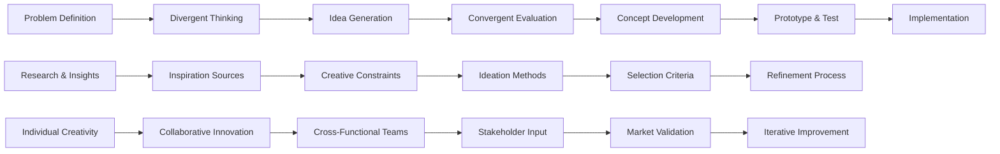

# 💡 Ideation Frameworks

> **Transform abstract ideas into breakthrough innovations through systematic creative thinking and structured innovation processes**

## 🎯 **What It Is**

Ideation Frameworks are systematic methodologies for generating, evaluating, and developing creative ideas into actionable innovations. These frameworks provide structured approaches to creative thinking that combine divergent ideation (generating many ideas) with convergent evaluation (selecting and refining the best ones). In the context of AI and innovation, ideation frameworks become essential tools for breakthrough thinking, helping teams move beyond obvious solutions to discover novel approaches that can transform products, services, and entire industries.

**Core Insight**: Creativity isn't random inspiration—it's a systematic process that can be enhanced through structured frameworks that guide thinking, remove creative blocks, and channel imagination toward practical innovations.

## ⚡ **The Ideation Architecture**

### **Innovation Process Flow**


**The Innovation Ecosystem:**
- **Preparation Phase**: Research, problem framing, constraint definition
- **Ideation Phase**: Divergent thinking, creative exploration, quantity over quality
- **Evaluation Phase**: Convergent analysis, feasibility assessment, selection criteria
- **Development Phase**: Concept refinement, prototyping, testing, iteration

## 🎯 **When to Use**

### **🚀 Product and Service Innovation**
- Developing new AI products and services from concept to market
- Reimagining existing products with AI capabilities and enhancements
- Creating breakthrough features that differentiate from competitors
- Solving complex user problems that require novel approaches

### **💼 Business Model Innovation**
- Designing new business models enabled by AI technologies
- Creating innovative revenue streams and value propositions
- Developing platform strategies and ecosystem approaches
- Transforming traditional industries with digital innovation

### **🔧 Process and Operational Innovation**
- Reimagining business processes with AI automation and optimization
- Creating innovative workflows that combine human and AI capabilities
- Developing new approaches to customer service and experience
- Innovating internal operations and organizational structures

## 🧠 **Core Ideation Frameworks**

### **1️⃣ Design Thinking Innovation Process**
```
Definition: Human-centered approach to innovation that integrates business needs, technological possibilities, and human values

Five-Stage Process:
• Empathize: Deep understanding of user needs, pain points, and aspirations
• Define: Synthesis of observations into compelling problem statements
• Ideate: Generation of creative solutions through structured brainstorming
• Prototype: Creation of tangible representations to test ideas quickly
• Test: Experimentation and iteration based on user feedback

AI-Enhanced Design Thinking:
• AI-Powered User Research: Machine learning analysis of user behavior and feedback
• Intelligent Problem Definition: AI-assisted pattern recognition in complex problems
• Algorithmic Ideation: AI-generated concept variations and combinations
• Rapid Prototyping Tools: AI-accelerated prototyping and simulation
• Automated Testing: AI-driven A/B testing and user experience optimization

Example - AI Healthcare Platform:
Empathize: Interview patients about frustrations with healthcare access and quality
Define: How might we make personalized healthcare accessible to underserved communities?
Ideate: AI-powered telemedicine, community health AI, predictive wellness platforms
Prototype: MVP with basic AI diagnosis and community connection features
Test: Pilot with target communities, measure health outcomes and user satisfaction

Implementation Strategy:
• Cross-functional teams with diverse perspectives and expertise
• User journey mapping to understand complete experience
• Rapid iteration cycles with continuous user feedback
• Integration of technical constraints and business requirements
• Emphasis on human values and ethical considerations throughout process
```

### **2️⃣ SCAMPER Innovation Methodology**
```
Definition: Systematic technique for creative thinking that uses action verbs to stimulate new ideas and perspectives

SCAMPER Framework:
• Substitute: What can be substituted or replaced to create something new?
• Combine: What ideas, features, or processes can be combined for innovation?
• Adapt: What can be adapted from other contexts, industries, or solutions?
• Modify: What can be magnified, minimized, or modified for improvement?
• Put to other uses: How can existing solutions be used in new ways?
• Eliminate: What can be removed, simplified, or streamlined?
• Reverse: What can be reversed, rearranged, or approached from opposite direction?

AI-Specific SCAMPER Applications:
Substitute: Replace human decision-making with AI algorithms in specific contexts
Combine: Merge different AI technologies (vision + NLP + robotics) for new capabilities
Adapt: Apply successful AI solutions from one industry to another domain
Modify: Scale AI models up or down, adjust parameters for different use cases
Put to other uses: Use AI training data or models for unexpected applications
Eliminate: Remove human bottlenecks or inefficient processes through AI automation
Reverse: Flip traditional workflows to be AI-first rather than human-first

Example - E-commerce Innovation:
Original: Traditional product recommendation system
Substitute: Replace rule-based with deep learning recommendations
Combine: Merge visual search + voice + social signals for recommendations
Adapt: Apply gaming engagement mechanics to shopping experience
Modify: Personalize recommendation timing and frequency based on user behavior
Put to other uses: Use recommendation engine for inventory optimization
Eliminate: Remove need for explicit search through predictive recommendations
Reverse: Let AI proactively suggest products before users know they want them

Advanced SCAMPER Techniques:
• Sequential application: Apply multiple SCAMPER verbs in succession for compound innovation
• Cross-industry application: Use SCAMPER to adapt solutions from different industries
• Technology transfer: Apply SCAMPER to move technologies between domains
• Business model innovation: Use SCAMPER to reimagine entire business approaches
• Systematic exploration: Create comprehensive innovation maps using all SCAMPER dimensions
```

### **3️⃣ Six Thinking Hats for Innovation**
```
Definition: Parallel thinking method that explores ideas from six distinct perspectives to ensure comprehensive evaluation

The Six Hats:
• White Hat (Facts): Objective information, data, and evidence about the idea
• Red Hat (Emotions): Intuitive feelings, emotions, and gut reactions to concepts
• Black Hat (Critical): Critical analysis, risks, problems, and potential failures
• Yellow Hat (Optimistic): Benefits, advantages, and positive potential of ideas
• Green Hat (Creative): Creative alternatives, new possibilities, and innovative thinking
• Blue Hat (Process): Process control, methodology, and thinking about thinking

Innovation Application Process:
1. Problem Definition: Use Blue Hat to structure the innovation challenge
2. Information Gathering: White Hat to collect relevant data and insights
3. Creative Generation: Green Hat for divergent thinking and idea creation
4. Emotional Assessment: Red Hat to gauge intuitive appeal and user resonance
5. Benefit Analysis: Yellow Hat to explore positive potential and opportunities
6. Risk Evaluation: Black Hat to identify challenges and mitigation strategies
7. Process Optimization: Blue Hat to refine and improve the innovation process

AI Innovation Example - Autonomous Vehicle Development:
White Hat: Current technology capabilities, safety statistics, regulatory requirements
Red Hat: Public fears about safety, excitement about convenience, trust in automation
Black Hat: Technical limitations, ethical dilemmas, liability issues, job displacement
Yellow Hat: Reduced accidents, increased mobility, environmental benefits
Green Hat: Novel transportation models, new business opportunities, creative applications
Blue Hat: Development methodology, testing protocols, stakeholder engagement process

Advanced Six Hats Techniques:
• Sequential exploration: Systematic progression through all six perspectives
• Focused sessions: Deep dive sessions using single hat for specific challenges
• Team role assignment: Different team members champion different hat perspectives
• Decision-making integration: Use all hats for comprehensive innovation evaluation
• Cultural adaptation: Modify hat applications for different cultural and organizational contexts
```

### **4️⃣ Biomimicry Innovation Framework**
```
Definition: Innovation approach that learns from and mimics natural processes, systems, and structures to solve human challenges

Three Levels of Biomimicry:
• Form and Function: Copying nature's forms, processes, and functions
• Natural Processes: Understanding and replicating natural systems and mechanisms
• Natural Principles: Applying life's principles to human design and innovation

Biomimicry Innovation Process:
1. Biological Research: Study natural phenomena relevant to innovation challenge
2. Abstraction: Extract underlying principles and mechanisms from biological systems
3. Application: Apply natural principles to technological and business innovation
4. Integration: Combine multiple natural inspirations for comprehensive solutions
5. Optimization: Refine bio-inspired solutions for human contexts and requirements

AI and Technology Applications:
• Neural Networks: Inspired by biological neural systems and brain architecture
• Swarm Intelligence: Based on collective behavior of insects and animal groups
• Evolutionary Algorithms: Modeled on natural selection and genetic processes
• Computer Vision: Inspired by animal vision systems and visual processing
• Robotics: Biomimetic movement, manipulation, and sensing capabilities

Example - AI Logistics Optimization:
Natural Inspiration: Ant colony foraging and path optimization behavior
Biological Mechanism: Ants use pheromone trails to find shortest paths to food sources
Technical Application: Ant Colony Optimization algorithms for logistics and routing
Innovation Result: Self-organizing delivery networks that adapt to real-time conditions
Business Impact: Reduced costs, improved efficiency, and dynamic route optimization

Advanced Biomimicry Innovation:
• Multi-species inspiration: Combine insights from multiple natural systems
• Ecosystem thinking: Apply entire ecosystem principles to business innovation
• Evolutionary innovation: Use natural evolution principles for continuous improvement
• Sustainable design: Learn from nature's sustainable and regenerative systems
• Adaptive systems: Create technologies that adapt and evolve like natural systems
```

## 🛠️ **Advanced Ideation Methodologies**

### **🎨 Creative Thinking Techniques**

**The SPARK Framework (Systematic Perspective-based Approach for Radical Kreation):**
```python
class CreativeIdeationFramework:
    def __init__(self):
        self.thinking_modes = self.define_thinking_approaches()
        self.creativity_catalysts = self.establish_innovation_triggers()
        self.evaluation_criteria = self.create_selection_framework()
    
    def generate_breakthrough_ideas(self, challenge):
        ideation_process = {
            "perspective_shifting": self.apply_perspective_techniques(challenge),
            "constraint_manipulation": self.modify_creative_constraints(challenge),
            "analogical_thinking": self.generate_analogies_and_metaphors(challenge),
            "combination_innovation": self.create_novel_combinations(challenge),
            "provocation_techniques": self.use_creative_provocations(challenge)
        }
        
        return ideation_process
    
    def apply_perspective_techniques(self, challenge):
        perspective_methods = {
            "stakeholder_perspective_shifting": {
                "user_perspectives": "View challenge from different user types and personas",
                "industry_perspectives": "Apply insights from other industries and domains",
                "cultural_perspectives": "Consider different cultural approaches and values",
                "temporal_perspectives": "Think from past, present, and future viewpoints",
                "scale_perspectives": "Consider micro and macro scale implications"
            },
            
            "role_reversal_thinking": {
                "problem_solution_reversal": "What if the problem became the solution?",
                "user_provider_reversal": "What if users became providers and vice versa?",
                "technology_human_reversal": "What if humans did what technology does?",
                "constraint_advantage_reversal": "What if limitations became strengths?"
            },
            
            "assumption_challenging": {
                "fundamental_assumptions": "Question basic assumptions about how things work",
                "industry_conventions": "Challenge established industry practices and norms",
                "technology_assumptions": "Question limitations of current technology",
                "business_model_assumptions": "Challenge conventional revenue and value models"
            }
        }
        
        return perspective_methods
    
    def generate_analogies_and_metaphors(self, challenge):
        analogical_techniques = {
            "natural_analogies": {
                "biological_systems": "How would nature solve this challenge?",
                "ecosystem_dynamics": "What can we learn from natural ecosystems?",
                "evolutionary_processes": "How does natural evolution address similar challenges?",
                "animal_behaviors": "What animal behaviors inspire solutions?"
            },
            
            "mechanical_analogies": {
                "machine_metaphors": "How would different machines approach this?",
                "system_analogies": "What systems from other domains are similar?",
                "process_analogies": "What processes from other fields could apply?",
                "tool_analogies": "What tools from other domains could inspire solutions?"
            },
            
            "social_analogies": {
                "community_solutions": "How do communities solve similar problems?",
                "cultural_practices": "What cultural practices address related challenges?",
                "historical_solutions": "How were similar problems solved in the past?",
                "game_mechanics": "What game mechanics could apply to this challenge?"
            },
            
            "abstract_analogies": {
                "mathematical_models": "What mathematical concepts could apply?",
                "physical_principles": "What physics principles could inspire solutions?",
                "chemical_processes": "What chemical reactions model this challenge?",
                "information_theory": "How do information systems handle similar problems?"
            }
        }
        
        return analogical_techniques
```

### **🔬 Systematic Innovation Approaches**

**TRIZ (Theory of Inventive Problem Solving) for AI Innovation:**
```python
def implement_triz_for_ai_innovation():
    triz_framework = {
        "contradiction_resolution": {
            "technical_contradictions": {
                "definition": "Improving one parameter leads to degradation of another",
                "ai_examples": [
                    "Accuracy vs. Speed: More accurate AI models are often slower",
                    "Personalization vs. Privacy: Better personalization requires more data",
                    "Automation vs. Control: More automation reduces human control",
                    "Complexity vs. Explainability: More complex AI is harder to explain"
                ],
                "resolution_strategies": [
                    "Separation in space: Different parts of system optimize for different parameters",
                    "Separation in time: System optimizes for different parameters at different times",
                    "Separation by condition: System behavior changes based on conditions",
                    "System transition: Move to higher-level system that resolves contradiction"
                ]
            },
            
            "physical_contradictions": {
                "definition": "System should have contradictory properties simultaneously",
                "ai_examples": [
                    "AI should be both transparent and protect intellectual property",
                    "System should be both automated and human-controllable",
                    "AI should be both general purpose and highly specialized",
                    "Model should be both stable and continuously learning"
                ],
                "resolution_principles": [
                    "Segmentation: Different parts have different properties",
                    "Asymmetry: Use asymmetric approaches to resolve contradiction",
                    "Dynamics: Make system adaptive to resolve contradictions",
                    "Partial action: Apply contradictory properties partially"
                ]
            }
        },
        
        "innovation_patterns": {
            "40_inventive_principles": {
                "ai_application_examples": {
                    "segmentation": "Divide AI models into specialized components",
                    "asymmetry": "Use asymmetric neural network architectures",
                    "merging": "Combine multiple AI approaches for better results",
                    "universality": "Make AI components serve multiple functions",
                    "nesting": "Embed smaller AI models within larger systems",
                    "weight_compensation": "Balance AI complexity with performance",
                    "equipotentiality": "Make AI system performance consistent across conditions",
                    "anti_weight": "Use AI to counteract negative effects",
                    "preliminary_action": "Prepare AI systems for expected changes",
                    "beforehand_cushioning": "Build resilience into AI systems"
                }
            },
            
            "evolution_trends": {
                "ai_system_evolution": [
                    "Increasing complexity: AI systems become more sophisticated over time",
                    "Increasing dynamism: AI systems become more adaptive and flexible",
                    "Increasing automation: More functions become automated",
                    "Increasing intelligence: Systems become more intelligent and autonomous",
                    "Increasing integration: AI integrates more deeply with other systems"
                ]
            }
        },
        
        "problem_solving_algorithm": {
            "ariz_for_ai": {
                "problem_formulation": "Define AI innovation challenge clearly",
                "problem_model": "Create abstract model of AI problem",
                "ida_search": "Search for similar problems and solutions in AI domain",
                "contradiction_elimination": "Resolve contradictions using TRIZ principles",
                "solution_evaluation": "Evaluate and refine AI innovation solutions"
            }
        }
    }
    
    return triz_framework
```

## 📊 **Collaborative Ideation Strategies**

### **🤝 Team-Based Innovation Frameworks**

**Innovation Team Architecture:**
```python
def design_collaborative_ideation_process():
    collaboration_framework = {
        "team_composition_strategies": {
            "diverse_expertise_teams": {
                "technical_diversity": "Engineers, data scientists, AI researchers, designers",
                "domain_diversity": "Industry experts, users, business strategists",
                "cognitive_diversity": "Different thinking styles and problem-solving approaches",
                "cultural_diversity": "Different cultural backgrounds and perspectives",
                "experience_diversity": "Mix of senior experts and fresh perspectives"
            },
            
            "role_based_ideation": {
                "idea_generators": "Focus on creative thinking and concept generation",
                "idea_builders": "Develop and elaborate on initial concepts",
                "idea_evaluators": "Assess feasibility and potential of ideas",
                "idea_connectors": "Find relationships and combinations between ideas",
                "devil_advocates": "Challenge assumptions and identify weaknesses"
            }
        },
        
        "structured_collaboration_methods": {
            "brainwriting_techniques": {
                "6_3_5_method": "6 people write 3 ideas in 5 minutes, then pass to next person",
                "gallery_method": "Post ideas on walls, people add to and build on others' ideas",
                "electronic_brainstorming": "Use digital tools for anonymous idea contribution",
                "nominal_group_technique": "Individual ideation followed by group discussion"
            },
            
            "facilitated_innovation_sessions": {
                "innovation_tournaments": "Competitive ideation with prizes and recognition",
                "hackathons": "Intensive collaborative innovation events",
                "design_sprints": "Time-boxed collaborative design and testing processes",
                "innovation_labs": "Dedicated spaces and time for experimental thinking"
            },
            
            "cross_functional_innovation": {
                "customer_co_creation": "Include customers in ideation and development",
                "supplier_innovation": "Collaborate with suppliers on innovative solutions",
                "academic_partnerships": "Work with universities on research-based innovation",
                "startup_collaboration": "Partner with startups for fresh perspectives"
            }
        },
        
        "digital_collaboration_tools": {
            "ai_enhanced_ideation": {
                "idea_generation_ai": "AI systems that generate creative concepts and variations",
                "pattern_recognition": "AI identifies patterns and connections between ideas",
                "idea_clustering": "Automatic grouping and organization of related concepts",
                "sentiment_analysis": "AI assessment of idea potential and team reaction"
            },
            
            "collaborative_platforms": {
                "virtual_whiteboards": "Digital spaces for visual ideation and mapping",
                "idea_management_systems": "Platforms for collecting, organizing, and evaluating ideas",
                "innovation_communities": "Online communities for ongoing collaborative innovation",
                "real_time_collaboration": "Tools for synchronous and asynchronous team innovation"
            }
        }
    }
    
    return collaboration_framework
```

## 🎯 **Evaluation and Selection Frameworks**

### **💎 Idea Assessment and Prioritization**

**Multi-Criteria Idea Evaluation:**
```python
def implement_idea_evaluation_framework():
    evaluation_framework = {
        "feasibility_assessment": {
            "technical_feasibility": {
                "criteria": [
                    "Current technology capabilities and limitations",
                    "Required technical expertise and resources",
                    "Development timeline and complexity",
                    "Integration with existing systems and infrastructure"
                ],
                "scoring_method": "1-10 scale with detailed rubrics for each score",
                "weight": "25% of total evaluation score"
            },
            
            "business_feasibility": {
                "criteria": [
                    "Market demand and customer need validation",
                    "Revenue potential and business model viability",
                    "Competitive advantage and differentiation",
                    "Required investment and resource allocation"
                ],
                "scoring_method": "Business case analysis with financial projections",
                "weight": "30% of total evaluation score"
            },
            
            "organizational_feasibility": {
                "criteria": [
                    "Alignment with organizational strategy and goals",
                    "Available capabilities and resources",
                    "Cultural fit and change management requirements",
                    "Risk tolerance and implementation capacity"
                ],
                "scoring_method": "Organizational readiness assessment",
                "weight": "20% of total evaluation score"
            }
        },
        
        "impact_potential_assessment": {
            "user_impact": {
                "criteria": [
                    "Magnitude of user benefit and value creation",
                    "Number of users potentially affected",
                    "Depth of impact on user experience and outcomes",
                    "Alignment with user needs and pain points"
                ],
                "assessment_methods": [
                    "User interviews and feedback collection",
                    "Prototype testing and validation",
                    "Market research and demand analysis",
                    "User journey mapping and impact analysis"
                ]
            },
            
            "business_impact": {
                "criteria": [
                    "Revenue generation potential",
                    "Cost reduction and efficiency gains",
                    "Competitive advantage creation",
                    "Market expansion opportunities"
                ],
                "measurement_approaches": [
                    "Financial modeling and ROI analysis",
                    "Market size and growth potential assessment",
                    "Competitive differentiation analysis",
                    "Strategic value evaluation"
                ]
            },
            
            "innovation_impact": {
                "criteria": [
                    "Novelty and originality of solution",
                    "Potential for breakthrough innovation",
                    "Ability to create new markets or categories",
                    "Platform potential for future innovation"
                ],
                "evaluation_methods": [
                    "Prior art and competitive analysis",
                    "Innovation assessment by experts",
                    "Patent landscape analysis",
                    "Technology trend alignment"
                ]
            }
        },
        
        "risk_assessment": {
            "development_risks": {
                "technical_risks": "Probability of technical challenges and failures",
                "resource_risks": "Risk of insufficient resources or expertise",
                "timeline_risks": "Probability of delays and schedule overruns",
                "integration_risks": "Challenges with system integration and deployment"
            },
            
            "market_risks": {
                "adoption_risks": "Risk of poor market acceptance",
                "competitive_risks": "Threat of competitive response or alternatives",
                "timing_risks": "Risk of being too early or too late to market",
                "regulatory_risks": "Potential regulatory challenges or changes"
            },
            
            "mitigation_strategies": {
                "risk_reduction": "Actions to reduce probability of risk occurrence",
                "contingency_planning": "Alternative approaches if risks materialize",
                "early_warning_systems": "Monitoring systems to detect risk indicators",
                "rapid_response_protocols": "Quick response procedures for risk events"
            }
        }
    }
    
    return evaluation_framework

def create_idea_selection_process():
    selection_process = {
        "multi_stage_filtering": {
            "initial_screening": {
                "criteria": "Basic feasibility and alignment filters",
                "method": "Quick assessment by review team",
                "outcome": "Shortlist of viable ideas for detailed evaluation"
            },
            
            "detailed_evaluation": {
                "criteria": "Comprehensive multi-criteria assessment",
                "method": "Detailed analysis using evaluation framework",
                "outcome": "Scored and ranked ideas with detailed assessments"
            },
            
            "strategic_selection": {
                "criteria": "Strategic fit and portfolio considerations",
                "method": "Senior leadership review and decision",
                "outcome": "Final selection of ideas for development"
            }
        },
        
        "portfolio_optimization": {
            "balanced_portfolio": "Mix of incremental and breakthrough innovations",
            "risk_diversification": "Spread risk across different types of innovations",
            "resource_allocation": "Optimize resource allocation across selected ideas",
            "timeline_coordination": "Coordinate development timelines and dependencies"
        }
    }
    
    return selection_process
```

## 🚨 **Innovation Pitfalls and Solutions**

### **❌ Common Ideation Anti-Patterns**

**1. Premature Convergence**
```
❌ Problem: Rushing to evaluate and select ideas before sufficient exploration
Example: Team settles on first promising idea without exploring alternatives

Impact:
• Missed opportunities for breakthrough innovation
• Suboptimal solutions that could be significantly improved
• Lack of creative risk-taking and exploration
• Reduced innovation potential and competitive advantage

Root Causes:
• Pressure for quick results and decision-making
• Discomfort with uncertainty and open-ended exploration
• Lack of structured ideation process and facilitation
• Fear of "wasting time" on creative exploration

✅ Solution: Separate divergent and convergent thinking phases
Implementation:
• Establish clear phases for idea generation vs. evaluation
• Set explicit goals for quantity and diversity in ideation phase
• Use structured techniques to encourage creative exploration
• Defer judgment and criticism during initial ideation
• Create safe spaces for wild and unconventional ideas

Divergent-Convergent Process:
• Divergent Phase: Generate maximum quantity and diversity of ideas
• Incubation Phase: Allow time for ideas to develop and evolve
• Convergent Phase: Systematic evaluation and selection of best ideas
• Development Phase: Refinement and elaboration of selected concepts
• Iteration: Return to divergent thinking when needed for improvement
```

**2. Groupthink and Conformity Pressure**
```
❌ Problem: Team members suppress creative ideas to maintain group harmony
Example: Innovative ideas are dismissed because they don't fit team consensus

Impact:
• Reduced creative diversity and innovative potential
• Suppression of breakthrough ideas and novel approaches
• False consensus that doesn't represent genuine agreement
• Missed opportunities for competitive differentiation

Root Causes:
• Strong team cohesion that discourages dissent
• Dominant personalities that influence group direction
• Organizational culture that values harmony over innovation
• Lack of structured processes to encourage diverse thinking

✅ Solution: Structure diversity and encourage dissenting voices
Implementation:
• Assign devil's advocate roles to challenge dominant ideas
• Use anonymous ideation techniques to reduce conformity pressure
• Actively seek out and reward unconventional thinking
• Include diverse perspectives and backgrounds in ideation teams
• Create explicit processes for exploring minority opinions

Diversity Encouragement Strategies:
• Red Team exercises: Dedicated teams to challenge mainstream ideas
• Perspective rotation: Require team members to argue different viewpoints
• External input: Include outsiders and fresh perspectives in ideation
• Structured dissent: Formal processes for exploring alternative approaches
• Cultural norm setting: Establish norms that celebrate creative disagreement
```

**3. Solution-First Thinking**
```
❌ Problem: Starting with predetermined solutions instead of exploring the problem space
Example: "We need an AI chatbot" instead of "How can we improve customer service?"

Impact:
• Missed opportunities to address root causes and deeper needs
• Suboptimal solutions that don't fully address user problems
• Limited innovation scope and breakthrough potential
• Reduced user value and competitive differentiation

Root Causes:
• Technology-first mindset rather than user-first approach
• Pressure to implement specific technologies or solutions
• Lack of user research and problem understanding
• Bias toward familiar solutions and approaches

✅ Solution: Start with deep problem understanding and user research
Implementation:
• Conduct thorough user research and problem analysis before ideation
• Frame challenges as "How might we..." questions rather than solution requirements
• Use problem definition techniques to ensure clear understanding
• Challenge assumptions about what solutions are needed
• Maintain focus on user outcomes rather than technical implementations

Problem-First Process:
• Problem Research: Deep understanding of user needs and pain points
• Problem Framing: Clear articulation of challenges and opportunities
• Solution Space Exploration: Open-ended exploration of potential approaches
• Solution Development: Systematic development of promising concepts
• Solution Validation: Testing solutions against original problem definition
```

## 📊 **Measurement and Optimization**

### **🎯 Innovation Metrics and KPIs**

**Comprehensive Innovation Assessment:**
```python
def measure_ideation_effectiveness():
    innovation_metrics = {
        "ideation_process_metrics": {
            "quantity_metrics": {
                "ideas_generated": "Total number of ideas produced in ideation sessions",
                "ideas_per_participant": "Average idea generation rate per team member",
                "session_productivity": "Ideas generated per hour of ideation time",
                "idea_diversity": "Range and variety of different types of ideas"
            },
            
            "quality_metrics": {
                "idea_feasibility_scores": "Average feasibility ratings of generated ideas",
                "idea_novelty_ratings": "Originality and innovation level of concepts",
                "idea_development_potential": "Capacity for ideas to be developed further",
                "stakeholder_enthusiasm": "Level of excitement and support for ideas"
            },
            
            "process_effectiveness": {
                "participant_engagement": "Level of active participation in ideation",
                "facilitation_quality": "Effectiveness of ideation session leadership",
                "time_efficiency": "Productive use of allocated ideation time",
                "collaborative_dynamics": "Quality of team interaction and building"
            }
        },
        
        "innovation_pipeline_metrics": {
            "conversion_rates": {
                "idea_to_concept": "Percentage of ideas that become developed concepts",
                "concept_to_prototype": "Rate of concept advancement to prototype stage",
                "prototype_to_product": "Success rate of prototype to market transition",
                "overall_innovation_funnel": "End-to-end conversion from idea to impact"
            },
            
            "development_speed": {
                "concept_development_time": "Time from idea to developed concept",
                "prototype_development_speed": "Speed of prototype creation and testing",
                "market_introduction_timeline": "Time from concept to market launch",
                "innovation_cycle_time": "Complete innovation process duration"
            },
            
            "resource_efficiency": {
                "cost_per_innovation": "Investment required per successful innovation",
                "resource_utilization": "Efficiency of innovation resource allocation",
                "roi_on_innovation": "Return on investment for innovation activities",
                "opportunity_cost_analysis": "Value of alternative uses of innovation resources"
            }
        },
        
        "impact_and_outcome_metrics": {
            "business_impact": {
                "revenue_from_innovation": "Revenue generated by new innovations",
                "market_share_growth": "Market share increase from innovative products",
                "competitive_advantage": "Differentiation created through innovation",
                "customer_value_creation": "Value delivered to customers through innovation"
            },
            
            "innovation_culture": {
                "employee_innovation_engagement": "Participation in innovation activities",
                "innovation_skill_development": "Growth in innovation capabilities",
                "organizational_learning": "Knowledge gained through innovation process",
                "innovation_mindset_adoption": "Cultural shift toward innovation thinking"
            }
        }
    }
    
    return innovation_metrics

def optimize_ideation_processes():
    optimization_strategies = {
        "continuous_improvement": {
            "process_experimentation": "Test different ideation methods and approaches",
            "feedback_integration": "Incorporate participant feedback to improve sessions",
            "best_practice_sharing": "Share successful ideation techniques across teams",
            "methodology_refinement": "Continuously refine and improve ideation frameworks"
        },
        
        "capability_building": {
            "facilitation_training": "Develop skilled innovation facilitators",
            "creative_thinking_skills": "Build individual creative thinking capabilities",
            "collaboration_skills": "Enhance team-based innovation abilities",
            "innovation_tool_mastery": "Develop expertise in innovation methodologies"
        },
        
        "technology_enhancement": {
            "digital_ideation_tools": "Leverage technology to enhance ideation effectiveness",
            "ai_assisted_creativity": "Use AI to augment human creative thinking",
            "collaboration_platforms": "Deploy tools that facilitate distributed innovation",
            "innovation_analytics": "Use data analytics to optimize innovation processes"
        }
    }
    
    return optimization_strategies
```

## 🔗 **Integration with Other Mental Models**

### **🧠 Complementary Innovation Frameworks**

**Synergistic Thinking Approaches:**
- **[[Design Thinking]]**: Human-centered approach to innovation and problem-solving
- **[[Systems Thinking]]**: Understanding complex interactions in innovation ecosystems
- **[[First Principles Thinking]]**: Breaking down problems to fundamental elements for innovation
- **[[Lateral Thinking]]**: Creative problem-solving through indirect and unconventional approaches
- **[[Strategic Planning]]**: Aligning innovation efforts with organizational strategy and goals

**Integration Examples:**
```python
def integrate_ideation_with_frameworks():
    integrated_approaches = {
        "ideation_plus_systems_thinking": {
            "ecosystem_innovation": "Consider innovation impact on entire systems and stakeholders",
            "leverage_points": "Identify system leverage points for maximum innovation impact",
            "unintended_consequences": "Anticipate system-wide effects of innovations",
            "stakeholder_network_effects": "Understand how innovation affects all stakeholders"
        },
        
        "ideation_plus_strategic_planning": {
            "strategic_innovation_alignment": "Ensure innovations support organizational strategy",
            "portfolio_innovation_planning": "Plan innovation portfolio for strategic advantage",
            "innovation_roadmapping": "Create strategic roadmaps for innovation development",
            "competitive_innovation_strategy": "Use innovation for strategic differentiation"
        },
        
        "ideation_plus_design_thinking": {
            "user_centered_innovation": "Ground all innovation in deep user understanding",
            "rapid_prototyping": "Quickly test and iterate innovative concepts",
            "empathy_driven_creativity": "Use empathy to inspire and guide innovation",
            "human_centered_evaluation": "Evaluate innovations based on human value creation"
        }
    }
    
    return integrated_approaches
```

## 🎯 **Advanced Mastery Guide**

### **📈 Innovation Leadership Development**

**Level 1: Individual Creative Thinking**
- Master basic ideation techniques and creative thinking methods
- Develop personal creativity habits and innovation mindset
- Learn to generate and evaluate ideas effectively

**Level 2: Team Innovation Facilitation**
- Facilitate effective group ideation sessions and workshops
- Build collaborative innovation processes and team dynamics
- Lead innovation projects from concept to implementation

**Level 3: Organizational Innovation Design**
- Design innovation systems and processes for organizations
- Build innovation culture and capabilities across teams
- Create strategic innovation programs and initiatives

**Level 4: Innovation Ecosystem Leadership**
- Lead innovation across multiple organizations and partners
- Shape industry innovation trends and standards
- Mentor and develop other innovation leaders

**Level 5: Innovation Research and Thought Leadership**
- Contribute to advancement of innovation theory and practice
- Influence field development through research and publication
- Lead global innovation communities and initiatives

## 🏆 **Success Stories and Case Studies**

### **Case Study 1: Healthcare AI Innovation**

**Challenge**: Hospital system needed innovative approaches to reduce patient wait times and improve care quality
**Ideation Framework Applied**: Design thinking combined with biomimicry
**Innovation Process**:
- **Empathize**: Deep research into patient and staff experiences
- **Define**: "How might we create fluid, adaptive healthcare delivery?"
- **Ideate**: Biomimicry from ant colony optimization and swarm intelligence
- **Prototype**: AI-powered dynamic scheduling and resource allocation
- **Test**: Pilot implementation with real-time adjustment

**Results**: 40% reduction in wait times, 25% improvement in patient satisfaction, scalable across health system

### **Case Study 2: Financial Services Innovation**

**Challenge**: Traditional bank needed breakthrough innovation for digital transformation
**Framework Used**: SCAMPER methodology with cross-industry analysis
**Innovation Journey**:
- **Substitute**: Replace branch visits with AI-powered virtual assistance
- **Combine**: Merge banking with lifestyle and wellness platforms
- **Adapt**: Apply gaming mechanics to financial education and engagement
- **Results**: New digital platform with 60% user adoption, 45% cost reduction

## 🚀 **Takeaways and Next Steps**

### **Key Insights**
1. **Structure enables creativity** - Frameworks provide scaffolding for breakthrough thinking
2. **Diversity drives innovation** - Multiple perspectives and approaches yield better ideas
3. **Process matters as much as ideas** - How you innovate determines what you create
4. **Implementation is part of ideation** - Consider feasibility and development from the start

### **Implementation Roadmap**
1. **Learn Core Frameworks** - Master fundamental ideation methodologies
2. **Practice Facilitation** - Develop skills in leading innovation sessions
3. **Build Innovation Culture** - Create organizational support for creative thinking
4. **Measure and Optimize** - Track innovation effectiveness and continuously improve
5. **Scale Innovation Capability** - Expand innovation skills across organization

**Start Today:**
- Choose one ideation framework to master and apply to a current challenge
- Form a diverse team to tackle an innovation opportunity
- Schedule regular ideation sessions to build innovation habit
- Create a process for capturing, evaluating, and developing ideas
- Measure your innovation process effectiveness and continuously improve

Remember: **Innovation isn't about waiting for inspiration—it's about creating systematic processes that generate breakthrough ideas consistently. Master ideation frameworks, and you'll transform creativity from random flashes into predictable innovation capability.**
