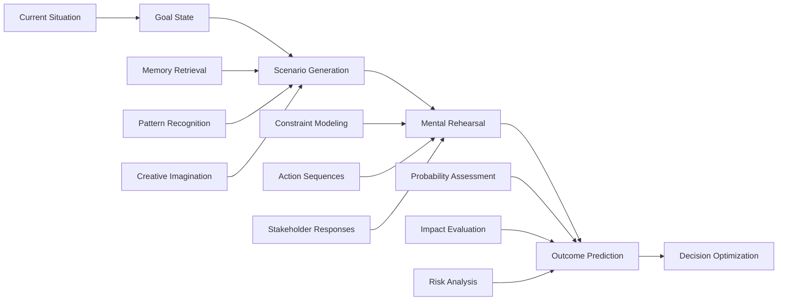

# 🧠 Mental Simulation

> **Master the art of thinking ahead by creating vivid mental models of possible futures**

## 🎯 **What It Is**

Mental Simulation is the cognitive process of imagining, modeling, and mentally rehearsing possible scenarios, actions, and outcomes before they occur in reality. This fundamental human capability allows us to "pre-experience" situations, test ideas safely, and make better decisions by exploring possibilities in our minds. In AI development, mental simulation operates at both the human level (how developers and users think about AI systems) and the computational level (how AI systems model and predict outcomes). Mastering mental simulation transforms how we approach planning, problem-solving, and innovation in complex technological environments.

**Core Insight**: The quality of our decisions depends on the quality of our mental simulations. Better simulation leads to better preparation, fewer surprises, and more robust solutions.

## ⚡ **The Simulation Architecture**

### **Cognitive Mental Simulation Process**


**The Four Levels of Mental Simulation:**
- **Perceptual**: Imagining sensory experiences and physical interactions
- **Motor**: Rehearsing physical actions and procedural sequences
- **Social**: Modeling interpersonal dynamics and group behaviors
- **Abstract**: Simulating conceptual relationships and logical outcomes

## 🎯 **When to Use**

### **🔮 Strategic Planning and Forecasting**
- Long-term AI strategy development and technology roadmapping
- Market scenario planning and competitive landscape analysis
- Risk assessment and mitigation strategy development
- Innovation pipeline planning and resource allocation

### **🎯 Problem-Solving and Design**
- AI system architecture design and optimization
- User experience design and interaction flow modeling
- Algorithm development and performance prediction
- Debugging complex AI systems and edge case identification

### **🎭 Training and Skill Development**
- AI model training through simulated environments
- Team training for AI deployment and operations
- Skill development through deliberate practice simulation
- Crisis response and incident management preparation

## 🧠 **The Science of Mental Simulation**

### **1️⃣ Prospective Memory and Future Thinking**
```
Definition: The ability to mentally construct and explore possible future scenarios

Cognitive Mechanisms:
• Episodic future thinking: Constructing specific, detailed future episodes
• Semantic future thinking: Abstract reasoning about future possibilities
• Autobiographical planning: Personal goal achievement simulation
• Counterfactual reasoning: "What if" scenario exploration

AI Applications:
• Simulating user journeys and interaction patterns
• Predicting AI system performance under different conditions
• Modeling potential deployment scenarios and challenges
• Exploring alternative development paths and decisions

Example - AI System Deployment:
Basic Planning: "We'll deploy the model next month"
Mental Simulation: "Imagine the deployment process: first, we run final tests, then gradual rollout to 10% of users. Users might experience slower response times initially. Customer support will get questions about new features. If performance drops, we'll need to roll back quickly. The marketing team will want to announce success, but we should wait until we confirm stability..."

Simulation Enhancement Techniques:
• Vivid detail generation: Add sensory and emotional details to scenarios
• Multiple perspective taking: Simulate from different stakeholder viewpoints
• Temporal specification: Set specific timeframes and sequences
• Contingency planning: Simulate responses to various complications
• Outcome probability weighting: Consider likelihood of different scenarios
```

### **2️⃣ Embodied Simulation and Action Planning**
```
Definition: Mental rehearsal of physical and procedural actions to improve performance

Neurological Basis:
• Mirror neuron activation: Same brain regions active during action and simulation
• Motor cortex engagement: Physical movement areas activate during mental rehearsal
• Procedural memory integration: Combines existing skills with new scenarios
• Error prediction and correction: Anticipates and prevents execution errors

AI Applications:
• Debugging AI systems by mentally tracing execution paths
• Designing human-AI interaction workflows and interfaces
• Planning AI model training procedures and hyperparameter optimization
• Simulating data processing pipelines and identifying bottlenecks

Example - AI Model Training Process:
Mental Rehearsal: "I'll start the training job, monitor the loss curves for the first hour. If the loss doesn't decrease in the first 100 iterations, I'll check the learning rate. Around epoch 10, I'll examine the validation metrics. If overfitting appears, I'll implement early stopping. The training should complete overnight, and I'll review results first thing in the morning..."

Embodied Simulation Applications:
• User interface design: Mentally simulate user interactions with AI tools
• Data pipeline optimization: Visualize data flow and transformation steps
• Code review simulation: Mentally execute code paths to find bugs
• Meeting preparation: Rehearse AI demo presentations and Q&A sessions
• Crisis response: Practice incident response procedures mentally
```

### **3️⃣ Social Simulation and Stakeholder Modeling**
```
Definition: Mental modeling of interpersonal dynamics, group behaviors, and stakeholder reactions

Psychological Foundations:
• Theory of mind: Understanding others' mental states and motivations
• Perspective taking: Adopting others' viewpoints and contexts
• Social script activation: Drawing on cultural knowledge of social situations
• Empathy and emotional simulation: Predicting others' emotional responses

AI Applications:
• Predicting user adoption patterns and resistance to AI features
• Modeling team dynamics during AI project development
• Simulating stakeholder reactions to AI deployment decisions
• Planning communication strategies for AI initiatives

Example - AI Feature Launch:
Stakeholder Simulation:
• "Users will initially be confused by the new AI recommendations. Power users might resist because it changes their workflow. Customer support will get complaints about the 'AI taking over.' Management will want immediate ROI metrics. The legal team will ask about liability. Data scientists will want to see detailed performance analytics..."

Social Simulation Framework:
• Stakeholder mapping: Identify all affected parties and their perspectives
• Motivation modeling: Understand what drives different stakeholder behaviors
• Interaction prediction: Anticipate how stakeholders will interact with each other
• Influence pathway analysis: Map how decisions and information flow between groups
• Cultural context consideration: Account for organizational and cultural factors
```

### **4️⃣ Abstract Simulation and Conceptual Modeling**
```
Definition: Mental modeling of abstract relationships, logical structures, and conceptual systems

Cognitive Processes:
• Analogical reasoning: Using familiar concepts to understand new situations
• Causal modeling: Understanding cause-and-effect relationships
• System dynamics simulation: Modeling complex interactions over time
• Mathematical and logical reasoning: Abstract manipulation of symbols and rules

AI Applications:
• Architectural design for complex AI systems
• Algorithm performance analysis and optimization
• Mathematical proof development and verification
• Economic and business model simulation for AI ventures

Example - AI System Architecture:
Abstract Simulation: "If we use a microservices architecture, each AI model becomes an independent service. The API gateway routes requests based on the input type. The recommendation service calls the user profile service, which queries the database. Under high load, the bottleneck will be the feature extraction service. We'll need horizontal scaling for the inference engines, but the training pipeline can run on a schedule..."

Abstract Simulation Capabilities:
• Mathematical modeling: Simulate algorithm performance characteristics
• Economic modeling: Predict costs, benefits, and ROI of AI investments
• Logical reasoning: Work through complex decision trees and rule systems
• Systems thinking: Model emergent behaviors and feedback loops
• Information flow analysis: Trace data and control flow through systems
```

## 🛠️ **Practical Implementation Framework**

### **🎯 Structured Simulation Methodology**

**The SCRIPT Framework (Scenario-Context-Rehearsal-Impact-Probability-Timing):**
```python
class MentalSimulationEngine:
    def __init__(self):
        self.simulation_types = self.define_simulation_categories()
        self.scenario_generators = self.create_scenario_generators()
        self.outcome_assessors = self.build_outcome_evaluation()
    
    def conduct_mental_simulation(self, situation, objectives, constraints):
        simulation_process = {
            "scenario_generation": self.generate_scenarios(situation, objectives),
            "context_modeling": self.model_relevant_context(situation, constraints),
            "rehearsal_execution": self.run_mental_rehearsals(situation),
            "impact_assessment": self.evaluate_potential_impacts(situation),
            "probability_estimation": self.estimate_outcome_probabilities(situation),
            "timing_analysis": self.analyze_temporal_factors(situation)
        }
        
        return simulation_process
    
    def generate_scenarios(self, situation, objectives):
        scenario_types = {
            "best_case_scenarios": {
                "method": "Envision optimal outcomes and the paths to achieve them",
                "prompts": [
                    "What would success look like in detail?",
                    "How would we know we've achieved our objectives?",
                    "What sequence of events would lead to the best outcome?"
                ]
            },
            
            "worst_case_scenarios": {
                "method": "Identify potential failures and disaster scenarios",
                "prompts": [
                    "What could go catastrophically wrong?",
                    "What are our biggest vulnerabilities?",
                    "How might this fail in unexpected ways?"
                ]
            },
            
            "most_likely_scenarios": {
                "method": "Model realistic outcomes based on base rate information",
                "prompts": [
                    "What typically happens in similar situations?",
                    "What does historical data suggest?",
                    "What outcome would surprise no one?"
                ]
            },
            
            "wild_card_scenarios": {
                "method": "Explore low-probability, high-impact possibilities",
                "prompts": [
                    "What completely unexpected events could occur?",
                    "How might external factors disrupt our plans?",
                    "What scenarios are we not considering?"
                ]
            }
        }
        
        return scenario_types
    
    def run_mental_rehearsals(self, situation):
        rehearsal_dimensions = {
            "action_sequence_rehearsal": {
                "purpose": "Practice the steps and procedures involved",
                "technique": "Mentally walk through each action in chronological order",
                "focus": "Timing, dependencies, resource requirements, potential obstacles"
            },
            
            "decision_point_rehearsal": {
                "purpose": "Practice key decisions and choice points",
                "technique": "Simulate decision-making under various conditions",
                "focus": "Decision criteria, available information, time pressure, stakeholder input"
            },
            
            "interaction_rehearsal": {
                "purpose": "Practice social and communicative aspects",
                "technique": "Role-play conversations and stakeholder interactions",
                "focus": "Communication style, persuasion, conflict resolution, expectation management"
            },
            
            "adaptation_rehearsal": {
                "purpose": "Practice responding to unexpected changes",
                "technique": "Simulate various disruptions and practice adaptive responses",
                "focus": "Flexibility, contingency activation, resource reallocation, communication"
            }
        }
        
        return rehearsal_dimensions
```

### **📊 AI-Enhanced Mental Simulation**

**Computational Simulation Integration:**
```python
def integrate_computational_and_mental_simulation():
    integration_approaches = {
        "ai_assisted_scenario_generation": {
            "capability": "AI generates diverse scenarios based on historical data and patterns",
            "implementation": [
                "Train models on similar past situations and their outcomes",
                "Use AI to suggest scenarios humans might not consider",
                "Generate parameter variations for stress testing",
                "Create synthetic edge cases for robustness testing"
            ],
            "example": "AI suggests deployment scenarios based on analysis of 1000s of similar AI launches"
        },
        
        "predictive_modeling_integration": {
            "capability": "Combine human intuition with quantitative predictions",
            "implementation": [
                "Use ML models to estimate probabilities for human-generated scenarios",
                "Validate mental simulation assumptions with data analysis",
                "Augment human judgment with statistical forecasting",
                "Create feedback loops between predictions and actual outcomes"
            ],
            "example": "Mental simulation of user adoption complemented by ML-based adoption curve prediction"
        },
        
        "simulation_environment_creation": {
            "capability": "Build digital twins and virtual environments for testing",
            "implementation": [
                "Create virtual environments that mirror real deployment conditions",
                "Build user behavior simulators for interaction testing",
                "Develop system load simulators for performance testing",
                "Generate synthetic data for training and validation"
            ],
            "example": "Virtual environment simulating real-world AI system deployment conditions"
        },
        
        "cognitive_augmentation": {
            "capability": "AI tools that enhance human simulation capabilities",
            "implementation": [
                "AI-powered visualization of complex scenarios",
                "Automated tracking of simulation assumptions and outcomes",
                "AI-assisted pattern recognition in simulation results",
                "Intelligent suggestion of overlooked factors and stakeholders"
            ],
            "example": "AI helps identify blind spots in human mental simulations of AI system impacts"
        }
    }
    
    return integration_approaches

def implement_simulation_driven_development():
    development_methodology = {
        "simulation_first_design": {
            "principle": "Simulate before building to identify issues early",
            "practices": [
                "Mental simulation of user interactions before UI development",
                "Algorithm behavior simulation before implementation",
                "Performance simulation before architecture decisions",
                "Integration simulation before system combination"
            ]
        },
        
        "iterative_simulation_refinement": {
            "principle": "Continuously improve simulations based on real-world feedback",
            "practices": [
                "Compare simulation predictions with actual outcomes",
                "Update mental models based on prediction errors",
                "Refine simulation techniques based on accuracy",
                "Build institutional memory of simulation lessons"
            ]
        },
        
        "collaborative_simulation": {
            "principle": "Leverage diverse perspectives for richer simulations",
            "practices": [
                "Multi-stakeholder simulation sessions",
                "Cross-functional scenario planning",
                "External expert simulation validation",
                "User participation in simulation exercises"
            ]
        }
    }
    
    return development_methodology
```

## 📈 **Advanced Applications in AI Development**

### **🤖 AI System Design and Architecture**

**Mental Simulation for AI System Design:**
```python
class AISystemSimulation:
    def __init__(self):
        self.system_models = self.define_system_abstractions()
        self.performance_predictors = self.create_performance_models()
        self.interaction_simulators = self.build_interaction_models()
    
    def simulate_ai_system_architecture(self, requirements, constraints):
        architectural_simulations = {
            "data_flow_simulation": {
                "purpose": "Mentally trace data through the system architecture",
                "process": [
                    "Visualize data ingestion and preprocessing steps",
                    "Simulate feature extraction and transformation",
                    "Model inference pipeline and output generation",
                    "Trace feedback loops and learning processes"
                ],
                "considerations": [
                    "Bottlenecks and performance constraints",
                    "Data quality issues and edge cases",
                    "Scalability requirements and resource usage",
                    "Security and privacy implications"
                ]
            },
            
            "user_interaction_simulation": {
                "purpose": "Model how users will interact with the AI system",
                "process": [
                    "Simulate different user types and their goals",
                    "Model typical user workflows and edge cases",
                    "Predict user errors and misunderstandings",
                    "Anticipate user adaptation and learning curves"
                ],
                "considerations": [
                    "User interface design and usability",
                    "Error handling and recovery mechanisms",
                    "Training and support requirements",
                    "Long-term user satisfaction and retention"
                ]
            },
            
            "failure_mode_simulation": {
                "purpose": "Anticipate how the system might fail or behave unexpectedly",
                "process": [
                    "Simulate component failures and degraded performance",
                    "Model data distribution shifts and concept drift",
                    "Anticipate adversarial inputs and security threats",
                    "Explore unintended consequences and edge cases"
                ],
                "considerations": [
                    "Graceful degradation and fallback mechanisms",
                    "Monitoring and alerting requirements",
                    "Recovery procedures and manual overrides",
                    "Long-term system maintenance and evolution"
                ]
            }
        }
        
        return architectural_simulations
    
    def simulate_ai_model_performance(self, model_specs, deployment_context):
        performance_simulations = {
            "accuracy_under_conditions": {
                "training_distribution": "Expected performance on similar data",
                "distribution_shift": "Performance degradation with different data",
                "adversarial_conditions": "Robustness to malicious inputs",
                "long_term_drift": "Performance changes over time"
            },
            
            "computational_requirements": {
                "inference_latency": "Response time under various loads",
                "memory_usage": "RAM and storage requirements",
                "processing_costs": "Computational resource consumption",
                "scalability_limits": "Performance at different scales"
            },
            
            "operational_behavior": {
                "error_rates": "Types and frequencies of errors",
                "edge_case_handling": "Behavior on unusual inputs",
                "confidence_calibration": "Reliability of uncertainty estimates",
                "explanation_quality": "Interpretability and user understanding"
            }
        }
        
        return performance_simulations
```

### **🎯 Strategic AI Planning and Decision-Making**

**Organizational AI Strategy Simulation:**
```python
def simulate_ai_strategy_implementation():
    strategy_simulations = {
        "market_dynamics_simulation": {
            "competitive_landscape": {
                "simulation_focus": "How competitors will respond to AI initiatives",
                "key_factors": [
                    "Competitive AI development timelines",
                    "Market differentiation opportunities",
                    "Customer switching costs and loyalty",
                    "Intellectual property and technology moats"
                ],
                "scenario_variations": [
                    "First-mover advantage scenarios",
                    "Fast-follower strategies",
                    "Market disruption possibilities",
                    "Collaborative vs. competitive dynamics"
                ]
            },
            
            "customer_adoption": {
                "simulation_focus": "How customers will adopt and use AI solutions",
                "key_factors": [
                    "Customer readiness and technical sophistication",
                    "Value proposition clarity and communication",
                    "Implementation complexity and support requirements",
                    "ROI demonstration and proof points"
                ],
                "adoption_curves": [
                    "Early adopter enthusiasm and feedback",
                    "Mainstream market penetration challenges",
                    "Resistance and skepticism sources",
                    "Network effects and viral adoption"
                ]
            }
        },
        
        "organizational_change_simulation": {
            "capability_development": {
                "simulation_focus": "How organization will develop AI capabilities",
                "change_dimensions": [
                    "Skill development and training requirements",
                    "Organizational structure and role changes",
                    "Cultural adaptation and mindset shifts",
                    "Process and workflow modifications"
                ],
                "resistance_factors": [
                    "Job displacement fears and anxiety",
                    "Technical complexity and learning curves",
                    "Investment requirements and budget constraints",
                    "Integration challenges with existing systems"
                ]
            },
            
            "risk_management": {
                "simulation_focus": "How risks will manifest and be managed",
                "risk_categories": [
                    "Technical risks: model failures, bias, security",
                    "Business risks: market changes, competitive threats",
                    "Operational risks: deployment issues, scaling challenges",
                    "Regulatory risks: compliance, legal liability"
                ],
                "mitigation_scenarios": [
                    "Early detection and response systems",
                    "Contingency planning and backup strategies",
                    "Stakeholder communication and transparency",
                    "Continuous monitoring and improvement"
                ]
            }
        }
    }
    
    return strategy_simulations
```

## 🚨 **Common Mental Simulation Pitfalls**

### **❌ Simulation Biases and Limitations**

**1. Availability Bias in Scenario Generation**
```
❌ Problem: Overweighting easily recalled scenarios while missing less memorable but important possibilities
Example: Focusing on recent AI failures while ignoring statistical base rates of success

Impact:
• Skewed risk assessment and preparation
• Overconfidence in familiar scenarios
• Underpreparation for less obvious but critical possibilities
• Missed opportunities due to narrow scenario consideration

Root Causes:
• Recent experience dominance in memory
• Media coverage affecting scenario salience
• Personal experience bias toward vivid events
• Lack of systematic scenario generation process

✅ Solution: Systematic scenario diversification
Implementation:
• Use structured scenario generation frameworks
• Include base rate information in scenario planning
• Seek diverse perspectives and external input
• Use historical data to inform scenario probabilities
• Balance vivid anecdotes with statistical evidence

Diversification Techniques:
• Historical analysis: What has happened in similar situations?
• Statistical modeling: What do data patterns suggest?
• Expert consultation: What do specialists anticipate?
• Cross-industry learning: How have other sectors handled similar challenges?
• Systematic brainstorming: Structured processes for scenario generation
```

**2. Planning Fallacy and Optimism Bias**
```
❌ Problem: Consistently underestimating time, costs, and difficulties while overestimating benefits
Example: Simulating AI project completion in 6 months when similar projects typically take 12-18 months

Impact:
• Unrealistic expectations and disappointment
• Resource shortfalls and budget overruns
• Stakeholder frustration and credibility loss
• Pressure to cut corners or reduce quality

Root Causes:
• Focus on best-case scenarios
• Underweighting of potential obstacles
• Overconfidence in personal abilities
• Pressure to provide optimistic estimates

✅ Solution: Reference class forecasting and premortem analysis
Implementation:
• Anchor estimates on similar past projects (reference class)
• Conduct premortems to identify potential failure modes
• Include buffer time and resources for unexpected issues
• Use multiple estimation methods and take the average
• Track and learn from estimation accuracy over time

Calibration Techniques:
• Outside view: How long did similar projects actually take?
• Component analysis: Break down tasks and estimate individually
• Multiple perspectives: Get estimates from different team members
• Historical tracking: Build database of actual vs. estimated performance
• Systematic adjustment: Apply learned correction factors to initial estimates
```

**3. Confirmation Bias in Simulation**
```
❌ Problem: Generating simulations that confirm existing beliefs rather than challenging them
Example: Simulating AI deployment scenarios that all support the preferred technical approach

Impact:
• Blind spots in planning and preparation
• Missed risks and alternative opportunities
• Reduced learning and adaptation capability
• Echo chamber effects in team planning

Root Causes:
• Motivation to confirm desired outcomes
• Unconscious filtering of contradictory scenarios
• Team groupthink and consensus pressure
• Investment in existing plans and approaches

✅ Solution: Adversarial simulation and devil's advocate roles
Implementation:
• Assign team members to argue for alternative scenarios
• Systematically simulate scenarios that challenge current plans
• Invite external perspectives and criticism
• Use red team/blue team simulation exercises
• Reward identification of plan weaknesses and blind spots

Challenge Mechanisms:
• Devil's advocate: Formal role to challenge assumptions
• Pre-mortem analysis: Simulate failure and work backward
• Alternative perspective: Simulate from competitor or user viewpoint
• Scenario inversion: What if the opposite of our assumptions is true?
• External review: Bring in outsiders to challenge thinking
```

**4. Simulation Complexity Overwhelm**
```
❌ Problem: Getting lost in simulation complexity without reaching actionable insights
Example: Creating elaborate AI system simulations that are too complex to yield clear guidance

Impact:
• Analysis paralysis and delayed decision-making
• Resource waste on over-detailed simulations
• Difficulty extracting actionable insights
• Team frustration and simulation abandonment

Root Causes:
• Perfectionism in simulation accuracy
• Lack of clear simulation objectives
• Insufficient abstraction and simplification
• Missing frameworks for simulation management

✅ Solution: Purposeful simulation with clear objectives
Implementation:
• Define specific questions each simulation should answer
• Start simple and add complexity only when necessary
• Use appropriate level of abstraction for the decision at hand
• Set time limits and resource constraints for simulation exercises
• Focus on actionable insights rather than perfect accuracy

Simplification Strategies:
• Purpose-driven: What specific decision does this simulation inform?
• Abstraction levels: Match simulation detail to decision importance
• Progressive refinement: Start simple, add detail iteratively
• Key factor focus: Identify the 3-5 most critical variables
• Action orientation: What will we do differently based on simulation results?
```

### **🛡️ Simulation Quality Assurance**

**Systematic Simulation Validation:**
```python
def implement_simulation_quality_control():
    quality_framework = {
        "scenario_completeness_check": {
            "coverage_assessment": {
                "probability_space": "Do scenarios cover the full range of likely outcomes?",
                "stakeholder_perspectives": "Are all relevant viewpoints represented?",
                "time_horizons": "Are both short-term and long-term impacts considered?",
                "system_boundaries": "Are all relevant system components included?"
            },
            
            "bias_detection": {
                "availability_bias": "Are scenarios weighted by recency rather than likelihood?",
                "confirmation_bias": "Do scenarios systematically support preferred outcomes?",
                "anchoring_bias": "Are simulations overly influenced by initial assumptions?",
                "optimism_bias": "Are negative outcomes appropriately represented?"
            }
        },
        
        "simulation_accuracy_validation": {
            "historical_benchmarking": {
                "similar_situation_analysis": "How accurate were past simulations of similar situations?",
                "base_rate_comparison": "Do simulations align with statistical base rates?",
                "expert_validation": "Do domain experts confirm simulation realism?",
                "outcome_tracking": "How do simulation predictions compare to actual results?"
            },
            
            "internal_consistency": {
                "logical_coherence": "Are simulation assumptions mutually consistent?",
                "causal_plausibility": "Do cause-and-effect relationships make sense?",
                "resource_constraints": "Are resource limitations properly modeled?",
                "timeline_realism": "Are temporal aspects realistically simulated?"
            }
        },
        
        "actionability_assessment": {
            "decision_relevance": {
                "specific_guidance": "Do simulations provide specific, actionable guidance?",
                "priority_clarity": "Do simulations help prioritize actions and resources?",
                "contingency_planning": "Do simulations enable preparation for multiple outcomes?",
                "learning_opportunities": "Do simulations identify key uncertainties to monitor?"
            },
            
            "implementation_feasibility": {
                "resource_requirements": "Are simulation-based recommendations realistic given constraints?",
                "skill_demands": "Do teams have capabilities to implement simulation insights?",
                "organizational_fit": "Do recommendations align with organizational culture and processes?",
                "measurement_capability": "Can simulation outcomes be tracked and validated?"
            }
        }
    }
    
    return quality_framework
```

## 📊 **Measurement and Optimization**

### **🎯 Simulation Effectiveness Metrics**

**Mental Simulation Performance Assessment:**
```python
def measure_simulation_effectiveness():
    effectiveness_metrics = {
        "prediction_accuracy": {
            "scenario_likelihood": {
                "calibration": "Are probability estimates well-calibrated to actual outcomes?",
                "discrimination": "Can simulations distinguish likely from unlikely outcomes?",
                "precision": "How specific and detailed are simulation predictions?",
                "recall": "Do simulations capture important outcomes that actually occur?"
            },
            
            "decision_quality": {
                "outcome_improvement": "Do simulation-informed decisions yield better results?",
                "risk_mitigation": "How effectively do simulations identify and prevent problems?",
                "opportunity_identification": "Do simulations help discover beneficial possibilities?",
                "resource_optimization": "Do simulations improve resource allocation efficiency?"
            }
        },
        
        "process_efficiency": {
            "time_investment": {
                "simulation_time": "How much time is spent on simulation activities?",
                "decision_speed": "Do simulations accelerate or slow decision-making?",
                "preparation_efficiency": "How much do simulations improve preparation effectiveness?",
                "learning_velocity": "How quickly do simulations improve with practice?"
            },
            
            "cognitive_load": {
                "complexity_management": "How well do simulations handle complex scenarios?",
                "mental_effort": "What cognitive resources do simulations require?",
                "team_coordination": "How effectively do simulations coordinate team thinking?",
                "stress_reduction": "Do simulations reduce anxiety and uncertainty?"
            }
        },
        
        "learning_outcomes": {
            "mental_model_improvement": {
                "assumption_accuracy": "Do simulations improve assumption quality over time?",
                "pattern_recognition": "Do simulations enhance ability to recognize important patterns?",
                "causal_understanding": "Do simulations deepen understanding of cause-and-effect?",
                "system_comprehension": "Do simulations improve grasp of complex system behavior?"
            },
            
            "adaptive_capacity": {
                "scenario_flexibility": "How well do simulations prepare for unexpected situations?",
                "rapid_adjustment": "How quickly can simulations adapt to new information?",
                "transfer_learning": "How well do simulation skills transfer to new domains?",
                "continuous_improvement": "How systematically do simulation capabilities develop?"
            }
        }
    }
    
    return effectiveness_metrics

def optimize_simulation_practice():
    optimization_strategies = {
        "deliberate_practice_design": {
            "skill_progression": {
                "basic_scenario_generation": "Start with simple, well-defined scenarios",
                "complexity_gradual_increase": "Progressively add variables and stakeholders",
                "perspective_diversification": "Practice simulating from multiple viewpoints",
                "cross_domain_application": "Apply simulation skills across different contexts"
            },
            
            "feedback_integration": {
                "outcome_tracking": "Systematically compare simulation predictions to actual results",
                "accuracy_analysis": "Identify patterns in simulation errors and biases",
                "process_reflection": "Regularly evaluate simulation methodology effectiveness",
                "external_validation": "Seek feedback from others on simulation quality"
            }
        },
        
        "technology_enhancement": {
            "digital_tools": {
                "visualization_software": "Use tools to create rich visual simulations",
                "data_analytics": "Leverage data to inform and validate simulations",
                "collaboration_platforms": "Enable team-based simulation exercises",
                "tracking_systems": "Monitor simulation accuracy and improvement over time"
            },
            
            "ai_augmentation": {
                "scenario_generation": "Use AI to suggest additional scenarios to consider",
                "probability_estimation": "Leverage predictive models to calibrate likelihood estimates",
                "bias_detection": "Use AI to identify potential biases in human simulations",
                "pattern_analysis": "Apply machine learning to identify simulation patterns and insights"
            }
        }
    }
    
    return optimization_strategies
```

## 🔗 **Integration with Other Mental Models**

### **🧠 Complementary Frameworks**

**Synergistic Mental Models:**
- **[[Systems Thinking]]**: Model complex interactions and feedback loops in simulations
- **[[Scenario Planning]]**: Systematic approach to generating and analyzing multiple futures
- **[[Premortem Analysis]]**: Specific simulation technique for failure prevention
- **[[Decision Trees]]**: Structure decision points and outcomes in simulations
- **[[Monte Carlo Methods]]**: Quantitative simulation for probability estimation

**Integration Examples:**
```python
def integrate_simulation_with_other_models():
    integrated_approaches = {
        "simulation_plus_systems_thinking": {
            "feedback_loop_modeling": "Simulate how actions create reactions and system responses",
            "emergence_anticipation": "Model how simple rules create complex behaviors",
            "leverage_point_identification": "Simulate which interventions have maximum impact",
            "unintended_consequence_prediction": "Model ripple effects throughout systems"
        },
        
        "simulation_plus_scenario_planning": {
            "structured_scenario_development": "Use formal scenario planning to generate simulation inputs",
            "cross_scenario_learning": "Extract insights that apply across multiple scenarios",
            "wild_card_integration": "Include low-probability, high-impact events in simulations",
            "scenario_stress_testing": "Test strategies across diverse possible futures"
        },
        
        "simulation_plus_decision_theory": {
            "expected_value_calculation": "Combine simulation outcomes with probability estimates",
            "option_value_modeling": "Simulate value of keeping options open",
            "decision_tree_population": "Use simulation to populate decision tree probabilities",
            "multi_criteria_integration": "Simulate outcomes across multiple decision criteria"
        }
    }
    
    return integrated_approaches
```

## 🎯 **Advanced Mastery Guide**

### **📈 Skill Development Progression**

**Level 1: Basic Simulation Skills**
- Generate simple scenarios for familiar situations
- Practice mental rehearsal of procedures and actions
- Develop comfort with imagining multiple possible outcomes
- Build habit of "thinking ahead" before making decisions

**Level 2: Structured Simulation Practice**
- Use systematic frameworks for scenario generation
- Include multiple stakeholder perspectives in simulations
- Practice probability estimation and calibration
- Integrate simulation insights into planning and decision-making

**Level 3: Advanced Simulation Techniques**
- Simulate complex systems with multiple interacting variables
- Model social dynamics and organizational change processes
- Combine mental simulation with quantitative modeling
- Facilitate group simulation exercises and collaborative planning

**Level 4: Simulation-Driven Innovation**
- Use simulation to explore completely novel possibilities
- Integrate AI and technology to enhance simulation capabilities
- Design organizational processes that leverage simulation systematically
- Train others in advanced simulation techniques

**Level 5: Simulation Research and Development**
- Contribute to research on mental simulation effectiveness
- Develop new applications and methodologies for simulation
- Lead field advancement in simulation-based planning and design
- Create tools and frameworks that amplify human simulation capabilities

### **🛠️ Practical Mastery Framework**

**Daily Simulation Practice:**
```python
def daily_simulation_exercises():
    practice_framework = {
        "morning_scenario_planning": {
            "day_ahead_simulation": "Mentally rehearse the day's key activities and interactions",
            "obstacle_anticipation": "Simulate potential problems and prepare responses",
            "opportunity_recognition": "Imagine positive possibilities and how to capitalize on them",
            "contingency_preparation": "Plan alternatives for if things don't go as expected"
        },
        
        "decision_simulation": {
            "option_comparison": "Before major decisions, simulate outcomes of different choices",
            "stakeholder_impact": "Imagine how decisions will affect different people",
            "long_term_consequences": "Simulate both immediate and delayed effects of choices",
            "implementation_challenges": "Mentally rehearse execution of selected options"
        },
        
        "evening_reflection": {
            "prediction_accuracy": "Compare actual outcomes to morning simulations",
            "surprise_analysis": "Examine events that simulations didn't anticipate",
            "model_updating": "Revise mental models based on prediction errors",
            "lesson_extraction": "Identify insights to improve future simulations"
        },
        
        "weekly_practice": {
            "scenario_diversity": "Practice simulating unfamiliar or complex situations",
            "perspective_taking": "Simulate from viewpoints very different from your own",
            "long_term_visioning": "Practice simulating outcomes months or years in the future",
            "creative_simulation": "Use imagination to explore novel possibilities and innovations"
        }
    }
    
    return practice_framework
```

## 🏆 **Success Stories and Case Studies**

### **Case Study 1: AI Startup Pivot Prevention**

**Challenge**: AI startup developing technically impressive but commercially questionable product
**Mental Simulation Application**:
- **Customer Journey Simulation**: Detailed mental rehearsal of potential customer interactions with the product
- **Market Dynamics Modeling**: Simulation of competitive responses and market evolution
- **User Adoption Scenarios**: Multiple pathways for user discovery, trial, and adoption

**Results**: Simulation revealed fundamental user experience issues before product launch, enabling pivot to more viable solution, saving 18 months and $2M in development costs

### **Case Study 2: Enterprise AI Deployment Success**

**Challenge**: Large corporation planning organization-wide AI tool deployment
**Simulation Strategy**:
- **Change Management Simulation**: Detailed modeling of employee reactions and adaptation processes
- **Technical Integration Scenarios**: Simulation of system integration challenges and workarounds
- **Performance Impact Modeling**: Prediction of productivity changes across different departments

**Outcome**: Successful deployment with 85% adoption rate vs. industry average of 45%, attributed to simulation-informed change management and technical preparation

## 🚀 **Takeaways and Next Steps**

### **Key Insights**
1. **Simulation prevents surprises** - Mental rehearsal helps identify issues before they become problems
2. **Quality matters more than quantity** - Better simulations lead to better decisions, regardless of how many scenarios you consider
3. **Perspective diversity improves accuracy** - Including multiple viewpoints makes simulations more realistic and useful
4. **Practice improves prediction** - Systematic simulation practice develops both accuracy and speed

### **Implementation Roadmap**
1. **Personal Simulation Practice** - Develop individual mental simulation skills through daily exercises
2. **Team Simulation Integration** - Build simulation into team planning and decision-making processes
3. **Tool and Technology Adoption** - Leverage technology to enhance and scale simulation capabilities
4. **Organizational Culture Development** - Create culture that values and supports systematic simulation practice
5. **Continuous Improvement** - Track simulation accuracy and continuously refine simulation methodology

**Start Today:**
- Choose an important upcoming decision or project
- Spend 15 minutes generating 3-5 different scenarios for how it might unfold
- Include at least one scenario you hope happens and one you hope doesn't
- Make your simulations vivid and specific with concrete details
- Use insights from simulation to improve your planning and preparation

Remember: **Mental Simulation is your cognitive time machine. Use it to explore possible futures, test ideas safely, and make decisions with the wisdom of experience before you have the experience.**
