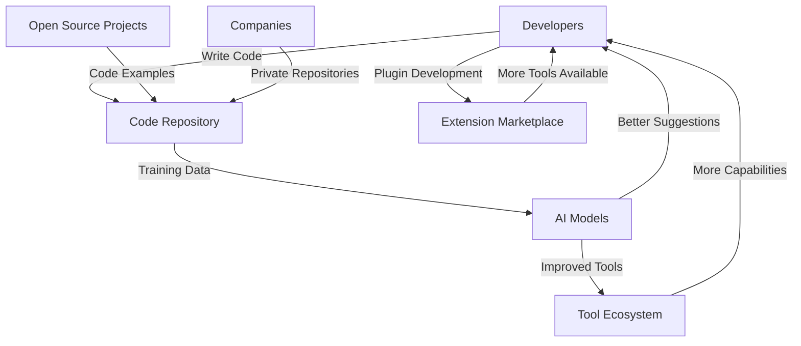
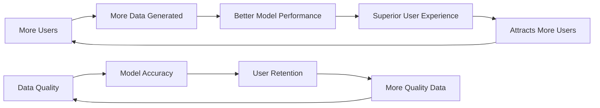
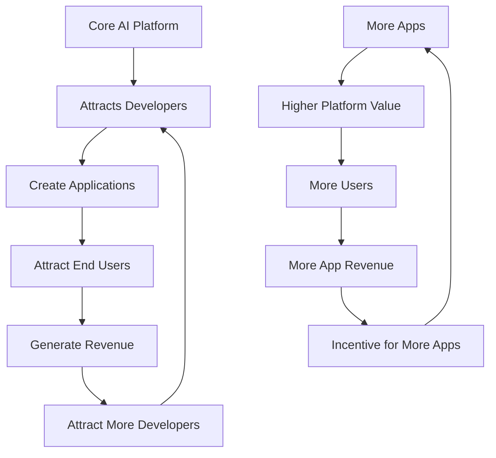
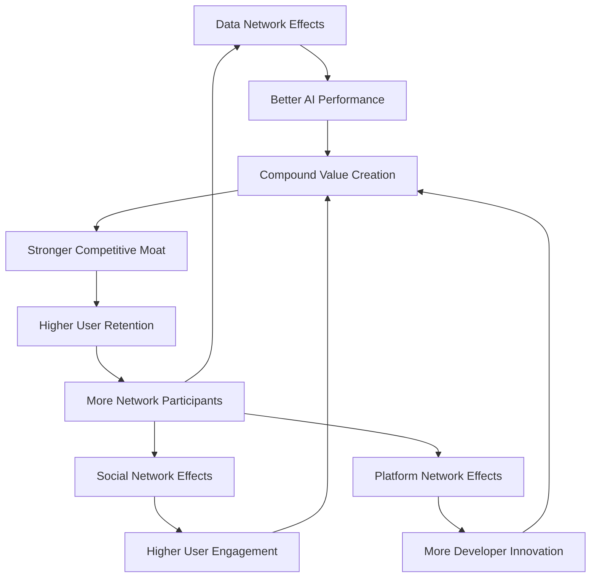

# 🌐 Network Effects

> **Design AI systems where value increases exponentially as more users join the network**

## 🎯 **What It Is**

Network Effects is a mental model from economics that describes how products or services become more valuable as more people use them. In AI systems, this creates powerful competitive advantages where early adoption leads to better performance, which attracts more users, creating a self-reinforcing cycle of growth.

**Core Insight**: The value of many AI systems grows exponentially with the number of users, creating winner-take-all dynamics and powerful defensive moats once network effects reach critical mass.

## ⚡ **The Economics Behind It**

```mermaid
graph LR
    A[More Users] --> B[Better Data]
    B --> C[Better AI Performance]
    C --> D[Higher User Value]
    D --> E[Attracts More Users]
    E --> A
    
    F[Network Value] --> G[N × (N-1) connections]
    H[Metcalfe's Law] --> I[Value ∝ Users²]
```

**Types of Network Effects:**
- **Direct Network Effects**: Users directly benefit from other users (social networks)
- **Indirect Network Effects**: Users benefit from complementary products/services
- **Data Network Effects**: More users generate data that improves the service
- **Social Network Effects**: Users influence each other's adoption decisions

## 🎯 **When to Use**

### **🚀 AI Product Strategy**
- Designing AI products with built-in network effects
- Planning go-to-market strategies for network-based AI
- Building competitive moats through network advantages

### **🔧 Platform Development**
- Creating AI platforms that benefit from scale
- Designing ecosystems where participants add value
- Building data strategies that improve with usage

### **📈 Growth Strategy**
- Prioritizing user acquisition for network-dependent products
- Timing market entry for network effect businesses
- Managing the transition from linear to exponential growth

## 🚀 **Practical Applications**

### **Example: AI-Powered Translation Service**

**🔍 Traditional vs. Network Effects Approach:**

**❌ Linear Value Creation:**
```python
def traditional_translation_service():
    # Value is independent of user count
    translation_quality = base_model_performance
    user_experience = standard_features
    
    # Adding users doesn't improve service
    for new_user in users:
        service_value = translation_quality  # Constant
        user_satisfaction = user_experience  # Constant
    
    # No competitive advantage from scale
    return "LINEAR_VALUE_SCALING"
```

**✅ Network Effects Design:**
```python
def network_effects_translation():
    # Value increases with network size
    user_base = track_active_users()
    
    # Data network effects
    translation_data = collect_user_corrections()
    model_performance = train_with_user_feedback(translation_data)
    
    # Language pair network effects
    language_pairs = analyze_user_language_combinations()
    rare_language_support = prioritize_underserved_pairs(language_pairs)
    
    # Community network effects
    user_contributions = {
        "correction_feedback": collect_translation_improvements(),
        "context_clarification": gather_usage_context(),
        "domain_expertise": leverage_specialist_knowledge(),
        "quality_rating": crowdsource_translation_evaluation()
    }
    
    # Value compounds with scale
    service_value = {
        "accuracy": base_performance + user_feedback_improvement(user_base),
        "coverage": base_languages + community_requested_languages(user_base),
        "context": base_understanding + user_context_data(user_base),
        "speed": base_speed + infrastructure_scaling_benefits(user_base)
    }
    
    # Each new user makes service better for all users
    network_value = calculate_metcalfe_value(user_base)
    
    return "EXPONENTIAL_VALUE_SCALING"
```

**Network Effect Mechanisms:**
1. **User Corrections**: Improve model for all language pairs
2. **Usage Patterns**: Reveal common translation needs
3. **Domain Knowledge**: Users in specialized fields improve technical translations
4. **Quality Feedback**: Crowd-sourced quality assessment improves ranking

### **Example: AI Code Assistant Platform**

**🧠 Multi-Sided Network Effects:**



**Implementation:**
```python
def build_code_assistant_network():
    # Developer-side network effects
    developer_value = {
        "code_quality": "better_suggestions_from_more_code_examples",
        "productivity": "faster_development_with_community_patterns",
        "learning": "exposure_to_best_practices_from_global_developers",
        "collaboration": "easier_code_sharing_and_understanding"
    }
    
    # Project-side network effects
    project_value = {
        "code_quality": "ai_assisted_code_review_and_improvement",
        "documentation": "auto_generated_docs_from_code_patterns",
        "onboarding": "easier_new_developer_ramp_up",
        "maintenance": "ai_assisted_refactoring_and_optimization"
    }
    
    # Platform-side network effects
    platform_value = {
        "model_improvement": "more_diverse_training_data",
        "feature_requests": "community_driven_development_priorities", 
        "ecosystem_growth": "third_party_integrations_and_extensions",
        "market_expansion": "viral_adoption_through_developer_networks"
    }
    
    # Network effect amplifiers
    amplification_mechanisms = {
        "code_sharing": "github_integration_for_viral_growth",
        "team_adoption": "organization_wide_rollouts",
        "skill_transfer": "mentorship_through_ai_suggestions",
        "standard_setting": "common_coding_patterns_emerge"
    }
    
    return create_multi_sided_network(
        developer_value, project_value, platform_value, amplification_mechanisms
    )
```

### **Example: AI Training Data Marketplace**

**🌐 Data Network Effects:**

```python
def design_data_marketplace_network():
    # Data providers benefit from network scale
    provider_incentives = {
        "higher_data_value": "more_buyers_increase_price_competition",
        "quality_feedback": "model_performance_data_improves_data_quality",
        "market_insights": "aggregate_demand_signals_guide_collection",
        "collaboration_opportunities": "partnerships_with_other_providers"
    }
    
    # AI developers benefit from data diversity
    developer_benefits = {
        "data_quality": "competitive_marketplace_drives_quality",
        "data_variety": "more_providers_offer_diverse_datasets",
        "cost_efficiency": "competition_drives_down_data_prices",
        "innovation_acceleration": "faster_access_to_training_data"
    }
    
    # Platform benefits from transaction volume
    platform_advantages = {
        "matching_efficiency": "better_algorithms_with_more_transactions",
        "quality_assurance": "reputation_systems_improve_with_scale",
        "market_liquidity": "more_participants_create_active_marketplace",
        "ecosystem_development": "tools_and_services_emerge_around_platform"
    }
    
    # Network effect triggers
    growth_mechanisms = {
        "data_network_effects": {
            "trigger": "model_performance_tracking",
            "mechanism": "better_data_gets_more_demand",
            "result": "incentivizes_higher_quality_data_creation"
        },
        
        "liquidity_network_effects": {
            "trigger": "transaction_volume_threshold", 
            "mechanism": "faster_matching_and_lower_search_costs",
            "result": "attracts_more_participants_to_active_marketplace"
        },
        
        "learning_network_effects": {
            "trigger": "usage_pattern_analysis",
            "mechanism": "platform_learns_optimal_matching",
            "result": "better_recommendations_increase_user_satisfaction"
        }
    }
    
    return implement_data_marketplace_network(
        provider_incentives, developer_benefits, platform_advantages, growth_mechanisms
    )
```

## 🔄 **Network Effect Patterns in AI**

### **📊 Data Network Effects**

**The Data Advantage Cycle:**


**Implementation Strategy:**
```python
def build_data_network_effects():
    # Design data collection into core user flows
    data_collection_points = {
        "user_interactions": "implicit_feedback_from_usage",
        "explicit_feedback": "ratings_and_corrections",
        "behavioral_data": "usage_patterns_and_preferences",
        "content_creation": "user_generated_training_examples"
    }
    
    # Create immediate value from collected data
    data_utilization = {
        "personalization": "immediate_user_experience_improvement",
        "recommendations": "better_suggestions_for_all_users",
        "performance_optimization": "faster_and_more_accurate_responses",
        "feature_development": "data_driven_product_improvements"
    }
    
    # Measure and communicate network value
    network_metrics = {
        "data_volume": track_total_training_data(),
        "data_quality": measure_annotation_accuracy(),
        "model_performance": benchmark_accuracy_improvements(),
        "user_satisfaction": survey_experience_quality()
    }
    
    return design_data_flywheel(data_collection_points, data_utilization, network_metrics)
```

### **🤝 Social Network Effects**

**Community-Driven AI Improvement:**
```python
def create_social_network_effects():
    # User-to-user value creation
    social_mechanisms = {
        "knowledge_sharing": {
            "feature": "user_generated_prompts_and_templates",
            "network_effect": "better_prompts_benefit_all_users",
            "incentive": "reputation_points_for_helpful_contributions"
        },
        
        "collaborative_learning": {
            "feature": "shared_ai_training_sessions",
            "network_effect": "group_learning_improves_individual_performance", 
            "incentive": "access_to_exclusive_community_features"
        },
        
        "peer_support": {
            "feature": "community_help_and_troubleshooting",
            "network_effect": "faster_problem_resolution_for_everyone",
            "incentive": "recognition_as_community_expert"
        },
        
        "content_curation": {
            "feature": "community_curated_ai_outputs",
            "network_effect": "higher_quality_content_for_all",
            "incentive": "influence_over_community_standards"
        }
    }
    
    # Viral growth mechanisms
    viral_loops = {
        "invitation_incentives": "better_ai_performance_with_team_usage",
        "content_sharing": "ai_generated_content_promotes_platform",
        "collaboration_features": "shared_projects_require_team_adoption",
        "network_exclusivity": "access_to_high_quality_networks"
    }
    
    return implement_social_ai_network(social_mechanisms, viral_loops)
```

### **🏗️ Platform Network Effects**

**Ecosystem Development:**


## 🎯 **Strategic Applications**

### **Cold Start Problem Solutions**

**🚀 Overcoming Initial Network Size Challenges:**

```python
def solve_cold_start_problem():
    # Single-player mode first
    standalone_value = {
        "core_functionality": "ai_works_well_even_with_one_user",
        "initial_data": "pre_trained_models_provide_immediate_value",
        "gradual_improvement": "user_sees_personalization_benefits_quickly"
    }
    
    # Seed network with high-value participants
    strategic_seeding = {
        "power_users": "invite_influential_early_adopters",
        "content_creators": "attract_users_who_generate_valuable_content",
        "domain_experts": "bring_in_specialists_who_improve_quality",
        "enterprise_customers": "large_organizations_provide_immediate_scale"
    }
    
    # Create artificial network effects during growth
    bootstrapping_mechanisms = {
        "synthetic_data": "use_ai_to_generate_initial_training_data",
        "partnership_data": "integrate_existing_datasets_and_services",
        "incentive_programs": "pay_early_users_for_high_quality_contributions",
        "exclusive_access": "limited_beta_creates_demand_and_quality_focus"
    }
    
    # Design for rapid scaling once threshold reached
    scaling_preparation = {
        "infrastructure": "plan_for_exponential_growth",
        "quality_control": "automated_systems_to_maintain_quality_at_scale",
        "community_management": "tools_and_processes_for_large_communities",
        "monetization": "revenue_models_that_scale_with_network_size"
    }
    
    return execute_cold_start_strategy(
        standalone_value, strategic_seeding, bootstrapping_mechanisms, scaling_preparation
    )
```

### **Network Effects Measurement**

**📊 Tracking Network Value Creation:**

```python
def measure_network_effects():
    # Network size metrics
    size_metrics = {
        "active_users": count_monthly_active_users(),
        "user_growth_rate": calculate_user_acquisition_velocity(),
        "network_density": measure_user_interaction_frequency(),
        "user_retention": track_long_term_engagement()
    }
    
    # Network value metrics
    value_metrics = {
        "user_lifetime_value": calculate_revenue_per_user_over_time(),
        "network_value_per_user": measure_value_creation_per_additional_user(),
        "cross_side_effects": quantify_value_between_user_types(),
        "viral_coefficient": track_organic_user_acquisition()
    }
    
    # Network effect strength
    strength_metrics = {
        "marginal_value": measure_value_increase_per_new_user(),
        "switching_costs": assess_difficulty_of_leaving_network(),
        "network_dependence": evaluate_value_loss_if_network_shrinks(),
        "competitive_moat": compare_network_advantages_vs_competitors()
    }
    
    # Leading indicators
    leading_indicators = {
        "engagement_depth": measure_feature_usage_intensity(),
        "content_creation": track_user_generated_value(),
        "recommendation_uptake": monitor_ai_suggestion_acceptance(),
        "community_health": assess_user_satisfaction_and_interaction_quality()
    }
    
    return calculate_network_effects_score(
        size_metrics, value_metrics, strength_metrics, leading_indicators
    )
```

### **Competitive Strategy with Network Effects**

**🏆 Building Defensive Moats:**

```python
def build_network_defense_strategy():
    # Multi-homing costs
    switching_barriers = {
        "data_lock_in": "personalized_ai_models_cant_be_transferred",
        "learning_investment": "users_invest_time_training_ai_to_preferences",
        "integration_depth": "deep_workflow_integration_makes_switching_painful",
        "network_relationships": "social_connections_tied_to_platform"
    }
    
    # Network effect amplification
    moat_deepening = {
        "exclusive_partnerships": "unique_data_sources_not_available_to_competitors",
        "ecosystem_development": "third_party_developers_create_switching_costs",
        "standard_setting": "become_the_default_choice_in_market_category",
        "regulatory_compliance": "network_size_enables_better_compliance_capabilities"
    }
    
    # Competitive response strategies
    attack_vectors = {
        "niche_focus": "dominate_specific_use_cases_before_expanding",
        "superior_technology": "offer_dramatically_better_ai_performance",
        "ecosystem_disruption": "partner_with_competitor_suppliers_or_customers",
        "regulation_leverage": "use_regulatory_changes_to_level_playing_field"
    }
    
    # Defense against disruption
    disruption_defense = {
        "continuous_innovation": "invest_network_advantages_in_r_and_d",
        "ecosystem_expansion": "enter_adjacent_markets_using_network_strength",
        "acquisition_strategy": "acquire_potential_disruptors_early",
        "platform_evolution": "transform_into_platform_that_enables_innovation"
    }
    
    return implement_network_defense(
        switching_barriers, moat_deepening, attack_vectors, disruption_defense
    )
```

## 💡 **Advanced Network Effect Strategies**

### **Multi-Sided Network Design**

**Balancing Different User Types:**
```python
def design_multi_sided_network():
    # Identify all stakeholder types
    stakeholder_types = {
        "data_providers": "contribute_training_data",
        "model_developers": "create_ai_algorithms",
        "application_builders": "develop_user_facing_tools",
        "end_users": "consume_ai_services",
        "infrastructure_providers": "supply_compute_resources"
    }
    
    # Design value exchanges between sides
    value_exchanges = {
        "data_to_models": "better_data_improves_model_performance",
        "models_to_apps": "better_models_enable_better_applications",
        "apps_to_users": "better_apps_provide_more_user_value",
        "users_to_data": "more_users_generate_more_valuable_data",
        "revenue_sharing": "value_captured_is_shared_across_ecosystem"
    }
    
    # Manage network effect timing
    growth_sequencing = {
        "chicken_egg_solutions": "solve_initial_adoption_coordination_problems",
        "side_prioritization": "focus_on_key_side_first_then_attract_others",
        "value_subsidization": "temporarily_subsidize_one_side_to_attract_other_side",
        "milestone_based_expansion": "add_new_sides_as_network_reaches_thresholds"
    }
    
    return orchestrate_multi_sided_growth(stakeholder_types, value_exchanges, growth_sequencing)
```

### **Network Effect Stacking**

**Combining Multiple Network Effects:**


### **Global vs. Local Network Effects**

**Designing for Different Network Scopes:**
```python
def design_multi_scope_networks():
    # Local network effects
    local_networks = {
        "geographic": "city_or_region_specific_ai_services",
        "organizational": "company_specific_ai_customization",
        "domain_specific": "industry_vertical_ai_optimization",
        "language_based": "language_specific_model_improvements"
    }
    
    # Global network effects
    global_networks = {
        "universal_models": "fundamental_ai_capabilities_that_benefit_everyone",
        "cross_pollination": "insights_from_one_domain_improve_others",
        "infrastructure_sharing": "compute_and_storage_economies_of_scale",
        "research_collaboration": "open_research_that_advances_entire_field"
    }
    
    # Hybrid strategies
    glocal_approaches = {
        "federated_learning": "local_training_with_global_model_sharing",
        "hierarchical_networks": "local_optimization_within_global_framework",
        "transfer_learning": "global_models_adapted_for_local_contexts",
        "cross_network_benefits": "local_networks_contribute_to_global_value"
    }
    
    return implement_multi_scope_strategy(local_networks, global_networks, glocal_approaches)
```

## ⚠️ **Network Effect Pitfalls**

### **Network Effect Myth**
- **Problem**: Assuming all AI products naturally have network effects
- **Reality**: Network effects must be designed in, not assumed to emerge
- **Solution**: Explicitly design mechanisms where additional users create value

### **False Network Effects**
- **Problem**: Claiming network effects that don't actually exist
- **Example**: "More users help us improve our AI" without clear value flow back to users
- **Solution**: Demonstrate measurable value increase per additional user

### **Network Effect Blindness**
- **Problem**: Missing opportunities to add network effects to existing products
- **Example**: Building AI tools that could benefit from user data but don't collect it
- **Solution**: Audit products for potential network effect enhancement

### **Winner-Takes-All Assumption**
- **Problem**: Assuming network effects guarantee market dominance
- **Reality**: Multiple networks can coexist, especially with different positioning
- **Solution**: Focus on sustainable competitive advantages beyond network size

## 📊 **Network Effect Success Metrics**

### **Core Network Metrics**
```python
def track_network_success():
    # Growth metrics
    growth_indicators = {
        "user_acquisition_rate": measure_new_user_signups(),
        "organic_growth_percentage": calculate_viral_vs_paid_acquisition(),
        "time_to_value": measure_user_activation_speed(),
        "network_density": calculate_user_interaction_frequency()
    }
    
    # Value creation metrics
    value_indicators = {
        "value_per_user": calculate_average_user_value_delivered(),
        "marginal_value": measure_value_increase_per_additional_user(),
        "cross_network_value": quantify_value_between_different_user_types(),
        "ecosystem_value": measure_third_party_value_creation()
    }
    
    # Strength metrics
    strength_indicators = {
        "switching_costs": survey_difficulty_of_leaving_platform(),
        "network_dependence": measure_value_loss_if_network_shrinks(),
        "competitive_differentiation": compare_network_advantages_vs_alternatives(),
        "network_resilience": assess_stability_during_growth_and_contraction()
    }
    
    # Leading indicators
    health_indicators = {
        "engagement_trends": track_user_activity_patterns_over_time(),
        "quality_metrics": monitor_network_content_and_interaction_quality(),
        "innovation_rate": measure_new_feature_adoption_and_creation(),
        "community_sentiment": assess_user_satisfaction_and_advocacy()
    }
    
    return synthesize_network_health_score(
        growth_indicators, value_indicators, strength_indicators, health_indicators
    )
```

## 💡 **Key Takeaways**

- **Network effects create exponential value growth and powerful competitive advantages**
- **AI systems are particularly well-suited to network effects through data improvement cycles**
- **Different types of network effects can be combined for stronger moats**
- **Cold start problems can be solved with strategic seeding and standalone value**
- **Network effects must be explicitly designed, not assumed to emerge naturally**
- **Success requires balancing growth, value creation, and network health over time**

---

**🔗 Related Mental Models:**
- [Compound Growth](./compound-growth.md) - How network value compounds over time
- [Symbiosis Framework](./symbiosis-framework.md) - Creating mutually beneficial relationships
- [Platform Strategy](./platform-strategy.md) - Building ecosystems around AI
- [Market Timing Framework](./market-timing-framework.md) - Timing network effect launches

**📚 Further Reading:**
- Network economics and platform strategy
- Viral growth and network topology
- Multi-sided market design
- Competitive strategy and moats in network businesses
