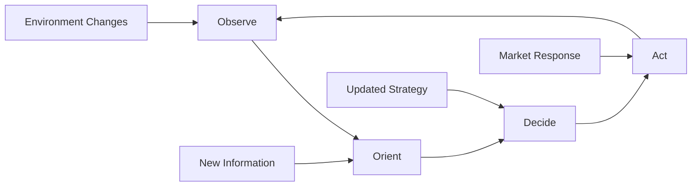
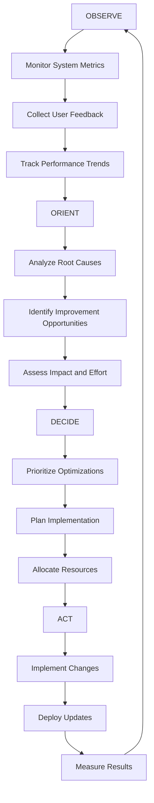
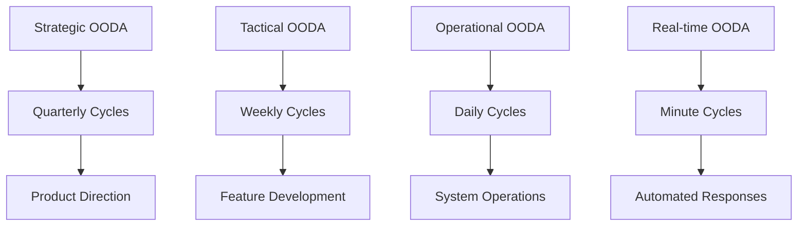
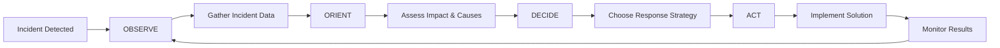

# 🎯 OODA Loop

> **Make faster, better decisions by cycling through Observe, Orient, Decide, and Act in AI development**

## 🎯 **What It Is**

The OODA Loop is a mental model borrowed from military strategy that helps you make rapid, adaptive decisions in complex, fast-changing environments by cycling through four phases: Observe, Orient, Decide, and Act.

**Core Insight**: Success in competitive environments comes from completing decision cycles faster and more effectively than your opponents, allowing you to stay ahead of changing conditions.

## ⚡ **The Military Strategy Behind It**



**The Four Phases:**
- **Observe**: Gather information about the current situation
- **Orient**: Analyze and synthesize observations to understand the situation
- **Decide**: Determine the best course of action
- **Act**: Implement the decision and execute the plan

**Key Principle**: The faster you can complete OODA cycles, the better you can adapt to change and stay ahead of competition.

## 🎯 **When to Use**

### **🚀 Rapid AI Development**
- Building and iterating AI products in competitive markets
- Responding quickly to user feedback and market changes
- Managing fast-moving AI research and experimentation

### **📈 Strategic Decision Making**
- Navigating uncertain AI market conditions
- Making technology adoption decisions
- Planning competitive responses to market moves

### **🔧 Operational Excellence**
- Optimizing AI system performance through rapid iteration
- Managing incident response and system reliability
- Continuous improvement of AI operations

## 🚀 **Practical Applications**

### **Example: AI Product Development OODA Loop**

**🔍 Traditional Development vs. OODA-Optimized:**

**❌ Linear Development:**
```python
def traditional_development():
    # Long, sequential phases
    requirements = gather_requirements()  # 4 weeks
    design = create_detailed_design()     # 6 weeks  
    implementation = build_system()       # 12 weeks
    testing = comprehensive_testing()     # 4 weeks
    deployment = deploy_to_production()   # 2 weeks
    
    # Total cycle time: 28 weeks
    # Feedback comes too late to influence decisions
    return "SLOW_ADAPTATION"
```

**✅ OODA-Optimized Development:**
```python
def ooda_optimized_development():
    cycle_duration = 2  # weeks per complete OODA cycle
    
    while product_not_optimal():
        # OBSERVE (0.5 weeks)
        observations = {
            "user_behavior": analyze_usage_data(),
            "performance_metrics": monitor_system_performance(),
            "market_changes": track_competitor_moves(),
            "technical_constraints": assess_infrastructure_limits(),
            "team_capacity": evaluate_development_velocity()
        }
        
        # ORIENT (0.5 weeks)
        situation_analysis = {
            "user_needs": synthesize_user_feedback(observations),
            "technical_opportunities": identify_improvement_areas(observations),
            "competitive_position": assess_market_standing(observations),
            "resource_allocation": optimize_team_focus(observations)
        }
        
        # DECIDE (0.5 weeks)
        decisions = {
            "feature_priorities": rank_development_tasks(situation_analysis),
            "technical_approach": choose_implementation_strategy(situation_analysis),
            "resource_distribution": allocate_team_efforts(situation_analysis),
            "success_metrics": define_cycle_objectives(situation_analysis)
        }
        
        # ACT (0.5 weeks)
        actions = {
            "feature_development": implement_highest_priority_features(decisions),
            "system_improvements": execute_technical_optimizations(decisions),
            "user_engagement": deploy_changes_and_gather_feedback(decisions),
            "market_response": communicate_updates_and_monitor_reaction(decisions)
        }
        
        # Complete cycle in 2 weeks, enabling rapid adaptation
        cycle_results = evaluate_cycle_outcomes(actions)
        
    return "RAPID_ADAPTATION_ACHIEVED"
```

### **Example: AI Research OODA Loop**

**🧠 Research Experimentation Cycle:**

```python
def research_ooda_loop():
    research_cycle = {
        "observe": {
            "duration": "1_day",
            "activities": [
                "review_latest_papers",
                "analyze_experiment_results", 
                "monitor_research_community_discussions",
                "assess_current_model_performance",
                "identify_performance_bottlenecks"
            ]
        },
        
        "orient": {
            "duration": "1_day", 
            "activities": [
                "synthesize_research_insights",
                "identify_promising_research_directions",
                "assess_resource_requirements",
                "evaluate_risk_reward_tradeoffs",
                "prioritize_experiment_hypotheses"
            ]
        },
        
        "decide": {
            "duration": "0.5_days",
            "activities": [
                "select_next_experiment",
                "design_experiment_protocol",
                "allocate_compute_resources",
                "set_success_criteria",
                "plan_result_evaluation"
            ]
        },
        
        "act": {
            "duration": "3.5_days",
            "activities": [
                "implement_experiment",
                "run_training_and_evaluation",
                "collect_and_analyze_results",
                "document_findings",
                "share_results_with_team"
            ]
        }
    }
    
    # Complete research cycle in 1 week
    # Enables rapid exploration of research space
    return execute_research_cycle(research_cycle)
```

### **Example: AI System Operations OODA Loop**

**🔧 Continuous Operations Improvement:**



**Implementation:**
```python
def operations_ooda_loop():
    while system_is_running():
        # OBSERVE (Continuous monitoring)
        system_state = {
            "performance_metrics": collect_real_time_metrics(),
            "error_patterns": analyze_error_logs(),
            "user_satisfaction": monitor_support_tickets(),
            "resource_utilization": track_infrastructure_usage(),
            "security_events": monitor_security_alerts()
        }
        
        # ORIENT (Daily analysis - 30 minutes)
        insights = {
            "performance_trends": identify_degradation_patterns(system_state),
            "optimization_opportunities": find_improvement_areas(system_state),
            "risk_assessment": evaluate_system_risks(system_state),
            "capacity_planning": predict_scaling_needs(system_state)
        }
        
        # DECIDE (Daily planning - 30 minutes)
        action_plan = {
            "immediate_fixes": prioritize_urgent_issues(insights),
            "optimization_tasks": schedule_performance_improvements(insights),
            "preventive_measures": plan_risk_mitigation(insights),
            "capacity_adjustments": schedule_infrastructure_changes(insights)
        }
        
        # ACT (Continuous execution)
        execution_results = {
            "fixes_applied": implement_immediate_fixes(action_plan),
            "optimizations_deployed": execute_improvements(action_plan),
            "monitoring_updated": enhance_observability(action_plan),
            "capacity_scaled": adjust_resources(action_plan)
        }
        
        # Loop completes daily, enabling rapid response to issues
        sleep(24_hours)
        
    return "CONTINUOUS_IMPROVEMENT_MAINTAINED"
```

## 🔄 **OODA Loop Patterns in AI**

### **⚡ Speed vs. Quality Trade-offs**

**Optimizing Cycle Time:**
```python
def optimize_ooda_speed():
    # Parallel observation streams
    observations = concurrent_execute([
        monitor_system_performance(),
        track_user_behavior(),
        analyze_market_trends(),
        assess_technical_metrics()
    ])
    
    # Automated orientation analysis
    ai_insights = {
        "pattern_recognition": apply_ml_to_observations(observations),
        "anomaly_detection": identify_unusual_patterns(observations),
        "predictive_analysis": forecast_trends(observations),
        "automated_synthesis": generate_situation_summary(observations)
    }
    
    # Decision support systems
    decision_recommendations = {
        "prioritized_actions": rank_potential_actions(ai_insights),
        "risk_analysis": assess_action_risks(ai_insights),
        "resource_estimates": calculate_implementation_costs(ai_insights),
        "success_probability": predict_action_outcomes(ai_insights)
    }
    
    # Automated execution where appropriate
    safe_actions = filter_low_risk_actions(decision_recommendations)
    automated_results = execute_safe_actions(safe_actions)
    
    # Human decision for high-risk actions
    complex_decisions = require_human_judgment(decision_recommendations)
    
    return balance_speed_and_quality(automated_results, complex_decisions)
```

### **🎯 Multi-Level OODA Loops**

**Nested Decision Cycles:**


**Implementation Strategy:**
```python
def implement_multi_level_ooda():
    # Strategic level (Quarterly)
    strategic_ooda = {
        "observe": "market_trends_and_technology_shifts",
        "orient": "competitive_positioning_and_capability_gaps",
        "decide": "product_roadmap_and_resource_allocation",
        "act": "major_initiative_launches_and_partnerships"
    }
    
    # Tactical level (Weekly)
    tactical_ooda = {
        "observe": "user_feedback_and_performance_metrics",
        "orient": "feature_impact_and_development_velocity",
        "decide": "sprint_planning_and_priority_adjustments",
        "act": "feature_releases_and_process_improvements"
    }
    
    # Operational level (Daily)
    operational_ooda = {
        "observe": "system_health_and_user_behavior",
        "orient": "issue_patterns_and_optimization_opportunities",
        "decide": "deployment_decisions_and_configuration_changes",
        "act": "system_updates_and_performance_tuning"
    }
    
    # Real-time level (Continuous)
    realtime_ooda = {
        "observe": "monitoring_alerts_and_system_metrics",
        "orient": "automated_pattern_analysis",
        "decide": "rule_based_decision_trees",
        "act": "automated_scaling_and_failover"
    }
    
    return coordinate_multi_level_cycles(
        strategic_ooda, tactical_ooda, operational_ooda, realtime_ooda
    )
```

### **🤖 AI-Augmented OODA Loops**

**Using AI to Accelerate Decision Cycles:**
```python
def ai_augmented_ooda():
    # AI-enhanced observation
    enhanced_observe = {
        "automated_data_collection": "real_time_metric_aggregation",
        "pattern_recognition": "ml_anomaly_detection",
        "sentiment_analysis": "automated_feedback_processing",
        "competitive_intelligence": "automated_market_monitoring"
    }
    
    # AI-assisted orientation
    enhanced_orient = {
        "data_synthesis": "llm_insight_generation",
        "scenario_planning": "predictive_modeling",
        "root_cause_analysis": "automated_correlation_analysis",
        "opportunity_identification": "optimization_recommendation_engine"
    }
    
    # AI-supported decision making
    enhanced_decide = {
        "option_generation": "creative_ai_brainstorming",
        "impact_simulation": "scenario_modeling",
        "risk_assessment": "automated_risk_scoring",
        "decision_optimization": "multi_objective_optimization"
    }
    
    # AI-enabled action execution
    enhanced_act = {
        "automated_deployment": "ci_cd_pipeline_integration",
        "real_time_adjustment": "automated_parameter_tuning",
        "progress_monitoring": "continuous_success_tracking",
        "feedback_collection": "automated_user_research"
    }
    
    return create_ai_ooda_system(
        enhanced_observe, enhanced_orient, enhanced_decide, enhanced_act
    )
```

## 🎯 **Strategic Applications**

### **Competitive Intelligence OODA**

**🏆 Staying Ahead of Competition:**

```python
def competitive_ooda_loop():
    while competition_exists():
        # OBSERVE competitors
        competitive_intelligence = {
            "product_updates": monitor_competitor_releases(),
            "marketing_messages": analyze_competitor_communications(),
            "hiring_patterns": track_competitor_talent_acquisition(),
            "research_publications": monitor_competitor_research(),
            "user_sentiment": analyze_competitor_user_feedback()
        }
        
        # ORIENT competitive position
        strategic_assessment = {
            "competitive_gaps": identify_capability_differences(competitive_intelligence),
            "market_opportunities": find_uncontested_spaces(competitive_intelligence),
            "threat_analysis": assess_competitive_threats(competitive_intelligence),
            "timing_windows": identify_response_opportunities(competitive_intelligence)
        }
        
        # DECIDE strategic response
        competitive_strategy = {
            "defensive_moves": plan_competitive_parity_actions(strategic_assessment),
            "offensive_opportunities": design_market_disruption_tactics(strategic_assessment),
            "differentiation_strategy": develop_unique_value_propositions(strategic_assessment),
            "timing_strategy": optimize_response_timing(strategic_assessment)
        }
        
        # ACT on competitive strategy
        competitive_actions = {
            "product_development": accelerate_competitive_features(competitive_strategy),
            "market_positioning": execute_messaging_strategy(competitive_strategy),
            "partnership_building": form_strategic_alliances(competitive_strategy),
            "talent_acquisition": recruit_key_capabilities(competitive_strategy)
        }
        
        # Complete competitive cycle faster than competitors
        cycle_time = measure_ooda_cycle_duration()
        competitor_cycle_time = estimate_competitor_decision_speed()
        
        if cycle_time < competitor_cycle_time:
            return "COMPETITIVE_ADVANTAGE_MAINTAINED"
        else:
            optimize_ooda_speed()
```

### **Crisis Response OODA**

**🚨 Rapid Incident Response:**



### **Innovation OODA**

**🚀 Accelerating Innovation Cycles:**

```python
def innovation_ooda_loop():
    innovation_cycle = {
        "observe": {
            "user_pain_points": "continuous_user_research",
            "technology_trends": "research_community_monitoring",
            "market_gaps": "competitive_landscape_analysis",
            "internal_capabilities": "team_skill_and_resource_assessment"
        },
        
        "orient": {
            "opportunity_synthesis": "innovation_opportunity_identification",
            "feasibility_analysis": "technical_and_business_viability_assessment",
            "resource_mapping": "capability_and_investment_requirements",
            "risk_evaluation": "innovation_risk_and_mitigation_planning"
        },
        
        "decide": {
            "innovation_portfolio": "balanced_innovation_investment_strategy",
            "experiment_design": "rapid_prototyping_and_testing_protocols",
            "resource_allocation": "team_and_budget_assignment",
            "success_metrics": "innovation_outcome_measurement_framework"
        },
        
        "act": {
            "rapid_prototyping": "quick_proof_of_concept_development",
            "user_testing": "early_user_feedback_collection",
            "iteration_cycles": "continuous_prototype_improvement",
            "scaling_decisions": "successful_innovation_commercialization"
        }
    }
    
    return execute_innovation_ooda(innovation_cycle)
```

## 💡 **Advanced OODA Strategies**

### **OODA Loop Disruption**

**Breaking Competitor OODA Cycles:**
```python
def disrupt_competitor_ooda():
    disruption_tactics = {
        "observe_disruption": {
            "information_warfare": "create_misleading_market_signals",
            "noise_injection": "flood_market_with_confusing_information",
            "speed_of_change": "change_market_conditions_faster_than_observation"
        },
        
        "orient_disruption": {
            "paradigm_shifts": "change_fundamental_market_assumptions",
            "complexity_injection": "increase_market_complexity_beyond_analysis_capability",
            "false_patterns": "create_misleading_market_patterns"
        },
        
        "decide_disruption": {
            "option_overload": "create_too_many_strategic_choices",
            "time_pressure": "force_decisions_under_extreme_time_constraints",
            "resource_constraints": "force_difficult_resource_allocation_decisions"
        },
        
        "act_disruption": {
            "execution_interference": "disrupt_competitor_implementation",
            "market_preemption": "occupy_strategic_positions_before_competitor_action",
            "resource_blocking": "limit_competitor_access_to_key_resources"
        }
    }
    
    return implement_ooda_disruption_strategy(disruption_tactics)
```

### **Collaborative OODA**

**Multi-Organization OODA Coordination:**
```python
def coordinate_ecosystem_ooda():
    # Align OODA cycles across partners and stakeholders
    ecosystem_coordination = {
        "shared_observation": "common_market_intelligence_platform",
        "collective_orientation": "shared_analysis_and_insights",
        "coordinated_decisions": "aligned_strategic_planning",
        "synchronized_action": "coordinated_market_execution"
    }
    
    # Balance competition and collaboration
    competitive_areas = ["product_differentiation", "customer_acquisition"]
    collaborative_areas = ["infrastructure_development", "standard_setting"]
    
    return balance_competitive_and_collaborative_ooda(
        ecosystem_coordination, competitive_areas, collaborative_areas
    )
```

## ⚠️ **OODA Loop Pitfalls**

### **Analysis Paralysis**
- **Problem**: Spending too much time in Observe and Orient phases
- **Solution**: Set strict time limits for each phase and accept "good enough" decisions

### **Action Addiction**
- **Problem**: Moving to Act too quickly without proper observation and orientation
- **Solution**: Build in forced pause points for reflection and analysis

### **Cycle Fragmentation**
- **Problem**: Not completing full OODA cycles, jumping between phases randomly
- **Solution**: Track cycle completion and ensure each phase feeds into the next

### **Single Loop Focus**
- **Problem**: Only operating at one decision cycle level
- **Solution**: Design multi-level OODA systems with appropriate coordination

## 📊 **Measuring OODA Effectiveness**

### **OODA Cycle Metrics**
```python
def measure_ooda_performance():
    cycle_metrics = {
        # Speed metrics
        "cycle_time": measure_complete_ooda_duration(),
        "phase_distribution": analyze_time_per_phase(),
        "decision_velocity": calculate_decisions_per_unit_time(),
        
        # Quality metrics
        "decision_accuracy": track_decision_outcome_success_rate(),
        "information_quality": assess_observation_completeness_and_accuracy(),
        "analysis_depth": evaluate_orientation_thoroughness(),
        
        # Adaptation metrics
        "response_time": measure_time_from_change_to_action(),
        "learning_velocity": track_improvement_rate_over_cycles(),
        "competitive_advantage": assess_cycle_speed_vs_competitors()
    }
    
    ooda_effectiveness = {
        "speed_score": normalize_and_weight_speed_metrics(cycle_metrics),
        "quality_score": normalize_and_weight_quality_metrics(cycle_metrics),
        "adaptation_score": normalize_and_weight_adaptation_metrics(cycle_metrics)
    }
    
    return calculate_overall_ooda_effectiveness(ooda_effectiveness)
```

### **OODA Dashboard**
- **Cycle Completion Rate**: Percentage of full OODA cycles completed
- **Cycle Time Trends**: How cycle speed is changing over time
- **Decision Quality**: Success rate of decisions made through OODA process
- **Competitive Advantage**: OODA speed relative to competition

## 💡 **Key Takeaways**

- **Speed of decision cycles often matters more than perfection of individual decisions**
- **Complete OODA loops rather than optimizing individual phases**
- **Different situations require different OODA cycle speeds and depths**
- **AI can significantly accelerate OODA loops through automation and augmentation**
- **Disrupting competitor OODA cycles can be more effective than perfecting your own**
- **Multi-level OODA systems handle different decision timescales effectively**

---

**🔗 Related Mental Models:**
- [Feedback Loops](./feedback-loops.md) - Creating continuous improvement cycles
- [First Principles Thinking](./first-principles-thinking.md) - Deep analysis in the Orient phase
- [Market Timing Framework](./market-timing-framework.md) - Strategic timing of actions
- [Red Queen Hypothesis](./red-queen-hypothesis.md) - Continuous competitive adaptation

**📚 Further Reading:**
- Military strategy and decision-making under uncertainty
- Agile and lean methodologies
- Competitive intelligence and strategy
- Crisis management and rapid response systems
