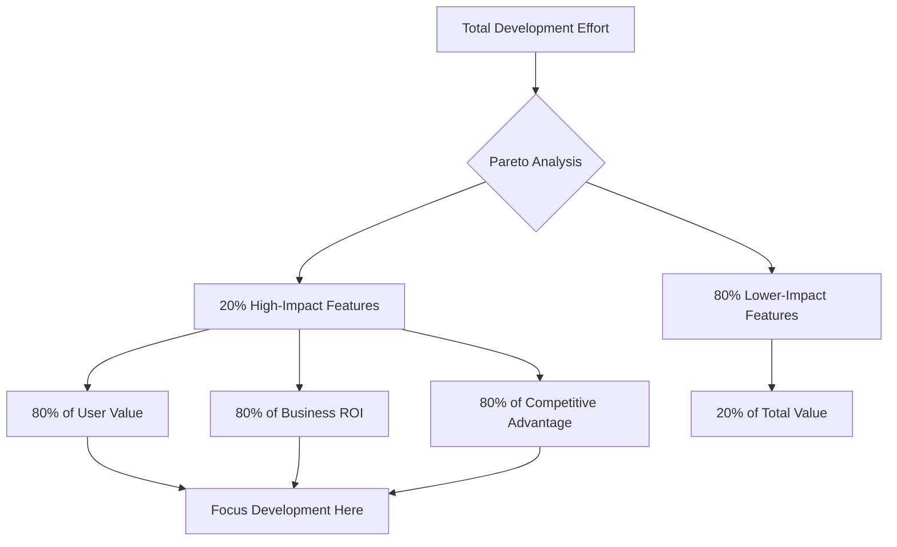

# 📊 Pareto Principle (80/20 Rule)

> **Core Insight**: 80% of outcomes come from 20% of causes - focus AI development effort where it creates the most impact.

---

## **🔬 What It Is**

The **Pareto Principle**, also known as the **80/20 Rule**, states that roughly 80% of consequences come from 20% of causes. In AI development, this translates to:

- **🎯 80% of AI value** comes from **20% of features**
- **📊 80% of errors** come from **20% of edge cases**  
- **👥 80% of user satisfaction** comes from **20% of functionality**
- **💰 80% of ROI** comes from **20% of AI implementations**

Think of it as **the law of vital few vs trivial many** - most impact comes from focusing on the critical minority.

---

## **🧪 The Science Behind It**

### **Mathematical Foundation**
```python
# Pareto Distribution
import numpy as np

def pareto_analysis(data):
    # Sort data in descending order
    sorted_data = sorted(data, reverse=True)
    
    # Calculate cumulative percentage
    cumulative_sum = np.cumsum(sorted_data)
    total_sum = sum(sorted_data)
    cumulative_percentage = (cumulative_sum / total_sum) * 100
    
    # Find 80% threshold
    pareto_point = next(i for i, pct in enumerate(cumulative_percentage) if pct >= 80)
    vital_few_percentage = (pareto_point / len(data)) * 100
    
    return {
        'vital_few_items': pareto_point,
        'vital_few_percentage': vital_few_percentage,
        'impact_percentage': 80
    }
```

### **Key Principles**
1. **Non-Linear Relationships**: Small inputs can create large outputs
2. **Priority Asymmetry**: Not all tasks/features/problems are equally important
3. **Diminishing Returns**: Additional effort beyond the vital 20% yields less impact
4. **Scalable Focus**: Identifying high-impact areas allows resource optimization

---

## **🎯 When to Use This Model**

### **Apply When:**
- ✅ **Prioritizing features** in AI product development
- ✅ **Optimizing AI model performance** with limited resources
- ✅ **Allocating development time** across multiple AI projects
- ✅ **Debugging AI systems** with many potential issues

### **Critical For:**
- 🚀 **MVP development** - which AI capabilities to build first
- 📈 **Performance tuning** - which optimizations matter most
- 🔧 **Error reduction** - which bugs to fix first
- 💼 **Resource allocation** - where to invest AI development effort

---

## **💡 Practical Applications**

### **🎯 AI Feature Prioritization**

**Pareto Feature Analysis:**
```python
class ParetoFeaturePrioritizer:
    def __init__(self):
        self.features = {}
        self.impact_scores = {}
        self.effort_estimates = {}
    
    def analyze_feature_impact(self, user_data, feature_usage):
        # Calculate impact score for each feature
        for feature in feature_usage:
            usage_frequency = feature_usage[feature]['frequency']
            user_satisfaction = feature_usage[feature]['satisfaction']
            business_value = feature_usage[feature]['business_value']
            
            # Weighted impact score
            impact_score = (
                usage_frequency * 0.4 + 
                user_satisfaction * 0.3 + 
                business_value * 0.3
            )
            
            self.impact_scores[feature] = impact_score
    
    def identify_vital_features(self):
        # Sort features by impact
        sorted_features = sorted(
            self.impact_scores.items(), 
            key=lambda x: x[1], 
            reverse=True
        )
        
        # Apply Pareto principle
        total_impact = sum(self.impact_scores.values())
        cumulative_impact = 0
        vital_features = []
        
        for feature, impact in sorted_features:
            cumulative_impact += impact
            vital_features.append(feature)
            
            # Stop when we reach ~80% of total impact
            if cumulative_impact >= 0.8 * total_impact:
                break
        
        return {
            'vital_20_percent': vital_features,
            'impact_contribution': (cumulative_impact / total_impact) * 100,
            'feature_count_percentage': (len(vital_features) / len(sorted_features)) * 100
        }
```

### **🔧 AI Model Optimization**

**Performance Bottleneck Analysis:**
```python
class ParetoPerformanceOptimizer:
    def analyze_model_bottlenecks(self, performance_data):
        bottlenecks = {
            'data_preprocessing': performance_data['preprocessing_time'],
            'model_inference': performance_data['inference_time'],
            'post_processing': performance_data['postprocessing_time'],
            'memory_usage': performance_data['memory_consumption'],
            'gpu_utilization': performance_data['gpu_usage'],
            'io_operations': performance_data['io_time']
        }
        
        # Apply Pareto analysis
        pareto_result = self.pareto_analysis(bottlenecks)
        
        return {
            'critical_bottlenecks': pareto_result['vital_few'],
            'optimization_priority': self.rank_optimization_opportunities(pareto_result),
            'expected_improvement': self.estimate_performance_gains(pareto_result)
        }
    
    def optimization_strategy(self, bottlenecks):
        strategies = {
            'data_preprocessing': 'Implement parallel processing and caching',
            'model_inference': 'Model quantization and batch optimization',
            'memory_usage': 'Memory-efficient model architectures',
            'gpu_utilization': 'Kernel optimization and memory management'
        }
        
        # Focus on vital few bottlenecks
        return {bottleneck: strategies[bottleneck] 
                for bottleneck in bottlenecks['critical_bottlenecks']}
```

### **📊 Error Prioritization**

**Bug Impact Analysis:**
```python
class ParetoErrorAnalysis:
    def prioritize_ai_errors(self, error_logs):
        error_analysis = {}
        
        for error in error_logs:
            error_type = error['type']
            
            if error_type not in error_analysis:
                error_analysis[error_type] = {
                    'frequency': 0,
                    'severity_score': 0,
                    'user_impact': 0,
                    'business_cost': 0
                }
            
            # Aggregate error impact metrics
            error_analysis[error_type]['frequency'] += 1
            error_analysis[error_type]['severity_score'] += error['severity']
            error_analysis[error_type]['user_impact'] += error['users_affected']
            error_analysis[error_type]['business_cost'] += error['cost_impact']
        
        # Calculate composite impact score
        for error_type in error_analysis:
            metrics = error_analysis[error_type]
            impact_score = (
                metrics['frequency'] * 0.3 +
                metrics['severity_score'] * 0.3 +
                metrics['user_impact'] * 0.2 +
                metrics['business_cost'] * 0.2
            )
            error_analysis[error_type]['total_impact'] = impact_score
        
        return self.identify_critical_errors(error_analysis)
```

---

## **📈 Strategic Applications**

### **1. AI Development Resource Allocation**



### **2. AI Product Strategy Matrix**

| **Development Phase** | **Pareto Focus** | **Resource Allocation** | **Success Metrics** |
|----------------------|------------------|------------------------|-------------------|
| **🚀 MVP** | Core 20% of features | 80% effort on essentials | User adoption, core value delivery |
| **📈 Growth** | Scaling 20% of successful features | Optimize high-impact areas | Usage growth, retention |
| **🔧 Optimization** | Fix 20% of critical issues | Performance and reliability | Error reduction, satisfaction |
| **🌟 Innovation** | Explore 20% of new opportunities | R&D in promising areas | Future value potential |

### **3. AI Team Productivity Framework**

**Developer Impact Analysis:**
```python
class TeamParetoAnalysis:
    def analyze_team_productivity(self, team_metrics):
        developer_impact = {}
        
        for developer in team_metrics:
            metrics = team_metrics[developer]
            
            # Calculate composite productivity score
            productivity_score = (
                metrics['features_delivered'] * 0.3 +
                metrics['bug_fixes'] * 0.2 +
                metrics['code_quality'] * 0.2 +
                metrics['mentoring_impact'] * 0.15 +
                metrics['innovation_contributions'] * 0.15
            )
            
            developer_impact[developer] = productivity_score
        
        # Apply Pareto principle to identify high-impact developers
        return self.identify_top_performers(developer_impact)
    
    def optimization_strategies(self, analysis_results):
        return {
            'amplify_top_performers': 'Give high-impact developers more complex projects',
            'knowledge_transfer': 'Have top performers mentor others',
            'remove_blockers': 'Ensure high-impact people have optimal conditions',
            'skill_development': 'Help others reach high-impact levels'
        }
```

---

## **🔧 Advanced Strategies**

### **1. Dynamic Pareto Analysis**

```python
class DynamicParetoAnalyzer:
    def __init__(self):
        self.historical_data = {}
        self.trend_analysis = {}
    
    def track_pareto_evolution(self, current_data, time_period):
        # Store current snapshot
        self.historical_data[time_period] = current_data
        
        # Analyze how the vital 20% changes over time
        if len(self.historical_data) > 1:
            return self.analyze_pareto_drift()
    
    def analyze_pareto_drift(self):
        # Identify items moving in/out of vital 20%
        time_periods = sorted(self.historical_data.keys())
        latest_period = time_periods[-1]
        previous_period = time_periods[-2]
        
        latest_vital = self.get_vital_20_percent(self.historical_data[latest_period])
        previous_vital = self.get_vital_20_percent(self.historical_data[previous_period])
        
        return {
            'newly_vital': set(latest_vital) - set(previous_vital),
            'no_longer_vital': set(previous_vital) - set(latest_vital),
            'consistently_vital': set(latest_vital) & set(previous_vital),
            'stability_score': len(set(latest_vital) & set(previous_vital)) / len(latest_vital)
        }
```

### **2. Multi-Dimensional Pareto**

```python
class MultiDimensionalPareto:
    def analyze_multiple_dimensions(self, data, dimensions):
        # Apply Pareto principle across multiple metrics
        results = {}
        
        for dimension in dimensions:
            dimension_data = {item: data[item][dimension] for item in data}
            results[dimension] = self.pareto_analysis(dimension_data)
        
        # Find items that are vital across multiple dimensions
        vital_intersection = self.find_multi_dimensional_vital(results)
        
        return {
            'single_dimension_vital': results,
            'multi_dimension_vital': vital_intersection,
            'super_vital_items': self.identify_super_vital(vital_intersection)
        }
    
    def identify_super_vital(self, intersection_data):
        # Items that appear in vital 20% across multiple dimensions
        super_vital = []
        
        for item in intersection_data:
            if intersection_data[item]['vital_dimensions'] >= 2:
                super_vital.append(item)
        
        return super_vital
```

### **3. Pareto-Driven Decision Framework**

```python
class ParetoDecisionFramework:
    def make_pareto_informed_decision(self, options, criteria):
        # Score each option across multiple criteria
        option_scores = {}
        
        for option in options:
            total_score = 0
            for criterion in criteria:
                weight = criteria[criterion]['weight']
                score = self.evaluate_option_on_criterion(option, criterion)
                total_score += weight * score
            
            option_scores[option] = total_score
        
        # Apply Pareto analysis to options
        pareto_result = self.pareto_analysis(option_scores)
        
        return {
            'recommended_options': pareto_result['vital_few'],
            'impact_justification': self.calculate_impact_difference(pareto_result),
            'resource_optimization': self.estimate_resource_savings(pareto_result)
        }
```

---

## **⚠️ Common Pitfalls**

### **🚫 Analysis Traps**
- **Static Thinking**: Assuming the vital 20% never changes
- **Over-Simplification**: Applying 80/20 rigidly when ratios might be different
- **False Precision**: Believing the ratio is exactly 80/20 in all cases

### **🚫 Implementation Traps**
- **Neglecting the 80%**: Completely ignoring non-vital areas
- **Pareto Paralysis**: Over-analyzing instead of taking action
- **Context Ignorance**: Applying Pareto without considering specific situation

### **🚫 Strategic Traps**
- **Short-term Focus**: Optimizing for current vital 20% while missing future shifts
- **Quality Sacrifice**: Focusing only on high-impact areas at expense of overall quality
- **Team Morale**: Creating "important" vs "unimportant" work distinctions

---

## **📊 How to Measure Success**

### **Pareto Effectiveness Metrics**
```python
pareto_metrics = {
    'resource_efficiency': {
        'effort_concentration': 'Percentage of effort on vital few',
        'impact_amplification': 'Impact achieved per unit of effort',
        'opportunity_cost': 'Value of foregone alternatives'
    },
    'outcome_optimization': {
        'vital_few_performance': 'How well the 20% performs',
        'overall_improvement': 'Total system improvement from Pareto focus',
        'diminishing_returns_point': 'When additional effort stops paying off'
    },
    'strategic_alignment': {
        'goal_achievement_rate': 'Progress toward key objectives',
        'resource_allocation_accuracy': 'How well resources match impact potential',
        'adaptability_speed': 'How quickly vital few identification updates'
    }
}
```

### **Validation Approaches**
```python
def validate_pareto_application():
    return {
        'before_after_analysis': 'Compare outcomes pre/post Pareto application',
        'controlled_experiments': 'A/B test Pareto vs uniform resource allocation',
        'sensitivity_analysis': 'Test how changes in vital few affect outcomes',
        'longitudinal_tracking': 'Monitor vital few evolution over time'
    }
```

---

## **🎯 Key Takeaways**

### **🎭 Mental Model in Action**
1. **🔍 Identify the Vital Few**: Use data to find the 20% that drives 80% of results
2. **⚡ Focus Energy Wisely**: Allocate disproportionate resources to high-impact areas
3. **📊 Measure and Iterate**: Continuously validate and update what constitutes the vital few
4. **⚖️ Balance Focus**: Don't completely ignore the 80%, but optimize effort allocation

### **🔄 Integration Points**
- **Enhances [Trade-off Triangle](./trade-off-triangle.md)**: Helps prioritize which trade-offs matter most
- **Supports [ROI Matrix](./roi-matrix.md)**: Identifies highest-return investments
- **Complements [Feedback Loops](./feedback-loops.md)**: Focus feedback on vital areas

### **💡 Remember**
> *"The Pareto Principle isn't just about 80/20 ratios - it's about recognizing that impact is never evenly distributed. In AI development, finding and focusing on the vital few is the difference between incremental improvement and breakthrough performance."*

**Perfect is the enemy of good, but vital is the friend of excellent. Focus AI development effort where it creates the most value.**
