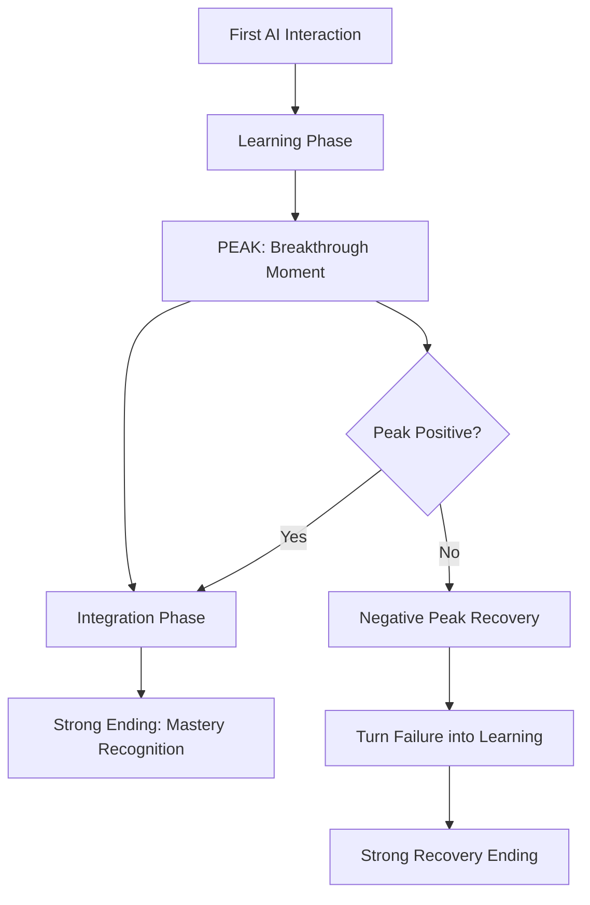

# 🏔️ Peak-End Rule

> **Core Insight**: People judge experiences based on their peak moment and how they end - design AI interactions for memorable peaks and strong endings.

---

## **🔬 What It Is**

The **Peak-End Rule** is a psychological principle discovered by Nobel laureate Daniel Kahneman. It states that people judge experiences largely based on:

- **🔺 The Peak**: The most intense moment (positive or negative)
- **🏁 The End**: How the experience concludes

Duration and other moments have surprisingly little impact on overall memory and satisfaction.

Think of it as **psychological memory compression** - your brain stores experiences as emotional highlights, not complete recordings.

---

## **🧪 The Science Behind It**

### **Psychological Foundation**
```python
# Peak-End Rule Formula
experience_memory = (peak_intensity + ending_intensity) / 2

# Duration neglect - time matters less than you think
def evaluate_experience(moments):
    peak_moment = max(moments, key=lambda x: abs(x.intensity))
    ending_moment = moments[-1]
    
    # Other moments have minimal impact on memory
    return (peak_moment.intensity + ending_moment.intensity) / 2
```

### **Key Principles**
1. **Duration Neglect**: Length of experience matters less than peak and end
2. **Affective Forecasting**: People are bad at predicting how they'll feel
3. **Memory vs Experience**: How we remember differs from how we experience
4. **Emotional Dominance**: Feelings override rational evaluation

---

## **🎯 When to Use This Model**

### **Apply When Designing:**
- ✅ **AI onboarding experiences** and first impressions
- ✅ **User workflows** where engagement matters
- ✅ **Error handling** and recovery processes
- ✅ **AI training sessions** and learning experiences

### **Critical For:**
- 🎯 **User adoption** of new AI tools
- 🎯 **Change management** during AI implementation
- 🎯 **Customer experience** with AI-powered products
- 🎯 **Team satisfaction** with AI-assisted workflows

---

## **💡 Practical Applications**

### **🚀 AI Tool Onboarding**

**❌ Poor Peak-End Design:**
```python
# Generic onboarding with weak ending
class GenericOnboarding:
    def run_onboarding(self):
        steps = [
            "Welcome to AI Tool",
            "Here are the features",
            "Please read documentation", 
            "Setup complete"  # Weak ending
        ]
        return self.run_sequential_steps(steps)
```

**✅ Optimized Peak-End Design:**
```python
class PeakEndOnboarding:
    def run_onboarding(self):
        return {
            'opening': self.create_welcoming_start(),
            'build_to_peak': self.gradual_engagement_increase(),
            'peak_moment': self.create_wow_moment(),  # 🔺 PEAK
            'smooth_transition': self.bridge_to_ending(),
            'strong_ending': self.create_empowering_finish()  # 🏁 END
        }
    
    def create_wow_moment(self):
        # Give user immediate AI-powered success
        return {
            'action': 'Generate personalized insights from their data',
            'timing': 'Within first 2 minutes',
            'emotional_impact': 'Surprise and delight',
            'value_demonstration': 'Clear benefit they couldn\'t get before'
        }
    
    def create_empowering_finish(self):
        # End with confidence and next steps
        return {
            'achievement_recognition': 'Celebrate what they accomplished',
            'future_vision': 'Show them what\'s possible next',
            'clear_next_action': 'One simple step to continue',
            'support_assurance': 'Help is always available'
        }
```

### **🔧 AI Error Handling**

**Traditional Error Handling:**
```python
def handle_ai_error():
    return "Error: AI model failed. Please try again."
```

**Peak-End Optimized Error Handling:**
```python
class PeakEndErrorHandling:
    def handle_ai_error(self, error_context):
        return {
            'immediate_response': self.acknowledge_quickly(),
            'peak_recovery': self.create_recovery_peak(),  # Turn negative peak positive
            'learning_moment': self.extract_value_from_failure(),
            'strong_ending': self.end_with_progress()
        }
    
    def create_recovery_peak(self):
        # Transform frustration into appreciation
        return {
            'personal_touch': 'AI learned from this specific case',
            'alternative_solution': 'Here\'s another way that works even better',
            'emotional_shift': 'From frustration to "wow, that\'s clever"'
        }
    
    def end_with_progress(self):
        return {
            'what_was_learned': 'Your input made the AI smarter',
            'improved_outcome': 'Next time will be even better',
            'continued_momentum': 'Ready for your next task'
        }
```

### **📊 AI Training Sessions**

**Peak-End Training Design:**
```python
class PeakEndTraining:
    def design_ai_training(self):
        return {
            'session_structure': {
                'warm_up': 'Easy wins to build confidence',
                'skill_building': 'Progressive complexity',
                'peak_moment': self.create_mastery_moment(),
                'integration': 'Apply to real work',
                'strong_ending': self.create_empowered_ending()
            }
        }
    
    def create_mastery_moment(self):
        # Peak = moment of competence breakthrough
        return {
            'challenge': 'Complex problem they couldn\'t solve before',
            'ai_assistance': 'Perfect level of support',
            'breakthrough': 'Sudden "I get it!" moment',
            'recognition': 'Immediate positive feedback'
        }
    
    def create_empowered_ending(self):
        return {
            'achievement_summary': 'What they can now do',
            'confidence_builder': 'Evidence of their growth',
            'future_roadmap': 'Clear path to continued improvement',
            'community_connection': 'How to get ongoing support'
        }
```

---

## **📈 Strategic Applications**

### **1. AI Adoption Journey Mapping**



### **2. AI Experience Design Framework**

| **Phase** | **Purpose** | **Peak-End Strategy** | **Example** |
|-----------|-------------|----------------------|-------------|
| **🚀 Onboarding** | First impressions | Early wow moment + confident ending | AI solves real problem in 5 minutes |
| **📚 Learning** | Skill building | Mastery breakthrough + capability recognition | Successfully complete complex task |
| **🔧 Daily Use** | Workflow integration | Efficiency peak + accomplishment ending | Save 2 hours, feel productive |
| **🔄 Error Recovery** | Problem resolution | Solution discovery + stronger confidence | Learn new capability from failure |

### **3. Team Change Management**

**Managing AI Implementation:**
```python
class ChangeManagementPeakEnd:
    def manage_ai_transition(self, team):
        return {
            'announcement_phase': {
                'avoid': 'Fear-inducing peak',
                'create': 'Excitement about possibilities'
            },
            'training_phase': {
                'peak_design': 'Each person has breakthrough moment',
                'ending_design': 'Confidence in new capabilities'
            },
            'rollout_phase': {
                'peak_management': 'Early wins and quick value',
                'ending_celebration': 'Recognize transformation success'
            }
        }
```

---

## **🔧 Advanced Strategies**

### **1. Dynamic Peak Creation**

```python
class DynamicPeakCreator:
    def __init__(self):
        self.user_profiles = {}
        self.peak_history = {}
    
    def create_personalized_peak(self, user_id, context):
        user_preferences = self.user_profiles[user_id]
        previous_peaks = self.peak_history.get(user_id, [])
        
        # Avoid peak habituation
        if self.peak_is_getting_stale(previous_peaks):
            return self.create_novel_peak(user_preferences)
        else:
            return self.amplify_successful_peak_pattern(previous_peaks)
    
    def peak_is_getting_stale(self, peaks):
        # Check for declining emotional response
        recent_peaks = peaks[-5:]  # Last 5 peaks
        return all(p.emotional_impact < 0.7 for p in recent_peaks)
```

### **2. Ending Optimization Engine**

```python
class EndingOptimizer:
    def optimize_ending(self, session_data):
        ending_strategies = {
            'achievement_ending': self.create_accomplishment_summary,
            'progress_ending': self.show_forward_momentum,
            'connection_ending': self.strengthen_relationship,
            'anticipation_ending': self.build_excitement_for_next
        }
        
        # Choose based on session context
        best_strategy = self.select_ending_strategy(session_data)
        return ending_strategies[best_strategy](session_data)
    
    def create_accomplishment_summary(self, session_data):
        return {
            'what_achieved': self.extract_concrete_outcomes(session_data),
            'capability_growth': self.highlight_skill_development(session_data),
            'value_created': self.quantify_impact(session_data)
        }
```

### **3. Peak-End Analytics**

```python
class PeakEndAnalytics:
    def measure_experience_quality(self, user_sessions):
        metrics = {}
        
        for session in user_sessions:
            peak_moment = self.identify_peak(session)
            ending_moment = self.extract_ending(session)
            
            metrics[session.id] = {
                'peak_intensity': peak_moment.emotional_score,
                'peak_valence': peak_moment.positive_negative,
                'ending_satisfaction': ending_moment.satisfaction_score,
                'overall_memory': self.calculate_peak_end_score(peak_moment, ending_moment),
                'likelihood_to_return': self.predict_return_probability(metrics)
            }
        
        return self.aggregate_insights(metrics)
```

---

## **⚠️ Common Pitfalls**

### **🚫 Peak Design Traps**
- **Artificial Peaks**: Creating fake excitement that feels manipulative
- **Peak Inflation**: Making every moment intense (leads to emotional exhaustion)
- **Wrong Peak Timing**: Placing peak too early or too late in experience

### **🚫 Ending Traps**
- **Weak Endings**: Fading out instead of finishing strong
- **Cliffhanger Abuse**: Leaving people hanging when closure is needed
- **Rushed Endings**: Not giving sufficient time for emotional processing

### **🚫 Integration Traps**
- **Peak-End Tunnel Vision**: Ignoring the journey between peak and end
- **One-Size-Fits-All**: Not personalizing peaks for different users
- **Memory vs Reality**: Optimizing for memory at expense of actual experience

---

## **📊 How to Measure Success**

### **Peak-End Experience Metrics**
```python
peak_end_metrics = {
    'peak_identification': {
        'emotional_intensity': 'Highest emotional response in session',
        'surprise_factor': 'Unexpected positive moments',
        'breakthrough_moments': 'Learning or capability breakthroughs'
    },
    'ending_evaluation': {
        'satisfaction_score': 'How users feel at conclusion',
        'confidence_level': 'Belief in ability to succeed',
        'anticipation_for_next': 'Excitement about future interactions'
    },
    'overall_memory': {
        'experience_rating': 'Retrospective evaluation of session',
        'recommendation_likelihood': 'Would they recommend to others',
        'return_probability': 'Likelihood to use again'
    }
}
```

### **Behavioral Validation**
```python
def validate_peak_end_effectiveness():
    return {
        'retention_analysis': 'Do users come back after peak-end experiences?',
        'engagement_depth': 'Do they use advanced features after positive peaks?',
        'word_of_mouth': 'Do they share positive experiences?',
        'learning_transfer': 'Do they apply skills in new contexts?'
    }
```

---

## **🎯 Key Takeaways**

### **🎭 Mental Model in Action**
1. **🔺 Design for Peaks**: Create memorable moments of delight, success, or breakthrough
2. **🏁 Finish Strong**: Always end with positive momentum and clear value
3. **⏱️ Duration is Overrated**: Focus on emotional intensity over length
4. **🧠 Memory ≠ Experience**: Optimize for how people will remember, not just how they feel in the moment

### **🔄 Integration Points**
- **Enhances [Flow State Optimization](./flow-state-optimization.md)**: Peak moments often occur during flow
- **Supports [Cognitive Load Theory](./cognitive-load-theory.md)**: Manage cognitive peaks and endings
- **Amplifies [Network Effects](./network-effects.md)**: Positive peaks drive sharing and adoption

### **💡 Remember**
> *"People will forget what you said, people will forget what you did, but people will never forget how you made them feel. In AI experiences, make them feel capable, successful, and excited about what's possible."*

**Every AI interaction is an opportunity to create a positive peak and end on a high note. These moments determine whether people embrace or abandon AI tools.**
