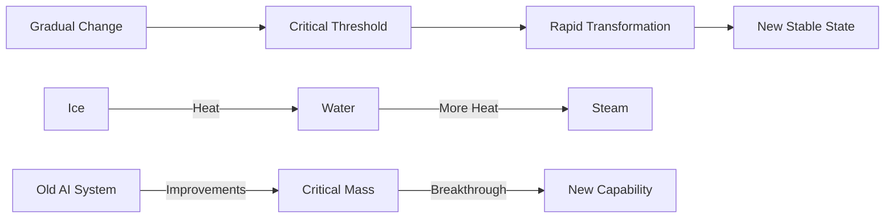
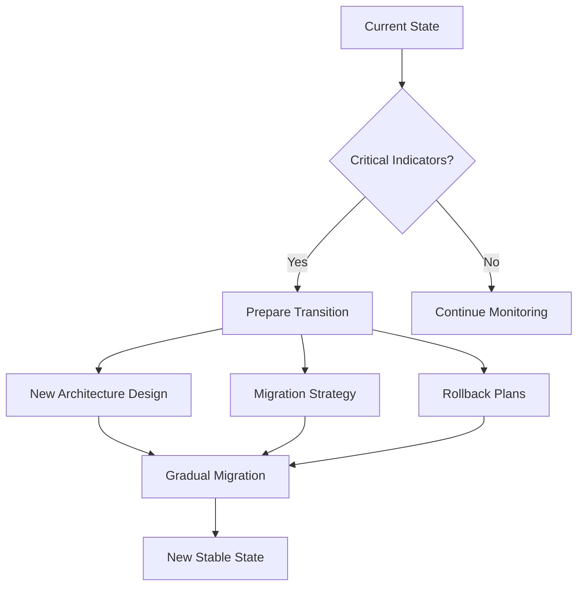
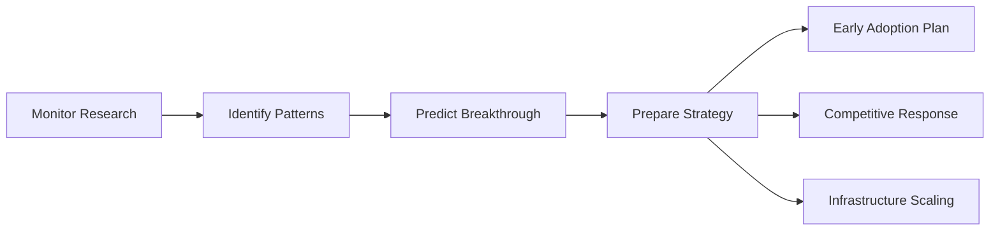
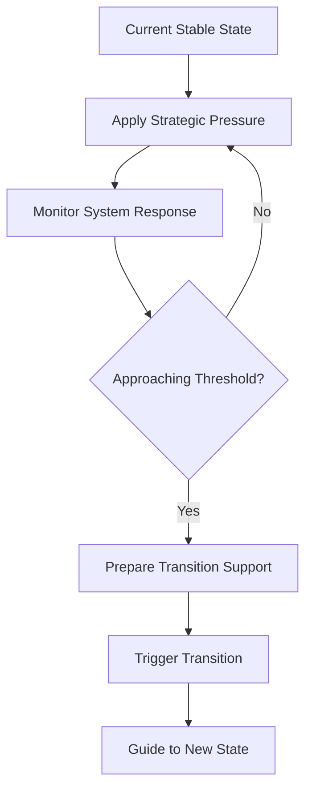

# 🔄 Phase Transitions

> **Recognize and navigate critical transformation moments in AI systems and organizations**

## 🎯 **What It Is**

Phase Transitions is a mental model borrowed from physics that helps you understand and navigate critical moments when AI systems, teams, or markets undergo fundamental state changes - like how water suddenly transforms from liquid to steam with just a small temperature increase.

**Core Insight**: Small changes can trigger massive transformations when systems reach critical thresholds, and recognizing these transition points allows you to either prepare for them or strategically trigger them.

## ⚡ **The Physics Behind It**



**Key Concepts:**
- **Critical Point**: The threshold where transformation becomes inevitable
- **Hysteresis**: Systems resist change until threshold, then change rapidly
- **Metastable States**: Temporary stability before major transitions
- **Nucleation**: Small trigger events that initiate large changes

## 🎯 **When to Use**

### **🚀 System Scaling Decisions**
- Recognizing when current architecture will break
- Planning for exponential growth phases
- Preparing for capability breakthroughs

### **📈 Organizational Transformation**
- Timing major cultural shifts toward AI adoption
- Navigating team structure changes
- Managing technology transition periods

### **🔧 Technology Evolution**
- Predicting when AI capabilities will leap forward
- Planning for paradigm shifts in your field
- Identifying inflection points in user adoption

## 🚀 **Practical Applications**

### **Example: AI System Scalability**

**🔍 Recognizing Scale Transition Points:**

**Pre-Transition Indicators:**
```python
def check_scaling_indicators():
    response_time_degradation = monitor_latency_trends()
    error_rate_increases = track_system_errors()
    resource_utilization = measure_infrastructure_load()
    user_growth_velocity = analyze_adoption_curve()
    
    if all([response_time_degradation > threshold,
            error_rate_increases > acceptable,
            resource_utilization > 80%,
            user_growth_velocity == "exponential"]):
        return "Approaching Critical Scaling Transition"
```

**Transition Planning:**


**Implementation Strategy:**
1. **Early Warning System**: Monitor leading indicators
2. **Transition Preparation**: Design new architecture before crisis
3. **Staged Migration**: Controlled transition to avoid disruption
4. **New Equilibrium**: Establish stability at higher scale

### **Example: Team AI Adoption**

**🔍 Organizational Phase Transitions:**

**Stage 1: Resistance (Solid State)**
- Teams stick to familiar tools and processes
- High energy required for any AI adoption
- Change feels forced and unnatural

**Stage 2: Experimentation (Liquid State)**
- Some team members begin exploring AI tools
- Mixed results create uncertainty
- System becomes more flexible but unstable

**Stage 3: Integration (Gas State)**
- AI becomes natural part of workflow
- Rapid expansion of AI use cases
- New capabilities emerge organically

**Transition Management:**
```python
def manage_adoption_transition():
    current_phase = assess_team_ai_readiness()
    
    if current_phase == "resistance":
        # Add energy gradually
        provide_safe_experimentation_spaces()
        showcase_relevant_success_stories()
        reduce_adoption_barriers()
        
    elif current_phase == "experimentation":
        # Support during unstable period
        provide_training_and_support()
        establish_best_practices()
        celebrate_early_wins()
        
    elif current_phase == "integration":
        # Establish new equilibrium
        formalize_ai_workflows()
        scale_successful_patterns()
        prepare_for_next_transition()
```

### **Example: AI Capability Breakthrough**

**🔍 Recognizing Capability Phase Transitions:**

**Pre-Breakthrough Indicators:**
- Incremental improvements accelerating
- Multiple research groups reaching similar results
- Fundamental bottlenecks being addressed
- Computing power reaching critical thresholds

**Strategic Response:**


## 🔄 **Common Transition Patterns**

### **🏗️ Architecture Phase Transitions**

**Pattern Recognition:**
```
Monolith → Microservices → Serverless → AI-Native
```

**Transition Triggers:**
- **Complexity Threshold**: Monolith becomes unmaintainable
- **Scale Threshold**: Traffic exceeds single-server capacity
- **Speed Threshold**: Development velocity slows due to coupling
- **Intelligence Threshold**: Logic becomes too complex for rules

### **📈 Growth Phase Transitions**

**User Adoption Phases:**
```
Early Adopters → Early Majority → Late Majority → Laggards
```

**Transition Characteristics:**
- **Early → Majority**: Crossing the "chasm" requires different value propositions
- **Majority → Laggards**: Focus shifts from features to reliability
- **Each Phase**: Requires different marketing, support, and product strategies

### **🧠 AI Capability Transitions**

**Model Evolution Pattern:**
```
Rule-Based → Machine Learning → Deep Learning → Transformer → ?
```

**Capability Jumps:**
- **Recognition**: Image classification breakthrough (2012)
- **Generation**: Language model breakthrough (2017-2020)
- **Reasoning**: Next breakthrough area (2024+)

## 🎯 **Strategic Applications**

### **Transition Timing Strategy**

**🔍 When to Act:**

**Before Transition:**
- **Prepare Infrastructure**: Build capacity for new phase
- **Develop Capabilities**: Train teams for new requirements
- **Strategic Positioning**: Position for post-transition advantage

**During Transition:**
- **Navigate Instability**: Manage uncertainty and rapid change
- **Capture Opportunities**: Exploit temporary competitive advantages
- **Prevent Failures**: Avoid common transition pitfalls

**After Transition:**
- **Establish New Norms**: Create stability in new phase
- **Optimize Operations**: Maximize efficiency in new state
- **Prepare for Next**: Monitor for next transition signals

### **Portfolio Transition Management**

**Different Timescales:**
- **Technical Transitions**: Months to years (architecture, tools)
- **Organizational Transitions**: Years (culture, processes)
- **Market Transitions**: Years to decades (industry paradigms)

**Balanced Approach:**
```python
def manage_transition_portfolio():
    short_term = prepare_technical_transitions()  # 6-18 months
    medium_term = guide_org_transitions()         # 1-3 years
    long_term = position_for_paradigm_shifts()   # 3-10 years
    
    return balance_portfolio(short_term, medium_term, long_term)
```

## 💡 **Advanced Strategies**

### **Triggered Phase Transitions**

**Creating Controlled Transitions:**


**Examples:**
- **Team Adoption**: Introduce AI tools during natural workflow changes
- **System Upgrades**: Plan major transitions during low-traffic periods
- **Market Entry**: Time product launches with industry inflection points

### **Transition Amplifiers**

**Factors that Accelerate Transitions:**
- **Network Effects**: Each adopter makes adoption easier for others
- **Switching Costs**: Lower barriers accelerate transitions
- **External Pressure**: Market forces or competitive threats
- **Champion Networks**: Early adopters who influence others

### **Transition Dampeners**

**Factors that Slow Transitions:**
- **Legacy Investments**: Sunk costs in current systems
- **Learning Curves**: High cost of acquiring new capabilities
- **Cultural Resistance**: Organizational inertia
- **Technical Debt**: Complexity of current systems

## ⚠️ **Transition Pitfalls**

### **The Transition Trap**
- **Problem**: Getting stuck in unstable transition state
- **Causes**: Insufficient commitment, poor planning, resistance management
- **Solution**: Clear transition milestones and sufficient resource allocation

### **Premature Transition**
- **Problem**: Attempting transition before critical mass
- **Causes**: Impatience, external pressure, poor threshold recognition
- **Solution**: Better indicator monitoring and patience for right timing

### **Transition Shock**
- **Problem**: System disruption during transition
- **Causes**: Too rapid change, insufficient preparation
- **Solution**: Gradual transition with overlap periods and fallback plans

### **Missing the Window**
- **Problem**: Failing to act during optimal transition period
- **Causes**: Analysis paralysis, resource constraints, poor recognition
- **Solution**: Pre-planned trigger criteria and rapid response capabilities

## 📊 **Measuring Transition Success**

### **Leading Indicators**
- **Pressure Building**: Stress indicators in current system
- **Threshold Proximity**: How close to critical point
- **Readiness Factors**: Preparation completeness

### **Transition Indicators**
- **Change Velocity**: Rate of transformation
- **Stability Metrics**: System resilience during change
- **Adoption Rates**: User/team acceptance of new state

### **Lagging Indicators**
- **New State Performance**: Efficiency in post-transition state
- **User Satisfaction**: Acceptance of new system/process
- **Competitive Position**: Market advantage from transition

### **Measurement Framework**
```python
def assess_transition_health():
    preparation_score = measure_readiness()
    timing_score = assess_market_conditions()
    execution_score = track_transition_progress()
    outcome_score = evaluate_new_state_performance()
    
    return {
        "overall_success": weighted_average([
            preparation_score * 0.3,
            timing_score * 0.2,
            execution_score * 0.3,
            outcome_score * 0.2
        ]),
        "lessons_learned": document_insights()
    }
```

## 🎯 **Implementation Guide**

### **🔍 Phase 1: Recognition**
- [ ] Map current system states and performance metrics
- [ ] Identify potential transition triggers and thresholds
- [ ] Establish monitoring systems for leading indicators
- [ ] Study similar transitions in your industry/domain

### **🚀 Phase 2: Preparation**
- [ ] Design target state architecture/processes
- [ ] Build transition capabilities and resources
- [ ] Create transition timeline and milestones
- [ ] Develop risk mitigation and rollback plans

### **🔄 Phase 3: Execution**
- [ ] Monitor threshold indicators closely
- [ ] Execute transition plan with careful timing
- [ ] Manage stakeholder communication during instability
- [ ] Adjust plan based on real-time feedback

### **📊 Phase 4: Stabilization**
- [ ] Establish new operating procedures
- [ ] Optimize performance in new state
- [ ] Document lessons learned
- [ ] Begin monitoring for next transition

## 💡 **Key Takeaways**

- **Phase transitions are inevitable in growing AI systems - prepare for them rather than being surprised**
- **Small changes can trigger massive transformations when critical thresholds are reached**
- **The transition period is often unstable - plan for temporary disruption**
- **Early recognition of transition signals provides strategic advantage**
- **Different types of transitions operate on different timescales**
- **Success requires balancing preparation, timing, execution, and stabilization**

---

**🔗 Related Mental Models:**
- [Resonance Principle](./resonance-principle.md) - Timing interventions for maximum impact
- [Compound Growth](./compound-growth.md) - How changes accelerate over time
- [Market Timing Framework](./market-timing-framework.md) - Strategic timing decisions
- [Emergence Principle](./emergence-principle.md) - How new properties emerge from transitions

**📚 Further Reading:**
- Physics of phase transitions and critical phenomena
- Organizational change management
- Technology adoption lifecycle theory
- Systems thinking and state transitions
