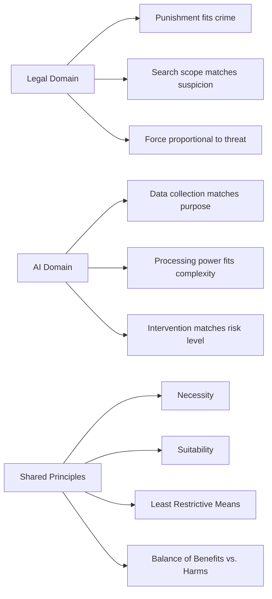
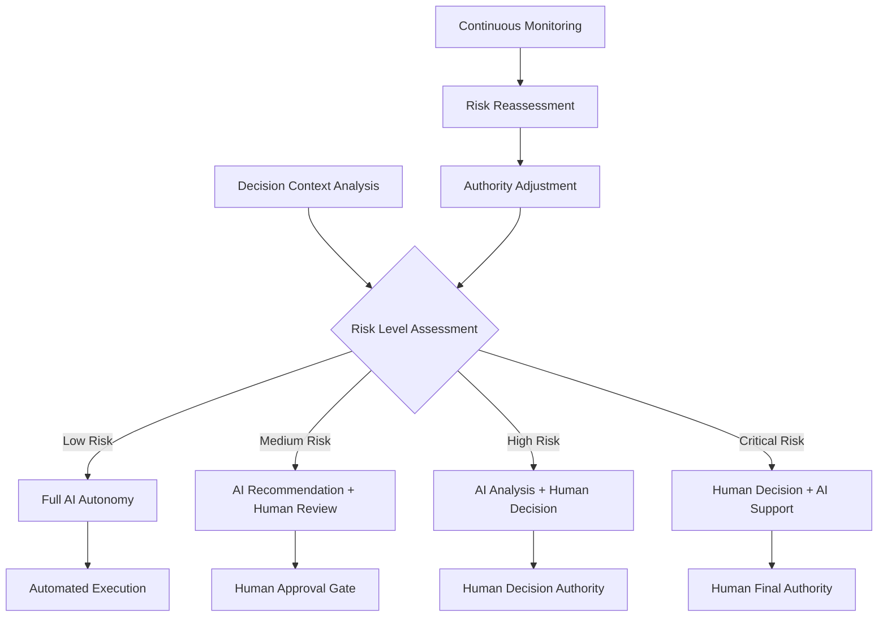

# ⚖️ Principle of Proportionality

> **Balance AI interventions with their impact by ensuring responses are appropriate, measured, and ethically justified relative to circumstances**

## 🎯 **What It Is**

The Principle of Proportionality is a fundamental ethical and legal framework requiring that actions, especially those involving risks, costs, or restrictions, be balanced and appropriate relative to their intended benefits and the circumstances at hand. In AI development, this principle guides responsible deployment, risk management, and ensures that AI interventions are neither excessive nor insufficient for their intended purpose.

**Core Insight**: The most effective and ethical AI systems are those that calibrate their responses, data collection, processing intensity, and user impact to match the actual needs and risks of each situation, avoiding both under-response and over-response.

## ⚖️ **The Legal and Ethical Foundation**

### **Proportionality Across Domains**


**Core Components:**
- **Necessity**: The intervention must be needed to achieve the legitimate aim
- **Suitability**: The means must be capable of achieving the desired objective
- **Least Restrictive Means**: Choose the approach that minimizes negative impact while achieving goals
- **Balance Test**: Benefits must outweigh harms, considering all stakeholders
- **Temporal Appropriateness**: Response timing should match urgency and context

## 🎯 **When to Use**

### **🛡️ AI Risk Management**
- Designing AI safety measures and safeguards for different risk levels
- Determining appropriate levels of human oversight for AI systems
- Calibrating AI decision-making authority based on potential impact
- Setting data collection and privacy protection standards

### **⚖️ Ethical AI Decision-Making**
- Balancing AI performance optimization with fairness considerations
- Determining appropriate levels of AI transparency and explainability
- Designing user consent and control mechanisms
- Managing trade-offs between automation and human agency

### **🏢 Organizational AI Governance**
- Setting AI governance policies proportional to organizational size and risk
- Determining resource allocation for AI projects based on expected impact
- Designing AI audit and compliance processes appropriate to system criticality
- Establishing AI incident response procedures scaled to potential harm

## 🔄 **The Four-Stage Proportionality Assessment**

### **1️⃣ Legitimate Aim Identification**
```
Definition: Clearly establish the valid purpose that justifies AI intervention

Assessment Questions:
• What specific problem is the AI system trying to solve?
• Is this problem significant enough to warrant AI intervention?
• Are there legitimate business, social, or technical reasons for this approach?
• Do stakeholders agree this aim is worth pursuing?

AI Application Examples:
• Healthcare AI: Improve diagnostic accuracy and patient outcomes
• Financial AI: Detect fraud while maintaining customer privacy
• Hiring AI: Reduce bias and increase efficiency in candidate evaluation
• Autonomous Systems: Enhance safety while preserving human autonomy

Validation Criteria:
• Problem significance: Is the issue meaningful and impactful?
• Stakeholder alignment: Do affected parties support this goal?
• Legal compliance: Does the aim align with applicable laws and regulations?
• Ethical justification: Is pursuing this goal morally defensible?

Example - Content Moderation AI:
Legitimate Aim: "Protect users from harmful content while preserving free expression"

Justification Analysis:
✓ Significant problem: Harmful content causes real psychological and social damage
✓ Stakeholder support: Users want protection, society benefits from reduced harm
✓ Legal alignment: Complies with platform liability and safety requirements
✓ Ethical foundation: Balances individual expression with collective wellbeing
```

### **2️⃣ Necessity Evaluation**
```
Definition: Determine if AI intervention is actually required to achieve the legitimate aim

Assessment Framework:
• Alternative Solutions: What non-AI approaches could address this problem?
• Intervention Threshold: At what point does the problem require AI intervention?
• Comparative Effectiveness: How does AI compare to alternative approaches?
• Unique Capabilities: What can AI do that other solutions cannot?

Necessity Tests:
• Problem Persistence: Has the problem persisted despite other interventions?
• Scale Requirements: Is the problem too large for manual or simple automated solutions?
• Complexity Demands: Does the problem require AI's pattern recognition or prediction capabilities?
• Efficiency Needs: Are there time or resource constraints that favor AI?

Example - Fraud Detection AI:
Necessity Assessment:
✓ Manual review insufficient: Transaction volume exceeds human capacity
✓ Rule-based systems inadequate: Fraudsters adapt faster than rule updates
✓ Pattern complexity: Fraud patterns too complex for simple algorithms
✓ Time sensitivity: Real-time detection impossible without AI automation

Alternative Analysis:
❌ Human-only approach: Too slow and expensive for transaction volume
❌ Simple rules: Easily circumvented and generate high false positives  
❌ Statistical models: Cannot adapt to evolving fraud patterns
✓ AI system: Provides necessary speed, adaptability, and pattern recognition
```

### **3️⃣ Suitability Assessment**
```
Definition: Evaluate whether the chosen AI approach is actually capable of achieving the legitimate aim

Suitability Dimensions:
• Technical Capability: Can the AI system perform the required functions?
• Performance Standards: Does the AI meet accuracy and reliability requirements?
• Environmental Fit: Will the AI work effectively in the intended context?
• Scalability: Can the system handle the required volume and complexity?

Assessment Methods:
• Proof of Concept: Small-scale testing to validate core functionality
• Pilot Programs: Limited deployment to test real-world effectiveness
• Benchmark Comparison: Performance against established standards
• Expert Evaluation: Technical review by qualified specialists

Example - Medical Diagnosis AI:
Suitability Evaluation:
• Diagnostic Accuracy: 95%+ accuracy on validated medical datasets
• Clinical Integration: Compatible with existing hospital information systems
• User Acceptance: Physicians find recommendations helpful and trustworthy
• Regulatory Approval: Meets FDA requirements for medical AI devices

Capability Verification:
✓ Technical: AI demonstrates superior performance to existing diagnostic tools
✓ Practical: System integrates smoothly into clinical workflow
✓ Professional: Medical staff can effectively use and interpret AI outputs
✓ Regulatory: Meets all applicable safety and efficacy standards
```

### **4️⃣ Least Restrictive Means Analysis**
```
Definition: Choose the AI approach that minimizes negative impact while still achieving the legitimate aim

Impact Minimization Strategies:
• Data Minimization: Collect only data necessary for the AI's function
• Processing Limitations: Use least invasive algorithms that meet requirements
• Human Oversight: Maintain appropriate human control and intervention capability
• User Agency: Preserve maximum user choice and control over AI interactions

Comparative Analysis Framework:
• Option 1: Minimal AI involvement with human oversight
• Option 2: Moderate AI automation with human review
• Option 3: High AI automation with human exception handling
• Option 4: Full AI automation with human audit

Selection Criteria:
• Effectiveness: Which option best achieves the legitimate aim?
• Impact: Which option minimizes negative consequences for stakeholders?
• Efficiency: Which option provides best balance of effectiveness and resource use?
• Adaptability: Which option can evolve with changing needs and contexts?

Example - Hiring AI System:
Least Restrictive Means Comparison:

Option 1 - AI Screening Tool:
• AI pre-screens resumes to identify qualified candidates
• Humans make all final hiring decisions
• Impact: Minimal on candidate experience, preserves human judgment
• Effectiveness: Moderate improvement in efficiency

Option 2 - AI Interview Analysis:
• AI analyzes video interviews for communication skills
• Humans consider AI input alongside other factors
• Impact: More intrusive, may affect candidate behavior
• Effectiveness: Higher accuracy in skill assessment

Option 3 - AI Hiring Recommendations:
• AI provides ranked candidate recommendations
• Humans can override but typically follow recommendations
• Impact: Significant influence on hiring outcomes
• Effectiveness: High efficiency and consistency

Selection: Option 1 chosen as least restrictive means that still achieves efficiency goals
```

## 🛠️ **Practical Implementation Framework**

### **🎯 Proportionality Decision Matrix**

**Risk-Response Calibration:**
```python
class ProportionalityMatrix:
    def __init__(self):
        self.risk_levels = ["low", "medium", "high", "critical"]
        self.response_intensities = ["minimal", "moderate", "substantial", "maximum"]
        self.proportionality_matrix = self.build_matrix()
    
    def build_matrix(self):
        matrix = {
            "low_risk": {
                "appropriate_response": "minimal",
                "data_collection": "only essential data",
                "human_oversight": "periodic review",
                "user_control": "full user autonomy",
                "transparency": "basic explanation",
                "examples": ["content recommendations", "search optimization"]
            },
            
            "medium_risk": {
                "appropriate_response": "moderate", 
                "data_collection": "necessary data with consent",
                "human_oversight": "regular monitoring",
                "user_control": "user can override decisions",
                "transparency": "clear explanation available",
                "examples": ["credit scoring", "job candidate screening"]
            },
            
            "high_risk": {
                "appropriate_response": "substantial",
                "data_collection": "comprehensive with strict governance",
                "human_oversight": "continuous monitoring",
                "user_control": "human review of major decisions",
                "transparency": "detailed explanation required",
                "examples": ["medical diagnosis", "criminal justice assessment"]
            },
            
            "critical_risk": {
                "appropriate_response": "maximum",
                "data_collection": "all relevant data with full consent",
                "human_oversight": "human approval required",
                "user_control": "human final decision authority",
                "transparency": "complete transparency and auditability",
                "examples": ["life support systems", "autonomous weapons"]
            }
        }
        return matrix
    
    def assess_proportionality(self, ai_system_risk, proposed_response):
        appropriate_level = self.proportionality_matrix[ai_system_risk]["appropriate_response"]
        
        if proposed_response == appropriate_level:
            return "proportional"
        elif self.response_intensity_score(proposed_response) > self.response_intensity_score(appropriate_level):
            return "excessive - consider less restrictive approach"
        else:
            return "insufficient - increase response intensity"
    
    def recommend_adjustments(self, current_system, risk_assessment):
        current_level = self.assess_current_response_level(current_system)
        appropriate_level = self.proportionality_matrix[risk_assessment]["appropriate_response"]
        
        if current_level != appropriate_level:
            return self.generate_adjustment_plan(current_level, appropriate_level)
        else:
            return "system is appropriately calibrated"
```

### **📊 Proportionality Measurement Framework**

**Multi-Dimensional Assessment:**
```python
def measure_proportionality():
    assessment_dimensions = {
        "intervention_scope": {
            "data_collection_breadth": "How much data is collected vs. needed?",
            "processing_intensity": "How much computation vs. required complexity?",
            "decision_authority": "How much autonomy vs. appropriate for risk level?",
            "user_impact": "How much user experience change vs. benefit gained?"
        },
        
        "stakeholder_balance": {
            "benefit_distribution": "Are benefits fairly distributed among stakeholders?",
            "harm_distribution": "Are risks and burdens appropriately allocated?",
            "voice_representation": "Do all affected parties have appropriate input?",
            "power_balance": "Is decision-making authority appropriately distributed?"
        },
        
        "temporal_appropriateness": {
            "response_speed": "How quickly should AI respond to different situations?",
            "intervention_duration": "How long should AI interventions last?",
            "review_frequency": "How often should proportionality be reassessed?",
            "adaptation_rate": "How quickly should AI adjust to changing contexts?"
        },
        
        "contextual_sensitivity": {
            "cultural_appropriateness": "Does response fit cultural context?",
            "legal_compliance": "Does intervention meet jurisdictional requirements?",
            "domain_specificity": "Is response appropriate for industry/domain?",
            "individual_variation": "Does system account for individual differences?"
        }
    }
    return assessment_dimensions
```

## 📈 **Advanced Applications in AI Development**

### **🤖 Contextual AI Response Calibration**

**Dynamic Proportionality Adjustment:**
```python
class ContextualProportionalityEngine:
    def __init__(self):
        self.context_factors = self.define_context_factors()
        self.response_levels = self.define_response_levels()
        self.calibration_rules = self.build_calibration_rules()
    
    def define_context_factors(self):
        factors = {
            "urgency": {
                "emergency": 1.0,
                "urgent": 0.7,
                "normal": 0.4,
                "routine": 0.1
            },
            
            "impact_potential": {
                "life_threatening": 1.0,
                "major_harm": 0.8,
                "moderate_impact": 0.5,
                "minor_effect": 0.2
            },
            
            "uncertainty_level": {
                "high_confidence": 0.1,
                "moderate_confidence": 0.4,
                "low_confidence": 0.7,
                "very_uncertain": 1.0
            },
            
            "stakeholder_sensitivity": {
                "vulnerable_population": 1.0,
                "public_facing": 0.7,
                "internal_users": 0.4,
                "technical_users": 0.2
            }
        }
        return factors
    
    def calculate_proportional_response(self, context):
        # Weighted combination of context factors
        urgency_weight = self.context_factors["urgency"][context["urgency"]]
        impact_weight = self.context_factors["impact_potential"][context["impact"]]
        uncertainty_weight = self.context_factors["uncertainty_level"][context["uncertainty"]]
        stakeholder_weight = self.context_factors["stakeholder_sensitivity"][context["stakeholders"]]
        
        # Calculate proportionality score (0-1 scale)
        proportionality_score = (
            urgency_weight * 0.3 +
            impact_weight * 0.4 +
            uncertainty_weight * 0.2 +
            stakeholder_weight * 0.1
        )
        
        return self.map_score_to_response_level(proportionality_score)
    
    def map_score_to_response_level(self, score):
        if score >= 0.8:
            return "maximum_intervention"
        elif score >= 0.6:
            return "high_intervention"
        elif score >= 0.4:
            return "moderate_intervention"
        elif score >= 0.2:
            return "low_intervention"
        else:
            return "minimal_intervention"
```

### **🔒 Privacy-Proportionate Data Handling**

**Graduated Data Protection:**
```python
def implement_proportionate_privacy():
    privacy_framework = {
        "data_collection_tiers": {
            "tier_1_minimal": {
                "data_types": ["basic demographics", "explicit preferences"],
                "use_cases": ["simple personalization", "basic recommendations"],
                "protection_level": "standard encryption, user control",
                "retention": "limited to active use period"
            },
            
            "tier_2_moderate": {
                "data_types": ["behavioral data", "interaction patterns"],
                "use_cases": ["improved recommendations", "pattern analysis"],
                "protection_level": "advanced encryption, audit logs",
                "retention": "defined retention period with user notification"
            },
            
            "tier_3_extensive": {
                "data_types": ["sensitive personal data", "biometric data"],
                "use_cases": ["critical safety functions", "medical applications"],
                "protection_level": "maximum security, differential privacy",
                "retention": "strictly limited, strong anonymization"
            }
        },
        
        "proportionality_matching": {
            "low_benefit_applications": "tier_1_minimal",
            "moderate_benefit_applications": "tier_2_moderate", 
            "high_benefit_applications": "tier_3_extensive"
        },
        
        "dynamic_adjustment": {
            "user_preference_override": "Users can choose higher privacy level",
            "risk_escalation": "Automatically increase protection if risks emerge",
            "benefit_reassessment": "Regular review of data collection justification",
            "consent_renewal": "Periodic reconfirmation of data use permissions"
        }
    }
    return privacy_framework
```

### **⚖️ Algorithmic Decision Proportionality**

**Risk-Calibrated AI Authority:**


**Implementation Framework:**
```python
def design_proportionate_ai_authority():
    authority_framework = {
        "decision_categories": {
            "routine_operations": {
                "ai_authority": "full_autonomy",
                "human_involvement": "exception_handling_only",
                "examples": ["inventory_restocking", "basic_customer_routing"],
                "justification": "low_risk_high_volume_decisions"
            },
            
            "significant_business": {
                "ai_authority": "recommendation_with_approval",
                "human_involvement": "review_and_approve",
                "examples": ["pricing_adjustments", "staff_scheduling"],
                "justification": "moderate_impact_business_decisions"
            },
            
            "customer_impacting": {
                "ai_authority": "analysis_and_options",
                "human_involvement": "decision_making",
                "examples": ["customer_service_escalation", "account_modifications"],
                "justification": "direct_customer_relationship_impact"
            },
            
            "strategic_decisions": {
                "ai_authority": "information_support_only",
                "human_involvement": "full_decision_authority",
                "examples": ["product_strategy", "major_investments"],
                "justification": "high_stakes_organizational_direction"
            }
        },
        
        "authority_adjustment_triggers": {
            "performance_degradation": "reduce_ai_authority",
            "exceptional_circumstances": "escalate_to_human",
            "stakeholder_concerns": "increase_human_oversight",
            "regulatory_changes": "compliance_driven_adjustment"
        }
    }
    return authority_framework
```

## 🚨 **Common Proportionality Failures and Solutions**

### **❌ Anti-Patterns in AI Proportionality**

**1. Disproportionate Data Collection**
```
❌ Problem: Collecting extensive personal data for simple AI functions
Example: Requiring full profile data for basic content recommendations

Impact:
• Privacy invasion exceeds benefit
• Regulatory compliance risks
• User trust erosion
• Unnecessary security vulnerabilities

✅ Solution: Data minimization with purpose limitation
Implementation:
• Map data needs to specific AI functions
• Implement granular consent mechanisms  
• Use synthetic or aggregated data where possible
• Regular data necessity audits

Example Fix:
• Old: Collect demographic, behavioral, social data for simple recommendations
• New: Use only viewing history and explicit preferences for content suggestions
```

**2. Excessive AI Automation**
```
❌ Problem: Removing human oversight from high-stakes decisions
Example: Fully automated hiring decisions for senior positions

Impact:
• Inappropriate risk assumption
• Lack of accountability
• Potential discrimination amplification
• Stakeholder resistance and distrust

✅ Solution: Risk-calibrated human involvement
Implementation:
• Map decision stakes to appropriate oversight levels
• Maintain human review for consequential decisions
• Implement human override capabilities
• Regular authority level reassessment

Example Fix:
• Old: AI makes final hiring decisions automatically
• New: AI provides ranked candidates, humans make final selections with AI insights
```

**3. Over-Restrictive AI Safeguards**
```
❌ Problem: Implementing excessive controls that limit AI effectiveness
Example: Requiring human approval for every AI recommendation

Impact:
• Eliminates AI efficiency benefits
• Creates operational bottlenecks
• Reduces user satisfaction
• Wastes human and AI resources

✅ Solution: Graduated safeguard intensity
Implementation:
• Match safeguard intensity to actual risk level
• Use exception-based rather than universal controls
• Implement smart escalation based on confidence and impact
• Regular safeguard effectiveness review

Example Fix:
• Old: Human approval required for all AI content recommendations
• New: Automatic approval for high-confidence, low-risk recommendations; human review for uncertain or sensitive content
```

**4. Insufficient Stakeholder Consideration**
```
❌ Problem: Optimizing for single stakeholder without considering others
Example: AI system optimized solely for business efficiency ignoring user experience

Impact:
• Unbalanced stakeholder impacts
• Long-term relationship damage
• Regulatory scrutiny
• Unsustainable competitive position

✅ Solution: Multi-stakeholder proportionality assessment
Implementation:
• Map all affected stakeholder groups
• Assess impact distribution across stakeholders
• Implement balancing mechanisms
• Regular stakeholder feedback integration

Example Fix:
• Old: AI optimizes only for operational efficiency
• New: AI balances efficiency gains with user experience, employee satisfaction, and customer value
```

### **🛡️ Proportionality Governance Framework**

**Systematic Proportionality Management:**
```python
def establish_proportionality_governance():
    governance_framework = {
        "assessment_process": {
            "initial_evaluation": {
                "stakeholder_mapping": "Identify all affected parties",
                "impact_analysis": "Assess potential benefits and harms",
                "risk_categorization": "Classify system risk level",
                "proportionality_planning": "Design appropriate response measures"
            },
            
            "ongoing_monitoring": {
                "performance_tracking": "Monitor actual vs. intended impacts",
                "stakeholder_feedback": "Regular input from affected parties",
                "context_change_detection": "Identify shifts requiring reassessment",
                "proportionality_adjustment": "Modify measures based on learnings"
            }
        },
        
        "decision_authorities": {
            "technical_teams": "Implementation of proportionate technical measures",
            "product_managers": "Feature-level proportionality decisions",
            "ethics_committee": "Review of high-risk proportionality questions",
            "executive_leadership": "Strategic proportionality policy decisions"
        },
        
        "escalation_triggers": {
            "stakeholder_complaints": "User or community concerns about proportionality",
            "regulatory_attention": "Government or legal scrutiny",
            "media_coverage": "Public attention to AI system impacts",
            "internal_concerns": "Employee or partner proportionality questions"
        },
        
        "documentation_requirements": {
            "proportionality_assessments": "Formal evaluation documentation",
            "decision_rationales": "Reasoning for proportionality choices",
            "stakeholder_input": "Record of affected party consultation",
            "adjustment_history": "Changes made and reasons"
        }
    }
    return governance_framework
```

## 📊 **Measurement and Success Metrics**

### **🎯 Proportionality Quality Indicators**

**Multi-Dimensional Measurement:**
```python
def measure_proportionality_effectiveness():
    measurement_framework = {
        "balance_metrics": {
            "benefit_harm_ratio": "Quantified comparison of positive vs. negative impacts",
            "stakeholder_satisfaction": "Satisfaction scores across all affected parties",
            "resource_efficiency": "Achievement of goals with minimal resource expenditure",
            "unintended_consequences": "Frequency and severity of unexpected outcomes"
        },
        
        "appropriateness_indicators": {
            "intervention_intensity": "Match between response level and situation severity",
            "temporal_alignment": "Appropriateness of timing and duration",
            "contextual_fit": "Adaptation to cultural, legal, and domain contexts",
            "flexibility_demonstration": "Ability to adjust to changing circumstances"
        },
        
        "stakeholder_impact_assessment": {
            "impact_distribution": "How effects are spread across different groups",
            "voice_representation": "Extent to which all parties can influence decisions",
            "access_equity": "Fair access to AI benefits across populations",
            "burden_sharing": "Appropriate distribution of costs and risks"
        },
        
        "governance_effectiveness": {
            "decision_quality": "Quality of proportionality assessments and decisions",
            "process_efficiency": "Speed and effectiveness of proportionality evaluation",
            "accountability_clarity": "Clear responsibility for proportionality decisions",
            "continuous_improvement": "Learning and adaptation over time"
        }
    }
    return measurement_framework
```

### **📈 Long-Term Proportionality Tracking**

**Evolutionary Assessment:**
```python
def track_proportionality_evolution():
    tracking_system = {
        "baseline_establishment": {
            "initial_proportionality_assessment": "Starting point measurement",
            "stakeholder_baseline_satisfaction": "Initial stakeholder impact levels",
            "system_performance_baseline": "Original AI system effectiveness metrics",
            "context_documentation": "Initial environmental and regulatory context"
        },
        
        "change_monitoring": {
            "proportionality_drift_detection": "Identification of gradual misalignment",
            "context_change_tracking": "Monitoring of environmental shifts",
            "stakeholder_impact_evolution": "Changes in affected party experiences",
            "effectiveness_trajectory": "AI system performance over time"
        },
        
        "adjustment_effectiveness": {
            "intervention_success_rate": "Percentage of adjustments that improve proportionality",
            "stakeholder_response": "Reaction to proportionality modifications",
            "unintended_adjustment_effects": "Unexpected consequences of changes",
            "learning_integration": "How insights improve future decisions"
        },
        
        "predictive_indicators": {
            "early_warning_signals": "Indicators that proportionality may become problematic",
            "trend_analysis": "Patterns that suggest need for proactive adjustment",
            "scenario_planning": "Preparation for potential future proportionality challenges",
            "adaptive_capacity": "System ability to maintain proportionality under stress"
        }
    }
    return tracking_system
```

## 🔗 **Integration with Other Mental Models**

### **🧠 Complementary Frameworks**

**Synergistic Combinations:**
- **[[Cost-Benefit Analysis]]**: Quantify proportionality through systematic benefit-harm assessment
- **[[Stakeholder Analysis]]**: Identify all parties affected by proportionality decisions
- **[[Risk Assessment]]**: Calibrate AI responses to actual risk levels
- **[[Ethical Framework]]**: Apply moral reasoning to proportionality questions
- **[[Systems Thinking]]**: Consider broader system effects of proportional responses

**Integration Examples:**
```python
def integrate_proportionality_with_stakeholder_analysis():
    integrated_approach = {
        "stakeholder_identification": {
            "proportionality_perspective": "Who is affected by the intensity of AI intervention?",
            "impact_mapping": "How do different response levels affect each stakeholder?",
            "voice_weighting": "Which stakeholders should have more influence on proportionality?"
        },
        
        "proportionality_calibration": {
            "stakeholder_input": "Use stakeholder feedback to calibrate appropriate response levels",
            "impact_balancing": "Adjust AI intensity to balance stakeholder impacts",
            "trade_off_transparency": "Clearly communicate proportionality trade-offs to stakeholders"
        },
        
        "ongoing_alignment": {
            "stakeholder_feedback_loops": "Regular input on proportionality appropriateness",
            "impact_monitoring": "Track how proportionality changes affect different groups",
            "collaborative_adjustment": "Include stakeholders in proportionality refinement"
        }
    }
    return integrated_approach
```

## 🎯 **Advanced Mastery Guide**

### **📈 Skill Development Progression**

**Level 1: Basic Proportionality Awareness**
- Recognize when proportionality principles apply to AI decisions
- Identify obvious cases of over- or under-response
- Apply basic proportionality assessment to simple scenarios

**Level 2: Systematic Proportionality Application**
- Conduct formal proportionality assessments for AI systems
- Balance multiple stakeholder interests in proportionality decisions
- Design proportionate safeguards and controls

**Level 3: Advanced Proportionality Integration**
- Integrate proportionality thinking across AI development lifecycle
- Handle complex multi-dimensional proportionality challenges
- Create organizational proportionality standards and processes

**Level 4: Strategic Proportionality Leadership**
- Drive organization-wide proportionality culture and practices
- Influence industry standards for AI proportionality
- Navigate complex regulatory and ethical proportionality requirements

**Level 5: Proportionality Innovation and Teaching**
- Develop new frameworks and methods for AI proportionality
- Train others in proportionality principles and applications
- Contribute to academic and policy discussions on AI proportionality

### **🛠️ Practical Application Exercises**

**Daily Proportionality Practice:**
```python
def daily_proportionality_exercises():
    exercises = {
        "morning_assessment": {
            "ai_tool_evaluation": "Assess one AI tool you use - is its intervention level appropriate?",
            "data_collection_review": "Check if apps/services collect data proportional to their function",
            "decision_authority_check": "Evaluate if AI has appropriate authority for decisions it makes"
        },
        
        "design_thinking": {
            "stakeholder_impact_mapping": "For any AI feature, map impacts on all affected parties",
            "response_calibration": "Practice matching AI response intensity to situation severity",
            "least_restrictive_analysis": "Find ways to achieve goals with minimal negative impact"
        },
        
        "ethical_reflection": {
            "benefit_harm_balance": "Evaluate if AI benefits justify any negative impacts",
            "fairness_assessment": "Check if AI impacts are fairly distributed across groups",
            "long_term_thinking": "Consider proportionality implications over time"
        }
    }
    return exercises
```

## 🏆 **Success Stories and Case Studies**

### **Case Study 1: Healthcare AI Proportionality**

**Challenge**: Balancing AI diagnostic assistance with physician autonomy
**Proportionality Analysis**:
- **Legitimate Aim**: Improve diagnostic accuracy while maintaining physician judgment
- **Necessity**: High error rates in certain diagnoses justify AI intervention
- **Suitability**: AI demonstrates superior pattern recognition for specific conditions
- **Least Restrictive**: AI provides suggestions with confidence levels, physician makes final decisions

**Proportionate Solution**:
- AI provides diagnostic suggestions with confidence scores
- High-confidence suggestions prominently displayed
- Low-confidence suggestions marked as "consider investigating"
- Physician always retains final diagnostic authority
- AI explanations available on demand

**Results**: 30% improvement in diagnostic accuracy with maintained physician satisfaction and autonomy

### **Case Study 2: Content Moderation Proportionality**

**Challenge**: Balancing content safety with free expression
**Proportionate Approach**:
- **Risk-Based Response**: Different intervention levels for different content risks
- **Graduated Measures**: Warning labels → reduced distribution → removal → account restrictions
- **Human Review**: AI handles clear cases, humans review borderline content
- **User Appeal**: Robust process for challenging AI moderation decisions

**Outcome**: 40% reduction in harmful content with 60% fewer false positives and improved user trust

## 🚀 **Takeaways and Next Steps**

### **Key Insights**
1. **Proportionality prevents extremes** - Avoiding both under-response and over-response in AI systems
2. **Context determines appropriateness** - Same AI capability may be proportionate in one context, disproportionate in another
3. **Stakeholder balance is essential** - True proportionality considers all affected parties, not just primary users
4. **Dynamic adjustment is required** - Proportionality assessments must evolve with changing contexts and learnings

### **Implementation Roadmap**
1. **Proportionality Audit** - Assess current AI systems for proportionality alignment
2. **Framework Development** - Create organization-specific proportionality guidelines
3. **Process Integration** - Build proportionality assessment into AI development workflows
4. **Stakeholder Engagement** - Establish mechanisms for ongoing stakeholder input on proportionality
5. **Continuous Monitoring** - Implement systems to track proportionality over time

**Start Today:**
- Choose one AI system you're involved with (using or building)
- Conduct a basic four-stage proportionality assessment
- Identify one aspect that seems disproportionate (too much or too little)
- Design a more proportionate alternative approach
- Test the alternative with affected stakeholders

Remember: **The goal isn't to minimize AI intervention, but to calibrate it appropriately to the situation, ensuring that the response fits the circumstances and serves all stakeholders fairly.**
