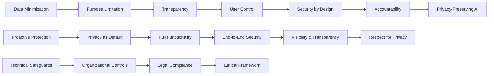

# 🔒 Privacy by Design

> **Build trust and compliance by embedding privacy protection into the DNA of your AI systems**

## 🎯 **What It Is**

Privacy by Design is a proactive framework for embedding privacy and data protection into the architecture, operation, and governance of AI systems from the earliest stages of development. Created by Dr. Ann Cavoukian, this approach transforms privacy from an afterthought compliance requirement into a foundational design principle that enhances both user trust and system robustness. In the AI era, where systems process vast amounts of personal data to deliver intelligent services, Privacy by Design becomes essential for creating ethical, legally compliant, and user-centric AI solutions that respect human dignity and autonomy.

**Core Insight**: Privacy is not a constraint on innovation—it's a design driver that creates more trustworthy, resilient, and valuable AI systems. When privacy is built in from the beginning, it becomes an invisible enabler rather than a visible barrier.

## ⚡ **The Privacy Framework**

### **Privacy by Design Architecture**


**The Seven Foundational Principles:**
- **Proactive not Reactive**: Anticipate and prevent privacy invasions before they occur
- **Privacy as the Default**: Maximum privacy protection without requiring action from the individual
- **Full Functionality**: Accommodate user needs without unnecessary trade-offs
- **End-to-End Security**: Protect data throughout its entire lifecycle
- **Visibility and Transparency**: Ensure all stakeholders can verify privacy practices
- **Respect for User Privacy**: Keep user interests paramount in all design decisions

## 🎯 **When to Use**

### **🏗️ AI System Development**
- Designing new AI services that collect or process personal data
- Building machine learning models that learn from user behavior
- Creating AI-powered analytics and recommendation systems
- Developing AI tools for sensitive domains (healthcare, finance, education)

### **📊 Data and Analytics Systems**
- Implementing data collection and processing pipelines
- Building user profiling and personalization systems
- Creating data sharing and collaboration platforms
- Designing data monetization strategies and business models

### **🌐 Enterprise AI Adoption**
- Deploying AI tools in regulated industries
- Creating AI governance and risk management frameworks
- Building cross-border AI services with varying privacy laws
- Establishing AI ethics and responsible innovation programs

## 🔐 **The Seven Principles in AI Context**

### **1️⃣ Proactive Protection in AI Systems**
```
Definition: Anticipate and prevent privacy violations before they occur in AI systems

AI-Specific Applications:
• Bias prevention: Design AI to avoid discriminatory profiling from the start
• Data drift protection: Monitor for changes that could create privacy risks
• Algorithmic transparency: Build explainability into AI decision-making
• Adversarial robustness: Protect against privacy attacks on AI models

Implementation Strategies:
• Privacy Impact Assessments (PIAs) for all AI projects
• Threat modeling for AI-specific privacy risks
• Algorithmic auditing throughout development lifecycle
• Privacy-preserving ML techniques (differential privacy, federated learning)

Example - Recommendation System:
Reactive Approach: Add privacy controls after users complain about creepy recommendations
Proactive Approach: Design recommendation algorithms that inherently respect privacy boundaries, use privacy-preserving collaborative filtering, and include user control mechanisms from day one

Privacy-First AI Design:
• Start with minimal data collection and expand only when justified
• Design AI models that work with anonymized or aggregated data when possible
• Build in consent management and user control from the beginning
• Create privacy-preserving alternatives for common AI training approaches
• Implement privacy budgets and automatic privacy protection mechanisms
```

### **2️⃣ Privacy as Default Setting**
```
Definition: Ensure maximum privacy protection is automatic, requiring no action from users

AI Default Privacy Patterns:
• Opt-in rather than opt-out for data collection and AI processing
• Minimal data processing as the starting point for AI services
• Local processing preferred over cloud-based AI when possible
• Anonymous or pseudonymous operation as the default mode

Technical Implementation:
• Privacy-preserving AI algorithms as primary choice
• Automatic data minimization in AI training and inference
• Default short data retention periods with automatic deletion
• Client-side AI processing when feasible for privacy protection

Example - AI Voice Assistant:
Poor Default: Always listening, stores all conversations, shares data with partners
Privacy Default: Local wake word detection, processes voice locally when possible, automatic deletion of audio after processing, explicit opt-in for cloud features

Default Configuration Framework:
• Data Collection Defaults: Minimal, purpose-specific, with clear user benefit
• Processing Defaults: Privacy-preserving algorithms, local computation preference
• Sharing Defaults: No sharing without explicit consent, anonymization when sharing
• Retention Defaults: Shortest period necessary for function, automatic expiration
• Access Defaults: User controls available, transparency into AI processing
```

### **3️⃣ Full Functionality with Privacy Protection**
```
Definition: Deliver complete AI functionality without compromising user privacy

Privacy-Utility Balance Strategies:
• Federated learning: Train AI models without centralizing data
• Differential privacy: Add mathematical privacy guarantees while preserving utility
• Homomorphic encryption: Compute on encrypted data without decryption
• Secure multi-party computation: Collaborate on AI without revealing individual data

Innovation Through Privacy Constraints:
• Privacy constraints often drive better algorithms and architectures
• Privacy-preserving techniques can improve AI robustness and generalization
• User trust from privacy protection increases data sharing willingness
• Privacy compliance can create competitive advantages and market differentiation

Example - Healthcare AI:
Challenge: Train accurate diagnostic AI without accessing sensitive patient data
Solution: Federated learning across hospitals, differential privacy for data analysis, homomorphic encryption for collaborative research, synthetic data generation for model training

Functionality Preservation Techniques:
• Synthetic Data Generation: Create privacy-safe training data with similar statistical properties
• Transfer Learning: Leverage public datasets to reduce private data requirements
• Adaptive Privacy: Adjust privacy protection based on data sensitivity and user preferences
• Privacy Budgets: Allocate privacy "spending" to maximize utility within privacy constraints
```

### **4️⃣ End-to-End Privacy Security**
```
Definition: Protect privacy throughout the complete AI system lifecycle and data journey

Lifecycle Privacy Protection:
• Data Collection: Minimize collection, ensure consent, protect during gathering
• Data Storage: Encryption, access controls, retention limits, secure deletion
• Data Processing: Privacy-preserving computation, audit trails, access monitoring
• Model Training: Privacy-preserving ML, secure training environments, model protection
• Model Deployment: Secure inference, output privacy, monitoring for privacy violations
• Data Sharing: Anonymization, secure transfer, recipient accountability

Technical Security Measures:
• Encryption in transit and at rest for all AI-related data
• Secure enclaves and trusted execution environments for AI processing
• Zero-knowledge proofs for AI system verification without revealing data
• Blockchain and distributed ledgers for audit trails and data provenance

Example - AI Analytics Platform:
End-to-End Protection: Encrypted data collection → secure storage → privacy-preserving analytics → differential privacy in results → secure API delivery → audit logging throughout

Security Architecture Components:
• Identity and Access Management: Role-based access, principle of least privilege
• Network Security: Secure communications, network segmentation, intrusion detection
• Application Security: Secure coding, vulnerability testing, secure AI model deployment
• Data Protection: Encryption, tokenization, secure key management, data loss prevention
• Monitoring and Auditing: Privacy violation detection, access logging, compliance reporting
```

### **5️⃣ Visibility and Transparency**
```
Definition: Make AI privacy practices visible, understandable, and verifiable

Transparency Dimensions:
• Data Practices: What data is collected, how it's used, who has access
• AI Processing: How algorithms work, what decisions they make, what factors they consider
• Privacy Controls: What options users have, how to exercise rights, how to get help
• Compliance Status: How the system meets privacy regulations and standards

User-Friendly Privacy Communication:
• Privacy dashboards showing personal data use and AI processing
• Plain language explanations of AI decision-making and data use
• Interactive privacy controls that are easy to understand and use
• Real-time notifications about privacy-relevant AI activities

Example - AI-Powered Social Platform:
Transparency Features: Personal data dashboard, AI recommendation explanations, algorithmic timeline controls, privacy audit reports, data download and deletion tools

Technical Transparency Tools:
• Privacy APIs: Programmatic access to privacy information and controls
• Algorithmic Auditing: Regular assessment and public reporting of AI fairness and privacy
• Privacy Dashboards: User interfaces showing data use, AI processing, and privacy status
• Consent Management: Granular, dynamic consent for different AI uses of personal data
• Privacy Notifications: Real-time alerts about privacy-relevant AI activities and decisions
```

### **6️⃣ Respect for User Privacy Rights**
```
Definition: Keep user interests and privacy rights paramount in all AI system design decisions

User-Centric Design Principles:
• User agency: People should control how AI uses their data
• Informed consent: Users should understand AI processing before agreeing
• Right to explanation: People should understand AI decisions affecting them
• Right to rectification: Users should be able to correct AI-processed information
• Right to erasure: People should be able to delete their data from AI systems

Privacy Rights Implementation:
• Granular consent management for different AI processing purposes
• Algorithmic transparency and explanation interfaces
• Data portability tools for moving personal data between AI services
• Right to erasure implementation that removes data from trained AI models
• Human review and appeal processes for automated AI decisions

Example - AI Employment Screening:
Rights Implementation: Transparent scoring criteria, explanation of AI decision factors, ability to challenge automated decisions, human review option, data correction mechanisms

Advanced Privacy Rights:
• Algorithmic Sovereignty: User control over which AI algorithms process their data
• Privacy Preference Learning: AI systems that learn and adapt to user privacy preferences
• Contextual Privacy: Different privacy settings for different situations and relationships
• Collective Privacy Rights: Privacy protections for groups and communities affected by AI
• Temporal Privacy Rights: Control over how past data influences future AI decisions
```

### **7️⃣ Accountability and Governance**
```
Definition: Demonstrate compliance and take responsibility for privacy protection in AI systems

Accountability Framework:
• Privacy governance structure with clear roles and responsibilities
• Regular privacy impact assessments and algorithmic audits
• Privacy by design training for AI development teams
• Privacy breach response and notification procedures
• Continuous monitoring and improvement of privacy practices

Technical Accountability Tools:
• Automated privacy compliance monitoring and reporting
• AI model governance with privacy impact tracking
• Data lineage and provenance tracking for AI training data
• Privacy-preserving audit trails and logging systems
• Algorithmic accountability through explainable AI and bias detection

Example - Enterprise AI Platform:
Accountability Measures: Chief Privacy Officer oversight, monthly privacy audits, AI ethics board review, automated compliance monitoring, public transparency reports

Governance Implementation:
• Privacy Board: Cross-functional team overseeing AI privacy practices
• Privacy Impact Assessments: Mandatory for all AI projects processing personal data
• Regular Audits: Technical and process audits of AI privacy implementations
• Training Programs: Privacy by design education for AI developers and product managers
• Incident Response: Procedures for privacy breaches and algorithmic harms
• Public Reporting: Regular transparency reports on AI privacy practices and metrics
```

## 🛠️ **Practical Implementation Framework**

### **🎯 Privacy by Design Methodology**

**The PPIA Framework (Privacy-Preserving Intelligence Architecture):**
```python
class PrivacyByDesignAI:
    def __init__(self):
        self.privacy_principles = self.define_privacy_requirements()
        self.technical_safeguards = self.establish_privacy_technologies()
        self.governance_framework = self.create_accountability_structure()
    
    def implement_privacy_by_design(self, ai_project):
        implementation_phases = {
            "requirements_analysis": self.analyze_privacy_requirements(ai_project),
            "architecture_design": self.design_privacy_architecture(ai_project),
            "technology_selection": self.select_privacy_technologies(ai_project),
            "implementation": self.implement_privacy_safeguards(ai_project),
            "testing_validation": self.validate_privacy_protection(ai_project),
            "deployment_monitoring": self.monitor_privacy_compliance(ai_project)
        }
        
        return implementation_phases
    
    def analyze_privacy_requirements(self, project):
        requirements_analysis = {
            "data_inventory": {
                "personal_data_types": "Identify all personal data categories",
                "data_sources": "Map where personal data originates",
                "data_flows": "Trace how data moves through AI system",
                "data_dependencies": "Understand what data AI needs vs. wants"
            },
            
            "stakeholder_analysis": {
                "data_subjects": "Identify people whose data is processed",
                "data_controllers": "Determine legal responsibility for data",
                "data_processors": "Map third parties handling data",
                "regulatory_authorities": "Identify relevant privacy regulators"
            },
            
            "regulatory_landscape": {
                "applicable_laws": "GDPR, CCPA, PIPEDA, sector-specific regulations",
                "compliance_requirements": "Specific obligations for AI systems",
                "cross_border_transfers": "International data transfer restrictions",
                "industry_standards": "Relevant privacy and AI standards"
            },
            
            "risk_assessment": {
                "privacy_risks": "Potential harms to individuals from AI processing",
                "business_risks": "Compliance violations, reputation damage",
                "technical_risks": "Data breaches, model inversion attacks",
                "operational_risks": "Process failures, human errors"
            }
        }
        
        return requirements_analysis
    
    def design_privacy_architecture(self, project):
        architecture_components = {
            "data_minimization_layer": {
                "collection_controls": "Minimize data collection to essential purposes",
                "processing_limits": "Restrict AI processing to necessary operations",
                "retention_policies": "Automatic deletion and anonymization",
                "purpose_binding": "Ensure data use aligns with collection purpose"
            },
            
            "privacy_preserving_computation": {
                "local_processing": "Edge AI and on-device computation",
                "federated_learning": "Distributed training without data centralization",
                "differential_privacy": "Mathematical privacy guarantees",
                "homomorphic_encryption": "Computation on encrypted data"
            },
            
            "user_control_interface": {
                "consent_management": "Granular, dynamic consent mechanisms",
                "privacy_dashboard": "User visibility into AI processing",
                "preference_controls": "User control over AI behavior",
                "rights_exercise": "Data access, correction, deletion tools"
            },
            
            "monitoring_and_audit": {
                "privacy_monitoring": "Real-time privacy violation detection",
                "compliance_tracking": "Automated regulatory compliance monitoring",
                "audit_trails": "Complete records of data and AI processing",
                "incident_response": "Privacy breach detection and response"
            }
        }
        
        return architecture_components
```

### **📊 Privacy-Preserving AI Technologies**

**Technical Implementation Strategies:**
```python
def implement_privacy_preserving_ai():
    technology_stack = {
        "federated_learning": {
            "description": "Train AI models across distributed data without centralizing it",
            "use_cases": [
                "Cross-hospital medical AI without sharing patient data",
                "Multi-bank fraud detection while preserving customer privacy",
                "Collaborative AI research without exposing proprietary datasets",
                "Personalized AI services without uploading personal data"
            ],
            "implementation": {
                "horizontal_federated": "Multiple parties with same feature space",
                "vertical_federated": "Multiple parties with same users, different features",
                "transfer_federated": "Different parties with different users and features",
                "secure_aggregation": "Cryptographic protection of model updates"
            },
            "privacy_benefits": [
                "Data never leaves original location",
                "No central data repository vulnerability",
                "Maintains data sovereignty and control",
                "Reduces data breach risk and impact"
            ]
        },
        
        "differential_privacy": {
            "description": "Add mathematical noise to provide formal privacy guarantees",
            "use_cases": [
                "Privacy-preserving analytics and reporting",
                "AI model training with privacy bounds",
                "Database queries with privacy protection",
                "A/B testing with user privacy preservation"
            ],
            "implementation": {
                "global_differential_privacy": "Privacy guarantees for entire dataset",
                "local_differential_privacy": "Privacy protection at individual level",
                "approximate_differential_privacy": "Relaxed privacy for improved utility",
                "composition_theorems": "Privacy budgets across multiple analyses"
            },
            "privacy_guarantees": [
                "Mathematically provable privacy protection",
                "Quantifiable privacy loss bounds",
                "Protection against re-identification attacks",
                "Formal privacy-utility trade-off analysis"
            ]
        },
        
        "homomorphic_encryption": {
            "description": "Perform computations on encrypted data without decryption",
            "use_cases": [
                "Cloud AI processing of encrypted personal data",
                "Privacy-preserving AI inference services",
                "Secure multi-party machine learning",
                "Encrypted data analytics and mining"
            ],
            "implementation": {
                "partially_homomorphic": "Support for either addition or multiplication",
                "somewhat_homomorphic": "Limited depth of operations",
                "fully_homomorphic": "Unlimited operations on encrypted data",
                "practical_schemes": "CKKS, BFV, BGV for different use cases"
            },
            "advantages": [
                "Strong security guarantees",
                "Data never exposed in plaintext",
                "Enables privacy-preserving cloud AI",
                "Supports complex AI computations"
            ]
        },
        
        "secure_multi_party_computation": {
            "description": "Multiple parties compute joint functions without revealing inputs",
            "use_cases": [
                "Collaborative AI training across competitors",
                "Privacy-preserving data matching and linking",
                "Secure AI model evaluation and benchmarking",
                "Joint AI research without data sharing"
            ],
            "implementation": {
                "secret_sharing": "Split secrets across multiple parties",
                "garbled_circuits": "Encrypt computation circuits",
                "oblivious_transfer": "Private information exchange",
                "zero_knowledge_proofs": "Prove statements without revealing information"
            ],
            "benefits": [
                "No trusted third party required",
                "Strong cryptographic security",
                "Enables collaboration without trust",
                "Protects both data and computation logic"
            ]
        }
    }
    
    return technology_stack

def design_privacy_preserving_ml_pipeline():
    pipeline_stages = {
        "private_data_collection": {
            "local_differential_privacy": "Add noise at data collection point",
            "secure_aggregation": "Cryptographically secure data combination",
            "anonymous_credentials": "Identity verification without identification",
            "privacy_preserving_sensors": "Edge processing with minimal data sharing"
        },
        
        "privacy_preserving_training": {
            "federated_learning": "Distributed training without data centralization",
            "private_aggregation": "Secure combination of model updates",
            "differential_private_sgd": "Noisy gradient descent for privacy",
            "membership_inference_protection": "Prevent inference of training data"
        },
        
        "private_model_deployment": {
            "encrypted_inference": "Homomorphic encryption for model serving",
            "secure_enclaves": "Trusted execution environments for AI",
            "differential_private_outputs": "Noisy predictions for privacy",
            "zero_knowledge_verification": "Prove model correctness without revealing it"
        },
        
        "privacy_preserving_evaluation": {
            "private_benchmarking": "Compare models without revealing them",
            "secure_metrics_computation": "Privacy-preserving performance evaluation",
            "differential_private_validation": "Private model selection and tuning",
            "anonymous_error_analysis": "Privacy-preserving bias and fairness assessment"
        }
    }
    
    return pipeline_stages
```

## 📈 **Advanced Applications in AI Systems**

### **🤖 Domain-Specific Privacy by Design**

**Healthcare AI Privacy Implementation:**
```python
class HealthcareAIPrivacy:
    def __init__(self):
        self.hipaa_requirements = self.load_healthcare_regulations()
        self.clinical_privacy_needs = self.define_clinical_contexts()
        self.patient_rights = self.establish_patient_protections()
    
    def implement_healthcare_ai_privacy(self):
        healthcare_privacy_framework = {
            "patient_data_protection": {
                "phi_minimization": {
                    "de_identification": "Remove direct identifiers from medical AI training data",
                    "statistical_disclosure_control": "Prevent re-identification through statistical analysis",
                    "k_anonymity": "Ensure each record is indistinguishable from k-1 others",
                    "l_diversity": "Ensure diversity of sensitive attributes within groups"
                },
                
                "federated_clinical_ai": {
                    "hospital_collaboration": "Train AI across hospitals without sharing patient data",
                    "specialty_networks": "Collaborative AI for rare diseases while preserving privacy",
                    "research_consortiums": "Multi-institution research without patient data transfer",
                    "regulatory_compliance": "Maintain HIPAA, GDPR compliance in federated settings"
                }
            },
            
            "clinical_decision_support": {
                "explainable_private_ai": {
                    "privacy_preserving_explanations": "Explain AI decisions without revealing training data",
                    "differential_private_feature_importance": "Private analysis of decision factors",
                    "secure_case_based_reasoning": "Similar case recommendations without exposing cases",
                    "anonymous_evidence_synthesis": "Aggregate evidence without identifying sources"
                },
                
                "patient_consent_management": {
                    "granular_ai_consent": "Specific consent for different AI processing purposes",
                    "dynamic_consent": "Ongoing consent management as AI systems evolve",
                    "withdrawal_mechanisms": "Remove patient data influence from AI models",
                    "consent_proof_systems": "Cryptographic proof of valid consent"
                }
            },
            
            "research_and_development": {
                "privacy_preserving_clinical_trials": {
                    "synthetic_patient_data": "Generate realistic but private training data",
                    "federated_trial_analysis": "Analyze trial data without centralization",
                    "differential_private_epidemiology": "Population health studies with privacy",
                    "secure_biomarker_discovery": "Find patterns without exposing individual data"
                }
            }
        }
        
        return healthcare_privacy_framework
```

### **🏦 Financial AI Privacy Implementation**

**Financial Services Privacy Framework:**
```python
def implement_financial_ai_privacy():
    financial_privacy_systems = {
        "fraud_detection_privacy": {
            "federated_fraud_detection": {
                "bank_collaboration": "Detect fraud patterns across banks without sharing transaction data",
                "privacy_preserving_blacklists": "Share fraud indicators without revealing customers",
                "secure_pattern_matching": "Identify suspicious patterns while protecting privacy",
                "anonymous_fraud_reporting": "Report fraud trends without exposing individuals"
            },
            
            "transaction_privacy": {
                "differential_private_analytics": "Analyze spending patterns with privacy guarantees",
                "homomorphic_risk_scoring": "Calculate credit scores on encrypted financial data",
                "private_behavioral_modeling": "Model customer behavior without exposing transactions",
                "secure_anomaly_detection": "Detect unusual activity while preserving privacy"
            }
        },
        
        "personalized_financial_services": {
            "private_recommendation_systems": {
                "federated_collaborative_filtering": "Recommend products without sharing preferences",
                "differential_private_profiling": "Create customer segments with privacy protection",
                "homomorphic_portfolio_optimization": "Optimize investments on encrypted holdings",
                "secure_multi_party_benchmarking": "Compare performance without revealing portfolios"
            },
            
            "regulatory_compliance": {
                "gdpr_right_to_explanation": "Explain AI credit decisions while protecting model IP",
                "pci_dss_compliance": "Secure AI processing of payment card data",
                "basel_iii_model_validation": "Validate AI models without exposing sensitive data",
                "anti_money_laundering": "Private AI for suspicious transaction detection"
            }
        }
    }
    
    return financial_privacy_systems
```

## 🚨 **Privacy Risks and Mitigation Strategies**

### **❌ Common Privacy Anti-Patterns in AI**

**1. Privacy Theater vs. Genuine Protection**
```
❌ Problem: Implementing visible privacy measures that don't provide real protection
Example: Privacy policies for AI systems that users can't understand or meaningful control

Impact:
• False sense of privacy protection for users
• Regulatory compliance gaps and legal liability
• Trust erosion when privacy theater is exposed
• Missed opportunities for competitive advantage through real privacy

Root Causes:
• Focus on compliance checkboxes rather than user protection
• Lack of technical privacy expertise in AI teams
• Pressure to show privacy measures without investing in real protection
• Misunderstanding of what constitutes effective privacy protection

✅ Solution: Substantive privacy implementation with user focus
Implementation:
• Invest in privacy-preserving technologies that provide real protection
• Design privacy controls that users can understand and meaningfully use
• Measure privacy protection effectiveness, not just compliance artifacts
• Engage privacy experts in AI system design from the beginning
• Test privacy measures with real users to ensure effectiveness

Genuine Privacy Indicators:
• Technical measures that provably protect privacy (differential privacy, encryption)
• User controls that are granular, understandable, and effective
• Transparency that enables meaningful user choice and oversight
• Regular auditing and improvement of privacy protection effectiveness
• Privacy protection that works even when users don't actively manage it
```

**2. Privacy-Utility False Dilemma**
```
❌ Problem: Assuming privacy protection always requires sacrificing AI functionality
Example: "We can't use privacy-preserving ML because it will hurt model performance"

Impact:
• Unnecessary privacy violations when alternatives exist
• Missed innovation opportunities in privacy-preserving AI
• Regulatory and competitive disadvantages
• User trust erosion and adoption resistance

Root Causes:
• Limited knowledge of privacy-preserving AI techniques
• Legacy system architectures that assume centralized data
• Short-term thinking about competitive advantage
• Overestimation of privacy protection costs

✅ Solution: Privacy-preserving AI innovation and investment
Implementation:
• Research and invest in privacy-preserving AI technologies
• Redesign AI architectures to incorporate privacy from the start
• Measure total value including privacy protection and user trust
• Collaborate with privacy researchers and technology providers
• Treat privacy as a design constraint that drives innovation

Privacy-Utility Balance Strategies:
• Federated learning for model training without data centralization
• Differential privacy for analytics with mathematical guarantees
• Synthetic data generation for AI training with privacy protection
• Edge AI and local processing to minimize data exposure
• Homomorphic encryption for secure cloud-based AI processing
```

**3. Consent Fatigue and Control Illusion**
```
❌ Problem: Over-relying on user consent without providing meaningful control or understanding
Example: Complex AI consent forms that users can't understand and don't meaningfully constrain AI behavior

Impact:
• Legal consent that doesn't represent genuine user choice
• User frustration and consent fatigue
• Privacy violations despite formal consent
• Regulatory risk when consent is found invalid

Root Causes:
• Legal compliance focus rather than user empowerment
• Complex AI systems that are difficult to explain simply
• Technical architectures that don't support granular control
• Assumption that consent alone ensures ethical AI use

✅ Solution: Meaningful consent with genuine user control
Implementation:
• Design AI systems that support granular, dynamic user control
• Provide clear, simple explanations of AI processing and its implications
• Implement consent mechanisms that are ongoing rather than one-time
• Create user interfaces that make privacy choices understandable and manageable
• Build technical systems that can actually enforce user privacy preferences

Meaningful Consent Characteristics:
• Informed: Users understand what they're agreeing to and its implications
• Specific: Consent is granular and purpose-specific, not blanket permission
• Freely given: Users have genuine choice and can refuse without penalty
• Revocable: Users can withdraw consent and have it technically enforced
• Ongoing: Consent is reconfirmed as AI systems and uses evolve
```

### **🛡️ Advanced Privacy Protection Strategies**

**AI-Specific Privacy Risk Mitigation:**
```python
def implement_ai_privacy_risk_management():
    risk_mitigation_framework = {
        "model_privacy_attacks": {
            "membership_inference_attacks": {
                "risk": "Attackers determine if specific data was used to train AI model",
                "mitigation": [
                    "Differential privacy in model training",
                    "Model architecture that resists membership inference",
                    "Careful model sharing and publication practices",
                    "Regular evaluation for membership inference vulnerabilities"
                ]
            },
            
            "model_inversion_attacks": {
                "risk": "Attackers reconstruct training data from AI model parameters",
                "mitigation": [
                    "Model parameter protection and secure serving",
                    "Federated learning to avoid model parameter sharing",
                    "Differential privacy to limit information leakage",
                    "Careful API design to limit model access"
                ]
            },
            
            "property_inference_attacks": {
                "risk": "Attackers infer properties of training dataset",
                "mitigation": [
                    "Training data diversity and balance",
                    "Differential privacy to hide dataset properties",
                    "Careful model evaluation and publication",
                    "Synthetic data augmentation to obscure real data properties"
                ]
            }
        },
        
        "data_leakage_prevention": {
            "inadvertent_memorization": {
                "risk": "AI models memorize and reproduce sensitive training data",
                "mitigation": [
                    "Differential privacy to prevent exact memorization",
                    "Data deduplication and outlier removal",
                    "Model regularization techniques",
                    "Output filtering to detect and prevent data reproduction"
                ]
            },
            
            "gradient_leakage": {
                "risk": "Model gradients leak information about training data",
                "mitigation": [
                    "Gradient compression and quantization",
                    "Secure aggregation in federated learning",
                    "Differential private gradient computation",
                    "Gradient noise injection for privacy protection"
                ]
            }
        },
        
        "algorithmic_privacy_violations": {
            "profiling_and_discrimination": {
                "risk": "AI creates detailed profiles that violate privacy expectations",
                "mitigation": [
                    "Purpose limitation and data minimization",
                    "Algorithmic auditing for discriminatory profiling",
                    "User control over profiling and automated decision-making",
                    "Transparency and explainability in AI profiling"
                ]
            },
            
            "behavioral_manipulation": {
                "risk": "AI uses personal data to manipulate user behavior",
                "mitigation": [
                    "Ethical AI design principles and governance",
                    "User agency and control over AI recommendations",
                    "Transparency in AI decision-making and influence",
                    "Regular auditing for manipulative AI behavior"
                ]
            }
        }
    }
    
    return risk_mitigation_framework
```

## 📊 **Measurement and Compliance**

### **🎯 Privacy by Design Metrics and KPIs**

**Comprehensive Privacy Assessment Framework:**
```python
def measure_privacy_by_design_effectiveness():
    privacy_metrics = {
        "technical_privacy_measures": {
            "data_minimization_metrics": {
                "data_collection_ratio": "Percentage of collected data actually used for AI",
                "purpose_alignment_score": "How well data use aligns with collection purpose",
                "retention_compliance_rate": "Percentage of data deleted according to retention policies",
                "processing_minimization": "Ratio of necessary to actual data processing operations"
            },
            
            "privacy_technology_adoption": {
                "differential_privacy_coverage": "Percentage of analytics with DP protection",
                "federated_learning_usage": "Proportion of AI training using federated approaches",
                "encryption_coverage": "Percentage of personal data protected by encryption",
                "anonymization_effectiveness": "Success rate of anonymization techniques"
            },
            
            "privacy_by_default_implementation": {
                "default_privacy_settings": "Percentage of privacy-protective defaults",
                "opt_in_vs_opt_out_ratio": "Proportion of consent that is opt-in rather than opt-out",
                "automatic_privacy_protection": "Percentage of privacy protection that requires no user action",
                "privacy_setting_usage": "How often users need to change default privacy settings"
            }
        },
        
        "user_privacy_experience": {
            "consent_quality_metrics": {
                "consent_comprehension_rate": "Percentage of users who understand consent requests",
                "consent_granularity_satisfaction": "User satisfaction with consent detail level",
                "consent_withdrawal_success": "Success rate of consent withdrawal attempts",
                "consent_fatigue_indicators": "Measures of user consent exhaustion"
            },
            
            "privacy_control_effectiveness": {
                "control_discoverability": "How easily users find privacy controls",
                "control_usability_score": "User success rate with privacy controls",
                "control_effectiveness": "How well privacy controls actually protect privacy",
                "control_satisfaction": "User satisfaction with available privacy options"
            },
            
            "transparency_and_understanding": {
                "privacy_policy_comprehension": "User understanding of AI privacy practices",
                "data_use_awareness": "User knowledge of how their data is used by AI",
                "ai_processing_transparency": "User understanding of AI decision-making",
                "privacy_incident_communication": "Effectiveness of privacy breach communication"
            }
        },
        
        "compliance_and_governance": {
            "regulatory_compliance_metrics": {
                "gdpr_compliance_score": "Adherence to GDPR requirements for AI systems",
                "ccpa_compliance_rate": "California privacy law compliance for AI",
                "sector_specific_compliance": "Healthcare, financial, education privacy compliance",
                "cross_border_compliance": "International data transfer law adherence"
            },
            
            "privacy_governance_effectiveness": {
                "privacy_impact_assessment_coverage": "Percentage of AI projects with completed PIAs",
                "privacy_training_completion": "AI team completion of privacy training",
                "privacy_incident_response_time": "Speed of privacy breach response",
                "privacy_audit_findings": "Number and severity of privacy audit issues"
            }
        }
    }
    
    return privacy_metrics

def implement_privacy_compliance_monitoring():
    compliance_systems = {
        "automated_privacy_monitoring": {
            "data_flow_tracking": "Real-time monitoring of personal data movement",
            "consent_compliance_checking": "Automated validation of data use against consent",
            "privacy_policy_compliance": "Monitoring actual practices against stated policies",
            "regulatory_requirement_tracking": "Automated checking against privacy law requirements"
        },
        
        "privacy_audit_automation": {
            "algorithmic_privacy_auditing": "Automated assessment of AI privacy protection",
            "data_minimization_auditing": "Regular review of data collection and retention",
            "access_control_auditing": "Monitoring of who accesses personal data when",
            "third_party_privacy_compliance": "Auditing vendor and partner privacy practices"
        },
        
        "privacy_risk_monitoring": {
            "privacy_attack_detection": "Monitoring for privacy attacks on AI systems",
            "data_leakage_detection": "Automated detection of personal data leakage",
            "bias_and_discrimination_monitoring": "Regular assessment of AI fairness and privacy",
            "emerging_privacy_risk_identification": "Proactive identification of new privacy threats"
        }
    }
    
    return compliance_systems
```

## 🔗 **Integration with Other Mental Models**

### **🧠 Complementary Frameworks**

**Synergistic Privacy Approaches:**
- **[[Security by Design]]**: Integrate security and privacy protection from the beginning
- **[[Ethical AI Framework]]**: Align privacy protection with broader ethical AI principles
- **[[Risk Assessment]]**: Systematically evaluate privacy risks in AI systems
- **[[Stakeholder Analysis]]**: Consider all parties affected by AI privacy decisions
- **[[Design Thinking]]**: User-centered approach to privacy interface and experience design

**Integration Examples:**
```python
def integrate_privacy_with_other_frameworks():
    integrated_approaches = {
        "privacy_plus_security": {
            "threat_modeling": "Identify both security and privacy threats to AI systems",
            "defense_in_depth": "Layer security and privacy protections throughout AI architecture",
            "incident_response": "Coordinate response to both security breaches and privacy violations",
            "compliance_integration": "Align security and privacy compliance requirements"
        },
        
        "privacy_plus_ethics": {
            "value_alignment": "Ensure privacy protection aligns with broader ethical values",
            "stakeholder_consideration": "Consider privacy impacts on all affected communities",
            "long_term_thinking": "Evaluate long-term privacy implications of AI decisions",
            "participatory_design": "Include affected communities in AI privacy design"
        },
        
        "privacy_plus_ux_design": {
            "user_centered_privacy": "Design privacy controls that users actually understand and want",
            "privacy_by_design_ui": "Create interfaces that make privacy protection intuitive",
            "usability_testing": "Test privacy controls with real users for effectiveness",
            "accessibility": "Ensure privacy controls are accessible to users with disabilities"
        }
    }
    
    return integrated_approaches
```

## 🎯 **Advanced Mastery Guide**

### **📈 Skill Development Progression**

**Level 1: Privacy Awareness**
- Understand basic privacy principles and their importance in AI
- Identify privacy risks in AI systems and data processing
- Recognize regulatory requirements and compliance obligations

**Level 2: Privacy Implementation**
- Apply privacy by design principles to AI project planning
- Implement basic privacy-preserving technologies and techniques
- Conduct privacy impact assessments for AI systems

**Level 3: Advanced Privacy Engineering**
- Design sophisticated privacy-preserving AI architectures
- Implement advanced techniques like federated learning and differential privacy
- Lead organizational privacy by design transformation

**Level 4: Privacy Innovation Leadership**
- Develop novel privacy-preserving AI approaches and technologies
- Shape organizational and industry privacy standards and practices
- Mentor others in privacy by design implementation

**Level 5: Privacy Research and Policy**
- Contribute to academic and industry research on AI privacy
- Influence policy and regulation development for AI privacy
- Lead field advancement in privacy-preserving artificial intelligence

### **🛠️ Practical Mastery Framework**

**Daily Privacy Practice:**
```python
def daily_privacy_by_design_practice():
    practice_framework = {
        "privacy_impact_thinking": {
            "daily_data_decisions": "Consider privacy implications of daily AI and data decisions",
            "stakeholder_privacy_perspective": "Think about privacy from different stakeholder viewpoints",
            "privacy_alternative_generation": "Always consider privacy-preserving alternatives",
            "privacy_risk_assessment": "Regularly assess privacy risks in current projects"
        },
        
        "technical_privacy_skills": {
            "privacy_technology_learning": "Stay current with privacy-preserving AI techniques",
            "implementation_practice": "Hands-on practice with privacy technologies",
            "privacy_architecture_design": "Design privacy-preserving system architectures",
            "privacy_evaluation": "Assess and improve privacy protection effectiveness"
        },
        
        "privacy_communication": {
            "privacy_explanation_practice": "Practice explaining privacy concepts to non-experts",
            "stakeholder_privacy_education": "Educate colleagues and users about AI privacy",
            "privacy_advocacy": "Advocate for strong privacy protection in AI projects",
            "privacy_transparency": "Communicate clearly about AI privacy practices"
        }
    }
    
    return practice_framework
```

## 🏆 **Success Stories and Case Studies**

### **Case Study 1: Healthcare AI Federation**

**Challenge**: Multiple hospitals wanted to collaborate on AI training while maintaining patient privacy
**Privacy by Design Solution**:
- **Federated Learning Architecture**: Trained AI models across hospitals without sharing patient data
- **Differential Privacy**: Added mathematical privacy guarantees to collaborative insights
- **Secure Aggregation**: Cryptographically protected model updates during federation
- **Patient Control**: Granular consent management for AI participation

**Results**: 40% improvement in rare disease diagnosis accuracy while maintaining HIPAA compliance and patient trust

### **Case Study 2: Financial AI Privacy Innovation**

**Challenge**: Bank wanted to offer personalized AI services while protecting customer financial privacy
**Privacy Implementation**:
- **Homomorphic Encryption**: Enabled AI processing on encrypted financial data
- **Local AI Processing**: Moved AI inference to customer devices when possible
- **Privacy-Preserving Analytics**: Used differential privacy for customer insight generation
- **Transparent Control**: Clear customer controls over AI personalization

**Outcome**: 60% increase in customer adoption of AI features, 25% improvement in customer satisfaction, zero privacy violations

## 🚀 **Takeaways and Next Steps**

### **Key Insights**
1. **Privacy enables innovation** - Privacy protection often drives better AI architectures and user experiences
2. **Technical privacy is essential** - Real privacy protection requires technical implementation, not just policies
3. **User control builds trust** - Meaningful user control over AI processing creates competitive advantage
4. **Privacy is a system property** - Effective privacy protection must be designed into AI architecture from the beginning

### **Implementation Roadmap**
1. **Privacy Assessment** - Evaluate current AI systems for privacy risks and improvement opportunities
2. **Technical Capability Building** - Develop organizational capabilities in privacy-preserving AI technologies
3. **Architecture Redesign** - Implement privacy by design in AI system architectures
4. **User Experience Integration** - Create privacy controls and transparency that users understand and value
5. **Continuous Improvement** - Establish ongoing privacy monitoring, auditing, and enhancement processes

**Start Today:**
- Conduct a privacy audit of one current AI project or system
- Identify three specific privacy risks and potential mitigation strategies
- Research one privacy-preserving AI technology relevant to your work
- Design user controls that would give meaningful privacy choice in your AI system
- Establish a process for ongoing privacy assessment and improvement

Remember: **Privacy by Design transforms privacy from a compliance burden into a competitive advantage. Build privacy protection into the DNA of your AI systems, and you'll create more trustworthy, valuable, and sustainable AI solutions.**
