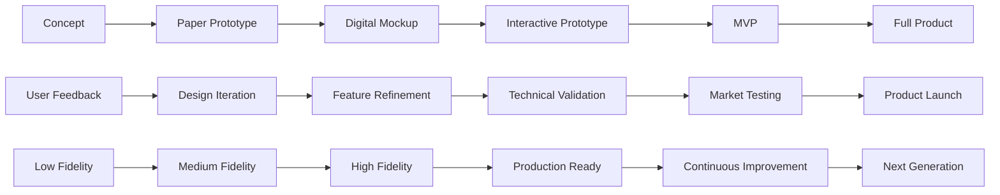

# 🔄 Rapid Prototyping

> **Accelerate innovation and reduce risk by building and testing ideas quickly before committing significant resources**

## 🎯 **What It Is**

Rapid Prototyping is a dynamic methodology for quickly creating simplified, testable versions of products, services, or systems to validate assumptions, gather feedback, and accelerate learning. This approach transforms abstract ideas into tangible experiences that can be tested with real users in real contexts. In the AI era, where technological possibilities evolve rapidly and user needs are complex, rapid prototyping becomes essential for navigating uncertainty, reducing development risk, and ensuring that AI solutions truly serve human needs before significant investment in full development.

**Core Insight**: Speed and learning velocity matter more than perfection in early stages. The fastest way to fail fast and learn fast is to build something real that people can interact with and provide feedback on.

## ⚡ **The Prototyping Architecture**

### **Prototype Evolution Pipeline**


**The Prototype Progression:**
- **Concept Validation**: Test core ideas and assumptions with minimal investment
- **Design Validation**: Validate user experience and interface design decisions
- **Technical Validation**: Test technical feasibility and implementation approaches
- **Market Validation**: Validate product-market fit and business model assumptions

## 🎯 **When to Use**

### **🚀 Product Development and Innovation**
- Validating new product concepts before major development investment
- Testing AI-powered features and user interactions with machine learning
- Exploring different user experience approaches for complex AI systems
- Evaluating technical feasibility of innovative AI applications

### **💼 Business Model and Strategy Validation**
- Testing new business models and revenue strategies
- Validating market assumptions and customer needs
- Exploring platform and ecosystem approaches
- Testing organizational processes and workflow innovations

### **🔧 Technical Architecture and AI Systems**
- Validating AI model architectures and performance characteristics
- Testing integration approaches for AI systems with existing infrastructure
- Exploring different data pipeline and processing architectures
- Validating AI safety and reliability approaches

## 🛠️ **Comprehensive Prototyping Framework**

### **1️⃣ Fidelity-Based Prototyping Strategy**
```
Definition: Strategic progression through different levels of detail and functionality to optimize learning and resource allocation

Low-Fidelity Prototyping:
• Paper sketches and wireframes for initial concept validation
• Storyboards and user journey maps to test experience flows
• Clickable mockups using prototyping tools (Figma, Sketch, Adobe XD)
• Role-playing and wizard-of-oz techniques to simulate AI interactions

Benefits of Low-Fidelity:
• Extremely fast and cheap to create and modify
• Encourages focus on core concepts rather than details
• Easy for stakeholders to provide feedback without getting distracted
• Allows rapid exploration of multiple different approaches

Example - AI Customer Service Chatbot:
Low-Fidelity: Paper sketches of conversation flows, role-playing customer interactions
Medium-Fidelity: Clickable mockup with simulated AI responses using rule-based logic
High-Fidelity: Working chatbot with actual AI model but simplified training data
Production: Full AI chatbot with comprehensive training and enterprise integration

Medium-Fidelity Prototyping:
• Interactive digital prototypes with realistic data and basic functionality
• Simplified versions of AI models or rule-based simulations of AI behavior
• Working prototypes with limited scope and simplified user interfaces
• Integration prototypes that test key technical integration points

High-Fidelity Prototyping:
• Nearly fully functional prototypes with real AI models and complete user interfaces
• End-to-end system prototypes that demonstrate complete user workflows
• Performance prototypes that test scalability and technical performance
• Beta versions that can be tested with real users in real contexts

Strategic Fidelity Progression:
• Start with lowest fidelity that can test your key assumptions
• Increase fidelity only when low-fidelity testing validates core concepts
• Match fidelity level to the questions you're trying to answer
• Avoid over-investing in fidelity before validating fundamental assumptions
```

### **2️⃣ Purpose-Driven Prototype Types**
```
Definition: Different prototype types optimized for specific learning objectives and validation goals

Concept Prototypes:
• Purpose: Validate core product concepts and user value propositions
• Methods: Storyboards, concept videos, paper prototypes, role-playing
• Key Questions: "Is this a problem worth solving?" "Would users value this solution?"
• Timeline: Hours to days
• Investment: Minimal - paper, sketching tools, basic video equipment

Example - AI-Powered Personal Finance Assistant:
Concept Prototype: Storyboard showing user struggling with budgeting, interacting with AI assistant, achieving financial goals
Validation: Do users resonate with the problem? Does the solution approach make sense?
Learning: User emotional response, understanding of value proposition, willingness to try

Look-and-Feel Prototypes:
• Purpose: Validate user interface design, visual design, and user experience flows
• Methods: High-fidelity mockups, interactive prototypes, design systems
• Key Questions: "Is this interface intuitive?" "Does the visual design communicate our brand?"
• Timeline: Days to weeks
• Investment: Design tools, designer time, user testing sessions

Implementation Prototypes:
• Purpose: Validate technical feasibility and implementation approaches
• Methods: Code prototypes, architecture proofs-of-concept, AI model experiments
• Key Questions: "Can we build this?" "Will this approach work at scale?"
• Timeline: Weeks to months
• Investment: Developer time, computing resources, technical infrastructure

Integration Prototypes:
• Purpose: Test integration with existing systems and validate end-to-end workflows
• Methods: API prototypes, system integration tests, workflow simulations
• Key Questions: "How will this work with existing systems?" "What are the integration challenges?"
• Timeline: Days to weeks
• Investment: Development time, access to existing systems, testing environments
```

### **3️⃣ AI-Specific Prototyping Approaches**
```
Definition: Prototyping methods specifically designed for AI and machine learning systems

Wizard of Oz Prototypes:
• Technique: Human operators simulate AI behavior to test user interactions
• Applications: Conversational AI, recommendation systems, automated decision-making
• Benefits: Test user experience before building complex AI systems
• Limitations: Cannot test AI performance or scalability

Example - AI Meeting Assistant:
Wizard of Oz: Human operator listens to meeting recording and provides summary and action items
User Testing: Participants believe they're interacting with AI system
Learning: User acceptance of AI assistance, quality expectations, workflow integration needs
Next Step: Build actual AI model based on user feedback and requirements

Data-Driven Prototypes:
• Technique: Use existing data to simulate AI model behavior and outputs
• Applications: Predictive analytics, recommendation engines, classification systems
• Benefits: Test with realistic data without training complex models
• Methods: Statistical models, rule-based systems, simplified algorithms

Model Architecture Prototypes:
• Technique: Build simplified versions of AI models to test core technical approaches
• Applications: Neural network architectures, natural language processing, computer vision
• Benefits: Validate technical feasibility before full model development
• Considerations: Balance between simplicity and realistic performance

Synthetic Data Prototypes:
• Technique: Generate artificial data to test AI systems when real data is unavailable
• Applications: Training data generation, privacy-preserving testing, edge case exploration
• Benefits: Overcome data limitations and privacy constraints
• Challenges: Ensuring synthetic data represents real-world complexity and edge cases

Progressive Enhancement Prototypes:
• Technique: Start with simple rule-based systems and progressively add AI capabilities
• Applications: Complex AI systems that can benefit from hybrid human-AI approaches
• Benefits: Validate value before full AI investment, maintain fallback options
• Strategy: Begin with manual processes, add automation, enhance with AI
```

## 🔬 **Advanced Prototyping Methodologies**

### **📊 Lean Prototyping Process**

**The BUILD-MEASURE-LEARN Framework for AI:**
```python
class RapidPrototypingFramework:
    def __init__(self):
        self.prototype_stages = self.define_prototype_progression()
        self.learning_metrics = self.establish_success_criteria()
        self.iteration_cycles = self.design_feedback_loops()
    
    def execute_prototype_cycle(self, concept):
        prototyping_process = {
            "build_phase": self.build_minimum_testable_prototype(concept),
            "measure_phase": self.gather_user_feedback_and_data(concept),
            "learn_phase": self.analyze_results_and_insights(concept),
            "decide_phase": self.make_iteration_or_pivot_decision(concept)
        }
        
        return prototyping_process
    
    def build_minimum_testable_prototype(self, concept):
        build_strategies = {
            "scope_definition": {
                "core_functionality": "Identify minimum features needed to test key assumptions",
                "user_scenarios": "Define specific user scenarios to test in prototype",
                "success_criteria": "Establish clear criteria for prototype success",
                "constraints": "Identify time, budget, and technical constraints"
            },
            
            "rapid_development_techniques": {
                "no_code_platforms": "Use no-code tools for rapid UI and workflow prototyping",
                "existing_components": "Leverage existing libraries, APIs, and components",
                "simulation_approaches": "Use simulation and mock data where AI models aren't ready",
                "incremental_building": "Build incrementally with frequent testing checkpoints"
            },
            
            "technical_shortcuts": {
                "rule_based_simulation": "Use rules to simulate AI behavior for early testing",
                "pre_trained_models": "Leverage existing AI models as starting points",
                "api_integration": "Use third-party AI APIs to avoid building from scratch",
                "data_mocking": "Create realistic mock data for testing when real data unavailable"
            }
        }
        
        return build_strategies
    
    def gather_user_feedback_and_data(self, concept):
        measurement_approaches = {
            "qualitative_feedback": {
                "user_interviews": "In-depth conversations about prototype experience",
                "usability_testing": "Observe users interacting with prototype",
                "feedback_sessions": "Group discussions about prototype strengths and weaknesses",
                "stakeholder_reviews": "Gather input from key stakeholders and decision-makers"
            },
            
            "quantitative_metrics": {
                "usage_analytics": "Track how users interact with prototype features",
                "performance_metrics": "Measure technical performance and response times",
                "conversion_metrics": "Track user progression through key workflows",
                "error_rates": "Monitor failure rates and error conditions"
            },
            
            "technical_validation": {
                "feasibility_assessment": "Evaluate technical implementation challenges",
                "scalability_testing": "Test prototype behavior under increased load",
                "integration_testing": "Validate integration with existing systems",
                "security_evaluation": "Assess security and privacy implications"
            }
        }
        
        return measurement_approaches
    
    def analyze_results_and_insights(self, concept):
        learning_framework = {
            "assumption_validation": {
                "confirmed_assumptions": "Document assumptions that testing confirmed",
                "invalidated_assumptions": "Identify assumptions that proved incorrect",
                "new_insights": "Capture unexpected learnings from prototype testing",
                "remaining_uncertainties": "Identify areas that still need validation"
            },
            
            "user_behavior_analysis": {
                "usage_patterns": "Analyze how users actually used the prototype",
                "pain_points": "Identify areas where users struggled or failed",
                "value_perception": "Understand what users found most valuable",
                "adoption_barriers": "Identify obstacles to user adoption"
            },
            
            "technical_learnings": {
                "performance_insights": "Understand technical performance characteristics",
                "implementation_challenges": "Document technical challenges encountered",
                "architecture_implications": "Learn about optimal technical architecture",
                "resource_requirements": "Understand computational and infrastructure needs"
            }
        }
        
        return learning_framework
```

### **🎯 Prototype Testing and Validation**

**Comprehensive User Testing Framework:**
```python
def design_prototype_testing_strategy():
    testing_framework = {
        "user_testing_methods": {
            "moderated_usability_testing": {
                "setup": "One-on-one sessions with users and facilitator",
                "benefits": "Deep insights, real-time clarification, rich qualitative data",
                "best_for": "Complex interactions, early-stage prototypes, detailed feedback",
                "process": [
                    "Define testing objectives and key questions",
                    "Create realistic testing scenarios and tasks",
                    "Recruit representative users from target audience",
                    "Conduct sessions with think-aloud protocol",
                    "Analyze patterns across multiple sessions"
                ]
            },
            
            "unmoderated_remote_testing": {
                "setup": "Users test prototype independently with recording tools",
                "benefits": "Natural behavior, larger sample sizes, cost-effective",
                "best_for": "Established user workflows, quantitative data collection",
                "considerations": [
                    "Clear instructions and task definitions",
                    "Robust prototype that handles user errors gracefully",
                    "Analytics and recording tools to capture user behavior",
                    "Follow-up surveys or interviews for additional context"
                ]
            },
            
            "a_b_prototype_testing": {
                "setup": "Compare different prototype versions with similar user groups",
                "benefits": "Quantitative comparison, reduced bias, clear decision-making data",
                "applications": [
                    "Compare different AI interaction paradigms",
                    "Test alternative user interface approaches",
                    "Validate different feature prioritizations",
                    "Evaluate different onboarding strategies"
                ]
            }
        },
        
        "stakeholder_validation": {
            "technical_team_review": {
                "focus_areas": [
                    "Technical feasibility and implementation approach",
                    "Performance and scalability implications",
                    "Security and privacy considerations",
                    "Integration with existing systems and workflows"
                ],
                "deliverables": [
                    "Technical feasibility assessment",
                    "Implementation timeline and resource estimates",
                    "Risk assessment and mitigation strategies",
                    "Architecture recommendations"
                ]
            },
            
            "business_stakeholder_review": {
                "evaluation_criteria": [
                    "Alignment with business strategy and objectives",
                    "Market potential and competitive differentiation",
                    "Revenue model and monetization potential",
                    "Resource requirements and return on investment"
                ],
                "decision_frameworks": [
                    "Go/no-go decision criteria",
                    "Investment level and timeline decisions",
                    "Market entry and scaling strategies",
                    "Success metrics and KPI definition"
                ]
            }
        },
        
        "iterative_improvement_process": {
            "feedback_prioritization": {
                "impact_vs_effort_analysis": "Prioritize feedback based on user impact and implementation effort",
                "frequency_analysis": "Focus on feedback mentioned by multiple users",
                "critical_path_analysis": "Prioritize feedback that affects core user workflows",
                "strategic_alignment": "Consider feedback alignment with product strategy"
            },
            
            "rapid_iteration_techniques": {
                "daily_build_cycles": "Update prototype daily based on testing feedback",
                "feature_toggle_testing": "Test different features by enabling/disabling functionality",
                "incremental_enhancement": "Add features progressively based on validation",
                "parallel_development": "Test multiple approaches simultaneously"
            }
        }
    }
    
    return testing_framework
```

## 📊 **AI-Specific Prototyping Strategies**

### **🤖 Machine Learning Prototype Development**

**AI Model Prototyping Pipeline:**
```python
def create_ai_prototyping_pipeline():
    ai_prototyping_framework = {
        "data_prototyping": {
            "synthetic_data_generation": {
                "purpose": "Create realistic training data when real data is unavailable",
                "techniques": [
                    "Generative models for creating synthetic datasets",
                    "Data augmentation to expand limited real datasets",
                    "Privacy-preserving synthetic data for sensitive domains",
                    "Edge case generation for comprehensive testing"
                ],
                "validation": [
                    "Statistical similarity to real data distributions",
                    "Model performance comparison on synthetic vs. real data",
                    "Privacy analysis to ensure no real data leakage",
                    "Diversity analysis to ensure comprehensive coverage"
                ]
            },
            
            "data_pipeline_prototyping": {
                "streaming_prototypes": "Test real-time data processing and model inference",
                "batch_processing_prototypes": "Validate batch data processing workflows",
                "data_quality_prototypes": "Test data cleaning and validation processes",
                "feature_engineering_prototypes": "Experiment with different feature extraction approaches"
            }
        },
        
        "model_architecture_prototyping": {
            "progressive_complexity": {
                "baseline_models": "Start with simple models to establish performance baselines",
                "incremental_enhancement": "Add complexity progressively while measuring improvement",
                "architecture_comparison": "Test different model architectures side-by-side",
                "ensemble_prototyping": "Combine multiple models for improved performance"
            },
            
            "transfer_learning_prototypes": {
                "pre_trained_adaptation": "Adapt existing models to specific use cases",
                "domain_transfer": "Apply models trained in one domain to related domains",
                "few_shot_learning": "Test model performance with limited training data",
                "fine_tuning_strategies": "Experiment with different fine-tuning approaches"
            }
        },
        
        "ai_system_integration": {
            "human_ai_collaboration": {
                "human_in_the_loop_prototypes": "Test workflows where humans and AI collaborate",
                "ai_assisted_decision_making": "Prototype AI systems that support human decisions",
                "feedback_loop_prototypes": "Test systems that learn from human feedback",
                "escalation_prototypes": "Test when and how AI systems escalate to humans"
            },
            
            "real_time_ai_prototypes": {
                "edge_computing_prototypes": "Test AI models running on edge devices",
                "low_latency_inference": "Optimize models for real-time performance requirements",
                "streaming_analytics": "Prototype real-time data processing and decision-making",
                "adaptive_models": "Test models that adapt to changing conditions in real-time"
            }
        }
    }
    
    return ai_prototyping_framework

def implement_ai_prototype_evaluation():
    evaluation_framework = {
        "technical_performance_metrics": {
            "accuracy_metrics": "Precision, recall, F1-score, accuracy for classification tasks",
            "regression_metrics": "MAE, RMSE, R-squared for regression tasks",
            "latency_metrics": "Response time, throughput, processing speed",
            "resource_metrics": "Memory usage, computational requirements, energy consumption"
        },
        
        "user_experience_metrics": {
            "usability_metrics": "Task completion rate, error rate, user satisfaction",
            "trust_metrics": "User confidence in AI recommendations and decisions",
            "transparency_metrics": "User understanding of AI behavior and decisions",
            "adoption_metrics": "User willingness to use and recommend AI system"
        },
        
        "business_impact_metrics": {
            "efficiency_metrics": "Time savings, cost reduction, productivity improvement",
            "quality_metrics": "Improvement in output quality, decision accuracy",
            "scalability_metrics": "Ability to handle increased load and complexity",
            "roi_metrics": "Return on investment, cost-benefit analysis"
        }
    }
    
    return evaluation_framework
```

## 🚨 **Prototyping Pitfalls and Solutions**

### **❌ Common Prototyping Anti-Patterns**

**1. Perfectionism and Over-Engineering**
```
❌ Problem: Spending too much time perfecting prototypes instead of learning quickly
Example: Building fully functional AI models before validating user need for the solution

Impact:
• Delayed learning and feedback cycles
• Increased cost and time investment before validation
• Reduced ability to pivot when early assumptions prove wrong
• Team attachment to solutions that may not work

Root Causes:
• Engineer's desire to build complete, robust solutions
• Misunderstanding of prototype purpose and goals
• Lack of clear learning objectives for prototypes
• Organizational culture that values perfection over learning

✅ Solution: Focus on learning objectives and minimum viable functionality
Implementation:
• Define clear learning objectives before building any prototype
• Set strict time and scope limits for prototype development
• Use lowest fidelity that can answer your key questions
• Create throwaway prototypes that are expected to be discarded
• Measure success by learning achieved, not functionality built

Learning-Focused Prototyping:
• Question Definition: What specific question does this prototype answer?
• Hypothesis Formation: What do we believe this prototype will validate?
• Success Criteria: How will we know if our hypothesis is correct?
• Learning Metrics: What data will we collect to validate our assumptions?
• Decision Framework: What will we do based on different prototype outcomes?
```

**2. Prototype Fidelity Mismatch**
```
❌ Problem: Using wrong level of fidelity for the learning objectives
Example: Building high-fidelity visual prototypes when the core question is about technical feasibility

Impact:
• Wasted effort on irrelevant details
• Delayed learning on critical assumptions
• Stakeholder confusion about prototype purpose
• Premature commitment to design decisions

Root Causes:
• Unclear learning objectives and success criteria
• Misunderstanding of different prototype types and purposes
• Stakeholder pressure for "realistic" prototypes
• Lack of structured prototyping methodology

✅ Solution: Match prototype fidelity to learning objectives
Implementation:
• Start with lowest fidelity that can test key assumptions
• Progress through fidelity levels based on validated learning
• Use different prototype types for different questions
• Educate stakeholders on purpose of different fidelity levels
• Create clear criteria for when to increase fidelity

Fidelity Matching Framework:
• Concept Questions: Use paper sketches, storyboards, concept videos
• Usability Questions: Use interactive mockups, clickable prototypes
• Technical Questions: Use code prototypes, architecture proofs-of-concept
• Integration Questions: Use system prototypes, API demonstrations
• Performance Questions: Use realistic prototypes with actual data and load
```

**3. Insufficient User Involvement**
```
❌ Problem: Building prototypes without adequate user input and testing
Example: Creating AI prototypes based on internal assumptions without real user validation

Impact:
• Solutions that don't address real user needs
• Missed opportunities for breakthrough insights
• False confidence in product direction
• Expensive pivots late in development process

Root Causes:
• Assumption that internal teams understand user needs
• Difficulty recruiting and coordinating with real users
• Pressure to move quickly without "slowing down" for user research
• Overconfidence in existing market research and user data

✅ Solution: Embed user research throughout prototyping process
Implementation:
• Include user research in every prototype planning session
• Create user testing plans before building prototypes
• Recruit ongoing panel of users for continuous feedback
• Use multiple research methods to triangulate insights
• Create user feedback loops with rapid iteration cycles

User-Centric Prototyping Process:
• User Research: Understand user needs before building anything
• Participatory Design: Include users in prototype design process
• Continuous Testing: Test with users throughout prototype development
• Feedback Integration: Rapidly incorporate user feedback into iterations
• Validation Cycles: Validate major changes with users before proceeding
```

## 📊 **Measurement and Optimization**

### **🎯 Prototyping Effectiveness Metrics**

**Comprehensive Prototype Assessment Framework:**
```python
def measure_prototyping_effectiveness():
    effectiveness_metrics = {
        "learning_velocity_metrics": {
            "cycle_time": {
                "prototype_to_insight_time": "Time from prototype creation to actionable insights",
                "iteration_cycle_duration": "Average time for complete build-test-learn cycles",
                "decision_making_speed": "Time from insight to product/strategy decisions",
                "hypothesis_validation_rate": "Percentage of hypotheses validated per time period"
            },
            
            "learning_quality": {
                "assumption_accuracy": "How often initial assumptions prove correct",
                "insight_depth": "Quality and actionability of insights gained",
                "surprise_discovery_rate": "Frequency of unexpected but valuable discoveries",
                "knowledge_transfer_effectiveness": "How well insights inform product development"
            }
        },
        
        "resource_efficiency_metrics": {
            "cost_effectiveness": {
                "cost_per_validated_assumption": "Investment required to validate each key assumption",
                "prototype_roi": "Value of insights gained relative to prototype investment",
                "avoided_development_costs": "Expensive mistakes prevented through prototyping",
                "resource_utilization": "Efficiency of team time and budget allocation"
            },
            
            "development_acceleration": {
                "time_to_market_improvement": "Reduction in overall product development time",
                "development_risk_reduction": "Decreased probability of product failure",
                "requirement_clarity_improvement": "Reduction in scope changes during development",
                "team_confidence_increase": "Improved team confidence in product direction"
            }
        },
        
        "innovation_impact_metrics": {
            "breakthrough_discovery": {
                "novel_solution_identification": "Discovery of innovative approaches through prototyping",
                "market_opportunity_discovery": "Identification of new market opportunities",
                "technical_innovation_rate": "Novel technical solutions discovered through prototyping",
                "competitive_advantage_creation": "Unique capabilities developed through prototype learning"
            },
            
            "user_value_validation": {
                "user_need_confirmation": "Validation of real user problems and needs",
                "solution_fit_validation": "Confirmation that solutions address user needs",
                "value_proposition_clarity": "Clear understanding of user value proposition",
                "adoption_likelihood_assessment": "Prediction of user adoption based on prototype testing"
            }
        }
    }
    
    return effectiveness_metrics

def optimize_prototyping_process():
    optimization_strategies = {
        "process_improvement": {
            "methodology_refinement": "Continuously improve prototyping methods and frameworks",
            "tool_optimization": "Invest in better prototyping tools and platforms",
            "team_skill_development": "Build prototyping capabilities across the team",
            "stakeholder_education": "Improve stakeholder understanding of prototyping value"
        },
        
        "technology_enhancement": {
            "rapid_development_tools": "Adopt tools that accelerate prototype creation",
            "automated_testing": "Implement automated user testing and feedback collection",
            "ai_assisted_prototyping": "Use AI tools to accelerate prototype development",
            "cloud_development_platforms": "Leverage cloud platforms for rapid deployment and testing"
        },
        
        "organizational_alignment": {
            "prototype_driven_culture": "Build organizational culture that values rapid learning",
            "cross_functional_collaboration": "Improve collaboration between design, engineering, and business teams",
            "user_research_integration": "Deeply integrate user research into prototyping processes",
            "decision_making_alignment": "Align decision-making processes with prototype insights"
        }
    }
    
    return optimization_strategies
```

## 🔗 **Integration with Other Mental Models**

### **🧠 Complementary Innovation Frameworks**

**Synergistic Prototyping Approaches:**
- **[[Design Thinking]]**: Human-centered design process that uses prototyping for user validation
- **[[Lean Startup]]**: Build-measure-learn cycles that emphasize rapid experimentation
- **[[Systems Thinking]]**: Understanding how prototypes fit within larger system contexts
- **[[Agile Development]]**: Iterative development approaches that incorporate continuous feedback
- **[[Risk Assessment]]**: Using prototypes to identify and mitigate development risks

**Integration Examples:**
```python
def integrate_prototyping_with_frameworks():
    integrated_approaches = {
        "prototyping_plus_design_thinking": {
            "empathy_driven_prototypes": "Create prototypes that test user empathy and understanding",
            "journey_mapping_prototypes": "Build prototypes that test specific user journey stages",
            "solution_ideation_prototypes": "Use prototypes to explore and validate multiple solution approaches",
            "user_testing_integration": "Seamlessly integrate user testing throughout prototype development"
        },
        
        "prototyping_plus_lean_startup": {
            "mvp_development": "Use prototypes to define and build minimum viable products",
            "pivot_decision_making": "Use prototype insights to make informed pivot decisions",
            "market_validation": "Validate market assumptions through prototype testing",
            "customer_development": "Use prototypes as tools for customer discovery and validation"
        },
        
        "prototyping_plus_agile": {
            "sprint_planning": "Integrate prototype goals into agile sprint planning",
            "continuous_integration": "Include prototype testing in continuous integration workflows",
            "stakeholder_demos": "Use prototypes for stakeholder demonstrations and feedback",
            "backlog_prioritization": "Use prototype insights to prioritize development backlog"
        }
    }
    
    return integrated_approaches
```

## 🎯 **Advanced Mastery Guide**

### **📈 Prototyping Leadership Development**

**Level 1: Individual Prototyping Skills**
- Master basic prototyping tools and techniques
- Learn to match prototype fidelity to learning objectives
- Develop user testing and feedback collection skills

**Level 2: Team Prototyping Facilitation**
- Lead cross-functional prototyping initiatives
- Facilitate user testing sessions and insight generation
- Coach team members in prototyping methodologies

**Level 3: Organizational Prototyping Strategy**
- Design prototyping processes for product development
- Build prototyping culture and capabilities across organization
- Integrate prototyping with business strategy and decision-making

**Level 4: Innovation Ecosystem Leadership**
- Lead prototyping initiatives across multiple organizations
- Shape industry standards for rapid experimentation
- Mentor other organizations in prototyping excellence

**Level 5: Prototyping Research and Thought Leadership**
- Contribute to advancement of prototyping theory and practice
- Publish research on prototyping effectiveness and innovation
- Lead global communities focused on rapid experimentation

## 🏆 **Success Stories and Case Studies**

### **Case Study 1: AI-Powered Medical Diagnosis**

**Challenge**: Healthcare startup needed to validate AI diagnostic capabilities with real physicians
**Prototyping Approach**: Progressive fidelity from wizard-of-oz to working AI model
**Process**:
- **Week 1-2**: Paper prototypes of diagnostic workflow with physicians
- **Week 3-4**: Wizard-of-oz prototype with human experts simulating AI
- **Week 5-8**: Simple rule-based system with basic medical knowledge
- **Week 9-12**: AI model with limited diagnostic capabilities
- **Month 4-6**: Full AI system with comprehensive training data

**Results**: 70% faster product development, 50% reduction in development risk, physician adoption rate of 85%

### **Case Study 2: Financial AI Platform**

**Challenge**: Fintech company needed to validate AI-powered investment recommendations
**Framework Used**: Multi-fidelity prototyping with continuous user testing
**Innovation Journey**:
- **Concept Prototype**: Storyboards showing AI investment advisory experience
- **Interactive Mockup**: Clickable prototype with simulated AI recommendations
- **Beta Platform**: Working AI with limited investment options and user base
- **Results**: Validated product-market fit, secured series A funding, launched successfully

## 🚀 **Takeaways and Next Steps**

### **Key Insights**
1. **Speed beats perfection in early stages** - Learning velocity is more important than prototype quality
2. **Match fidelity to learning objectives** - Use the minimum fidelity needed to answer key questions
3. **User involvement is non-negotiable** - Real user feedback is essential for meaningful validation
4. **Prototyping is a strategic capability** - Organizations that prototype well innovate faster and better

### **Implementation Roadmap**
1. **Master Basic Prototyping** - Learn fundamental prototyping tools and techniques
2. **Develop Learning Discipline** - Create clear learning objectives for every prototype
3. **Build User Research Capabilities** - Establish processes for continuous user involvement
4. **Create Prototyping Culture** - Build organizational support for rapid experimentation
5. **Measure and Optimize** - Track prototyping effectiveness and continuously improve

**Start Today:**
- Identify one assumption about a current project that could be tested with a simple prototype
- Choose the lowest fidelity approach that could validate this assumption
- Create a simple prototype and test it with at least three real users
- Document what you learn and how it changes your approach
- Plan your next iteration based on the insights gained

Remember: **The best way to predict the future is to prototype it. Rapid prototyping transforms uncertainty into validated learning, dramatically reducing the risk of building products nobody wants. Start simple, test often, and let user feedback guide your innovation journey.**
