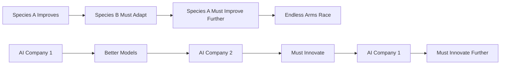
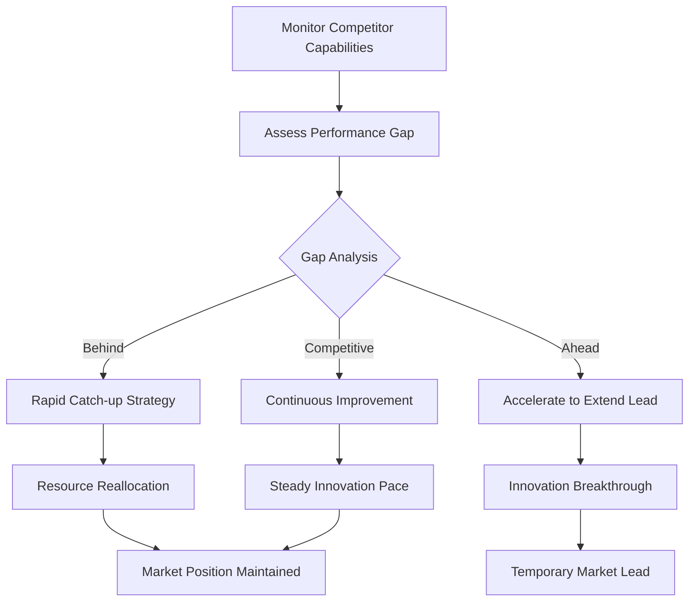
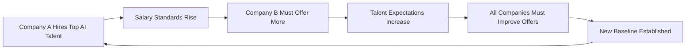
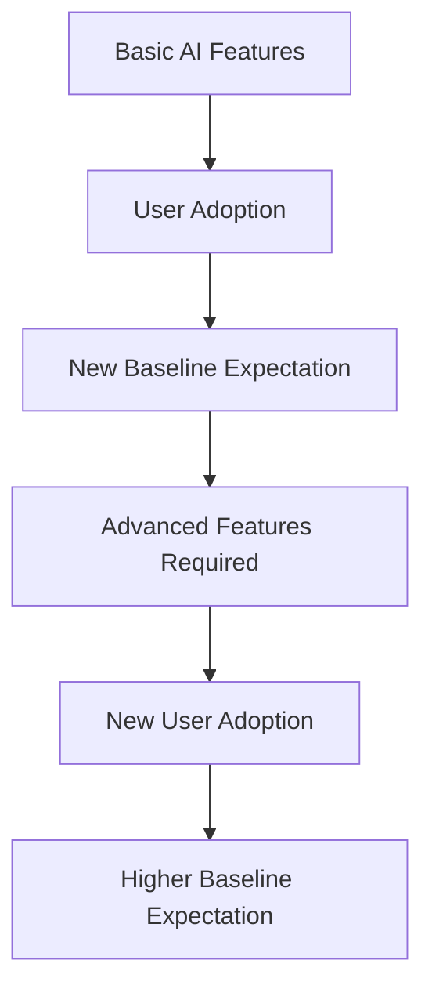
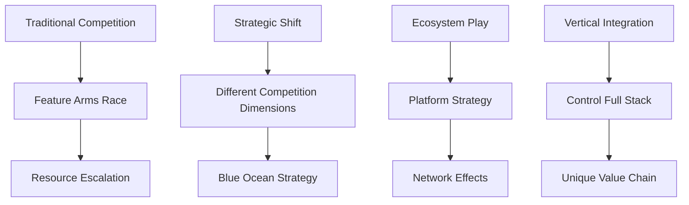
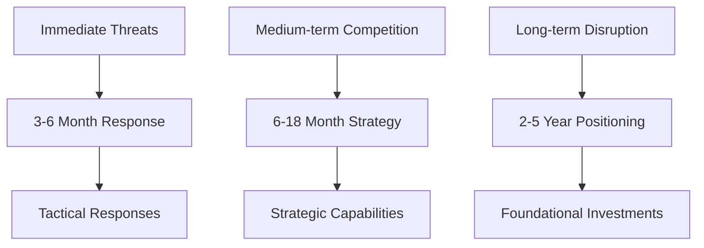

# 👑 Red Queen Hypothesis

> **Continuous improvement is required just to maintain competitive position in evolving AI landscapes**

## 🎯 **What It Is**

The Red Queen Hypothesis is a mental model borrowed from evolutionary biology that explains why continuous innovation and improvement are necessary just to maintain your current competitive position. Named after the Red Queen in Alice in Wonderland who said "it takes all the running you can do, to keep in the same place."

**Core Insight**: In competitive AI environments, standing still means falling behind because everyone else is constantly improving. You must continuously evolve just to maintain your relative position.

## ⚡ **The Biology Behind It**



**Key Concepts:**
- **Co-evolution**: Competitors evolve in response to each other
- **Relative Fitness**: Success depends on performance relative to competitors
- **Evolutionary Arms Race**: Continuous escalation of capabilities
- **Adaptation Lag**: Time between competitive threat and response

## 🎯 **When to Use**

### **🏆 Competitive Strategy**
- Understanding why market leaders lose position
- Planning continuous improvement roadmaps
- Allocating resources for competitive defense

### **📈 Technology Evolution**
- Predicting industry capability escalation
- Planning for technological arms races
- Understanding innovation cycle acceleration

### **🔧 System Design**
- Building adaptable and evolvable systems
- Planning for capability upgrades
- Designing learning and improvement mechanisms

## 🚀 **Practical Applications**

### **Example: AI Model Performance Arms Race**

**🔍 Red Queen Dynamics in AI:**

```python
def track_competitive_improvement():
    # Baseline: GPT-3 performance (2020)
    baseline_capability = 100
    
    # Competitive responses create escalation
    improvements = {
        "2020": {"gpt3": 100},
        "2021": {"gpt3": 100, "claude": 105, "palm": 103},
        "2022": {"gpt3": 100, "claude": 110, "palm": 108, "gpt3.5": 125},
        "2023": {"gpt4": 150, "claude2": 145, "palm2": 140},
        "2024": {"gpt4": 150, "claude3": 170, "gemini": 165, "gpt4.5": 180}
    }
    
    # Red Queen Effect: Must improve continuously just to compete
    if your_model_performance < max(current_competitor_performance):
        return "FALLING BEHIND - URGENT IMPROVEMENT NEEDED"
```

**Strategic Response:**


### **Example: Feature Development Arms Race**

**🎯 Product Feature Competition:**

**Traditional Thinking:**
```
Build great features → Gain competitive advantage → Success
```

**Red Queen Reality:**
```python
def feature_arms_race():
    # Your company adds AI chat feature
    your_features = ["ai_chat", "analytics", "automation"]
    
    # Competitors respond within 6 months
    competitor_a = ["ai_chat", "advanced_analytics", "workflow_automation"]
    competitor_b = ["ai_chat_plus", "real_time_analytics", "smart_automation"]
    
    # Your "advantage" disappears quickly
    competitive_advantage_duration = calculate_advantage_duration()
    assert competitive_advantage_duration < 12  # months
    
    # Must continuously innovate to stay competitive
    next_innovation_cycle = plan_next_features()
    return "CONTINUOUS_INNOVATION_REQUIRED"
```

**Sustainable Strategy:**
- **Innovation Pipeline**: Always have next features in development
- **Speed Advantage**: Innovate faster than competitors can copy
- **Ecosystem Lock-in**: Create switching costs beyond features
- **Capability Building**: Develop innovation capabilities, not just products

### **Example: AI Talent Competition**

**🧠 Talent Acquisition Arms Race:**

**Red Queen Dynamics:**


**Strategic Response:**
```python
def navigate_talent_arms_race():
    # Traditional approach: Compete on salary alone
    traditional_strategy = {
        "salary": "match_highest_offer",
        "benefits": "standard_package",
        "growth": "unclear_path"
    }
    
    # Red Queen-aware approach: Compete on dimensions hard to copy
    sustainable_strategy = {
        "salary": "competitive_but_not_highest",
        "learning_opportunities": "cutting_edge_projects",
        "research_freedom": "20%_time_for_exploration",
        "publication_support": "conference_and_paper_budget",
        "technical_infrastructure": "best_in_class_tools",
        "team_quality": "work_with_top_peers"
    }
    
    # Build sustainable competitive advantages
    return create_talent_ecosystem(sustainable_strategy)
```

## 🔄 **Red Queen Patterns in AI**

### **📈 Performance Escalation**

**Capability Arms Race:**
```
Model Size: 100M → 1B → 10B → 100B → 1T parameters
Training Data: GB → TB → PB → EB
Compute: Single GPU → Multi-GPU → Clusters → Supercomputers
```

**Implications:**
- **Resource Requirements Increase**: More compute, data, talent needed
- **Entry Barriers Rise**: Harder for new players to compete
- **Innovation Pressure Intensifies**: Faster development cycles required

### **🔧 Tool and Infrastructure Competition**

**Platform Evolution:**
```python
def track_platform_arms_race():
    generations = {
        "gen_1": {"tools": ["basic_apis"], "ease": 3, "power": 5},
        "gen_2": {"tools": ["llm_apis", "embeddings"], "ease": 5, "power": 7},
        "gen_3": {"tools": ["langchain", "llamaindex"], "ease": 7, "power": 8},
        "gen_4": {"tools": ["agents", "multimodal"], "ease": 8, "power": 9},
        "gen_5": {"tools": ["agentic_workflows", "reasoning"], "ease": 9, "power": 10}
    }
    
    # Each generation becomes table stakes for next
    for gen in generations:
        if not_supporting_current_generation():
            return "PLATFORM_OBSOLESCENCE_RISK"
```

### **🎯 User Expectation Escalation**

**Experience Standards Evolution:**


**User Journey Evolution:**
- **2020**: "Wow, AI can generate text!"
- **2022**: "This AI text generation is pretty good"
- **2024**: "AI text generation is expected, what else can it do?"
- **Future**: "AI should understand context, reason, and act autonomously"

## 🎯 **Strategic Applications**

### **Defensive Red Queen Strategy**

**🛡️ Protecting Current Position:**

```python
def implement_defensive_strategy():
    # Monitor competitive landscape
    competitor_capabilities = track_competitor_improvements()
    
    # Maintain capability parity
    capability_gaps = identify_gaps(competitor_capabilities)
    for gap in capability_gaps:
        if gap.urgency == "high":
            allocate_catch_up_resources(gap)
    
    # Build sustainable advantages
    moats = ["network_effects", "data_advantages", "switching_costs"]
    for moat in moats:
        strengthen_competitive_moat(moat)
    
    return "POSITION_DEFENDED"
```

**Defensive Tactics:**
- **Rapid Response**: Quick competitive feature parity
- **Resource Allocation**: Dedicate resources to competitive threats
- **Ecosystem Building**: Create advantages beyond features
- **Patent Protection**: Legal barriers to copying

### **Offensive Red Queen Strategy**

**⚡ Accelerating Competitive Pressure:**

```python
def implement_offensive_strategy():
    # Force competitors into Red Queen race
    innovation_areas = [
        "breakthrough_research",
        "novel_applications", 
        "infrastructure_advances",
        "user_experience_innovations"
    ]
    
    for area in innovation_areas:
        if can_establish_lead(area):
            invest_heavily(area)
            force_competitor_response()
    
    # Accelerate innovation cycle
    reduce_development_time()
    increase_release_frequency()
    
    return "COMPETITIVE_PRESSURE_INCREASED"
```

**Offensive Tactics:**
- **Innovation Pace**: Innovate faster than competitors can respond
- **Resource Investment**: Outspend competitors in key areas
- **Talent Acquisition**: Hire key people from competitors
- **Market Expansion**: Force competition across multiple fronts

### **Red Queen Transcendence Strategy**

**🚀 Escaping the Arms Race:**



**Transcendence Approaches:**
- **Category Creation**: Compete in new, undefined markets
- **Platform Strategy**: Become the foundation others build on
- **Vertical Integration**: Control unique parts of value chain
- **Ecosystem Creation**: Make others depend on your success

## 💡 **Advanced Red Queen Strategies**

### **Meta-Competition**

**Competing on the Ability to Compete:**
```python
def build_meta_competitive_advantage():
    # Instead of competing on current capabilities,
    # compete on ability to develop new capabilities
    
    advantages = {
        "learning_speed": build_rapid_experimentation_culture(),
        "talent_pipeline": create_internal_ai_university(),
        "research_capability": establish_advanced_research_lab(),
        "execution_speed": develop_rapid_deployment_systems(),
        "resource_efficiency": optimize_innovation_per_dollar()
    }
    
    # These advantages help win multiple Red Queen races
    return meta_competitive_moat(advantages)
```

### **Portfolio Red Queen**

**Managing Multiple Competitive Fronts:**
```python
def manage_portfolio_competition():
    competitive_fronts = {
        "core_product": {"threat_level": "high", "resources": 60},
        "adjacent_markets": {"threat_level": "medium", "resources": 25},
        "future_opportunities": {"threat_level": "low", "resources": 15}
    }
    
    # Allocate resources based on threat assessment
    for front, allocation in competitive_fronts.items():
        if allocation["threat_level"] == "high":
            maintain_competitive_parity(front, allocation["resources"])
        elif allocation["threat_level"] == "medium":
            strategic_monitoring(front, allocation["resources"])
        else:
            exploratory_research(front, allocation["resources"])
```

### **Temporal Red Queen**

**Managing Different Timescales:**


## ⚠️ **Red Queen Pitfalls**

### **Endless Arms Race Exhaustion**
- **Problem**: Burning resources on competitive responses
- **Symptoms**: Reactive roadmap, resource depletion, team burnout
- **Solution**: Selective engagement, focus on winnable battles

### **Feature Bloat from Competition**
- **Problem**: Adding features just because competitors have them
- **Symptoms**: Complex UI, confused value proposition, technical debt
- **Solution**: User-centered feature decisions, not competitor-driven

### **Short-term Thinking**
- **Problem**: Only responding to immediate competitive threats
- **Symptoms**: No long-term strategy, constant fire-fighting
- **Solution**: Balance defensive responses with offensive innovation

### **Red Queen Blindness**
- **Problem**: Not recognizing when you're falling behind
- **Symptoms**: Complacency, declining metrics, market share loss
- **Solution**: Continuous competitive intelligence, honest assessment

## 📊 **Measuring Red Queen Effects**

### **Competitive Position Metrics**
```python
def measure_red_queen_position():
    # Relative performance vs. competitors
    performance_gaps = {}
    for competitor in competitors:
        gaps = compare_capabilities(your_product, competitor.product)
        performance_gaps[competitor.name] = gaps
    
    # Rate of improvement relative to market
    your_improvement_rate = calculate_monthly_improvement()
    market_improvement_rate = calculate_market_average_improvement()
    
    relative_improvement = your_improvement_rate / market_improvement_rate
    
    if relative_improvement < 1.0:
        return "FALLING_BEHIND"
    elif relative_improvement < 1.2:
        return "KEEPING_PACE"
    else:
        return "PULLING_AHEAD"
```

### **Red Queen Health Dashboard**
- **Innovation Velocity**: Rate of new capability development
- **Competitive Gaps**: Areas where competitors are ahead
- **Response Time**: Speed of reaction to competitive moves
- **Resource Efficiency**: Innovation output per resource unit

## 💡 **Key Takeaways**

- **In competitive AI markets, continuous improvement is required just to maintain position**
- **Competitive advantages are temporary - everyone eventually copies successful innovations**
- **Resource allocation must balance defensive responses with offensive innovation**
- **The pace of required improvement accelerates as markets mature**
- **Sustainable competitive advantage comes from building superior innovation capabilities**
- **Sometimes the best strategy is to compete in different dimensions or create new categories**

---

**🔗 Related Mental Models:**
- [Compound Growth](./compound-growth.md) - How small improvements accumulate over time
- [Phase Transitions](./phase-transitions.md) - When competitive dynamics suddenly change
- [Market Timing Framework](./market-timing-framework.md) - Strategic timing in competitive markets
- [Build vs Buy vs Partner Matrix](./build-buy-partner-matrix.md) - Strategic capability decisions

**📚 Further Reading:**
- Evolutionary biology and co-evolution
- Competitive strategy and game theory
- Innovation management and R&D strategy
- Technology adoption and diffusion theory
