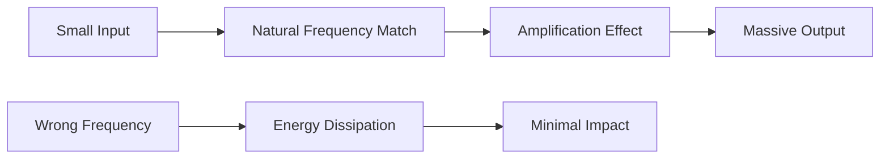
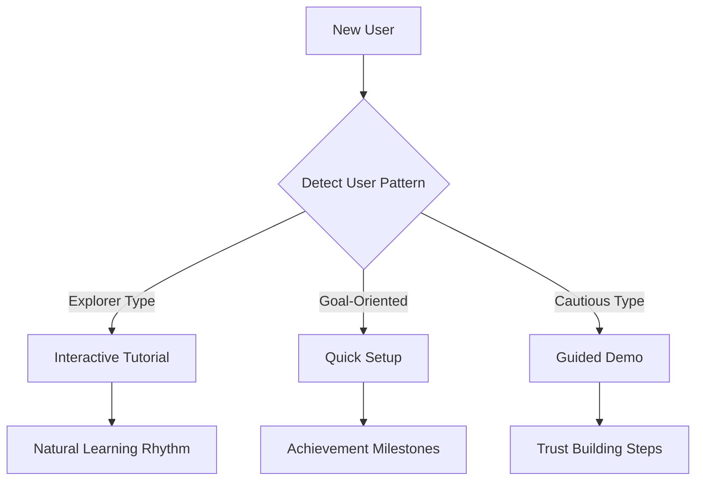

# 🌊 The Resonance Principle

> **Amplify impact by matching your efforts to natural frequencies in AI systems and organizations**

## 🎯 **What It Is**

The Resonance Principle is a mental model borrowed from physics that helps you understand how small, well-timed inputs can create massive amplification effects when they align with natural frequencies or patterns in AI systems, teams, and markets.

**Core Insight**: Just as a small push at the right frequency can make a swing go higher, strategic efforts aligned with system dynamics can achieve outsized results in AI development.

## ⚡ **The Physics Behind It**



**Key Concepts:**
- **Natural Frequency**: Every system has preferred patterns or rhythms
- **Constructive Interference**: When inputs align with natural patterns
- **Destructive Interference**: When inputs work against natural patterns

## 🎯 **When to Use**

### **🚀 Team Performance Optimization**
- Identifying when teams are most productive
- Timing major changes or initiatives
- Maximizing adoption of new AI tools

### **📈 Market Entry Strategy**
- Finding market moments ready for AI solutions
- Timing product launches with user readiness
- Leveraging industry momentum

### **🔧 System Design**
- Designing AI systems that work with user patterns
- Optimizing data collection timing
- Creating feedback loops that amplify value

## 🚀 **Practical Applications**

### **Example: AI Tool Adoption in Organizations**

**❌ Against Resonance:**
- Launching AI tools during busy season when teams resist change
- Implementing complex systems when teams are already overwhelmed
- Rolling out changes without understanding team rhythms

**✅ With Resonance:**

**🔍 Identify Natural Frequencies:**
1. **Team Cycles**: When do teams naturally experiment? (Often after project completions)
2. **Learning Patterns**: How do teams prefer to learn new tools? (Hands-on vs. training)
3. **Change Readiness**: What triggers openness to new approaches? (Pain points, success celebrations)

**Implementation Strategy:**
```
Week 1-2: Observe team patterns and pain points
Week 3: Introduce AI tool during natural "exploration" time
Week 4: Support early adopters who naturally embrace change
Week 5-6: Let success stories create organic momentum
Week 7+: Scale based on natural adoption patterns
```

### **Example: AI Model Performance Optimization**

**🔍 Finding System Resonance:**
- **Data Patterns**: When is your data most representative?
- **User Behavior**: What times show peak engagement?
- **System Load**: When does infrastructure perform optimally?

**Optimization Strategy:**
```python
# Resonance-based training schedule
def find_optimal_training_times():
    peak_data_quality_hours = analyze_data_patterns()
    low_system_load_periods = monitor_infrastructure()
    user_feedback_availability = track_user_engagement()
    
    return intersect(peak_data_quality, low_load, high_feedback)

# Train during resonant periods for maximum improvement
optimal_windows = find_optimal_training_times()
schedule_training(optimal_windows)
```

### **Example: Customer Onboarding Flow**

**🎯 Designing for User Resonance:**

**Traditional Approach:**
- Linear onboarding regardless of user state
- Same flow for all user types
- Fighting against user natural patterns

**Resonance Approach:**


**Implementation:**
1. **Identify User Natural Frequencies**: Learning style, urgency level, comfort with technology
2. **Match Onboarding Rhythm**: Align tutorials with user pace preferences
3. **Amplify Success Moments**: Celebrate wins that resonate with user motivations

## 🔄 **Pattern Recognition**

### **🟢 Signs of Resonance**
- **Effortless Adoption**: Teams naturally embrace new AI tools
- **Viral Growth**: Features spread organically through user base
- **Compound Improvements**: Small changes create cascading benefits
- **Reduced Resistance**: Less pushback against changes

### **🔴 Signs of Dissonance**
- **Constant Pushback**: Teams resist AI implementations
- **Energy Drain**: High effort for minimal results
- **Fragmented Adoption**: Uneven uptake across different groups
- **Diminishing Returns**: Increased effort yields less improvement

## 🎯 **Strategic Applications**

### **Market Timing with Resonance**

**🔍 Identify Market Natural Frequencies:**
- **Economic Cycles**: When do companies invest in new technology?
- **Industry Rhythms**: What triggers digital transformation efforts?
- **Competitive Dynamics**: When are competitors vulnerable to disruption?

**Strategic Resonance Framework:**
```
High Market Readiness + Low Competition + High User Pain = Resonant Opportunity
```

### **Team Performance Resonance**

**🔍 Find Team Natural Frequencies:**
- **Energy Cycles**: When are teams most creative vs. operational?
- **Communication Patterns**: How does information naturally flow?
- **Decision Rhythms**: When are teams most open to strategic changes?

**Implementation:**
```
Sprint Planning → High Energy (Innovation)
Mid-Sprint → Focus Energy (Execution)
Sprint End → Reflection Energy (Learning)
```

Align AI initiatives with natural team energy patterns.

### **Technology Adoption Resonance**

**🔍 Identify Adoption Natural Frequencies:**
- **User Journey Moments**: When are users most open to new features?
- **Success Celebrations**: When do users feel confident to try more?
- **Problem Recognition**: When do pain points become urgent enough for change?

## 💡 **Advanced Strategies**

### **Creating Resonance Amplifiers**

**1. Timing Multipliers**
```
Good Idea + Perfect Timing = Exponential Impact
Good Idea + Wrong Timing = Wasted Effort
```

**2. Stakeholder Alignment**
- Find moments when different stakeholders' interests naturally align
- Leverage shared urgency or shared success to amplify initiatives

**3. System Harmonics**
- Design AI systems that work with existing user workflows
- Create features that amplify existing user strengths

### **Resonance Portfolio Strategy**

**Different Resonance Types:**
- **High Frequency, Low Amplitude**: Small, frequent optimizations
- **Low Frequency, High Amplitude**: Major strategic shifts
- **Variable Frequency**: Adaptive systems that match user patterns

**Portfolio Balance:**
- 70% aligned with current system resonance (predictable impact)
- 20% exploring new resonance patterns (growth opportunities)
- 10% experimental approaches (breakthrough potential)

## ⚠️ **Common Resonance Mistakes**

### **Forced Frequency**
- **Mistake**: Trying to impose artificial rhythms on natural systems
- **Solution**: Observe and align with existing patterns first

### **Single Frequency Focus**
- **Mistake**: Only optimizing for one type of resonance
- **Solution**: Design for multiple harmonics and user types

### **Resonance Overload**
- **Mistake**: Too many simultaneous resonance attempts
- **Solution**: Focus on 1-2 key resonance patterns at a time

### **Ignoring Destructive Interference**
- **Mistake**: Not recognizing when efforts cancel each other out
- **Solution**: Map interaction effects between different initiatives

## 📊 **Measuring Resonance**

### **Leading Indicators**
- **Adoption Velocity**: How quickly new features spread
- **Effort-to-Impact Ratio**: Results achieved per unit of effort
- **Organic Amplification**: User-driven growth and sharing

### **Lagging Indicators**
- **Sustained Engagement**: Long-term usage patterns
- **Network Effects**: Value increases with more users
- **System Stability**: Improvements compound over time

### **Measurement Framework**
```python
def measure_resonance():
    effort_input = track_resource_investment()
    impact_output = measure_system_improvements()
    amplification_factor = impact_output / effort_input
    
    if amplification_factor > 3.0:
        return "Strong Resonance"
    elif amplification_factor > 1.5:
        return "Moderate Resonance"
    else:
        return "Poor Resonance - Reassess Frequency"
```

## 🎯 **Implementation Checklist**

### **🔍 Before Starting**
- [ ] Map system natural frequencies (user patterns, team rhythms, market cycles)
- [ ] Identify current areas of resistance or energy drain
- [ ] Analyze past successes for resonance patterns
- [ ] Set up measurement systems for amplification effects

### **🚀 During Implementation**
- [ ] Start with small, well-timed inputs
- [ ] Monitor for amplification vs. resistance signals
- [ ] Adjust frequency and timing based on system response
- [ ] Look for unexpected resonance opportunities

### **📊 After Implementation**
- [ ] Measure effort-to-impact ratios
- [ ] Document resonance patterns for future use
- [ ] Share learnings with team for system-wide improvement
- [ ] Plan next resonance initiatives based on insights

## 💡 **Key Takeaways**

- **Small, well-timed efforts can create massive impact when aligned with natural frequencies**
- **Every system has preferred patterns - observe before attempting to change**
- **Resonance can be found in timing, user patterns, team dynamics, and market conditions**
- **Fighting against natural frequencies wastes energy and reduces impact**
- **Successful AI initiatives often succeed because they resonate with existing user needs and behaviors**
- **Design for amplification, not just optimization**

---

**🔗 Related Mental Models:**
- [Compound Growth](./compound-growth.md) - How small improvements amplify over time
- [Feedback Loops](./feedback-loops.md) - Creating self-reinforcing systems
- [Market Timing Framework](./market-timing-framework.md) - Finding optimal timing for initiatives
- [Emergence Principle](./emergence-principle.md) - How simple patterns create complex behaviors

**📚 Further Reading:**
- Physics of resonance and wave amplification
- Systems thinking and natural rhythms
- Timing strategy in business and technology
- Adoption curve theory and user behavior patterns
