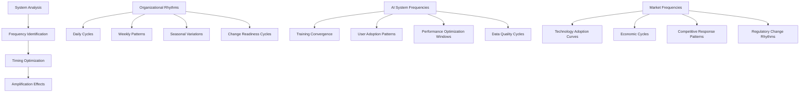
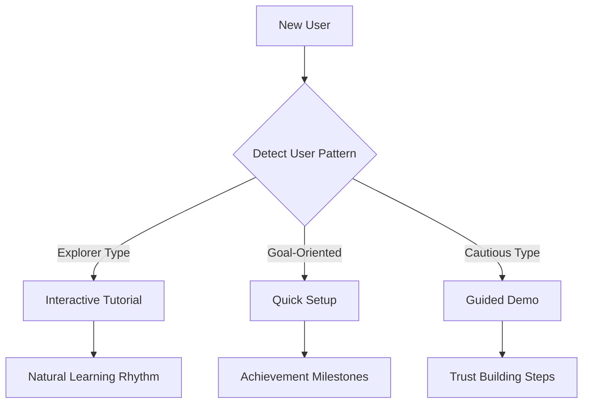

# 🌊 The Resonance Principle

> **Amplify impact exponentially by aligning efforts with natural frequencies in AI systems, organizations, and markets**

## 🎯 **What It Is**

The Resonance Principle is a powerful mental model derived from physics that reveals how small, strategically-timed inputs can create massive amplification effects when they synchronize with the natural frequencies, patterns, or rhythms inherent in AI systems, teams, and markets. This framework helps you identify optimal timing for interventions, maximize the impact of limited resources, and create self-reinforcing cycles that compound your efforts.

**Core Insight**: Just as a small push at precisely the right frequency can make a massive bridge oscillate, strategic efforts that align with system dynamics can achieve exponential results. The difference between forcing change and enabling natural amplification often determines success or failure in AI development and organizational transformation.

## ⚡ **The Physics and Science of Resonance**

The Resonance Principle is grounded in fundamental physics and systems science:

**Wave Theory and Oscillations:**
- **Natural frequency**: Every system has preferred oscillation patterns that require minimal energy to maintain
- **Constructive interference**: When external inputs align with natural patterns, they amplify each other
- **Destructive interference**: When inputs work against natural patterns, they cancel each other out
- **Resonance amplification**: Small, well-timed inputs can create exponentially larger outputs

**Systems Science Foundation:**
- **Entrainment**: Systems naturally synchronize when coupled, creating opportunities for amplification
- **Phase locking**: Multiple oscillating systems align their cycles for maximum efficiency
- **Emergence**: System-level behaviors arise from synchronized component interactions
- **Critical points**: Specific moments when small inputs can trigger large system changes

**Organizational Psychology Research:**
- **Flow state research** shows that teams have natural rhythms of productivity and creativity
- **Change management studies** reveal optimal timing for introducing new processes or technologies
- **Learning psychology** demonstrates that information absorption has natural cycles and patterns
- **Group dynamics research** identifies when teams are most receptive to new ideas and approaches

**AI System Dynamics:**
- **Training convergence patterns** show that models have natural learning rhythms
- **User adoption curves** reveal when people are most receptive to AI tool integration
- **Data quality cycles** indicate optimal times for model retraining and improvement
- **Performance optimization** benefits from aligning improvements with system usage patterns

## 🔬 **The Resonance Framework: Identifying Natural Frequencies**

### **🎵 Understanding System Frequencies**



### **🧭 Frequency Detection and Analysis**

**Organizational Frequency Mapping:**
```python
class OrganizationalFrequencyDetector:
    def __init__(self, organization_data):
        self.data = organization_data
        self.frequency_patterns = {}
        self.resonance_opportunities = []
    
    def analyze_team_productivity_cycles(self):
        """Identify natural rhythms in team performance and receptivity"""
        productivity_analysis = {
            "daily_patterns": {
                "peak_creativity_hours": self.identify_peak_creativity_windows(),
                "optimal_meeting_times": self.analyze_meeting_effectiveness_patterns(),
                "focus_work_periods": self.map_deep_work_availability(),
                "collaboration_sweet_spots": self.identify_optimal_collaboration_times()
            },
            
            "weekly_rhythms": {
                "innovation_days": self.find_weekly_innovation_peaks(),
                "implementation_periods": self.identify_execution_focused_days(),
                "planning_windows": self.locate_strategic_thinking_times(),
                "review_and_reflection": self.map_natural_retrospective_moments()
            },
            
            "monthly_cycles": {
                "project_initiation_timing": self.analyze_project_start_success_rates(),
                "change_introduction_windows": self.identify_change_receptivity_periods(),
                "learning_intensive_periods": self.map_training_effectiveness_cycles(),
                "performance_evaluation_timing": self.optimize_feedback_delivery_timing()
            },
            
            "seasonal_variations": {
                "annual_planning_cycles": self.identify_strategic_planning_optimal_timing(),
                "budget_allocation_periods": self.map_resource_allocation_effectiveness(),
                "talent_acquisition_seasons": self.analyze_hiring_success_patterns(),
                "technology_adoption_windows": self.identify_innovation_adoption_peaks()
            }
        }
        
        return self.synthesize_organizational_frequency_map(productivity_analysis)
    
    def detect_change_readiness_signals(self):
        """Identify when organization is naturally prepared for transformation"""
        change_readiness_indicators = {
            "frustration_with_status_quo": self.measure_dissatisfaction_levels(),
            "success_celebration_moments": self.identify_victory_amplification_opportunities(),
            "learning_orientation_peaks": self.detect_curiosity_and_experimentation_periods(),
            "resource_availability_windows": self.map_capacity_for_new_initiatives(),
            "leadership_attention_cycles": self.track_executive_focus_and_support_patterns(),
            "external_pressure_moments": self.identify_urgency_driven_change_opportunities()
        }
        
        # Calculate resonance scores for different change timing options
        resonance_scores = {}
        for timeframe in self.generate_potential_change_timeframes():
            score = self.calculate_change_resonance_score(timeframe, change_readiness_indicators)
            resonance_scores[timeframe] = score
        
        return self.rank_optimal_change_timing(resonance_scores)
```

**AI System Frequency Analysis:**
```python
class AISystemResonanceAnalyzer:
    def __init__(self, ai_system_metrics):
        self.metrics = ai_system_metrics
        self.performance_patterns = {}
        self.optimization_windows = []
    
    def analyze_model_training_resonance(self):
        """Identify optimal timing patterns for model improvement initiatives"""
        training_resonance_analysis = {
            "convergence_patterns": {
                "learning_rate_sweet_spots": self.identify_optimal_learning_phases(),
                "batch_size_efficiency_cycles": self.analyze_batch_processing_patterns(),
                "data_availability_windows": self.map_high_quality_data_periods(),
                "computational_resource_optimization": self.identify_low_cost_training_windows"
            },
            
            "user_feedback_cycles": {
                "peak_engagement_periods": self.identify_maximum_user_activity_times(),
                "feedback_quality_windows": self.analyze_when_users_provide_best_feedback(),
                "adoption_acceleration_moments": self.map_viral_growth_opportunities(),
                "support_ticket_pattern_analysis": self.identify_user_pain_point_cycles()
            },
            
            "system_performance_rhythms": {
                "latency_optimization_windows": self.identify_low_traffic_optimization_periods(),
                "throughput_enhancement_timing": self.map_capacity_expansion_opportunities(),
                "error_rate_reduction_cycles": self.analyze_stability_improvement_windows(),
                "cost_optimization_periods": self.identify_infrastructure_cost_reduction_timing"
            },
            
            "integration_sync_opportunities": {
                "api_update_coordination": self.map_external_system_update_cycles(),
                "data_pipeline_synchronization": self.identify_data_flow_optimization_windows(),
                "deployment_window_optimization": self.analyze_minimal_disruption_periods(),
                "monitoring_and_alerting_enhancement": self.map_system_observability_improvement_timing"
            }
        }
        
        return self.synthesize_ai_system_resonance_map(training_resonance_analysis)
    
    def predict_user_adoption_resonance(self):
        """Forecast optimal timing for AI feature rollouts and user education"""
        adoption_prediction_model = {
            "user_behavior_patterns": {
                "feature_discovery_cycles": self.analyze_when_users_explore_new_features(),
                "learning_curve_optimization": self.identify_optimal_education_timing(),
                "workflow_integration_windows": self.map_natural_workflow_evolution_periods(),
                "resistance_mitigation_timing": self.predict_change_resistance_low_points()
            },
            
            "market_readiness_indicators": {
                "competitive_landscape_shifts": self.monitor_market_disruption_opportunities(),
                "technology_maturity_cycles": self.track_solution_sophistication_evolution(),
                "regulatory_environment_changes": self.anticipate_compliance_driven_adoption(),
                "economic_condition_influences": self.analyze_budget_allocation_cycle_impacts"
            },
            
            "organizational_change_capacity": {
                "change_saturation_levels": self.measure_organizational_change_bandwidth(),
                "training_resource_availability": self.map_education_capacity_cycles(),
                "leadership_support_patterns": self.track_executive_sponsorship_intensity(),
                "internal_champion_activation": self.identify_influencer_mobilization_opportunities"
            }
        }
        
        return self.generate_adoption_timing_recommendations(adoption_prediction_model)
```

## 🎯 **When to Apply the Resonance Principle**

### **🚀 Strategic Initiative Timing**

**Launch Timing Optimization:**
```python
def optimize_initiative_timing(initiative_details, system_context):
    """Determine optimal timing for maximum resonance amplification"""
    
    timing_analysis = {
        "organizational_readiness": {
            "current_change_capacity": system_context["change_bandwidth_utilization"],
            "leadership_attention_availability": system_context["executive_focus_distribution"], 
            "team_motivation_levels": system_context["engagement_and_energy_metrics"],
            "resource_allocation_flexibility": system_context["budget_and_talent_availability"]
        },
        
        "external_environment_alignment": {
            "market_conditions": system_context["competitive_landscape_dynamics"],
            "technology_maturity": system_context["solution_readiness_indicators"],
            "regulatory_environment": system_context["compliance_requirement_changes"],
            "economic_factors": system_context["investment_climate_assessment"]
        },
        
        "initiative_specific_factors": {
            "complexity_and_scope": initiative_details["implementation_complexity_score"],
            "stakeholder_impact": initiative_details["affected_stakeholder_groups"],
            "dependency_requirements": initiative_details["prerequisite_completion_status"],
            "success_measurement_readiness": initiative_details["metrics_and_monitoring_preparation"]
        }
    }
    
    # Calculate resonance scores for different timing options
    timing_options = generate_timing_scenarios(initiative_details, system_context)
    resonance_scores = {}
    
    for timing_scenario in timing_options:
        score = calculate_resonance_amplification_potential(
            timing_scenario, 
            timing_analysis,
            initiative_details
        )
        resonance_scores[timing_scenario] = score
    
    optimal_timing = max(resonance_scores, key=resonance_scores.get)
    
    return {
        "recommended_timing": optimal_timing,
        "resonance_score": resonance_scores[optimal_timing],
        "amplification_factors": identify_amplification_mechanisms(optimal_timing),
        "risk_mitigation": assess_timing_risks(optimal_timing),
        "success_indicators": define_resonance_success_metrics(optimal_timing)
    }
```

### **🔧 System Integration and Tool Adoption**

**Technology Adoption Resonance Strategy:**
```python
class TechnologyAdoptionResonance:
    def __init__(self, technology_details, organization_profile):
        self.technology = technology_details
        self.organization = organization_profile
        self.adoption_strategy = None
    
    def design_resonant_adoption_approach(self):
        """Create adoption strategy that aligns with organizational natural frequencies"""
        
        adoption_resonance_design = {
            "user_journey_synchronization": {
                "pain_point_alignment": self.identify_peak_frustration_moments(),
                "workflow_integration_timing": self.map_natural_workflow_evolution_windows(),
                "learning_curve_optimization": self.design_education_at_optimal_moments(),
                "success_celebration_coordination": self.plan_victory_amplification_strategies"
            },
            
            "organizational_rhythm_integration": {
                "change_initiative_coordination": self.synchronize_with_existing_change_programs(),
                "budget_cycle_alignment": self.optimize_investment_timing_with_fiscal_cycles(),
                "performance_review_integration": self.connect_adoption_to_evaluation_periods(),
                "strategic_planning_synchronization": self.align_with_annual_strategic_initiatives"
            },
            
            "technical_system_harmony": {
                "infrastructure_upgrade_coordination": self.synchronize_with_technical_improvements(),
                "data_migration_timing": self.optimize_data_transition_periods(),
                "security_review_alignment": self.coordinate_with_security_assessment_cycles(),
                "integration_testing_windows": self.identify_optimal_technical_validation_periods"
            },
            
            "stakeholder_engagement_resonance": {
                "champion_activation_timing": self.identify_influencer_mobilization_opportunities(),
                "executive_sponsorship_coordination": self.align_with_leadership_attention_cycles(),
                "user_community_building": self.leverage_natural_collaboration_periods(),
                "feedback_collection_optimization": self.maximize_user_input_quality_and_quantity"
            }
        }
        
        return self.synthesize_adoption_resonance_strategy(adoption_resonance_design)
    
    def implement_phased_resonance_approach(self):
        """Execute technology adoption in phases that build resonance momentum"""
        
        phased_implementation = {
            "phase_1_foundation": {
                "duration": "2-4_weeks",
                "focus": "establish_resonance_patterns",
                "activities": [
                    "identify_early_adopter_natural_advocates",
                    "align_with_existing_successful_workflow_patterns",
                    "establish_feedback_loops_with_system_natural_rhythms",
                    "create_initial_success_stories_for_amplification"
                ],
                "success_metrics": [
                    "early_adopter_engagement_rate", 
                    "workflow_integration_smoothness",
                    "initial_value_realization_speed"
                ]
            },
            
            "phase_2_amplification": {
                "duration": "4-8_weeks", 
                "focus": "leverage_resonance_for_expansion",
                "activities": [
                    "scale_successful_adoption_patterns_to_broader_groups",
                    "amplify_success_stories_during_peak_attention_periods",
                    "integrate_technology_into_high_visibility_organizational_processes",
                    "establish_peer_to_peer_learning_and_advocacy_networks"
                ],
                "success_metrics": [
                    "adoption_rate_acceleration",
                    "user_satisfaction_and_advocacy_growth",
                    "productivity_improvement_visibility"
                ]
            },
            
            "phase_3_optimization": {
                "duration": "8-12_weeks",
                "focus": "optimize_resonance_for_sustainability",
                "activities": [
                    "fine_tune_technology_configuration_for_organizational_patterns",
                    "establish_continuous_improvement_cycles_aligned_with_natural_rhythms",
                    "create_advanced_user_capabilities_and_expertise_development",
                    "integrate_technology_into_organizational_culture_and_identity"
                ],
                "success_metrics": [
                    "sustained_usage_and_engagement",
                    "advanced_feature_adoption",
                    "organizational_competitive_advantage_realization"
                ]
            }
        }
        
        return self.execute_phased_approach(phased_implementation)
```

## 🚀 **Advanced Resonance Applications**

### **🎯 AI Model Training and Optimization Resonance**

**Training Schedule Optimization:**
```python
class AITrainingResonanceOptimizer:
    def __init__(self, model_architecture, training_data, infrastructure):
        self.model = model_architecture
        self.data = training_data
        self.infrastructure = infrastructure
        self.resonance_patterns = {}
    
    def optimize_training_resonance(self):
        """Align model training with system and data natural frequencies"""
        
        training_resonance_strategy = {
            "data_quality_synchronization": {
                "peak_data_freshness_periods": self.identify_optimal_data_collection_windows(),
                "annotation_quality_cycles": self.map_human_labeler_performance_patterns(),
                "data_distribution_stability": self.monitor_input_data_consistency_periods(),
                "feedback_integration_timing": self.optimize_user_feedback_incorporation_cycles"
            },
            
            "computational_resource_resonance": {
                "low_cost_training_windows": self.identify_off_peak_infrastructure_pricing(),
                "high_performance_availability": self.map_optimal_gpu_cluster_access_periods(),
                "network_bandwidth_optimization": self.optimize_data_transfer_timing(),
                "shared_resource_coordination": self.synchronize_with_other_team_training_schedules"
            },
            
            "learning_convergence_patterns": {
                "optimal_learning_rate_scheduling": self.design_learning_rate_cycles_for_convergence(),
                "batch_size_resonance": self.optimize_batch_processing_for_memory_and_speed(),
                "gradient_accumulation_timing": self.coordinate_gradient_updates_with_system_capacity",
                "validation_and_evaluation_cycles": self.establish_model_assessment_rhythm"
            },
            
            "deployment_preparation_alignment": {
                "model_validation_timing": self.coordinate_testing_with_user_availability(),
                "performance_benchmarking_cycles": self.align_evaluation_with_infrastructure_baselines",
                "integration_testing_windows": self.synchronize_deployment_testing_with_system_maintenance",
                "rollout_timing_optimization": self.coordinate_model_releases_with_user_adoption_readiness"
            }
        }
        
        return self.implement_training_resonance_strategy(training_resonance_strategy)
    
    def adaptive_learning_rate_resonance(self):
        """Implement learning rate schedules that resonate with model convergence patterns"""
        
        adaptive_schedule = {
            "phase_1_exploration": {
                "learning_rate_pattern": "high_initial_rate_with_rapid_exploration",
                "frequency_characteristics": "broad_parameter_space_exploration_with_large_steps",
                "resonance_indicators": ["loss_reduction_rate", "gradient_magnitude_stability"],
                "adaptation_triggers": ["plateau_detection", "gradient_explosion_prevention"]
            },
            
            "phase_2_convergence": {
                "learning_rate_pattern": "moderate_rate_with_focused_refinement",
                "frequency_characteristics": "targeted_parameter_adjustment_with_medium_steps",
                "resonance_indicators": ["validation_accuracy_improvement", "overfitting_resistance"],
                "adaptation_triggers": ["validation_loss_stabilization", "training_validation_gap_monitoring"]
            },
            
            "phase_3_fine_tuning": {
                "learning_rate_pattern": "low_rate_with_precise_optimization",
                "frequency_characteristics": "fine_grained_parameter_polishing_with_small_steps",
                "resonance_indicators": ["final_performance_metrics", "model_stability_measures"],
                "adaptation_triggers": ["convergence_confirmation", "diminishing_returns_detection"]
            }
        }
        
        return self.implement_adaptive_learning_schedule(adaptive_schedule)
```

### **🌐 Market Entry and Product Launch Resonance**

**Market Timing Optimization Framework:**
```python
class MarketResonanceTiming:
    def __init__(self, product_details, market_analysis):
        self.product = product_details
        self.market = market_analysis
        self.timing_optimizer = TimingOptimizer()
    
    def analyze_market_frequency_patterns(self):
        """Identify market rhythms and optimal entry timing"""
        
        market_frequency_analysis = {
            "technology_adoption_cycles": {
                "early_adopter_activation_periods": self.identify_innovation_enthusiasm_peaks(),
                "mainstream_market_readiness": self.predict_mass_adoption_timing(),
                "competitive_response_patterns": self.map_competitor_reaction_cycles(),
                "industry_conference_and_event_alignment": self.synchronize_with_attention_peaks"
            },
            
            "economic_and_investment_cycles": {
                "funding_availability_windows": self.identify_investor_capital_deployment_patterns(),
                "customer_budget_allocation_periods": self.map_enterprise_spending_cycles(),
                "economic_uncertainty_mitigation": self.plan_for_economic_downturn_resilience",
                "growth_investment_opportunity_maximization": self.capitalize_on_expansion_periods"
            },
            
            "regulatory_and_compliance_alignment": {
                "policy_change_anticipation": self.predict_regulatory_environment_shifts(),
                "compliance_requirement_evolution": self.align_with_standard_development_cycles",
                "industry_best_practice_establishment": self.coordinate_with_practice_maturation",
                "legal_framework_stabilization": self.time_launch_with_legal_clarity_periods"
            },
            
            "user_behavior_and_cultural_trends": {
                "user_need_intensity_cycles": self.identify_peak_demand_periods(),
                "cultural_trend_alignment": self.synchronize_with_social_movement_momentum",
                "media_attention_optimization": self.coordinate_with_news_cycle_opportunities",
                "influencer_and_thought_leader_engagement": self.align_with_opinion_leader_attention_cycles"
            }
        }
        
        return self.synthesize_optimal_market_entry_timing(market_frequency_analysis)
    
    def design_launch_resonance_strategy(self):
        """Create product launch approach that maximizes market resonance"""
        
        launch_resonance_design = {
            "pre_launch_resonance_building": {
                "anticipation_creation": self.build_market_excitement_through_strategic_previews(),
                "early_adopter_community_cultivation": self.establish_advocate_network_before_launch(),
                "thought_leadership_establishment": self.position_expertise_during_attention_windows(),
                "partnership_and_integration_preparation": self.align_ecosystem_readiness_with_launch_timing"
            },
            
            "launch_event_resonance_amplification": {
                "media_attention_coordination": self.synchronize_launch_with_news_cycle_opportunities(),
                "industry_event_alignment": self.coordinate_launch_announcements_with_conference_cycles(),
                "social_media_amplification": self.leverage_viral_sharing_patterns_and_timing(),
                "influencer_engagement_optimization": self.maximize_thought_leader_attention_and_advocacy"
            },
            
            "post_launch_momentum_sustaining": {
                "user_feedback_amplification": self.leverage_early_success_stories_for_viral_growth(),
                "continuous_improvement_visibility": self.demonstrate_responsiveness_during_attention_peaks(),
                "market_expansion_timing": self.scale_to_new_segments_when_adoption_momentum_peaks(),
                "competitive_differentiation_messaging": self.maintain_unique_positioning_through_response_cycles"
            }
        }
        
        return self.execute_launch_resonance_strategy(launch_resonance_design)
```

## 📊 **Resonance Measurement and Optimization**

### **🎯 Resonance Effectiveness Metrics**

**Comprehensive Resonance Assessment Framework:**
```python
class ResonanceEffectivenessTracker:
    def __init__(self):
        self.amplification_metrics = {}
        self.timing_effectiveness = {}
        self.resonance_sustainability = {}
    
    def measure_resonance_amplification(self, initiative_data):
        """Quantify amplification effects from resonance-based approaches"""
        
        amplification_analysis = {
            "input_output_amplification": {
                "effort_to_impact_ratio": self.calculate_resource_efficiency_multiplier(),
                "time_to_value_acceleration": self.measure_speed_improvement_from_timing(),
                "adoption_rate_amplification": self.quantify_viral_adoption_effects(),
                "stakeholder_engagement_multiplication": self.assess_enthusiasm_propagation_effects"
            },
            
            "system_level_improvements": {
                "workflow_integration_smoothness": self.measure_natural_adoption_versus_forced_change(),
                "resistance_reduction_effectiveness": self.quantify_friction_elimination_benefits(),
                "sustainability_enhancement": self.assess_long_term_viability_improvements(),
                "emergent_benefit_generation": self.identify_unexpected_positive_outcomes"
            },
            
            "competitive_advantage_creation": {
                "market_timing_advantage": self.measure_first_mover_or_optimal_timing_benefits(),
                "resource_efficiency_superiority": self.compare_efficiency_with_non_resonant_approaches(),
                "stakeholder_loyalty_amplification": self.assess_relationship_strength_improvements(),
                "innovation_speed_acceleration": self.quantify_development_and_deployment_advantages"
            },
            
            "learning_and_adaptation_enhancement": {
                "feedback_loop_optimization": self.measure_learning_cycle_acceleration(),
                "pattern_recognition_improvement": self.assess_insight_generation_enhancement(),
                "adaptability_development": self.quantify_organizational_agility_improvements",
                "knowledge_transfer_efficiency": self.measure_learning_propagation_effectiveness"
            }
        }
        
        return self.synthesize_amplification_assessment(amplification_analysis)
    
    def track_resonance_sustainability(self):
        """Monitor long-term effectiveness of resonance-based approaches"""
        
        sustainability_tracking = {
            "momentum_maintenance": {
                "energy_requirement_over_time": self.monitor_ongoing_effort_needs(),
                "natural_system_support": self.assess_self_reinforcing_mechanism_strength(),
                "adaptation_to_system_changes": self.evaluate_resonance_flexibility_and_evolution(),
                "stakeholder_continued_engagement": self.track_long_term_enthusiasm_and_participation"
            },
            
            "system_evolution_alignment": {
                "frequency_shift_adaptation": self.monitor_changing_natural_patterns(),
                "new_resonance_opportunity_identification": self.scan_for_emerging_amplification_possibilities(),
                "obsolete_pattern_recognition": self.identify_when_historical_resonance_becomes_ineffective",
                "proactive_resonance_evolution": self.develop_adaptive_resonance_strategies"
            },
            
            "scalability_and_transferability": {
                "pattern_replication_success": self.assess_resonance_approach_scalability(),
                "cross_domain_application": self.evaluate_principle_transferability_to_new_contexts",
                "team_and_organization_capability": self.measure_institutional_resonance_competency_development",
                "knowledge_documentation_and_sharing": self.track_resonance_expertise_propagation"
            }
        }
        
        return self.generate_sustainability_recommendations(sustainability_tracking)
```

## ⚠️ **Resonance Anti-Patterns and Risk Mitigation**

### **🚨 Common Resonance Mistakes**

**Resonance Failure Analysis Framework:**
```python
class ResonanceFailureAnalyzer:
    def __init__(self):
        self.failure_patterns = self.define_common_resonance_mistakes()
        self.mitigation_strategies = self.develop_failure_prevention_approaches()
    
    def identify_resonance_anti_patterns(self, current_approach):
        """Detect and prevent common resonance implementation failures"""
        
        anti_pattern_analysis = {
            "forced_frequency_imposition": {
                "description": "trying_to_impose_artificial_rhythms_instead_of_finding_natural_ones",
                "indicators": [
                    "high_resistance_to_timing_or_approach",
                    "requiring_constant_energy_to_maintain_momentum",
                    "stakeholder_fatigue_and_disengagement",
                    "poor_sustainability_without_continuous_intervention"
                ],
                "consequences": "energy_waste_and_eventual_system_rejection",
                "mitigation": "shift_to_natural_frequency_discovery_and_alignment"
            },
            
            "frequency_misidentification": {
                "description": "incorrectly_identifying_system_natural_patterns_and_rhythms",
                "indicators": [
                    "timing_that_feels_right_but_produces_poor_results",
                    "amplification_effects_that_are_weaker_than_expected",
                    "unexpected_resistance_from_seemingly_aligned_stakeholders",
                    "inability_to_sustain_momentum_despite_initial_success"
                ],
                "consequences": "missed_opportunities_and_suboptimal_resource_utilization",
                "mitigation": "invest_in_deeper_system_analysis_and_pattern_recognition"
            },
            
            "resonance_over_dependence": {
                "description": "relying_exclusively_on_resonance_without_building_fundamental_capabilities",
                "indicators": [
                    "success_only_during_optimal_timing_windows",
                    "inability_to_succeed_when_natural_conditions_are_unfavorable",
                    "lack_of_resilience_during_system_frequency_changes",
                    "fragile_performance_dependent_on_external_conditions"
                ],
                "consequences": "brittle_strategies_that_fail_when_conditions_change",
                "mitigation": "combine_resonance_with_robust_fundamental_capability_building"
            },
            
            "amplification_without_direction": {
                "description": "achieving_amplification_effects_without_clear_strategic_purpose",
                "indicators": [
                    "high_activity_and_momentum_but_unclear_progress_toward_goals",
                    "amplified_efforts_in_directions_that_don_not_create_value",
                    "stakeholder_engagement_that_does_not_translate_to_outcomes",
                    "resource_multiplication_without_proportional_result_improvement"
                ],
                "consequences": "wasted_amplified_energy_and_missed_strategic_opportunities",
                "mitigation": "establish_clear_strategic_direction_before_pursuing_amplification"
            }
        }
        
        return self.generate_anti_pattern_prevention_plan(anti_pattern_analysis, current_approach)
    
    def design_resonance_risk_mitigation(self):
        """Create comprehensive risk management for resonance-based strategies"""
        
        risk_mitigation_framework = {
            "frequency_shift_preparation": {
                "monitoring_systems": "establish_early_warning_for_changing_natural_patterns",
                "adaptation_protocols": "develop_rapid_response_to_frequency_evolution",
                "backup_strategies": "maintain_alternative_approaches_for_pattern_disruption",
                "flexibility_preservation": "avoid_over_optimization_for_current_frequencies"
            },
            
            "over_amplification_prevention": {
                "amplitude_controls": "establish_limits_on_amplification_to_prevent_system_damage",
                "feedback_monitoring": "track_system_stress_indicators_during_amplification",
                "gradual_scaling": "implement_progressive_amplification_to_test_system_capacity",
                "emergency_dampening": "develop_mechanisms_to_reduce_amplification_when_necessary"
            },
            
            "resonance_dependency_diversification": {
                "multiple_frequency_strategies": "develop_approaches_for_different_system_frequencies",
                "fundamental_capability_building": "invest_in_non_resonance_dependent_competencies",
                "resilience_development": "build_capacity_to_succeed_in_non_optimal_timing",
                "strategic_optionality": "maintain_multiple_pathways_to_success"
            }
        }
        
        return self.implement_comprehensive_risk_management(risk_mitigation_framework)
```

## 🔗 **Integration with Complementary Mental Models**

### **🧠 Synergistic Framework Applications**

**Combined with [[Timing and Market Dynamics]]**:
```python
def integrate_resonance_with_market_timing():
    return {
        "market_frequency_analysis": "identify_market_adoption_and_investment_cycles",
        "competitive_response_patterns": "understand_competitor_reaction_rhythms", 
        "technology_maturity_alignment": "synchronize_with_technology_readiness_cycles",
        "customer_need_intensity_mapping": "align_with_peak_demand_periods"
    }
```

**Combined with [[Systems Thinking]]**:
- **Feedback Loops**: How resonance creates self-reinforcing cycles
- **Emergence**: System behaviors that arise from synchronized components
- **Leverage Points**: Strategic intervention points where resonance amplifies impact

**Combined with [[Flow State Optimization]]**:
- **Individual Resonance**: Aligning work with personal natural rhythms
- **Team Resonance**: Synchronizing team activities with collective energy patterns
- **Organizational Resonance**: Matching initiatives with institutional readiness cycles

## 🏆 **Mastery Development and Advanced Applications**

### **📈 Progressive Resonance Mastery**

**Level 1: Pattern Recognition** (Months 1-3)
- **Skill**: Identify natural frequencies in teams, systems, and markets
- **Practice**: Map daily, weekly, and monthly patterns in your environment
- **Milestone**: Successfully predict optimal timing for 70% of initiatives

**Level 2: Timing Optimization** (Months 4-6)
- **Skill**: Align initiatives with identified natural frequencies
- **Practice**: Implement resonance-based timing for projects and changes
- **Milestone**: Demonstrate measurable amplification effects from improved timing

**Level 3: Resonance Design** (Months 7-12)
- **Skill**: Create systems and processes that naturally resonate
- **Practice**: Design workflows and strategies that align with natural patterns
- **Milestone**: Build sustainable systems that require minimal energy to maintain

**Level 4: Multi-Frequency Orchestration** (Year 2)
- **Skill**: Coordinate multiple resonance patterns simultaneously
- **Practice**: Manage complex initiatives across different system frequencies
- **Milestone**: Lead organization-wide transformation using resonance principles

**Level 5: Resonance Innovation** (Year 3+)
- **Skill**: Discover new resonance patterns and create novel applications
- **Practice**: Research emerging system frequencies and develop new approaches
- **Milestone**: Contribute to advancement of resonance-based strategy and design

## 🚀 **Implementation Roadmap and Quick Start Guide**

### **🎯 30-60-90 Day Resonance Development Plan**

**First 30 Days: Frequency Discovery**
- Map natural patterns in your primary work environment
- Identify daily, weekly, and monthly rhythms in team productivity
- Document optimal timing for different types of work and communication
- Begin timing one initiative based on identified patterns

**Next 30 Days: Resonance Experimentation**
- Test timing adjustments for meetings, project launches, and change initiatives
- Measure amplification effects from improved timing alignment
- Expand frequency mapping to broader organizational and market patterns
- Develop early resonance optimization capabilities

**Final 30 Days: Systematic Integration**
- Integrate resonance principles into standard planning and execution processes
- Train team members in pattern recognition and timing optimization
- Establish measurement systems for tracking resonance effectiveness
- Create organizational capability for ongoing resonance optimization

### **🔧 Quick Resonance Assessment Tool**

**For any initiative, evaluate:**
1. **Natural Patterns**: What are the relevant system frequencies?
2. **Timing Alignment**: How well does current timing match natural patterns?
3. **Amplification Potential**: What amplification effects could be achieved?
4. **Sustainability Factors**: How can resonance be maintained over time?

**Quick Decision Framework:**
- **High Resonance Potential + Good Timing**: Proceed with amplification focus
- **High Potential + Poor Timing**: Delay until better alignment possible
- **Low Potential + Any Timing**: Focus on fundamental capability building
- **Uncertain Patterns**: Invest in deeper system analysis before proceeding

### **💡 Remember**

> *"The master does not force; the master finds the natural way and amplifies it. Small efforts aligned with natural patterns achieve what massive efforts against the grain cannot."*

**The Resonance Principle transforms:**
- **Pushing into pulling**: Work with natural forces rather than against them
- **Force into finesse**: Achieve more through intelligent timing than brute effort  
- **Resistance into amplification**: Convert obstacles into opportunities for greater impact
- **Sustainability through alignment**: Create lasting change that the system naturally supports

**Start today**: Identify one natural pattern in your environment and align one small initiative with it. Notice the difference in effort required and impact achieved. This is the beginning of resonance mastery.

---

## 🎓 **Learning Resources and Additional References**

### **📚 Deep Dive Resources**

**Physics and Wave Theory:**
- **Resonance in Physical Systems**: MIT Physics Course Materials on Wave Mechanics
- **Frequency Analysis and Fourier Transforms**: Mathematical foundations for pattern recognition
- **Mechanical Resonance and Damping**: Engineering principles applicable to organizational systems
- **Quantum Resonance Effects**: Advanced patterns in complex systems

**Systems Science and Cybernetics:**
- **Autopoiesis and Self-Organization**: Humberto Maturana and Francisco Varela's work on natural system patterns
- **Cybernetic Feedback Loops**: Norbert Wiener's principles of system resonance and amplification
- **Complex Adaptive Systems**: Santa Fe Institute research on emergent resonance patterns
- **Network Effect Theory**: How connections amplify through resonance mechanisms

**Organizational Psychology and Behavior:**
- **Circadian Rhythms in Teams**: Research on biological timing applied to workplace effectiveness
- **Group Dynamics and Synchronization**: Studies on team rhythm and collective performance
- **Change Management Timing**: Research on organizational readiness and change receptivity cycles
- **Cultural Resonance Patterns**: Anthropological studies on cultural timing and rhythm

**Business Strategy and Market Dynamics:**
- **Timing and Strategic Advantage**: Harvard Business Review articles on market timing
- **Technology Adoption Lifecycles**: Geoffrey Moore's work on crossing the chasm through resonance
- **Network Effects and Viral Growth**: Studies on exponential adoption through resonance principles
- **Economic Cycle Analysis**: Macroeconomic research on timing business initiatives

### **🔬 Research Applications and Case Studies**

**Successful Technology Adoption Examples:**
- **Apple iPhone Launch (2007)**: Perfect convergence of technology maturity, market readiness, and user frustration with existing solutions
- **Zoom Pandemic Adoption (2020)**: Product readiness meeting urgent global need for remote communication
- **OpenAI ChatGPT Launch (2022)**: AI capability advancement meeting peak public curiosity about artificial intelligence

**Organizational Transformation Success Stories:**
- **Microsoft Cultural Transformation (2014-2020)**: Aligning culture change with new leadership and market pressures
- **Netflix Streaming Transition (2007-2012)**: Technology infrastructure and consumer behavior convergence
- **Amazon AWS Platform Evolution (2006-2015)**: Internal need driving external platform development

## 🔄 **Continuous Improvement and Adaptive Resonance**

### **📈 Resonance Evolution Strategies**

**Dynamic Resonance Management:**
- **Real-time Pattern Monitoring**: Automated systems for detecting changing frequencies
- **Adaptive Strategy Modification**: Continuous optimization based on current system patterns
- **Learning and Knowledge Accumulation**: Building organizational intelligence about resonance patterns
- **Future Pattern Anticipation**: Predictive modeling for evolving frequency patterns

### **🎯 Next-Level Applications**

**Ecosystem-Level Resonance:**
- **Multi-stakeholder Coordination**: Orchestrating resonance across interconnected systems
- **Cross-system Frequency Analysis**: Managing interference and harmonization patterns
- **Cascade Effect Design**: Creating amplification that propagates across boundaries

**AI-Enhanced Resonance Intelligence:**
- **Automated Pattern Discovery**: Machine learning for subtle frequency identification
- **Predictive Timing Models**: AI-powered optimization of initiative timing
- **Real-time Adaptation**: Dynamic adjustment based on continuous feedback

## 🏅 **Mastery Framework and Assessment**

### **📊 Competency Levels**

**Level 1: Pattern Recognition** (Months 1-3)
- **Skills**: Identify natural frequencies in teams, systems, and markets
- **Practice**: Map daily, weekly, and monthly patterns in your environment
- **Assessment**: Successfully predict optimal timing for 70% of initiatives

**Level 2: Timing Optimization** (Months 4-6)
- **Skills**: Align initiatives with identified natural frequencies
- **Practice**: Implement resonance-based timing for projects and changes
- **Assessment**: Demonstrate measurable amplification effects from improved timing

**Level 3: Resonance Design** (Months 7-12)
- **Skills**: Create systems and processes that naturally resonate
- **Practice**: Design workflows and strategies that align with natural patterns
- **Assessment**: Build sustainable systems requiring minimal energy to maintain

**Level 4: Multi-Frequency Orchestration** (Year 2)
- **Skills**: Coordinate multiple resonance patterns simultaneously
- **Practice**: Manage complex initiatives across different system frequencies
- **Assessment**: Lead organization-wide transformation using resonance principles

**Level 5: Resonance Innovation** (Year 3+)
- **Skills**: Discover new resonance patterns and create novel applications
- **Practice**: Research emerging system frequencies and develop new approaches
- **Assessment**: Contribute to advancement of resonance-based strategy and design

## 🌟 **Quick Start Implementation Guide**

### **🎯 30-60-90 Day Development Plan**

**First 30 Days: Frequency Discovery**
- [ ] Map natural patterns in your primary work environment
- [ ] Identify daily, weekly, and monthly rhythms in team productivity
- [ ] Document optimal timing for different types of work and communication
- [ ] Begin timing one initiative based on identified patterns

**Next 30 Days: Resonance Experimentation**
- [ ] Test timing adjustments for meetings, project launches, and change initiatives
- [ ] Measure amplification effects from improved timing alignment
- [ ] Expand frequency mapping to broader organizational and market patterns
- [ ] Develop early resonance optimization capabilities

**Final 30 Days: Systematic Integration**
- [ ] Integrate resonance principles into standard planning and execution processes
- [ ] Train team members in pattern recognition and timing optimization
- [ ] Establish measurement systems for tracking resonance effectiveness
- [ ] Create organizational capability for ongoing resonance optimization

### **🔧 Quick Assessment Tool**

**For any initiative, evaluate:**
1. **Natural Patterns**: What are the relevant system frequencies?
2. **Timing Alignment**: How well does current timing match natural patterns?
3. **Amplification Potential**: What amplification effects could be achieved?
4. **Sustainability Factors**: How can resonance be maintained over time?

**Quick Decision Framework:**
- **High Resonance Potential + Good Timing**: Proceed with amplification focus
- **High Potential + Poor Timing**: Delay until better alignment possible
- **Low Potential + Any Timing**: Focus on fundamental capability building
- **Uncertain Patterns**: Invest in deeper system analysis before proceeding

## 🔗 **Related Mental Models and Integration**

### **🧠 Synergistic Framework Applications**

**Combined with [[Timing and Market Dynamics]]**:
- Market frequency analysis for optimal entry timing
- Competitive response pattern understanding
- Technology maturity alignment strategies
- Customer need intensity mapping

**Combined with [[Systems Thinking]]**:
- **Feedback Loops**: How resonance creates self-reinforcing cycles
- **Emergence**: System behaviors arising from synchronized components
- **Leverage Points**: Strategic intervention points where resonance amplifies impact

**Combined with [[Flow State Optimization]]**:
- **Individual Resonance**: Aligning work with personal natural rhythms
- **Team Resonance**: Synchronizing team activities with collective energy patterns
- **Organizational Resonance**: Matching initiatives with institutional readiness cycles

### **💡 Remember**

> *"The master does not force; the master finds the natural way and amplifies it. Small efforts aligned with natural patterns achieve what massive efforts against the grain cannot."*

**Resonance Approach:**


**Implementation:**
1. **Identify User Natural Frequencies**: Learning style, urgency level, comfort with technology
2. **Match Onboarding Rhythm**: Align tutorials with user pace preferences
3. **Amplify Success Moments**: Celebrate wins that resonate with user motivations

## 🔄 **Pattern Recognition**

### **🟢 Signs of Resonance**
- **Effortless Adoption**: Teams naturally embrace new AI tools
- **Viral Growth**: Features spread organically through user base
- **Compound Improvements**: Small changes create cascading benefits
- **Reduced Resistance**: Less pushback against changes

### **🔴 Signs of Dissonance**
- **Constant Pushback**: Teams resist AI implementations
- **Energy Drain**: High effort for minimal results
- **Fragmented Adoption**: Uneven uptake across different groups
- **Diminishing Returns**: Increased effort yields less improvement

## 🎯 **Strategic Applications**

### **Market Timing with Resonance**

**🔍 Identify Market Natural Frequencies:**
- **Economic Cycles**: When do companies invest in new technology?
- **Industry Rhythms**: What triggers digital transformation efforts?
- **Competitive Dynamics**: When are competitors vulnerable to disruption?

**Strategic Resonance Framework:**
```
High Market Readiness + Low Competition + High User Pain = Resonant Opportunity
```

### **Team Performance Resonance**

**🔍 Find Team Natural Frequencies:**
- **Energy Cycles**: When are teams most creative vs. operational?
- **Communication Patterns**: How does information naturally flow?
- **Decision Rhythms**: When are teams most open to strategic changes?

**Implementation:**
```
Sprint Planning → High Energy (Innovation)
Mid-Sprint → Focus Energy (Execution)
Sprint End → Reflection Energy (Learning)
```

Align AI initiatives with natural team energy patterns.

### **Technology Adoption Resonance**

**🔍 Identify Adoption Natural Frequencies:**
- **User Journey Moments**: When are users most open to new features?
- **Success Celebrations**: When do users feel confident to try more?
- **Problem Recognition**: When do pain points become urgent enough for change?

## 💡 **Advanced Strategies**

### **Creating Resonance Amplifiers**

**1. Timing Multipliers**
```
Good Idea + Perfect Timing = Exponential Impact
Good Idea + Wrong Timing = Wasted Effort
```

**2. Stakeholder Alignment**
- Find moments when different stakeholders' interests naturally align
- Leverage shared urgency or shared success to amplify initiatives

**3. System Harmonics**
- Design AI systems that work with existing user workflows
- Create features that amplify existing user strengths

### **Resonance Portfolio Strategy**

**Different Resonance Types:**
- **High Frequency, Low Amplitude**: Small, frequent optimizations
- **Low Frequency, High Amplitude**: Major strategic shifts
- **Variable Frequency**: Adaptive systems that match user patterns

**Portfolio Balance:**
- 70% aligned with current system resonance (predictable impact)
- 20% exploring new resonance patterns (growth opportunities)
- 10% experimental approaches (breakthrough potential)

## ⚠️ **Common Resonance Mistakes**

### **Forced Frequency**
- **Mistake**: Trying to impose artificial rhythms on natural systems
- **Solution**: Observe and align with existing patterns first

### **Single Frequency Focus**
- **Mistake**: Only optimizing for one type of resonance
- **Solution**: Design for multiple harmonics and user types

### **Resonance Overload**
- **Mistake**: Too many simultaneous resonance attempts
- **Solution**: Focus on 1-2 key resonance patterns at a time

### **Ignoring Destructive Interference**
- **Mistake**: Not recognizing when efforts cancel each other out
- **Solution**: Map interaction effects between different initiatives

## 📊 **Measuring Resonance**

### **Leading Indicators**
- **Adoption Velocity**: How quickly new features spread
- **Effort-to-Impact Ratio**: Results achieved per unit of effort
- **Organic Amplification**: User-driven growth and sharing

### **Lagging Indicators**
- **Sustained Engagement**: Long-term usage patterns
- **Network Effects**: Value increases with more users
- **System Stability**: Improvements compound over time

### **Measurement Framework**
```python
def measure_resonance():
    effort_input = track_resource_investment()
    impact_output = measure_system_improvements()
    amplification_factor = impact_output / effort_input
    
    if amplification_factor > 3.0:
        return "Strong Resonance"
    elif amplification_factor > 1.5:
        return "Moderate Resonance"
    else:
        return "Poor Resonance - Reassess Frequency"
```

## 🎯 **Implementation Checklist**

### **🔍 Before Starting**
- [ ] Map system natural frequencies (user patterns, team rhythms, market cycles)
- [ ] Identify current areas of resistance or energy drain
- [ ] Analyze past successes for resonance patterns
- [ ] Set up measurement systems for amplification effects

### **🚀 During Implementation**
- [ ] Start with small, well-timed inputs
- [ ] Monitor for amplification vs. resistance signals
- [ ] Adjust frequency and timing based on system response
- [ ] Look for unexpected resonance opportunities

### **📊 After Implementation**
- [ ] Measure effort-to-impact ratios
- [ ] Document resonance patterns for future use
- [ ] Share learnings with team for system-wide improvement
- [ ] Plan next resonance initiatives based on insights

## 💡 **Key Takeaways**

- **Small, well-timed efforts can create massive impact when aligned with natural frequencies**
- **Every system has preferred patterns - observe before attempting to change**
- **Resonance can be found in timing, user patterns, team dynamics, and market conditions**
- **Fighting against natural frequencies wastes energy and reduces impact**
- **Successful AI initiatives often succeed because they resonate with existing user needs and behaviors**
- **Design for amplification, not just optimization**

---

**🔗 Related Mental Models:**
- [Compound Growth](./compound-growth.md) - How small improvements amplify over time
- [Feedback Loops](./feedback-loops.md) - Creating self-reinforcing systems
- [Market Timing Framework](./market-timing-framework.md) - Finding optimal timing for initiatives
- [Emergence Principle](./emergence-principle.md) - How simple patterns create complex behaviors

**📚 Further Reading:**
- Physics of resonance and wave amplification
- Systems thinking and natural rhythms
- Timing strategy in business and technology
- Adoption curve theory and user behavior patterns
