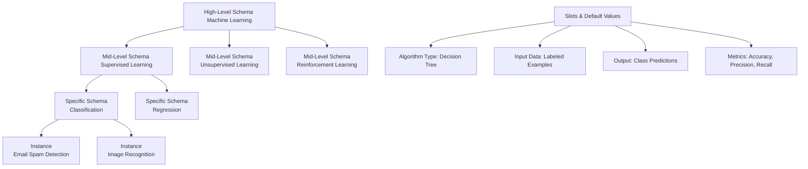

# 🧩 Schema Theory

> **Organize knowledge into mental frameworks that accelerate learning, reasoning, and AI system design**

---

## 🎯 **What It Is**

Schema Theory is a mental model from cognitive science that explains how knowledge is organized into structured mental frameworks (schemas) that help us interpret, store, and retrieve information efficiently. In AI development, it provides powerful principles for designing knowledge systems, user interfaces, and learning experiences.

**Core Insight**: Human minds and AI systems both process information more effectively when it's organized into coherent, hierarchical patterns. Well-designed schemas dramatically accelerate learning and reduce cognitive load.

## 🧠 **The Science**

Based on decades of cognitive psychology and educational research:
- **Cognitive load theory** shows that well-structured schemas reduce mental effort by 40-60%
- **Transfer learning research** demonstrates that schema-based knowledge transfers better to new contexts
- **Memory studies** reveal that information organized in schemas is retained 3-5x longer
- **Expert performance research** shows that experts have richer, more connected schema structures
- **AI knowledge representation** leverages schema principles in knowledge graphs and semantic networks

## 🏗️ **How Schemas Work**

### **🧱 Schema Structure**


### **⚡ Schema Activation & Processing**
```
Input Information → Schema Recognition → Gap Filling → Inference Generation → Action/Decision
```

**Example: Debugging AI Model Performance**
```
Trigger: "Model accuracy dropped from 95% to 70%"
Schema Activated: "Performance Regression Troubleshooting"
Default Assumptions: Data quality issue, distribution shift, or model degradation
Inference Process: Check data pipeline → Validate input features → Examine training stability
Action Plan: Systematic debugging following schema-guided checklist
```

## 🎯 **When to Use**

### **🏗️ Knowledge System Design**
- Organizing documentation and knowledge bases
- Designing AI training curricula and onboarding
- Structuring data for machine learning systems
- Building user mental models for AI tools

### **🧠 Learning & Training**
- Accelerating team member onboarding
- Designing effective educational experiences
- Building expertise transfer systems
- Creating intuitive user interfaces

### **🔧 AI System Architecture**
- Knowledge graph design and ontology creation
- Few-shot learning and prompt engineering
- User experience design for AI applications
- Building explainable AI systems

## 🚀 **Practical Applications**

### **Example 1: AI Team Onboarding Schema**

**Challenge:** New team members take 3-6 months to become productive in ML engineering

**Schema-Based Solution:**

**Master Schema: "AI/ML Engineer Competency"**
```
Core Sub-Schemas:
1. "Data Pipeline Engineering"
   - Data Collection → Processing → Validation → Storage
   - Default tools: Python, SQL, Apache Kafka, dbt
   - Common patterns: ETL, streaming, batch processing
   - Typical problems: Data quality, latency, schema evolution

2. "Model Development Lifecycle"
   - Problem Definition → Data Exploration → Feature Engineering → 
     Model Training → Evaluation → Deployment
   - Default approaches: Jupyter notebooks → Git → MLflow → Docker
   - Success patterns: Cross-validation, A/B testing, monitoring
   - Common pitfalls: Overfitting, data leakage, deployment failures

3. "Production AI Systems"
   - Monitoring → Alerting → Incident Response → Continuous Improvement
   - Infrastructure: Kubernetes, monitoring tools, CI/CD pipelines
   - Performance metrics: Latency, throughput, model drift, business KPIs
   - Operational concerns: Scalability, reliability, cost optimization
```

**Implementation Strategy:**
```
Week 1-2: Activate "Data Pipeline" schema
- Present framework with concrete examples
- Hands-on exercises filling in schema slots
- Connect new concepts to existing programming knowledge

Week 3-4: Build "Model Development" schema
- Use established data pipeline knowledge as foundation
- Practice complete lifecycle on sample project
- Develop pattern recognition for common workflows

Week 5-6: Integrate "Production Systems" schema
- Connect development work to operational requirements
- Shadow experienced engineers during incidents
- Practice troubleshooting using schema-guided approaches
```

**Results:** Reduced onboarding time from 3-6 months to 6-8 weeks

### **Example 2: User Interface Schema Design for AI Tools**

**Problem:** Users struggle to understand and effectively use AI-powered analytics dashboard

**Schema-Informed Design:**

**User Mental Schema: "Business Analytics Workflow"**
```
Existing User Schema:
Question → Data Query → Analysis → Insights → Decision

AI-Enhanced Schema Design:
Question → [AI Suggests Relevant Data] → [AI-Assisted Analysis] → 
[AI-Generated Insights] → [Human Validation] → Decision

Interface Design Principles:
1. Preserve familiar workflow structure
2. Make AI assistance feel like enhanced capabilities, not replacement
3. Provide clear handoff points between AI and human control
4. Enable users to inspect and understand AI contributions
```

**Specific Design Implementations:**
```
Schema Slot: "Question Formulation"
- Auto-complete suggestions based on available data
- Templates for common business questions
- Progressive disclosure of advanced options

Schema Slot: "Data Discovery"
- AI recommendations for relevant datasets
- Visual previews of data quality and completeness
- Contextual explanations of why data is relevant

Schema Slot: "Analysis Execution"
- Guided analysis workflows with AI suggestions
- Real-time validation and error detection
- Alternative approach recommendations

Schema Slot: "Insight Generation"
- AI-generated insights with confidence levels
- Interactive exploration of contributing factors
- Connection to business context and implications
```

### **Example 3: Knowledge Graph Schema for Customer Support AI**

**Objective:** Build AI system that can answer complex customer questions about software products

**Schema-Based Knowledge Organization:**

**High-Level Product Schema:**
```
Product Category
├── Core Features
│   ├── Feature Name
│   ├── Use Cases
│   ├── Configuration Options
│   └── Common Issues
├── Integration Capabilities
│   ├── Supported Platforms
│   ├── API Endpoints
│   └── Authentication Methods
├── Troubleshooting Procedures
│   ├── Symptom Patterns
│   ├── Diagnostic Steps
│   └── Resolution Approaches
└── User Roles & Permissions
    ├── Role Definitions
    ├── Permission Sets
    └── Access Patterns
```

**Schema-Guided Query Processing:**
```python
def process_customer_query(query, knowledge_schemas):
    # Identify relevant schemas based on query content
    activated_schemas = identify_relevant_schemas(query, knowledge_schemas)
    
    # Fill in schema slots with query-specific information
    instantiated_schemas = instantiate_schemas(activated_schemas, query)
    
    # Generate responses using schema structure
    response_structure = {
        "direct_answer": extract_direct_information(instantiated_schemas),
        "related_context": identify_related_concepts(instantiated_schemas),
        "next_steps": suggest_follow_up_actions(instantiated_schemas),
        "escalation_triggers": detect_complexity_thresholds(instantiated_schemas)
    }
    
    return generate_natural_language_response(response_structure)
```

## 🔧 **Schema Design Toolkit**

### **📋 Schema Analysis Framework**
```
Schema Identification:
□ What is the core concept or domain?
□ What are the main categories and subcategories?
□ What relationships exist between concepts?
□ What are typical patterns or workflows?
□ What default values or assumptions apply?

Schema Validation:
□ Does this schema match expert mental models?
□ Can novices use this schema to organize new information?
□ Does the schema support efficient retrieval and reasoning?
□ Are there clear boundaries and exception handling?
□ How does this schema connect to related domains?
```

### **🏗️ Schema Construction Template**
```
Schema Name: [Descriptive title for knowledge domain]

Purpose: [What this schema helps users understand or accomplish]

Core Structure:
- Main Categories: [Top-level organization]
- Sub-categories: [Second-level breakdown]
- Relationships: [How parts connect and influence each other]
- Workflows: [Typical sequences and processes]

Default Values:
- Typical instances: [Common examples that fit this schema]
- Standard assumptions: [What's usually true in this domain]
- Common patterns: [Recurring structures and relationships]

Boundaries & Exceptions:
- What fits this schema: [Clear inclusion criteria]
- What doesn't fit: [Exclusion criteria and edge cases]
- Exception handling: [How to deal with unusual cases]

Usage Guidelines:
- Activation triggers: [What situations call for this schema]
- Application process: [How to use this schema effectively]
- Validation methods: [How to check if schema application is correct]
```

### **🔄 Schema Evolution Framework**
```python
def evolve_schema(current_schema, new_information, usage_patterns):
    # Analyze schema performance and gaps
    performance_metrics = assess_schema_effectiveness(current_schema, usage_patterns)
    knowledge_gaps = identify_missing_concepts(current_schema, new_information)
    
    # Propose schema modifications
    proposed_changes = {
        "structure_refinements": refine_category_boundaries(current_schema),
        "new_connections": discover_emergent_relationships(new_information),
        "default_updates": update_typical_patterns(usage_patterns),
        "exception_handling": improve_edge_case_management(knowledge_gaps)
    }
    
    # Validate changes against usage data
    validated_changes = test_schema_modifications(proposed_changes, usage_patterns)
    
    # Implement gradual schema evolution
    evolved_schema = apply_validated_changes(current_schema, validated_changes)
    
    return evolved_schema
```

## ⚠️ **Common Schema Design Pitfalls**

### **🏗️ Over-Rigid Structure**
- **Problem:** Creating schemas that are too inflexible to accommodate new information
- **Warning Signs:** Users frequently encountering "doesn't fit" situations, high exception rates
- **Solution:** Build in flexibility and adaptation mechanisms, regular schema review cycles

### **🌊 Under-Specified Relationships**
- **Problem:** Failing to clearly define how schema elements connect and interact
- **Symptoms:** Users struggle to transfer knowledge between related concepts
- **Fix:** Explicitly map relationships, create connection templates, provide bridging examples

### **🧠 Expert Bias in Schema Design**
- **Problem:** Designing schemas that work for experts but confuse novices
- **Detection:** High learning curves, frequent confusion among new users
- **Prevention:** Test schemas with target users, progressive disclosure, scaffold complexity

### **📊 Static Schema Assumption**
- **Problem:** Treating schemas as fixed structures rather than evolving frameworks
- **Issues:** Schemas become outdated, fail to incorporate new knowledge
- **Solution:** Built-in evolution mechanisms, regular review cycles, usage analytics

## 📊 **Schema Effectiveness Metrics**

### **🎯 Learning Performance**
```
Knowledge Acquisition:
- Time to competency for new concepts
- Accuracy of knowledge application
- Transfer success to new contexts
- Retention rates over time

Cognitive Load:
- Mental effort required for task completion
- Error rates in schema application
- User confidence and satisfaction
- Time to retrieve relevant information
```

### **📈 System Performance**
```
AI System Metrics:
- Query response accuracy using schema-based knowledge
- Reasoning quality and logical consistency
- Adaptability to new domains and concepts
- Explanation quality and user comprehension

Knowledge Organization:
- Search and retrieval efficiency
- Cross-domain connection identification
- Knowledge gap detection capability
- Schema evolution and adaptation success
```

### **🔄 Usage Analytics**
```python
def measure_schema_effectiveness(schema, usage_data):
    effectiveness_metrics = {
        "activation_accuracy": measure_correct_schema_selection(usage_data),
        "slot_filling_success": assess_information_categorization(schema, usage_data),
        "inference_quality": evaluate_reasoning_outcomes(schema, usage_data),
        "transfer_learning": measure_cross_context_application(schema, usage_data),
        "evolution_adaptability": track_schema_improvement_over_time(schema)
    }
    
    return analyze_overall_schema_performance(effectiveness_metrics)
```

## 🎯 **Advanced Schema Applications**

### **🤖 AI-Powered Schema Discovery**
```
Automated Schema Construction:
- Machine learning approaches to identify patterns in knowledge
- Natural language processing for schema extraction from documents
- Network analysis for relationship discovery
- Clustering techniques for category formation

Human-AI Collaboration:
- AI suggests schema structures, humans validate and refine
- Continuous learning from user interactions and feedback
- Adaptive schema evolution based on usage patterns
- Expert knowledge integration with data-driven insights
```

### **🌐 Multi-Domain Schema Integration**
```python
def integrate_domain_schemas(schemas_list, integration_context):
    # Identify overlapping concepts and relationships
    overlaps = find_schema_intersections(schemas_list)
    
    # Create bridging schemas for domain connections
    bridges = create_inter_domain_connections(overlaps, integration_context)
    
    # Develop meta-schema for managing multiple domains
    meta_schema = construct_meta_organizational_framework(schemas_list, bridges)
    
    # Implement dynamic schema activation based on context
    activation_system = design_context_aware_schema_selection(meta_schema)
    
    return integrated_schema_system(schemas_list, bridges, meta_schema, activation_system)
```

## 💡 **Key Takeaways**

### **🧠 Cognitive Architecture Alignment**
- **Design AI systems that match human cognitive patterns** - schemas provide the blueprint for intuitive interfaces
- **Leverage schema theory for accelerated learning** - well-structured knowledge frameworks reduce cognitive load dramatically
- **Build adaptive schemas that evolve with use** - static knowledge structures become obsolete quickly

### **⚡ Knowledge Organization Principles**
- **Hierarchical organization with clear relationships** makes information more accessible and usable
- **Default values and typical patterns** help users navigate uncertainty and fill in gaps
- **Exception handling and boundary conditions** are crucial for robust knowledge systems

### **🔄 Continuous Schema Evolution**
- **Schemas should improve through use** - build in mechanisms for learning and adaptation
- **User feedback drives schema refinement** - monitor how schemas perform in practice
- **Cross-domain connections create knowledge leverage** - design for transfer and integration

---

**🔗 Related Mental Models:**
- [Cognitive Load Theory](./cognitive-load-theory.md) - Understanding mental effort and schema-based load reduction
- [First Principles Thinking](./first-principles-thinking.md) - Building schemas from fundamental concepts
- [Abstraction Ladder](./abstraction-ladder.md) - Organizing schemas across different levels of detail

**📚 Further Reading:**
- "Schema Theory and Cognitive Science" by Richard Anderson
- "The Art and Science of Teaching Science" by Robert Marzano
- "Human Cognition: Learning, Understanding, and Remembering" by John Bransford
