# 🌐 SECI Model

> **Transform tacit knowledge into organizational intelligence through systematic knowledge creation and sharing**

---

## 🎯 **What It Is**

The SECI Model is a mental model for understanding how knowledge is created and shared through four cyclical modes: **S**ocialization, **E**xternalization, **C**ombination, and **I**nternalization. It transforms individual tacit knowledge into organizational capability, making it particularly powerful for AI teams building complex systems.

**Core Insight**: The most valuable knowledge in AI development is often tacit (intuitive, experiential) and trapped in individual minds. SECI provides a systematic way to extract, formalize, and scale this knowledge across teams and systems.

## 🧠 **The Science**

Developed by Nonaka and Takeuchi based on decades of organizational learning research:
- **Knowledge conversion theory** shows that innovation happens through systematic knowledge transformation
- **Organizational learning research** demonstrates that companies with strong knowledge-sharing practices outperform competitors by 35-40%
- **Cognitive science** reveals that tacit knowledge (intuition, pattern recognition) is often more valuable than explicit knowledge
- **Team performance studies** show that knowledge-sharing teams solve complex problems 60% faster

## 🔄 **The SECI Cycle**

```mermaid
graph LR
    A[Socialization<br/>💬 Tacit → Tacit] --> B[Externalization<br/>📝 Tacit → Explicit]
    B --> C[Combination<br/>🔗 Explicit → Explicit]
    C --> D[Internalization<br/>🧠 Explicit → Tacit]
    D --> A
    
    E[Experience<br/>Sharing] --> F[Documentation<br/>& Articulation]
    F --> G[Systematic<br/>Integration]
    G --> H[Learning &<br/>Application]
    H --> E
```



### **🤝 Socialization** (Tacit → Tacit)
**Sharing experiential knowledge through direct interaction**

**What It Is:**
- Experienced practitioners share intuitive knowledge with newcomers
- Master-apprentice relationships and mentoring
- Informal conversations that reveal "how things really work"
- Observing experts in action to absorb tacit patterns

**AI Development Examples:**
```
Expert Data Scientist + Junior Analyst:
- Code reviews where senior explains intuitive design choices
- Pair programming sessions revealing debugging approaches
- Discussing model selection based on "feel" for the problem
- Sharing war stories about failed experiments and lessons learned

ML Engineer + Product Manager:
- Explaining why certain metrics "feel wrong" despite good numbers
- Sharing intuition about model behavior in edge cases
- Discussing user behavior patterns that suggest model limitations
- Communicating uncertainty and confidence levels in predictions
```

**Facilitation Strategies:**
- Regular code review sessions with storytelling
- Cross-functional project pairing
- "Coffee chat" programs between experts and learners
- Documentation of informal decision-making processes

### **📝 Externalization** (Tacit → Explicit)
**Converting intuitive knowledge into shareable forms**

**What It Is:**
- Articulating "gut feelings" and intuitive patterns
- Creating frameworks that capture expert decision-making
- Documenting the "why" behind successful approaches
- Translating experience into teachable principles

**AI Development Examples:**
```
Model Selection Expertise → Decision Framework:
- "I choose XGBoost for structured data" → Documented decision tree
- "This data feels dirty" → Data quality checklist
- "Model is overfitting" → Diagnostic flowchart
- "Feature seems important" → Feature importance methodology

Debugging Intuition → Systematic Process:
- "Something's wrong with the model" → Performance monitoring checklist
- "Data drift is happening" → Drift detection protocol
- "This result seems suspicious" → Validation procedure
- "Model needs retraining" → Retraining trigger criteria
```

**Documentation Techniques:**
- Decision trees for common choices
- Checklists for quality assessment
- Flowcharts for troubleshooting
- Templates for project setup and evaluation

### **🔗 Combination** (Explicit → Explicit)
**Integrating different sources of explicit knowledge**

**What It Is:**
- Combining documented knowledge from multiple sources
- Creating comprehensive knowledge bases and wikis
- Synthesizing research papers, best practices, and lessons learned
- Building systematic training materials and onboarding guides

**AI Development Examples:**
```
Integration Projects:
- Combining internal model guidelines + external research + vendor docs
- Merging data science best practices + engineering standards + product requirements
- Synthesizing multiple team's debugging guides into comprehensive handbook
- Creating unified evaluation framework from different project experiences

Knowledge Products:
- ML engineering playbook combining multiple team experiences
- Data pipeline design guide integrating various architectural patterns
- Model deployment checklist synthesizing DevOps + ML + security knowledge
- Troubleshooting guide combining multiple teams' incident learnings
```

**Knowledge Organization:**
- Structured wikis with clear categorization
- Searchable knowledge bases with tagging
- Version-controlled documentation repositories
- Cross-referenced guides and templates

### **🧠 Internalization** (Explicit → Tacit)
**Learning and applying explicit knowledge until it becomes intuitive**

**What It Is:**
- Practicing documented procedures until they become automatic
- Learning frameworks through hands-on application
- Developing intuition through repeated use of explicit guidelines
- Building pattern recognition through systematic experience

**AI Development Examples:**
```
Framework Application:
- Using model selection decision trees until choosing becomes intuitive
- Following debugging checklists until pattern recognition develops
- Applying data quality frameworks until "data smells" become automatic
- Using performance monitoring until anomaly detection becomes instinctive

Skill Development:
- Junior engineer practices code review checklist → develops code quality intuition
- New PM uses model evaluation framework → builds product sense for AI capabilities
- Data scientist applies feature engineering templates → develops feature intuition
- MLOps engineer follows deployment procedures → develops system reliability sense
```

**Learning Acceleration:**
- Hands-on projects with guided reflection
- Simulation exercises for rare scenarios
- Deliberate practice with expert feedback
- Progressive challenge with scaffolded support

## 🎯 **When to Use**

### **🚀 Team Onboarding & Training**
- Accelerating new team member integration
- Transferring knowledge from departing experts
- Scaling expertise across growing teams
- Creating consistent performance standards

### **📈 Knowledge Scaling**
- Converting individual expertise into team capability
- Building organizational learning systems
- Creating repeatable processes from ad-hoc success
- Developing institutional memory

### **🔧 Continuous Improvement**
- Capturing lessons learned from projects
- Systematizing informal best practices
- Building upon successful experiments
- Creating feedback loops for knowledge evolution

## 🚀 **Practical Applications**

### **Example 1: AI Model Development Team**

**Situation:** Senior ML engineer has exceptional intuition for model performance, but knowledge isn't transferring to junior team members

**SECI Implementation:**

**Socialization Phase:**
```
Activities:
- Pair programming sessions during model development
- Senior engineer talks through their thinking process live
- Junior engineers shadow during model debugging sessions
- Regular "war story" sessions sharing failed experiment experiences

Outcome: Junior engineers begin to recognize patterns in model behavior
```

**Externalization Phase:**
```
Activities:
- Senior engineer documents decision-making criteria
- Create flowcharts for model selection process
- Build checklists for performance evaluation
- Record video walkthroughs of debugging approaches

Outcome: Tacit expertise becomes teachable framework
```

**Combination Phase:**
```
Activities:
- Integrate senior engineer's framework with external research
- Combine with other team members' specializations
- Add vendor documentation and industry best practices
- Create comprehensive model development playbook

Outcome: Unified knowledge base for entire team
```

**Internalization Phase:**
```
Activities:
- Junior engineers practice using documented frameworks
- Apply checklists to real projects with mentoring
- Get feedback on decision-making process
- Build pattern recognition through guided experience

Outcome: Team develops collective intuition and expertise
```

### **Example 2: Data Engineering Knowledge Transfer**

**Challenge:** Complex data pipeline architecture knowledge concentrated in one expert who might leave the company

**SECI Solution:**

**Knowledge Extraction Strategy:**
```
Socialization: 
- Shadow experienced engineer during system maintenance
- Pair on new pipeline development projects
- Document informal troubleshooting conversations
- Create mentoring relationships with multiple team members

Externalization:
- Create system architecture documentation
- Document troubleshooting decision trees
- Build runbooks for common maintenance tasks
- Record video explanations of design decisions

Combination:
- Integrate with vendor documentation and industry patterns
- Combine with security, performance, and reliability requirements
- Create comprehensive pipeline design guidelines
- Build testing and validation frameworks

Internalization:
- New engineers practice on sandbox systems
- Apply guidelines to real projects with oversight
- Participate in incident response to build experience
- Gradually take ownership of system components
```

### **Example 3: AI Product Strategy Knowledge Sharing**

**Goal:** Scale product intuition about AI capabilities and limitations across product management team

**SECI Framework Application:**

**Current State:** One senior PM has deep understanding of AI/ML capabilities, but other PMs struggle with realistic goal-setting and feature planning

**Socialization Implementation:**
```
Cross-functional exposure:
- PMs attend ML engineering standups
- Shadow customer conversations about AI features
- Participate in model evaluation sessions
- Join post-mortem discussions for AI feature launches

Knowledge sharing activities:
- Weekly "AI intuition" coffee chats
- Peer review of product requirements with AI components
- Storytelling sessions about successful/failed AI features
- Cross-team project collaboration
```

**Externalization Outcomes:**
```
Documented frameworks:
- AI capability assessment matrix
- Technical feasibility evaluation checklists
- User expectation management guidelines
- AI feature success metrics templates

Decision support tools:
- Build vs. buy evaluation criteria for AI features
- Model performance trade-off communication guides
- Timeline estimation frameworks for ML projects
- Risk assessment templates for AI initiatives
```

## 🔧 **SECI Implementation Toolkit**

### **📋 Knowledge Audit Template**
```
Knowledge Asset: [Specific expertise or capability]

Current State:
□ Who has this knowledge? (Tacit knowledge holders)
□ How critical is this knowledge to team success?
□ What happens if this knowledge is lost?
□ How transferable is this knowledge currently?

SECI Readiness:
□ Socialization: Are experts available and willing to share?
□ Externalization: Can this knowledge be articulated and documented?
□ Combination: What other knowledge sources should be integrated?
□ Internalization: How can learners practice and develop this capability?
```

### **🔄 Knowledge Transfer Planning Matrix**

| SECI Phase | Activities | Tools | Success Metrics | Timeline |
|------------|------------|-------|-----------------|----------|
| **Socialization** | Mentoring, pairing, shadowing | Video calls, shared workspaces | Engagement level, relationship quality | 2-4 weeks |
| **Externalization** | Documentation, frameworks | Wikis, templates, videos | Documentation quality, comprehensiveness | 4-6 weeks |
| **Combination** | Integration, synthesis | Knowledge bases, playbooks | Knowledge coherence, usability | 2-3 weeks |
| **Internalization** | Practice, application | Projects, exercises, feedback | Skill demonstration, independence | 6-12 weeks |

### **📊 Knowledge Flow Tracking**
```python
def track_knowledge_flow(team, knowledge_asset):
    metrics = {
        "socialization": {
            "mentoring_sessions": count_mentor_interactions(team),
            "cross_functional_exposure": track_collaboration_events(team),
            "informal_knowledge_sharing": monitor_communication_patterns(team)
        },
        "externalization": {
            "documentation_creation": count_knowledge_artifacts(knowledge_asset),
            "framework_development": assess_structure_quality(knowledge_asset),
            "tacit_to_explicit_conversion": measure_articulation_success(knowledge_asset)
        },
        "combination": {
            "knowledge_integration": assess_synthesis_quality(knowledge_asset),
            "external_source_incorporation": track_external_references(knowledge_asset),
            "comprehensive_resource_creation": evaluate_completeness(knowledge_asset)
        },
        "internalization": {
            "practical_application": monitor_usage_patterns(team, knowledge_asset),
            "skill_development": assess_competency_growth(team),
            "independent_execution": measure_self_sufficiency(team, knowledge_asset)
        }
    }
    
    return analyze_knowledge_transformation_effectiveness(metrics)
```

## ⚠️ **Common SECI Pitfalls**

### **🎭 Knowledge Hoarding**
- **Problem:** Experts reluctant to share knowledge due to job security concerns
- **Solution:** Create incentive structures that reward knowledge sharing, make expertise visible and valued
- **Prevention:** Build knowledge sharing into performance evaluations and career advancement

### **📝 Documentation Overload**
- **Problem:** Over-emphasizing externalization without supporting other SECI phases
- **Solution:** Balance documentation with mentoring, practice, and integration activities
- **Warning Signs:** Extensive documentation that nobody uses or maintains

### **🧠 Tacit Knowledge Loss**
- **Problem:** Focusing only on explicit knowledge while ignoring valuable tacit insights
- **Solution:** Invest in socialization and create space for informal knowledge transfer
- **Detection:** New team members struggling despite good documentation

### **🔄 Broken Knowledge Cycles**
- **Problem:** Implementing only parts of SECI cycle without continuous flow
- **Solution:** Design complete knowledge transformation processes with feedback loops
- **Indicators:** Knowledge stagnation, repeated mistakes, slow learning curves

## 📊 **SECI Success Metrics**

### **🎯 Knowledge Transfer Effectiveness**
```
Socialization Metrics:
- Frequency and quality of mentoring interactions
- Cross-functional collaboration levels
- Informal knowledge sharing conversations
- Expert accessibility and engagement

Externalization Metrics:
- Volume and quality of knowledge documentation
- Framework adoption and usage rates
- Tacit knowledge conversion success stories
- Decision-making consistency across team

Combination Metrics:
- Knowledge base comprehensiveness and accuracy
- Integration of multiple knowledge sources
- Systematic knowledge organization quality
- Cross-reference utilization patterns

Internalization Metrics:
- Skill demonstration and competency growth
- Independent problem-solving capability
- Pattern recognition development
- Reduced dependence on experts for routine decisions
```

### **📈 Organizational Learning Outcomes**
```
Team Performance:
- Reduced onboarding time for new members
- Increased problem-solving speed and quality
- More consistent decision-making across projects
- Improved knowledge retention during team transitions

Innovation Capacity:
- Increased experimentation and creative problem-solving
- Better integration of external knowledge sources
- More rapid adaptation to new technologies and methods
- Enhanced collective intelligence and judgment

Risk Mitigation:
- Reduced single points of failure in critical knowledge
- Improved continuity during personnel changes
- Better institutional memory and lessons learned
- More robust knowledge-sharing culture
```

## 🎯 **Advanced SECI Strategies**

### **🌐 Digital Knowledge Ecosystems**
```
Technology-Enhanced SECI:
- AI-powered knowledge discovery and recommendation
- Video-based tacit knowledge capture and sharing
- Collaborative platforms for real-time knowledge combination
- Intelligent tutoring systems for accelerated internalization

Tools and Platforms:
- Knowledge graphs for relationship mapping
- Expert system development for tacit knowledge formalization
- Social learning platforms for peer-to-peer knowledge transfer
- Analytics dashboards for knowledge flow monitoring
```

### **🔄 Continuous Knowledge Evolution**
```python
def continuous_seci_cycle(organization):
    while True:
        # Monitor knowledge gaps and opportunities
        gaps = identify_knowledge_gaps(organization)
        opportunities = detect_knowledge_creation_opportunities(organization)
        
        # Execute SECI cycle for priority knowledge assets
        for knowledge_asset in prioritize(gaps + opportunities):
            socialization_activities = design_mentoring_programs(knowledge_asset)
            externalization_outputs = create_documentation_systems(knowledge_asset)
            combination_products = integrate_knowledge_sources(knowledge_asset)
            internalization_programs = develop_practice_opportunities(knowledge_asset)
            
            # Measure and iterate
            effectiveness = assess_knowledge_transfer_success(knowledge_asset)
            optimize_seci_approach(knowledge_asset, effectiveness)
            
        # Organizational learning and adaptation
        meta_knowledge = learn_from_seci_implementation(organization)
        improve_knowledge_culture(organization, meta_knowledge)
```

## 💡 **Key Takeaways**

### **🎯 Knowledge as Strategic Asset**
- **Tacit knowledge is often your most valuable competitive advantage** - invest in systematic capture and sharing
- **Knowledge that stays trapped in individual minds creates organizational fragility** - build resilient knowledge systems
- **The SECI cycle isn't linear - it's a spiral** that deepens understanding with each iteration

### **🤝 Culture of Knowledge Sharing**
- **Knowledge sharing must be rewarded and recognized** as essential to organizational success
- **Create psychological safety for knowledge exchange** - people share more when they feel valued, not threatened
- **Balance individual expertise with collective capability** - experts should be multipliers, not bottlenecks

### **⚡ Systematic Knowledge Transformation**
- **Design complete knowledge flows** from tacit insights to organizational capability
- **Use technology to amplify human knowledge sharing** rather than replacing human connection
- **Measure knowledge transfer effectiveness** and continuously improve the process

---

**🔗 Related Mental Models:**
- [Compound Growth](./compound-growth.md) - How knowledge sharing creates exponential organizational learning
- [Network Effects](./network-effects.md) - How knowledge connections create increasing value
- [Flow State Optimization](./flow-state-optimization.md) - Creating optimal conditions for knowledge transfer

**📚 Further Reading:**
- "The Knowledge-Creating Company" by Nonaka and Takeuchi
- "The Fifth Discipline" by Peter Senge
- "Communities of Practice" by Etienne Wenger
