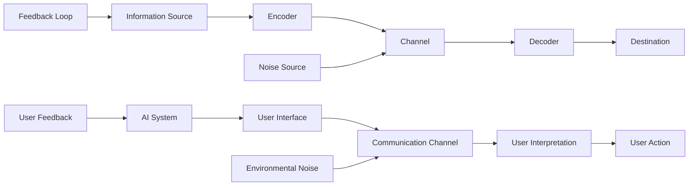
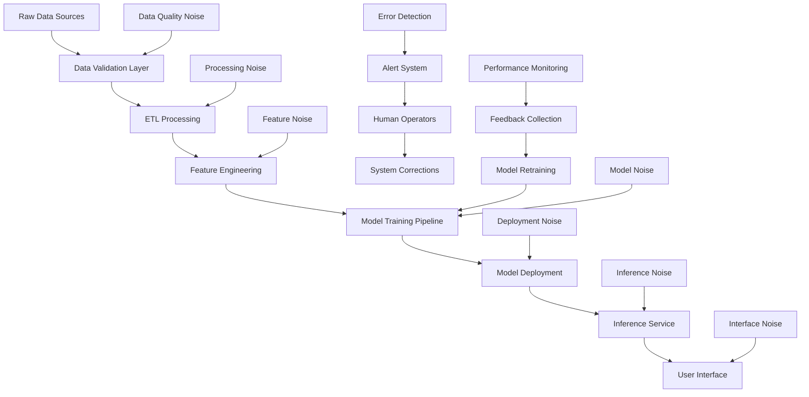
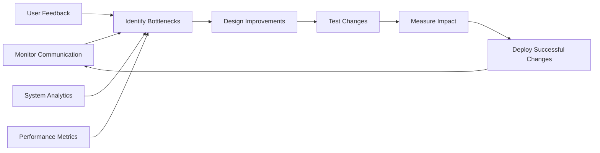

# 🔄 Shannon-Weaver Model

> **Design robust AI communication systems by understanding information transmission, noise, and feedback loops**

## 🎯 **What It Is**

The Shannon-Weaver Model is a foundational framework for understanding how information is encoded, transmitted through channels, and decoded between senders and receivers, accounting for noise interference and feedback mechanisms. Originally developed for telecommunications, this model provides crucial insights for designing effective AI systems, human-AI interfaces, and data communication architectures.

**Core Insight**: Every AI system involves information transmission between components, users, and environments. Understanding communication dynamics is essential for building reliable, interpretable, and user-friendly AI solutions.

## ⚡ **The Information Theory Behind It**

### **Classical Communication Framework**


**Key Components:**
- **Information Source**: Origin of the message (AI system, user, data)
- **Encoder**: Transforms information into transmittable format (UI, API, language)
- **Channel**: Medium through which information flows (interface, network, human perception)
- **Decoder**: Interprets received signals (user cognition, system parser, algorithm)
- **Destination**: Final recipient of information (user understanding, system state)
- **Noise**: Any interference that distorts the message (ambiguity, technical errors, bias)
- **Feedback**: Return information that enables adaptation and error correction

## 🎯 **When to Use**

### **🤖 AI System Design**
- Designing human-AI interaction interfaces and conversational systems
- Optimizing AI model communication and interpretability
- Building robust data pipelines and API architectures
- Creating effective AI explanation and feedback systems

### **📊 Information Architecture**
- Structuring AI training data and knowledge representations
- Designing prompt engineering and natural language interfaces
- Optimizing multi-modal AI communication (text, vision, speech)
- Creating reliable AI-to-AI communication protocols

### **🔧 System Reliability**
- Diagnosing AI communication failures and misunderstandings
- Building error detection and correction mechanisms
- Designing fault-tolerant AI systems and backup communication paths
- Optimizing signal-to-noise ratios in AI data processing

## 🛠️ **The Six-Component Communication Framework**

### **1️⃣ Information Source Analysis**
```
Definition: Identify and optimize the origin of information in AI systems

AI Applications:
• User Intent: Understanding what users are really trying to communicate
• Data Sources: Evaluating quality and relevance of training data
• System State: Internal AI system information that needs communication
• Context Information: Environmental and situational data

Optimization Strategies:
• Source Authentication: Verify reliability and authority of information sources
• Intent Clarification: Use disambiguation techniques to understand true user needs
• Data Quality Assessment: Implement source validation and credibility scoring
• Context Enrichment: Gather comprehensive situational information

Example - AI Chatbot:
Information Sources:
• User text input (explicit intent)
• Conversation history (context)
• User profile data (personalization context)
• Business rules and knowledge base (system knowledge)
• Real-time environmental data (situational context)

Source Quality Measures:
• User input clarity and completeness
• Historical conversation coherence
• Profile data accuracy and recency
• Knowledge base coverage and currency
• Environmental data reliability
```

### **2️⃣ Encoder Design and Optimization**
```
Definition: Transform information into formats suitable for transmission and processing

Encoding Challenges in AI:
• Natural Language → Machine Understanding
• User Intent → System Commands
• Complex Data → Simplified Representations
• Human Concepts → Mathematical Models
• Multimodal Information → Unified Representations

Encoding Strategies:
• Semantic Preservation: Maintain meaning through transformation
• Noise Resistance: Create encodings robust to interference
• Efficiency Optimization: Balance fidelity with transmission efficiency
• Cross-Modal Translation: Enable communication between different modalities

Example - Prompt Engineering:
Raw User Intent: "Help me write a good email"

Effective Encoding:
• Context: "I need to write a professional email to a client about project delays"
• Constraints: "Tone should be apologetic but confident, length ~200 words"
• Format: "Include: acknowledgment, explanation, solution, next steps"
• Success Criteria: "Should maintain client relationship and project momentum"

Poor Encoding:
• Vague: "Write an email"
• No Context: Missing recipient, purpose, constraints
• Ambiguous: "Good" email without defining success criteria
```

### **3️⃣ Channel Characteristics and Design**
```
Definition: The medium through which information flows between AI components and users

Channel Types in AI Systems:
• User Interfaces: Visual, conversational, gesture-based
• API Communications: REST, GraphQL, message queues
• Neural Network Pathways: Information flow through model layers
• Data Pipelines: ETL processes and streaming architectures
• Human Channels: Meetings, documentation, training

Channel Properties:
• Bandwidth: How much information can be transmitted
• Latency: Time delay in information transmission
• Reliability: Consistency and availability of the channel
• Security: Protection against unauthorized access or tampering
• Fidelity: Accuracy of information preservation during transmission

Optimization Principles:
• Channel Capacity: Maximize information throughput without overwhelming receiver
• Error Resilience: Design channels that gracefully handle transmission errors
• Adaptive Bandwidth: Adjust information density based on receiver capabilities
• Multi-Channel Redundancy: Use multiple channels for critical information

Example - AI Dashboard Design:
High-Bandwidth Channel: Detailed analytics with drill-down capabilities
Low-Bandwidth Channel: Summary notifications and alerts
Redundant Channels: Visual charts + numerical displays + audio alerts
Adaptive Channel: Complexity adjusts based on user expertise level
```

### **4️⃣ Noise Identification and Mitigation**
```
Definition: Interference that distorts, obscures, or corrupts information transmission

Types of Noise in AI Systems:

Technical Noise:
• Data Quality Issues: Missing, inconsistent, or corrupted data
• Processing Errors: Computational mistakes, rounding errors
• Network Issues: Latency, packet loss, bandwidth limitations
• Hardware Failures: Memory errors, storage problems

Semantic Noise:
• Ambiguous Language: Words or phrases with multiple meanings
• Cultural Differences: Varied interpretations across contexts
• Jargon and Technical Terms: Specialized language barriers
• Implicit Assumptions: Unstated background knowledge requirements

Cognitive Noise:
• User Mental Models: Mismatched expectations about AI behavior
• Attention Limitations: Information overload and cognitive burden
• Emotional State: How feelings affect information processing
• Confirmation Bias: Tendency to interpret information to confirm beliefs

Environmental Noise:
• Distractions: Competing information sources and interruptions
• Time Pressure: Rushed communication leading to errors
• Social Dynamics: Interpersonal factors affecting communication
• Organizational Context: Company culture and process constraints

Noise Mitigation Strategies:
• Redundancy: Repeat critical information through multiple channels
• Error Detection: Implement checksums, validation, and verification
• Clarification Protocols: Ask for confirmation and provide feedback
• Noise Filtering: Remove or reduce irrelevant information
• Adaptive Communication: Adjust based on detected noise levels
```

### **5️⃣ Decoder Optimization**
```
Definition: Interpret and reconstruct information from transmitted signals

Decoding Challenges in AI:
• Natural Language Understanding: Converting text to meaning
• Intent Recognition: Understanding user goals from ambiguous input
• Multi-Modal Integration: Combining information from different sources
• Context Application: Using background knowledge to interpret messages
• Uncertainty Handling: Dealing with incomplete or ambiguous information

Decoder Design Principles:
• Robust Interpretation: Handle variations and errors gracefully
• Context Integration: Use all available information for interpretation
• Uncertainty Quantification: Acknowledge and communicate confidence levels
• Progressive Refinement: Improve interpretation through interaction
• Error Recovery: Detect and correct interpretation mistakes

Example - AI Language Model Decoding:
Input: "Book me a table for two tomorrow at 7"

Decoding Process:
1. Lexical Analysis: Identify words and their grammatical roles
2. Semantic Parsing: Extract intent (reservation) and entities (quantity, time)
3. Context Integration: Use conversation history and user preferences
4. Ambiguity Resolution: Clarify AM/PM, restaurant preference, date
5. Action Planning: Generate appropriate reservation request
6. Confidence Assessment: Evaluate certainty of interpretation

Decoder Output:
• Primary Intent: Restaurant reservation
• Entities: Party size (2), Date (tomorrow), Time (7 PM - inferred)
• Confidence: 85% (time of day uncertain)
• Clarification Needed: "Did you mean 7 PM? Which restaurant would you prefer?"
```

### **6️⃣ Feedback Loop Implementation**
```
Definition: Return information that enables system adaptation and error correction

Feedback Types in AI Systems:
• Explicit Feedback: Direct user corrections and ratings
• Implicit Feedback: Behavioral signals and usage patterns
• System Feedback: Internal performance metrics and error signals
• Environmental Feedback: External context changes and outcomes

Feedback Mechanisms:
• Real-Time Adaptation: Immediate system adjustments based on feedback
• Learning Integration: Incorporating feedback into model training
• Error Correction: Fixing specific mistakes based on feedback
• Performance Monitoring: Tracking system effectiveness over time

Feedback Loop Design:
• Collection: Multiple channels for gathering feedback
• Processing: Automated analysis and pattern recognition
• Integration: Systematic incorporation into system behavior
• Validation: Verification that feedback improves performance

Example - Conversational AI Feedback:
Immediate Feedback:
• "That's not what I meant" → Trigger clarification dialogue
• Thumbs up/down → Reinforce or discourage response patterns
• Follow-up questions → Indicate insufficient initial response

Behavioral Feedback:
• User abandons conversation → Suggests frustration or completion
• User asks same question repeatedly → Indicates poor understanding
• User provides additional context → Shows initial response was incomplete

System Integration:
• Update response generation models based on feedback patterns
• Adjust confidence thresholds for different types of requests
• Personalize communication style based on user feedback history
• Identify and address systematic communication failures
```

## 📈 **Advanced Applications in AI Development**

### **🤖 Multi-Modal AI Communication**

**Cross-Modal Information Transmission:**
```python
class MultiModalCommunication:
    def __init__(self):
        self.modalities = {
            "text": {"bandwidth": "high", "precision": "high", "cognitive_load": "medium"},
            "speech": {"bandwidth": "medium", "precision": "medium", "cognitive_load": "low"},
            "visual": {"bandwidth": "very_high", "precision": "variable", "cognitive_load": "high"},
            "gesture": {"bandwidth": "low", "precision": "low", "cognitive_load": "very_low"}
        }
    
    def design_communication_strategy(self, information_type, user_context):
        strategy = {
            "primary_modality": self.select_optimal_modality(information_type, user_context),
            "backup_modalities": self.identify_redundant_channels(information_type),
            "noise_mitigation": self.plan_noise_reduction(user_context),
            "feedback_mechanisms": self.design_feedback_loops(information_type)
        }
        return strategy
    
    def encode_cross_modal(self, information, target_modalities):
        encoded_versions = {}
        for modality in target_modalities:
            encoded_versions[modality] = {
                "content": self.modality_specific_encoding(information, modality),
                "noise_resistance": self.add_error_correction(modality),
                "attention_optimization": self.optimize_for_attention(modality),
                "comprehension_aids": self.add_comprehension_support(modality)
            }
        return encoded_versions
```

### **🔧 AI Explainability Through Shannon-Weaver Lens**

**Explanation as Communication Process:**
```python
def design_ai_explanation_system():
    explanation_framework = {
        "information_source": {
            "model_internals": "Neural network activations and weights",
            "decision_logic": "Rules and heuristics used in decision-making",
            "training_data": "Examples and patterns from training set",
            "uncertainty_measures": "Confidence levels and prediction intervals"
        },
        
        "encoding_strategies": {
            "technical_users": {
                "format": "Detailed mathematical explanations",
                "vocabulary": "Technical ML terminology",
                "depth": "Full algorithmic details",
                "examples": "Code snippets and formulas"
            },
            "business_users": {
                "format": "High-level conceptual explanations", 
                "vocabulary": "Business domain terminology",
                "depth": "Key factors and relationships",
                "examples": "Analogies and real-world comparisons"
            },
            "end_users": {
                "format": "Simple, actionable explanations",
                "vocabulary": "Plain language", 
                "depth": "Just enough to support decision-making",
                "examples": "Concrete scenarios and outcomes"
            }
        },
        
        "channel_optimization": {
            "visual_explanations": "Charts, graphs, heatmaps for pattern display",
            "interactive_explanations": "Allow users to explore different scenarios",
            "progressive_disclosure": "Start simple, allow deeper exploration",
            "multi_format": "Text + visual + interactive combined"
        },
        
        "noise_reduction": {
            "jargon_elimination": "Avoid technical terms without context",
            "complexity_management": "Present information at appropriate level",
            "distraction_minimization": "Focus on most relevant explanation elements",
            "consistency_enforcement": "Use same terminology and concepts throughout"
        },
        
        "feedback_integration": {
            "comprehension_testing": "Check if explanations are understood",
            "usefulness_assessment": "Measure if explanations support decision-making",
            "adaptation_mechanisms": "Adjust explanation style based on feedback",
            "explanation_refinement": "Improve explanations based on user questions"
        }
    }
    return explanation_framework
```

### **📊 Data Pipeline Communication Architecture**

**Information Flow Optimization:**


**Communication Quality Metrics:**
```python
def measure_pipeline_communication():
    communication_metrics = {
        "data_fidelity": {
            "information_preservation": "Percentage of original data meaning maintained",
            "signal_to_noise_ratio": "Useful information vs. irrelevant data",
            "compression_efficiency": "Information density optimization",
            "error_propagation": "How errors multiply through pipeline stages"
        },
        
        "transmission_reliability": {
            "throughput": "Data processing speed and volume capacity",
            "latency": "Time from input to output",
            "availability": "System uptime and reliability",
            "error_rate": "Frequency of transmission failures"
        },
        
        "semantic_accuracy": {
            "meaning_preservation": "Accuracy of information interpretation",
            "context_maintenance": "Preservation of contextual information",
            "bias_propagation": "How biases spread through the pipeline",
            "uncertainty_tracking": "Maintenance of confidence measures"
        }
    }
    return communication_metrics
```

## 🚨 **Common Communication Failures and Solutions**

### **❌ Anti-Patterns in AI Communication**

**1. Information Overload**
```
❌ Problem: Providing too much information at once
Impact: User cognitive overload, decision paralysis, important information buried

✅ Solution: Progressive disclosure and adaptive information density
Implementation:
• Start with high-level summary, allow drill-down
• Prioritize information based on user goals and context
• Use visual hierarchy to guide attention
• Implement "just-in-time" information delivery
```

**2. Semantic Gaps**
```
❌ Problem: Mismatch between AI and human understanding of concepts
Impact: Misinterpretation, failed tasks, user frustration

✅ Solution: Shared vocabulary and meaning alignment
Implementation:
• Use domain-specific ontologies and terminology
• Provide definitions and examples for key concepts
• Implement disambiguation dialogues
• Regular vocabulary synchronization between AI and users
```

**3. Feedback Loop Failures**
```
❌ Problem: No mechanism for users to correct AI misunderstandings
Impact: Persistent errors, degraded user experience, system stagnation

✅ Solution: Multi-layer feedback integration
Implementation:
• Immediate correction mechanisms (undo, edit, clarify)
• Explicit feedback collection (ratings, comments)
• Implicit feedback monitoring (behavior, abandonment)
• Systematic feedback integration into model updates
```

**4. Channel Misalignment**
```
❌ Problem: Using inappropriate communication channels for information type
Impact: Inefficient communication, user confusion, missed information

✅ Solution: Channel-information matching framework
Implementation:
• Match information complexity to channel capacity
• Use multiple channels for redundancy and reinforcement
• Adapt channel choice to user preferences and context
• Monitor channel effectiveness and adjust accordingly
```

### **🛡️ Communication Robustness Framework**

**Error Detection and Recovery:**
```python
def implement_communication_robustness():
    robustness_strategies = {
        "error_detection": {
            "checksum_validation": "Verify information integrity during transmission",
            "semantic_validation": "Check if interpreted meaning matches intended meaning",
            "consistency_checking": "Ensure information coherence across interactions",
            "anomaly_detection": "Identify unusual patterns that might indicate errors"
        },
        
        "error_correction": {
            "automatic_correction": "Fix common errors without user intervention",
            "clarification_requests": "Ask users to provide additional information",
            "alternative_encodings": "Try different ways of expressing the same information",
            "fallback_channels": "Use backup communication methods when primary fails"
        },
        
        "graceful_degradation": {
            "partial_understanding": "Work with incomplete information when possible",
            "uncertainty_communication": "Clearly express confidence levels",
            "progressive_clarification": "Gradually improve understanding through interaction",
            "human_escalation": "Transfer to human agents when AI communication fails"
        }
    }
    return robustness_strategies
```

## 📊 **Measurement and Optimization Framework**

### **🎯 Communication Quality Metrics**

**Information Transmission Effectiveness:**
```python
def measure_communication_quality():
    quality_metrics = {
        "fidelity_measures": {
            "information_preservation": "Accuracy of information transfer from source to destination",
            "semantic_accuracy": "Correctness of meaning interpretation",
            "context_maintenance": "Preservation of relevant contextual information",
            "precision_recall": "Completeness and accuracy of information extraction"
        },
        
        "efficiency_measures": {
            "bandwidth_utilization": "Optimal use of available communication capacity",
            "latency_optimization": "Minimization of communication delays",
            "compression_ratio": "Information density without quality loss",
            "resource_efficiency": "Computational cost of communication processes"
        },
        
        "user_experience_measures": {
            "comprehension_rate": "Percentage of users who understand AI communications",
            "task_completion": "Success rate for user goals achieved through communication",
            "satisfaction_scores": "User ratings of communication quality",
            "error_recovery": "Effectiveness of handling communication failures"
        },
        
        "system_reliability": {
            "availability": "Uptime and accessibility of communication channels",
            "error_rate": "Frequency of communication failures", 
            "scalability": "Performance under increasing communication load",
            "adaptability": "Ability to adjust to changing communication needs"
        }
    }
    return quality_metrics
```

### **📈 Continuous Improvement Process**

**Communication Optimization Cycle:**


**Optimization Strategies:**
```python
def optimize_communication_continuously():
    optimization_cycle = {
        "monitoring_phase": {
            "real_time_metrics": "Track communication performance continuously",
            "user_behavior_analysis": "Monitor how users interact with AI communications",
            "error_pattern_identification": "Detect recurring communication problems",
            "performance_trending": "Identify gradual degradation or improvement"
        },
        
        "analysis_phase": {
            "bottleneck_identification": "Find communication limiting factors",
            "noise_source_analysis": "Identify primary sources of interference",
            "channel_effectiveness": "Evaluate different communication pathways",
            "user_segment_analysis": "Understand varying communication needs"
        },
        
        "improvement_phase": {
            "encoding_optimization": "Improve information formatting and presentation",
            "channel_enhancement": "Upgrade communication pathways and interfaces",
            "noise_reduction": "Implement better filtering and error correction",
            "feedback_integration": "Systematically incorporate user input"
        },
        
        "validation_phase": {
            "a_b_testing": "Compare communication approaches scientifically",
            "user_studies": "Gather qualitative feedback on communication changes",
            "performance_measurement": "Quantify improvement in communication metrics",
            "long_term_tracking": "Monitor sustained impact of changes"
        }
    }
    return optimization_cycle
```

## 🔗 **Integration with Other Mental Models**

### **🧠 Complementary Frameworks**

**Synergistic Combinations:**
- **[[Systems Thinking]]**: View communication as part of larger AI ecosystem
- **[[User Experience Design]]**: Apply Shannon-Weaver to interface design
- **[[Feedback Loops]]**: Deepen understanding of communication feedback mechanisms
- **[[Signal vs. Noise]]**: Focus on relevant information extraction and noise filtering
- **[[Information Architecture]]**: Structure information for optimal transmission

**Integration Examples:**
```python
def integrate_shannon_weaver_with_ux():
    integrated_design = {
        "information_architecture": {
            "shannon_weaver_application": "Map user information needs to communication pathways",
            "encoding_strategy": "Design information hierarchy for optimal transmission",
            "noise_reduction": "Remove UI elements that distract from core information"
        },
        
        "interaction_design": {
            "shannon_weaver_application": "Design interactions as communication protocols",
            "feedback_loops": "Create clear channels for user input and system response",
            "error_recovery": "Design graceful handling of communication failures"
        },
        
        "visual_design": {
            "shannon_weaver_application": "Use visual elements to optimize information encoding",
            "channel_design": "Create visual channels appropriate for information types",
            "noise_minimization": "Reduce visual clutter that interferes with communication"
        }
    }
    return integrated_design
```

## 🎯 **Advanced Mastery Guide**

### **📈 Skill Development Progression**

**Level 1: Basic Communication Analysis**
- Identify communication components in AI systems
- Recognize common sources of noise and interference
- Design basic feedback mechanisms

**Level 2: System-Level Communication Design**
- Optimize end-to-end communication workflows
- Integrate multiple communication channels effectively
- Implement robust error detection and correction

**Level 3: Advanced Communication Architecture**
- Design complex multi-modal communication systems
- Create adaptive communication that adjusts to context
- Build sophisticated feedback and learning loops

**Level 4: Communication Innovation**
- Develop novel communication paradigms for AI
- Create breakthrough solutions to communication challenges
- Design communication systems that enhance human-AI collaboration

**Level 5: Communication Leadership**
- Establish communication standards and best practices
- Train teams in communication design principles
- Drive organizational adoption of communication excellence

### **🛠️ Practical Application Framework**

**Daily Communication Design Practice:**
```python
def daily_communication_practice():
    practices = {
        "morning_analysis": {
            "communication_audit": "Identify one AI communication that could be improved",
            "noise_identification": "Find sources of interference in daily AI interactions",
            "feedback_assessment": "Evaluate quality of feedback loops in AI tools you use"
        },
        
        "design_exercises": {
            "encoding_practice": "Rewrite AI prompts for clarity and precision",
            "channel_optimization": "Choose optimal communication methods for different AI tasks",
            "noise_reduction": "Simplify complex AI information for different audiences"
        },
        
        "systematic_improvement": {
            "communication_measurement": "Track effectiveness of AI communication changes",
            "feedback_integration": "Systematically incorporate user feedback into AI interactions",
            "continuous_optimization": "Regular review and refinement of communication approaches"
        }
    }
    return practices
```

## 🏆 **Success Stories and Case Studies**

### **Case Study 1: AI Customer Service Chatbot**

**Challenge**: High user frustration with chatbot misunderstanding requests
**Shannon-Weaver Analysis**:
- **Noise Sources**: Ambiguous user language, missing context, technical jargon
- **Encoding Issues**: Overly formal bot responses, lack of confirmation
- **Feedback Gaps**: No easy way for users to correct misunderstandings

**Communication Redesign**:
- **Improved Encoding**: Natural language responses with confirmation requests
- **Noise Reduction**: Context gathering questions, disambiguation dialogues
- **Enhanced Feedback**: Quick correction buttons, satisfaction ratings

**Results**: 60% reduction in conversation abandonment, 45% improvement in task completion

### **Case Study 2: AI Data Analysis Dashboard**

**Challenge**: Executives struggling to understand AI-generated insights
**Communication Optimization**:
- **Information Source**: Complex statistical analyses and model outputs
- **Encoding Strategy**: Executive summary format with drill-down details
- **Channel Design**: Visual + textual + interactive presentation
- **Noise Reduction**: Eliminated statistical jargon, focused on business impact

**Outcome**: 3x increase in executive engagement with AI insights, faster strategic decision-making

## 🚀 **Takeaways and Next Steps**

### **Key Insights**
1. **AI is fundamentally about communication** - Every AI system involves information transmission between components and users
2. **Noise is everywhere** - Systematic identification and mitigation of interference improves AI effectiveness
3. **Feedback enables adaptation** - Well-designed feedback loops allow AI systems to continuously improve communication
4. **Context matters** - Optimal communication strategies depend on users, tasks, and environments

### **Implementation Roadmap**
1. **Communication Audit** - Analyze current AI communications using Shannon-Weaver framework
2. **Noise Identification** - Systematically identify sources of communication interference
3. **Feedback Enhancement** - Improve feedback mechanisms in AI systems
4. **Channel Optimization** - Match communication channels to information types and user needs
5. **Continuous Improvement** - Establish ongoing communication quality measurement and optimization

**Start Today:**
- Choose one AI system you interact with regularly
- Map its communication components using the Shannon-Weaver model
- Identify the three biggest sources of "noise" in that communication
- Design one improvement to reduce noise or enhance feedback
- Test the improvement and measure its impact on communication effectiveness

Remember: **Clear communication is the foundation of effective AI. Every improvement in AI communication quality multiplies the value of the underlying technology.**
