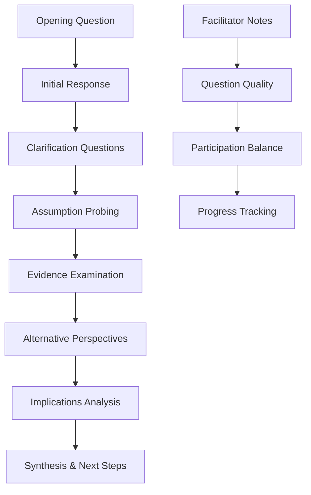
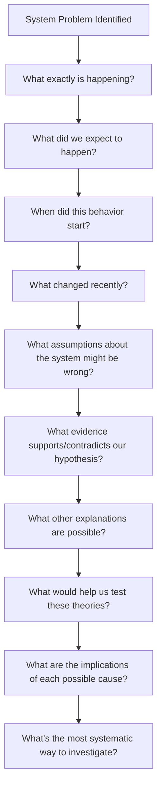

# 🪞 Socratic Questioning

> **Unlock deeper insights and better AI decisions through systematic inquiry and critical examination of assumptions**

## 🎯 **What It Is**

Socratic Questioning is a disciplined method of inquiry that stimulates critical thinking, clarifies concepts, and uncovers underlying assumptions through systematic, progressively deeper questioning. Named after the ancient Greek philosopher Socrates, this approach reveals knowledge gaps, challenges biases, and leads to more robust decision-making in AI development.

**Core Insight**: Rather than providing answers, Socratic questioning guides individuals and teams to discover insights through guided self-examination, leading to deeper understanding and more thoughtful decisions.

## ⚡ **The Philosophy Behind It**

### **Socratic Method Foundation**
```
"The unexamined life is not worth living" - Socrates

Traditional Approach:          Socratic Approach:
Statement → Acceptance         Question → Examination
Answer → Implementation        Inquiry → Understanding
Authority → Compliance        Evidence → Evaluation
Assumption → Action           Challenge → Clarity
```

**Key Principles:**
- **Intellectual Humility**: Acknowledging what we don't know
- **Systematic Inquiry**: Following logical chains of questions
- **Evidence-Based Reasoning**: Requiring support for claims
- **Assumption Examination**: Questioning foundational beliefs

## 🎯 **When to Use**

### **🧠 Critical Decision Points**
- Evaluating AI model architectures and approaches
- Defining project requirements and success criteria
- Assessing ethical implications of AI systems
- Debugging complex technical problems

### **👥 Team Collaboration**
- Facilitating productive disagreements
- Building consensus through shared understanding
- Onboarding new team members to complex projects
- Conducting retrospectives and post-mortems

### **🔍 Problem Investigation**
- Root cause analysis for system failures
- Understanding user behavior and needs
- Evaluating research findings and claims
- Assessing vendor solutions and technologies

## 🚀 **The Six Types of Socratic Questions**

### **1️⃣ Clarification Questions**
```
Purpose: Ensure clear understanding of concepts and statements

Examples:
• "What do you mean when you say this model is 'accurate'?"
• "Can you give me an example of what that would look like?"
• "How does this relate to what we discussed earlier?"
• "Could you put that in your own words?"

AI Application:
- Clarifying ML model requirements
- Defining success metrics and KPIs
- Understanding stakeholder expectations
- Aligning on technical terminology
```

### **2️⃣ Assumption-Probing Questions**
```
Purpose: Identify and examine underlying beliefs and assumptions

Examples:
• "What assumptions are you making about user behavior?"
• "Why do you think this approach will work?"
• "What if we assumed the opposite was true?"
• "How do we know this data is representative?"

AI Application:
- Challenging bias in training data
- Questioning model performance assumptions
- Examining fairness and ethical considerations
- Evaluating generalization claims
```

### **3️⃣ Evidence and Reasoning Questions**
```
Purpose: Examine the evidence and logic supporting conclusions

Examples:
• "What evidence supports this conclusion?"
• "How reliable is this source of information?"
• "What might contradict this evidence?"
• "How do we know this correlation indicates causation?"

AI Application:
- Validating experimental results
- Assessing data quality and sources
- Evaluating research paper claims
- Testing model interpretability
```

### **4️⃣ Perspective and Viewpoint Questions**
```
Purpose: Consider alternative viewpoints and broaden understanding

Examples:
• "How might our users see this differently?"
• "What are the strengths and weaknesses of this view?"
• "How might someone from [different background] respond?"
• "What alternative ways could we approach this?"

AI Application:
- Considering diverse user perspectives
- Evaluating multiple solution approaches
- Assessing impact on different stakeholders
- Exploring ethical implications
```

### **5️⃣ Implication and Consequence Questions**
```
Purpose: Explore the logical outcomes and consequences of ideas

Examples:
• "If we implement this, what are the likely consequences?"
• "How does this fit with what we know about [related topic]?"
• "What are the implications if we're wrong?"
• "What might be the unintended consequences?"

AI Application:
- Assessing deployment risks
- Evaluating scalability implications
- Considering long-term maintenance
- Identifying potential failure modes
```

### **6️⃣ Questions About Questions**
```
Purpose: Examine the inquiry process itself and its effectiveness

Examples:
• "Why is this question important?"
• "What does this question assume?"
• "Are we asking the right questions?"
• "How does this question help us understand the problem?"

AI Application:
- Refining problem statements
- Evaluating research methodologies
- Improving user research approaches
- Optimizing debugging processes
```

## 🛠️ **Practical Implementation Toolkit**

### **🎯 Socratic Session Framework**

**Pre-Session Preparation:**
```python
def prepare_socratic_session():
    session_prep = {
        "objective": "Define clear learning/decision goal",
        "participants": "Include diverse perspectives",
        "materials": "Gather relevant data and documentation", 
        "ground_rules": "Establish respectful inquiry norms",
        "time_allocation": "Plan question progression timing"
    }
    
    # Key Ground Rules
    ground_rules = [
        "Curiosity over judgment",
        "Questions welcome all perspectives", 
        "Evidence over authority",
        "Understanding over winning",
        "Productive discomfort is okay"
    ]
    
    return session_prep, ground_rules
```

**Session Structure:**


### **🔧 Question Quality Assessment**

**Effective Socratic Questions:**
```
✅ Open-ended (not yes/no)
✅ Non-leading (don't imply desired answer)
✅ Progressive (build on previous responses)
✅ Specific (target particular aspects)
✅ Constructive (advance understanding)

❌ Ineffective Questions:
❌ "Don't you think...?" (leading)
❌ "Isn't it true that...?" (yes/no)
❌ "Why didn't you consider...?" (accusatory)
❌ Random questions without logical flow
```

**Question Progression Template:**
```python
class SocraticQuestionFlow:
    def __init__(self, topic):
        self.topic = topic
        self.question_chain = []
    
    def build_question_sequence(self):
        sequence = {
            "level_1_surface": f"What do you mean by {self.topic}?",
            "level_2_assumption": f"What assumptions underlie your view of {self.topic}?",
            "level_3_evidence": f"What evidence supports this understanding?",
            "level_4_perspective": f"How might others view {self.topic} differently?",
            "level_5_implication": f"What are the consequences if this view is correct/incorrect?",
            "level_6_synthesis": f"How does this change our approach to {self.topic}?"
        }
        return sequence
    
    def adapt_to_responses(self, response, question_level):
        # Dynamic question adaptation based on responses
        if "uncertain" in response.lower():
            return "What would help us gain more certainty?"
        elif "obvious" in response.lower():
            return "What makes this seem obvious? Could there be hidden complexity?"
        elif "impossible" in response.lower():
            return "What would need to change to make this possible?"
        
        return f"Can you elaborate on that aspect of {self.topic}?"
```

## 📈 **Advanced Applications in AI Development**

### **🔍 AI Model Evaluation Framework**

**Traditional Model Review:**
```python
def traditional_model_review():
    checks = [
        "Check accuracy metrics",
        "Review training performance", 
        "Test on validation set",
        "Deploy if metrics acceptable"
    ]
    return "SURFACE_LEVEL_VALIDATION"
```

**Socratic Model Evaluation:**
```python
def socratic_model_evaluation():
    inquiry_dimensions = {
        "data_assumptions": [
            "What do we assume about data representativeness?",
            "How might our training data be biased?",
            "What real-world scenarios aren't captured?",
            "What happens if data distributions shift?"
        ],
        
        "performance_claims": [
            "What does 'good performance' mean for our users?",
            "Are we measuring what actually matters?",
            "What edge cases might reveal weaknesses?",
            "How confident should we be in these metrics?"
        ],
        
        "ethical_implications": [
            "Who might be harmed by this model's decisions?",
            "What biases might be amplified?",
            "How transparent are the model's decisions?",
            "What happens when the model is wrong?"
        ],
        
        "deployment_readiness": [
            "What could go wrong in production?",
            "How will we know if the model is degrading?",
            "What human oversight is needed?",
            "How will we handle unexpected inputs?"
        ]
    }
    
    return "COMPREHENSIVE_CRITICAL_ANALYSIS"
```

### **🎯 Requirements Gathering Through Inquiry**

**Socratic Requirements Discovery:**
```python
class SocraticRequirementsGathering:
    def __init__(self, stakeholder):
        self.stakeholder = stakeholder
        self.assumptions_uncovered = []
        self.requirements_refined = []
    
    def explore_user_needs(self):
        inquiry_flow = {
            "surface_request": "What do you want the AI system to do?",
            
            "deeper_purpose": "Why is this important to you/your users?",
            
            "context_exploration": "When and where would this be used?",
            
            "success_definition": "How would you know if this was working well?",
            
            "failure_scenarios": "What would 'failure' look like?",
            
            "constraint_discovery": "What limitations should we be aware of?",
            
            "value_clarification": "What trade-offs are you willing to make?",
            
            "stakeholder_impact": "Who else would be affected by this system?"
        }
        return inquiry_flow
    
    def challenge_assumptions(self, initial_requirement):
        probing_questions = [
            f"You mentioned {initial_requirement}. What makes you believe this is the best approach?",
            f"What if we solved the underlying problem differently?",
            f"How do you know users actually want this feature?",
            f"What assumptions are we making about user behavior?",
            f"Could this requirement conflict with other user needs?"
        ]
        return probing_questions
```

### **🔧 Debugging Through Systematic Inquiry**

**Socratic Debugging Process:**


## 🚨 **Common Pitfalls and How to Avoid Them**

### **❌ Anti-Patterns**

**1. Interrogation vs. Inquiry**
```
❌ Aggressive questioning that makes people defensive
✅ Collaborative exploration that builds understanding

❌ "Why didn't you think of X?" (accusatory)
✅ "Help me understand how we might consider X" (exploratory)
```

**2. Analysis Paralysis**
```
❌ Endless questions without moving toward decisions
✅ Progressive inquiry that builds toward actionable insights

Strategy: Set time bounds and decision checkpoints
```

**3. Leading Questions**
```
❌ "Don't you think we should use neural networks?"
✅ "What factors should influence our choice of model architecture?"
```

**4. Surface-Level Questioning**
```
❌ Stopping at first-level responses
✅ Following question chains to deeper insights

Example:
Q: "What metric should we optimize?"
A: "Accuracy"
Q: "What do you mean by accuracy in this context?"
A: "Correct predictions"
Q: "Correct according to whom or what standard?"
A: "Well, that's actually unclear..."
```

### **🛡️ Mitigation Strategies**

**Creating Psychological Safety:**
```python
def establish_inquiry_culture():
    principles = {
        "normalize_not_knowing": "It's okay to say 'I don't know'",
        "reward_good_questions": "Celebrate thoughtful inquiry",
        "model_intellectual_humility": "Leaders should question their own assumptions",
        "focus_on_learning": "Emphasize discovery over being right",
        "protect_vulnerability": "Support people who admit uncertainty"
    }
    return principles
```

**Balancing Speed and Depth:**
```python
def optimize_inquiry_timing():
    guidelines = {
        "rapid_decisions": "Use focused question sets (3-5 key questions)",
        "complex_problems": "Allow time for multi-layered inquiry",
        "team_meetings": "Reserve 20% of time for assumption challenges",
        "individual_work": "Build in reflection checkpoints",
        "crisis_mode": "Focus on critical assumption validation"
    }
    return guidelines
```

## 📊 **Measurement and Success Metrics**

### **🎯 Individual Level Metrics**

**Critical Thinking Development:**
```python
def assess_socratic_impact():
    metrics = {
        "question_quality": {
            "depth": "Number of question layers before reaching insights",
            "relevance": "Percentage of questions that advance understanding",
            "construction": "Use of open-ended vs. leading questions"
        },
        
        "assumption_identification": {
            "frequency": "Number of assumptions challenged per session",
            "accuracy": "Percentage of identified assumptions that proved problematic",
            "impact": "Decisions changed based on assumption challenges"
        },
        
        "evidence_evaluation": {
            "thoroughness": "Sources and types of evidence considered", 
            "objectivity": "Willingness to consider contradictory evidence",
            "application": "Use of evidence in decision-making"
        }
    }
    return metrics
```

### **🏢 Team Level Metrics**

**Collaborative Inquiry Effectiveness:**
```python
def measure_team_inquiry():
    team_metrics = {
        "decision_quality": {
            "deliberation_time": "Time spent on critical examination",
            "perspective_diversity": "Number of viewpoints considered",
            "assumption_validation": "Percentage of assumptions tested before decision"
        },
        
        "learning_outcomes": {
            "insight_generation": "Novel insights per inquiry session",
            "knowledge_transfer": "Cross-team learning from inquiry processes",
            "skill_development": "Improvement in questioning abilities"
        },
        
        "cultural_indicators": {
            "psychological_safety": "Comfort with admitting uncertainty",
            "intellectual_humility": "Willingness to change views based on evidence",
            "curiosity_culture": "Frequency of spontaneous questioning"
        }
    }
    return team_metrics
```

### **🚀 Project Level Metrics**

**Decision and Outcome Quality:**
```python
def track_inquiry_impact():
    project_metrics = {
        "decision_robustness": {
            "assumption_accuracy": "Percentage of assumptions that held true",
            "risk_identification": "Percentage of risks identified early",
            "adaptability": "Ability to pivot when assumptions proved wrong"
        },
        
        "problem_solving": {
            "root_cause_accuracy": "Percentage of correctly identified root causes",
            "solution_effectiveness": "Success rate of solutions developed through inquiry",
            "debugging_efficiency": "Time to resolve issues using systematic questioning"
        },
        
        "innovation_outcomes": {
            "novel_approaches": "New solutions discovered through questioning",
            "breakthrough_insights": "Paradigm shifts enabled by assumption challenges",
            "creative_synthesis": "Unexpected connections made through inquiry"
        }
    }
    return project_metrics
```

## 🔗 **Integration with Other Mental Models**

### **🧠 Complementary Frameworks**

**Synergistic Combinations:**
- **[[First Principles Thinking]]**: Use Socratic questions to break down to fundamentals
- **[[Devil's Advocate]]**: Systematically challenge through structured inquiry
- **[[Five Whys]]**: Extend with broader questioning beyond just "why"
- **[[Systems Thinking]]**: Question system boundaries and interactions
- **[[Red Team Thinking]]**: Use adversarial questions to test robustness

**Integration Examples:**
```python
def combine_with_first_principles():
    # Socratic questioning to reach first principles
    questions = [
        "What do we know to be true about this problem?",
        "How do we know this is true?",
        "What are we assuming that might not be true?",
        "If we started from scratch, how would we approach this?",
        "What fundamental constraints actually exist vs. what we assume exist?"
    ]
    return questions

def enhance_five_whys():
    # Expand beyond just "why" questions
    enhanced_inquiry = [
        "Why does this happen?",
        "What evidence supports this explanation?", 
        "What alternative explanations are possible?",
        "How do we know this is the actual cause?",
        "What assumptions underlie this causal chain?"
    ]
    return enhanced_inquiry
```

## 🎯 **Advanced Mastery Guide**

### **📈 Skill Development Progression**

**Level 1: Basic Question Asking**
- Use the six types of Socratic questions
- Practice non-leading question construction
- Focus on one inquiry dimension at a time

**Level 2: Dynamic Questioning**
- Adapt questions based on responses
- Build progressive question chains
- Balance depth with time constraints

**Level 3: Facilitation Mastery**
- Guide group inquiry effectively
- Manage defensive responses
- Create psychological safety for exploration

**Level 4: Strategic Application**
- Use inquiry to drive organizational learning
- Apply Socratic methods to complex system problems
- Integrate with other decision-making frameworks

**Level 5: Cultural Transformation**
- Embed inquiry culture in teams and organizations
- Train others in Socratic questioning
- Create systems that promote continuous examination

### **🎯 Practice Exercises**

**Daily Practice:**
```python
def daily_socratic_practice():
    exercises = {
        "morning_assumption_check": "What am I assuming about today that might not be true?",
        "decision_examination": "What evidence supports this choice?", 
        "problem_reframing": "What if the real problem is different from what I think?",
        "perspective_taking": "How would [different stakeholder] view this?",
        "evening_reflection": "What questions should I have asked today that I didn't?"
    }
    return exercises
```

**Team Workshops:**
```python
def team_socratic_workshops():
    workshop_formats = {
        "assumption_mapping": "Map and challenge project assumptions collectively",
        "question_storm": "Generate questions about complex problems before solutions",
        "perspective_carousel": "Rotate through different stakeholder viewpoints", 
        "evidence_evaluation": "Critically examine supporting evidence for key decisions",
        "implication_analysis": "Explore consequences of different approaches"
    }
    return workshop_formats
```

## 🏆 **Success Stories and Case Studies**

### **Case Study 1: ML Model Bias Discovery**

**Situation**: Team confident in fair hiring AI model
**Socratic Process**: 
- "What do we mean by 'fair' in this context?"
- "What assumptions are we making about our training data?"
- "How might historical hiring patterns influence the model?"
- "What evidence do we have that the model treats all groups equally?"

**Outcome**: Discovered significant bias issues, redesigned training approach, created more robust fairness testing

### **Case Study 2: Product Requirements Clarification**

**Situation**: Stakeholder requested "intelligent automation"
**Socratic Process**:
- "What specific tasks should be automated?"
- "What makes this 'intelligent' vs. simple automation?"
- "How will users know the system is working correctly?"
- "What should happen when the automation encounters edge cases?"

**Outcome**: Refined requirements from vague request to specific, testable implementation plan

## 🚀 **Takeaways and Next Steps**

### **Key Insights**
1. **Questions are more powerful than answers** - They drive deeper thinking and uncover hidden assumptions
2. **Progressive inquiry reveals layers** - Surface questions lead to deeper understanding through systematic exploration
3. **Cultural transformation required** - Socratic questioning thrives in psychologically safe environments
4. **Balance speed and depth** - Adapt inquiry intensity to decision importance and time constraints

### **Implementation Roadmap**
1. **Personal Skill Building** - Practice question construction and assumption identification
2. **Team Integration** - Introduce Socratic methods in meetings and decision processes
3. **Process Enhancement** - Build inquiry checkpoints into development workflows
4. **Cultural Development** - Foster environment that rewards questioning and intellectual humility

**Start Today:**
- Identify one assumption you're making about a current AI project
- Ask three "why" questions about a recent decision
- Practice reformulating statements as open-ended questions
- Schedule time for assumption mapping in your next team meeting

Remember: **The goal isn't to have all the answers, but to ask increasingly better questions that lead to deeper understanding and more robust decisions.**
