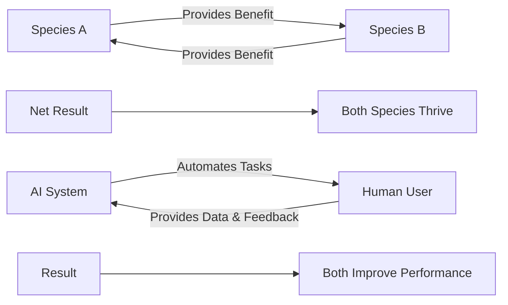
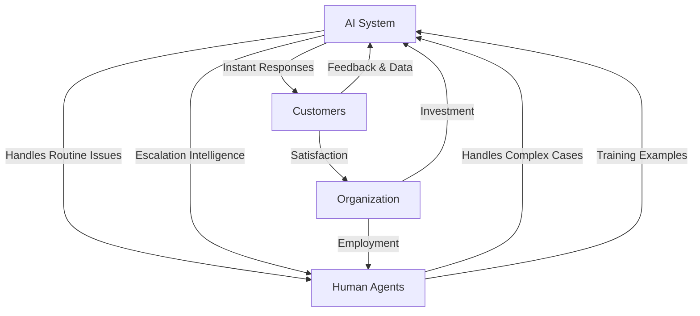
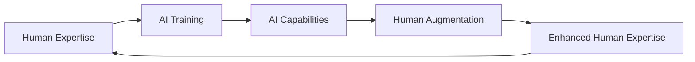
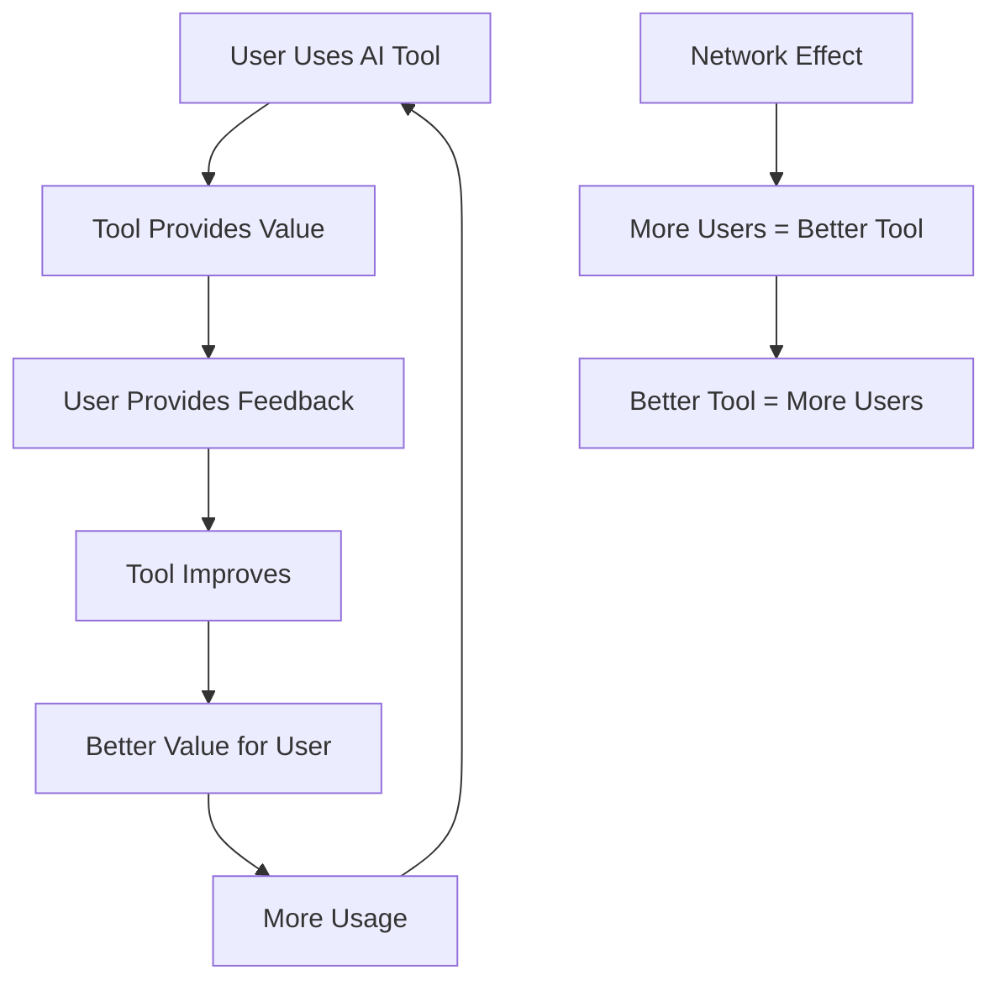
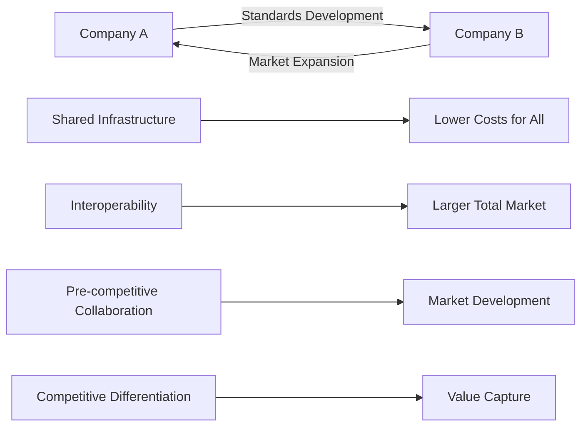
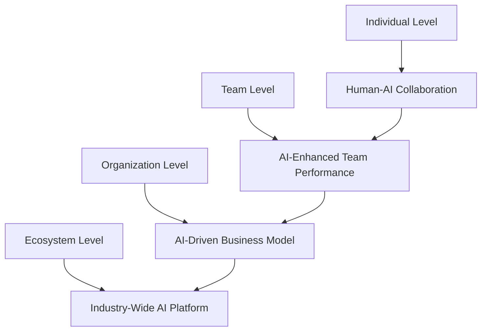

# 🤝 Symbiosis Framework

> **Design mutually beneficial relationships between AI systems, humans, and organizations for sustainable growth**

## 🎯 **What It Is**

The Symbiosis Framework is a mental model borrowed from biology that helps you design relationships where AI systems, humans, and organizations benefit each other, creating sustainable value that grows stronger over time rather than extractive relationships that deplete resources.

**Core Insight**: The most successful AI implementations create mutualistic relationships where all parties benefit and the relationship itself becomes more valuable than the sum of its parts.

## ⚡ **The Biology Behind It**



**Types of Symbiosis:**
- **Mutualism**: Both parties benefit (AI + Human collaboration)
- **Commensalism**: One benefits, other unaffected (AI assists without burden)
- **Parasitism**: One benefits at expense of other (AI replaces without value)

## 🎯 **When to Use**

### **🤝 Human-AI Collaboration Design**
- Creating AI systems that enhance rather than replace humans
- Designing feedback loops that improve both AI and human performance
- Building sustainable adoption patterns

### **🏢 Organizational AI Integration**
- Implementing AI that strengthens organizational capabilities
- Creating AI systems that grow more valuable with use
- Designing change management for AI adoption

### **🌐 Ecosystem Strategy**
- Building AI platforms that benefit all participants
- Creating network effects through symbiotic relationships
- Designing sustainable competitive advantages

## 🚀 **Practical Applications**

### **Example: AI-Human Writing Collaboration**

**❌ Parasitic Relationship:**
```python
def parasitic_ai_writing():
    # AI replaces human writer entirely
    human_input = get_topic()
    ai_output = generate_complete_article(human_input)
    
    # Human value: Diminished (just topic provider)
    # AI value: High (does all work)
    # Sustainability: Low (humans lose skills, become dependent)
    
    return "UNSUSTAINABLE_REPLACEMENT"
```

**✅ Mutualistic Relationship:**
```python
def symbiotic_ai_writing():
    # AI and human collaborate, both improve
    human_ideas = brainstorm_concepts()
    ai_structure = suggest_outline(human_ideas)
    human_refined = refine_outline(ai_structure)
    ai_draft = generate_sections(human_refined)
    human_edited = edit_and_enhance(ai_draft)
    ai_feedback = analyze_writing_quality(human_edited)
    
    # Human value: Enhanced creativity, faster iteration
    # AI value: Better training data from human refinements
    # Sustainability: High (both parties develop capabilities)
    
    return "SYMBIOTIC_ENHANCEMENT"
```

**Symbiotic Design Principles:**
- **Complementary Strengths**: AI handles structure, human adds creativity and judgment
- **Mutual Learning**: Human feedback improves AI, AI suggestions expand human creativity
- **Skill Development**: Both parties develop new capabilities through collaboration

### **Example: Customer Support Symbiosis**

**🎯 Three-Way Symbiotic System:**



**Implementation:**
```python
def design_support_symbiosis():
    # AI benefits
    ai_gains = {
        "from_humans": "complex_case_examples",
        "from_customers": "conversation_data", 
        "from_organization": "compute_resources"
    }
    
    # Human benefits
    human_gains = {
        "from_ai": "routine_task_automation",
        "from_customers": "challenging_problems_to_solve",
        "from_organization": "skill_development_opportunities"
    }
    
    # Customer benefits
    customer_gains = {
        "from_ai": "24_7_instant_responses",
        "from_humans": "complex_problem_resolution",
        "from_organization": "improved_service_quality"
    }
    
    # Organization benefits
    org_gains = {
        "from_ai": "cost_efficiency",
        "from_humans": "customer_satisfaction",
        "from_customers": "loyalty_and_revenue"
    }
    
    return create_value_circulation(ai_gains, human_gains, customer_gains, org_gains)
```

### **Example: Data Platform Ecosystem**

**🌐 Multi-Participant Symbiosis:**

**Traditional Approach:**
```
Company extracts user data → Users get free service → Unsustainable (privacy concerns)
```

**Symbiotic Approach:**
```python
def build_data_symbiosis():
    # Users contribute data and get value
    user_contribution = "behavioral_data"
    user_value = {
        "personalized_ai_recommendations",
        "improved_service_quality",
        "data_insights_about_themselves",
        "fair_compensation_for_valuable_data"
    }
    
    # Developers build on platform and create value
    developer_contribution = "ai_applications"
    developer_value = {
        "access_to_quality_data",
        "ai_infrastructure_and_tools", 
        "user_base_for_applications",
        "revenue_sharing_opportunities"
    }
    
    # Platform orchestrates and benefits all
    platform_contribution = "infrastructure_and_coordination"
    platform_value = {
        "network_effects_from_user_base",
        "innovation_from_developer_ecosystem",
        "data_quality_improvements",
        "sustainable_revenue_model"
    }
    
    return create_ecosystem_symbiosis(user_value, developer_value, platform_value)
```

## 🔄 **Symbiotic Patterns in AI**

### **🧠 Learning Symbiosis**

**Human-AI Learning Loop:**


**Implementation:**
```python
def create_learning_symbiosis():
    # Continuous improvement cycle
    while system_is_active():
        human_expertise = capture_expert_decisions()
        ai_model = train_with_expert_data(human_expertise)
        ai_suggestions = generate_ai_recommendations()
        human_feedback = collect_expert_evaluation(ai_suggestions)
        
        # Both parties improve
        human_skills += learn_from_ai_patterns(ai_suggestions)
        ai_performance += learn_from_human_feedback(human_feedback)
        
        # Measure symbiotic value
        combined_performance = measure_human_ai_team()
        assert combined_performance > individual_performance(human_alone)
        assert combined_performance > individual_performance(ai_alone)
```

### **📊 Data Symbiosis**

**Value Creation Through Data Sharing:**
```python
def design_data_symbiosis():
    # Multiple organizations share data for mutual benefit
    participants = ["hospital_a", "hospital_b", "research_institute", "ai_company"]
    
    contributions = {
        "hospital_a": "patient_data_set_1",
        "hospital_b": "patient_data_set_2", 
        "research_institute": "analysis_expertise",
        "ai_company": "ml_infrastructure"
    }
    
    benefits = {
        "hospital_a": "better_diagnostic_models",
        "hospital_b": "improved_treatment_recommendations",
        "research_institute": "larger_dataset_for_studies",
        "ai_company": "real_world_model_validation"
    }
    
    # Symbiotic value: Everyone gets more than they contribute
    for participant in participants:
        value_received = calculate_value(benefits[participant])
        value_contributed = calculate_value(contributions[participant])
        assert value_received > value_contributed  # Net positive for all
```

### **🔧 Tool Symbiosis**

**AI Tools That Improve With Use:**


## 🎯 **Strategic Applications**

### **Organizational Symbiosis Design**

**🏢 AI Integration Strategy:**

```python
def design_organizational_symbiosis():
    # Map current organizational ecosystem
    stakeholders = {
        "employees": {"needs": "efficiency", "capabilities": "domain_expertise"},
        "managers": {"needs": "insights", "capabilities": "decision_making"},
        "customers": {"needs": "value", "capabilities": "feedback"},
        "executives": {"needs": "growth", "capabilities": "strategic_direction"}
    }
    
    # Design AI that benefits all stakeholders
    ai_contributions = {
        "to_employees": "automation_of_routine_tasks",
        "to_managers": "data_driven_insights",
        "to_customers": "personalized_experiences", 
        "to_executives": "predictive_analytics"
    }
    
    # Ensure reciprocal value flow
    stakeholder_contributions = {
        "employees": "domain_knowledge_and_training_data",
        "managers": "strategic_context_and_priorities",
        "customers": "usage_data_and_preferences",
        "executives": "investment_and_organizational_support"
    }
    
    return create_organizational_ai_symbiosis(stakeholders, ai_contributions, stakeholder_contributions)
```

### **Competitive Symbiosis**

**🤝 Collaborative Competition:**


**Strategic Framework:**
```python
def implement_competitive_symbiosis():
    # Identify areas for collaboration vs. competition
    collaboration_areas = [
        "ai_safety_standards",
        "data_infrastructure", 
        "talent_development",
        "regulatory_framework"
    ]
    
    competition_areas = [
        "user_experience",
        "application_innovation",
        "business_model_design",
        "market_execution"
    ]
    
    # Create symbiotic relationships in collaboration areas
    for area in collaboration_areas:
        build_industry_coalition(area)
        share_resources_and_standards(area)
    
    # Compete fiercely in differentiation areas
    for area in competition_areas:
        develop_unique_capabilities(area)
        protect_competitive_advantages(area)
```

### **Innovation Symbiosis**

**🚀 Ecosystem Innovation:**
```python
def foster_innovation_symbiosis():
    # Create conditions where innovation benefits all parties
    innovation_ecosystem = {
        "research_institutions": {
            "contribution": "fundamental_research",
            "benefit": "real_world_application_opportunities"
        },
        "startups": {
            "contribution": "rapid_experimentation",
            "benefit": "access_to_resources_and_markets"
        },
        "established_companies": {
            "contribution": "market_access_and_resources",
            "benefit": "innovation_and_agility"
        },
        "developers": {
            "contribution": "applications_and_tools",
            "benefit": "platform_and_user_base"
        }
    }
    
    # Design platform that amplifies everyone's contributions
    return create_innovation_platform(innovation_ecosystem)
```

## 💡 **Advanced Symbiotic Strategies**

### **Nested Symbiosis**

**Multiple Levels of Mutual Benefit:**


### **Evolving Symbiosis**

**Relationships That Deepen Over Time:**
```python
def evolve_symbiotic_relationship():
    stages = {
        "initial": {
            "ai_contribution": "basic_automation",
            "human_contribution": "training_data",
            "relationship_depth": "transactional"
        },
        "developing": {
            "ai_contribution": "intelligent_assistance", 
            "human_contribution": "contextual_feedback",
            "relationship_depth": "collaborative"
        },
        "mature": {
            "ai_contribution": "strategic_insights",
            "human_contribution": "creative_direction",
            "relationship_depth": "symbiotic"
        },
        "advanced": {
            "ai_contribution": "predictive_recommendations",
            "human_contribution": "intuitive_judgment",
            "relationship_depth": "integrated"
        }
    }
    
    # Design for relationship evolution
    return plan_symbiosis_maturation(stages)
```

### **Regenerative Symbiosis**

**Relationships That Create More Resources:**
```python
def design_regenerative_symbiosis():
    # Traditional: Extract value from finite resources
    # Regenerative: Create value that increases total resources
    
    regenerative_mechanisms = {
        "knowledge_amplification": "shared_learning_increases_total_knowledge",
        "network_effects": "more_participants_increase_value_for_all",
        "compound_improvement": "better_ai_enables_better_humans_enables_better_ai",
        "ecosystem_growth": "platform_success_creates_opportunities_for_all"
    }
    
    # Design for regenerative value creation
    return implement_regenerative_systems(regenerative_mechanisms)
```

## ⚠️ **Symbiosis Pitfalls**

### **False Symbiosis**
- **Problem**: Relationships that appear mutual but are actually extractive
- **Example**: "Free" AI service that exploits user data without fair value exchange
- **Solution**: Regularly audit value flows to ensure true mutuality

### **Dependency Creation**
- **Problem**: One party becomes too dependent on the other
- **Example**: Humans lose skills and become helpless without AI
- **Solution**: Design for capability enhancement, not replacement

### **Symbiosis Imbalance**
- **Problem**: Benefits flow unevenly over time
- **Example**: Early AI adopters get most benefits, late adopters get costs
- **Solution**: Design mechanisms for ongoing benefit distribution

### **Parasitic Drift**
- **Problem**: Symbiotic relationships gradually become parasitic
- **Example**: Platform becomes extractive as it gains power
- **Solution**: Build in structural protections and regular relationship reviews

## 📊 **Measuring Symbiotic Health**

### **Symbiosis Metrics**
```python
def measure_symbiotic_relationship():
    # Value flow analysis
    value_to_humans = measure_human_benefit()
    value_to_ai = measure_ai_improvement()
    value_to_organization = measure_business_impact()
    
    # Sustainability indicators
    human_skill_development = track_capability_growth()
    ai_performance_improvement = track_model_enhancement()
    relationship_stability = measure_adoption_and_retention()
    
    # Mutual dependence vs. mutual enhancement
    dependence_level = assess_replacement_risk()
    enhancement_level = assess_capability_amplification()
    
    symbiosis_health = {
        "value_mutuality": min(value_to_humans, value_to_ai, value_to_organization),
        "sustainability": average(human_skill_development, ai_performance_improvement),
        "enhancement_ratio": enhancement_level / dependence_level
    }
    
    return symbiosis_health
```

### **Symbiosis Dashboard**
- **Value Exchange Balance**: Are all parties benefiting fairly?
- **Relationship Evolution**: Is the symbiosis deepening over time?
- **Sustainability Indicators**: Will this relationship continue to be beneficial?
- **Enhancement vs. Replacement**: Are capabilities being amplified or substituted?

## 💡 **Key Takeaways**

- **Sustainable AI success comes from creating mutual benefit, not zero-sum competition**
- **The best AI systems enhance human capabilities rather than replacing them**
- **Design for value circulation, not value extraction**
- **Symbiotic relationships become stronger and more valuable over time**
- **Multiple stakeholders can benefit simultaneously from well-designed AI systems**
- **Monitor relationship health and prevent drift toward parasitic patterns**

---

**🔗 Related Mental Models:**
- [Network Effects](./network-effects.md) - How value increases with participation
- [Compound Growth](./compound-growth.md) - How symbiotic benefits accumulate
- [Feedback Loops](./feedback-loops.md) - Creating positive reinforcement cycles
- [Ecosystem Dynamics](./ecosystem-dynamics.md) - Managing complex multi-party relationships

**📚 Further Reading:**
- Biology of symbiosis and mutualism
- Platform strategy and ecosystem design
- Collaborative competition and co-opetition
- Sustainable business model design
